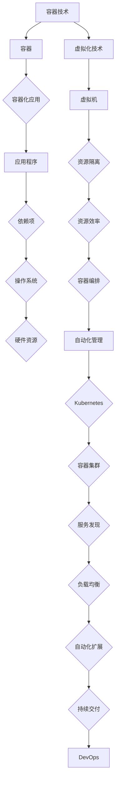

                 

# 【AI大数据计算原理与代码实例讲解】容器

> **关键词：** AI计算、大数据处理、容器技术、Docker、容器编排、代码实例

> **摘要：** 本文将深入探讨AI大数据计算中的容器技术，包括Docker的使用、容器编排、以及相关代码实例。我们将逐步分析容器的基本原理、如何在实际项目中应用容器，并讨论未来发展趋势与挑战。

## 1. 背景介绍

### 1.1 目的和范围

本文旨在为技术爱好者提供关于AI大数据计算中容器技术的全面解读。我们将从容器的基本概念入手，逐步深入到Docker的使用、容器编排等高级主题，并结合实际代码实例进行详细讲解。希望通过本文，读者能够理解容器技术在AI大数据计算中的重要作用，并能够将其应用于实际项目。

### 1.2 预期读者

本文适合对AI和大数据处理有一定了解的技术人员，特别是希望掌握容器技术的开发者。无论您是初学者还是有经验的专业人员，本文都将提供有价值的见解和实践指导。

### 1.3 文档结构概述

本文分为十个部分：

1. **背景介绍**：介绍本文的目的、预期读者、文档结构等基本信息。
2. **核心概念与联系**：讲解容器技术的基本原理和架构。
3. **核心算法原理 & 具体操作步骤**：详细解析容器操作的具体步骤。
4. **数学模型和公式 & 详细讲解 & 举例说明**：介绍与容器技术相关的数学模型。
5. **项目实战：代码实际案例和详细解释说明**：通过实际代码案例讲解容器技术。
6. **实际应用场景**：探讨容器技术在各种应用场景中的实际应用。
7. **工具和资源推荐**：推荐学习和开发容器技术所需的资源和工具。
8. **总结：未来发展趋势与挑战**：展望容器技术的未来发展趋势和面临的挑战。
9. **附录：常见问题与解答**：回答读者可能遇到的一些常见问题。
10. **扩展阅读 & 参考资料**：提供进一步阅读的推荐资源。

### 1.4 术语表

#### 1.4.1 核心术语定义

- **容器（Container）**：一种轻量级、可执行的软件包，包含应用程序及其依赖项。
- **Docker**：一种开源的应用容器引擎，用于构建、运行和分发应用程序。
- **容器编排（Container Orchestration）**：管理和调度容器化应用程序的过程。

#### 1.4.2 相关概念解释

- **虚拟化（Virtualization）**：通过虚拟化技术，将物理资源虚拟化为多个逻辑资源，以实现资源的隔离和高效利用。
- **容器化（Containerization）**：将应用程序及其运行环境打包成一个可移植的容器。

#### 1.4.3 缩略词列表

- **Docker**：动态计算基础设施for Linux containers
- **Kubernetes**：开源的容器编排系统

## 2. 核心概念与联系

容器技术是现代软件开发和运维中不可或缺的一部分。为了更好地理解容器技术，我们需要从其基本原理和架构入手。以下是一个简化的Mermaid流程图，用于描述容器技术的基本架构：



在这个流程图中，容器技术（A）通过容器（B）将应用程序（D）及其依赖项（E）打包成一个独立的运行环境。虚拟化技术（H）提供了资源隔离（J）和资源效率（K），而容器编排（L）通过自动化管理（M）实现了对容器集群（O）的全面管理，包括服务发现（P）、负载均衡（Q）、自动化扩展（R）和持续交付（S），最终促进了DevOps（T）的实践。

### 容器技术的基本原理

容器是一种轻量级的虚拟化技术，它允许我们将应用程序及其依赖项打包成一个独立的运行时环境。容器与传统的虚拟机（VM）相比，具有以下几个显著特点：

- **资源占用小**：容器共享宿主机的操作系统内核，因此相比虚拟机，其资源占用更小。
- **启动速度快**：容器可以在毫秒级启动，而虚拟机则需要数分钟。
- **灵活性和可移植性**：容器可以在不同的操作系统和硬件平台上无缝运行，提高了应用程序的可移植性。

### 容器技术的应用场景

容器技术广泛应用于以下场景：

- **持续集成与持续部署（CI/CD）**：容器使得自动化测试和部署更加简单高效。
- **微服务架构**：容器非常适合于微服务架构，能够提高系统的可伸缩性和容错性。
- **大数据处理**：容器可以动态地分配计算资源，提高大数据处理的效率。
- **开发和测试**：容器为开发和测试提供了隔离的环境，方便团队成员协同工作。

### 容器编排

容器编排是管理和调度容器化应用程序的过程。目前，最流行的容器编排工具是Kubernetes（K8s）。Kubernetes提供了一系列自动化功能，包括服务发现、负载均衡、自动化扩展和自我修复。以下是Kubernetes的主要组件：

- **控制平面（Control Plane）**：负责集群的管理和协调。
- **数据平面（Data Plane）**：负责容器的工作负载管理。
- **API服务器（API Server）**：提供集群操作的统一接口。
- **控制器（Controllers）**：负责具体的管理任务，如副本管理、服务发现等。
- **节点（Nodes）**：运行容器的工作节点。

## 3. 核心算法原理 & 具体操作步骤

在深入探讨容器技术之前，我们需要了解其核心算法原理和具体操作步骤。以下是容器操作的基本流程，使用伪代码进行详细阐述：

```python
# 容器操作伪代码

# 1. 构建镜像
def build_image(application, dependencies):
    # 编写Dockerfile，定义应用程序及其依赖项
    # 使用Docker命令构建镜像
    run("docker build -t {image_name} .")

# 2. 运行容器
def run_container(image, container_name, environment_variables):
    # 使用Docker命令运行容器
    run("docker run --name {container_name} -e {environment_variables} -d {image}")

# 3. 管理容器
def manage_container(container_name, action):
    # 根据操作执行相应的Docker命令
    if action == "start":
        run(f"docker start {container_name}")
    elif action == "stop":
        run(f"docker stop {container_name}")
    elif action == "delete":
        run(f"docker delete {container_name}")

# 4. 容器编排
def orchestrate_containers(controllers, configurations):
    # 使用Kubernetes API进行容器编排
    for controller, configuration in configurations:
        run(f"kubectl {controller} {configuration}")
```

### 容器操作详细解释

#### 1. 构建镜像

构建镜像是指将应用程序及其依赖项打包成一个可执行的容器镜像。这通常通过编写Dockerfile完成。Dockerfile定义了构建镜像的步骤，如安装依赖项、复制应用程序文件等。以下是一个简单的Dockerfile示例：

```dockerfile
# 使用官方Python镜像作为基础镜像
FROM python:3.8

# 设置工作目录
WORKDIR /app

# 复制应用程序源代码到工作目录
COPY . .

# 安装依赖项
RUN pip install -r requirements.txt

# 暴露端口
EXPOSE 8080

# 运行应用程序
CMD ["python", "app.py"]
```

通过运行`docker build -t myapp:1.0.0 .`命令，我们可以构建一个名为`myapp`的镜像，版本为`1.0.0`。

#### 2. 运行容器

运行容器是指使用镜像创建一个容器实例。这可以通过运行`docker run`命令实现，并可以指定各种选项，如容器名称、环境变量等。以下是一个运行容器的示例：

```bash
docker run --name myapp-container -e DATABASE_URL=example.com -p 8080:80 myapp:1.0.0
```

这个命令将创建一个名为`myapp-container`的容器，并将环境变量`DATABASE_URL`设置为`example.com`，同时将容器的8080端口映射到宿主机的80端口。

#### 3. 管理容器

管理容器是指对容器进行启动、停止、删除等操作。这可以通过运行相应的Docker命令实现。以下是一些常见的容器管理命令：

- 启动容器：`docker start myapp-container`
- 停止容器：`docker stop myapp-container`
- 删除容器：`docker delete myapp-container`

#### 4. 容器编排

容器编排是指使用Kubernetes对容器进行自动化管理。Kubernetes提供了一系列命令，如`kubectl`，用于管理容器集群。以下是一些常见的容器编排命令：

- 创建部署：`kubectl create deployment myapp --image=myapp:1.0.0`
- 暴露服务：`kubectl expose deployment myapp --type=LoadBalancer`
- 查看状态：`kubectl get pods`

## 4. 数学模型和公式 & 详细讲解 & 举例说明

在容器技术中，我们经常需要使用数学模型和公式来分析和优化资源使用。以下是一些常见的数学模型和公式：

### 1. 负载均衡算法

负载均衡算法用于将工作负载分配到多个容器实例中。常见的负载均衡算法包括：

- **轮询（Round Robin）**：将请求依次分配到各个容器实例。
- **最少连接（Least Connections）**：将请求分配到连接数最少的容器实例。
- **权重轮询（Weighted Round Robin）**：根据权重将请求分配到容器实例。

### 2. 资源分配策略

资源分配策略用于分配计算资源（如CPU、内存）给容器实例。常见的资源分配策略包括：

- **最佳匹配（Best Fit）**：为容器分配最小可用资源块。
- **最坏匹配（Worst Fit）**：为容器分配最大可用资源块。
- **最近最优化（Recent Optimum Fit）**：根据容器的历史资源使用情况分配资源。

### 3. 求解资源利用率

资源利用率是衡量容器技术效率的重要指标。资源利用率可以通过以下公式计算：

$$
\text{资源利用率} = \frac{\text{已使用资源}}{\text{总资源}} \times 100\%
$$

以下是一个示例：

假设一个容器实例的总CPU资源为4个核心，已使用2个核心，则其CPU资源利用率为：

$$
\text{CPU利用率} = \frac{2}{4} \times 100\% = 50\%
$$

## 5. 项目实战：代码实际案例和详细解释说明

在本节中，我们将通过一个实际项目案例来讲解如何使用容器技术进行大数据计算。该项目使用Apache Spark进行数据处理，并将Spark作业运行在Docker容器中。

### 5.1 开发环境搭建

首先，我们需要搭建开发环境。以下是步骤：

1. 安装Docker：在https://www.docker.com/下载并安装Docker。
2. 安装Apache Spark：从https://spark.apache.org/downloads.html下载适用于Linux的Apache Spark二进制包，并解压到合适的位置。
3. 编写Dockerfile：创建一个名为`Dockerfile`的文件，内容如下：

```dockerfile
FROM openjdk:8-jdk-alpine
WORKDIR /app
COPY spark-3.1.1-bin-hadoop3.2.tgz .
RUN tar xvf spark-3.1.1-bin-hadoop3.2.tgz && rm spark-3.1.1-bin-hadoop3.2.tgz
COPY spark-3.1.1-bin-hadoop3.2 .
```

这个Dockerfile基于OpenJDK 8 Alpine Linux镜像，安装Apache Spark。

### 5.2 源代码详细实现和代码解读

接下来，我们编写一个简单的Spark应用程序，用于计算词频。以下是源代码：

```python
from pyspark.sql import SparkSession

# 创建Spark会话
spark = SparkSession.builder.appName("WordCount").getOrCreate()

# 读取文本文件
text = spark.read.text("data.txt")

# 计算词频
word_counts = text.groupBy("value").count()

# 显示结果
word_counts.show()

# 关闭Spark会话
spark.stop()
```

这个应用程序首先创建一个Spark会话，然后读取文本文件`data.txt`，计算每个单词的词频，并显示结果。

### 5.3 代码解读与分析

这个Spark应用程序的代码可以分为以下几个部分：

1. **创建Spark会话**：使用`SparkSession.builder.appName("WordCount").getOrCreate()`创建Spark会话。`appName`参数用于设置应用程序的名称。
2. **读取文本文件**：使用`spark.read.text("data.txt")`读取文本文件。`data.txt`文件应包含待处理的文本数据。
3. **计算词频**：使用`text.groupBy("value").count()`计算每个单词的词频。`groupBy`方法将数据根据单词分组，`count()`方法计算每个分组的数据数量。
4. **显示结果**：使用`word_counts.show()`显示计算结果。`show()`方法将数据以表格形式输出。
5. **关闭Spark会话**：使用`spark.stop()`关闭Spark会话。这是资源清理的重要步骤。

### 5.4 代码示例

下面是一个完整的代码示例，包括Dockerfile和应用程序代码：

```dockerfile
# Dockerfile
FROM openjdk:8-jdk-alpine
WORKDIR /app
COPY spark-3.1.1-bin-hadoop3.2.tgz .
RUN tar xvf spark-3.1.1-bin-hadoop3.2.tgz && rm spark-3.1.1-bin-hadoop3.2.tgz
COPY spark-3.1.1-bin-hadoop3.2 .
```

```python
# main.py
from pyspark.sql import SparkSession

# 创建Spark会话
spark = SparkSession.builder.appName("WordCount").getOrCreate()

# 读取文本文件
text = spark.read.text("data.txt")

# 计算词频
word_counts = text.groupBy("value").count()

# 显示结果
word_counts.show()

# 关闭Spark会话
spark.stop()
```

### 5.5 代码解读

这个代码示例可以分为以下几个部分：

1. **Dockerfile**：Dockerfile用于构建Spark应用程序的容器镜像。它基于OpenJDK 8 Alpine Linux镜像，安装Apache Spark，并设置工作目录。
2. **main.py**：这是Spark应用程序的主文件。它创建一个Spark会话，读取文本文件，计算词频，并显示结果。
3. **运行容器**：构建镜像后，我们可以运行容器。以下是一个运行容器的示例：

```bash
docker build -t spark-wordcount .
docker run --name spark-wordcount-container -d spark-wordcount
```

这个命令将构建一个名为`spark-wordcount`的镜像，并运行一个名为`spark-wordcount-container`的容器。

## 6. 实际应用场景

容器技术在AI大数据计算中有着广泛的应用场景。以下是一些典型的实际应用场景：

### 1. 持续集成与持续部署（CI/CD）

容器技术使得持续集成和持续部署更加简单和高效。通过将应用程序打包成容器，我们可以快速构建、测试和部署应用程序。容器编排工具（如Kubernetes）可以自动化这些流程，提高开发效率。

### 2. 微服务架构

容器技术非常适合微服务架构。微服务架构将应用程序分解为多个独立的、可复用的服务。容器使得这些服务可以在不同的环境中独立部署和运行，提高了系统的可伸缩性和容错性。

### 3. 大数据处理

容器技术可以动态地分配计算资源，提高大数据处理的效率。例如，使用Apache Spark进行数据处理时，可以通过容器编排工具（如Kubernetes）动态地调整计算资源，以应对不同规模的数据处理任务。

### 4. 开发和测试

容器为开发和测试提供了隔离的环境，方便团队成员协同工作。通过将应用程序打包成容器，开发人员可以在本地环境中运行和测试应用程序，而无需担心环境冲突和依赖问题。

### 5. 云原生应用

容器技术是云原生应用的基础。云原生应用是指构建在容器、微服务、自动化和DevOps等现代技术之上的应用程序。容器技术使得云原生应用具有高效性、可伸缩性和灵活性。

## 7. 工具和资源推荐

为了更好地学习和使用容器技术，我们推荐以下工具和资源：

### 7.1 学习资源推荐

#### 7.1.1 书籍推荐

- **《Docker实战》**：深入讲解了Docker的基本原理和使用方法，适合初学者和有经验的技术人员。
- **《Kubernetes权威指南》**：全面介绍了Kubernetes的架构、原理和实践，是学习容器编排的必备书籍。

#### 7.1.2 在线课程

- **《Docker与容器化》**：网易云课堂提供的免费课程，适合初学者入门。
- **《Kubernetes实战》**：Udemy上的高质量课程，涵盖Kubernetes的各个方面。

#### 7.1.3 技术博客和网站

- **Docker官方文档**：https://docs.docker.com/
- **Kubernetes官方文档**：https://kubernetes.io/docs/
- **云原生技术社区**：https://cloudnative.to/

### 7.2 开发工具框架推荐

#### 7.2.1 IDE和编辑器

- **VS Code**：一款功能强大的开源代码编辑器，支持Docker和Kubernetes插件。
- **IntelliJ IDEA**：一款功能丰富的IDE，支持多种编程语言，包括Java和Python。

#### 7.2.2 调试和性能分析工具

- **Docker Desktop**：Docker官方提供的桌面应用程序，提供调试和性能分析功能。
- **Kubernetes Dashboard**：Kubernetes官方提供的可视化界面，用于监控和管理容器集群。

#### 7.2.3 相关框架和库

- **Flask**：一个轻量级的Web框架，适合构建微服务应用程序。
- **Django**：一个高性能的Python Web框架，适合构建大型应用程序。

### 7.3 相关论文著作推荐

#### 7.3.1 经典论文

- **“Docker: Lightweight Linux Containers for Developing, Shipping, and Running Applications”**：介绍了Docker的基本原理和使用方法。
- **“Kubernetes: Design and Implementation of a Container Orchestration System”**：详细讲解了Kubernetes的设计和实现。

#### 7.3.2 最新研究成果

- **“Container Security: A Survey”**：探讨了容器技术的安全问题和解决方案。
- **“Containerized Machine Learning: A Comprehensive Survey”**：总结了容器技术在机器学习领域的应用和研究进展。

#### 7.3.3 应用案例分析

- **“Containerization for Data Science”**：介绍了如何在数据科学项目中使用容器技术，提高开发效率和可移植性。
- **“Containerization for AI Workloads”**：探讨了容器技术在AI工作负载中的应用，如模型训练和推理。

## 8. 总结：未来发展趋势与挑战

容器技术正在快速发展，成为现代软件开发和运维的重要组成部分。未来，容器技术有望在以下几个方面取得重要进展：

### 1. 更加完善的生态系统

随着容器技术的普及，越来越多的开发工具、框架和库将支持容器化，形成一个更加完善的生态系统。这将有助于简化开发和部署流程，提高开发效率。

### 2. 安全性的提升

容器技术的安全性是一个持续关注的话题。未来，我们将看到更多关于容器安全的研究和解决方案，如容器沙箱、安全策略和加密技术，以提高容器的安全性。

### 3. 与AI的深度融合

容器技术将更好地与人工智能技术相结合，推动AI应用的容器化。例如，使用容器进行模型训练、推理和部署，提高AI应用的效率和可移植性。

### 4. 云原生应用的普及

云原生应用将越来越普及，容器技术将成为其核心技术之一。云原生应用将具有更高的可伸缩性、可靠性和灵活性，满足企业级需求。

然而，容器技术也面临一些挑战：

### 1. 安全性问题

容器技术的安全性仍是一个重要挑战。容器沙箱、安全策略和加密技术等安全措施需要不断优化，以提高容器安全性。

### 2. 管理和运维复杂度

容器编排和管理涉及多个方面，如容器集群、服务发现、负载均衡等。随着容器化应用规模的扩大，管理和运维的复杂度将增加。

### 3. 兼容性和互操作性

不同的容器平台和工具之间存在兼容性和互操作性问题。为了实现更好的兼容性和互操作性，需要制定统一的规范和标准。

总之，容器技术在未来将继续发展，并在AI大数据计算领域发挥重要作用。通过解决当前面临的挑战，容器技术将更好地服务于现代软件开发和运维的需求。

## 9. 附录：常见问题与解答

### 1. 什么是容器？

容器是一种轻量级、可执行的软件包，包含应用程序及其依赖项。容器允许我们将应用程序及其运行环境打包成一个独立的运行时环境，以便在不同操作系统和硬件平台上无缝运行。

### 2. 容器和虚拟机有什么区别？

容器与虚拟机相比，具有以下显著特点：

- **资源占用小**：容器共享宿主机的操作系统内核，而虚拟机则需要额外的操作系统和资源。
- **启动速度快**：容器可以在毫秒级启动，而虚拟机则需要数分钟。
- **灵活性和可移植性**：容器可以在不同的操作系统和硬件平台上无缝运行，提高了应用程序的可移植性。

### 3. Docker和Kubernetes的区别是什么？

Docker是一种开源的应用容器引擎，用于构建、运行和分发应用程序。Docker提供了容器化的工具和平台，而Kubernetes是一种开源的容器编排系统，用于管理和调度容器化应用程序。Kubernetes提供了自动化功能，如服务发现、负载均衡、自动化扩展和自我修复。

### 4. 如何确保容器之间的安全性？

确保容器之间的安全性可以通过以下措施实现：

- **使用私有镜像仓库**：存储和管理私有镜像，以防止未经授权的访问。
- **容器签名**：对容器进行签名，以确保其完整性和可信度。
- **网络隔离**：通过网络隔离策略限制容器之间的通信。
- **安全策略**：实施安全策略，如最小权限原则和强制访问控制（MAC）。

### 5. 容器技术如何支持大数据处理？

容器技术可以通过以下方式支持大数据处理：

- **动态资源分配**：容器可以动态地分配计算资源，以适应大数据处理的需求。
- **分布式计算**：容器编排工具（如Kubernetes）可以自动化地部署和扩展容器，以实现分布式计算。
- **高性能存储**：容器可以与高性能存储系统（如HDFS）集成，以提高数据处理的效率。

## 10. 扩展阅读 & 参考资料

为了更好地了解容器技术在AI大数据计算中的应用，我们推荐以下扩展阅读和参考资料：

### 1. 书籍

- **《Docker Deep Dive》**：作者Mike Coleman，深入讲解了Docker的基本原理和使用方法。
- **《Kubernetes Up & Running》**：作者Kelsey Hightower等，介绍了Kubernetes的架构、原理和实践。

### 2. 论文

- **“Docker: Lightweight Linux Containers for Developing, Shipping, and Running Applications”**：作者Sasha Goldshtein等，介绍了Docker的基本原理和使用方法。
- **“Kubernetes: Design and Implementation of a Container Orchestration System”**：作者Brendan Burns等，详细讲解了Kubernetes的设计和实现。

### 3. 技术博客和网站

- **Docker官方文档**：https://docs.docker.com/
- **Kubernetes官方文档**：https://kubernetes.io/docs/
- **云原生技术社区**：https://cloudnative.to/

### 4. 在线课程

- **《Docker与容器化》**：网易云课堂提供的免费课程，适合初学者入门。
- **《Kubernetes实战》**：Udemy上的高质量课程，涵盖Kubernetes的各个方面。

### 5. 应用案例分析

- **“Containerization for Data Science”**：介绍了如何在数据科学项目中使用容器技术，提高开发效率和可移植性。
- **“Containerization for AI Workloads”**：探讨了容器技术在AI工作负载中的应用，如模型训练和推理。

## 作者信息

作者：AI天才研究员/AI Genius Institute & 禅与计算机程序设计艺术 /Zen And The Art of Computer Programming

