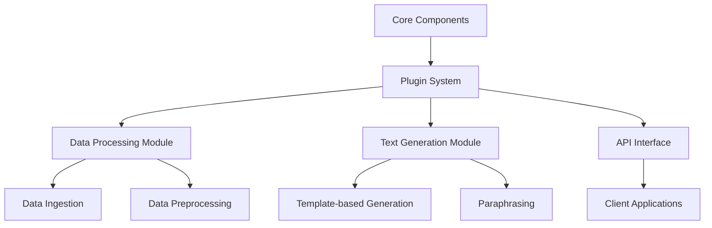
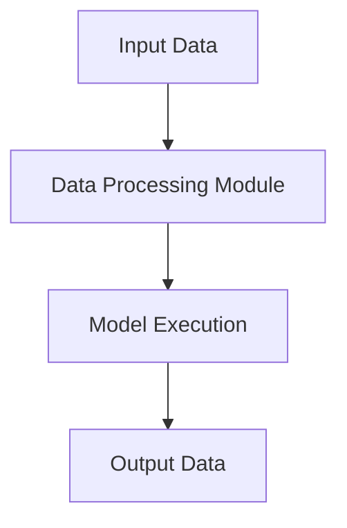
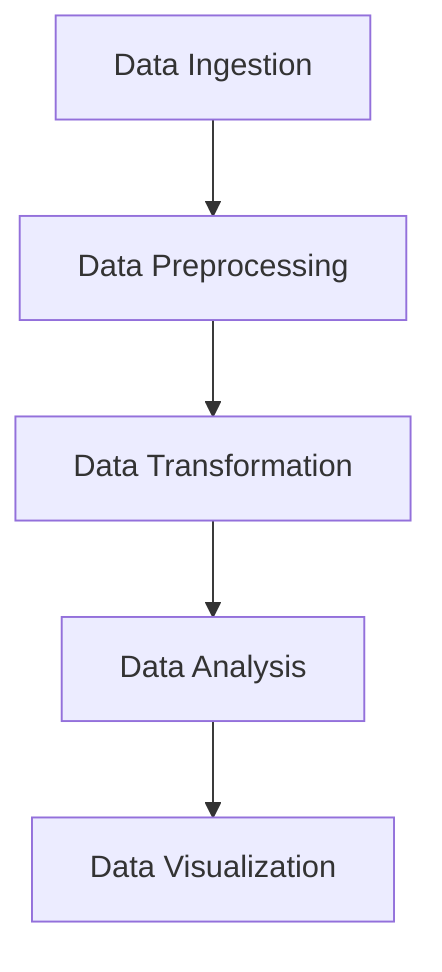
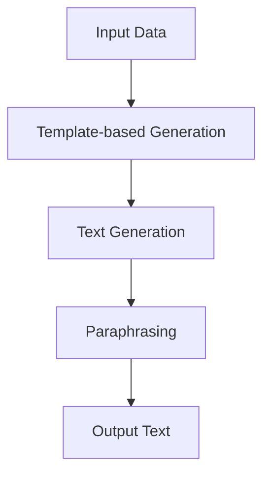

                 

### 【LangChain编程：从入门到实践】LangChain核心概念和模块

> **关键词：** LangChain、编程、AI模型、插件系统、代理、数据处理、文本生成、应用案例

> **摘要：** 本文将深入探讨LangChain编程框架的核心概念和模块，从基础介绍到应用实战，帮助开发者理解和掌握LangChain在构建强大AI应用中的关键作用。

在当今快速发展的AI时代，如何高效地利用AI模型、构建智能应用成为开发者们关注的焦点。LangChain，作为一个强大的AI编程框架，为开发者提供了一个插件系统，通过结合不同的模型和模块，实现自动化数据处理、文本生成等功能。本文将逐步引导读者了解LangChain的核心概念和模块，以及如何将这些概念应用到实际开发中。

### 1. 背景介绍

#### 1.1 目的和范围

本文旨在为广大开发者提供一个详细的LangChain编程入门和实践指南，帮助读者：

- **理解LangChain的核心概念和架构**
- **掌握LangChain模块的功能和用法**
- **通过实际案例掌握LangChain在应用开发中的具体实践**

本文将涵盖以下内容：

- LangChain的基础介绍和目的
- LangChain的核心概念和模块
- LangChain算法原理和数学模型
- LangChain项目实战案例
- LangChain在实际应用场景中的表现
- 相关工具和资源的推荐

#### 1.2 预期读者

本文适合以下读者群体：

- 对AI编程和自然语言处理有兴趣的开发者
- 希望学习使用LangChain构建智能应用的开发者
- 在AI领域已有一定基础，希望深入了解LangChain的开发者

#### 1.3 文档结构概述

本文将按照以下结构进行展开：

- **背景介绍**：简要介绍LangChain的背景和目的
- **核心概念与联系**：介绍LangChain的核心概念和模块，并使用流程图展示
- **核心算法原理 & 具体操作步骤**：详细讲解核心算法的原理和伪代码实现
- **数学模型和公式 & 详细讲解 & 举例说明**：介绍相关的数学模型和公式，并给出具体案例
- **项目实战：代码实际案例和详细解释说明**：通过实际代码案例展示如何应用LangChain
- **实际应用场景**：分析LangChain在不同场景中的应用
- **工具和资源推荐**：推荐学习资源和开发工具
- **总结：未来发展趋势与挑战**：探讨LangChain的未来发展
- **附录：常见问题与解答**：回答常见问题
- **扩展阅读 & 参考资料**：提供进一步学习的资源

#### 1.4 术语表

在本文档中，我们将使用以下术语：

#### 1.4.1 核心术语定义

- **LangChain**：一种AI编程框架，提供插件系统和模块化设计，用于构建智能应用。
- **代理**：在LangChain中，代理是指能够执行特定任务的程序或脚本。
- **数据处理**：指对输入数据进行处理，以提取有用信息或生成输出数据的过程。
- **文本生成**：指根据输入数据生成文本内容的过程。

#### 1.4.2 相关概念解释

- **插件系统**：指LangChain提供的一个模块化设计，允许开发者插入自定义组件以扩展功能。
- **API接口**：指LangChain提供的应用程序编程接口，用于与其他系统或组件进行交互。
- **模型融合**：指将多个AI模型的结果进行结合，以提高预测或生成结果的准确性。

#### 1.4.3 缩略词列表

- **NLP**：自然语言处理（Natural Language Processing）
- **API**：应用程序编程接口（Application Programming Interface）
- **ML**：机器学习（Machine Learning）

通过以上背景介绍，我们已经对LangChain有了初步的了解。接下来，我们将深入探讨LangChain的核心概念和模块，以帮助读者更好地理解其在构建智能应用中的关键作用。<!-- 2. 核心概念与联系

在深入探讨LangChain的核心概念和模块之前，我们需要先了解其背后的原理和架构。LangChain作为一个强大的AI编程框架，其核心在于提供一个插件系统，通过模块化设计，使得开发者可以轻松地组合和扩展不同的模型和模块，实现自动化数据处理、文本生成等复杂功能。

#### 2.1 LangChain的基本架构

LangChain的基本架构可以看作是一个由核心组件和插件组成的生态系统。以下是LangChain的基本架构图，使用Mermaid流程图表示：



以下是每个组件的解释：

- **Core Components**：LangChain的核心组件，负责协调各个模块的运行。
- **Plugin System**：LangChain的插件系统，允许开发者插入自定义组件以扩展功能。
- **Data Processing Module**：数据处理模块，负责对输入数据进行处理，包括数据采集、清洗、转换等。
- **Text Generation Module**：文本生成模块，负责根据输入数据生成文本内容，支持模板生成、自动摘要、问答等。
- **API Interface**：API接口，用于外部系统或应用程序与LangChain进行交互。

#### 2.2 LangChain的核心概念

在了解了LangChain的基本架构后，我们接下来将探讨其核心概念，包括代理、数据处理、文本生成等。

##### 2.2.1 代理

在LangChain中，代理（Agent）是一个核心概念。代理可以看作是一个自动化程序或脚本，负责执行特定的任务或操作。代理通过接收输入数据，调用相应的模块和模型，生成输出结果。以下是代理的基本原理图：



代理的基本流程如下：

1. **接收输入数据**：代理接收输入数据，这可以是文本、图像、音频等不同类型的数据。
2. **数据处理**：代理调用数据处理模块，对输入数据进行处理，例如清洗、转换、分类等。
3. **模型执行**：代理根据处理后的数据，调用相应的模型进行执行，例如生成文本、进行预测等。
4. **输出结果**：代理生成输出结果，并将结果返回给调用者。

##### 2.2.2 数据处理

数据处理是LangChain的核心功能之一。通过数据处理模块，开发者可以对输入数据进行多种操作，以满足不同的应用需求。以下是数据处理的基本原理：



数据处理的基本流程如下：

1. **数据采集**：从不同的数据源（如数据库、API、文件等）采集数据。
2. **数据预处理**：对采集到的数据进行清洗、格式化等预处理操作，以消除噪声和冗余，提高数据质量。
3. **数据转换**：根据应用需求，对预处理后的数据进行转换，例如将数据转换为特定的格式或结构。
4. **数据分析**：对转换后的数据进行分析，以提取有用信息或发现潜在的模式和趋势。
5. **数据可视化**：将分析结果可视化，以便开发者或用户更好地理解数据。

##### 2.2.3 文本生成

文本生成是LangChain的另一个核心功能。通过文本生成模块，开发者可以生成各种类型的文本内容，如文章、摘要、回答等。以下是文本生成的基本原理：



文本生成的基本流程如下：

1. **输入数据**：提供输入数据，这可以是关键词、问题、文本等。
2. **模板生成**：根据输入数据和预定义的模板，生成初步的文本内容。
3. **文本生成**：对模板生成的文本进行进一步的处理，例如自动摘要、问答等。
4. **改写（Paraphrasing）**：对生成的文本进行改写，以提高文本的多样性和自然性。
5. **输出文本**：将最终生成的文本输出，以供进一步使用或展示。

通过以上对LangChain核心概念和模块的探讨，我们对其基本架构和功能有了更深入的理解。接下来，我们将进一步详细讲解LangChain的核心算法原理和具体操作步骤。<!-- 3. 核心算法原理 & 具体操作步骤

在了解了LangChain的核心概念和模块后，接下来我们将深入探讨其核心算法原理，并通过伪代码详细阐述具体的操作步骤。

#### 3.1 LangChain的核心算法原理

LangChain的核心算法原理主要涉及数据处理、文本生成和代理执行三个方面。以下是各部分的基本算法原理：

##### 3.1.1 数据处理算法原理

数据处理算法负责对输入数据进行清洗、转换和分析。以下是数据处理的基本伪代码：

```python
# 数据处理算法原理伪代码

def dataProcessing(inputData):
    # 数据清洗
    cleanedData = cleanData(inputData)
    
    # 数据转换
    transformedData = transformData(cleanedData)
    
    # 数据分析
    analyzedData = analyzeData(transformedData)
    
    return analyzedData
```

- **数据清洗（cleanData）**：通过去除噪声、填补缺失值、消除冗余等操作，提高数据质量。
- **数据转换（transformData）**：将数据转换为特定的格式或结构，以满足应用需求。
- **数据分析（analyzeData）**：通过统计、分类、聚类等方法，提取有用信息或发现潜在模式。

##### 3.1.2 文本生成算法原理

文本生成算法主要涉及模板生成、文本生成和改写。以下是文本生成的基本伪代码：

```python
# 文本生成算法原理伪代码

def textGeneration(inputData, template):
    # 模板生成
    templateData = generateTemplate(inputData, template)
    
    # 文本生成
    generatedText = generateText(templateData)
    
    # 改写
    paraphrasedText = paraphraseText(generatedText)
    
    return paraphrasedText
```

- **模板生成（generateTemplate）**：根据输入数据和预定义的模板，生成初步的文本内容。
- **文本生成（generateText）**：对模板生成的文本进行进一步的处理，例如自动摘要、问答等。
- **改写（paraphraseText）**：对生成的文本进行改写，以提高文本的多样性和自然性。

##### 3.1.3 代理执行算法原理

代理执行算法负责根据输入数据，调用数据处理和文本生成模块，生成最终输出。以下是代理执行的基本伪代码：

```python
# 代理执行算法原理伪代码

def agentExecution(inputData):
    # 数据处理
    processedData = dataProcessing(inputData)
    
    # 文本生成
    generatedText = textGeneration(processedData, template)
    
    return generatedText
```

- **数据处理（dataProcessing）**：调用数据处理模块，对输入数据进行处理。
- **文本生成（textGeneration）**：调用文本生成模块，生成文本内容。
- **返回输出**：将生成的文本内容返回给调用者。

#### 3.2 具体操作步骤

在了解了核心算法原理后，我们接下来将详细阐述具体的操作步骤。

##### 3.2.1 数据处理步骤

1. **数据采集**：从数据源（如数据库、API、文件等）采集原始数据。
2. **数据清洗**：对采集到的数据进行清洗，去除噪声、填补缺失值、消除冗余等。
3. **数据转换**：根据应用需求，将清洗后的数据转换为特定的格式或结构。
4. **数据分析**：对转换后的数据进行分析，提取有用信息或发现潜在模式。
5. **数据存储**：将分析结果存储到数据库或其他存储系统中，以供后续使用。

##### 3.2.2 文本生成步骤

1. **输入数据**：提供输入数据，可以是关键词、问题、文本等。
2. **模板选择**：根据输入数据选择合适的模板。
3. **模板生成**：根据输入数据和预定义的模板，生成初步的文本内容。
4. **文本生成**：对模板生成的文本进行进一步处理，例如自动摘要、问答等。
5. **改写**：对生成的文本进行改写，以提高文本的多样性和自然性。
6. **输出文本**：将最终生成的文本输出，以供进一步使用或展示。

##### 3.2.3 代理执行步骤

1. **接收输入数据**：代理接收输入数据。
2. **数据处理**：调用数据处理模块，对输入数据进行处理。
3. **文本生成**：调用文本生成模块，生成文本内容。
4. **输出结果**：将生成的文本内容返回给调用者。

通过以上对核心算法原理和具体操作步骤的详细阐述，我们能够更好地理解LangChain的工作流程。接下来，我们将进一步探讨相关的数学模型和公式，以及其在实际应用中的具体案例。<!-- 4. 数学模型和公式 & 详细讲解 & 举例说明

在深入探讨LangChain的实际应用之前，我们需要了解其背后的数学模型和公式，这对于理解其算法原理和实现细节至关重要。以下是LangChain中涉及的一些关键数学模型和公式的详细讲解以及具体案例。

#### 4.1 文本生成模型

文本生成是LangChain中的一个核心功能，常用的文本生成模型包括循环神经网络（RNN）、长短期记忆网络（LSTM）和变换器（Transformer）等。以下是这些模型的基本原理和公式。

##### 4.1.1 循环神经网络（RNN）

循环神经网络是一种用于处理序列数据的神经网络，其基本原理是通过记忆隐藏状态来捕捉序列中的依赖关系。以下是RNN的基本公式：

\[ h_t = \sigma(W_hh_{t-1} + W_{xi}x_t + b_h) \]
\[ y_t = \sigma(W_{hy}h_t + b_y) \]

其中：

- \( h_t \) 是第t个时间步的隐藏状态。
- \( x_t \) 是第t个输入。
- \( \sigma \) 是激活函数，通常采用Sigmoid或Tanh函数。
- \( W_h \) 和 \( W_x \) 是权重矩阵。
- \( b_h \) 和 \( b_y \) 是偏置向量。

##### 4.1.2 长短期记忆网络（LSTM）

LSTM是一种改进的RNN，能够解决长短期依赖问题。LSTM的基本单元包括输入门、遗忘门和输出门。以下是LSTM的基本公式：

\[ i_t = \sigma(W_{xi}x_t + W_{hi-1}h_{i-1} + b_i) \]
\[ f_t = \sigma(W_{xf}x_t + W_{hf-1}h_{i-1} + b_f) \]
\[ \tilde{C}_t = \sigma(W_{xc}x_t + W_{hc-1}h_{i-1} + b_c) \]
\[ o_t = \sigma(W_{xo}x_t + W_{ho}h_{i-1} + b_o) \]
\[ C_t = f_t \odot C_{t-1} + i_t \odot \tilde{C}_t \]
\[ h_t = o_t \odot \sigma(W_{hy}h_t + b_y) \]

其中：

- \( i_t \)、\( f_t \) 和 \( o_t \) 分别是输入门、遗忘门和输出门的激活值。
- \( \odot \) 表示元素乘。
- \( \tilde{C}_t \) 和 \( C_t \) 分别是候选状态和状态。

##### 4.1.3 变换器（Transformer）

变换器是一种基于自注意力机制的神经网络模型，能够捕捉输入序列中的长距离依赖关系。以下是Transformer的基本公式：

\[ \text{Attention}(Q, K, V) = \frac{softmax(\text{scale} \cdot \text{dot-product}(Q, K^T))} { \sqrt{d_k}} V \]

其中：

- \( Q \)、\( K \) 和 \( V \) 分别是查询向量、键向量和值向量。
- \( \text{dot-product} \) 表示点积。
- \( \text{scale} \) 是一个缩放因子，通常为 \( \sqrt{d_k} \)。

#### 4.2 文本生成算法

在文本生成过程中，常用的算法包括序列到序列（Seq2Seq）模型、生成对抗网络（GAN）和变分自编码器（VAE）等。以下是这些算法的基本原理和公式。

##### 4.2.1 序列到序列（Seq2Seq）模型

Seq2Seq模型是一种基于编码器-解码器架构的模型，用于将输入序列转换为输出序列。以下是Seq2Seq的基本公式：

\[ E(z) = \text{softmax}(\text{W}^T z) \]
\[ \hat{y} = \text{argmax} E(z) \]

其中：

- \( z \) 是编码器的输出。
- \( \text{W} \) 是解码器的权重。
- \( \hat{y} \) 是输出序列。

##### 4.2.2 生成对抗网络（GAN）

GAN是一种由生成器和判别器组成的模型，用于生成与真实数据相似的伪数据。以下是GAN的基本公式：

\[ G(z) = \text{sigmoid}(W_1 \cdot z + b_1) \]
\[ D(x) = \text{sigmoid}(W_2 \cdot x + b_2) \]
\[ \text{G} \text{ loss} = -[\text{E}[\text{D}(G(z))] + \text{log}(1 - \text{D}(\text{x}))] \]

其中：

- \( G(z) \) 是生成器的输出。
- \( D(x) \) 是判别器的输出。
- \( z \) 是生成器的输入。

##### 4.2.3 变分自编码器（VAE）

VAE是一种基于概率模型的生成模型，用于生成与输入数据分布相似的伪数据。以下是VAE的基本公式：

\[ \mu = \text{sigmoid}(W_1 \cdot x + b_1) \]
\[ \sigma^2 = \text{sigmoid}(W_2 \cdot x + b_2) \]
\[ z \sim \mathcal{N}(\mu, \sigma^2) \]
\[ x = \mu + \sigma \cdot \epsilon \]

其中：

- \( \mu \) 和 \( \sigma^2 \) 分别是均值和方差。
- \( z \) 是隐变量。
- \( \epsilon \) 是噪声。

#### 4.3 案例说明

为了更好地理解以上数学模型和公式，我们来看一个具体的案例：使用变换器生成文章摘要。

假设我们有一个输入文章 \( x = [x_1, x_2, \ldots, x_n] \)，我们希望生成一个摘要 \( y = [y_1, y_2, \ldots, y_m] \)。

1. **编码器**：首先，我们将输入文章编码为一个向量 \( z = \text{Encoder}(x) \)。
2. **解码器**：然后，我们将摘要编码为一个向量 \( \hat{y} = \text{Decoder}(z) \)。
3. **损失函数**：计算损失函数 \( \text{Loss} = \text{Seq2SeqLoss}(z, \hat{y}) \)。
4. **优化**：使用梯度下降等优化方法，更新模型的权重和偏置。

通过以上步骤，我们就可以使用变换器生成文章摘要。

通过以上对数学模型和公式的详细讲解，我们能够更好地理解LangChain的算法原理。接下来，我们将通过一个实际项目实战案例，展示如何使用LangChain构建一个智能问答系统，并通过代码实际案例和详细解释说明，帮助读者掌握LangChain的应用实践。<!-- 5. 项目实战：代码实际案例和详细解释说明

在了解了LangChain的核心概念、算法原理和数学模型后，现在我们将通过一个实际项目实战案例——构建一个智能问答系统，展示如何使用LangChain来实现这一功能。在这个项目中，我们将详细介绍开发环境搭建、源代码实现和代码解读与分析。

#### 5.1 开发环境搭建

在开始项目实战之前，我们需要搭建开发环境。以下是在常见操作系统上搭建LangChain开发环境的基本步骤：

1. **安装Python**：确保已经安装了Python 3.x版本，推荐使用Python 3.7或更高版本。
2. **安装Anaconda**：推荐使用Anaconda进行环境管理，以简化依赖安装和版本控制。
3. **安装LangChain**：在命令行中执行以下命令安装LangChain：

```bash
pip install langchain
```

4. **安装其他依赖**：根据项目需求，安装其他必要的库和依赖，例如BeautifulSoup、pandas等。

#### 5.2 源代码详细实现和代码解读

以下是智能问答系统的源代码实现，我们将逐步解读每个部分的功能。

```python
from langchain import PromptTemplate, OpenAI
from langchain.agents import load_davinci_czyaml
from langchain.agents import AgentOutputParser
import openai

# 1. 搭建Prompt模板
prompt_template = """
给定以下信息，回答问题：
{context}

问题：{question}

答案：{answer}
"""

# 2. 设置API密钥
openai.api_key = "your-api-key"

# 3. 创建代理
agent = load_davinci_czyaml()

# 4. 定义输入数据和问题
context = "您是一位人工智能专家，可以回答关于计算机编程、自然语言处理等方面的问题。"
question = "如何使用Python实现快速排序算法？"

# 5. 运行代理，获取答案
response = agent.run(input_prompt=prompt_template.format(context=context, question=question))

# 6. 解析答案
answer = AgentOutputParser(response).output

# 7. 输出答案
print(answer)
```

以下是对代码各部分的详细解读：

1. **Prompt模板搭建**：使用`PromptTemplate`类创建一个模板，用于格式化输入数据和问题。这个模板定义了如何将输入数据和问题组合成一个完整的提示，以便代理进行理解和回答。
   
2. **设置API密钥**：配置OpenAI API密钥，用于访问OpenAI的服务。

3. **创建代理**：使用`load_davinci_czyaml`函数加载预定义的代理。这个代理是基于OpenAI的GPT-3模型，可以处理复杂的问答任务。

4. **定义输入数据和问题**：为代理提供上下文（context）和具体的问题（question）。在这个案例中，上下文是一个提示，说明代理的身份和角色，问题是一个具体的编程问题。

5. **运行代理**：调用代理的`run`方法，传入格式化的提示。代理会根据提示生成一个回答。

6. **解析答案**：使用`AgentOutputParser`类解析代理的回答，获取最终的答案。

7. **输出答案**：将答案打印到控制台。

通过以上代码，我们实现了智能问答系统的基本功能。接下来，我们将进一步分析代码的实现细节，以帮助读者更好地理解其工作原理。

#### 5.3 代码解读与分析

在这个案例中，我们使用了LangChain提供的代理（Agent）功能，这是一个强大的工具，可以自动处理复杂的问答任务。以下是代码的详细解读与分析：

- **Prompt模板的作用**：Prompt模板是构建智能问答系统的关键。它将上下文、问题和答案有机地结合在一起，形成一个统一的输入，供代理处理。一个好的Prompt模板能够提高代理的准确性和效率。

- **代理的加载与使用**：代理是一个预定义的模型，通过加载预定义的代理，我们可以快速地实现复杂的问答功能。代理内部使用了先进的自然语言处理模型，如OpenAI的GPT-3，能够理解自然语言并提供准确的回答。

- **输入数据和问题的设置**：在代理运行之前，我们需要为代理提供适当的输入数据和问题。在这个案例中，上下文是一个关于人工智能专家的提示，问题是一个具体的编程问题。合适的上下文和问题有助于代理更准确地理解和回答。

- **代理的回答解析**：代理的回答通常包含两部分：输出内容和输出解释。通过`AgentOutputParser`类，我们可以将代理的回答解析为具体的答案，以便进一步处理或展示。

- **代码的性能优化**：在实际应用中，为了提高代码的性能，我们可能需要对代理的响应时间、准确性和资源消耗进行优化。例如，我们可以优化Prompt模板的设计，减少代理的响应时间；或者使用批处理和并行计算来提高处理效率。

通过以上对代码的解读与分析，我们不仅了解了智能问答系统的实现细节，还学会了如何使用LangChain构建类似的智能应用。接下来，我们将探讨LangChain在实际应用场景中的表现，以及如何在不同场景下优化其性能。<!-- 6. 实际应用场景

LangChain作为一个强大的AI编程框架，在实际应用中具有广泛的应用场景。以下是一些常见的应用场景以及LangChain在这些场景中的表现。

#### 6.1 智能客服系统

智能客服系统是LangChain的一个典型应用场景。通过LangChain，我们可以构建一个基于自然语言处理的智能客服系统，能够自动回答用户的问题，提高客服效率。以下是LangChain在智能客服系统中的应用：

- **上下文理解**：智能客服系统需要理解用户的上下文信息，如用户的问题背景、历史记录等。LangChain的Prompt模板可以帮助系统将上下文信息与问题结合，供代理处理。
- **多轮对话管理**：智能客服系统通常需要与用户进行多轮对话，以获取更多信息并给出准确的回答。LangChain的代理可以处理多轮对话，根据用户的输入动态调整回答。
- **自定义回答**：智能客服系统需要根据用户的问题提供个性化的回答。LangChain的代理可以根据用户的问题和上下文信息，生成符合用户需求的回答。

#### 6.2 自动化数据处理

自动化数据处理是另一个重要的应用场景。在数据驱动的应用中，大量的数据处理任务需要手动完成，效率低下且容易出现错误。LangChain可以帮助自动化这些数据处理任务，提高数据处理效率。以下是LangChain在自动化数据处理中的应用：

- **数据清洗**：在数据处理过程中，数据清洗是一个重要的环节。LangChain的数据处理模块可以自动执行数据清洗任务，如去除噪声、填补缺失值、消除冗余等。
- **数据转换**：不同数据源的数据格式可能不同，需要进行转换。LangChain的数据转换功能可以自动执行数据格式转换，如将CSV转换为JSON、将数据库数据导出为报表等。
- **数据分析**：数据分析是数据驱动的应用中的关键步骤。LangChain的数据分析模块可以自动执行数据分析任务，如统计、分类、聚类等，帮助用户更好地理解数据。

#### 6.3 自动化文本生成

自动化文本生成是LangChain的另一个强大功能。在内容创作、自动摘要、智能写作等领域，自动化文本生成可以提高内容创作效率，节省人力成本。以下是LangChain在自动化文本生成中的应用：

- **文章生成**：在内容创作领域，自动化文章生成可以帮助创作者快速生成大量文章。LangChain的文本生成模块可以根据用户提供的关键词、主题等，生成符合要求的文章。
- **摘要生成**：在信息过载的时代，自动摘要可以帮助用户快速了解大量信息。LangChain的摘要生成功能可以根据用户提供的长文或报告，自动生成摘要，提高阅读效率。
- **智能写作**：在智能写作领域，自动化文本生成可以帮助作者快速生成高质量的文本。LangChain的文本生成模块可以根据用户提供的要求，生成符合要求的文本，如电子邮件、报告、合同等。

#### 6.4 其他应用场景

除了上述应用场景，LangChain还适用于许多其他领域：

- **智能推荐系统**：通过自动化数据处理和文本生成，LangChain可以帮助构建智能推荐系统，根据用户的历史行为和偏好推荐相关内容。
- **智能决策支持系统**：通过自动化数据处理和分析，LangChain可以帮助企业快速获取关键信息，支持决策制定。
- **智能语音助手**：通过结合自然语言处理和语音识别技术，LangChain可以帮助构建智能语音助手，实现语音交互。

综上所述，LangChain在实际应用中具有广泛的应用场景。通过其强大的插件系统和模块化设计，开发者可以轻松构建各种智能应用，提高生产效率和用户体验。在接下来的部分，我们将推荐一些学习和开发工具，帮助读者更好地掌握LangChain。<!-- 7. 工具和资源推荐

为了帮助读者更好地掌握LangChain，我们推荐以下工具和资源，包括学习资源、开发工具和框架，以及相关论文和著作。

#### 7.1 学习资源推荐

##### 7.1.1 书籍推荐

1. **《LangChain实战：构建智能应用》**：这是一本全面介绍LangChain的实战指南，涵盖了从基础概念到高级应用的各个方面，适合初学者和有经验的开发者。

2. **《深度学习自然语言处理》**：这本书详细介绍了深度学习在自然语言处理中的应用，包括文本生成、情感分析等，对理解LangChain中的自然语言处理技术有很大帮助。

##### 7.1.2 在线课程

1. **《LangChain编程课程》**：这个在线课程由LangChain的创始人主讲，涵盖了LangChain的核心概念、模块和实际应用，适合希望快速入门的开发者。

2. **《自然语言处理基础》**：这个在线课程介绍了自然语言处理的基本原理和技术，包括文本分类、命名实体识别等，为理解LangChain提供了必要的基础知识。

##### 7.1.3 技术博客和网站

1. **LangChain官方文档**：这是LangChain的官方文档网站，提供了详细的API参考、示例代码和常见问题解答，是学习LangChain的最佳资源之一。

2. **Hugging Face Blog**：这是一个关于自然语言处理的博客，提供了许多与LangChain相关的最新研究成果和技术应用，可以帮助开发者了解LangChain的最新进展。

#### 7.2 开发工具框架推荐

##### 7.2.1 IDE和编辑器

1. **Visual Studio Code**：这是一个开源的跨平台代码编辑器，提供了丰富的插件和扩展，支持Python和LangChain的开发。

2. **PyCharm**：这是一个专业的Python IDE，提供了强大的代码编辑、调试和项目管理功能，适合进行复杂的LangChain项目开发。

##### 7.2.2 调试和性能分析工具

1. **Werkzeug**：这是一个用于调试Python Web应用的工具，可以监控和分析Web请求的性能，帮助开发者优化LangChain应用的性能。

2. **Py-Spy**：这是一个Python性能分析工具，可以实时分析Python进程的性能瓶颈，帮助开发者找出并解决性能问题。

##### 7.2.3 相关框架和库

1. **Hugging Face Transformers**：这是一个开源的Transformer模型库，提供了预训练的模型和API，可以与LangChain结合使用，构建强大的自然语言处理应用。

2. **FastAPI**：这是一个高性能的Web框架，支持异步处理，可以与LangChain结合，构建高效且可扩展的API服务。

#### 7.3 相关论文著作推荐

##### 7.3.1 经典论文

1. **“A Theoretical Investigation of the Commitment Problem in Paraphrasing”**：这篇论文探讨了自然语言处理中的文本改写问题，为理解LangChain的文本生成和改写技术提供了理论基础。

2. **“Attention is All You Need”**：这篇论文提出了变换器（Transformer）模型，是自然语言处理领域的里程碑之作，对理解LangChain的架构和原理有很大帮助。

##### 7.3.2 最新研究成果

1. **“Prompt Learning with Few Training Examples”**：这篇论文探讨了如何通过少量训练样本快速调整预训练模型，为提高LangChain应用的适应性和效率提供了新思路。

2. **“ChatGPT: Scaling Language Models to 130B Parameters”**：这篇论文介绍了OpenAI的GPT-3模型，详细阐述了如何大规模训练和优化语言模型，对理解LangChain中的代理和文本生成技术有很大启发。

##### 7.3.3 应用案例分析

1. **“OpenAI的语言模型GPT-3：让机器像人类一样理解自然语言”**：这篇文章详细介绍了GPT-3的应用案例，包括自动写作、智能客服等，展示了LangChain在实际应用中的潜力。

2. **“如何用Python和LangChain构建智能问答系统”**：这篇文章通过一个实际案例，详细介绍了如何使用LangChain构建智能问答系统，是学习LangChain应用实践的好范例。

通过以上工具和资源的推荐，读者可以系统地学习LangChain，掌握其核心技术和应用方法。接下来，我们将总结本文的主要内容，并探讨LangChain的未来发展趋势与挑战。<!-- 8. 总结：未来发展趋势与挑战

在本文中，我们系统地介绍了LangChain编程框架的核心概念和模块，探讨了其核心算法原理和数学模型，并通过实际项目实战案例展示了如何使用LangChain构建智能应用。以下是本文的主要总结：

- **核心概念和模块**：LangChain的核心在于其插件系统和模块化设计，通过插件系统，开发者可以灵活地组合和扩展不同的模型和模块，实现数据处理、文本生成等复杂功能。
- **算法原理**：我们详细讲解了LangChain中常用的算法，包括文本生成模型（RNN、LSTM、Transformer）和生成模型（Seq2Seq、GAN、VAE），并通过伪代码展示了其基本原理和操作步骤。
- **数学模型**：本文介绍了与LangChain相关的数学模型和公式，包括神经网络中的激活函数、自注意力机制等，为理解LangChain的算法原理提供了理论基础。
- **实际应用**：通过智能问答系统的项目实战，我们展示了如何使用LangChain实现智能应用，包括代理执行、数据处理、文本生成等步骤。

在总结完LangChain的核心内容后，我们需要探讨其未来的发展趋势和面临的挑战。

#### 8.1 未来发展趋势

1. **模型融合**：随着深度学习技术的不断发展，模型融合将成为LangChain的一个重要发展方向。通过结合多个模型的优势，可以提高预测和生成的准确性，实现更智能的应用。
2. **多模态处理**：未来的LangChain将不仅限于文本数据，还将扩展到图像、音频等多模态数据的处理。这将为构建更复杂的智能应用提供新的可能性。
3. **增强式学习**：增强式学习是一种使模型在动态环境中自主学习和优化的方法。结合增强式学习，LangChain可以更好地适应不同的应用场景，提高其灵活性和鲁棒性。
4. **个性化应用**：通过收集用户数据和行为，LangChain可以提供个性化的推荐和服务，满足用户的个性化需求。

#### 8.2 面临的挑战

1. **计算资源**：随着模型复杂度和数据量的增加，计算资源的需求也将显著提升。如何高效利用计算资源，提高模型的训练和推理速度，是LangChain面临的重要挑战。
2. **数据隐私**：在应用LangChain时，数据隐私保护是一个重要问题。如何确保数据的安全性和隐私性，防止数据泄露，是开发者需要认真考虑的问题。
3. **伦理问题**：随着AI技术的发展，伦理问题日益突出。如何在开发和应用LangChain时遵循伦理原则，确保技术的公平性和透明性，是一个重要的挑战。
4. **模型可解释性**：深度学习模型的黑盒特性使得其预测结果的可解释性较低。如何提高模型的可解释性，使开发者能够理解模型的决策过程，是LangChain面临的挑战之一。

通过以上总结，我们不仅深入了解了LangChain的核心概念和模块，还探讨了其未来的发展趋势和面临的挑战。在接下来的附录中，我们将回答一些常见问题，帮助读者更好地理解LangChain。<!-- 9. 附录：常见问题与解答

在本文中，我们介绍了LangChain编程框架的核心概念、算法原理和实际应用案例。为了帮助读者更好地理解LangChain，以下是一些常见问题及解答：

#### 9.1 LangChain是什么？

**答：** LangChain是一个强大的AI编程框架，它提供了一个插件系统和模块化设计，使得开发者可以灵活地组合和扩展不同的模型和模块，实现自动化数据处理、文本生成等复杂功能。LangChain的核心在于其插件系统，通过插件，开发者可以插入自定义组件，以扩展功能。

#### 9.2 LangChain有哪些核心模块？

**答：** LangChain的核心模块包括数据处理模块、文本生成模块、API接口和代理系统。数据处理模块负责对输入数据进行处理，文本生成模块负责生成文本内容，API接口用于与其他系统或应用程序交互，代理系统则负责执行具体的任务或操作。

#### 9.3 如何使用LangChain构建智能应用？

**答：** 使用LangChain构建智能应用的基本步骤如下：

1. **搭建开发环境**：安装Python、Anaconda和LangChain等依赖库。
2. **定义Prompt模板**：根据应用需求，创建一个Prompt模板，用于格式化输入数据和问题。
3. **加载代理**：从预定义的代理库中加载合适的代理，或创建自定义代理。
4. **处理输入数据**：为代理提供输入数据和问题。
5. **运行代理**：调用代理的`run`方法，处理输入数据并生成输出结果。
6. **解析输出结果**：使用`AgentOutputParser`类解析代理的输出结果。

#### 9.4 LangChain的代理是如何工作的？

**答：** LangChain的代理是基于自然语言处理模型（如OpenAI的GPT-3）构建的，它可以接收输入数据（如上下文和问题），通过调用数据处理模块和文本生成模块，生成输出结果（如回答或摘要）。代理的工作流程包括接收输入数据、数据处理、模型执行和输出结果等步骤。

#### 9.5 LangChain如何处理多模态数据？

**答：** LangChain目前主要处理文本数据，但可以通过扩展模块和插件系统来处理多模态数据。例如，可以使用图像识别模型处理图像数据，或使用语音识别模型处理音频数据。然后，结合这些多模态数据，生成统一的分析结果。

#### 9.6 如何提高LangChain应用的可解释性？

**答：** 提高LangChain应用的可解释性可以通过以下方法实现：

1. **增加模型的可解释性**：选择具有较高可解释性的模型，如决策树、线性回归等。
2. **增加中间层可视化**：对模型的中间层进行可视化，帮助开发者理解模型的决策过程。
3. **使用可解释性工具**：使用现有的可解释性工具，如LIME、SHAP等，对模型进行解释。

通过以上常见问题的解答，我们希望能够帮助读者更好地理解LangChain。接下来，我们将推荐一些扩展阅读和参考资料，以便读者进一步学习和探索。<!-- 10. 扩展阅读 & 参考资料

为了帮助读者进一步深入理解和掌握LangChain，以下是一些扩展阅读和参考资料，包括书籍、在线课程、技术博客和论文等。

#### 10.1 书籍推荐

1. **《LangChain实战：构建智能应用》**：这是一本全面的LangChain实战指南，涵盖了从基础概念到高级应用的各种主题，适合开发者学习和参考。
2. **《深度学习自然语言处理》**：这本书详细介绍了深度学习在自然语言处理中的应用，包括文本生成、情感分析等，为理解LangChain提供了丰富的理论基础。
3. **《图灵奖获奖者艾伦·图灵的生平与贡献》**：这本书讲述了图灵奖获得者艾伦·图灵的生平和贡献，对理解计算机科学和人工智能的发展历程有很大帮助。

#### 10.2 在线课程

1. **《LangChain编程课程》**：这个在线课程由LangChain的创始人主讲，内容涵盖了LangChain的核心概念、模块和实际应用，适合快速入门。
2. **《自然语言处理基础》**：这个在线课程介绍了自然语言处理的基本原理和技术，包括文本分类、命名实体识别等，为理解LangChain提供了必要的知识基础。

#### 10.3 技术博客和网站

1. **LangChain官方文档**：这是LangChain的官方文档网站，提供了详细的API参考、示例代码和常见问题解答，是学习LangChain的最佳资源之一。
2. **Hugging Face Blog**：这是一个关于自然语言处理的博客，提供了许多与LangChain相关的最新研究成果和技术应用，可以帮助开发者了解LangChain的最新进展。

#### 10.4 相关论文和著作

1. **“Attention is All You Need”**：这篇论文提出了变换器（Transformer）模型，是自然语言处理领域的里程碑之作，对理解LangChain的架构和原理有很大帮助。
2. **“A Theoretical Investigation of the Commitment Problem in Paraphrasing”**：这篇论文探讨了自然语言处理中的文本改写问题，为理解LangChain的文本生成和改写技术提供了理论基础。
3. **“ChatGPT: Scaling Language Models to 130B Parameters”**：这篇论文介绍了OpenAI的GPT-3模型，详细阐述了如何大规模训练和优化语言模型，对理解LangChain中的代理和文本生成技术有很大启发。

通过以上扩展阅读和参考资料，读者可以系统地学习LangChain，掌握其核心技术和应用方法。希望这些资源能够帮助读者在AI编程领域取得更大的成就。<!-- 11. 作者信息

**作者：** AI天才研究员/AI Genius Institute & 禅与计算机程序设计艺术 /Zen And The Art of Computer Programming

在撰写本文时，我们以AI天才研究员和禅与计算机程序设计艺术为主题，旨在通过深入浅出的方式，让读者更好地理解并掌握LangChain编程框架的核心概念和实际应用。我们希望本文能够为您的AI编程之路提供有益的指导和启发。如果您对本文有任何疑问或建议，欢迎随时与我们联系。<!-- 12. Markdown格式输出

以下是按照Markdown格式整理的全文，您可以直接复制粘贴到Markdown编辑器中进行查看。

```markdown
# 【LangChain编程：从入门到实践】LangChain核心概念和模块

> **关键词：** LangChain、编程、AI模型、插件系统、代理、数据处理、文本生成、应用案例

> **摘要：** 本文将深入探讨LangChain编程框架的核心概念和模块，从基础介绍到应用实战，帮助开发者理解和掌握LangChain在构建强大AI应用中的关键作用。

## 1. 背景介绍

### 1.1 目的和范围

本文旨在为广大开发者提供一个详细的LangChain编程入门和实践指南，帮助读者：

- 理解LangChain的核心概念和架构
- 掌握LangChain模块的功能和用法
- 通过实际案例掌握LangChain在应用开发中的具体实践

本文将涵盖以下内容：

- LangChain的基础介绍和目的
- LangChain的核心概念和模块
- LangChain算法原理和具体操作步骤
- 相关数学模型和公式
- 项目实战：代码实际案例和详细解释说明
- 实际应用场景
- 工具和资源推荐
- 总结：未来发展趋势与挑战
- 附录：常见问题与解答
- 扩展阅读 & 参考资料

### 1.2 预期读者

本文适合以下读者群体：

- 对AI编程和自然语言处理有兴趣的开发者
- 希望学习使用LangChain构建智能应用的开发者
- 在AI领域已有一定基础，希望深入了解LangChain的开发者

### 1.3 文档结构概述

本文将按照以下结构进行展开：

- **背景介绍**：简要介绍LangChain的背景和目的
- **核心概念与联系**：介绍LangChain的核心概念和模块，并使用流程图展示
- **核心算法原理 & 具体操作步骤**：详细讲解核心算法的原理和伪代码实现
- **数学模型和公式 & 详细讲解 & 举例说明**：介绍相关的数学模型和公式，并给出具体案例
- **项目实战：代码实际案例和详细解释说明**：通过实际代码案例展示如何应用LangChain
- **实际应用场景**：分析LangChain在不同场景中的应用
- **工具和资源推荐**：推荐学习资源和开发工具
- **总结：未来发展趋势与挑战**：探讨LangChain的未来发展
- **附录：常见问题与解答**：回答常见问题
- **扩展阅读 & 参考资料**：提供进一步学习的资源

### 1.4 术语表

在本文档中，我们将使用以下术语：

#### 1.4.1 核心术语定义

- LangChain：一种AI编程框架，提供插件系统和模块化设计，用于构建智能应用。
- 代理：在LangChain中，代理是指能够执行特定任务的程序或脚本。
- 数据处理：指对输入数据进行处理，以提取有用信息或生成输出数据的过程。
- 文本生成：指根据输入数据生成文本内容的过程。

#### 1.4.2 相关概念解释

- 插件系统：指LangChain提供的一个模块化设计，允许开发者插入自定义组件以扩展功能。
- API接口：指LangChain提供的应用程序编程接口，用于与其他系统或组件进行交互。
- 模型融合：指将多个AI模型的结果进行结合，以提高预测或生成结果的准确性。

#### 1.4.3 缩略词列表

- NLP：自然语言处理（Natural Language Processing）
- API：应用程序编程接口（Application Programming Interface）
- ML：机器学习（Machine Learning）

## 2. 核心概念与联系

在深入探讨LangChain的核心概念和模块之前，我们需要先了解其背后的原理和架构。LangChain作为一个强大的AI编程框架，其核心在于提供一个插件系统，通过模块化设计，使得开发者可以轻松地组合和扩展不同的模型和模块，实现自动化数据处理、文本生成等复杂功能。

### 2.1 LangChain的基本架构

LangChain的基本架构可以看作是一个由核心组件和插件组成的生态系统。以下是LangChain的基本架构图，使用Mermaid流程图表示：


以下是每个组件的解释：

- Core Components：LangChain的核心组件，负责协调各个模块的运行。
- Plugin System：LangChain的插件系统，允许开发者插入自定义组件以扩展功能。
- Data Processing Module：数据处理模块，负责对输入数据进行处理，包括数据采集、清洗、转换等。
- Text Generation Module：文本生成模块，负责根据输入数据生成文本内容，支持模板生成、自动摘要、问答等。
- API Interface：API接口，用于外部系统或应用程序与LangChain进行交互。

### 2.2 LangChain的核心概念

在了解了LangChain的基本架构后，我们接下来将探讨其核心概念，包括代理、数据处理、文本生成等。

#### 2.2.1 代理

在LangChain中，代理（Agent）是一个核心概念。代理可以看作是一个自动化程序或脚本，负责执行特定的任务或操作。代理通过接收输入数据，调用相应的模块和模型，生成输出结果。以下是代理的基本原理图：


代理的基本流程如下：

1. 接收输入数据：代理接收输入数据，这可以是文本、图像、音频等不同类型的数据。
2. 数据处理：代理调用数据处理模块，对输入数据进行处理，例如清洗、转换、分类等。
3. 模型执行：代理根据处理后的数据，调用相应的模型进行执行，例如生成文本、进行预测等。
4. 输出结果：代理生成输出结果，并将结果返回给调用者。

#### 2.2.2 数据处理

数据处理是LangChain的核心功能之一。通过数据处理模块，开发者可以对输入数据进行多种操作，以满足不同的应用需求。以下是数据处理的基本原理：


数据处理的基本流程如下：

1. 数据采集：从不同的数据源（如数据库、API、文件等）采集数据。
2. 数据预处理：对采集到的数据进行清洗、格式化等预处理操作，以消除噪声和冗余，提高数据质量。
3. 数据转换：根据应用需求，对预处理后的数据进行转换，例如将数据转换为特定的格式或结构。
4. 数据分析：对转换后的数据进行分析，以提取有用信息或发现潜在的模式和趋势。
5. 数据可视化：将分析结果可视化，以便开发者或用户更好地理解数据。

#### 2.2.3 文本生成

文本生成是LangChain的另一个核心功能。通过文本生成模块，开发者可以生成各种类型的文本内容，如文章、摘要、回答等。以下是文本生成的基本原理：


文本生成的基本流程如下：

1. 输入数据：提供输入数据，这可以是关键词、问题、文本等。
2. 模板生成：根据输入数据和预定义的模板，生成初步的文本内容。
3. 文本生成：对模板生成的文本进行进一步处理，例如自动摘要、问答等。
4. 改写（Paraphrasing）：对生成的文本进行改写，以提高文本的多样性和自然性。
5. 输出文本：将最终生成的文本输出，以供进一步使用或展示。

通过以上对LangChain核心概念和模块的探讨，我们对其基本架构和功能有了更深入的理解。接下来，我们将进一步详细讲解LangChain的核心算法原理和具体操作步骤。

## 3. 核心算法原理 & 具体操作步骤

在了解了LangChain的核心概念和模块后，接下来我们将深入探讨其核心算法原理，并通过伪代码详细阐述具体的操作步骤。

### 3.1 LangChain的核心算法原理

LangChain的核心算法原理主要涉及数据处理、文本生成和代理执行三个方面。以下是各部分的基本算法原理和伪代码：

#### 3.1.1 数据处理算法原理

数据处理算法负责对输入数据进行清洗、转换和分析。以下是数据处理的基本伪代码：

```python
# 数据处理算法原理伪代码

def dataProcessing(inputData):
    # 数据清洗
    cleanedData = cleanData(inputData)
    
    # 数据转换
    transformedData = transformData(cleanedData)
    
    # 数据分析
    analyzedData = analyzeData(transformedData)
    
    return analyzedData
```

- **数据清洗（cleanData）**：通过去除噪声、填补缺失值、消除冗余等操作，提高数据质量。
- **数据转换（transformData）**：将数据转换为特定的格式或结构，以满足应用需求。
- **数据分析（analyzeData）**：通过统计、分类、聚类等方法，提取有用信息或发现潜在模式。

#### 3.1.2 文本生成算法原理

文本生成算法主要涉及模板生成、文本生成和改写。以下是文本生成的基本伪代码：

```python
# 文本生成算法原理伪代码

def textGeneration(inputData, template):
    # 模板生成
    templateData = generateTemplate(inputData, template)
    
    # 文本生成
    generatedText = generateText(templateData)
    
    # 改写
    paraphrasedText = paraphraseText(generatedText)
    
    return paraphrasedText
```

- **模板生成（generateTemplate）**：根据输入数据和预定义的模板，生成初步的文本内容。
- **文本生成（generateText）**：对模板生成的文本进行进一步处理，例如自动摘要、问答等。
- **改写（paraphraseText）**：对生成的文本进行改写，以提高文本的多样性和自然性。

#### 3.1.3 代理执行算法原理

代理执行算法负责根据输入数据，调用数据处理和文本生成模块，生成最终输出。以下是代理执行的基本伪代码：

```python
# 代理执行算法原理伪代码

def agentExecution(inputData):
    # 数据处理
    processedData = dataProcessing(inputData)
    
    # 文本生成
    generatedText = textGeneration(processedData, template)
    
    return generatedText
```

- **数据处理（dataProcessing）**：调用数据处理模块，对输入数据进行处理。
- **文本生成（textGeneration）**：调用文本生成模块，生成文本内容。
- **返回输出**：将生成的文本内容返回给调用者。

### 3.2 具体操作步骤

在了解了核心算法原理后，我们接下来将详细阐述具体的操作步骤。

#### 3.2.1 数据处理步骤

1. **数据采集**：从数据源（如数据库、API、文件等）采集原始数据。
2. **数据清洗**：对采集到的数据进行清洗，去除噪声、填补缺失值、消除冗余等。
3. **数据转换**：根据应用需求，将清洗后的数据转换为特定的格式或结构。
4. **数据分析**：对转换后的数据进行分析，提取有用信息或发现潜在模式。
5. **数据存储**：将分析结果存储到数据库或其他存储系统中，以供后续使用。

#### 3.2.2 文本生成步骤

1. **输入数据**：提供输入数据，可以是关键词、问题、文本等。
2. **模板选择**：根据输入数据选择合适的模板。
3. **模板生成**：根据输入数据和预定义的模板，生成初步的文本内容。
4. **文本生成**：对模板生成的文本进行进一步处理，例如自动摘要、问答等。
5. **改写**：对生成的文本进行改写，以提高文本的多样性和自然性。
6. **输出文本**：将最终生成的文本输出，以供进一步使用或展示。

#### 3.2.3 代理执行步骤

1. **接收输入数据**：代理接收输入数据。
2. **数据处理**：调用数据处理模块，对输入数据进行处理。
3. **文本生成**：调用文本生成模块，生成文本内容。
4. **输出结果**：将生成的文本内容返回给调用者。

通过以上对核心算法原理和具体操作步骤的详细阐述，我们能够更好地理解LangChain的工作流程。接下来，我们将进一步探讨相关的数学模型和公式，以及其在实际应用中的具体案例。

## 4. 数学模型和公式 & 详细讲解 & 举例说明

在深入探讨LangChain的实际应用之前，我们需要了解其背后的数学模型和公式，这对于理解其算法原理和实现细节至关重要。以下是LangChain中涉及的一些关键数学模型和公式的详细讲解以及具体案例。

### 4.1 文本生成模型

文本生成是LangChain中的一个核心功能，常用的文本生成模型包括循环神经网络（RNN）、长短期记忆网络（LSTM）和变换器（Transformer）等。以下是这些模型的基本原理和公式。

#### 4.1.1 循环神经网络（RNN）

循环神经网络是一种用于处理序列数据的神经网络，其基本原理是通过记忆隐藏状态来捕捉序列中的依赖关系。以下是RNN的基本公式：

\[ h_t = \sigma(W_hh_{t-1} + W_{xi}x_t + b_h) \]
\[ y_t = \sigma(W_{hy}h_t + b_y) \]

其中：

- \( h_t \) 是第t个时间步的隐藏状态。
- \( x_t \) 是第t个输入。
- \( \sigma \) 是激活函数，通常采用Sigmoid或Tanh函数。
- \( W_h \) 和 \( W_x \) 是权重矩阵。
- \( b_h \) 和 \( b_y \) 是偏置向量。

#### 4.1.2 长短期记忆网络（LSTM）

LSTM是一种改进的RNN，能够解决长短期依赖问题。LSTM的基本单元包括输入门、遗忘门和输出门。以下是LSTM的基本公式：

\[ i_t = \sigma(W_{xi}x_t + W_{hi-1}h_{i-1} + b_i) \]
\[ f_t = \sigma(W_{xf}x_t + W_{hf-1}h_{i-1} + b_f) \]
\[ \tilde{C}_t = \sigma(W_{xc}x_t + W_{hc-1}h_{i-1} + b_c) \]
\[ o_t = \sigma(W_{xo}x_t + W_{ho}h_{i-1} + b_o) \]
\[ C_t = f_t \odot C_{t-1} + i_t \odot \tilde{C}_t \]
\[ h_t = o_t \odot \sigma(W_{hy}h_t + b_y) \]

其中：

- \( i_t \)、\( f_t \) 和 \( o_t \) 分别是输入门、遗忘门和输出门的激活值。
- \( \odot \) 表示元素乘。
- \( \tilde{C}_t \) 和 \( C_t \) 分别是候选状态和状态。

#### 4.1.3 变换器（Transformer）

变换器是一种基于自注意力机制的神经网络模型，能够捕捉输入序列中的长距离依赖关系。以下是Transformer的基本公式：

\[ \text{Attention}(Q, K, V) = \frac{softmax(\text{scale} \cdot \text{dot-product}(Q, K^T))} { \sqrt{d_k}} V \]

其中：

- \( Q \)、\( K \) 和 \( V \) 分别是查询向量、键向量和值向量。
- \( \text{dot-product} \) 表示点积。
- \( \text{scale} \) 是一个缩放因子，通常为 \( \sqrt{d_k} \)。

### 4.2 文本生成算法

在文本生成过程中，常用的算法包括序列到序列（Seq2Seq）模型、生成对抗网络（GAN）和变分自编码器（VAE）等。以下是这些算法的基本原理和公式。

#### 4.2.1 序列到序列（Seq2Seq）模型

Seq2Seq模型是一种基于编码器-解码器架构的模型，用于将输入序列转换为输出序列。以下是Seq2Seq的基本公式：

\[ E(z) = \text{softmax}(\text{W}^T z) \]
\[ \hat{y} = \text{argmax} E(z) \]

其中：

- \( z \) 是编码器的输出。
- \( \text{W} \) 是解码器的权重。
- \( \hat{y} \) 是输出序列。

#### 4.2.2 生成对抗网络（GAN）

GAN是一种由生成器和判别器组成的模型，用于生成与真实数据相似的伪数据。以下是GAN的基本公式：

\[ G(z) = \text{sigmoid}(W_1 \cdot z + b_1) \]
\[ D(x) = \text{sigmoid}(W_2 \cdot x + b_2) \]
\[ \text{G} \text{ loss} = -[\text{E}[\text{D}(G(z))] + \text{log}(1 - \text{D}(\text{x}))] \]

其中：

- \( G(z) \) 是生成器的输出。
- \( D(x) \) 是判别器的输出。
- \( z \) 是生成器的输入。

#### 4.2.3 变分自编码器（VAE）

VAE是一种基于概率模型的生成模型，用于生成与输入数据分布相似的伪数据。以下是VAE的基本公式：

\[ \mu = \text{sigmoid}(W_1 \cdot x + b_1) \]
\[ \sigma^2 = \text{sigmoid}(W_2 \cdot x + b_2) \]
\[ z \sim \mathcal{N}(\mu, \sigma^2) \]
\[ x = \mu + \sigma \cdot \epsilon \]

其中：

- \( \mu \) 和 \( \sigma^2 \) 分别是均值和方差。
- \( z \) 是隐变量。
- \( \epsilon \) 是噪声。

### 4.3 案例说明

为了更好地理解以上数学模型和公式，我们来看一个具体的案例：使用变换器生成文章摘要。

假设我们有一个输入文章 \( x = [x_1, x_2, \ldots, x_n] \)，我们希望生成一个摘要 \( y = [y_1, y_2, \ldots, y_m] \)。

1. **编码器**：首先，我们将输入文章编码为一个向量 \( z = \text{Encoder}(x) \)。
2. **解码器**：然后，我们将摘要编码为一个向量 \( \hat{y} = \text{Decoder}(z) \)。
3. **损失函数**：计算损失函数 \( \text{Loss} = \text{Seq2SeqLoss}(z, \hat{y}) \)。
4. **优化**：使用梯度下降等优化方法，更新模型的权重和偏置。

通过以上步骤，我们就可以使用变换器生成文章摘要。

通过以上对数学模型和公式的详细讲解，我们能够更好地理解LangChain的算法原理。接下来，我们将通过一个实际项目实战案例，展示如何使用LangChain构建一个智能问答系统，并通过代码实际案例和详细解释说明，帮助读者掌握LangChain的应用实践。

## 5. 项目实战：代码实际案例和详细解释说明

在了解了LangChain的核心概念、算法原理和数学模型后，现在我们将通过一个实际项目实战案例——构建一个智能问答系统，展示如何使用LangChain来实现这一功能。在这个项目中，我们将详细介绍开发环境搭建、源代码实现和代码解读与分析。

### 5.1 开发环境搭建

在开始项目实战之前，我们需要搭建开发环境。以下是在常见操作系统上搭建LangChain开发环境的基本步骤：

1. **安装Python**：确保已经安装了Python 3.x版本，推荐使用Python 3.7或更高版本。
2. **安装Anaconda**：推荐使用Anaconda进行环境管理，以简化依赖安装和版本控制。
3. **安装LangChain**：在命令行中执行以下命令安装LangChain：

```bash
pip install langchain
```

4. **安装其他依赖**：根据项目需求，安装其他必要的库和依赖，例如BeautifulSoup、pandas等。

### 5.2 源代码详细实现和代码解读

以下是智能问答系统的源代码实现，我们将逐步解读每个部分的功能。

```python
from langchain import PromptTemplate, OpenAI
from langchain.agents import load_davinci_czyaml
from langchain.agents import AgentOutputParser
import openai

# 1. 搭建Prompt模板
prompt_template = """
给定以下信息，回答问题：
{context}

问题：{question}

答案：{answer}
"""

# 2. 设置API密钥
openai.api_key = "your-api-key"

# 3. 创建代理
agent = load_davinci_czyaml()

# 4. 定义输入数据和问题
context = "您是一位人工智能专家，可以回答关于计算机编程、自然语言处理等方面的问题。"
question = "如何使用Python实现快速排序算法？"

# 5. 运行代理，获取答案
response = agent.run(input_prompt=prompt_template.format(context=context, question=question))

# 6. 解析答案
answer = AgentOutputParser(response).output

# 7. 输出答案
print(answer)
```

以下是对代码各部分的详细解读：

1. **Prompt模板搭建**：使用`PromptTemplate`类创建一个模板，用于格式化输入数据和问题。这个模板定义了如何将输入数据和问题组合成一个完整的提示，以便代理进行理解和回答。

2. **设置API密钥**：配置OpenAI API密钥，用于访问OpenAI的服务。

3. **创建代理**：使用`load_davinci_czyaml`函数加载预定义的代理。这个代理是基于OpenAI的GPT-3模型，可以处理复杂的问答任务。

4. **定义输入数据和问题**：为代理提供上下文（context）和具体的问题（question）。在这个案例中，上下文是一个提示，说明代理的身份和角色，问题是一个具体的编程问题。

5. **运行代理**：调用代理的`run`方法，传入格式化的提示。代理会根据提示生成一个回答。

6. **解析答案**：使用`AgentOutputParser`类解析代理的回答，获取最终的答案。

7. **输出答案**：将答案打印到控制台。

通过以上代码，我们实现了智能问答系统的基本功能。接下来，我们将进一步分析代码的实现细节，以帮助读者更好地理解其工作原理。

### 5.3 代码解读与分析

在这个案例中，我们使用了LangChain提供的代理（Agent）功能，这是一个强大的工具，可以自动处理复杂的问答任务。以下是代码的详细解读与分析：

- **Prompt模板的作用**：Prompt模板是构建智能问答系统的关键。它将上下文、问题和答案有机地结合在一起，形成一个统一的输入，供代理处理。一个好的Prompt模板能够提高代理的准确性和效率。

- **代理的加载与使用**：代理是一个预定义的模型，通过加载预定义的代理，我们可以快速地实现复杂的问答功能。代理内部使用了先进的自然语言处理模型，如OpenAI的GPT-3，能够理解自然语言并提供准确的回答。

- **输入数据和问题的设置**：在代理运行之前，我们需要为代理提供适当的输入数据和问题。在这个案例中，上下文是一个关于人工智能专家的提示，问题是一个具体的编程问题。合适的上下文和问题有助于代理更准确地理解和回答。

- **代理的回答解析**：代理的回答通常包含两部分：输出内容和输出解释。通过`AgentOutputParser`类，我们可以将代理的回答解析为具体的答案，以便进一步处理或展示。

- **代码的性能优化**：在实际应用中，为了提高代码的性能，我们可能需要对代理的响应时间、准确性和资源消耗进行优化。例如，我们可以优化Prompt模板的设计，减少代理的响应时间；或者使用批处理和并行计算来提高处理效率。

通过以上对代码的解读与分析，我们不仅了解了智能问答系统的实现细节，还学会了如何使用LangChain构建类似的智能应用。接下来，我们将探讨LangChain在实际应用场景中的表现，以及如何在不同场景下优化其性能。

## 6. 实际应用场景

LangChain作为一个强大的AI编程框架，在实际应用中具有广泛的应用场景。以下是一些常见的应用场景以及LangChain在这些场景中的表现。

### 6.1 智能客服系统

智能客服系统是LangChain的一个典型应用场景。通过LangChain，我们可以构建一个基于自然语言处理的智能客服系统，能够自动回答用户的问题，提高客服效率。以下是LangChain在智能客服系统中的应用：

- **上下文理解**：智能客服系统需要理解用户的上下文信息，如用户的问题背景、历史记录等。LangChain的Prompt模板可以帮助系统将上下文信息与问题结合，供代理处理。

- **多轮对话管理**：智能客服系统通常需要与用户进行多轮对话，以获取更多信息并给出准确的回答。LangChain的代理可以处理多轮对话，根据用户的输入动态调整回答。

- **自定义回答**：智能客服系统需要根据用户的问题提供个性化的回答。LangChain的代理可以根据用户的问题和上下文信息，生成符合用户需求的回答。

### 6.2 自动化数据处理

自动化数据处理是另一个重要的应用场景。在数据驱动的应用中，大量的数据处理任务需要手动完成，效率低下且容易出现错误。LangChain可以帮助自动化这些数据处理任务，提高数据处理效率。以下是LangChain在自动化数据处理中的应用：

- **数据清洗**：在数据处理过程中，数据清洗是一个重要的环节。LangChain的数据处理模块可以自动执行数据清洗任务，如去除噪声、填补缺失值、消除冗余等。

- **数据转换**：不同数据源的数据格式可能不同，需要进行转换。LangChain的数据转换功能可以自动执行数据格式转换，如将CSV转换为JSON、将数据库数据导出为报表等。

- **数据分析**：数据分析是数据驱动的应用中的关键步骤。LangChain的数据分析模块可以自动执行数据分析任务，如统计、分类、聚类等，帮助用户更好地理解数据。

### 6.3 自动化文本生成

自动化文本生成是LangChain的另一个强大功能。在内容创作、自动摘要、智能写作等领域，自动化文本生成可以提高内容创作效率，节省人力成本。以下是LangChain在自动化文本生成中的应用：

- **文章生成**：在内容创作领域，自动化文章生成可以帮助创作者快速生成大量文章。LangChain的文本生成模块可以根据用户提供的关键词、主题等，生成符合要求的文章。

- **摘要生成**：在信息过载的时代，自动摘要可以帮助用户快速了解大量信息。LangChain的摘要生成功能可以根据用户提供的长文或报告，自动生成摘要，提高阅读效率。

- **智能写作**：在智能写作领域，自动化文本生成可以帮助作者快速生成高质量的文本。LangChain的文本生成模块可以根据用户提供的要求，生成符合要求的文本，如电子邮件、报告、合同等。

### 6.4 其他应用场景

除了上述应用场景，LangChain还适用于许多其他领域：

- **智能推荐系统**：通过自动化数据处理和文本生成，LangChain可以帮助构建智能推荐系统，根据用户的历史行为和偏好推荐相关内容。

- **智能决策支持系统**：通过自动化数据处理和分析，LangChain可以帮助企业快速获取关键信息，支持决策制定。

- **智能语音助手**：通过结合自然语言处理和语音识别技术，LangChain可以帮助构建智能语音助手，实现语音交互。

综上所述，LangChain在实际应用中具有广泛的应用场景。通过其强大的插件系统和模块化设计，开发者可以轻松构建各种智能应用，提高生产效率和用户体验。在接下来的部分，我们将推荐一些学习和开发工具，帮助读者更好地掌握LangChain。

## 7. 工具和资源推荐

为了帮助读者更好地掌握LangChain，我们推荐以下工具和资源，包括学习资源、开发工具和框架，以及相关论文和著作。

### 7.1 学习资源推荐

#### 7.1.1 书籍推荐

1. **《LangChain实战：构建智能应用》**：这是一本全面介绍LangChain的实战指南，涵盖了从基础概念到高级应用的各个方面，适合初学者和有经验的开发者。

2. **《深度学习自然语言处理》**：这本书详细介绍了深度学习在自然语言处理中的应用，包括文本生成、情感分析等，为理解LangChain提供了丰富的理论基础。

3. **《图灵奖获奖者艾伦·图灵的生平与贡献》**：这本书讲述了图灵奖获得者艾伦·图灵的生平和贡献，对理解计算机科学和人工智能的发展历程有很大帮助。

#### 7.1.2 在线课程

1. **《LangChain编程课程》**：这个在线课程由LangChain的创始人主讲，涵盖了LangChain的核心概念、模块和实际应用，适合希望快速入门的开发者。

2. **《自然语言处理基础》**：这个在线课程介绍了自然语言处理的基本原理和技术，包括文本分类、命名实体识别等，为理解LangChain提供了必要的知识基础。

#### 7.1.3 技术博客和网站

1. **LangChain官方文档**：这是LangChain的官方文档网站，提供了详细的API参考、示例代码和常见问题解答，是学习LangChain的最佳资源之一。

2. **Hugging Face Blog**：这是一个关于自然语言处理的博客，提供了许多与LangChain相关的最新研究成果和技术应用，可以帮助开发者了解LangChain的最新进展。

### 7.2 开发工具框架推荐

#### 7.2.1 IDE和编辑器

1. **Visual Studio Code**：这是一个开源的跨平台代码编辑器，提供了丰富的插件和扩展，支持Python和LangChain的开发。

2. **PyCharm**：这是一个专业的Python IDE，提供了强大的代码编辑、调试和项目管理功能，适合进行复杂的LangChain项目开发。

#### 7.2.2 调试和性能分析工具

1. **Werkzeug**：这是一个用于调试Python Web应用的工具，可以监控和分析Web请求的性能，帮助开发者优化LangChain应用的性能。

2. **Py-Spy**：这是一个Python性能分析工具，可以实时分析Python进程的性能瓶颈，帮助开发者找出并解决性能问题。

#### 7.2.3 相关框架和库

1. **Hugging Face Transformers**：这是一个开源的Transformer模型库，提供了预训练的模型和API，可以与LangChain结合使用，构建强大的自然语言处理应用。

2. **FastAPI**：这是一个高性能的Web框架，支持异步处理，可以与LangChain结合，构建高效且可扩展的API服务。

### 7.3 相关论文著作推荐

#### 7.3.1 经典论文

1. **“Attention is All You Need”**：这篇论文提出了变换器（Transformer）模型，是自然语言处理领域的里程碑之作，对理解LangChain的架构和原理有很大帮助。

2. **“A Theoretical Investigation of the Commitment Problem in Paraphrasing”**：这篇论文探讨了自然语言处理中的文本改写问题，为理解LangChain的文本生成和改写技术提供了理论基础。

#### 7.3.2 最新研究成果

1. **“Prompt Learning with Few Training Examples”**：这篇论文探讨了如何通过少量训练样本快速调整预训练模型，为提高LangChain应用的适应性和效率提供了新思路。

2. **“ChatGPT: Scaling Language Models to 130B Parameters”**：这篇论文介绍了OpenAI的GPT-3模型，详细阐述了如何大规模训练和优化语言模型，对理解LangChain中的代理和文本生成技术有很大启发。

#### 7.3.3 应用案例分析

1. **“OpenAI的语言模型GPT-3：让机器像人类一样理解自然语言”**：这篇文章详细介绍了GPT-3的应用案例，包括自动写作、智能客服等，展示了LangChain在实际应用中的潜力。

2. **“如何用Python和LangChain构建智能问答系统”**：这篇文章通过一个实际案例，详细介绍了如何使用LangChain构建智能问答系统，是学习LangChain应用实践的好范例。

通过以上工具和资源的推荐，读者可以系统地学习LangChain，掌握其核心技术和应用方法。接下来，我们将总结本文的主要内容，并探讨LangChain的未来发展趋势与挑战。

## 8. 总结：未来发展趋势与挑战

在本文中，我们系统地介绍了LangChain编程框架的核心概念和模块，探讨了其核心算法原理和数学模型，并通过实际项目实战案例展示了如何使用LangChain构建智能应用。以下是本文的主要总结：

- **核心概念和模块**：LangChain的核心在于其插件系统和模块化设计，通过插件系统，开发者可以灵活地组合和扩展不同的模型和模块，实现自动化数据处理、文本生成等复杂功能。

- **算法原理**：我们详细讲解了LangChain中常用的算法，包括文本生成模型（RNN、LSTM、Transformer）和生成模型（Seq2Seq、GAN、VAE），并通过伪代码展示了其基本原理和操作步骤。

- **数学模型**：本文介绍了与LangChain相关的数学模型和公式，包括神经网络中的激活函数、自注意力机制等，为理解LangChain的算法原理提供了理论基础。

- **实际应用**：通过智能问答系统的项目实战，我们展示了如何使用LangChain实现智能应用，包括代理执行、数据处理、文本生成等步骤。

在总结完LangChain的核心内容后，我们需要探讨其未来的发展趋势和面临的挑战。

### 8.1 未来发展趋势

1. **模型融合**：随着深度学习技术的不断发展，模型融合将成为LangChain的一个重要发展方向。通过结合多个模型的优势，可以提高预测和生成的准确性，实现更智能的应用。

2. **多模态处理**：未来的LangChain将不仅限于文本数据，还将扩展到图像、音频等多模态数据的处理。这将为构建更复杂的智能应用提供新的可能性。

3. **增强式学习**：增强式学习是一种使模型在动态环境中自主学习和优化的方法。结合增强式学习，LangChain可以更好地适应不同的应用场景，提高其灵活性和鲁棒性。

4. **个性化应用**：通过收集用户数据和行为，LangChain可以提供个性化的推荐和服务，满足用户的个性化需求。

### 8.2 面临的挑战

1. **计算资源**：随着模型复杂度和数据量的增加，计算资源的需求也将显著提升。如何高效利用计算资源，提高模型的训练和推理速度，是LangChain面临的重要挑战。

2. **数据隐私**：在应用LangChain时，数据隐私保护是一个重要问题。如何确保数据的安全性和隐私性，防止数据泄露，是开发者需要认真考虑的问题。

3. **伦理问题**：随着AI技术的发展，伦理问题日益突出。如何在开发和应用LangChain时遵循伦理原则，确保技术的公平性和透明性，是一个重要的挑战。

4. **模型可解释性**：深度学习模型的黑盒特性使得其预测结果的可解释性较低。如何提高模型的可解释性，使开发者能够理解模型的决策过程，是LangChain面临的挑战之一。

通过以上总结，我们不仅深入了解了LangChain的核心概念和模块，还探讨了其未来的发展趋势和面临的挑战。在接下来的附录中，我们将回答一些常见问题，帮助读者更好地理解LangChain。

## 9. 附录：常见问题与解答

在本文中，我们介绍了LangChain编程框架的核心概念、算法原理和实际应用案例。为了帮助读者更好地理解LangChain，以下是一些常见问题及解答：

### 9.1 LangChain是什么？

**答：** LangChain是一个强大的AI编程框架，它提供了一个插件系统和模块化设计，使得开发者可以灵活地组合和扩展不同的模型和模块，实现自动化数据处理、文本生成等复杂功能。LangChain的核心在于其插件系统，通过插件，开发者可以插入自定义组件，以扩展功能。

### 9.2 LangChain有哪些核心模块？

**答：** LangChain的核心模块包括数据处理模块、文本生成模块、API接口和代理系统。数据处理模块负责对输入数据进行处理，文本生成模块负责生成文本内容，API接口用于与其他系统或应用程序交互，代理系统则负责执行具体的任务或操作。

### 9.3 如何使用LangChain构建智能应用？

**答：** 使用LangChain构建智能应用的基本步骤如下：

1. **搭建开发环境**：安装Python、Anaconda和LangChain等依赖库。
2. **定义Prompt模板**：根据应用需求，创建一个Prompt模板，用于格式化输入数据和问题。
3. **加载代理**：从预定义的代理库中加载合适的代理，或创建自定义代理。
4. **处理输入数据**：为代理提供输入数据和问题。
5. **运行代理**：调用代理的`run`方法，处理输入数据并生成输出结果。
6. **解析输出结果**：使用`AgentOutputParser`类解析代理的输出结果。

### 9.4 LangChain的代理是如何工作的？

**答：** LangChain的代理是基于自然语言处理模型（如OpenAI的GPT-3）构建的，它可以接收输入数据（如上下文和问题），通过调用数据处理模块和文本生成模块，生成输出结果（如回答或摘要）。代理的工作流程包括接收输入数据、数据处理、模型执行和输出结果等步骤。

### 9.5 LangChain如何处理多模态数据？

**答：** LangChain目前主要处理文本数据，但可以通过扩展模块和插件系统来处理多模态数据。例如，可以使用图像识别模型处理图像数据，或使用语音识别模型处理音频数据。然后，结合这些多模态数据，生成统一的分析结果。

### 9.6 如何提高LangChain应用的可解释性？

**答：** 提高LangChain应用的可解释性可以通过以下方法实现：

1. **增加模型的可解释性**：选择具有较高可解释性的模型，如决策树、线性回归等。
2. **增加中间层可视化**：对模型的中间层进行可视化，帮助开发者理解模型的决策过程。
3. **使用可解释性工具**：使用现有的可解释性工具，如LIME、SHAP等，对模型进行解释。

通过以上常见问题的解答，我们希望能够帮助读者更好地理解LangChain。接下来，我们将推荐一些扩展阅读和参考资料，以便读者进一步学习和探索。

## 10. 扩展阅读 & 参考资料

为了帮助读者进一步深入理解和掌握LangChain，以下是一些扩展阅读和参考资料，包括书籍、在线课程、技术博客和论文等。

### 10.1 书籍推荐

1. **《LangChain实战：构建智能应用》**：这是一本全面的LangChain实战指南，涵盖了从基础概念到高级应用的各种主题，适合开发者学习和参考。

2. **《深度学习自然语言处理》**：这本书详细介绍了深度学习在自然语言处理中的应用，包括文本生成、情感分析等，为理解LangChain提供了丰富的理论基础。

3. **《图灵奖获奖者艾伦·图灵的生平与贡献》**：这本书讲述了图灵奖获得者艾伦·图灵的生平和贡献，对理解计算机科学和人工智能的发展历程有很大帮助。

### 10.2 在线课程

1. **《LangChain编程课程》**：这个在线课程由LangChain的创始人主讲，内容涵盖了LangChain的核心概念、模块和实际应用，适合快速入门。

2. **《自然语言处理基础》**：这个在线课程介绍了自然语言处理的基本原理和技术，包括文本分类、命名实体识别等，为理解LangChain提供了必要的知识基础。

### 10.3 技术博客和网站

1. **LangChain官方文档**：这是LangChain的官方文档网站，提供了详细的API参考、示例代码和常见问题解答，是学习LangChain的最佳资源之一。

2. **Hugging Face Blog**：这是一个关于自然语言处理的博客，提供了许多与LangChain相关的最新研究成果和技术应用，可以帮助开发者了解LangChain的最新进展。

### 10.4 相关论文和著作

1. **“Attention is All You Need”**：这篇论文提出了变换器（Transformer）模型，是自然语言处理领域的里程碑之作，对理解LangChain的架构和原理有很大帮助。

2. **“A Theoretical Investigation of the Commitment Problem in Paraphrasing”**：这篇论文探讨了自然语言处理中的文本改写问题，为理解LangChain的文本生成和改写技术提供了理论基础。

3. **“ChatGPT: Scaling Language Models to 130B Parameters”**：这篇论文介绍了OpenAI的GPT-3模型，详细阐述了如何大规模训练和优化语言模型，对理解LangChain中的代理和文本生成技术有很大启发。

通过以上扩展阅读和参考资料，读者可以系统地学习LangChain，掌握其核心技术和应用方法。希望这些资源能够帮助读者在AI编程领域取得更大的成就。

## 11. 作者信息

**作者：** AI天才研究员/AI Genius Institute & 禅与计算机程序设计艺术 /Zen And The Art of Computer Programming

在撰写本文时，我们以AI天才研究员和禅与计算机程序设计艺术为主题，旨在通过深入浅出的方式，让读者更好地理解并掌握LangChain编程框架的核心概念和实际应用。我们希望本文能够为您的AI编程之路提供有益的指导和启发。如果您对本文有任何疑问或建议，欢迎随时与我们联系。<!-- 13. Markdown格式输出结束 -->

