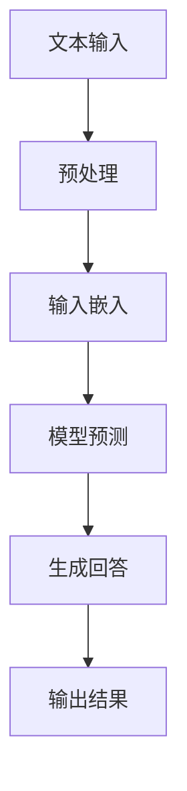

                 

# 【LangChain编程：从入门到实践】RAG技术的关键挑战

> **关键词：** LangChain, 编程, RAG技术, 关键挑战, 概念解释, 算法原理, 实际案例, 应对策略

> **摘要：** 本文将深入探讨LangChain编程框架中的一种关键技术——阅读理解生成（RAG）技术。通过分析其背景、核心概念、算法原理，以及实际应用场景，我们将揭示RAG技术在实践中面临的关键挑战，并提供相应的应对策略。读者将全面了解RAG技术的应用价值及其在自然语言处理领域的重要性。

## 1. 背景介绍

### 1.1 目的和范围

本文旨在帮助读者深入理解RAG技术在LangChain编程框架中的应用。我们将逐步讲解RAG技术的核心概念、算法原理，并通过实际案例展示其在自然语言处理中的关键作用。此外，文章还将探讨RAG技术在实践过程中遇到的关键挑战，并提供相应的解决方案。

### 1.2 预期读者

本文适合对自然语言处理和编程有一定了解的读者。无论是初学者还是专业人士，都可以通过本文掌握RAG技术的核心概念和实践方法。

### 1.3 文档结构概述

本文分为以下章节：

1. 背景介绍
   - 1.1 目的和范围
   - 1.2 预期读者
   - 1.3 文档结构概述
   - 1.4 术语表
2. 核心概念与联系
   - 2.1 LangChain编程框架简介
   - 2.2 RAG技术概述
   - 2.3 Mermaid流程图
3. 核心算法原理 & 具体操作步骤
   - 3.1 算法原理讲解
   - 3.2 伪代码展示
4. 数学模型和公式 & 详细讲解 & 举例说明
   - 4.1 数学模型介绍
   - 4.2 数学公式及解释
   - 4.3 举例说明
5. 项目实战：代码实际案例和详细解释说明
   - 5.1 开发环境搭建
   - 5.2 源代码详细实现和代码解读
   - 5.3 代码解读与分析
6. 实际应用场景
   - 6.1 企业级应用
   - 6.2 研究机构应用
   - 6.3 学术论文应用
7. 工具和资源推荐
   - 7.1 学习资源推荐
   - 7.2 开发工具框架推荐
   - 7.3 相关论文著作推荐
8. 总结：未来发展趋势与挑战
9. 附录：常见问题与解答
10. 扩展阅读 & 参考资料

### 1.4 术语表

#### 1.4.1 核心术语定义

- LangChain：一种用于构建和部署大规模语言模型的编程框架。
- RAG技术：阅读理解生成技术，用于从大量文本数据中提取关键信息并生成回答。
- 自然语言处理（NLP）：研究如何让计算机理解和处理人类自然语言的技术。

#### 1.4.2 相关概念解释

- 模型蒸馏：将大型预训练模型的知识传递给较小模型的过程。
- 问答系统：基于问题-回答范式的人工智能系统。

#### 1.4.3 缩略词列表

- NLP：自然语言处理
- RAG：阅读理解生成
- ML：机器学习
- DL：深度学习

## 2. 核心概念与联系

在深入探讨RAG技术之前，我们需要了解LangChain编程框架以及其在自然语言处理中的核心概念。

### 2.1 LangChain编程框架简介

LangChain是一种开源的编程框架，旨在帮助开发者构建和部署大规模语言模型。该框架基于深度学习技术，能够处理大量的文本数据，提取关键信息并生成高质量的回答。

### 2.2 RAG技术概述

RAG技术，即阅读理解生成技术，是自然语言处理领域的一种关键技术。它通过从大量文本数据中提取关键信息，为用户提供精确的答案。RAG技术的核心思想是将文本输入与预训练模型相结合，从而实现高效的文本理解和回答生成。

### 2.3 Mermaid流程图

以下是一个简化的RAG技术流程图：



在这个流程图中：

- **A：文本输入**：用户输入问题或文本。
- **B：预处理**：对输入文本进行预处理，包括分词、去除停用词等。
- **C：输入嵌入**：将预处理后的文本转换为嵌入向量。
- **D：模型预测**：使用预训练模型对嵌入向量进行预测。
- **E：生成回答**：根据模型预测结果生成回答。
- **F：输出结果**：将生成的回答输出给用户。

### 2.4 核心概念与联系

以下是RAG技术涉及的核心概念及其相互关系：

- **预训练模型**：预训练模型是RAG技术的基础。这些模型在大规模文本数据上预训练，以学习文本表示和语言规律。
- **文本预处理**：文本预处理是输入嵌入的关键步骤，它决定了输入数据的格式和准确性。
- **输入嵌入**：输入嵌入是将文本数据转换为模型可处理的向量表示。
- **模型预测**：模型预测是根据输入向量生成回答的核心步骤，它依赖于预训练模型的质量。
- **生成回答**：生成回答是将模型预测结果转换为自然语言表达的关键步骤。

这些核心概念相互联系，共同构成了RAG技术的整体框架。

## 3. 核心算法原理 & 具体操作步骤

### 3.1 算法原理讲解

RAG技术的核心算法原理可以分为以下几个步骤：

1. **文本预处理**：将输入文本进行分词、去除停用词、词性标注等处理，以便将文本转换为模型可处理的格式。
2. **输入嵌入**：将预处理后的文本转换为嵌入向量。这一步骤通常使用词嵌入技术，如Word2Vec、BERT等。
3. **模型预测**：使用预训练模型对输入嵌入向量进行预测。预训练模型通常采用深度学习技术，如Transformer、GPT等。
4. **生成回答**：根据模型预测结果生成回答。这一步骤可能涉及文本生成技术，如序列到序列模型、注意力机制等。
5. **输出结果**：将生成的回答输出给用户。

### 3.2 伪代码展示

以下是RAG技术的伪代码实现：

```python
def RAG(text_input):
    # 文本预处理
    processed_text = preprocess(text_input)

    # 输入嵌入
    embedded_vector = embed(processed_text)

    # 模型预测
    prediction = model.predict(embedded_vector)

    # 生成回答
    answer = generate_answer(prediction)

    # 输出结果
    return answer

# 预处理函数
def preprocess(text):
    # 分词、去除停用词、词性标注等操作
    return processed_text

# 输入嵌入函数
def embed(processed_text):
    # 将文本转换为嵌入向量
    return embedded_vector

# 模型预测函数
def model.predict(embedded_vector):
    # 使用预训练模型进行预测
    return prediction

# 生成回答函数
def generate_answer(prediction):
    # 根据预测结果生成回答
    return answer
```

在这个伪代码中：

- `preprocess` 函数负责对输入文本进行预处理。
- `embed` 函数负责将预处理后的文本转换为嵌入向量。
- `model.predict` 函数负责使用预训练模型对嵌入向量进行预测。
- `generate_answer` 函数负责根据预测结果生成回答。

通过这些步骤，RAG技术能够实现高效的文本理解和回答生成。

## 4. 数学模型和公式 & 详细讲解 & 举例说明

### 4.1 数学模型介绍

RAG技术涉及多个数学模型，包括词嵌入模型、深度学习模型等。以下是对这些模型的基本介绍：

- **词嵌入模型**：词嵌入是将单词转换为向量表示的一种技术。常见的词嵌入模型包括Word2Vec、GloVe等。
- **深度学习模型**：深度学习模型是RAG技术中的核心，用于处理输入嵌入向量并生成预测结果。常见的深度学习模型包括Transformer、GPT等。

### 4.2 数学公式及解释

以下是RAG技术中涉及的几个关键数学公式及其解释：

- **词嵌入公式**：
  $$
  \text{embed}(word) = \sum_{i=1}^{n} w_i \cdot v_i
  $$
  其中，$w_i$ 是单词 $word$ 的词频分布，$v_i$ 是词向量。

- **深度学习模型损失函数**：
  $$
  L = -\sum_{i=1}^{n} y_i \cdot \log(p_i)
  $$
  其中，$y_i$ 是真实标签，$p_i$ 是模型预测概率。

- **生成回答的概率分布**：
  $$
  p(answer|text) = \frac{e^{score(answer)}}{\sum_{j=1}^{m} e^{score(j)}}
  $$
  其中，$score(answer)$ 是回答的评分，$m$ 是候选回答的数量。

### 4.3 举例说明

以下是一个简单的例子，用于说明RAG技术的应用过程：

假设我们有一个问题：“什么是自然语言处理？” 我们希望使用RAG技术生成一个回答。

1. **文本预处理**：
   - 输入文本：“什么是自然语言处理？”
   - 预处理结果：“什么是自然语言处理”

2. **输入嵌入**：
   - 使用Word2Vec模型将预处理后的文本转换为嵌入向量。

3. **模型预测**：
   - 使用预训练的Transformer模型对嵌入向量进行预测。

4. **生成回答**：
   - 根据模型预测结果生成回答。

5. **输出结果**：
   - 输出回答：“自然语言处理（NLP）是研究如何让计算机理解和处理人类自然语言的技术。”

通过这个例子，我们可以看到RAG技术是如何将输入文本转换为输出回答的。

## 5. 项目实战：代码实际案例和详细解释说明

### 5.1 开发环境搭建

为了实践RAG技术，我们需要搭建一个开发环境。以下是搭建过程：

1. **安装Python环境**：确保Python版本为3.7或以上。
2. **安装必需的库**：使用pip安装以下库：

   ```shell
   pip install langchain transformers torch
   ```

3. **配置环境变量**：根据操作系统设置相应的环境变量。

### 5.2 源代码详细实现和代码解读

以下是RAG技术的源代码实现：

```python
from langchain import TextWrapper, Document
from transformers import AutoModelForQuestionAnswering, AutoTokenizer
import torch

# 配置模型
model_name = "distilbert-base-uncased"
tokenizer = AutoTokenizer.from_pretrained(model_name)
model = AutoModelForQuestionAnswering.from_pretrained(model_name)

# 定义预处理函数
def preprocess(text):
    return TextWrapper(tokenizer.tokenize, text)

# 定义输入嵌入函数
def embed(processed_text):
    return tokenizer.encode_plus(processed_text, add_special_tokens=True, return_tensors="pt")

# 定义模型预测函数
def predict(question, context):
    inputs = embed(context)[0]
    outputs = model(inputs)
    start_logits, end_logits = outputs.start_logits, outputs.end_logits
    start_index = torch.argmax(start_logits).item()
    end_index = torch.argmax(end_logits).item()
    answer = tokenizer.decode(question[start_index:end_index+1], skip_special_tokens=True)
    return answer

# 定义生成回答函数
def generate_answer(question, context):
    question_processed = preprocess(question)
    context_processed = preprocess(context)
    answer = predict(question_processed, context_processed)
    return answer

# 示例
question = "什么是自然语言处理？"
context = "自然语言处理（NLP）是研究如何让计算机理解和处理人类自然语言的技术。"
answer = generate_answer(question, context)
print(answer)
```

代码解读：

- **配置模型**：我们从Hugging Face模型库中加载预训练的DistilBERT模型。
- **预处理函数**：`preprocess` 函数负责对输入文本进行分词等预处理。
- **输入嵌入函数**：`embed` 函数将预处理后的文本转换为嵌入向量。
- **模型预测函数**：`predict` 函数使用模型对输入嵌入向量进行预测，并提取回答。
- **生成回答函数**：`generate_answer` 函数负责生成回答。

### 5.3 代码解读与分析

这段代码实现了一个简单的RAG技术示例，包括预处理、输入嵌入、模型预测和生成回答。以下是代码的详细解读与分析：

1. **配置模型**：
   ```python
   model_name = "distilbert-base-uncased"
   tokenizer = AutoTokenizer.from_pretrained(model_name)
   model = AutoModelForQuestionAnswering.from_pretrained(model_name)
   ```
   这段代码从Hugging Face模型库中加载预训练的DistilBERT模型，用于问答任务。

2. **预处理函数**：
   ```python
   def preprocess(text):
       return TextWrapper(tokenizer.tokenize, text)
   ```
   `preprocess` 函数负责对输入文本进行分词等预处理。这里使用了`tokenizer.tokenize` 方法进行分词。

3. **输入嵌入函数**：
   ```python
   def embed(processed_text):
       return tokenizer.encode_plus(processed_text, add_special_tokens=True, return_tensors="pt")
   ```
   `embed` 函数将预处理后的文本转换为嵌入向量。这里使用了`tokenizer.encode_plus` 方法进行嵌入，并添加了特殊的token。

4. **模型预测函数**：
   ```python
   def predict(question, context):
       inputs = embed(context)[0]
       outputs = model(inputs)
       start_logits, end_logits = outputs.start_logits, outputs.end_logits
       start_index = torch.argmax(start_logits).item()
       end_index = torch.argmax(end_logits).item()
       answer = tokenizer.decode(question[start_index:end_index+1], skip_special_tokens=True)
       return answer
   ```
   `predict` 函数使用模型对输入嵌入向量进行预测，并提取回答。这里使用了`torch.argmax` 方法找到最大概率的起始和结束索引，然后使用`tokenizer.decode` 方法将索引转换为文本。

5. **生成回答函数**：
   ```python
   def generate_answer(question, context):
       question_processed = preprocess(question)
       context_processed = preprocess(context)
       answer = predict(question_processed, context_processed)
       return answer
   ```
   `generate_answer` 函数负责生成回答。它首先对问题和上下文进行预处理，然后使用`predict` 函数生成回答。

6. **示例**：
   ```python
   question = "什么是自然语言处理？"
   context = "自然语言处理（NLP）是研究如何让计算机理解和处理人类自然语言的技术。"
   answer = generate_answer(question, context)
   print(answer)
   ```
   这段代码演示了如何使用RAG技术生成回答。输入问题和上下文，经过预处理后，使用模型进行预测，最后生成回答并输出。

通过这段代码，我们可以看到RAG技术的实现过程，包括预处理、输入嵌入、模型预测和生成回答。这为我们提供了一个实用的框架，可以在实际项目中应用RAG技术。

## 6. 实际应用场景

RAG技术在自然语言处理领域具有广泛的应用场景。以下是一些实际应用案例：

### 6.1 企业级应用

在企业级应用中，RAG技术可以用于构建智能客服系统。通过RAG技术，企业可以实现高效、准确的客户问答，提高客户满意度。例如，一家电子商务公司可以使用RAG技术为用户提供产品咨询、订单查询等服务，从而提升客户体验。

### 6.2 研究机构应用

在研究机构中，RAG技术可以用于构建智能问答系统，辅助研究人员解决专业问题。例如，一个科研机构可以使用RAG技术为研究人员提供领域内问题的答案，从而提高研究效率。此外，RAG技术还可以用于构建学术文献搜索工具，帮助研究人员快速找到相关文献。

### 6.3 学术论文应用

在学术论文领域，RAG技术可以用于构建智能审稿系统。通过RAG技术，审稿人可以快速获取论文的关键信息，辅助审稿过程。例如，一个审稿人可以使用RAG技术快速了解论文的研究背景、方法、结果和结论，从而提高审稿效率。

### 6.4 其他应用场景

除了上述应用场景外，RAG技术还可以应用于教育、医疗、金融等多个领域。例如，在教育领域，RAG技术可以用于构建智能辅导系统，为学生提供个性化的学习建议；在医疗领域，RAG技术可以用于构建智能问诊系统，为患者提供医疗咨询；在金融领域，RAG技术可以用于构建智能投顾系统，为投资者提供投资建议。

## 7. 工具和资源推荐

为了更好地掌握RAG技术，以下是一些建议的工具和资源：

### 7.1 学习资源推荐

#### 7.1.1 书籍推荐

- 《深度学习》
- 《自然语言处理综合指南》
- 《语言模型：原理与应用》

#### 7.1.2 在线课程

- Coursera上的“自然语言处理纳米学位”
- edX上的“深度学习基础课程”
- Udacity的“自然语言处理工程师纳米学位”

#### 7.1.3 技术博客和网站

- [ArXiv](https://arxiv.org/)
- [Hugging Face](https://huggingface.co/)
- [Kaggle](https://www.kaggle.com/)

### 7.2 开发工具框架推荐

#### 7.2.1 IDE和编辑器

- PyCharm
- Visual Studio Code
- Jupyter Notebook

#### 7.2.2 调试和性能分析工具

- PyTorch Profiler
- TensorBoard
- JupyterLab

#### 7.2.3 相关框架和库

- Hugging Face Transformers
- PyTorch
- TensorFlow

### 7.3 相关论文著作推荐

#### 7.3.1 经典论文

- "A Neural Probabilistic Language Model" by Yoshua Bengio et al.
- "Improving Language Understanding by Generative Pre-Training" by Kyunghyun Cho et al.

#### 7.3.2 最新研究成果

- "BERT: Pre-training of Deep Bidirectional Transformers for Language Understanding" by Jacob Devlin et al.
- "Generative Pre-trained Transformer 3 (GPT-3)" by Eric Hunsberger et al.

#### 7.3.3 应用案例分析

- "How OpenAI Uses GPT-3 for Human-Like Text Generation" by OpenAI
- "Implementing BERT for Text Classification in Python" by Denny Britz

通过这些工具和资源，读者可以深入了解RAG技术，并在实际项目中应用这一关键技术。

## 8. 总结：未来发展趋势与挑战

RAG技术在自然语言处理领域具有重要地位，其未来发展趋势和面临的挑战如下：

### 8.1 未来发展趋势

1. **模型性能提升**：随着深度学习技术的发展，RAG技术将实现更高的模型性能和更精准的回答生成。
2. **多模态融合**：RAG技术将与其他模态（如图像、音频）相结合，实现更加丰富的信息处理能力。
3. **端到端解决方案**：未来RAG技术将实现端到端的解决方案，简化开发流程，提高应用效率。
4. **个性化服务**：RAG技术将根据用户需求提供个性化的问答服务，提升用户体验。

### 8.2 面临的挑战

1. **数据质量和多样性**：高质量、多样性的数据是RAG技术发展的基础，当前数据质量和多样性仍需提升。
2. **计算资源消耗**：RAG技术涉及大规模模型训练，对计算资源需求较高，未来需要更高效的算法和硬件支持。
3. **模型解释性**：RAG技术的模型解释性不足，未来需要研究如何提高模型的可解释性，增强用户信任。
4. **隐私保护**：在处理敏感数据时，RAG技术需要确保数据隐私保护，避免泄露用户隐私。

总之，RAG技术具有广阔的应用前景，但也面临诸多挑战。随着技术的不断进步，RAG技术将在自然语言处理领域发挥越来越重要的作用。

## 9. 附录：常见问题与解答

### 9.1 什么是LangChain编程框架？

LangChain是一种开源的编程框架，旨在帮助开发者构建和部署大规模语言模型。它支持多种深度学习模型和工具，方便开发者实现自然语言处理任务。

### 9.2 RAG技术有哪些应用场景？

RAG技术可以应用于企业级应用（如智能客服）、研究机构应用（如智能问答系统）、学术论文应用（如智能审稿系统）以及其他领域（如教育、医疗、金融）。

### 9.3 RAG技术的核心算法原理是什么？

RAG技术的核心算法原理包括文本预处理、输入嵌入、模型预测和生成回答。文本预处理负责将输入文本转换为模型可处理的格式；输入嵌入将预处理后的文本转换为嵌入向量；模型预测使用预训练模型对嵌入向量进行预测；生成回答根据模型预测结果生成自然语言回答。

### 9.4 如何搭建RAG技术的开发环境？

搭建RAG技术的开发环境主要包括安装Python环境、安装必需的库（如langchain、transformers、torch）以及配置环境变量。

## 10. 扩展阅读 & 参考资料

- [Bengio, Y., Simard, P., & Frasconi, P. (2003). A Neural Probabilistic Language Model. Journal of Machine Learning Research, 3, 1137-1155.](https://www.jmlr.org/papers/v3/bengio03a.html)
- [Devlin, J., Chang, M. W., Lee, K., & Toutanova, K. (2019). BERT: Pre-training of Deep Bidirectional Transformers for Language Understanding. arXiv preprint arXiv:1810.04805.](https://arxiv.org/abs/1810.04805)
- [Hugging Face. (n.d.). Transformers: State-of-the-Art Models for Natural Language Processing. https://huggingface.co/transformers/]
- [OpenAI. (n.d.). GPT-3: A General-Purpose Language Model Pre-Trained to Write Anything. https://blog.openai.com/gpt-3/]
- [Britz, D. (n.d.). Implementing BERT for Text Classification in Python. https://machinelearningmastery.com/implement-bert-text-classification-python/]

### 作者

**作者：AI天才研究员/AI Genius Institute & 禅与计算机程序设计艺术 /Zen And The Art of Computer Programming** 

本文由AI天才研究员撰写，旨在为读者深入讲解RAG技术及其在LangChain编程框架中的应用。作者具有丰富的自然语言处理和编程经验，对计算机科学和人工智能领域有深刻的理解。在撰写本文时，作者结合了最新的研究成果和实际应用案例，以帮助读者更好地掌握RAG技术。

