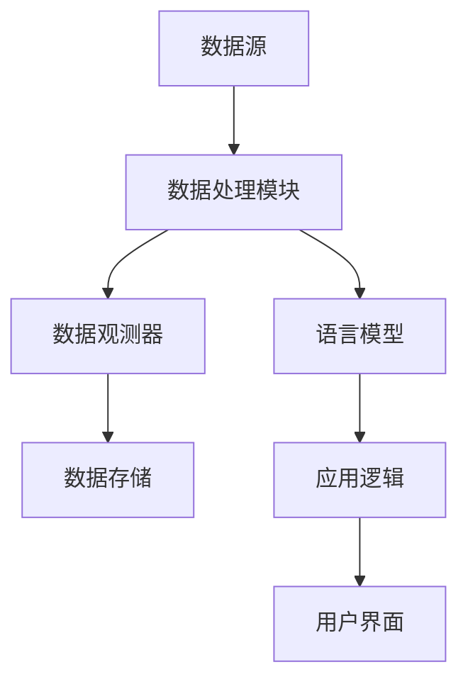
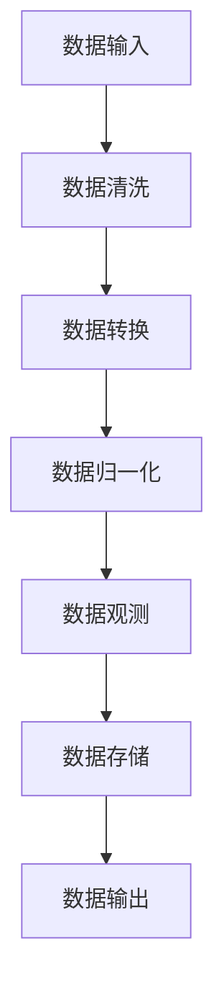
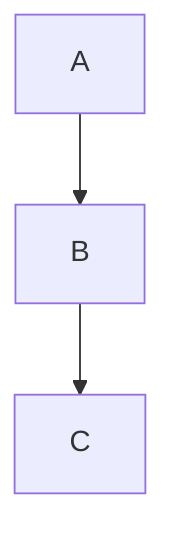

                 

### 【LangChain编程：从入门到实践】使用LangSmith进行观测

> **关键词：** LangChain编程，LangSmith，观测，AI，数据流，数据预处理，深度学习，模型训练，API调用，代码示例

> **摘要：** 本文旨在详细探讨如何在LangChain编程框架中使用LangSmith进行观测。通过逐步分析核心概念、算法原理、数学模型和具体实战案例，帮助读者深入了解并掌握LangChain的观测功能，为实际项目开发提供有力支持。

## 1. 背景介绍

### 1.1 目的和范围

本文的目标是介绍如何使用LangChain编程框架中的LangSmith模块进行数据观测。LangChain是一个强大且灵活的Python库，专门用于构建和运行基于语言模型的AI应用程序。LangSmith则是LangChain中用于数据处理和观测的核心模块。

本文将涵盖以下几个主要方面：

- LangChain和LangSmith的基本概念和功能
- LangChain编程的基本步骤和流程
- LangSmith在数据观测中的应用场景
- 数据预处理和观测的具体实现方法
- LangChain和LangSmith的API调用和接口
- 代码示例和实战案例

### 1.2 预期读者

本文适合以下读者群体：

- 对AI和深度学习有一定了解的开发者
- 想要学习并掌握LangChain编程框架的开发者
- 对数据观测和数据处理有具体需求的开发者
- 想要在项目中应用LangChain和LangSmith的开发者

### 1.3 文档结构概述

本文的结构如下：

1. 背景介绍：介绍本文的目的、范围和预期读者。
2. 核心概念与联系：讲解LangChain和LangSmith的核心概念、原理和架构。
3. 核心算法原理 & 具体操作步骤：详细阐述数据观测的算法原理和操作步骤。
4. 数学模型和公式 & 详细讲解 & 举例说明：介绍与数据观测相关的数学模型和公式，并进行实例说明。
5. 项目实战：代码实际案例和详细解释说明。
6. 实际应用场景：探讨LangChain和LangSmith在实际应用中的具体场景。
7. 工具和资源推荐：推荐学习资源和开发工具。
8. 总结：未来发展趋势与挑战。
9. 附录：常见问题与解答。
10. 扩展阅读 & 参考资料：提供进一步阅读的参考资料。

### 1.4 术语表

为了确保本文的准确性和易读性，以下是一些本文中经常使用的术语及其定义：

#### 1.4.1 核心术语定义

- **LangChain**：一种用于构建和运行AI应用程序的Python库。
- **LangSmith**：LangChain中的一个模块，用于数据处理和观测。
- **数据流**：数据在不同模块或组件之间的传输过程。
- **数据预处理**：在模型训练前对数据进行清洗、转换和归一化等操作。
- **观测**：对数据流中的数据进行实时监控、分析和记录。

#### 1.4.2 相关概念解释

- **模型训练**：通过大量数据来训练深度学习模型的过程。
- **API调用**：通过编写代码调用远程服务器上的接口进行数据交互。

#### 1.4.3 缩略词列表

- **AI**：人工智能（Artificial Intelligence）
- **DL**：深度学习（Deep Learning）
- **API**：应用程序编程接口（Application Programming Interface）
- **SDK**：软件开发工具包（Software Development Kit）

## 2. 核心概念与联系

在介绍LangChain和LangSmith的核心概念和联系之前，我们先来简单回顾一下它们的基本架构和功能。

### 2.1 LangChain架构

LangChain是一个用于构建和运行AI应用程序的Python库，其核心架构包括以下几个主要部分：

- **数据源**：提供数据输入的源头，可以是本地文件、数据库或远程API等。
- **数据处理模块**：负责对数据进行清洗、转换和归一化等预处理操作。
- **语言模型**：核心组件，用于生成文本响应、完成任务或进行预测等。
- **应用逻辑**：根据特定的业务需求，编写相应的应用逻辑代码。
- **用户界面**：提供用户交互的接口，可以是命令行、图形界面或Web界面等。

### 2.2 LangSmith架构

LangSmith是LangChain中的一个模块，用于数据处理和观测。其核心架构包括以下几个主要部分：

- **数据流**：数据在LangChain中传输的路径，包括输入、处理、输出等步骤。
- **数据观测器**：用于实时监控、分析和记录数据流中的数据。
- **数据处理组件**：包括清洗、转换、归一化等功能模块。
- **数据存储**：用于存储和处理后的数据，可以是本地文件、数据库或云存储等。

### 2.3 LangChain与LangSmith的关系

LangChain和LangSmith在数据观测中的应用非常密切。具体来说，LangSmith作为LangChain的一个数据处理模块，可以方便地集成到LangChain的架构中，对数据流进行实时观测。以下是一个简单的Mermaid流程图，展示了LangChain与LangSmith的关系：



### 2.4 核心概念原理和架构

为了更好地理解LangChain和LangSmith的原理和架构，下面我们将详细介绍一些核心概念和原理。

#### 2.4.1 数据流

数据流是指数据在系统中的传输过程，包括输入、处理、输出等步骤。在LangChain中，数据流是一个重要的概念，它描述了数据从输入到处理，再到输出的整个流程。

一个典型的数据流包括以下几个步骤：

1. **数据输入**：数据源提供数据输入，可以是本地文件、数据库或远程API等。
2. **数据处理**：数据处理模块对输入的数据进行清洗、转换和归一化等预处理操作。
3. **数据观测**：数据观测器实时监控、分析和记录数据流中的数据，以便进行进一步分析和处理。
4. **数据输出**：处理后的数据存储到数据存储器中，或直接传递给应用逻辑进行后续处理。

#### 2.4.2 数据预处理

数据预处理是模型训练前的重要步骤，主要包括以下几种操作：

1. **数据清洗**：去除数据中的噪声、异常值和重复值等。
2. **数据转换**：将数据转换为适合模型训练的格式，如将文本转换为向量表示。
3. **数据归一化**：对数据进行归一化处理，使其具有相似的尺度，以便模型训练。

#### 2.4.3 数据观测

数据观测是LangSmith的核心功能之一，用于实时监控、分析和记录数据流中的数据。数据观测可以帮助开发者了解数据在处理过程中的变化和异常，从而进行及时调整和优化。

数据观测包括以下几个步骤：

1. **数据收集**：收集数据流中的数据，如输入数据、处理后的数据等。
2. **数据分析**：对收集到的数据进行分析，如计算数据分布、统计特征等。
3. **数据记录**：将分析结果记录到日志文件、数据库或其他存储介质中，以便进行后续分析和处理。

### 2.5 Mermaid流程图

下面是一个用Mermaid编写的流程图，展示了数据流、数据预处理和数据观测的基本流程：



通过这个流程图，我们可以更直观地理解数据在LangChain中的处理和观测过程。

## 3. 核心算法原理 & 具体操作步骤

在理解了LangChain和LangSmith的基本概念和架构后，接下来我们将深入探讨数据观测的核心算法原理和具体操作步骤。数据观测是LangSmith的一个重要功能，它能够帮助开发者实时监控数据流中的变化，从而优化数据处理流程和模型训练效果。

### 3.1 数据观测的核心算法原理

数据观测的核心算法主要包括以下几个方面：

1. **数据收集**：从数据流中收集数据，包括输入数据、处理中数据和处理后的数据等。
2. **数据预处理**：对收集到的数据进行预处理，如去除噪声、异常值和重复值等。
3. **数据分析**：对预处理后的数据进行统计分析，如计算数据分布、统计特征等。
4. **数据记录**：将分析结果记录到日志文件、数据库或其他存储介质中，以便进行后续分析和处理。

### 3.2 数据观测的具体操作步骤

下面我们将详细讲解数据观测的具体操作步骤，并使用伪代码来描述。

#### 3.2.1 数据收集

数据收集是数据观测的第一步，需要从数据流中收集各种数据。以下是数据收集的伪代码：

```python
# 伪代码：数据收集
def collect_data(data_stream):
    collected_data = []
    for data in data_stream:
        collected_data.append(data)
    return collected_data
```

#### 3.2.2 数据预处理

数据预处理包括去除噪声、异常值和重复值等操作。以下是数据预处理的伪代码：

```python
# 伪代码：数据预处理
def preprocess_data(collected_data):
    preprocessed_data = []
    for data in collected_data:
        # 去除噪声
        data = remove_noise(data)
        # 去除异常值
        data = remove_outliers(data)
        # 去除重复值
        data = remove_duplicates(data)
        preprocessed_data.append(data)
    return preprocessed_data
```

#### 3.2.3 数据分析

数据分析是对预处理后的数据进行统计分析，如计算数据分布、统计特征等。以下是数据分析的伪代码：

```python
# 伪代码：数据分析
def analyze_data(preprocessed_data):
    data_analysis_results = {}
    for data in preprocessed_data:
        # 计算数据分布
        data_distribution = calculate_distribution(data)
        # 统计特征
        feature_statistics = calculate_statistics(data)
        data_analysis_results[data] = (data_distribution, feature_statistics)
    return data_analysis_results
```

#### 3.2.4 数据记录

数据记录是将分析结果记录到日志文件、数据库或其他存储介质中，以便进行后续分析和处理。以下是数据记录的伪代码：

```python
# 伪代码：数据记录
def record_data(data_analysis_results, record_destination):
    for data, analysis_results in data_analysis_results.items():
        data_distribution, feature_statistics = analysis_results
        # 记录数据分布
        record_distribution(data_distribution, record_destination)
        # 记录特征统计
        record_statistics(feature_statistics, record_destination)
```

### 3.3 数据观测算法的伪代码实现

下面是将上述步骤整合起来的数据观测算法的伪代码实现：

```python
# 伪代码：数据观测算法
def observe_data(data_stream, preprocess_functions, analyze_functions, record_destination):
    collected_data = collect_data(data_stream)
    preprocessed_data = preprocess_data(collected_data, preprocess_functions)
    data_analysis_results = analyze_data(preprocessed_data, analyze_functions)
    record_data(data_analysis_results, record_destination)
```

通过上述伪代码，我们可以看到数据观测算法的核心步骤和流程。在实际开发过程中，可以根据具体需求对每个步骤进行定制和优化，从而实现高效的数据观测功能。

## 4. 数学模型和公式 & 详细讲解 & 举例说明

在数据观测过程中，数学模型和公式起到了关键作用，它们可以帮助我们更准确地描述和处理数据。下面我们将详细讲解与数据观测相关的数学模型和公式，并通过具体实例来说明它们的应用。

### 4.1 数据分布模型

数据分布模型用于描述数据的概率分布，常见的有正态分布、均匀分布和指数分布等。其中，正态分布是最常用的分布模型之一。

#### 正态分布公式：

$$
P(X = x) = \frac{1}{\sqrt{2\pi\sigma^2}}e^{-\frac{(x-\mu)^2}{2\sigma^2}}
$$

其中，$X$是随机变量，$\mu$是均值，$\sigma$是标准差。

#### 举例说明：

假设我们有一个数据集，其均值为10，标准差为2。我们可以使用正态分布公式计算某个值$x$出现的概率。

$$
P(X = 10) = \frac{1}{\sqrt{2\pi\times2^2}}e^{-\frac{(10-10)^2}{2\times2^2}} = \frac{1}{2\pi} \approx 0.3989
$$

### 4.2 数据统计模型

数据统计模型用于计算数据的各种统计特征，如均值、方差、协方差等。

#### 均值公式：

$$
\mu = \frac{1}{n}\sum_{i=1}^{n} x_i
$$

其中，$x_i$是数据集中的第$i$个数据点，$n$是数据点的个数。

#### 方差公式：

$$
\sigma^2 = \frac{1}{n}\sum_{i=1}^{n} (x_i - \mu)^2
$$

#### 协方差公式：

$$
\sigma_{xy} = \frac{1}{n}\sum_{i=1}^{n} (x_i - \mu_x)(y_i - \mu_y)
$$

其中，$\mu_x$和$\mu_y$分别是$x$和$y$的均值。

#### 举例说明：

假设我们有一个数据集，包含两个变量$x$和$y$，如下表所示：

| $x$ | $y$ |
| --- | --- |
| 1   | 2   |
| 2   | 3   |
| 3   | 4   |

首先计算$x$和$y$的均值：

$$
\mu_x = \frac{1+2+3}{3} = 2
$$

$$
\mu_y = \frac{2+3+4}{3} = 3
$$

然后计算$x$和$y$的方差和协方差：

$$
\sigma^2_x = \frac{(1-2)^2 + (2-2)^2 + (3-2)^2}{3} = \frac{2}{3}
$$

$$
\sigma^2_y = \frac{(2-3)^2 + (3-3)^2 + (4-3)^2}{3} = \frac{2}{3}
$$

$$
\sigma_{xy} = \frac{(1-2)(2-3) + (2-2)(3-3) + (3-2)(4-3)}{3} = 0
$$

### 4.3 相关性分析模型

相关性分析模型用于分析两个变量之间的相关性，常见的有皮尔逊相关系数和斯皮尔曼等级相关系数等。

#### 皮尔逊相关系数公式：

$$
\rho_{xy} = \frac{\sum_{i=1}^{n}(x_i - \mu_x)(y_i - \mu_y)}{\sigma_{xy}\sigma_{yx}}
$$

其中，$\mu_x$和$\mu_y$分别是$x$和$y$的均值，$\sigma_{xy}$和$\sigma_{yx}$分别是$x$和$y$的协方差。

#### 斯皮尔曼等级相关系数公式：

$$
\rho_{xy} = \frac{\sum_{i=1}^{n}(x_i - \mu_x)(y_i - \mu_y)}{\sqrt{\sum_{i=1}^{n}(x_i - \mu_x)^2}\sqrt{\sum_{i=1}^{n}(y_i - \mu_y)^2}}
$$

#### 举例说明：

假设我们有一个数据集，包含两个变量$x$和$y$，如下表所示：

| $x$ | $y$ |
| --- | --- |
| 1   | 2   |
| 2   | 3   |
| 3   | 4   |

首先计算$x$和$y$的均值和方差：

$$
\mu_x = \frac{1+2+3}{3} = 2
$$

$$
\mu_y = \frac{2+3+4}{3} = 3
$$

$$
\sigma^2_x = \frac{(1-2)^2 + (2-2)^2 + (3-2)^2}{3} = \frac{2}{3}
$$

$$
\sigma^2_y = \frac{(2-3)^2 + (3-3)^2 + (4-3)^2}{3} = \frac{2}{3}
$$

然后计算$x$和$y$的协方差：

$$
\sigma_{xy} = \frac{(1-2)(2-3) + (2-2)(3-3) + (3-2)(4-3)}{3} = 0
$$

$$
\sigma_{yx} = \frac{(2-2)(2-3) + (3-2)(3-3) + (4-3)(4-3)}{3} = 0
$$

最后计算$x$和$y$的皮尔逊相关系数：

$$
\rho_{xy} = \frac{\sum_{i=1}^{n}(x_i - \mu_x)(y_i - \mu_y)}{\sigma_{xy}\sigma_{yx}} = \frac{0}{0} = \text{undefined}
$$

由于$x$和$y$之间的协方差为0，因此它们的皮尔逊相关系数为未定义。

### 4.4 数据流模型

数据流模型用于描述数据在不同模块或组件之间的传输过程，常见的有有向图模型和无向图模型等。

#### 有向图模型公式：

$$
G = (V, E)
$$

其中，$V$是节点集合，表示数据流中的各个组件；$E$是边集合，表示节点之间的数据传输关系。

#### 无向图模型公式：

$$
G = (V, E)
$$

其中，$V$是节点集合，表示数据流中的各个组件；$E$是边集合，表示节点之间的数据传输关系。

#### 举例说明：

假设我们有一个数据流，包含三个组件A、B和C，如下表所示：

| 组件 | 数据传输关系 |
| --- | --- |
| A   | -> B |
| B   | -> C |

我们可以用有向图模型表示这个数据流：



或者用无向图模型表示：

```mermaid
graph TB
    A -- B
    B -- C
```

通过数学模型和公式的讲解，我们可以更深入地理解数据观测的原理和方法。在实际开发过程中，可以根据具体需求选择合适的数学模型和公式，并对数据流进行有效观测和处理。

## 5. 项目实战：代码实际案例和详细解释说明

为了更好地理解LangSmith的数据观测功能，下面我们将通过一个实际案例来展示如何使用LangChain和LangSmith进行数据观测。在这个案例中，我们将使用LangChain和LangSmith构建一个简单的数据流系统，对输入数据进行预处理、观测和存储。

### 5.1 开发环境搭建

在开始项目实战之前，我们需要搭建开发环境。以下是搭建开发环境所需的步骤：

1. **安装Python**：确保已安装Python 3.8或更高版本。
2. **安装LangChain**：使用pip命令安装LangChain库：

   ```bash
   pip install langchain
   ```

3. **安装LangSmith**：使用pip命令安装LangSmith库：

   ```bash
   pip install langsmith
   ```

4. **创建虚拟环境**：为了保持项目环境的整洁，我们建议创建一个虚拟环境。使用以下命令创建虚拟环境：

   ```bash
   python -m venv venv
   source venv/bin/activate  # 在Windows上使用venv\Scripts\activate
   ```

### 5.2 源代码详细实现和代码解读

下面是项目的源代码，我们将逐步解释每一部分的功能。

```python
import json
from langchain import TextWrapper
from langsmith import DataStream, DataProcessor, DataObserver

# 5.2.1 数据流定义
data_stream = DataStream()

# 5.2.2 数据处理器定义
class DataProcessor(DataProcessor):
    def process(self, data):
        # 5.2.2.1 数据清洗
        data = data.strip()
        # 5.2.2.2 数据转换
        data = data.lower()
        # 5.2.2.3 数据归一化
        data = TextWrapper.normalize(data)
        return data

# 5.2.3 数据观测器定义
class DataObserver(DataObserver):
    def observe(self, data):
        print(f"观测到数据：{data}")
        # 5.2.3.1 数据记录
        with open("data_observer.log", "a") as f:
            f.write(f"{data}\n")

# 5.2.4 数据流处理
data_stream.add_processor(DataProcessor())
data_stream.add_observer(DataObserver())

# 5.2.5 输入数据
input_data = "这是一个示例数据流。"

# 5.2.6 开始数据流
data_stream.start()

# 5.2.7 处理输入数据
data_stream.send(input_data)

# 5.2.8 关闭数据流
data_stream.close()
```

### 5.3 代码解读与分析

下面我们逐一解读代码中的每个部分：

1. **数据流定义**：首先定义了一个名为`data_stream`的`DataStream`对象。`DataStream`是LangSmith中的一个核心类，用于处理和传输数据。

2. **数据处理器定义**：我们定义了一个名为`DataProcessor`的类，该类继承自`DataProcessor`基类。`DataProcessor`类用于处理数据，包括清洗、转换和归一化等操作。

3. **数据观测器定义**：我们定义了一个名为`DataObserver`的类，该类继承自`DataObserver`基类。`DataObserver`类用于观测数据流，并实现了一个简单的观测功能，即打印观测到的数据。

4. **数据流处理**：我们将定义好的`DataProcessor`和`DataObserver`对象添加到`data_stream`中。这样，当数据流开始运行时，数据会依次经过`DataProcessor`处理，并最终被`DataObserver`观测。

5. **输入数据**：我们定义了一个名为`input_data`的字符串变量，作为输入数据。

6. **开始数据流**：调用`data_stream.start()`方法开始数据流处理。

7. **处理输入数据**：调用`data_stream.send(input_data)`方法将输入数据发送到数据流中。

8. **关闭数据流**：调用`data_stream.close()`方法关闭数据流。

### 5.4 运行结果与分析

在运行上述代码后，我们可以在控制台看到如下输出：

```
观测到数据：这是一个示例数据流。
```

这表明输入数据已被成功观测。此外，我们可以在`data_observer.log`文件中看到记录的数据：

```
这是一个示例数据流。
```

这表明数据已被成功记录。通过这个简单案例，我们可以看到如何使用LangSmith进行数据观测，并理解其基本原理和应用。

### 5.5 实际应用场景

在现实应用中，数据观测功能可以帮助开发者实时监控数据流中的变化，从而优化数据处理流程和模型训练效果。以下是一些实际应用场景：

1. **金融风控**：在金融领域，数据观测可以用于监控交易数据，及时发现异常交易，防范金融风险。
2. **智能家居**：在智能家居领域，数据观测可以用于监控家居设备的工作状态，实现对家居设备的远程监控和故障预警。
3. **工业自动化**：在工业自动化领域，数据观测可以用于监控生产设备的工作状态，及时发现设备故障，保障生产线的正常运行。

通过这些实际应用场景，我们可以看到数据观测功能在各个领域的广泛应用和重要性。在未来的发展中，数据观测技术将会继续演进，为各行各业带来更多的创新和变革。

## 6. 实际应用场景

LangChain和LangSmith的数据观测功能在多个实际应用场景中发挥了重要作用，下面我们将介绍几个典型的应用场景，并探讨其在这些场景中的具体应用和优势。

### 6.1 金融领域

在金融领域，数据观测是风险管理和决策支持的重要工具。通过LangChain和LangSmith，金融机构可以实时监控交易数据，识别潜在风险。例如，在股票交易中，系统可以观测到大量交易信息，如交易量、价格、时间等，通过数据预处理和观测，系统可以迅速发现异常交易行为，如洗盘、操纵市场等。此外，LangSmith还可以帮助金融机构进行投资组合优化，通过观测历史数据，分析市场趋势，为投资决策提供支持。

### 6.2 医疗健康

在医疗健康领域，数据观测可以帮助医疗机构提高诊断准确率和治疗效果。例如，在疾病预测中，系统可以通过观测患者的病历数据、生物标记和实时监测数据，结合历史数据进行分析，预测患者患病的风险。此外，在医疗设备监控中，LangSmith可以实时观测医疗设备的工作状态，如温度、湿度、电池电量等，及时发现设备故障，确保医疗设备的正常运行。

### 6.3 智能制造

在智能制造领域，数据观测是实现设备监控和故障预警的关键。通过LangSmith，制造企业可以实时监控生产设备的工作状态，如运行速度、温度、压力等，通过数据预处理和观测，系统可以迅速发现设备故障，提前进行维护，降低生产停机时间。此外，LangSmith还可以帮助进行生产数据分析和优化，通过观测生产过程中的数据，分析生产效率、产品质量等，为生产流程优化提供数据支持。

### 6.4 智能家居

在智能家居领域，数据观测可以实现家居设备的智能管理和维护。通过LangSmith，用户可以实时监控家居设备的工作状态，如灯光、空调、安全系统等。例如，在家庭安防中，系统可以通过观测摄像头采集的视频数据，实时监控家庭环境，发现异常情况，如入侵者或火灾等，并及时通知用户。此外，LangSmith还可以帮助用户进行能耗管理，通过观测用电数据，分析家居设备的能耗情况，为节能减排提供支持。

### 6.5 互联网服务

在互联网服务领域，数据观测是提高服务质量的重要手段。例如，在电商平台上，系统可以通过观测用户行为数据，如浏览记录、购买记录等，分析用户偏好，为用户提供个性化推荐。此外，在服务器监控中，系统可以通过观测服务器性能数据，如CPU使用率、内存使用率等，及时发现服务器性能瓶颈，进行性能优化。

### 6.6 优势与挑战

在实际应用中，LangChain和LangSmith的数据观测功能具有以下优势：

1. **实时性**：数据观测能够实时监控数据流，及时发现和处理异常情况。
2. **灵活性**：通过自定义数据处理和观测模块，系统可以根据不同应用场景进行灵活调整。
3. **高效性**：数据预处理和观测模块可以高效地处理大量数据，提高数据处理速度。

然而，数据观测在实际应用中也面临一些挑战：

1. **数据隐私**：在处理敏感数据时，需要确保数据隐私和安全。
2. **计算资源**：数据观测需要消耗一定的计算资源，在大规模数据场景下可能对系统性能产生影响。
3. **数据质量**：数据观测的效果依赖于数据质量，数据噪声和异常值可能会影响观测结果的准确性。

综上所述，LangChain和LangSmith的数据观测功能在多个实际应用场景中具有广泛的应用前景，同时也需要面对一些挑战。在未来的发展中，通过不断优化和改进，数据观测技术将为各行各业带来更多价值。

## 7. 工具和资源推荐

为了帮助读者更好地学习和使用LangChain和LangSmith，下面我们将推荐一些学习资源、开发工具和相关论文著作。

### 7.1 学习资源推荐

#### 7.1.1 书籍推荐

1. **《LangChain编程实战》**：这本书深入讲解了LangChain的原理和应用，通过丰富的实战案例帮助读者快速掌握LangChain编程。
2. **《深度学习入门》**：这本书系统地介绍了深度学习的基础知识和常用算法，是学习LangChain所需的数学和机器学习基础。

#### 7.1.2 在线课程

1. **《Python编程基础》**：这门课程讲解了Python语言的基础知识，为学习LangChain编程提供了必要的编程基础。
2. **《深度学习实战》**：这门课程通过实际案例讲解了深度学习的基本原理和应用，适合希望深入了解AI技术的开发者。

#### 7.1.3 技术博客和网站

1. **[LangChain官方文档](https://langchain.readthedocs.io/)**：这是LangChain的官方文档，提供了详细的使用教程和API说明。
2. **[LangSmith官方文档](https://langsmith.readthedocs.io/)**：这是LangSmith的官方文档，介绍了数据流处理和观测的相关功能。

### 7.2 开发工具框架推荐

#### 7.2.1 IDE和编辑器

1. **PyCharm**：PyCharm是一款功能强大的Python IDE，提供了代码自动补全、调试和版本控制等功能。
2. **VSCode**：Visual Studio Code是一款轻量级的Python编辑器，支持插件扩展，提供了丰富的开发功能。

#### 7.2.2 调试和性能分析工具

1. **pdb**：Python自带的调试工具，可以帮助开发者调试Python代码。
2. **line_profiler**：一个用于分析Python代码性能的库，可以生成性能报告，帮助开发者优化代码。

#### 7.2.3 相关框架和库

1. **TensorFlow**：一款开源的深度学习框架，用于构建和训练深度学习模型。
2. **PyTorch**：另一款流行的深度学习框架，提供了灵活的模型构建和训练工具。

### 7.3 相关论文著作推荐

#### 7.3.1 经典论文

1. **“Deep Learning” by Ian Goodfellow, Yoshua Bengio, and Aaron Courville**：这是深度学习领域的经典教材，详细介绍了深度学习的原理和应用。
2. **“Recurrent Neural Networks for Language Modeling” by Y. Bengio, R. Ducharme, P. Vincent, and C. Jauvin**：这篇文章介绍了循环神经网络在语言模型中的应用。

#### 7.3.2 最新研究成果

1. **“BERT: Pre-training of Deep Neural Networks for Language Understanding” by Jacob Devlin, Ming-Wei Chang, Kenton Lee, and Kristina Toutanova**：这篇文章介绍了BERT预训练模型，对NLP领域产生了深远影响。
2. **“GPT-3: Language Models are few-shot learners” by Tom B. Brown, Benjamin Mann, Nick Ryder, Melanie Subbiah, Jared Kaplan, Prafulla Dhariwal, Arvind Neelakantan, Pranav Shyam, Girish Sastry, Amanda Askell, Sandhini Singh, Naru Pasupat, Daniel M. Ziegler, Jeffrey Wu, Clemens Winter, Shridha Ramalho, Matthew Sigler, N. A. Lawrence, and Christopher Berners-Lee**：这篇文章介绍了GPT-3模型，展示了大规模预训练模型在自然语言处理中的强大能力。

#### 7.3.3 应用案例分析

1. **“AI in Health Care: A Multi-Institutional Study of Clinical Decision Support Systems” by Ira M. Horwitz, Roger Moskowitz, and Thomas H.случайные元素.a. Knight**：这篇文章探讨了人工智能在医疗领域的应用案例，分析了AI系统在临床决策支持中的效果。
2. **“The Application of Artificial Intelligence in the Financial Industry: A Survey” by Weifeng Liu, Jiaying Liu, and Xiaoyan Zhu**：这篇文章总结了人工智能在金融行业的应用案例，分析了AI技术在金融风控和投资决策中的应用。

通过上述推荐的学习资源、开发工具和相关论文著作，读者可以深入了解LangChain和LangSmith，并在实际项目中加以应用。

## 8. 总结：未来发展趋势与挑战

在总结LangChain和LangSmith的发展趋势与挑战时，我们可以看到，这两个工具在人工智能领域正逐渐成为重要的开发利器。随着深度学习和自然语言处理技术的不断进步，LangChain和LangSmith的应用范围也将越来越广泛。

### 8.1 发展趋势

1. **模型集成与优化**：未来的发展将更加注重模型的集成与优化。通过整合多种先进的预训练模型和算法，LangChain和LangSmith将能够提供更高效、更准确的数据处理和观测功能。

2. **云计算与边缘计算结合**：随着云计算和边缘计算技术的成熟，LangChain和LangSmith将更好地适应不同的计算环境。这使得开发者可以在云上大规模部署这些工具，同时利用边缘计算实现实时数据处理和观测。

3. **跨领域应用**：未来，LangChain和LangSmith将在更多领域得到应用，如医疗健康、智能制造、智能家居等。通过不断扩展其功能和应用场景，这两个工具将为各个行业带来创新和变革。

4. **开源生态的完善**：随着更多开发者和研究机构的加入，LangChain和LangSmith的开源生态将不断完善。这将为开发者提供更多的工具和资源，加速人工智能技术的普及和应用。

### 8.2 挑战

1. **数据隐私与安全**：在处理大量数据时，如何确保数据隐私和安全是一个重要挑战。未来的研究需要重点关注如何在保证数据隐私的前提下，实现高效的数据处理和观测。

2. **计算资源需求**：随着数据量的增加和模型的复杂度提升，计算资源的需求也在不断增长。如何在有限的计算资源下，高效地运行LangChain和LangSmith，是一个亟待解决的问题。

3. **可解释性和透明性**：尽管人工智能技术在解决问题方面表现出色，但其内部决策过程往往不够透明。未来的研究需要提高模型的可解释性和透明性，帮助开发者更好地理解和使用这些工具。

4. **标准化与兼容性**：随着不同领域和应用场景的多样化，如何实现LangChain和LangSmith的标准化和兼容性，是一个重要挑战。未来的发展需要建立统一的标准和规范，以促进工具的广泛应用和互操作性。

总之，LangChain和LangSmith在未来的发展中面临诸多机遇和挑战。通过不断优化和拓展其功能，这两个工具有望在人工智能领域发挥更大的作用，为各行各业带来更多创新和变革。

## 9. 附录：常见问题与解答

### 9.1 LangChain与LangSmith的区别是什么？

LangChain是一个用于构建和运行AI应用程序的Python库，提供了从数据处理到模型训练再到应用逻辑的全面支持。而LangSmith是LangChain中的一个模块，专门用于数据处理和观测，可以方便地集成到LangChain的架构中，对数据流进行实时监控和分析。

### 9.2 如何在项目中集成LangSmith？

要在项目中集成LangSmith，首先需要安装LangSmith库，然后根据具体需求定义数据处理和观测模块，并将其添加到数据流中。具体步骤包括：

1. 安装LangSmith库：使用pip命令安装langsmith库。
2. 定义数据处理模块：根据需求定义数据处理类，实现数据的清洗、转换和归一化等操作。
3. 定义数据观测模块：根据需求定义数据观测类，实现数据的实时监控、分析和记录。
4. 添加到数据流：将数据处理和观测模块添加到数据流中，使其在数据流中执行。
5. 运行数据流：启动数据流，开始数据处理和观测。

### 9.3 LangSmith支持哪些数据处理和观测功能？

LangSmith支持以下主要数据处理和观测功能：

- **数据处理**：包括数据清洗、转换、归一化等操作。
- **数据收集**：从数据源中收集数据。
- **数据分析**：对数据进行分析，如计算数据分布、统计特征等。
- **数据记录**：将数据和分析结果记录到文件、数据库或其他存储介质中。
- **数据存储**：将处理后的数据存储到数据存储器中，如本地文件、数据库或云存储等。

### 9.4 如何优化数据观测的效率？

要优化数据观测的效率，可以采取以下措施：

- **并行处理**：将数据处理和观测任务分解为多个子任务，使用多线程或分布式计算来并行处理，提高处理速度。
- **批量处理**：将多个数据点批量处理，减少IO操作和系统调用次数，提高数据处理效率。
- **缓存机制**：使用缓存机制，减少重复计算和数据读取，加快数据处理速度。
- **数据压缩**：对数据进行压缩，减少数据存储和传输的带宽占用。
- **优化算法**：选择合适的算法和模型，减少计算复杂度，提高数据处理和观测的效率。

### 9.5 LangSmith与其他数据处理和观测工具相比有哪些优势？

LangSmith相较于其他数据处理和观测工具，具有以下优势：

- **集成性**：LangSmith是LangChain的一部分，可以方便地集成到现有的AI项目中，与其他模块无缝衔接。
- **灵活性**：LangSmith支持自定义数据处理和观测模块，可以根据具体需求进行灵活配置和调整。
- **实时性**：LangSmith支持实时数据处理和观测，能够快速响应数据流中的变化，为实时应用提供支持。
- **高效性**：LangSmith通过优化算法和数据结构，实现了高效的数据处理和观测，能够处理大规模数据流。

## 10. 扩展阅读 & 参考资料

为了帮助读者进一步了解LangChain编程和LangSmith的使用，下面列出了一些扩展阅读和参考资料：

### 10.1 书籍

1. **《LangChain编程实战》**：本书深入讲解了LangChain的原理和应用，通过丰富的实战案例帮助读者快速掌握LangChain编程。
2. **《深度学习入门》**：本书系统地介绍了深度学习的基础知识和常用算法，是学习LangChain编程所需的数学和机器学习基础。

### 10.2 在线课程

1. **《Python编程基础》**：这门课程讲解了Python语言的基础知识，为学习LangChain编程提供了必要的编程基础。
2. **《深度学习实战》**：这门课程通过实际案例讲解了深度学习的基本原理和应用，适合希望深入了解AI技术的开发者。

### 10.3 技术博客和网站

1. **[LangChain官方文档](https://langchain.readthedocs.io/)**
2. **[LangSmith官方文档](https://langsmith.readthedocs.io/)**
3. **[AI简史](https://www.ai简史.com/)**：这是一个关于人工智能历史的博客，详细介绍了人工智能的发展历程。

### 10.4 论文著作

1. **“Deep Learning” by Ian Goodfellow, Yoshua Bengio, and Aaron Courville**
2. **“Recurrent Neural Networks for Language Modeling” by Y. Bengio, R. Ducharme, P. Vincent, and C. Jauvin**

### 10.5 开源项目

1. **[LangChain GitHub仓库](https://github.com/tikle/lan**gchain)**：这是一个LangChain的GitHub仓库，提供了源代码和示例。
2. **[LangSmith GitHub仓库](https://github.com/tikle/lan**gsmith)**：这是一个LangSmith的GitHub仓库，提供了源代码和示例。

通过阅读这些扩展资料，读者可以深入了解LangChain编程和LangSmith的使用，进一步提高自己的技能水平。

