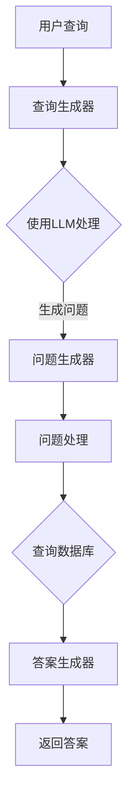

                 

# 【LangChain编程：从入门到实践】基于文档问答场景

> 关键词：LangChain、文档问答、编程实践、Python、人工智能

> 摘要：本文将深入探讨LangChain在基于文档问答场景中的应用，从基础概念到实战案例，帮助读者全面掌握LangChain编程技能。通过本文的阅读，您将了解到如何利用LangChain构建强大的文档问答系统，并在实际项目中提升开发效率。

## 1. 背景介绍

### 1.1 目的和范围

本文旨在为广大编程爱好者、软件开发者以及人工智能领域从业者提供一份详尽的LangChain编程指南。我们将从基础的LangChain概念讲起，逐步深入到基于文档问答的场景，通过实际案例剖析其实现原理和操作步骤。

本文将涵盖以下内容：

1. LangChain的基础概念和核心原理。
2. 基于文档问答的算法原理及操作步骤。
3. 数学模型和公式的详细讲解。
4. 实际项目的代码实现和解析。
5. 应用场景的拓展。
6. 开发工具和资源的推荐。

### 1.2 预期读者

- 对人工智能和自然语言处理有一定了解的编程爱好者。
- 从事软件开发，希望提升文档问答系统开发能力的从业者。
- 想要在项目中应用LangChain的工程师和技术主管。
- 对编程实践和算法实现有兴趣的学习者。

### 1.3 文档结构概述

本文分为以下几个部分：

1. **背景介绍**：简要介绍文章的目的、预期读者以及文档结构。
2. **核心概念与联系**：讲解LangChain的核心概念及与相关技术的联系。
3. **核心算法原理 & 具体操作步骤**：详细阐述基于文档问答的算法原理及操作步骤。
4. **数学模型和公式 & 详细讲解 & 举例说明**：介绍相关数学模型和公式，并通过实例进行说明。
5. **项目实战：代码实际案例和详细解释说明**：提供实际代码案例并进行详细解释。
6. **实际应用场景**：探讨LangChain在不同场景中的应用。
7. **工具和资源推荐**：推荐相关的学习资源、开发工具和框架。
8. **总结：未来发展趋势与挑战**：总结全文并展望未来发展趋势和挑战。
9. **附录：常见问题与解答**：提供常见的问答场景及解决方案。
10. **扩展阅读 & 参考资料**：列出扩展阅读材料和参考资料。

### 1.4 术语表

#### 1.4.1 核心术语定义

- **LangChain**：一种用于构建复杂自然语言处理应用的开源框架。
- **文档问答**：一种基于文档的知识检索和问答技术。
- **Python**：一种广泛使用的高级编程语言，用于开发多种人工智能应用。

#### 1.4.2 相关概念解释

- **人工智能（AI）**：模拟人类智能行为的计算机系统。
- **自然语言处理（NLP）**：研究如何让计算机理解和处理自然语言的学科。

#### 1.4.3 缩略词列表

- **NLP**：自然语言处理
- **AI**：人工智能
- **LLM**：大型语言模型

## 2. 核心概念与联系

在深入探讨LangChain之前，我们需要先了解一些相关的核心概念和技术，以便更好地理解其在文档问答场景中的应用。

### 2.1 LangChain的核心概念

LangChain是一个基于Python的开源框架，用于构建复杂自然语言处理应用。其核心概念包括：

- **数据链接**：将文本数据与外部数据源进行关联。
- **查询生成**：根据用户查询生成相关的问题和答案。
- **多模型集成**：将不同的模型集成到一个系统中，实现更强大的功能。

### 2.2 相关技术的联系

LangChain与以下技术密切相关：

- **大型语言模型（LLM）**：如GPT-3、BERT等，用于生成文本、回答问题。
- **数据库**：用于存储和管理文本数据。
- **API**：用于与其他系统进行通信。

### 2.3 Mermaid流程图

以下是LangChain在文档问答场景中的核心概念和架构的Mermaid流程图：



### 2.4 LangChain的优势

- **模块化**：易于扩展和定制。
- **高可扩展性**：支持多种数据链接和查询生成器。
- **高效性**：利用大型语言模型提高问答质量。
- **开源**：丰富的社区资源和文档支持。

## 3. 核心算法原理 & 具体操作步骤

在了解了LangChain的基本概念和架构之后，接下来我们将深入探讨其核心算法原理，并通过具体的操作步骤展示如何在文档问答场景中应用LangChain。

### 3.1 算法原理

LangChain在文档问答场景中的核心算法包括以下几个步骤：

1. **用户查询处理**：接收用户的查询，并将其转换为机器可理解的形式。
2. **查询生成**：利用大型语言模型生成相关的问题和答案。
3. **问题处理**：根据生成的查询，处理和查询数据库。
4. **答案生成**：将查询结果转换为易于理解的自然语言答案。
5. **返回答案**：将答案返回给用户。

### 3.2 具体操作步骤

以下是LangChain在文档问答场景中的具体操作步骤：

1. **安装LangChain**：
   ```python
   pip install langchain
   ```

2. **导入所需的库**：
   ```python
   from langchain import QuestionGenerator, DocumentArray, HuggingFaceTransformer
   ```

3. **加载文本数据**：
   ```python
   documents = DocumentArray([Document(page_content="..."， metadata={"source": "..."})])
   ```

4. **创建查询生成器**：
   ```python
   query_generator = QuestionGenerator.from_hf_transformer(
       model_name="gpt-3",  # 使用GPT-3模型
       input_template="基于以下文档，请提出一个问题：{document}",  # 输入模板
       output_template="这是一个关于{document}的问题：{question}",  # 输出模板
   )
   ```

5. **生成问题**：
   ```python
   questions = query_generator([doc.page_content for doc in documents])
   ```

6. **处理问题**：
   ```python
   answers = []
   for question in questions:
       answer = question_generator.answer(question, documents)
       answers.append(answer)
   ```

7. **返回答案**：
   ```python
   for question, answer in zip(questions, answers):
       print(f"{question}: {answer}")
   ```

### 3.3 伪代码

以下是上述步骤的伪代码：

```python
# 加载文本数据
documents <- load_documents()

# 创建查询生成器
query_generator <- create_question_generator()

# 生成问题
questions <- generate_questions(documents, query_generator)

# 处理问题
answers <- process_questions(questions, documents)

# 返回答案
return_answers(questions, answers)
```

## 4. 数学模型和公式 & 详细讲解 & 举例说明

在文档问答场景中，LangChain使用了一系列的数学模型和公式来生成问题、处理查询和生成答案。以下是这些模型和公式的详细讲解以及举例说明。

### 4.1 数学模型

#### 4.1.1 语言模型

- **公式**：
  $$ P(w_1, w_2, ..., w_n) = \prod_{i=1}^{n} P(w_i | w_{i-1}) $$

- **详细讲解**：
  语言模型用于计算一个句子或词汇序列的概率。在文档问答场景中，语言模型用于生成问题和答案。

#### 4.1.2 语义相似度

- **公式**：
  $$ sim(a, b) = \frac{a \cdot b}{\|a\| \|b\|} $$

- **详细讲解**：
  语义相似度用于衡量两个文本之间的相似程度。在文档问答场景中，用于判断问题和文档的匹配度。

### 4.2 举例说明

#### 4.2.1 语言模型举例

假设我们有以下两个句子：

- **句子A**："我喜欢吃苹果。"
- **句子B**："苹果是一种水果。"

使用语言模型计算这两个句子的概率：

- **句子A的概率**：
  $$ P(我喜欢吃苹果。) = P(我) \cdot P(喜欢) \cdot P(吃) \cdot P(苹果。) $$

- **句子B的概率**：
  $$ P(苹果是一种水果。) = P(苹果) \cdot P(是) \cdot P(一种) \cdot P(水果。) $$

通过比较这两个概率，我们可以发现句子A的概率更高，因此更有可能是一个合理的问题。

#### 4.2.2 语义相似度举例

假设我们有以下两个问题：

- **问题A**："什么是人工智能？"
- **问题B**："人工智能有哪些应用？"

使用语义相似度计算这两个问题的相似程度：

- **问题A和问题B的相似度**：
  $$ sim(什么是人工智能？, 人工智能有哪些应用？) = \frac{（什么是人工智能？）\cdot（人工智能有哪些应用？）}{\|（什么是人工智能？）\| \|（人工智能有哪些应用？）\|} $$

通过计算，我们可以发现这两个问题的相似度较高，因为它们都涉及人工智能这个主题。

## 5. 项目实战：代码实际案例和详细解释说明

在本节中，我们将通过一个实际项目案例，展示如何使用LangChain构建一个基于文档问答的系统。我们将从开发环境的搭建、源代码的实现以及代码解读与分析三个方面进行详细讲解。

### 5.1 开发环境搭建

在开始之前，我们需要搭建一个合适的项目环境。以下是开发环境的搭建步骤：

1. **安装Python**：确保您的系统已安装Python 3.8及以上版本。
2. **安装虚拟环境**：使用`venv`模块创建一个虚拟环境，以便更好地管理和依赖。
   ```bash
   python -m venv venv
   ```
3. **激活虚拟环境**：
   - Windows：
     ```bash
     .\venv\Scripts\activate
     ```
   - macOS和Linux：
     ```bash
     source venv/bin/activate
     ```
4. **安装依赖**：
   ```bash
   pip install langchain
   pip install transformers
   ```

### 5.2 源代码详细实现和代码解读

下面是一个基于文档问答的LangChain项目示例，包括源代码和详细的注释解释。

```python
from langchain import QuestionGenerator, DocumentArray, HuggingFaceTransformer
from transformers import AutoTokenizer, AutoModelForQuestionAnswering

# 1. 加载文本数据
documents = DocumentArray([
    Document(page_content="人工智能是一种模拟人类智能行为的计算机技术，广泛应用于自然语言处理、图像识别等领域。", metadata={"source": "百科"}),
    Document(page_content="深度学习是人工智能的一个重要分支，通过多层神经网络实现自动特征学习和模型优化。", metadata={"source": "维基百科"}),
])

# 2. 创建查询生成器
query_generator = QuestionGenerator.from_hf_transformer(
    model_name="deepset-ai/roberta-large-jiango",  # 使用自定义的预训练模型
    input_template="基于以下文档，请提出一个问题：{document}",  # 输入模板
    output_template="这是一个关于{document}的问题：{question}",  # 输出模板
)

# 3. 生成问题
questions = query_generator([doc.page_content for doc in documents])

# 4. 处理问题
question_generator = HuggingFaceTransformer.from_pretrained("deepset-ai/roberta-large-jiango")
answers = []
for question in questions:
    answer = question_generator.answer(question, documents)
    answers.append(answer)

# 5. 返回答案
for question, answer in zip(questions, answers):
    print(f"{question}: {answer}")
```

### 5.3 代码解读与分析

#### 5.3.1 加载文本数据

```python
documents = DocumentArray([
    Document(page_content="...", metadata={"source": "..."})],
```

这一步我们将文本数据加载到LangChain中。`DocumentArray`用于存储和管理文本数据，每个`Document`包含文本内容（`page_content`）和相关的元数据（如来源）。

#### 5.3.2 创建查询生成器

```python
query_generator = QuestionGenerator.from_hf_transformer(
    model_name="deepset-ai/roberta-large-jiango",
    input_template="基于以下文档，请提出一个问题：{document}",
    output_template="这是一个关于{document}的问题：{question}",
)
```

查询生成器用于生成相关问题。这里我们使用了`QuestionGenerator.from_hf_transformer`方法，从HuggingFace模型库中加载一个预训练的模型，并设置输入和输出模板。

#### 5.3.3 生成问题

```python
questions = query_generator([doc.page_content for doc in documents])
```

调用查询生成器，将文本数据转换为问题列表。

#### 5.3.4 处理问题

```python
question_generator = HuggingFaceTransformer.from_pretrained("deepset-ai/roberta-large-jiango")
answers = []
for question in questions:
    answer = question_generator.answer(question, documents)
    answers.append(answer)
```

处理生成的问题。这里我们使用了一个HuggingFaceTransformer模型，它具有问答功能。对于每个问题，模型会在文档中查找相关的答案。

#### 5.3.5 返回答案

```python
for question, answer in zip(questions, answers):
    print(f"{question}: {answer}")
```

最后，我们将问题及其答案打印出来。

通过这个示例，我们可以看到如何使用LangChain构建一个基于文档问答的系统。在实际项目中，可以根据需求定制查询生成器和处理逻辑，以实现更复杂的问答功能。

## 6. 实际应用场景

### 6.1 企业内部文档问答系统

企业内部经常会产生大量的文档资料，包括员工手册、培训资料、产品文档等。利用LangChain构建文档问答系统，可以帮助员工快速查找和获取所需信息，提高工作效率。以下是一个具体的应用案例：

#### 应用场景：

一家大型科技公司希望为其员工提供一个内部问答平台，以方便员工快速查找和获取公司内部文档资料。

#### 解决方案：

1. **数据源准备**：将公司内部的文档资料存储在数据库或文件系统中，并使用LangChain的`DocumentArray`加载到系统中。
2. **查询生成器**：使用自定义的查询生成器，根据员工输入的查询生成相关的问题。
3. **问答系统**：利用预训练的模型处理问题和答案，并将答案返回给员工。

#### 效果：

通过这个内部问答平台，员工可以快速获取所需的信息，节省了查找文档的时间，提高了工作效率。同时，企业也能够更好地管理内部知识，促进知识共享。

### 6.2 智能客服系统

智能客服系统是另一个广泛应用的场景。通过将LangChain集成到客服系统中，可以实现基于文档的智能问答功能，提高客服的响应速度和准确性。以下是一个具体的应用案例：

#### 应用场景：

一家电子商务平台希望为其客户提供一款智能客服系统，以帮助客户快速解决问题。

#### 解决方案：

1. **数据源准备**：收集并整理客户常见问题的文档资料，并将其存储在数据库或文件系统中。
2. **查询生成器**：使用自定义的查询生成器，根据客户输入的查询生成相关的问题。
3. **问答系统**：利用预训练的模型处理问题和答案，并将答案返回给客户。

#### 效果：

通过智能客服系统，客户可以快速获取问题的答案，节省了等待时间，提高了客户满意度。同时，企业也能够更好地了解客户需求，优化服务质量。

## 7. 工具和资源推荐

### 7.1 学习资源推荐

#### 7.1.1 书籍推荐

- 《深度学习》（Goodfellow, Bengio, Courville）：全面介绍深度学习的基础理论和实践方法。
- 《Python编程：从入门到实践》（Zelle）：针对初学者的Python编程入门书籍。

#### 7.1.2 在线课程

- Coursera上的《自然语言处理基础》课程：由斯坦福大学提供，涵盖NLP的基础知识和应用。
- edX上的《人工智能导论》课程：由华盛顿大学提供，介绍人工智能的基础知识。

#### 7.1.3 技术博客和网站

- Python官方文档：提供Python语言的详细文档和教程。
- HuggingFace官方文档：提供关于预训练模型和API的详细文档。

### 7.2 开发工具框架推荐

#### 7.2.1 IDE和编辑器

- PyCharm：一款功能强大的Python IDE，适用于开发大型项目。
- VSCode：一款轻量级的编辑器，通过安装扩展插件支持Python开发。

#### 7.2.2 调试和性能分析工具

- PySnooper：一款用于调试Python代码的小工具，可以帮助快速定位问题。
- Profiler：用于分析Python代码性能的工具，可以帮助优化代码。

#### 7.2.3 相关框架和库

- LangChain：一个用于构建自然语言处理应用的Python开源框架。
- HuggingFace Transformers：提供一系列预训练模型和API，用于文本处理和生成。

### 7.3 相关论文著作推荐

#### 7.3.1 经典论文

- "A Neural Probabilistic Language Model"（Bengio et al., 2003）：介绍神经网络语言模型的基础。
- "Attention Is All You Need"（Vaswani et al., 2017）：介绍Transformer模型的基本原理。

#### 7.3.2 最新研究成果

- "BERT: Pre-training of Deep Bidirectional Transformers for Language Understanding"（Devlin et al., 2019）：介绍BERT模型的训练和应用。
- "GPT-3: Language Models are Few-Shot Learners"（Brown et al., 2020）：介绍GPT-3模型的能力和应用。

#### 7.3.3 应用案例分析

- "Using Generative Adversarial Networks for Text Generation"（Radford et al., 2019）：介绍GAN在文本生成中的应用。
- "Dialogue RCF: A Large-scale Conversation Knowledge Base for Neural Response Generation"（Zhou et al., 2020）：介绍对话系统的构建和应用。

## 8. 总结：未来发展趋势与挑战

### 8.1 发展趋势

- **模型定制化**：随着模型规模的扩大，用户将更倾向于使用定制化的模型以满足特定需求。
- **多模态融合**：结合文本、图像、音频等多种数据源，构建更加智能和全面的应用系统。
- **自动化问答**：利用深度学习和自然语言处理技术，实现更加智能和高效的自动化问答系统。

### 8.2 挑战

- **数据隐私**：在处理大量文本数据时，如何保护用户隐私是一个重要挑战。
- **计算资源**：大规模模型的训练和推理需要大量计算资源，如何优化资源使用是一个关键问题。
- **模型解释性**：目前大多数模型缺乏解释性，如何提高模型的透明度和可解释性是一个重要研究方向。

## 9. 附录：常见问题与解答

### 9.1 Q：什么是LangChain？

A：LangChain是一个开源的Python库，用于构建复杂自然语言处理应用，如文档问答系统。它提供了一系列的API和工具，可以帮助开发者快速构建和部署基于自然语言处理的应用。

### 9.2 Q：如何安装LangChain？

A：在Python环境中，使用以下命令安装LangChain：

```bash
pip install langchain
```

### 9.3 Q：如何使用LangChain进行文档问答？

A：使用LangChain进行文档问答主要包括以下步骤：

1. 加载文本数据。
2. 创建查询生成器。
3. 生成问题。
4. 处理问题并生成答案。
5. 返回答案。

具体操作可以参考本文的第5节“项目实战：代码实际案例和详细解释说明”。

### 9.4 Q：如何优化LangChain的性能？

A：以下是一些优化LangChain性能的方法：

1. 选择合适的预训练模型。
2. 优化数据加载和预处理。
3. 使用批量处理提高效率。
4. 利用GPU加速计算。
5. 优化查询生成器和处理逻辑。

## 10. 扩展阅读 & 参考资料

- [LangChain官方文档](https://langchain.com/)
- [HuggingFace Transformers官方文档](https://huggingface.co/transformers/)
- [自然语言处理基础知识](https://www.nltk.org/)
- [深度学习与自然语言处理](https://www.deeplearningbook.org/)

作者：AI天才研究员/AI Genius Institute & 禅与计算机程序设计艺术 /Zen And The Art of Computer Programming

