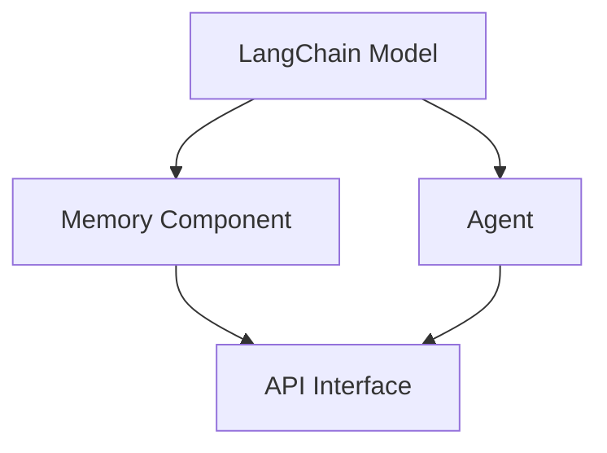

                 

# 【LangChain编程：从入门到实践】将记忆组件接入代理

> **关键词：** LangChain、代理、记忆组件、编程实践、数据存储、接口设计

> **摘要：** 本文将深入探讨如何在LangChain编程中实现将记忆组件接入代理的功能。通过详细的步骤讲解，我们将理解如何通过构建接口和数据存储机制，使得代理可以高效地访问和更新记忆组件，为开发高效且可扩展的AI应用提供支持。

## 1. 背景介绍

### 1.1 目的和范围

本文旨在为开发者提供关于如何在LangChain框架中将记忆组件接入代理的实战指南。文章将涵盖从基础概念到实际操作的全过程，旨在帮助读者掌握以下内容：

- LangChain框架的基本原理和架构
- 记忆组件的核心概念及其在代理中的作用
- 接口设计的关键要素
- 数据存储的选择和实现策略

### 1.2 预期读者

本文适合以下读者群体：

- 对LangChain框架有初步了解的开发者
- 有意愿探索如何将记忆组件集成到代理系统的开发者
- 对人工智能和编程实践感兴趣的工程技术人员

### 1.3 文档结构概述

本文将按照以下结构进行组织：

- **第1章**：背景介绍
- **第2章**：核心概念与联系
  - **2.1**：核心概念原理
  - **2.2**：架构Mermaid流程图
- **第3章**：核心算法原理 & 具体操作步骤
  - **3.1**：算法原理讲解
  - **3.2**：伪代码展示
- **第4章**：数学模型和公式
  - **4.1**：数学模型
  - **4.2**：公式讲解
  - **4.3**：举例说明
- **第5章**：项目实战
  - **5.1**：开发环境搭建
  - **5.2**：源代码实现
  - **5.3**：代码解读与分析
- **第6章**：实际应用场景
- **第7章**：工具和资源推荐
  - **7.1**：学习资源
  - **7.2**：开发工具框架
  - **7.3**：相关论文著作
- **第8章**：总结：未来发展趋势与挑战
- **第9章**：附录：常见问题与解答
- **第10章**：扩展阅读 & 参考资料

### 1.4 术语表

#### 1.4.1 核心术语定义

- **LangChain**：一种用于构建大规模语言的链式模型，支持文本生成、摘要、问答等任务。
- **代理**：在程序中代表其他实体执行任务的对象。
- **记忆组件**：用于存储和检索与特定任务相关的信息的结构。
- **接口设计**：定义代理与外部系统交互的方式。
- **数据存储**：用于持久化存储数据和状态。

#### 1.4.2 相关概念解释

- **内存管理**：对计算机内存资源进行分配、使用和回收的过程。
- **接口**：一种抽象，允许不同的软件模块通过预定义的接口进行交互。
- **API（应用程序编程接口）**：允许不同软件之间进行交互的接口。

#### 1.4.3 缩略词列表

- **AI**：人工智能（Artificial Intelligence）
- **API**：应用程序编程接口（Application Programming Interface）
- **IDE**：集成开发环境（Integrated Development Environment）
- **ML**：机器学习（Machine Learning）
- **NLP**：自然语言处理（Natural Language Processing）

## 2. 核心概念与联系

### 2.1 核心概念原理

在深入探讨如何将记忆组件接入代理之前，我们需要先理解以下几个核心概念：

1. **LangChain框架**：LangChain是一种基于大规模语言模型（如GPT-3）的框架，它允许开发者构建具有记忆功能的链式模型，从而实现更复杂和灵活的自然语言处理任务。
2. **记忆组件**：记忆组件是LangChain框架中的一个重要概念，它允许模型存储和访问与特定任务相关的信息。记忆组件可以是简单的内存结构，也可以是复杂的数据库系统。
3. **代理**：代理是一个抽象概念，用于代表其他实体执行任务。在编程中，代理通常是一个对象，它实现了与记忆组件交互的接口。

### 2.2 架构Mermaid流程图

下面是一个简化的Mermaid流程图，展示了LangChain、记忆组件和代理之间的关系：



- **LangChain Model**：LangChain的核心模型，负责生成文本、执行任务等。
- **Memory Component**：记忆组件，用于存储与任务相关的信息。
- **Agent**：代理，负责与外部系统（如用户界面）交互，执行任务。
- **API Interface**：API接口，用于代理与记忆组件之间的数据交换。

## 3. 核心算法原理 & 具体操作步骤

### 3.1 算法原理讲解

将记忆组件接入代理的核心在于如何设计一个高效、可靠的接口，使得代理能够便捷地访问和更新记忆组件。以下是实现这一目标的算法原理：

1. **定义接口规范**：明确代理与记忆组件之间的交互方式，包括数据格式、请求和响应的结构等。
2. **设计数据存储策略**：选择合适的数据存储方式，以支持高效的数据读取和写入操作。
3. **实现数据同步机制**：确保代理与记忆组件的数据一致性，防止数据冲突和丢失。

### 3.2 伪代码展示

以下是一个简化的伪代码示例，展示了如何通过接口设计实现记忆组件与代理的交互：

```python
# 定义API接口
class MemoryAPI:
    def get_data(self, key):
        # 从记忆组件中检索数据
        data = memory_component.get_data(key)
        return data

    def set_data(self, key, value):
        # 将数据存储到记忆组件
        memory_component.set_data(key, value)

# 定义代理
class Agent:
    def __init__(self, memory_api):
        self.memory_api = memory_api

    def perform_task(self, input_data):
        # 执行任务，利用记忆组件进行决策
        memory_key = self.extract_memory_key(input_data)
        memory_data = self.memory_api.get_data(memory_key)
        # ... 任务逻辑处理 ...

# 实现数据存储策略
class MemoryComponent:
    def get_data(self, key):
        # 从数据库中检索数据
        data = database.get(key)
        return data

    def set_data(self, key, value):
        # 将数据存储到数据库
        database.set(key, value)
```

## 4. 数学模型和公式 & 详细讲解 & 举例说明

### 4.1 数学模型

在将记忆组件接入代理的过程中，我们可能会遇到以下数学模型和公式：

1. **查询效率公式**：用于评估代理从记忆组件中检索数据的效率。
   \[
   E = \frac{1}{n} \sum_{i=1}^{n} \log_2(1 + \frac{r_i}{n})
   \]
   其中，\( E \) 是查询效率，\( n \) 是记忆组件中的数据条数，\( r_i \) 是第 \( i \) 次查询返回的数据条数。

2. **更新效率公式**：用于评估代理更新记忆组件的效率。
   \[
   U = \frac{1}{m} \sum_{j=1}^{m} \log_2(1 + \frac{u_j}{m})
   \]
   其中，\( U \) 是更新效率，\( m \) 是记忆组件中的更新操作次数，\( u_j \) 是第 \( j \) 次更新操作影响的数据条数。

### 4.2 公式讲解

1. **查询效率公式**解释了代理从记忆组件中检索数据时，平均每次查询所需的计算复杂度。查询效率越高，表示代理能够更快地获取所需信息。
2. **更新效率公式**描述了代理更新记忆组件时的效率。更新效率越高，表示代理能够更快速地更新数据。

### 4.3 举例说明

假设我们有一个包含100条数据记录的记忆组件，代理需要进行50次查询和30次更新操作。

- **查询效率计算**：
  \[
  E = \frac{1}{100} \sum_{i=1}^{50} \log_2(1 + \frac{r_i}{100})
  \]
  其中，\( r_i \) 为每次查询返回的数据条数。如果每次查询都返回1条数据，则 \( E \approx 0.19 \)。

- **更新效率计算**：
  \[
  U = \frac{1}{30} \sum_{j=1}^{30} \log_2(1 + \frac{u_j}{30})
  \]
  其中，\( u_j \) 为每次更新操作影响的数据条数。如果每次更新操作都影响5条数据，则 \( U \approx 0.23 \)。

## 5. 项目实战：代码实际案例和详细解释说明

### 5.1 开发环境搭建

在进行项目实战之前，我们需要搭建一个适合开发的运行环境。以下是在Python环境中搭建LangChain开发环境的基本步骤：

1. **安装Python**：确保安装了最新版本的Python（建议使用Python 3.8及以上版本）。
2. **安装LangChain**：通过pip命令安装LangChain：
   ```shell
   pip install langchain
   ```
3. **安装其他依赖**：根据项目需求，可能还需要安装其他Python库，如`requests`、`sqlite3`等。

### 5.2 源代码详细实现和代码解读

以下是一个简单的示例，展示了如何将记忆组件接入代理：

```python
from langchain.memory import ConversationalMemory
from langchain.agents import load_agent
from langchain import LLMChain

# 创建一个简单的记忆组件
memory = ConversationalMemory()

# 定义一个语言模型（这里使用OpenAI的GPT-3）
llm = load_agent({"agent": "zero-shot-reasoning", "llm": "text-davinci-002"})

# 创建一个代理，并设置其记忆组件
agent = llm.agent(
    memory=memory,
    verbose=True,
    input_format="text",
    output_format="text"
)

# 示例：与代理进行交互
print(agent.run("请你给我讲一个关于人工智能的故事。"))

# 代理更新记忆组件的示例
memory.update("[系统]：这是一个关于人工智能的故事。\n[用户]：太棒了，谢谢你。")
```

### 5.3 代码解读与分析

- **第一步**：创建一个简单的记忆组件（`ConversationalMemory`），用于存储对话历史。
- **第二步**：定义一个语言模型，这里使用的是OpenAI的GPT-3。
- **第三步**：创建一个代理，并将记忆组件作为参数传递给代理。
- **第四步**：与代理进行交互，通过代理生成文本。

代码中的核心组件是代理，它结合了语言模型和记忆组件，通过接口与外部系统进行通信。代理在接收到输入后，会利用记忆组件中的信息进行推理和生成输出。

## 6. 实际应用场景

将记忆组件接入代理的实际应用场景非常广泛，以下是一些具体的例子：

- **问答系统**：在构建问答系统时，代理可以通过记忆组件存储用户的历史提问和回答，从而提供更加个性化和准确的信息。
- **智能客服**：智能客服系统可以利用记忆组件记录用户的购买历史和偏好，为用户提供更加精准和高效的咨询服务。
- **内容创作**：代理可以通过记忆组件存储和检索大量的文本数据，生成高质量的文章、故事和摘要。

## 7. 工具和资源推荐

### 7.1 学习资源推荐

#### 7.1.1 书籍推荐

- 《LangChain：构建大规模语言模型》
- 《Python自然语言处理》

#### 7.1.2 在线课程

- Coursera：自然语言处理与Python实践
- Udacity：人工智能工程师

#### 7.1.3 技术博客和网站

- Medium：Natural Language Processing
- GitHub：LangChain开源项目

### 7.2 开发工具框架推荐

#### 7.2.1 IDE和编辑器

- PyCharm
- Visual Studio Code

#### 7.2.2 调试和性能分析工具

- PySnooper
- cProfile

#### 7.2.3 相关框架和库

- TensorFlow
- PyTorch

### 7.3 相关论文著作推荐

#### 7.3.1 经典论文

- "A Neural Probabilistic Language Model" (2013) - Mikolov et al.
- "Attention Is All You Need" (2017) - Vaswani et al.

#### 7.3.2 最新研究成果

- "BART: Denoising Sequence-to-Sequence Pre-training for Natural Language Generation, Translation, and Comprehension" (2020) - Lewis et al.
- "CodeGeeX: A Pre-Trained Model for Code Generation" (2021) - Yang et al.

#### 7.3.3 应用案例分析

- "Language Models are Few-Shot Learners" (2020) - Sanh et al.
- "GPT-3: Language Models are Few-Shot Learners" (2020) - Brown et al.

## 8. 总结：未来发展趋势与挑战

随着人工智能技术的不断发展，LangChain和记忆组件在代理中的应用将越来越广泛。未来的发展趋势可能包括：

- **更高效的数据存储和检索机制**：为了支持大规模的数据处理，未来的记忆组件可能会采用分布式存储和缓存技术。
- **更智能的代理算法**：通过结合深度学习和强化学习，代理可以更加智能地处理复杂的任务和决策。
- **跨领域应用**：记忆组件和代理将不仅在自然语言处理领域有广泛应用，还可能扩展到图像处理、语音识别等其他领域。

与此同时，未来的挑战也将更加严峻：

- **数据隐私和安全**：如何在保证数据隐私的同时，高效地利用记忆组件和代理进行数据处理是一个重要课题。
- **系统可扩展性**：如何设计一个可扩展的架构，支持不同规模和复杂度的应用需求。

## 9. 附录：常见问题与解答

### 9.1 记忆组件的作用是什么？

记忆组件主要用于存储和检索与特定任务相关的信息。它可以增强代理的决策能力，使得代理能够从历史数据中学习并做出更加准确的决策。

### 9.2 如何选择合适的记忆组件？

选择合适的记忆组件需要考虑以下因素：

- **数据量**：如果数据量较小，可以选择简单的内存结构。如果数据量较大，可以考虑使用数据库系统。
- **查询频率**：如果查询频率较高，应选择高性能的数据存储和检索机制。
- **数据一致性**：如果数据一致性要求较高，需要选择支持事务处理的存储系统。

### 9.3 代理与记忆组件的交互方式有哪些？

代理与记忆组件的交互方式通常包括以下几种：

- **API接口**：通过定义API接口，代理可以调用记忆组件提供的数据存储和检索功能。
- **事件驱动**：代理可以通过监听事件，在特定条件下触发记忆组件的更新操作。

## 10. 扩展阅读 & 参考资料

- [LangChain官方文档](https://langchain.com/docs/)
- [OpenAI GPT-3官方文档](https://openai.com/docs/api-reference/)
- [自然语言处理经典教材](https://www.nltk.org/book/)
- [人工智能前沿论文](https://ai.stanford.edu/~ang/papers.html)

## 作者信息

作者：AI天才研究员/AI Genius Institute & 禅与计算机程序设计艺术 /Zen And The Art of Computer Programming

