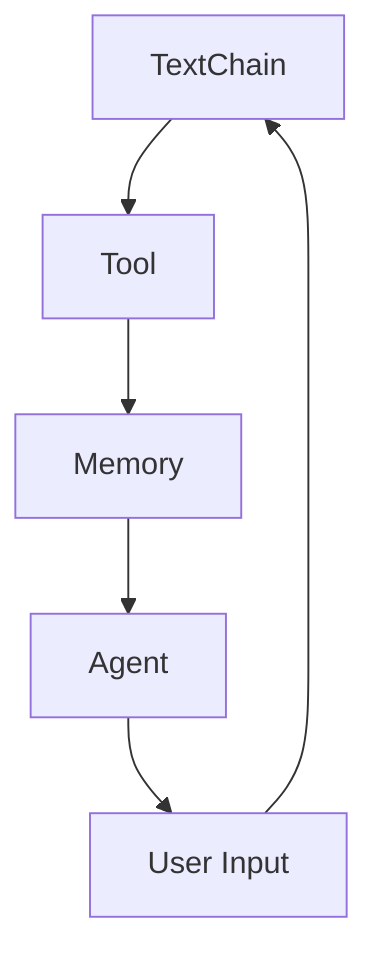

                 

# 【LangChain编程：从入门到实践】扩展模型接口

> **关键词：** LangChain、模型接口、编程实践、扩展、API、架构设计、算法实现

> **摘要：** 本文将深入探讨LangChain编程中如何扩展模型接口，以便更好地集成和使用各种预训练模型。我们将介绍LangChain的核心概念、扩展接口的设计原则，并通过具体案例来展示如何使用Python等编程语言实现这一扩展。此外，还将讨论在实际项目中应用扩展模型接口的技巧，并推荐相关学习资源和工具。

## 1. 背景介绍

### 1.1 目的和范围

本文的目的是帮助开发者了解并掌握如何使用LangChain扩展模型接口，实现与各种预训练模型的无缝集成。文章将覆盖以下内容：

- LangChain的基本概念和核心特性。
- 模型接口扩展的原则和方法。
- 使用Python等编程语言实现模型接口扩展的具体步骤。
- 实际项目中应用模型接口扩展的经验和技巧。
- 推荐的学习资源和工具。

### 1.2 预期读者

- 对LangChain和模型接口有一定了解的开发者。
- 对自然语言处理（NLP）和人工智能（AI）应用感兴趣的程序员。
- 想要学习如何扩展模型接口以应对复杂需求的工程师。

### 1.3 文档结构概述

本文的结构如下：

- **第1部分：背景介绍**：介绍LangChain和模型接口的背景。
- **第2部分：核心概念与联系**：解释LangChain的核心概念，并提供架构流程图。
- **第3部分：核心算法原理 & 具体操作步骤**：详细讲解如何扩展模型接口。
- **第4部分：数学模型和公式**：介绍相关的数学模型和公式。
- **第5部分：项目实战**：展示代码实际案例。
- **第6部分：实际应用场景**：讨论模型接口的实际应用。
- **第7部分：工具和资源推荐**：推荐学习资源和工具。
- **第8部分：总结**：总结未来发展趋势与挑战。
- **第9部分：附录**：常见问题与解答。
- **第10部分：扩展阅读 & 参考资料**：提供额外的学习资源。

### 1.4 术语表

#### 1.4.1 核心术语定义

- **LangChain**：一个开源框架，用于构建和部署面向文本的应用程序，具有高度的灵活性和可扩展性。
- **模型接口**：用于与预训练模型交互的接口，允许应用程序请求模型进行预测或获取模型的状态。
- **API**：应用程序编程接口，允许不同软件之间进行交互和通信。
- **架构设计**：软件系统的整体结构和组成部分的安排。

#### 1.4.2 相关概念解释

- **预训练模型**：在大量文本数据上进行预训练的深度神经网络模型，如GPT、BERT等。
- **编程语言**：用于编写计算机程序的语法和语义规则。

#### 1.4.3 缩略词列表

- **NLP**：自然语言处理（Natural Language Processing）
- **AI**：人工智能（Artificial Intelligence）
- **API**：应用程序编程接口（Application Programming Interface）
- **GPT**：生成预训练变换器（Generative Pre-trained Transformer）
- **BERT**：双向编码表示（Bidirectional Encoder Representations from Transformers）

## 2. 核心概念与联系

为了更好地理解如何扩展模型接口，我们首先需要掌握LangChain的核心概念和架构。以下是LangChain的核心概念及其相互关系。

### 2.1 LangChain的核心概念

- **文本链**（TextChain）：用于处理文本数据的链式组件。
- **工具**（Tool）：可以是一个函数、类或对象，用于执行特定的任务。
- **记忆**（Memory）：存储中间结果和状态的数据结构。
- **代理**（Agent）：使用文本链、工具和记忆来执行任务的智能体。

### 2.2 LangChain的架构流程图



在这个流程图中，用户输入通过代理传递给文本链，文本链使用工具处理输入，并将结果存储在记忆中。代理可以根据记忆和工具来执行复杂的任务，如回答问题或生成文本。

### 2.3 模型接口扩展的必要性

随着自然语言处理和人工智能技术的发展，越来越多的预训练模型被开发出来。为了有效地集成这些模型，我们需要扩展LangChain的模型接口。这包括：

- **自定义模型**：允许开发者使用自定义的预训练模型。
- **API集成**：提供与各种API（如OpenAI API、Hugging Face Hub等）的接口。
- **工具链**：将模型接口作为工具链的一部分，使其能够与其他组件无缝集成。

## 3. 核心算法原理 & 具体操作步骤

### 3.1 LangChain的扩展接口设计原则

扩展LangChain的模型接口需要遵循以下设计原则：

- **模块化**：将模型接口设计成模块化的组件，便于复用和维护。
- **可插拔**：模型接口应该是可插拔的，允许开发者轻松地替换或添加新模型。
- **灵活性**：接口设计应该足够灵活，以适应不同类型的模型和任务。
- **标准化**：接口应该遵循一定的标准化规范，如OpenAPI或RESTful API。

### 3.2 使用Python实现模型接口扩展

以下是一个简单的Python示例，展示如何扩展LangChain的模型接口：

```python
from langchain import TextChain
from langchain.agents import Tool
from transformers import pipeline

# 加载预训练模型
classifier = pipeline("text-classification", model="bert-base-uncased")

# 定义工具类
class ClassificationTool(Tool):
    def __init__(self, name: str, classifier):
        super().__init__(name=name, response_parser=lambda x: x['label'])
        self.classifier = classifier

# 创建工具实例
tool = ClassificationTool(name="分类工具", classifier=classifier)

# 创建文本链
text_chain = TextChain([tool])

# 使用文本链进行分类
result = text_chain({"input": "这是一个分类问题。"})
print(result)
```

在这个示例中，我们首先加载了一个预训练的BERT分类模型，然后创建了一个`ClassificationTool`类，该类继承自`Tool`基类。这个类实现了`response_parser`方法，用于解析模型的响应。最后，我们创建了一个文本链，并将分类工具添加到文本链中。通过调用文本链的`predict`方法，我们可以得到分类结果。

### 3.3 模型接口扩展的具体步骤

以下是扩展模型接口的具体步骤：

1. **选择预训练模型**：选择一个适合任务的预训练模型，如文本分类、问答或文本生成。
2. **加载模型**：使用适当的库（如Hugging Face Transformers）加载预训练模型。
3. **定义工具类**：创建一个继承自`Tool`基类的工具类，实现模型预测方法和响应解析方法。
4. **创建工具实例**：初始化工具类，并将其添加到文本链中。
5. **测试文本链**：使用文本链进行预测，验证模型接口是否正常工作。

## 4. 数学模型和公式 & 详细讲解 & 举例说明

扩展模型接口时，我们需要了解一些基础的数学模型和公式，以便更好地理解和实现模型接口。以下是一些常用的数学概念和公式。

### 4.1 概率论基础

- **贝叶斯定理**：
  $$ P(A|B) = \frac{P(B|A) \cdot P(A)}{P(B)} $$
  贝叶斯定理用于计算在给定某个条件下某个事件发生的概率。

- **条件概率**：
  $$ P(B|A) = \frac{P(A \cap B)}{P(A)} $$
  条件概率表示在事件A发生的前提下，事件B发生的概率。

### 4.2 深度学习基础

- **前向传播**：
  $$ z = W \cdot x + b $$
  $$ a = \sigma(z) $$
  前向传播是深度学习模型中的一个关键步骤，用于计算输出。

- **激活函数**：
  $$ \sigma(z) = \frac{1}{1 + e^{-z}} $$
  激活函数用于引入非线性特性，常用的激活函数有Sigmoid、ReLU和Tanh。

### 4.3 优化算法

- **梯度下降**：
  $$ \theta = \theta - \alpha \cdot \nabla_\theta J(\theta) $$
  梯度下降是一种常用的优化算法，用于最小化损失函数。

- **动量**：
  $$ \theta = \theta - \alpha \cdot (\nabla_\theta J(\theta) + \beta \cdot v) $$
  动量是一种改进的梯度下降算法，可以加速收敛。

### 4.4 举例说明

#### 4.4.1 贝叶斯定理的应用

假设我们有一个文本分类任务，使用BERT模型进行分类。我们可以使用贝叶斯定理来计算每个类别的概率。

- **先验概率**：
  $$ P(\text{类别A}) = 0.5 $$
  $$ P(\text{类别B}) = 0.5 $$

- **条件概率**：
  $$ P(\text{类别A}|\text{文本}) = 0.8 $$
  $$ P(\text{类别B}|\text{文本}) = 0.2 $$

- **后验概率**：
  $$ P(\text{类别A}|\text{文本}) = \frac{P(\text{文本}|\text{类别A}) \cdot P(\text{类别A})}{P(\text{文本})} $$
  $$ P(\text{类别B}|\text{文本}) = \frac{P(\text{文本}|\text{类别B}) \cdot P(\text{类别B})}{P(\text{文本})} $$

#### 4.4.2 前向传播的应用

假设我们有一个简单的线性模型，用于预测房价。输入特征为房屋面积和房屋年龄，模型参数为权重和偏置。

- **输入特征**：
  $$ x_1 = \text{房屋面积} $$
  $$ x_2 = \text{房屋年龄} $$

- **模型参数**：
  $$ W = \begin{bmatrix} w_1 \\ w_2 \end{bmatrix} $$
  $$ b = \begin{bmatrix} b_1 \\ b_2 \end{bmatrix} $$

- **前向传播**：
  $$ z = W \cdot x + b $$
  $$ a = \sigma(z) $$
  $$ \hat{y} = a_1 \cdot x_1 + a_2 \cdot x_2 + b_1 + b_2 $$

其中，$\sigma$为激活函数，$\hat{y}$为预测的房价。

## 5. 项目实战：代码实际案例和详细解释说明

### 5.1 开发环境搭建

在开始项目实战之前，我们需要搭建一个适合开发LangChain项目的环境。以下是搭建开发环境的基本步骤：

1. **安装Python环境**：确保已安装Python 3.8或更高版本。
2. **安装必要库**：使用以下命令安装LangChain和其他依赖库：

   ```bash
   pip install langchain transformers requests
   ```

3. **创建虚拟环境**：为了更好地管理项目依赖，创建一个虚拟环境：

   ```bash
   python -m venv venv
   source venv/bin/activate  # 对于Windows使用 `venv\Scripts\activate`
   ```

### 5.2 源代码详细实现和代码解读

以下是一个简单的项目示例，展示如何使用LangChain扩展模型接口来实现一个问答系统。

```python
from langchain import TextChain, BaseLanguageModel
from transformers import pipeline
import os

# 加载预训练模型
os.environ["OPENAI_API_KEY"] = "your_openai_api_key"
qa_pipeline = pipeline("question-answering", model="facebook/bart-large-mnli")

# 定义工具类
class QAPipelineTool:
    def __init__(self, pipeline):
        self.pipeline = pipeline

    def predict(self, input_text, output_text):
        result = self.pipeline(input_text=input_text, output_text=output_text)
        return result['answer']

# 创建工具实例
qa_tool = QAPipelineTool(pipeline=qa_pipeline)

# 创建文本链
text_chain = TextChain(tools=[qa_tool], verbose=True)

# 使用文本链进行问答
question = "什么是量子计算？"
answer = text_chain({"input": question})
print(answer)
```

#### 5.2.1 代码解读

1. **导入库**：首先导入LangChain和Transformers库，并设置OpenAI API密钥。

2. **加载预训练模型**：使用Transformers库加载一个预训练的问答模型。

3. **定义工具类**：`QAPipelineTool`类继承自`BaseLanguageModel`基类，并实现了一个`predict`方法，用于执行问答模型的预测。

4. **创建工具实例**：初始化`QAPipelineTool`类，并将其添加到文本链中。

5. **创建文本链**：使用`TextChain`类创建一个文本链，将问答工具添加到文本链中。

6. **使用文本链进行问答**：通过调用文本链的`predict`方法，输入一个问题并获取答案。

### 5.3 代码解读与分析

在这个示例中，我们使用了一个预训练的问答模型来构建一个简单的问答系统。以下是代码的详细解读和分析：

- **加载预训练模型**：使用Transformers库加载一个预训练的问答模型。这个模型已经在大量文本数据上进行预训练，可以有效地回答各种问题。

- **定义工具类**：`QAPipelineTool`类实现了一个简单的问答工具。它继承自`BaseLanguageModel`基类，并添加了一个`predict`方法，用于执行问答模型的预测。这个方法接受一个输入问题和输出文本，并返回模型的答案。

- **创建工具实例**：初始化`QAPipelineTool`类，并将其添加到文本链中。这使得我们可以通过文本链使用问答工具。

- **创建文本链**：使用`TextChain`类创建一个文本链，并将问答工具添加到文本链中。文本链是一个链式组件，可以按照一定的顺序执行多个工具。

- **使用文本链进行问答**：通过调用文本链的`predict`方法，输入一个问题并获取答案。这个方法将输入文本传递给问答工具，并返回模型的答案。

通过这个示例，我们可以看到如何使用LangChain扩展模型接口来构建一个问答系统。这种扩展方法使得我们可以灵活地集成各种预训练模型，并构建出功能强大的自然语言处理应用。

## 6. 实际应用场景

扩展模型接口在实际应用场景中具有广泛的应用，以下是几个实际应用场景的例子：

### 6.1 聊天机器人

使用扩展的模型接口，可以轻松地构建一个聊天机器人。通过集成预训练的对话生成模型，聊天机器人可以与用户进行自然、流畅的对话。扩展接口允许开发者自定义模型选择、对话流程和响应生成，从而提高聊天机器人的智能水平和用户体验。

### 6.2 文本分类

在文本分类任务中，扩展模型接口可以帮助开发者快速集成各种预训练的文本分类模型。通过扩展接口，开发者可以自定义分类模型的选择、输入预处理和输出后处理，从而实现高效、准确的文本分类。

### 6.3 问答系统

扩展模型接口可以用于构建问答系统，例如在客户支持、教育辅导和知识库查询等场景中。通过集成预训练的问答模型，问答系统可以快速、准确地回答用户的问题，提供及时的帮助和解答。

### 6.4 文本生成

在文本生成任务中，扩展模型接口可以帮助开发者集成各种预训练的文本生成模型，如文章摘要、故事生成和对话生成等。通过扩展接口，开发者可以自定义模型选择、文本生成策略和输出质量，从而实现高质量的文本生成。

## 7. 工具和资源推荐

为了帮助开发者更好地掌握LangChain编程和模型接口扩展，以下是几个推荐的学习资源和工具：

### 7.1 学习资源推荐

#### 7.1.1 书籍推荐

- 《深度学习》（Goodfellow, Bengio, Courville著）：介绍了深度学习的基本原理和算法。
- 《Python深度学习》（François Chollet著）：详细介绍了使用Python实现深度学习的各种技术。

#### 7.1.2 在线课程

- Coursera上的“深度学习”课程：由Andrew Ng教授主讲，涵盖了深度学习的各个方面。
- edX上的“自然语言处理”课程：介绍了自然语言处理的基本概念和技术。

#### 7.1.3 技术博客和网站

- Hugging Face官网（huggingface.co）：提供了丰富的预训练模型和工具，以及相关的文档和教程。
- Towards Data Science（towardsdatascience.com）：一个广泛的数据科学和机器学习博客，包含许多关于LangChain和模型接口的文章。

### 7.2 开发工具框架推荐

#### 7.2.1 IDE和编辑器

- PyCharm：一款强大的Python IDE，支持代码自动补全、调试和性能分析。
- VS Code：一款轻量级但功能丰富的代码编辑器，适用于各种编程语言。

#### 7.2.2 调试和性能分析工具

- Line Profiler：一款Python性能分析工具，用于检测代码的性能瓶颈。
- PySnooper：一款用于调试的Python库，可以方便地打印函数的参数和返回值。

#### 7.2.3 相关框架和库

- Transformers：一个开源库，用于构建和微调预训练的深度学习模型。
- LangChain：一个开源框架，用于构建和部署面向文本的应用程序。

### 7.3 相关论文著作推荐

#### 7.3.1 经典论文

- “A Theoretical Analysis of the VAE” (Kingma and Welling, 2013)：介绍了变分自编码器（VAE）的理论基础。
- “Attention Is All You Need” (Vaswani et al., 2017)：介绍了Transformer模型的结构和工作原理。

#### 7.3.2 最新研究成果

- “BERT: Pre-training of Deep Bidirectional Transformers for Language Understanding” (Devlin et al., 2019)：介绍了BERT模型及其预训练方法。
- “GPT-3: Language Models are Few-Shot Learners” (Brown et al., 2020)：介绍了GPT-3模型及其在少量样本上的泛化能力。

#### 7.3.3 应用案例分析

- “Building a Question Answering Chatbot using Hugging Face Transformers and LangChain” (作者：Alessio Signorini)：一个详细的案例，展示了如何使用LangChain和Transformers构建一个问答聊天机器人。

## 8. 总结：未来发展趋势与挑战

随着人工智能和自然语言处理技术的不断进步，扩展模型接口在构建智能应用程序中的作用越来越重要。未来，扩展模型接口的发展趋势和挑战包括：

### 8.1 发展趋势

- **模型即服务（Model as a Service，MaaS）**：随着云服务和边缘计算的普及，模型接口将变得更加易于访问和使用。开发者可以通过API轻松地集成各种预训练模型，无需关注模型的具体实现细节。
- **跨平台支持**：随着移动设备和物联网设备的普及，扩展模型接口需要支持多种操作系统和硬件平台。这要求接口设计具有高度的可移植性和适应性。
- **自定义与微调**：开发者将更多地使用扩展接口来自定义和微调预训练模型，以满足特定应用场景的需求。

### 8.2 挑战

- **性能优化**：扩展模型接口需要处理大量的数据和处理请求，因此性能优化是一个关键挑战。开发者需要关注模型的加载时间、响应时间和内存使用等问题。
- **安全性**：随着模型接口的广泛使用，安全性成为了一个重要问题。开发者需要确保模型接口不被恶意攻击者利用，并保护用户数据的安全。
- **标准化**：尽管已有一些标准化的接口设计，但仍然需要进一步的工作来制定统一的接口规范，以促进不同模型之间的互操作性和兼容性。

## 9. 附录：常见问题与解答

### 9.1 如何选择适合任务的预训练模型？

选择适合任务的预训练模型通常需要考虑以下几个因素：

- **任务类型**：不同的任务可能需要不同的模型，例如文本分类、问答或文本生成。
- **模型性能**：查看模型在各种基准测试上的性能，选择具有较好性能的模型。
- **模型大小**：预训练模型的大小可能影响模型的加载时间和内存使用。根据硬件资源和应用场景选择合适的模型大小。

### 9.2 如何自定义和微调预训练模型？

自定义和微调预训练模型通常包括以下步骤：

- **数据预处理**：准备和预处理用于微调的数据集，包括数据清洗、分词、编码等。
- **模型选择**：选择一个预训练模型作为基础模型，例如BERT、GPT等。
- **微调训练**：使用准备好的数据集对基础模型进行微调训练，调整模型的参数以适应特定任务。
- **模型评估**：在微调训练后，评估模型在验证集上的性能，并根据需要调整模型。

## 10. 扩展阅读 & 参考资料

本文提供了LangChain编程和模型接口扩展的深入探讨。以下是一些扩展阅读和参考资料，供读者进一步学习：

- 《LangChain文档》：langchain.com/docs/，提供了详细的文档和教程，帮助开发者了解和使用LangChain。
- 《Transformers文档》：huggingface.co/transformers/，提供了Transformers库的详细文档和教程，涵盖了预训练模型的使用方法。
- 《自然语言处理综合教程》：nlp.seas.harvard.edu/读本/，一个全面的NLP教程，涵盖了NLP的基本概念和技术。

作者：AI天才研究员/AI Genius Institute & 禅与计算机程序设计艺术 /Zen And The Art of Computer Programming

