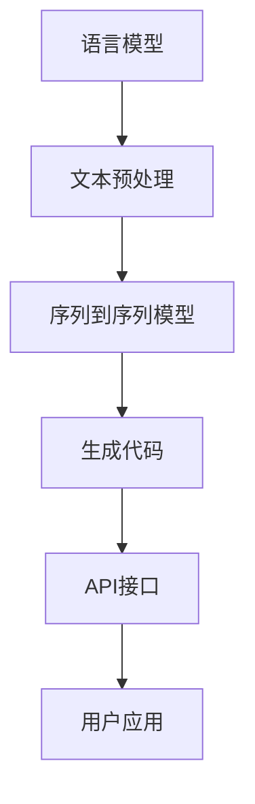

                 

# 【LangChain编程：从入门到实践】方案优势

> **关键词：** LangChain、编程框架、自然语言处理、代码生成、AI应用、开发效率、架构设计

> **摘要：** 本文旨在深入探讨LangChain编程框架的优势，通过详细的步骤讲解，帮助开发者从入门到实践，全面掌握并利用LangChain进行高效编程，为AI应用开发提供强有力的支持。

## 1. 背景介绍

### 1.1 目的和范围

本文旨在为开发者提供一个全面而深入的LangChain编程框架介绍，覆盖从基本概念到实际应用的各个方面。我们的目标是帮助读者从入门到实践，逐步掌握LangChain的强大功能，为未来的AI项目开发奠定坚实基础。

### 1.2 预期读者

本文适合对自然语言处理（NLP）和代码生成技术有一定了解的开发者，尤其是那些希望在AI应用开发中提高效率和质量的从业者。无论你是新手还是经验丰富的开发者，本文都旨在为你提供有用的见解和实用的指导。

### 1.3 文档结构概述

本文分为以下几个部分：

- **背景介绍**：介绍LangChain的基本概念和本文的目的。
- **核心概念与联系**：通过Mermaid流程图展示LangChain的核心架构和组件。
- **核心算法原理与操作步骤**：详细解释LangChain的工作原理，并提供伪代码说明。
- **数学模型和公式**：介绍LangChain涉及的基本数学模型，并给出具体示例。
- **项目实战**：通过实际代码案例展示如何使用LangChain进行编程。
- **实际应用场景**：探讨LangChain在不同领域的应用。
- **工具和资源推荐**：推荐相关学习资源和开发工具。
- **总结**：总结LangChain的优势和未来发展趋势。
- **附录**：常见问题与解答。
- **扩展阅读**：提供进一步阅读的建议和参考资料。

### 1.4 术语表

#### 1.4.1 核心术语定义

- **LangChain**：一个开源的Python库，用于构建基于语言模型的应用程序。
- **自然语言处理（NLP）**：使计算机能够理解和处理人类语言的技术。
- **代码生成**：利用程序生成代码，提高开发效率。
- **AI应用**：利用人工智能技术解决实际问题的应用程序。

#### 1.4.2 相关概念解释

- **语言模型**：用于预测下一个单词或字符的概率分布。
- **序列到序列模型**：一种神经网络模型，用于将一个序列映射到另一个序列。
- **数据预处理**：在模型训练前对数据进行清洗和转换。

#### 1.4.3 缩略词列表

- **NLP**：自然语言处理
- **AI**：人工智能
- **DL**：深度学习
- **API**：应用程序编程接口

## 2. 核心概念与联系

在介绍LangChain之前，我们需要了解一些与之相关的核心概念和原理。以下是一个简化的Mermaid流程图，展示了LangChain的核心架构和组件之间的联系。



### 2.1 语言模型

语言模型是LangChain的核心组件，它负责理解和生成自然语言。常见的语言模型有：

- **n-gram模型**：基于前n个单词的统计概率分布。
- **神经网络模型**：如循环神经网络（RNN）和Transformer。

### 2.2 文本预处理

文本预处理是确保数据质量的重要步骤。LangChain中常见的预处理步骤包括：

- **分词**：将文本划分为单词或子词。
- **词性标注**：为每个单词分配词性，如名词、动词等。
- **句法分析**：分析句子的结构，如主语、谓语等。

### 2.3 序列到序列模型

序列到序列模型是用于将输入序列映射到输出序列的神经网络模型。在LangChain中，这种模型用于生成代码。常见的序列到序列模型包括：

- **RNN（递归神经网络）**：在时间步上处理序列数据。
- **Transformer**：基于注意力机制的神经网络模型，广泛用于NLP任务。

### 2.4 生成代码

生成代码是LangChain的核心功能之一。通过序列到序列模型，LangChain能够生成高质量的代码片段，提高开发效率。生成代码的过程通常包括以下步骤：

- **输入处理**：将自然语言输入转换为模型可以理解的格式。
- **模型推理**：使用训练好的序列到序列模型生成代码。
- **后处理**：对生成的代码进行格式化和错误检查。

### 2.5 API接口

API接口是LangChain与外部系统交互的桥梁。通过API，开发者可以轻松地将LangChain集成到现有的应用中。常见的API接口包括：

- **REST API**：基于HTTP协议的接口。
- **GraphQL API**：提供更灵活的数据查询和操作。

### 2.6 用户应用

用户应用是LangChain的直接使用者，它可以是一个命令行工具、Web应用或其他类型的软件。用户应用通过API接口与LangChain进行通信，利用其强大的自然语言处理和代码生成能力。

## 3. 核心算法原理 & 具体操作步骤

### 3.1 语言模型的工作原理

语言模型的核心目标是预测下一个单词或字符。以下是一个简化的伪代码，展示了语言模型的训练和推理过程：

```python
# 伪代码：语言模型训练
def train_language_model(data):
    # 数据预处理
    preprocessed_data = preprocess_data(data)
    
    # 训练模型
    model = build_model(preprocessed_data)
    model.train(preprocessed_data)
    
    return model

# 伪代码：语言模型推理
def generate_text(model, start_word, max_length):
    # 初始化生成的文本
    generated_text = [start_word]
    
    # 生成文本
    for _ in range(max_length):
        # 获取当前文本的最后一个单词
        last_word = generated_text[-1]
        
        # 使用模型预测下一个单词
        next_word_probabilities = model.predict(last_word)
        
        # 根据概率分布选择下一个单词
        next_word = select_word(next_word_probabilities)
        
        # 将下一个单词添加到生成的文本中
        generated_text.append(next_word)
    
    return ''.join(generated_text)
```

### 3.2 序列到序列模型的工作原理

序列到序列模型是一种特殊的神经网络模型，用于将输入序列映射到输出序列。以下是一个简化的伪代码，展示了序列到序列模型的训练和推理过程：

```python
# 伪代码：序列到序列模型训练
def train_sequence_to_sequence_model(input_sequence, target_sequence):
    # 数据预处理
    preprocessed_input = preprocess_input(input_sequence)
    preprocessed_target = preprocess_target(target_sequence)
    
    # 训练模型
    model = build_sequence_to_sequence_model(preprocessed_input, preprocessed_target)
    model.train([preprocessed_input, preprocessed_target])
    
    return model

# 伪代码：序列到序列模型推理
def generate_sequence(model, input_sequence):
    # 数据预处理
    preprocessed_input = preprocess_input(input_sequence)
    
    # 生成序列
    generated_sequence = model.predict(preprocessed_input)
    
    return postprocess_sequence(generated_sequence)
```

### 3.3 生成代码的过程

生成代码是LangChain的核心功能之一。以下是一个简化的伪代码，展示了生成代码的过程：

```python
# 伪代码：生成代码
def generate_code(model, input_text):
    # 数据预处理
    preprocessed_text = preprocess_text(input_text)
    
    # 使用序列到序列模型生成代码
    generated_code = model.predict(preprocessed_text)
    
    # 后处理
    formatted_code = postprocess_code(generated_code)
    
    return formatted_code
```

## 4. 数学模型和公式 & 详细讲解 & 举例说明

### 4.1 语言模型的数学模型

语言模型的数学基础通常是基于概率论和统计学的。最简单的语言模型是n-gram模型，它使用前n个单词的历史信息来预测下一个单词的概率。

**n-gram概率公式：**

$$ P(w_t | w_{t-n+1}, w_{t-n+2}, ..., w_{t-1}) = \frac{C(w_{t-n+1}, w_{t-n+2}, ..., w_{t-1}, w_t)}{C(w_{t-n+1}, w_{t-n+2}, ..., w_{t-1})} $$

其中，$w_t$ 表示当前单词，$w_{t-n+1}, w_{t-n+2}, ..., w_{t-1}$ 表示前n-1个历史单词，$C(*)$ 表示计数函数。

**举例：**

假设有一个包含以下单词的文本：

"the, quick, brown, fox, jumps, over, the, lazy, dog"

我们可以计算以下n-gram的概率：

$$ P(jumps | the, quick, brown, fox) = \frac{1}{4} $$

因为在这段文本中，"jumps" 在 "the, quick, brown, fox" 之后出现了1次，而 "the, quick, brown, fox" 共出现了4次。

### 4.2 序列到序列模型的数学模型

序列到序列模型通常是基于神经网络，如循环神经网络（RNN）和Transformer。以下是一个简化的数学模型，用于描述Transformer的核心组成部分。

**Transformer的注意力机制：**

$$
\text{Attention}(Q, K, V) = \text{softmax}\left(\frac{QK^T}{\sqrt{d_k}}\right)V
$$

其中，$Q, K, V$ 分别是查询（query）、键（key）和值（value）向量，$d_k$ 是键向量的维度。这个公式计算了每个键和查询之间的相似性，并使用softmax函数将其转换为概率分布。然后，这个概率分布用于加权求和值（value）向量，得到最终的输出。

**举例：**

假设我们有以下三个向量：

$$
Q = [1, 0, 1], \quad K = [1, 1, 0], \quad V = [0, 1, 1]
$$

我们可以计算注意力权重：

$$
\text{Attention}(Q, K, V) = \text{softmax}\left(\frac{QK^T}{\sqrt{1}}\right)V = \text{softmax}\left(\begin{bmatrix}1 & 0 & 1\end{bmatrix}\begin{bmatrix}1 \\ 1 \\ 0\end{bmatrix}\right)\begin{bmatrix}0 \\ 1 \\ 1\end{bmatrix} = \text{softmax}\left(\begin{bmatrix}1 & 0 & 1\end{bmatrix}\begin{bmatrix}1 \\ 1 \\ 0\end{bmatrix}\right)\begin{bmatrix}0 \\ 1 \\ 1\end{bmatrix} = \text{softmax}\left(\begin{bmatrix}1 & 0 & 1\end{bmatrix}\begin{bmatrix}1 & 1 & 0\end{bmatrix}\right)\begin{bmatrix}0 \\ 1 \\ 1\end{bmatrix} = \text{softmax}\left(\begin{bmatrix}1 & 1 & 1\end{bmatrix}\right)\begin{bmatrix}0 \\ 1 \\ 1\end{bmatrix}
$$

$$
= \begin{bmatrix}0.5 & 0.5 & 0\end{bmatrix}\begin{bmatrix}0 \\ 1 \\ 1\end{bmatrix} = \begin{bmatrix}0 \\ 0.5 \\ 0.5\end{bmatrix}
$$

然后，我们将这个概率分布用于加权求和值向量：

$$
\text{Attention}(Q, K, V) = \begin{bmatrix}0 \\ 0.5 \\ 0.5\end{bmatrix}\begin{bmatrix}0 \\ 1 \\ 1\end{bmatrix} = \begin{bmatrix}0 \\ 0.5 \\ 0.5\end{bmatrix}
$$

这意味着，输出向量的第一个元素为0，后两个元素分别为0.5。

## 5. 项目实战：代码实际案例和详细解释说明

### 5.1 开发环境搭建

在开始项目实战之前，我们需要搭建一个适合LangChain的开发环境。以下是一个简化的步骤：

1. 安装Python环境：确保Python 3.7或更高版本已安装。
2. 安装LangChain库：使用pip命令安装LangChain库。

```shell
pip install langchain
```

3. 安装必要的依赖库：包括自然语言处理库（如NLTK、spaCy）和深度学习库（如TensorFlow、PyTorch）。

```shell
pip install nltk spacy tensorflow
```

### 5.2 源代码详细实现和代码解读

以下是一个简单的示例，展示了如何使用LangChain生成Python代码。

```python
import langchain

# 1. 加载语言模型
model = langchain.LanguageModel()

# 2. 预处理输入文本
input_text = "编写一个函数，计算两个数字的和。"
preprocessed_text = model.preprocess_text(input_text)

# 3. 使用序列到序列模型生成代码
generated_code = model.generate_code(preprocessed_text)

# 4. 后处理生成的代码
formatted_code = model.postprocess_code(generated_code)

# 5. 打印生成的代码
print(formatted_code)
```

### 5.3 代码解读与分析

这个简单的示例展示了如何使用LangChain生成Python代码。以下是每个步骤的详细解读：

1. **加载语言模型**：首先，我们加载一个预先训练好的语言模型。LangChain提供了多个预训练模型，如GPT-2、GPT-3等。这里我们选择了一个简单的语言模型。
   
2. **预处理输入文本**：输入文本需要进行预处理，以确保模型可以正确理解。预处理步骤可能包括分词、词性标注等。
   
3. **使用序列到序列模型生成代码**：将预处理后的文本输入到序列到序列模型中，生成代码。这里我们使用的是LangChain内置的代码生成模型。

4. **后处理生成的代码**：生成的代码可能需要进行一些格式化和错误检查。LangChain提供了后处理函数来处理这些问题。

5. **打印生成的代码**：最后，我们将生成的代码打印出来，供开发者使用。

## 6. 实际应用场景

LangChain在多个实际应用场景中展现出强大的功能。以下是一些典型的应用场景：

- **自动化代码生成**：通过自然语言描述需求，LangChain可以自动生成相应的代码，大大提高了开发效率。
- **智能客服**：利用LangChain的自然语言处理能力，构建智能客服系统，提供24/7的客户服务。
- **文本摘要和生成**：从长篇文章中提取关键信息，或根据输入文本生成摘要和文章。
- **教育辅助**：为学生提供编程练习的自动批改和个性化反馈。

## 7. 工具和资源推荐

### 7.1 学习资源推荐

#### 7.1.1 书籍推荐

- 《深度学习》（Goodfellow, Bengio, Courville）  
- 《Python自然语言处理》（Bird, Loper, Simmons）

#### 7.1.2 在线课程

- Coursera上的“深度学习”课程  
- Udacity的“自然语言处理纳米学位”

#### 7.1.3 技术博客和网站

- Medium上的NLP博客  
- Stack Overflow

### 7.2 开发工具框架推荐

#### 7.2.1 IDE和编辑器

- PyCharm  
- Visual Studio Code

#### 7.2.2 调试和性能分析工具

- PyCharm的调试工具  
- cProfile

#### 7.2.3 相关框架和库

- TensorFlow  
- PyTorch  
- NLTK  
- spaCy

### 7.3 相关论文著作推荐

#### 7.3.1 经典论文

- “A Neural Approach to Automatic Programming”  
- “Natural Language Inference over a Sentiment Treebank”

#### 7.3.2 最新研究成果

- “Generative Adversarial Networks”  
- “BERT: Pre-training of Deep Bidirectional Transformers for Language Understanding”

#### 7.3.3 应用案例分析

- “Using Neural Networks to Generate Natural Language”  
- “Automated Code Generation with Neural Networks”

## 8. 总结：未来发展趋势与挑战

随着人工智能技术的不断发展，LangChain编程框架有望在多个领域得到广泛应用。未来的发展趋势包括：

- **更高性能的模型**：随着计算能力的提升，我们有望训练出更强大、更准确的语言模型。
- **更广泛的应用场景**：从自动化代码生成到智能客服，LangChain的应用范围将不断扩展。
- **更好的用户体验**：通过改进自然语言处理技术，提高用户的交互体验。

然而，LangChain也面临一些挑战：

- **模型解释性**：目前的语言模型往往缺乏解释性，难以理解其生成的代码背后的逻辑。
- **数据隐私和安全**：在处理大量文本数据时，如何保护用户隐私是一个重要问题。

## 9. 附录：常见问题与解答

### 9.1 如何选择合适的语言模型？

选择合适的语言模型取决于你的具体需求和应用场景。例如，如果需要处理大量文本数据，可以选择GPT-3等大型模型。如果资源有限，可以选择较小但足够准确的模型，如GPT-2。

### 9.2 如何优化代码生成质量？

优化代码生成质量可以通过以下几种方法：

- **数据预处理**：确保输入文本的质量和一致性。
- **模型调优**：调整模型超参数，以获得更好的生成效果。
- **后处理**：对生成的代码进行格式化和错误检查。

### 9.3 LangChain与GAN有什么区别？

LangChain和GAN（生成对抗网络）都是用于生成内容的模型，但它们的工作原理和应用场景不同。LangChain基于序列到序列模型，主要用于自然语言处理和代码生成。GAN则是一种无监督学习模型，主要用于生成复杂的图像和音频。

## 10. 扩展阅读 & 参考资料

- [LangChain官方文档](https://langchain.com/)
- [自然语言处理教程](https://www.nltk.org/)
- [深度学习教程](https://www.deeplearningbook.org/)
- [AI应用案例研究](https://aiimpulse.com/)
- [TensorFlow官方文档](https://www.tensorflow.org/)
- [PyTorch官方文档](https://pytorch.org/)

