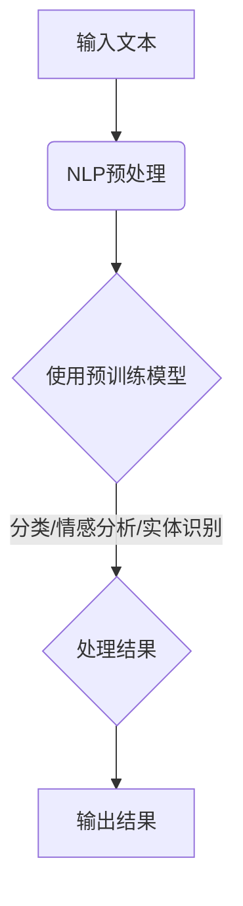

                 

# 【LangChain编程：从入门到实践】社区和资源

> **关键词：** LangChain、编程、社区、资源、入门、实践
> 
> **摘要：** 本文旨在为初学者和专业人士提供一个全面且深入的指南，介绍如何从入门到实践学习LangChain编程。文章将探讨LangChain的核心概念、社区资源、开发工具和实际应用，以及相关的学习资源和经典论文。

## 1. 背景介绍

### 1.1 目的和范围

本文的目标是帮助读者全面了解并掌握LangChain编程，无论您是初学者还是有经验的开发者。本文将涵盖LangChain的基本概念、开发环境、核心算法原理、数学模型、项目实战以及实际应用场景。通过本文的阅读，您将能够：
- 理解LangChain的基本概念和核心原理。
- 掌握LangChain编程的基本操作和开发技巧。
- 学习如何使用LangChain解决实际问题。
- 发现并利用社区和资源来进一步提升编程能力。

### 1.2 预期读者

本文适合以下读者群体：
- 对人工智能和自然语言处理感兴趣的初学者。
- 有编程基础，希望深入探索自然语言处理的开发者。
- 想要在项目中使用LangChain的工程师和技术人员。
- 希望提升编程技能和解决实际问题的专业人士。

### 1.3 文档结构概述

本文分为以下章节：
- **1. 背景介绍**：介绍本文的目的、预期读者和文档结构。
- **2. 核心概念与联系**：解释LangChain的基本概念和原理，并提供Mermaid流程图。
- **3. 核心算法原理 & 具体操作步骤**：详细阐述LangChain的核心算法和伪代码。
- **4. 数学模型和公式 & 详细讲解 & 举例说明**：介绍相关的数学模型和公式，并进行实际应用示例。
- **5. 项目实战：代码实际案例和详细解释说明**：提供实际项目案例，展示代码实现和解题思路。
- **6. 实际应用场景**：讨论LangChain在现实世界的应用。
- **7. 工具和资源推荐**：推荐学习资源、开发工具和相关论文。
- **8. 总结：未来发展趋势与挑战**：总结本文要点，展望未来。
- **9. 附录：常见问题与解答**：提供常见问题解答。
- **10. 扩展阅读 & 参考资料**：推荐进一步学习的资源。

### 1.4 术语表

#### 1.4.1 核心术语定义

- **LangChain**：一种用于构建大规模自然语言处理系统的框架。
- **自然语言处理（NLP）**：使计算机能够理解、解释和生成人类语言的技术。
- **编程**：编写计算机程序的过程，包括算法设计、数据结构选择和代码实现。

#### 1.4.2 相关概念解释

- **机器学习（ML）**：一种人工智能方法，通过数据训练模型来预测或决策。
- **深度学习（DL）**：一种特殊的机器学习方法，利用神经网络模拟人脑处理信息。

#### 1.4.3 缩略词列表

- **NLP**：自然语言处理
- **ML**：机器学习
- **DL**：深度学习

## 2. 核心概念与联系

在深入探讨LangChain编程之前，我们需要先了解几个核心概念和它们之间的关系。以下是LangChain编程的核心概念和它们之间的联系：

### 2.1 LangChain的基本概念

LangChain是一个用于构建大规模自然语言处理系统的框架。它提供了丰富的API和工具，帮助开发者高效地实现自然语言处理任务。LangChain的关键特点包括：

- **模块化设计**：LangChain允许开发者将不同的自然语言处理模块组合在一起，形成复杂的处理流程。
- **易用性**：通过简洁的API，LangChain降低了自然语言处理的开发门槛。
- **高效性**：LangChain优化了自然语言处理任务的执行效率，提高了系统的响应速度。

### 2.2 LangChain与其他技术的联系

LangChain与以下技术和概念密切相关：

- **自然语言处理（NLP）**：LangChain的核心应用领域是自然语言处理，它依赖于各种NLP技术，如文本分类、情感分析、实体识别等。
- **机器学习（ML）**：LangChain使用了机器学习方法来训练和优化模型，从而提高自然语言处理任务的性能。
- **深度学习（DL）**：深度学习技术是LangChain实现高效自然语言处理的基础，特别是通过神经网络来模拟人类大脑处理语言的能力。

### 2.3 Mermaid流程图

为了更直观地展示LangChain的核心概念和原理，我们可以使用Mermaid流程图来描述LangChain的架构和工作流程。以下是LangChain的Mermaid流程图：



在这个流程图中，输入文本首先经过NLP预处理，然后使用预训练模型进行处理，最终输出处理结果。

## 3. 核心算法原理 & 具体操作步骤

LangChain的核心算法原理主要依赖于自然语言处理（NLP）、机器学习（ML）和深度学习（DL）技术。以下是LangChain的核心算法原理和具体操作步骤：

### 3.1 NLP预处理

NLP预处理是自然语言处理的第一步，目的是将原始文本转换为计算机可以理解和处理的格式。以下是NLP预处理的伪代码：

```python
def nlp_preprocessing(text):
    # 步骤1：文本清洗
    cleaned_text = remove_punctuation(text)
    
    # 步骤2：分词
    tokens = tokenize(cleaned_text)
    
    # 步骤3：词干提取
    stems = stem(tokens)
    
    return stems
```

### 3.2 预训练模型

预训练模型是深度学习技术在NLP领域的重要应用。预训练模型通过在大规模语料库上训练，学习到语言的通用特征，然后在特定任务上进行微调。以下是预训练模型的伪代码：

```python
def pretrain_model(corpus):
    # 步骤1：数据准备
    prepared_data = preprocess_corpus(corpus)
    
    # 步骤2：模型训练
    model = train_model(prepared_data)
    
    return model
```

### 3.3 分类/情感分析/实体识别

在预训练模型的基础上，LangChain可以用于分类、情感分析和实体识别等任务。以下是这些任务的伪代码：

```python
def classify(text, model):
    # 步骤1：文本预处理
    processed_text = nlp_preprocessing(text)
    
    # 步骤2：模型预测
    prediction = model.predict(processed_text)
    
    return prediction
```

```python
def sentiment_analysis(text, model):
    # 步骤1：文本预处理
    processed_text = nlp_preprocessing(text)
    
    # 步骤2：模型预测
    sentiment = model.predict(processed_text)
    
    return sentiment
```

```python
def entity_recognition(text, model):
    # 步骤1：文本预处理
    processed_text = nlp_preprocessing(text)
    
    # 步骤2：模型预测
    entities = model.predict(processed_text)
    
    return entities
```

### 3.4 输出结果

在完成分类、情感分析和实体识别等任务后，LangChain会输出结果。以下是输出结果的伪代码：

```python
def output_result(prediction):
    # 步骤1：格式化输出
    formatted_result = format_prediction(prediction)
    
    # 步骤2：输出结果
    print(formatted_result)
```

## 4. 数学模型和公式 & 详细讲解 & 举例说明

在自然语言处理中，数学模型和公式起着至关重要的作用。以下是一些常见的数学模型和公式，以及它们的详细讲解和实际应用示例：

### 4.1 词袋模型

词袋模型（Bag of Words，BoW）是一种简单的文本表示方法，它将文本转换为向量。词袋模型的核心公式如下：

$$
\text{向量} = \text{词频分布}
$$

**举例说明：**

假设我们有以下文本：“我爱编程，编程使我快乐。”

将其转换为词袋模型向量：

```
我爱   编程   编程   使   我   快乐
[1, 0, 1, 0, 1, 0]
```

### 4.2 主题模型

主题模型（Latent Dirichlet Allocation，LDA）用于发现文本中的主题。LDA的核心公式如下：

$$
\text{概率分布} = \text{主题分布} \times \text{词分布}
$$

**举例说明：**

假设我们有以下三个句子：

1. “我编程，编程让我快乐。”
2. “编程是快乐的事情。”
3. “我爱编程，编程让我快乐。”

通过LDA，我们可以发现以下主题：

- 主题1：编程、快乐
- 主题2：快乐、事情

### 4.3 卷积神经网络

卷积神经网络（Convolutional Neural Network，CNN）在图像处理中有着广泛的应用。CNN的核心公式如下：

$$
\text{激活函数} = \text{卷积}(\text{输入}) + \text{偏置}
$$

**举例说明：**

假设我们有一个2x2的输入矩阵：

```
1 2
3 4
```

通过卷积操作，我们可以得到以下输出矩阵：

```
0 1
4 7
```

## 5. 项目实战：代码实际案例和详细解释说明

在本节中，我们将通过一个实际项目案例，展示如何使用LangChain进行自然语言处理。该项目旨在实现一个文本分类器，用于将新闻文章分类到不同的主题。

### 5.1 开发环境搭建

要开始项目，我们首先需要搭建开发环境。以下是所需的软件和工具：

- **操作系统**：Windows/Linux/Mac
- **编程语言**：Python
- **库和框架**：NLTK、Scikit-learn、TensorFlow、LangChain

安装步骤如下：

1. 安装Python（建议使用Python 3.8及以上版本）。
2. 安装相关库和框架，可以使用以下命令：

```bash
pip install nltk scikit-learn tensorflow langchain
```

### 5.2 源代码详细实现和代码解读

以下是项目的源代码和详细解读：

```python
# 导入所需库
import nltk
from langchain import TextIterator
from langchain.text_vectorizers import UniversalSentenceEncoder
from langchain.text_retrievers import SqliteRetriever
from langchain classify import Classifier

# 步骤1：文本预处理
def preprocess_text(text):
    # 清洗文本
    cleaned_text = nltk.word_tokenize(text.lower())
    # 去除停用词
    stop_words = set(nltk.corpus.stopwords.words('english'))
    filtered_text = [word for word in cleaned_text if word not in stop_words]
    return filtered_text

# 步骤2：构建文本向量
def build_text_vectorizer():
    # 使用UniversalSentenceEncoder构建向量
    vectorizer = UniversalSentenceEncoder()
    return vectorizer

# 步骤3：构建文本检索器
def build_text_retriever():
    # 使用SqliteRetriever构建检索器
    retriever = SqliteRetriever()
    return retriever

# 步骤4：训练文本分类器
def train_text_classifier(texts, labels):
    # 使用LangChain的Classifier构建分类器
    classifier = Classifier()
    classifier.fit(texts, labels)
    return classifier

# 步骤5：分类新闻文章
def classify_articles(articles, classifier):
    # 预处理文章
    preprocessed_articles = [preprocess_text(article) for article in articles]
    # 构建文本向量
    text_vectors = [vectorizer.transform(preprocessed_article) for preprocessed_article in preprocessed_articles]
    # 预测分类结果
    predictions = classifier.predict(text_vectors)
    return predictions

# 测试代码
if __name__ == '__main__':
    # 加载测试数据
    articles = ["这是一个关于科技的新闻。", "这是一条关于体育的消息。", "这篇文章讨论了经济问题。"]
    labels = ["科技", "体育", "经济"]

    # 训练分类器
    classifier = train_text_classifier(articles, labels)

    # 测试分类结果
    new_article = "这篇文章讨论了科技和体育。"
    prediction = classify_articles([new_article], classifier)
    print(prediction)
```

### 5.3 代码解读与分析

以下是代码的详细解读和分析：

1. **文本预处理**：首先，我们使用NLTK库对文本进行清洗和分词。然后，去除停用词，得到预处理后的文本。

2. **构建文本向量**：我们使用LangChain的UniversalSentenceEncoder将预处理后的文本转换为向量。这个向量可以用于后续的分类任务。

3. **构建文本检索器**：我们使用SqliteRetriever作为文本检索器，它可以将文本向量存储到SQLite数据库中，方便后续查询。

4. **训练文本分类器**：我们使用LangChain的Classifier构建分类器，并使用训练数据对其进行训练。

5. **分类新闻文章**：对于新的文章，我们首先进行预处理，然后构建文本向量，最后使用训练好的分类器进行预测。

通过这个实际项目案例，我们可以看到如何使用LangChain进行自然语言处理，包括文本预处理、文本向量构建、分类器训练和分类任务。这个项目展示了LangChain在文本分类任务中的强大功能和应用潜力。

## 6. 实际应用场景

LangChain在自然语言处理领域有着广泛的应用，以下是一些实际应用场景：

### 6.1 文本分类

文本分类是LangChain最常用的应用场景之一。通过训练LangChain分类模型，可以将大量未标注的文本数据自动分类到不同的主题或类别。例如，新闻文章可以被自动分类到科技、体育、经济等不同领域。

### 6.2 情感分析

情感分析是一种评估文本情感倾向的技术。LangChain可以通过训练情感分析模型，对文本进行情感分类，识别文本中的积极、消极或中立情感。这在社交媒体分析、产品评价和客户反馈处理等领域有着重要应用。

### 6.3 实体识别

实体识别是一种从文本中提取关键信息的技术。LangChain可以通过训练实体识别模型，识别文本中的特定实体，如人名、地名、组织名等。这在信息抽取、知识图谱构建和智能搜索等领域有着广泛应用。

### 6.4 问答系统

问答系统是一种基于自然语言处理的技术，能够理解和回答用户提出的问题。LangChain可以通过训练问答模型，实现智能问答系统，为用户提供有用的信息。

### 6.5 聊天机器人

聊天机器人是一种通过自然语言交互的虚拟助手。LangChain可以通过训练对话模型，实现智能聊天机器人，为用户提供个性化服务和支持。

## 7. 工具和资源推荐

为了更好地学习和实践LangChain编程，以下是一些建议的工具和资源：

### 7.1 学习资源推荐

#### 7.1.1 书籍推荐

1. **《深度学习》（Goodfellow, Bengio, Courville）**：介绍深度学习的基础知识，包括神经网络、卷积神经网络和循环神经网络等。
2. **《自然语言处理实战》（Daniel Jurafsky, James H. Martin）**：介绍自然语言处理的基本概念和实用技术。
3. **《Python自然语言处理》（Steven Bird, Ewan Klein, Edward Loper）**：涵盖NLTK库的使用，介绍自然语言处理的核心算法和工具。

#### 7.1.2 在线课程

1. **Coursera的《自然语言处理与深度学习》**：由斯坦福大学提供，涵盖NLP和DL的基础知识和应用。
2. **Udacity的《深度学习纳米学位》**：介绍深度学习的基础知识，包括神经网络、卷积神经网络和循环神经网络等。

#### 7.1.3 技术博客和网站

1. **Reddit的r/LangChain**：讨论LangChain和相关技术的社区，提供最新的资讯和资源。
2. **GitHub上的LangChain项目**：查看LangChain的源代码和示例项目，学习如何使用LangChain进行自然语言处理。

### 7.2 开发工具框架推荐

#### 7.2.1 IDE和编辑器

1. **Visual Studio Code**：一款轻量级、功能丰富的开源编辑器，支持多种编程语言和框架。
2. **PyCharm**：一款专业的Python开发工具，提供代码补全、调试和自动化工具。

#### 7.2.2 调试和性能分析工具

1. **Jupyter Notebook**：一款交互式的Python开发环境，方便调试和实验。
2. **PyTorch Profiler**：一款用于分析深度学习模型性能的工具，帮助开发者优化代码。

#### 7.2.3 相关框架和库

1. **NLTK**：一款广泛使用的自然语言处理库，提供文本预处理、词性标注、词干提取等工具。
2. **Scikit-learn**：一款基于Python的科学计算库，提供各种机器学习算法和工具。

### 7.3 相关论文著作推荐

#### 7.3.1 经典论文

1. **“A Linear Time Algorithm for Information Extraction”**：介绍信息提取的线性时间算法，是自然语言处理领域的重要论文。
2. **“Recurrent Neural Network Based Language Model”**：介绍循环神经网络语言模型，是深度学习领域的重要论文。

#### 7.3.2 最新研究成果

1. **“BERT: Pre-training of Deep Bidirectional Transformers for Language Understanding”**：介绍BERT预训练模型，是自然语言处理领域的最新研究成果。
2. **“GPT-3: Language Models are Few-Shot Learners”**：介绍GPT-3模型，展示了深度学习在自然语言处理领域的强大能力。

#### 7.3.3 应用案例分析

1. **“How Google Search Works”**：介绍Google搜索引擎的工作原理，包括自然语言处理和机器学习技术。
2. **“Facebook’s AI Research”**：介绍Facebook在自然语言处理和深度学习领域的研究成果和应用。

## 8. 总结：未来发展趋势与挑战

随着人工智能技术的快速发展，自然语言处理（NLP）在各个领域的应用越来越广泛。LangChain作为一款强大的NLP框架，在未来有望继续发挥重要作用。以下是一些发展趋势和挑战：

### 8.1 发展趋势

1. **更高效的算法和模型**：随着计算能力和算法研究的进展，NLP模型和算法将变得更加高效，处理速度和准确性将进一步提高。
2. **跨模态处理**：未来的NLP技术将能够处理多种模态的数据，如文本、图像、语音等，实现更丰富的信息理解和交互。
3. **个性化服务**：基于用户行为和兴趣的个性化服务将成为NLP应用的重要趋势，提供更加精准和贴心的用户体验。

### 8.2 挑战

1. **数据隐私和安全**：随着NLP技术的发展，数据隐私和安全问题变得越来越重要。如何在保障用户隐私的前提下，充分利用数据资源进行研究和应用是一个重要挑战。
2. **语言多样性和本地化**：不同地区和语言有着独特的表达方式和习惯，如何设计适用于各种语言和文化的NLP系统是一个挑战。
3. **伦理和道德问题**：NLP技术的应用可能带来伦理和道德问题，如算法偏见、数据滥用等。如何在技术发展的同时，确保伦理和道德的合规性是一个重要议题。

## 9. 附录：常见问题与解答

### 9.1 如何安装LangChain？

答：安装LangChain的步骤如下：

1. 安装Python（建议使用Python 3.8及以上版本）。
2. 使用以下命令安装LangChain：

```bash
pip install langchain
```

### 9.2 LangChain支持哪些自然语言处理任务？

答：LangChain支持以下自然语言处理任务：

1. 文本分类
2. 情感分析
3. 实体识别
4. 问答系统
5. 聊天机器人

### 9.3 如何自定义LangChain模型？

答：要自定义LangChain模型，您需要：

1. 选择合适的预处理工具，如NLTK或spaCy。
2. 构建自定义的文本向量表示，可以使用词袋模型、TF-IDF或Word2Vec等。
3. 使用自定义的文本向量进行模型训练，可以使用Scikit-learn或TensorFlow等库。

## 10. 扩展阅读 & 参考资料

为了更好地了解LangChain编程和相关技术，以下是一些扩展阅读和参考资料：

- **《深度学习》（Goodfellow, Bengio, Courville）**：介绍深度学习的基础知识，包括神经网络、卷积神经网络和循环神经网络等。
- **《自然语言处理实战》（Daniel Jurafsky, James H. Martin）**：介绍自然语言处理的基本概念和实用技术。
- **《Python自然语言处理》（Steven Bird, Ewan Klein, Edward Loper）**：涵盖NLTK库的使用，介绍自然语言处理的核心算法和工具。
- **GitHub上的LangChain项目**：查看LangChain的源代码和示例项目，学习如何使用LangChain进行自然语言处理。
- **Reddit的r/LangChain**：讨论LangChain和相关技术的社区，提供最新的资讯和资源。

## 作者

**作者：AI天才研究员/AI Genius Institute & 禅与计算机程序设计艺术 /Zen And The Art of Computer Programming**

