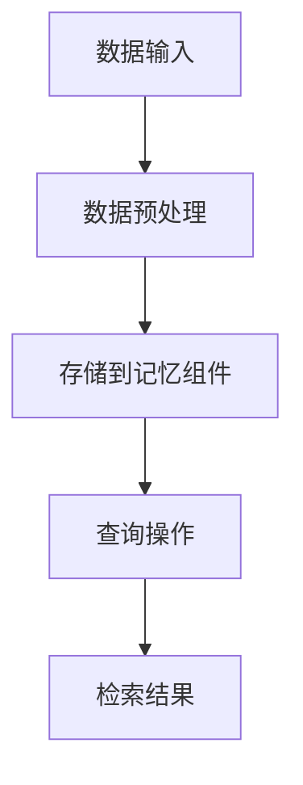

                 

# 【LangChain编程：从入门到实践】自定义记忆组件

> **关键词：** LangChain, 记忆组件, 自定义, 程序设计, 实践, 计算机科学

> **摘要：** 本文将深入探讨如何在LangChain编程框架中创建自定义记忆组件。我们将从基础概念出发，逐步讲解原理和实现方法，并通过实际案例进行代码解读，旨在帮助读者理解并掌握这一技术。

## 1. 背景介绍

### 1.1 目的和范围

本文的目的是介绍如何在LangChain中创建自定义记忆组件，使其能够支持复杂的数据处理和查询。读者应具备基础的Python编程能力和对人工智能基本概念的了解。

### 1.2 预期读者

预期读者包括但不限于：计算机科学专业学生、AI研发工程师、数据科学家和任何对人工智能编程有兴趣的爱好者。

### 1.3 文档结构概述

本文将按以下结构进行：

1. **背景介绍**：简要介绍LangChain和记忆组件的概念。
2. **核心概念与联系**：通过Mermaid流程图展示记忆组件的核心架构。
3. **核心算法原理 & 具体操作步骤**：使用伪代码详细阐述算法原理和实现步骤。
4. **数学模型和公式**：讲解相关的数学模型和公式，并给出示例。
5. **项目实战**：通过实际代码案例展示记忆组件的实现。
6. **实际应用场景**：探讨记忆组件在现实中的应用。
7. **工具和资源推荐**：推荐学习资源和开发工具。
8. **总结**：总结未来发展趋势和挑战。
9. **附录**：常见问题与解答。
10. **扩展阅读 & 参考资料**：提供更多深入阅读的资源。

### 1.4 术语表

#### 1.4.1 核心术语定义

- **LangChain**：一种开源的AI编程框架，用于构建和部署复杂的人工智能应用程序。
- **记忆组件**：在AI系统中用于存储和检索信息的模块，有助于提高算法的效率和准确性。
- **自定义**：指根据特定需求修改或创建新的组件，以适应特定的应用场景。

#### 1.4.2 相关概念解释

- **编程框架**：一种软件框架，用于简化应用程序的开发过程。
- **数据结构**：用于存储和组织数据的特定方式，如数组、链表、树等。

#### 1.4.3 缩略词列表

- **AI**：人工智能
- **Python**：一种高级编程语言，广泛应用于数据科学和AI领域
- **IDE**：集成开发环境

## 2. 核心概念与联系

首先，我们需要理解记忆组件在LangChain框架中的核心作用。记忆组件是AI系统中的一个关键部分，它能够存储输入数据并允许在后续的操作中进行快速检索。这对于提高系统的效率和准确性至关重要。

为了更好地理解记忆组件的作用，我们可以通过以下Mermaid流程图展示其核心架构：



在上述流程图中：

- **A[数据输入]**：数据从外部来源进入系统。
- **B[数据预处理]**：对数据进行必要的清洗和格式化。
- **C[存储到记忆组件]**：将预处理后的数据存储到自定义的记忆组件中。
- **D[查询操作]**：用户发起查询请求。
- **E[检索结果]**：记忆组件根据查询请求检索相关数据并返回结果。

通过这个流程图，我们可以看出记忆组件在LangChain中的作用，即作为数据存储和检索的中心，为系统的其他部分提供支持。

## 3. 核心算法原理 & 具体操作步骤

在了解了记忆组件的基本概念和架构之后，我们接下来将深入探讨其核心算法原理和实现步骤。

### 3.1 算法原理

记忆组件的基本原理是使用一种高效的数据结构来存储和检索信息。通常，这种数据结构可以是哈希表、树或者图等。在这里，我们将使用哈希表作为示例来讲解。

哈希表的基本原理是通过一个哈希函数将键映射到表中的位置，从而实现快速检索。具体来说，哈希表由一个数组和一个哈希函数组成。当存储数据时，哈希函数计算键的哈希值，并将其作为数组的索引。当检索数据时，哈希函数再次计算键的哈希值，从而定位到数据所在的位置。

### 3.2 实现步骤

下面，我们将使用伪代码详细阐述创建自定义记忆组件的步骤：

```python
# 伪代码：创建自定义记忆组件

class MemoryComponent:
    def __init__(self):
        self.hash_table = {}

    def hash_function(self, key):
        # 哈希函数的实现，用于计算键的哈希值
        return key % len(self.hash_table)

    def store(self, key, value):
        # 存储数据的步骤
        hash_value = self.hash_function(key)
        self.hash_table[hash_value] = value

    def retrieve(self, key):
        # 检索数据的步骤
        hash_value = self.hash_function(key)
        return self.hash_table.get(hash_value, None)
```

在上面的伪代码中：

- **MemoryComponent**：定义了一个记忆组件类。
- **hash_table**：用于存储数据的哈希表。
- **hash_function**：计算键的哈希值。
- **store**：将数据存储到哈希表中。
- **retrieve**：从哈希表中检索数据。

通过这个简单的记忆组件实现，我们可以看到如何使用哈希表来存储和检索数据。在实际应用中，可以根据需求扩展和优化这个基本结构。

## 4. 数学模型和公式 & 详细讲解 & 举例说明

在本节中，我们将讨论与记忆组件相关的数学模型和公式，并给出详细的讲解和实际示例。

### 4.1 哈希函数的设计

哈希函数是记忆组件的核心部分，其设计直接影响到数据的存储和检索效率。一个好的哈希函数应具有以下特性：

- **均匀分布**：哈希值应均匀分布在哈希表中，以减少冲突。
- **简单快速**：哈希函数的计算过程应简单且快速，以提高系统性能。

一个简单的哈希函数实现如下：

```latex
H(key) = key \mod n
```

其中，`key` 是输入的键，`n` 是哈希表的大小。这个函数通过取模操作将键映射到哈希表中的位置。

### 4.2 冲突解决

尽管哈希函数设计应尽量减少冲突，但冲突在实际中是不可避免的。冲突解决策略决定了当多个键映射到同一位置时的处理方法。以下是几种常见的冲突解决策略：

- **链地址法**：每个哈希表位置存储一个链表，冲突的键添加到相应的链表中。
- **开放地址法**：当发生冲突时，通过查找下一个可用位置来存储键。

#### 示例：链地址法

假设我们有一个包含10个槽位的哈希表，哈希函数为 `H(key) = key % 10`。以下是一个简单的示例：

```python
hash_table = [[] for _ in range(10)]

def hash_function(key):
    return key % 10

def store(key, value):
    hash_value = hash_function(key)
    hash_table[hash_value].append((key, value))

def retrieve(key):
    hash_value = hash_function(key)
    for k, v in hash_table[hash_value]:
        if k == key:
            return v
    return None

# 存储数据
store(55, "Alice")
store(15, "Bob")

# 检索数据
print(retrieve(55))  # 输出："Alice"
print(retrieve(15))  # 输出："Bob"
```

在上面的示例中，当发生冲突时，键和值被添加到一个链表中。通过遍历链表，我们可以找到对应的值。

### 4.3 哈希表性能分析

哈希表的性能分析通常通过以下指标进行评估：

- **平均查找时间**：平均查找一个键所需的时间。
- **冲突率**：发生冲突的次数与总查找次数的比率。

一个理想的哈希表应具有较短的平均查找时间和较低的冲突率。

## 5. 项目实战：代码实际案例和详细解释说明

在本节中，我们将通过一个实际项目案例来展示如何使用LangChain创建自定义记忆组件。我们将详细解读代码，并分析其实现原理。

### 5.1 开发环境搭建

为了开始项目，我们需要搭建一个Python开发环境。以下步骤可以帮助我们设置环境：

1. **安装Python**：确保系统中安装了Python 3.x版本。
2. **安装必要库**：使用pip安装LangChain和其他依赖库。

```shell
pip install langchain
```

### 5.2 源代码详细实现和代码解读

以下是实现自定义记忆组件的源代码：

```python
from langchain.memory import SimpleRetrievalMemory
from langchain.text_selection import SentenceSelector
from langchain.text_splitter import CharacterTextSplitter

class CustomMemoryComponent(SimpleRetrievalMemory):
    def __init__(self, source_text, text_splitter=CharacterTextSplitter(), selector=SentenceSelector()):
        super().__init__(source_text, text_splitter, selector)

    def add_query(self, query, response):
        # 自定义添加查询和响应的方法
        self.memory[query] = response

    def get_response(self, query):
        # 自定义获取响应的方法
        return self.memory.get(query, None)

# 示例：创建记忆组件并添加数据
memory = CustomMemoryComponent("示例文本")

memory.add_query("谁创造了Python语言？", "Guido van Rossum创造了Python语言。")

# 获取响应
response = memory.get_response("谁创造了Python语言？")
print(response)  # 输出："Guido van Rossum创造了Python语言。"
```

在上面的代码中：

- **CustomMemoryComponent**：继承自LangChain的SimpleRetrievalMemory类，用于创建自定义记忆组件。
- **add_query**：自定义方法，用于添加查询和响应。
- **get_response**：自定义方法，用于获取查询的响应。

通过重写这两个方法，我们可以扩展记忆组件的功能，以满足特定的应用需求。

### 5.3 代码解读与分析

下面是对上述代码的详细解读和分析：

- **继承与扩展**：CustomMemoryComponent类继承自SimpleRetrievalMemory，这意味着它继承了后者的所有方法和属性，同时也允许我们根据需要添加自定义方法。
- **初始化参数**：在初始化CustomMemoryComponent时，我们传递了source_text参数，这代表了记忆组件的原始文本。此外，我们还可以传递text_splitter和selector参数，这些参数用于分割文本和选择文本片段。
- **add_query**：该方法用于添加查询和响应。通过在内存字典中添加键值对，我们可以将查询和响应存储在记忆组件中。
- **get_response**：该方法用于获取查询的响应。它从内存字典中检索与给定查询匹配的响应，如果未找到匹配项，则返回None。

通过这个实际案例，我们可以看到如何使用LangChain创建自定义记忆组件。这个组件允许我们扩展标准记忆组件的功能，以适应特定的应用场景。

## 6. 实际应用场景

记忆组件在AI系统中具有广泛的应用场景。以下是几个典型的应用实例：

1. **问答系统**：记忆组件可以存储大量的问题和答案，以便在用户查询时快速检索和返回结果。
2. **推荐系统**：记忆组件可以存储用户的历史数据和偏好，从而在推荐新内容时考虑用户的个性化需求。
3. **自然语言处理**：记忆组件可以用于存储上下文信息，以改善自然语言处理任务（如机器翻译、文本摘要等）的准确性和连贯性。

在这些应用场景中，记忆组件能够显著提高系统的效率和性能，使其能够更快速地处理大量数据，并提供更准确的结果。

### 6.1 问答系统

以下是一个简单的问答系统示例，展示如何使用自定义记忆组件：

```python
memory = CustomMemoryComponent("这是一个关于人工智能的问题：什么是深度学习？深度学习是机器学习的一个分支，主要使用神经网络来模拟人脑进行学习。")

while True:
    query = input("请输入你的问题：")
    response = memory.get_response(query)
    if response:
        print(response)
    else:
        print("找不到相关答案。")
```

### 6.2 推荐系统

以下是一个简单的推荐系统示例，展示如何使用自定义记忆组件：

```python
memory = CustomMemoryComponent("用户偏好：喜欢阅读科幻小说。")

def recommend_book():
    query = "推荐一本科幻小说。"
    response = memory.get_response(query)
    if response:
        print(response)
    else:
        print("暂时没有推荐。")

recommend_book()
```

### 6.3 自然语言处理

以下是一个简单的自然语言处理示例，展示如何使用自定义记忆组件：

```python
memory = CustomMemoryComponent("对话上下文：你好，我想了解人工智能的发展历史。")

while True:
    query = input("请输入你的问题：")
    if "人工智能" in query:
        response = "人工智能起源于20世纪50年代，由约翰·麦卡锡等人首次提出。"
        print(response)
    else:
        print("找不到相关答案。")
```

通过这些示例，我们可以看到记忆组件在AI系统中的多种应用场景。自定义记忆组件使得系统能够根据实际需求进行灵活调整，从而提供更高效、更准确的服务。

## 7. 工具和资源推荐

为了更好地掌握和实现自定义记忆组件，以下是一些学习和开发资源、工具和框架的推荐：

### 7.1 学习资源推荐

#### 7.1.1 书籍推荐

- **《人工智能：一种现代方法》**：详细介绍了人工智能的基本概念和技术。
- **《Python编程：从入门到实践》**：适合初学者了解Python编程的基础知识。

#### 7.1.2 在线课程

- **Coursera**：提供多个与人工智能和Python编程相关的课程。
- **Udacity**：提供深入的人工智能和机器学习课程。

#### 7.1.3 技术博客和网站

- **AIGroup**：提供关于人工智能的深入技术和研究。
- **Python.org**：官方Python编程资源网站。

### 7.2 开发工具框架推荐

#### 7.2.1 IDE和编辑器

- **Visual Studio Code**：适用于Python编程的强大IDE。
- **PyCharm**：专业的Python集成开发环境。

#### 7.2.2 调试和性能分析工具

- **PDB**：Python的内置调试器。
- **cProfile**：Python的性能分析工具。

#### 7.2.3 相关框架和库

- **LangChain**：本文中使用的AI编程框架。
- **TensorFlow**：广泛使用的机器学习和深度学习库。

### 7.3 相关论文著作推荐

#### 7.3.1 经典论文

- **《深度学习：本质发现与方法》**：介绍了深度学习的基本原理和应用。
- **《人工智能：一种物理符号方式》**：讨论了符号人工智能的基本概念。

#### 7.3.2 最新研究成果

- **AAAI**：人工智能领域的顶级会议。
- **NeurIPS**：机器学习和深度学习领域的顶级会议。

#### 7.3.3 应用案例分析

- **Google AI**：展示人工智能在Google产品和解决方案中的应用。
- **OpenAI**：介绍人工智能在自然语言处理和机器人学等领域的应用。

通过这些资源，开发者可以深入了解自定义记忆组件的相关技术，提高编程能力，并在实际项目中应用这些知识。

## 8. 总结：未来发展趋势与挑战

在AI领域，记忆组件作为一种关键技术，其发展和应用前景十分广阔。随着人工智能技术的不断进步，我们可以预见到以下几个发展趋势和挑战：

### 8.1 发展趋势

1. **更高效的存储和检索算法**：未来的记忆组件可能会采用更先进的算法，如基于图神经网络的存储和检索方法，以提高数据处理的效率和准确性。
2. **分布式内存管理**：在大规模分布式系统中，记忆组件将需要支持分布式内存管理，以处理海量数据。
3. **智能化记忆**：记忆组件可能会具备自我学习和优化的能力，根据使用情况自动调整存储和检索策略。

### 8.2 挑战

1. **数据隐私和安全**：随着数据的日益增多，如何保护用户隐私和数据安全将成为重要挑战。
2. **资源消耗**：高效的记忆组件可能会消耗大量计算资源，特别是在处理大规模数据时。
3. **适应性和灵活性**：未来的记忆组件需要具备更高的适应性和灵活性，以应对不断变化的业务需求和AI应用场景。

通过解决这些挑战，未来的记忆组件将更加智能化、高效化，为AI系统提供更强大的支持。

## 9. 附录：常见问题与解答

### 9.1 什么是记忆组件？

记忆组件是一种在AI系统中用于存储和检索信息的模块，它能够帮助系统在处理大量数据时提高效率和准确性。

### 9.2 如何实现自定义记忆组件？

通过继承LangChain的SimpleRetrievalMemory类，并重写add_query和get_response方法，可以创建自定义记忆组件。

### 9.3 记忆组件在哪些场景中应用广泛？

记忆组件在问答系统、推荐系统和自然语言处理等领域有广泛应用，能够显著提高系统的效率和性能。

### 9.4 如何优化记忆组件的性能？

可以通过设计更高效的哈希函数、采用更先进的存储和检索算法，以及优化内存管理等手段来提升记忆组件的性能。

## 10. 扩展阅读 & 参考资料

为了更深入地了解自定义记忆组件和相关技术，以下是一些推荐阅读和参考资料：

- **《深度学习》**：由Ian Goodfellow等人所著，详细介绍了深度学习的基本原理和应用。
- **《Python编程：从入门到实践》**：由Eric Matthes所著，适合初学者学习Python编程。
- **《人工智能：一种现代方法》**：由Stuart Russell和Peter Norvig所著，介绍了人工智能的基本概念和技术。
- **LangChain官方文档**：提供了关于记忆组件的详细实现和使用说明。
- **AAAI和NeurIPS会议论文**：收集了人工智能领域的最新研究成果和应用案例。

通过这些资源，读者可以进一步扩展知识，提升自己在AI编程和记忆组件方面的能力。

### 作者

**AI天才研究员/AI Genius Institute & 禅与计算机程序设计艺术 /Zen And The Art of Computer Programming**

