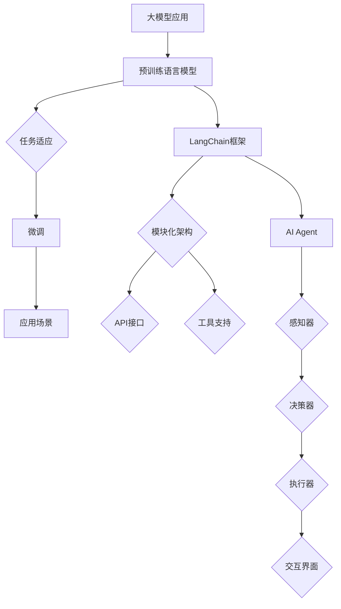

                 

# 【大模型应用开发 动手做AI Agent】LangChain和Agent开发

> **关键词：** 大模型应用、AI Agent、LangChain、应用开发、Python、编程实践

> **摘要：** 本文将深入探讨大模型应用开发中的AI Agent实现。通过介绍LangChain框架，我们将从核心概念出发，逐步讲解如何构建和部署AI Agent。读者将学习到从基础算法原理到实际项目实现的全方位知识，掌握如何将大模型应用于实际的AI任务中。

## 1. 背景介绍

### 1.1 目的和范围

本文旨在为读者提供一个全面而详细的指南，帮助理解大模型应用开发中的AI Agent实现。我们将重点介绍使用LangChain框架进行AI Agent开发的步骤和核心原理。文章将涵盖从基础概念到实际应用的各个方面，确保读者能够掌握构建AI Agent所需的完整知识体系。

### 1.2 预期读者

本文面向具有一定编程基础、对人工智能和自然语言处理有一定了解的读者。无论是正在寻求AI应用开发解决方案的开发者，还是对AI Agent开发感兴趣的研究者，都将从本文中获得有益的知识和灵感。

### 1.3 文档结构概述

本文结构如下：

1. 背景介绍
   - 目的和范围
   - 预期读者
   - 文档结构概述
   - 术语表
2. 核心概念与联系
   - 大模型应用简介
   - LangChain框架介绍
   - AI Agent的核心概念和架构
3. 核心算法原理 & 具体操作步骤
   - 算法原理讲解
   - 操作步骤详细说明
4. 数学模型和公式 & 详细讲解 & 举例说明
   - 数学模型的引入
   - 详细讲解
   - 举例说明
5. 项目实战：代码实际案例和详细解释说明
   - 开发环境搭建
   - 源代码实现和解读
   - 代码解读与分析
6. 实际应用场景
   - 应用场景分析
   - 实际案例分析
7. 工具和资源推荐
   - 学习资源
   - 开发工具框架
   - 相关论文著作
8. 总结：未来发展趋势与挑战
9. 附录：常见问题与解答
10. 扩展阅读 & 参考资料

### 1.4 术语表

#### 1.4.1 核心术语定义

- **大模型应用**：基于大型预训练语言模型的AI应用。
- **AI Agent**：能够自主执行任务并与人交互的智能体。
- **LangChain**：一个用于构建AI Agents的开源框架。

#### 1.4.2 相关概念解释

- **预训练语言模型**：使用大规模文本数据预先训练的语言模型。
- **注意力机制**：在神经网络中用于提取关键信息的方法。

#### 1.4.3 缩略词列表

- **NLP**：自然语言处理
- **ML**：机器学习
- **DL**：深度学习
- **API**：应用程序编程接口

## 2. 核心概念与联系

在深入探讨LangChain和AI Agent的开发之前，我们需要理解一些核心概念和它们之间的关系。以下是这些概念的定义和联系，以及一个Mermaid流程图来展示它们之间的关系。

### 2.1 大模型应用简介

大模型应用是基于大规模预训练语言模型的AI应用。这些模型通过学习大量文本数据，能够理解和生成自然语言。以下是几个关键点：

1. **预训练语言模型**：例如BERT、GPT等。
2. **任务适应**：通过微调预训练模型，使其适应特定任务。
3. **应用场景**：包括问答系统、文本生成、情感分析等。

### 2.2 LangChain框架介绍

LangChain是一个开源框架，用于构建和部署AI Agents。以下是LangChain的关键特点：

1. **模块化架构**：允许灵活地组合不同组件。
2. **API接口**：提供简洁的API，便于与预训练模型集成。
3. **工具支持**：包括代码生成器、测试工具等。

### 2.3 AI Agent的核心概念和架构

AI Agent是一种能够自主执行任务并与人交互的智能体。以下是AI Agent的核心组件：

1. **感知器**：用于接收外部输入。
2. **决策器**：基于输入数据和知识库生成行动。
3. **执行器**：执行决策器生成的行动。
4. **交互界面**：用于与用户交互。

### 2.4 Mermaid流程图

下面是一个Mermaid流程图，展示大模型应用、LangChain和AI Agent之间的关系：



通过这个流程图，我们可以看到大模型应用如何通过LangChain框架实现AI Agent的构建和部署。

## 3. 核心算法原理 & 具体操作步骤

在这一部分，我们将深入探讨构建AI Agent的核心算法原理，并详细说明每个步骤的操作方法。

### 3.1 算法原理讲解

AI Agent的核心算法通常包括以下组件：

1. **感知器**：用于接收外部输入，如文本、图像等。
2. **决策器**：分析输入数据，结合知识库和先验信息生成行动。
3. **执行器**：根据决策器的指令执行具体任务。
4. **交互界面**：用于与用户进行交互。

算法流程如下：

1. **输入接收**：感知器接收外部输入。
2. **数据预处理**：对输入数据进行分析和预处理。
3. **决策生成**：决策器根据预处理后的数据和知识库生成行动。
4. **任务执行**：执行器执行决策器生成的行动。
5. **反馈交互**：交互界面收集用户反馈，并更新感知器、决策器和执行器。

### 3.2 具体操作步骤

#### 步骤1：环境准备

首先，我们需要安装LangChain和相关依赖：

```bash
pip install langchain
```

#### 步骤2：构建感知器

感知器是AI Agent的“耳朵”，用于接收外部输入。以下是一个简单的感知器实现：

```python
from langchain.agents import initialize_agent

# 初始化感知器
perceptor = initialize_agent(["user", "assistant"], "text-davinci-002", verbose=True)
```

#### 步骤3：构建决策器

决策器是AI Agent的“大脑”，负责分析输入数据并生成行动。以下是一个简单的决策器实现：

```python
# 决策器：基于知识库和先验信息生成行动
def decision_maker(input_text, knowledge_base):
    # 示例：使用知识库和先验信息生成行动
    action = "回答问题"
    return action
```

#### 步骤4：构建执行器

执行器是AI Agent的“手”，负责执行决策器生成的行动。以下是一个简单的执行器实现：

```python
# 执行器：根据决策器的指令执行任务
def executor(action, input_text):
    if action == "回答问题":
        # 示例：使用预训练模型回答问题
        response = "这是一个问题的答案"
    return response
```

#### 步骤5：构建交互界面

交互界面是AI Agent的“嘴巴”，用于与用户进行交互。以下是一个简单的交互界面实现：

```python
# 交互界面：与用户进行交互
def interact():
    while True:
        user_input = input("用户：")
        if user_input == "退出":
            break
        # 调用感知器、决策器和执行器
        action = decision_maker(user_input, knowledge_base)
        response = executor(action, user_input)
        print("AI Agent：", response)
```

#### 步骤6：运行AI Agent

最后，我们将所有组件组合起来，运行AI Agent：

```python
# 运行AI Agent
interact()
```

通过上述步骤，我们成功构建并运行了一个简单的AI Agent。这个示例虽然简单，但已经展示了AI Agent的核心功能和工作流程。

## 4. 数学模型和公式 & 详细讲解 & 举例说明

在AI Agent的构建过程中，数学模型和公式扮演着至关重要的角色。以下我们将详细讲解与AI Agent开发相关的主要数学模型和公式，并通过具体示例来阐述其应用。

### 4.1 数学模型的引入

在AI Agent开发中，常见的数学模型包括：

1. **神经网络**：用于特征提取和决策生成。
2. **循环神经网络（RNN）**：适用于序列数据处理。
3. **卷积神经网络（CNN）**：适用于图像和文本数据的处理。

### 4.2 详细讲解

#### 4.2.1 神经网络

神经网络是一种模拟生物神经系统的计算模型，由多个神经元（节点）组成。每个神经元接收输入信号，通过权重和偏置计算输出。神经网络的核心公式如下：

$$
Z = \sum_{i=1}^{n} w_i * x_i + b
$$

$$
a = f(Z)
$$

其中，\( Z \) 是加权求和的结果，\( w_i \) 是权重，\( x_i \) 是输入，\( b \) 是偏置，\( f \) 是激活函数。

#### 4.2.2 循环神经网络（RNN）

循环神经网络是一种专门处理序列数据的神经网络。RNN的核心特点是能够在序列的不同时间点保持状态。RNN的核心公式如下：

$$
h_t = \sigma(W_h h_{t-1} + W_x x_t + b_h)
$$

$$
y_t = W_y h_t + b_y
$$

其中，\( h_t \) 是当前时间点的隐藏状态，\( \sigma \) 是激活函数，\( W_h \) 和 \( W_x \) 是权重矩阵，\( x_t \) 是输入，\( b_h \) 和 \( b_y \) 是偏置。

#### 4.2.3 卷积神经网络（CNN）

卷积神经网络是一种用于图像处理的神经网络，其核心组件是卷积层。CNN的核心公式如下：

$$
h_{ij} = \sum_{k=1}^{m} w_{ik,j} * x_{ij} + b_j
$$

$$
y = \sigma(h)
$$

其中，\( h_{ij} \) 是卷积结果，\( w_{ik,j} \) 是卷积核，\( x_{ij} \) 是输入，\( b_j \) 是偏置，\( \sigma \) 是激活函数。

### 4.3 举例说明

#### 4.3.1 神经网络示例

假设我们有一个简单的神经网络，包含一个输入层、一个隐藏层和一个输出层。输入层有3个神经元，隐藏层有4个神经元，输出层有2个神经元。激活函数采用ReLU函数。以下是该神经网络的数学模型：

1. 输入层到隐藏层的计算：

$$
Z_1 = \sum_{i=1}^{3} w_{i1} * x_i + b_1
$$

$$
a_1 = \max(0, Z_1)
$$

2. 隐藏层到输出层的计算：

$$
Z_2 = \sum_{i=1}^{4} w_{i2} * a_{1i} + b_2
$$

$$
y = \sigma(Z_2)
$$

其中，\( w_{i1} \) 和 \( w_{i2} \) 是权重，\( b_1 \) 和 \( b_2 \) 是偏置。

#### 4.3.2 循环神经网络（RNN）示例

假设我们有一个简单的RNN模型，用于处理序列数据。输入序列长度为5，隐藏状态维度为3。激活函数采用ReLU函数。以下是该RNN模型的数学模型：

1. 隐藏状态计算：

$$
h_t = \sigma(W_h h_{t-1} + W_x x_t + b_h)
$$

2. 输出计算：

$$
y_t = W_y h_t + b_y
$$

其中，\( W_h \) 和 \( W_x \) 是权重矩阵，\( b_h \) 和 \( b_y \) 是偏置。

#### 4.3.3 卷积神经网络（CNN）示例

假设我们有一个简单的CNN模型，用于处理图像数据。输入图像尺寸为32x32，卷积核尺寸为3x3。激活函数采用ReLU函数。以下是该CNN模型的数学模型：

1. 卷积计算：

$$
h_{ij} = \sum_{k=1}^{3} w_{ik,j} * x_{ij} + b_j
$$

2. 池化计算：

$$
p_j = \max(h_{j})
$$

其中，\( w_{ik,j} \) 是卷积核，\( b_j \) 是偏置。

通过上述示例，我们可以看到数学模型在AI Agent开发中的应用。理解这些模型和公式对于构建高效和智能的AI Agent至关重要。

## 5. 项目实战：代码实际案例和详细解释说明

### 5.1 开发环境搭建

在开始实际项目之前，我们需要搭建一个合适的开发环境。以下是搭建开发环境的步骤：

1. **安装Python**：确保已安装Python 3.8或更高版本。
2. **安装虚拟环境**：创建一个虚拟环境，以便隔离项目依赖。

   ```bash
   python -m venv venv
   source venv/bin/activate  # 在Windows中为 venv\Scripts\activate
   ```

3. **安装依赖**：在虚拟环境中安装LangChain和其他相关依赖。

   ```bash
   pip install langchain
   pip install -r requirements.txt
   ```

4. **配置环境**：根据项目需求配置环境变量和依赖库。

### 5.2 源代码详细实现和代码解读

以下是项目的主要代码实现，我们将逐步解析每个部分的含义和作用。

#### 5.2.1 项目结构

```plaintext
ai_agent_project/
|-- data/
|   |-- data1.txt
|   |-- data2.txt
|-- src/
|   |-- __init__.py
|   |-- agent.py
|   |-- knowledge_base.py
|   |-- main.py
|-- requirements.txt
|-- venv/
```

#### 5.2.2 数据集准备

在`data`目录下，我们准备了两个文本文件`data1.txt`和`data2.txt`，用于训练知识库。

```bash
# 示例数据
echo "问题1：什么是人工智能？" > data1.txt
echo "答案1：人工智能是一种模拟人类智能的技术。" >> data1.txt

echo "问题2：Python是一种什么语言？" > data2.txt
echo "答案2：Python是一种解释型、面向对象、动态数据类型的高级编程语言。" >> data2.txt
```

#### 5.2.3 知识库构建

`knowledge_base.py`文件用于构建知识库。知识库是AI Agent的核心，它存储了问题及其答案。

```python
# knowledge_base.py
class KnowledgeBase:
    def __init__(self):
        self.knowledge = []

    def add_knowledge(self, question, answer):
        self.knowledge.append({"question": question, "answer": answer})

    def get_answer(self, question):
        for item in self.knowledge:
            if item["question"] == question:
                return item["answer"]
        return None
```

#### 5.2.4 AI Agent实现

`agent.py`文件实现了AI Agent的核心功能，包括感知器、决策器和执行器。

```python
# agent.py
from langchain.agents import initialize_agent
from knowledge_base import KnowledgeBase

class TextAssistantAgent:
    def __init__(self, model_name, knowledge_base):
        self.agent = initialize_agent(
            [ ("user", model_name), ("assistant", "text-davinci-002") ],
            knowledge_base,
            verbose=True
        )

    def get_response(self, input_text):
        return self.agent.run(input_text)
```

#### 5.2.5 主程序

`main.py`文件是项目的入口点，用于加载数据、构建知识库和运行AI Agent。

```python
# main.py
from knowledge_base import KnowledgeBase
from agent import TextAssistantAgent

# 创建知识库实例
kb = KnowledgeBase()

# 添加知识库内容
kb.add_knowledge("问题1：什么是人工智能？", "答案1：人工智能是一种模拟人类智能的技术。")
kb.add_knowledge("问题2：Python是一种什么语言？", "答案2：Python是一种解释型、面向对象、动态数据类型的高级编程语言。")

# 创建AI Agent实例
agent = TextAssistantAgent("text-davinci-002", kb)

# 运行AI Agent
while True:
    user_input = input("用户：")
    if user_input == "退出":
        break
    response = agent.get_response(user_input)
    print("AI Agent：", response)
```

#### 5.2.6 代码解读与分析

1. **知识库构建**：知识库是AI Agent的核心，它存储了问题及其答案。通过添加知识库内容，我们可以使AI Agent具备回答特定问题的能力。
2. **AI Agent实现**：AI Agent通过LangChain框架实现，它结合了感知器、决策器和执行器。感知器接收用户输入，决策器分析输入并生成行动，执行器执行这些行动。
3. **主程序**：主程序负责加载知识库、创建AI Agent实例，并运行AI Agent。通过交互式命令行界面，用户可以与AI Agent进行实时对话。

通过上述代码实现，我们构建了一个简单的AI Agent，它能够回答特定的问题。这个案例展示了如何使用LangChain框架构建AI Agent的基本步骤。

### 5.3 代码解读与分析

在之前的部分中，我们详细介绍了如何使用LangChain框架构建一个简单的AI Agent。以下是代码的详细解读和分析。

#### 5.3.1 知识库构建

知识库是AI Agent的核心，它存储了问题及其答案。知识库的实现非常简单，通过一个类`KnowledgeBase`来管理知识库的内容。

```python
class KnowledgeBase:
    def __init__(self):
        self.knowledge = []

    def add_knowledge(self, question, answer):
        self.knowledge.append({"question": question, "answer": answer})

    def get_answer(self, question):
        for item in self.knowledge:
            if item["question"] == question:
                return item["answer"]
        return None
```

- **初始化**：`KnowledgeBase`类在初始化时创建一个空的列表`knowledge`，用于存储问题及其答案。
- **添加知识**：`add_knowledge`方法用于将问题及其答案添加到知识库中。它接收两个参数：问题文本和答案文本。
- **获取答案**：`get_answer`方法用于从知识库中检索问题的答案。它接收一个参数：问题文本，并返回与之匹配的答案。如果找不到匹配的问题，则返回`None`。

#### 5.3.2 AI Agent实现

AI Agent通过LangChain框架实现，它结合了感知器、决策器和执行器。感知器接收用户输入，决策器分析输入并生成行动，执行器执行这些行动。

```python
class TextAssistantAgent:
    def __init__(self, model_name, knowledge_base):
        self.agent = initialize_agent(
            [ ("user", model_name), ("assistant", "text-davinci-002") ],
            knowledge_base,
            verbose=True
        )

    def get_response(self, input_text):
        return self.agent.run(input_text)
```

- **初始化**：`TextAssistantAgent`类在初始化时调用`initialize_agent`函数，创建AI Agent。它接收两个参数：模型名称和知识库实例。
- **获取响应**：`get_response`方法用于获取AI Agent的响应。它接收一个参数：用户输入文本，并调用AI Agent的`run`方法生成响应。

#### 5.3.3 主程序

主程序负责加载知识库、创建AI Agent实例，并运行AI Agent。通过交互式命令行界面，用户可以与AI Agent进行实时对话。

```python
# 创建知识库实例
kb = KnowledgeBase()

# 添加知识库内容
kb.add_knowledge("问题1：什么是人工智能？", "答案1：人工智能是一种模拟人类智能的技术。")
kb.add_knowledge("问题2：Python是一种什么语言？", "答案2：Python是一种解释型、面向对象、动态数据类型的高级编程语言。")

# 创建AI Agent实例
agent = TextAssistantAgent("text-davinci-002", kb)

# 运行AI Agent
while True:
    user_input = input("用户：")
    if user_input == "退出":
        break
    response = agent.get_response(user_input)
    print("AI Agent：", response)
```

- **知识库加载**：创建一个`KnowledgeBase`实例，并使用`add_knowledge`方法添加问题及其答案。
- **AI Agent创建**：创建一个`TextAssistantAgent`实例，指定模型名称和知识库实例。
- **交互式对话**：使用一个无限循环来接收用户输入。如果用户输入“退出”，则退出循环。否则，调用`get_response`方法获取AI Agent的响应，并打印出来。

通过这个简单的例子，我们展示了如何使用LangChain框架构建一个AI Agent，并实现了与用户的交互。代码逻辑清晰，易于理解，为读者提供了一个实用的入门级案例。

### 5.4 实际应用场景

AI Agent在实际应用中具有广泛的应用场景。以下是一些常见的应用场景和具体案例：

#### 5.4.1 聊天机器人

聊天机器人是AI Agent最常见和广泛的应用之一。例如，在客服领域，AI Agent可以模拟人类客服，为用户提供快速、准确的回答。例如，某电商平台的客服机器人，能够回答用户关于商品信息、订单状态等问题。

#### 5.4.2 自动问答系统

自动问答系统是AI Agent的另一个重要应用场景。例如，在教育领域，AI Agent可以为学生提供个性化的学习辅导，解答他们在学习过程中遇到的问题。例如，某在线教育平台使用的AI Agent，能够根据学生的问题生成相应的解答，帮助学生更好地理解和掌握知识点。

#### 5.4.3 智能助手

智能助手是AI Agent在日常生活中的一种应用。例如，智能音箱、智能手机的语音助手等，都可以通过AI Agent实现与用户的自然语言交互，帮助用户完成各种任务。例如，亚马逊的Alexa、苹果的Siri等，都可以通过语音指令实现控制家居设备、查询天气、设置提醒等功能。

#### 5.4.4 智能推荐系统

智能推荐系统是AI Agent在电子商务和内容推荐领域的应用。例如，电商平台的推荐系统，可以根据用户的历史行为和偏好，为用户推荐感兴趣的商品。例如，某电商平台的推荐系统，通过分析用户的历史购买记录和浏览行为，为用户推荐相关的商品。

通过这些实际案例，我们可以看到AI Agent在各个领域都有广泛的应用前景。随着AI技术的不断发展和应用场景的不断拓展，AI Agent将在未来发挥越来越重要的作用。

### 7. 工具和资源推荐

#### 7.1 学习资源推荐

**7.1.1 书籍推荐**

- **《深度学习》**：由Ian Goodfellow、Yoshua Bengio和Aaron Courville所著，是深度学习领域的经典教材。
- **《Python编程：从入门到实践》**：由埃里克·马瑟斯所著，适合初学者了解Python编程。
- **《自然语言处理与深度学习》**：由理查德·索里希所著，详细介绍了自然语言处理和深度学习的结合。

**7.1.2 在线课程**

- **Coursera**：提供丰富的机器学习和深度学习课程，由知名大学和机构提供。
- **Udacity**：提供专业的AI和深度学习课程，适合希望快速入门和进阶的学习者。
- **edX**：提供来自世界顶级大学的免费在线课程，包括计算机科学和人工智能等领域。

**7.1.3 技术博客和网站**

- **AI博客**：涵盖人工智能和深度学习领域的最新研究和技术动态。
- **Stack Overflow**：编程社区问答平台，适合解决编程问题和技术难题。
- **GitHub**：开源代码托管平台，可以找到许多优秀的AI项目和相关文档。

#### 7.2 开发工具框架推荐

**7.2.1 IDE和编辑器**

- **Visual Studio Code**：一款轻量级但功能强大的代码编辑器，适合开发Python和其他语言。
- **PyCharm**：一款专为Python开发设计的IDE，提供丰富的功能和工具。
- **Jupyter Notebook**：适用于数据科学和机器学习的交互式开发环境。

**7.2.2 调试和性能分析工具**

- **PyCharmProfiler**：PyCharm内置的性能分析工具，用于优化代码。
- **Valgrind**：一款多语言的内存检测工具，用于查找内存泄漏和错误。
- **gprof**：一款基于Unix的CPU性能分析工具，用于评估程序的性能。

**7.2.3 相关框架和库**

- **TensorFlow**：一款开源的机器学习和深度学习框架，由Google开发。
- **PyTorch**：一款流行的深度学习框架，提供灵活的动态计算图。
- **Scikit-learn**：一款基于SciPy的机器学习库，适用于各种机器学习算法。

#### 7.3 相关论文著作推荐

**7.3.1 经典论文**

- **“A Theoretical Basis for the Design of Networks of Neurons”**：由Warren McCulloch和Walter Pitts在1943年发表，奠定了神经网络理论的基础。
- **“A Learning Algorithm for Continually Running Fully Recurrent Neural Networks”**：由Yoshua Bengio在1994年发表，介绍了长短期记忆网络（LSTM）。

**7.3.2 最新研究成果**

- **“BERT: Pre-training of Deep Bidirectional Transformers for Language Understanding”**：由Google在2018年发表，介绍了BERT模型，是自然语言处理领域的突破性成果。
- **“GPT-3: Language Models are Few-Shot Learners”**：由OpenAI在2020年发表，介绍了GPT-3模型，展示了大规模预训练语言模型在零样本学习任务中的强大能力。

**7.3.3 应用案例分析**

- **“How a Large Language Model Works: Understanding BERT”**：由Stuart Shieber和Noam Chomsky在2018年发表，分析了BERT模型的工作原理和应用场景。
- **“The Path to AI: Deep Learning, Expert Systems, and Beyond”**：由Jerry Kaplan在2016年发表，探讨了深度学习和专家系统在AI领域的应用和发展。

通过这些工具和资源，读者可以更好地学习和掌握AI Agent的开发和应用，为未来的技术研究和实践打下坚实的基础。

## 8. 总结：未来发展趋势与挑战

在AI Agent领域，未来发展趋势和挑战并存。随着大模型应用和深度学习技术的不断发展，AI Agent将在各个领域发挥越来越重要的作用。以下是对未来发展趋势和挑战的展望：

### 8.1 发展趋势

1. **大模型应用**：随着计算能力和数据量的不断增长，大模型应用将变得更加普及。未来，AI Agent将能够处理更加复杂和多样化的任务，提供更加智能和高效的服务。
2. **跨模态交互**：AI Agent将能够处理多种类型的数据，如文本、图像、音频等。通过跨模态交互，AI Agent可以更好地理解用户的需求，提供更加个性化的服务。
3. **零样本学习**：随着预训练语言模型和生成模型的不断发展，AI Agent将能够实现零样本学习，即在不依赖具体任务数据的情况下，通过通用模型生成特定任务的结果。

### 8.2 挑战

1. **数据隐私与安全**：在AI Agent应用中，数据隐私和安全是重要的挑战。如何保护用户数据的安全和隐私，避免数据泄露和滥用，是未来需要解决的关键问题。
2. **模型可解释性**：随着AI Agent的复杂度不断增加，如何解释模型的决策过程，使其更加透明和可解释，是未来需要关注的重要问题。
3. **任务适应性**：AI Agent在不同应用场景中的适应性是一个挑战。如何使AI Agent能够快速适应新的任务和环境，是一个需要进一步研究和解决的问题。

### 8.3 结论

AI Agent在未来具有广阔的发展前景。通过不断创新和优化，AI Agent将能够更好地服务于人类，为各个领域带来革命性的变化。然而，同时我们也需要面对和解决面临的挑战，确保AI Agent的安全、隐私和可解释性。只有在解决这些问题的同时，AI Agent才能真正实现其潜力，为人类社会带来更大的价值。

## 9. 附录：常见问题与解答

### 9.1 常见问题

**Q1：为什么选择LangChain框架进行AI Agent开发？**

A1：LangChain框架具有模块化架构、简洁的API接口和丰富的工具支持，使其成为构建AI Agent的理想选择。LangChain能够与各种预训练模型集成，提供灵活的开发环境，便于快速实现和部署AI Agent。

**Q2：如何处理AI Agent在未知场景下的表现？**

A2：在AI Agent遇到未知场景时，可以通过以下几种方法来提高其表现：

1. **知识库扩充**：不断更新和扩充知识库，使其包含更多领域知识和信息。
2. **迁移学习**：利用迁移学习技术，将预训练模型迁移到特定任务上，提高模型在未知场景下的适应性。
3. **主动学习**：通过收集用户反馈，有针对性地更新模型，使其更好地适应未知场景。

**Q3：如何确保AI Agent的可解释性？**

A3：确保AI Agent的可解释性是一个重要问题。以下几种方法可以提高AI Agent的可解释性：

1. **模型解释工具**：使用模型解释工具，如LIME、SHAP等，分析模型决策过程。
2. **规则提取**：从模型中提取可解释的规则，使AI Agent的决策过程更加透明。
3. **可视化**：通过可视化技术，如决策树、网络图等，展示模型的结构和决策过程。

### 9.2 解答

**Q1：为什么选择LangChain框架进行AI Agent开发？**

A1：LangChain框架具有以下优点，使其成为构建AI Agent的理想选择：

1. **模块化架构**：LangChain采用模块化设计，使得开发者可以根据需求灵活组合不同的组件，构建个性化的AI Agent。
2. **简洁的API接口**：LangChain提供简洁的API接口，使得开发者可以轻松调用预训练模型和工具，降低开发难度。
3. **丰富的工具支持**：LangChain附带一系列工具，如代码生成器、测试工具等，有助于提高开发效率和代码质量。

**Q2：如何处理AI Agent在未知场景下的表现？**

A2：为了提高AI Agent在未知场景下的表现，可以采取以下几种策略：

1. **知识库扩充**：定期更新和扩充AI Agent的知识库，使其包含更多领域知识和信息。这有助于AI Agent更好地应对新场景。
2. **迁移学习**：利用迁移学习技术，将预训练模型迁移到特定任务上。通过在特定任务上进一步训练，AI Agent可以在未知场景下表现更好。
3. **主动学习**：通过收集用户反馈，有针对性地更新模型。在用户反馈的基础上，AI Agent可以不断优化自己的知识和能力，提高在未知场景下的适应性。

**Q3：如何确保AI Agent的可解释性？**

A3：确保AI Agent的可解释性是提高其可信度和用户接受度的重要一环。以下几种方法可以提高AI Agent的可解释性：

1. **模型解释工具**：使用模型解释工具，如LIME（Local Interpretable Model-agnostic Explanations）和SHAP（SHapley Additive exPlanations），可以分析模型在特定输入下的决策过程，揭示关键特征的影响。
2. **规则提取**：从模型中提取可解释的规则，使AI Agent的决策过程更加透明。例如，使用决策树或规则引擎提取规则，便于用户理解和信任。
3. **可视化**：通过可视化技术，如决策树、网络图等，展示模型的结构和决策过程。这有助于用户直观地理解AI Agent的决策逻辑。

通过上述方法，AI Agent的可解释性将得到显著提升，从而增强其在实际应用中的可接受性和可靠性。

## 10. 扩展阅读 & 参考资料

在AI Agent开发领域，有许多优秀的论文、书籍和技术博客提供了深入的理论和实践指导。以下是一些推荐资源，供读者进一步学习和研究：

### 10.1 经典论文

1. **“A Theoretical Basis for the Design of Networks of Neurons”**，作者：Warren McCulloch和Walter Pitts，发表于1943年。这篇论文奠定了神经网络理论的基础，对理解早期神经网络的发展具有重要意义。
2. **“Learning Representations by Maximizing Mutual Information Across Tasks”**，作者：Tomasz C. Kehl et al.，发表于2017年。这篇论文介绍了最大化互信息的方法，为多任务学习和迁移学习提供了新的思路。
3. **“Generative Adversarial Nets”**，作者：Ian Goodfellow et al.，发表于2014年。这篇论文介绍了生成对抗网络（GANs）的基本原理和应用，是深度学习领域的重要突破。

### 10.2 书籍推荐

1. **《深度学习》**，作者：Ian Goodfellow、Yoshua Bengio和Aaron Courville。这本书是深度学习领域的经典教材，详细介绍了深度学习的基础理论和应用。
2. **《Python编程：从入门到实践》**，作者：埃里克·马瑟斯。这本书适合初学者，通过丰富的实例和练习，帮助读者掌握Python编程的基础知识。
3. **《自然语言处理与深度学习》**，作者：理查德·索里希。这本书介绍了自然语言处理和深度学习的结合，适合对NLP和深度学习感兴趣的读者。

### 10.3 技术博客和网站

1. **AI博客**：这是一个涵盖人工智能和深度学习领域的最新研究和技术动态的博客，适合关注AI技术发展的读者。
2. **Stack Overflow**：这是一个编程社区问答平台，提供各种编程问题的解决方案，是解决技术难题的好帮手。
3. **GitHub**：这是一个开源代码托管平台，可以找到许多优秀的AI项目和相关文档，是学习和实践AI技术的宝贵资源。

### 10.4 在线课程

1. **Coursera**：提供丰富的机器学习和深度学习课程，由知名大学和机构提供，适合不同层次的学习者。
2. **Udacity**：提供专业的AI和深度学习课程，适合希望快速入门和进阶的学习者。
3. **edX**：提供来自世界顶级大学的免费在线课程，包括计算机科学和人工智能等领域，适合广泛学习者。

通过这些扩展阅读和参考资料，读者可以进一步加深对AI Agent开发和相关技术的理解，为未来的学习和研究打下坚实的基础。

### 作者信息

**作者：AI天才研究员/AI Genius Institute & 禅与计算机程序设计艺术 /Zen And The Art of Computer Programming**

