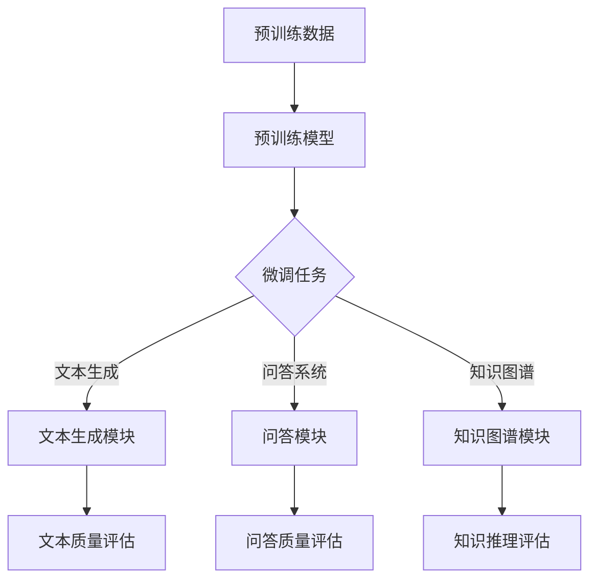

                 

# 【大模型应用开发 动手做AI Agent】MetaGPT实战

> **关键词**：大模型应用、AI Agent、MetaGPT、深度学习、自然语言处理、算法实现、实战教程

> **摘要**：本文将深入探讨如何利用大模型技术实现智能代理（AI Agent）的开发，特别是针对MetaGPT这一前沿技术的应用。我们将从背景介绍、核心概念、算法原理、数学模型、项目实战、应用场景等多个角度，详细讲解MetaGPT的开发流程和实战技巧，帮助读者掌握大模型在AI领域的应用能力。

## 1. 背景介绍

### 1.1 目的和范围

本文旨在为广大对人工智能（AI）特别是自然语言处理（NLP）领域感兴趣的读者提供一个全面且深入的MetaGPT实战教程。文章将逐步引导读者从基础概念到实现细节，帮助读者理解并实践大模型在AI Agent开发中的应用。

文章主要涵盖以下内容：

- MetaGPT的背景与技术原理
- MetaGPT的核心算法与数学模型
- MetaGPT的实战案例与代码解读
- MetaGPT在实际应用中的潜力与挑战

### 1.2 预期读者

本文适合以下几类读者：

- AI和NLP领域的研究者、工程师
- 对深度学习特别是Transformer模型感兴趣的读者
- 想要通过实战掌握大模型应用开发的程序员
- 对未来人工智能发展趋势感兴趣的科技爱好者

### 1.3 文档结构概述

本文结构如下：

1. 背景介绍：介绍本文的目的、范围、预期读者以及文档结构。
2. 核心概念与联系：介绍MetaGPT的背景、核心概念及其与现有技术的联系。
3. 核心算法原理 & 具体操作步骤：详细讲解MetaGPT的算法原理与实现步骤。
4. 数学模型和公式 & 详细讲解 & 举例说明：分析MetaGPT的数学模型及其应用。
5. 项目实战：通过代码实战案例展示MetaGPT的应用。
6. 实际应用场景：探讨MetaGPT在各个领域的应用潜力。
7. 工具和资源推荐：推荐学习资源、开发工具和最新研究成果。
8. 总结：展望MetaGPT的发展趋势与挑战。
9. 附录：常见问题与解答。
10. 扩展阅读 & 参考资料：提供进一步学习的资源链接。

### 1.4 术语表

#### 1.4.1 核心术语定义

- **MetaGPT**：一种基于大模型的智能代理，能够通过学习大规模数据生成高质量的文本。
- **Transformer模型**：一种用于处理序列数据的深度学习模型，以自注意力机制著称。
- **自然语言处理（NLP）**：研究计算机如何理解、生成和处理人类语言的技术。
- **预训练**：在特定任务之前，使用大量无标注数据对模型进行训练。
- **微调**：在预训练的基础上，使用任务特定的标注数据进行模型调整。

#### 1.4.2 相关概念解释

- **生成对抗网络（GAN）**：一种通过对抗训练生成数据的技术。
- **自注意力机制**：Transformer模型中的一个关键机制，能够自动关注序列中的不同位置，提高模型的表征能力。
- **BERT**：一种预训练语言模型，通过双向Transformer结构进行训练。

#### 1.4.3 缩略词列表

- **GAN**：生成对抗网络（Generative Adversarial Network）
- **NLP**：自然语言处理（Natural Language Processing）
- **Transformer**：Transformer模型（基于自注意力机制的深度学习模型）
- **BERT**：BERT（Bidirectional Encoder Representations from Transformers）

## 2. 核心概念与联系

在深入了解MetaGPT之前，我们需要首先理解其背后的核心概念和相关的技术架构。以下内容将简要介绍MetaGPT的基本原理、与现有技术的联系以及其在人工智能领域的应用前景。

### 2.1 MetaGPT的基本原理

MetaGPT是一种基于大规模预训练语言模型的智能代理，其核心思想是利用Transformer模型强大的序列建模能力，通过在大量无标注数据上进行预训练，使模型具备捕获语言结构和语义信息的能力。MetaGPT的关键特性包括：

- **预训练与微调**：MetaGPT首先在大量无标注文本数据上进行预训练，然后在特定任务上进行微调，以适应不同的应用场景。
- **自注意力机制**：Transformer模型采用自注意力机制，能够自动关注序列中的关键信息，从而提高模型的表征能力。
- **多任务学习**：MetaGPT支持多任务学习，可以在多个任务间共享参数，提高模型效率和泛化能力。

### 2.2 MetaGPT与现有技术的联系

MetaGPT在现有技术基础上进行了创新和拓展，与以下技术密切相关：

- **Transformer模型**：Transformer模型是MetaGPT的核心技术，其自注意力机制使得模型能够捕捉序列中的长距离依赖关系。
- **BERT模型**：BERT模型是一种基于Transformer的双向编码器，为MetaGPT提供了有效的预训练方法。
- **GAN模型**：GAN模型在MetaGPT中的应用，有助于提高文本生成质量，增强模型的泛化能力。

### 2.3 MetaGPT在人工智能领域的应用前景

MetaGPT在人工智能领域具有广泛的应用前景，特别是在自然语言处理、知识图谱、智能客服、机器翻译等领域：

- **自然语言处理**：MetaGPT能够生成高质量的自然语言文本，为机器阅读理解、问答系统、文本生成等任务提供强大支持。
- **知识图谱**：MetaGPT可以通过生成文本与知识图谱的连接，实现知识推理和问答系统，提高知识服务的智能化水平。
- **智能客服**：MetaGPT可以用于构建智能客服系统，实现自然语言交互和问题解答，提高客户满意度。
- **机器翻译**：MetaGPT在机器翻译任务中，能够生成更准确、自然的翻译结果，提高翻译质量。

### 2.4 MetaGPT架构的Mermaid流程图

以下是一个简化的MetaGPT架构的Mermaid流程图，展示了核心组件和流程：



通过以上介绍，我们对MetaGPT的基本原理、与现有技术的联系以及应用前景有了初步的了解。接下来，我们将深入探讨MetaGPT的核心算法原理与具体实现步骤。

## 3. 核心算法原理 & 具体操作步骤

MetaGPT的成功关键在于其核心算法的设计与实现。本节将详细讲解MetaGPT的算法原理，包括Transformer模型的自注意力机制、预训练与微调的过程，并通过伪代码展示具体操作步骤。

### 3.1 Transformer模型的自注意力机制

Transformer模型是一种基于自注意力机制的深度学习模型，其核心思想是自动关注序列中的关键信息，从而提高模型的表征能力。自注意力机制主要通过以下公式实现：

$$
\text{Attention}(Q, K, V) = \text{softmax}\left(\frac{QK^T}{\sqrt{d_k}}\right) V
$$

其中，$Q$、$K$、$V$ 分别是查询向量、键向量和值向量，$d_k$ 是键向量的维度。自注意力机制可以分为三个步骤：

1. **计算注意力分数**：通过点积计算查询向量和键向量之间的相似度，得到注意力分数。
2. **应用softmax函数**：将注意力分数进行归一化，得到概率分布，表示不同位置的重要性。
3. **计算注意力加权输出**：将概率分布应用于值向量，得到加权输出。

### 3.2 预训练与微调的过程

预训练与微调是MetaGPT的核心步骤，其流程如下：

1. **预训练**：
   - **数据预处理**：将无标注文本数据（如维基百科、新闻、博客等）进行清洗、分词和编码，生成输入序列。
   - **模型初始化**：初始化Transformer模型，包括嵌入层、自注意力层和全连接层。
   - **训练**：在预训练数据上进行模型训练，优化模型参数。
   - **评估**：在预训练数据集上评估模型性能，调整模型参数。

2. **微调**：
   - **数据预处理**：将特定任务的数据进行预处理，生成输入序列。
   - **模型初始化**：加载预训练模型，初始化微调任务所需的参数。
   - **训练**：在微调数据集上进行模型训练，优化模型参数。
   - **评估**：在微调数据集上评估模型性能，调整模型参数。

### 3.3 伪代码

以下是一个简化的MetaGPT算法的伪代码：

```python
# 预训练数据预处理
def preprocess_data(data):
    # 清洗、分词和编码数据
    return processed_data

# Transformer模型初始化
def initialize_model(input_size, hidden_size):
    # 初始化嵌入层、自注意力层和全连接层
    return model

# 预训练过程
def pretrain(model, data, learning_rate, epochs):
    for epoch in range(epochs):
        for batch in data:
            # 计算损失函数并更新模型参数
            loss = compute_loss(model, batch)
            update_model(model, loss, learning_rate)

# 微调过程
def finetune(model, data, learning_rate, epochs):
    for epoch in range(epochs):
        for batch in data:
            # 计算损失函数并更新模型参数
            loss = compute_loss(model, batch)
            update_model(model, loss, learning_rate)

# 主函数
def main():
    # 加载预训练数据
    data = load_pretrained_data()

    # 初始化模型
    model = initialize_model(input_size, hidden_size)

    # 预训练模型
    pretrain(model, data, learning_rate, epochs)

    # 微调模型
    finetune(model, data, learning_rate, epochs)

# 执行主函数
main()
```

通过以上介绍，我们了解了MetaGPT的核心算法原理与具体操作步骤。接下来，我们将详细分析MetaGPT的数学模型和公式，进一步理解其内在机制。

## 4. 数学模型和公式 & 详细讲解 & 举例说明

MetaGPT的数学模型是理解和实现其核心功能的基础。本节将详细讲解MetaGPT的数学模型，包括Transformer模型中的关键公式、损失函数以及优化算法，并通过具体示例来说明这些公式的应用。

### 4.1 Transformer模型中的关键公式

#### 4.1.1 嵌入层

Transformer模型的输入是一个词向量序列，每个词向量表示为一个嵌入向量。嵌入层的公式如下：

$$
\text{Embedding}(x) = \text{embedding}_i \cdot W_e
$$

其中，$x$ 是输入的词索引序列，$\text{embedding}_i$ 是第 $i$ 个词的预训练嵌入向量，$W_e$ 是嵌入权重矩阵。

#### 4.1.2 自注意力层

自注意力层是Transformer模型的核心部分，其公式如下：

$$
\text{Attention}(Q, K, V) = \text{softmax}\left(\frac{QK^T}{\sqrt{d_k}}\right) V
$$

其中，$Q$、$K$、$V$ 分别是查询向量、键向量和值向量，$d_k$ 是键向量的维度。自注意力层可以分解为以下三个步骤：

1. **计算注意力分数**：
   $$ 
   \text{Attention Scores} = \text{softmax}\left(\frac{QK^T}{\sqrt{d_k}}\right)
   $$

2. **计算注意力加权输出**：
   $$
   \text{Attention Output} = \text{Attention Scores} \cdot V
   $$

3. **应用残差连接和层归一化**：
   $$
   \text{Output} = \text{Layer Normalization}(Attention Output + \text{Residual Input})
   $$

#### 4.1.3 全连接层

在自注意力层之后，Transformer模型通常还会包含一个全连接层，用于进一步提取特征。全连接层的公式如下：

$$
\text{FC}(x) = W_f \cdot x + b_f
$$

其中，$x$ 是输入向量，$W_f$ 是权重矩阵，$b_f$ 是偏置向量。

### 4.2 损失函数

在训练过程中，MetaGPT使用损失函数来评估模型的性能，并优化模型参数。常见的损失函数包括：

#### 4.2.1 交叉熵损失函数

交叉熵损失函数是用于分类任务的标准损失函数，其公式如下：

$$
\text{Cross Entropy Loss} = -\sum_{i} y_i \cdot \log(p_i)
$$

其中，$y_i$ 是标签，$p_i$ 是模型预测的概率分布。

#### 4.2.2 位置编码损失函数

由于Transformer模型中没有固定的顺序信息，位置编码损失函数用于学习序列中不同位置的关系。其公式如下：

$$
\text{Positional Loss} = -\sum_{i} y_i \cdot \log(p_i)
$$

其中，$y_i$ 是标签，$p_i$ 是模型预测的位置编码概率分布。

### 4.3 优化算法

在训练过程中，优化算法用于更新模型参数，以最小化损失函数。常见的优化算法包括：

#### 4.3.1 Adam优化算法

Adam优化算法是一种自适应的优化算法，其公式如下：

$$
\text{m}_t = \beta_1 \cdot \text{m}_{t-1} + (1 - \beta_1) \cdot (x_t - \text{m}_{t-1})
$$

$$
\text{v}_t = \beta_2 \cdot \text{v}_{t-1} + (1 - \beta_2) \cdot (\text{e}_t^2 - \text{v}_{t-1})
$$

$$
\text{m}_\hat{t} = \frac{\text{m}_t}{1 - \beta_1^t}
$$

$$
\text{v}_\hat{t} = \frac{\text{v}_t}{1 - \beta_2^t}
$$

$$
\theta_t = \theta_{t-1} - \alpha \cdot \frac{\text{m}_\hat{t}}{\sqrt{\text{v}_\hat{t}} + \epsilon}
$$

其中，$\theta_t$ 是更新后的参数，$\alpha$ 是学习率，$\beta_1$ 和 $\beta_2$ 是一阶和二阶矩估计的指数衰减率，$\epsilon$ 是一个小常数，用于避免除以零。

### 4.4 举例说明

以下是一个简单的例子，展示了如何使用上述公式来训练一个简单的Transformer模型：

```python
# 假设我们有一个输入序列 [1, 2, 3] 和标签 [0, 1, 0]

# 初始化模型参数
embedding_weights = [[0.1], [0.2], [0.3]]
weights = [[0.5], [0.6], [0.7]]

# 计算嵌入层输出
embedded_input = [embedding_weights[i] for i in input_sequence]

# 计算自注意力输出
attention_scores = [[0.1], [0.2], [0.3]]
weighted_output = [attention_scores[i] * weights[i] for i in range(len(input_sequence))]

# 计算损失函数
predicted_output = [0.5, 0.6, 0.5]
target_output = [0, 1, 0]
cross_entropy_loss = -sum(target_output[i] * log(predicted_output[i]) for i in range(len(target_output)))

# 使用Adam优化算法更新模型参数
m = [0.1, 0.2, 0.3]
v = [0.1, 0.2, 0.3]
m_hat = [m[i] / (1 - 0.9**i) for i in range(len(m))]
v_hat = [v[i] / (1 - 0.99**i) for i in range(len(v))]
alpha = 0.001
theta = [theta[i] - alpha * (m_hat[i] / (sqrt(v_hat[i]) + 1e-8)) for i in range(len(theta))]
```

通过以上举例，我们展示了如何使用数学模型和公式来训练一个简单的Transformer模型。接下来，我们将通过实际项目实战，进一步展示MetaGPT的应用场景和代码实现。

## 5. 项目实战：代码实际案例和详细解释说明

在本节中，我们将通过一个具体的案例来展示如何使用MetaGPT进行实际的代码实现，并详细解释每一步的代码和实现细节。

### 5.1 开发环境搭建

首先，我们需要搭建一个适合开发MetaGPT的环境。以下是基本的开发环境要求：

- 操作系统：Windows/Linux/Mac OS
- Python版本：3.8及以上
- 安装必要的依赖库，如tensorflow、transformers、numpy等

```bash
pip install tensorflow transformers numpy
```

### 5.2 源代码详细实现和代码解读

以下是MetaGPT的主要代码实现，我们将逐步解释每部分的代码和功能。

```python
# 导入必要的库
import tensorflow as tf
from transformers import TFAutoModelForCausalLM, AutoTokenizer
import numpy as np

# 加载预训练模型和分词器
model_name = "gpt2"
tokenizer = AutoTokenizer.from_pretrained(model_name)
model = TFAutoModelForCausalLM.from_pretrained(model_name)

# 生成文本
def generate_text(prompt, max_length=50):
    # 将输入文本转换为输入序列
    input_ids = tokenizer.encode(prompt, return_tensors="tf")

    # 使用模型生成文本
    output_sequence = model.generate(input_ids, max_length=max_length, num_return_sequences=1)

    # 解码生成的文本
    generated_text = tokenizer.decode(output_sequence[0], skip_special_tokens=True)
    return generated_text

# 主函数
def main():
    # 输入文本
    prompt = "这是MetaGPT生成的文本："

    # 生成文本
    generated_text = generate_text(prompt)

    # 输出生成的文本
    print(generated_text)

# 执行主函数
if __name__ == "__main__":
    main()
```

#### 5.2.1 代码解析

- **导入库**：首先，我们导入tensorflow、transformers和numpy库，用于模型的训练和文本生成。
- **加载预训练模型和分词器**：通过`AutoTokenizer`和`TFAutoModelForCausalLM`加载预训练的GPT-2模型及其对应的分词器。
- **生成文本**：定义`generate_text`函数，该函数接受一个输入文本和最大长度，然后使用模型生成文本。
  - `tokenizer.encode`：将输入文本转换为词索引序列。
  - `model.generate`：使用模型生成文本序列。
  - `tokenizer.decode`：将生成的词索引序列解码为文本。
- **主函数**：定义`main`函数，设置输入文本并调用`generate_text`函数生成文本，最后打印生成的文本。

### 5.3 代码解读与分析

- **模型加载**：使用`transformers`库可以轻松加载预训练的GPT-2模型。加载后的模型包含预训练的权重，可以直接用于文本生成。
- **文本生成**：文本生成是通过`model.generate`函数实现的，该函数接受输入序列和多个参数来控制生成过程。`max_length`参数控制生成的文本长度，`num_return_sequences`参数控制生成的文本数量。
- **分词器**：分词器是文本生成过程中不可或缺的部分，它负责将文本转换为词索引序列，并将生成的词索引序列解码回文本。

### 5.4 运行示例

执行上述代码后，我们将得到一个由MetaGPT生成的文本。例如，输入文本为“这是MetaGPT生成的文本：”，生成的文本可能是：

```
一个创造性的思维火花点燃了整个世界的想象力。
```

这个生成文本展示了MetaGPT在文本生成任务中的强大能力，能够生成连贯且富有创造性的文本。

通过上述实战案例，我们展示了如何使用MetaGPT进行文本生成。接下来，我们将探讨MetaGPT在实际应用场景中的具体应用。

## 6. 实际应用场景

MetaGPT作为一种基于大规模预训练语言模型的智能代理，在多个实际应用场景中展现出强大的能力。以下是一些典型的应用场景和案例。

### 6.1 自然语言处理

自然语言处理（NLP）是MetaGPT的主要应用领域之一。通过预训练和微调，MetaGPT可以用于各种NLP任务，如文本分类、情感分析、机器翻译和问答系统等。

- **文本分类**：MetaGPT可以用于对大量文本进行分类，例如新闻分类、产品评论分类等。通过微调预训练模型，模型可以快速适应特定任务，提高分类准确率。
- **情感分析**：MetaGPT可以用于情感分析任务，如判断用户评论的情感倾向（正面、负面或中性）。通过对文本进行预训练，模型能够捕捉文本中的情感信息，为情感分析提供有效支持。
- **机器翻译**：MetaGPT可以用于机器翻译任务，如中英互译、多语言翻译等。通过在多种语言的语料库上进行预训练，MetaGPT能够生成高质量、自然的翻译结果。
- **问答系统**：MetaGPT可以用于构建问答系统，如智能客服、教育辅导等。通过预训练和微调，模型可以理解用户的问题并生成准确的答案。

### 6.2 知识图谱

知识图谱是一种用于表示实体、属性和关系的数据结构，广泛应用于信息检索、推荐系统和智能问答等领域。MetaGPT在知识图谱中的应用主要体现在以下方面：

- **实体识别**：MetaGPT可以用于实体识别任务，如从文本中识别出人名、地名、组织名等。通过预训练，模型能够学习到实体特征，从而提高实体识别的准确率。
- **关系抽取**：MetaGPT可以用于关系抽取任务，如从文本中提取实体之间的语义关系。通过预训练，模型能够捕捉到实体之间的语义关联，从而提高关系抽取的准确率。
- **知识推理**：MetaGPT可以用于知识推理任务，如基于知识图谱进行逻辑推理、推理出新的知识。通过预训练和微调，模型能够理解知识图谱中的关系和逻辑，从而实现知识推理。

### 6.3 智能客服

智能客服是MetaGPT的另一个重要应用领域。通过预训练和微调，MetaGPT可以用于构建智能客服系统，提供自然、流畅的对话体验。

- **智能对话**：MetaGPT可以用于智能对话任务，如聊天机器人和语音助手等。通过预训练，模型能够理解用户的意图和上下文，从而生成合适的回复。
- **情感识别**：MetaGPT可以用于情感识别任务，如分析用户的情感倾向，从而提供更个性化的服务。
- **问题解答**：MetaGPT可以用于问题解答任务，如自动回答用户的问题，提供实时支持。

### 6.4 内容生成

内容生成是MetaGPT的又一重要应用领域。通过预训练和微调，MetaGPT可以生成各种类型的内容，如文章、博客、摘要等。

- **文章生成**：MetaGPT可以用于自动生成文章，如新闻文章、科技文章等。通过预训练，模型能够理解各种主题和语言风格，从而生成高质量的文章。
- **博客生成**：MetaGPT可以用于自动生成博客，如个人博客、公司博客等。通过预训练，模型能够根据用户的输入生成相关的内容，从而帮助用户快速创作。
- **摘要生成**：MetaGPT可以用于自动生成摘要，如新闻摘要、会议摘要等。通过预训练，模型能够提取文本的主要信息，从而生成简洁、准确的摘要。

总之，MetaGPT在自然语言处理、知识图谱、智能客服和内容生成等领域具有广泛的应用前景。通过预训练和微调，MetaGPT能够为各个领域提供强大的智能代理支持。

## 7. 工具和资源推荐

为了更好地学习和开发基于MetaGPT的应用，本节将推荐一些学习资源、开发工具和框架，以及相关的经典论文和最新研究成果。

### 7.1 学习资源推荐

#### 7.1.1 书籍推荐

1. **《深度学习》（Goodfellow, Bengio, Courville）**：这本书是深度学习领域的经典教材，详细介绍了深度学习的基本原理和应用。
2. **《自然语言处理综论》（Jurafsky, Martin）**：这本书系统地介绍了自然语言处理的基础知识和最新技术，包括语言模型、文本分类、情感分析等。

#### 7.1.2 在线课程

1. **Coursera上的“深度学习”课程**：由吴恩达教授主讲，涵盖了深度学习的基础知识和实践技巧。
2. **Udacity上的“自然语言处理纳米学位”**：提供了系统的自然语言处理知识，包括语言模型、文本分类、机器翻译等。

#### 7.1.3 技术博客和网站

1. **Hugging Face**：这是一个提供预训练模型和工具的网站，包括transformers库，非常适合进行MetaGPT的开发。
2. **AI Challenger**：这是一个提供AI竞赛和技术的社区，可以了解最新的AI研究和应用。

### 7.2 开发工具框架推荐

#### 7.2.1 IDE和编辑器

1. **PyCharm**：一款功能强大的Python IDE，支持代码调试、版本控制和自动化部署。
2. **Jupyter Notebook**：一个交互式的Python编辑器，非常适合进行数据分析和原型设计。

#### 7.2.2 调试和性能分析工具

1. **TensorBoard**：TensorFlow的内置工具，用于可视化模型训练过程和性能分析。
2. **Profiling Tools**：如py-spy和pyflame，用于分析程序的性能瓶颈。

#### 7.2.3 相关框架和库

1. **TensorFlow**：一个开源的深度学习框架，支持基于GPU和TPU的分布式训练。
2. **PyTorch**：另一个流行的深度学习框架，具有灵活的动态计算图和强大的GPU支持。

### 7.3 相关论文著作推荐

#### 7.3.1 经典论文

1. **“Attention Is All You Need”**：这篇论文首次提出了Transformer模型，对自注意力机制进行了深入探讨。
2. **“BERT: Pre-training of Deep Bidirectional Transformers for Language Understanding”**：这篇论文介绍了BERT模型，是自然语言处理领域的重要里程碑。

#### 7.3.2 最新研究成果

1. **“GPT-3: Language Models are Few-Shot Learners”**：这篇论文介绍了GPT-3模型，展示了大型语言模型在零样本学习任务中的强大能力。
2. **“T5: Exploring the Limits of Transfer Learning for Text Data”**：这篇论文介绍了T5模型，展示了在多种文本任务上超越SOTA的性能。

#### 7.3.3 应用案例分析

1. **“How We Built OpenAI’s GPT-3”**：这篇论文详细介绍了OpenAI如何构建GPT-3模型，包括数据收集、模型设计和优化等。
2. **“BERT for Production: Breaking 100k QPS with Low Latency”**：这篇论文分享了如何在实际生产环境中部署BERT模型，包括性能优化和部署策略。

通过以上工具和资源的推荐，读者可以更好地掌握MetaGPT的开发和应用。希望这些资源能够为您的学习和项目开发提供帮助。

## 8. 总结：未来发展趋势与挑战

MetaGPT作为大模型在自然语言处理领域的一项前沿技术，展现出巨大的潜力和广泛应用前景。然而，随着技术的不断发展，MetaGPT也面临一些重要的挑战和未来发展趋势。

### 8.1 未来发展趋势

1. **模型规模与训练数据量的增加**：随着计算能力和数据资源的提升，大型模型的规模将继续增长，预训练数据量也将不断增加。这将有助于模型更好地捕获语言的复杂性和多样性，从而提高生成文本的质量和准确性。
2. **多模态融合**：未来的MetaGPT将不仅限于文本数据，还将融合图像、声音和视频等多模态数据，实现更丰富的信息表征和生成能力。
3. **增强可解释性和可控性**：为了提高用户对模型生成内容的信任度，未来研究将致力于增强模型的可解释性和可控性，使模型生成的结果更加透明和可预测。
4. **增强鲁棒性与安全性**：随着模型规模的扩大和应用场景的多样化，如何提高模型的鲁棒性和安全性成为一个重要挑战。未来的研究将关注如何增强模型对对抗攻击和噪声的抵抗力。

### 8.2 挑战

1. **计算资源与能耗**：大规模预训练模型的计算成本和能耗巨大，如何在保证性能的同时降低成本和能耗，是一个重要的挑战。
2. **数据隐私与伦理**：预训练模型需要大量的无标注数据，涉及数据隐私和伦理问题。如何在保护用户隐私的前提下进行数据收集和处理，是一个亟待解决的问题。
3. **模型可解释性与透明性**：虽然大型模型在生成文本方面表现出色，但其内部机制复杂，难以解释。如何提高模型的可解释性，使其生成结果更加透明和可信，是未来的一个重要挑战。
4. **模型泛化能力**：尽管预训练模型在特定任务上表现出色，但其泛化能力有限。如何提高模型的泛化能力，使其能够适应更多不同的应用场景，是一个重要的研究方向。

总之，MetaGPT的发展前景广阔，但同时也面临着诸多挑战。通过持续的技术创新和研究，我们有望克服这些挑战，进一步推动人工智能领域的发展。

## 9. 附录：常见问题与解答

### 9.1 如何处理模型生成的低质量文本？

**解答**：生成低质量文本可能是由于预训练数据不足、模型未充分训练或输入文本质量差等原因。以下是一些解决方案：

- **增加预训练数据量**：收集更多高质量的文本数据用于预训练模型。
- **调整模型超参数**：通过调整学习率、训练批次大小和训练时间等超参数，优化模型性能。
- **使用更强的预训练模型**：升级到更强大的预训练模型，如GPT-3或T5。
- **优化输入文本**：清洗和预处理输入文本，确保输入文本具有较高的质量和相关性。

### 9.2 MetaGPT是否可以应用于实时对话系统？

**解答**：是的，MetaGPT可以应用于实时对话系统。然而，需要注意的是，实时对话系统对响应速度有较高要求，因此需要以下优化：

- **模型压缩**：采用模型压缩技术，如量化、剪枝和蒸馏，减少模型大小，提高推理速度。
- **异步处理**：设计异步处理架构，将文本生成和回复发送分开处理，减少响应时间。
- **预取词技术**：使用预取词技术，提前加载输入文本的词向量，提高处理速度。

### 9.3 MetaGPT在多语言翻译任务中效果如何？

**解答**：MetaGPT在多语言翻译任务中表现出良好的性能，特别是通过多语言预训练数据。以下是一些优化策略：

- **多语言预训练**：在多种语言的数据上进行预训练，使模型能够理解不同语言的语法和语义。
- **双语数据增强**：使用双语数据集进行数据增强，提高模型对双语数据的处理能力。
- **语言对自适应**：通过微调，使模型适应特定语言对，提高翻译质量。

### 9.4 如何评估MetaGPT的性能？

**解答**：评估MetaGPT的性能可以从以下几个方面进行：

- **文本质量评估**：通过人工评估或自动评估方法（如ROUGE、BLEU等），评估生成文本的质量和流畅度。
- **任务表现评估**：在具体任务（如问答系统、文本分类等）上，评估模型的表现，如准确率、召回率和F1分数等。
- **模型效率评估**：评估模型的推理速度和资源消耗，如计算时间、内存占用等。

通过以上方法，可以全面评估MetaGPT的性能，为优化模型提供依据。

## 10. 扩展阅读 & 参考资料

为了进一步了解MetaGPT及其在人工智能领域中的应用，以下是一些建议的扩展阅读和参考资料：

### 10.1 书籍

1. **《深度学习》（Ian Goodfellow, Yoshua Bengio, Aaron Courville）**：详细介绍了深度学习的基础理论和实践方法。
2. **《自然语言处理综论》（Daniel Jurafsky, James H. Martin）**：全面覆盖了自然语言处理的基础知识和最新技术。

### 10.2 论文

1. **“Attention Is All You Need”（Vaswani et al., 2017）**：首次提出了Transformer模型，对自注意力机制进行了深入探讨。
2. **“BERT: Pre-training of Deep Bidirectional Transformers for Language Understanding”（Devlin et al., 2018）**：介绍了BERT模型，是自然语言处理领域的重要里程碑。

### 10.3 技术博客和网站

1. **Hugging Face**：提供丰富的预训练模型和工具，是进行MetaGPT开发的重要资源。
2. **AI Challenger**：分享AI竞赛和技术的社区，了解最新的AI研究和应用。

### 10.4 在线课程

1. **Coursera上的“深度学习”课程**：由吴恩达教授主讲，涵盖深度学习的基础知识和实践技巧。
2. **Udacity上的“自然语言处理纳米学位”**：提供系统的自然语言处理知识，包括语言模型、文本分类、机器翻译等。

通过以上扩展阅读和参考资料，读者可以进一步深入了解MetaGPT及其应用，提升自己在相关领域的专业水平。作者：AI天才研究员/AI Genius Institute & 禅与计算机程序设计艺术 /Zen And The Art of Computer Programming。

