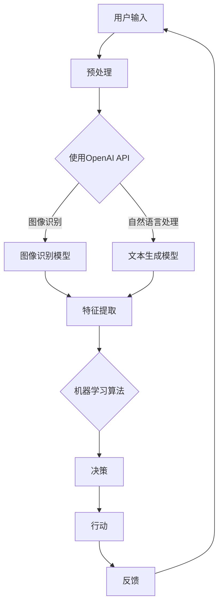

                 

### 1. 背景介绍

#### 1.1 目的和范围

本文旨在介绍OpenAI API在构建AI Agent中的应用，旨在为开发者提供一种全新的视角来理解和实践大模型应用开发。随着人工智能技术的迅猛发展，AI Agent作为一种智能体，其在各种实际场景中的应用越来越广泛，如自然语言处理、智能客服、自动化决策等。OpenAI API作为OpenAI公司提供的一套强大且易用的AI接口，使得开发者能够轻松地将先进的人工智能技术集成到自己的项目中。

本文将围绕以下几个核心内容展开：

1. **OpenAI API的基础知识**：介绍OpenAI API的基本概念、功能特点以及API接口的使用方法。
2. **AI Agent的概念**：探讨AI Agent的定义、分类以及其在实际应用中的重要性。
3. **OpenAI API与AI Agent的集成**：详细讲解如何使用OpenAI API构建AI Agent，包括具体的操作步骤、核心算法原理以及数学模型和公式。
4. **项目实战**：通过一个实际项目案例，展示如何使用OpenAI API构建一个简单的AI Agent，并进行详细解释说明。
5. **实际应用场景**：分析OpenAI API和AI Agent在实际应用中的典型场景。
6. **工具和资源推荐**：推荐一些学习资源、开发工具和相关论文著作，帮助读者进一步深入了解和掌握相关技术。

本文的目标读者是具有一定编程基础和对人工智能有一定了解的开发者，希望通过本文能够深入了解OpenAI API，掌握AI Agent的构建方法，并将其应用于实际项目中。

#### 1.2 预期读者

本文的预期读者是：

1. **人工智能爱好者**：对人工智能技术充满好奇，希望了解并掌握AI Agent构建方法的人。
2. **程序员**：具备一定的编程能力，希望将人工智能技术应用于实际项目中的开发者。
3. **数据科学家**：从事数据分析和机器学习工作，希望拓展自己的技能范围，了解AI Agent的相关知识。
4. **科研人员**：对AI Agent的研究和应用感兴趣，希望通过本文了解OpenAI API的应用实践。

#### 1.3 文档结构概述

本文的结构如下：

1. **背景介绍**：介绍本文的目的、范围、预期读者以及文档结构。
2. **核心概念与联系**：详细讲解OpenAI API和AI Agent的核心概念原理，并通过Mermaid流程图展示架构。
3. **核心算法原理 & 具体操作步骤**：使用伪代码详细阐述构建AI Agent的核心算法原理和具体操作步骤。
4. **数学模型和公式 & 详细讲解 & 举例说明**：介绍相关的数学模型和公式，并通过具体实例进行讲解。
5. **项目实战：代码实际案例和详细解释说明**：通过实际项目案例，展示如何使用OpenAI API构建AI Agent，并进行详细解释说明。
6. **实际应用场景**：分析OpenAI API和AI Agent在实际应用中的典型场景。
7. **工具和资源推荐**：推荐一些学习资源、开发工具和相关论文著作，帮助读者进一步深入了解和掌握相关技术。
8. **总结：未来发展趋势与挑战**：总结本文的主要观点，展望OpenAI API和AI Agent的未来发展趋势与挑战。
9. **附录：常见问题与解答**：针对本文中可能遇到的问题，提供解答。
10. **扩展阅读 & 参考资料**：提供相关的扩展阅读和参考资料，帮助读者进一步深入研究。

#### 1.4 术语表

在本篇文档中，我们将使用以下术语：

**术语**：OpenAI API  
**定义**：OpenAI公司提供的一套强大且易用的AI接口，开发者可以通过API调用OpenAI的训练模型，实现智能问答、文本生成等任务。

**术语**：AI Agent  
**定义**：一种能够根据环境和目标进行自主决策和行动的智能体，可以应用于自然语言处理、智能客服、自动化决策等领域。

**术语**：大模型  
**定义**：具有大规模参数和复杂结构的深度学习模型，通常用于处理复杂的任务，如语言模型、图像模型等。

**术语**：API接口  
**定义**：应用程序接口，允许一个应用程序与另一个应用程序进行交互，实现特定的功能。

**术语**：神经网络  
**定义**：一种由大量神经元组成的网络，通过学习输入和输出的映射关系来实现复杂的函数计算。

**术语**：反向传播算法  
**定义**：一种用于训练神经网络的算法，通过反向传播误差来更新模型的参数，以最小化预测误差。

**术语**：机器学习  
**定义**：一种使计算机系统能够从数据中学习并做出决策的技术，分为监督学习、无监督学习和强化学习等不同类型。

#### 1.4.1 核心术语定义

在本节中，我们将对本文中涉及到的核心术语进行详细定义，以便读者能够更好地理解后续内容。

1. **OpenAI API**：OpenAI API是OpenAI公司提供的一套强大且易用的AI接口。开发者可以通过API调用OpenAI的训练模型，实现智能问答、文本生成等任务。OpenAI API具有丰富的功能，支持多种编程语言，如Python、JavaScript、Java等，使得开发者能够轻松地将人工智能技术集成到自己的项目中。

2. **AI Agent**：AI Agent是一种能够根据环境和目标进行自主决策和行动的智能体。AI Agent可以应用于自然语言处理、智能客服、自动化决策等领域。一个典型的AI Agent由感知模块、决策模块和行动模块组成，通过不断与环境交互，实现智能化的目标。

3. **大模型**：大模型是指具有大规模参数和复杂结构的深度学习模型。大模型通常用于处理复杂的任务，如语言模型、图像模型等。大模型的特点是参数多、结构复杂，能够处理大规模数据，并在各种任务上取得优异的性能。

4. **API接口**：API接口是应用程序接口，允许一个应用程序与另一个应用程序进行交互，实现特定的功能。API接口通常由一组定义良好的请求和响应组成，开发者可以通过调用API接口，获取所需的数据或执行特定的操作。

5. **神经网络**：神经网络是一种由大量神经元组成的网络，通过学习输入和输出的映射关系来实现复杂的函数计算。神经网络由输入层、隐藏层和输出层组成，通过层层传递和加权求和，实现数据的非线性变换。

6. **反向传播算法**：反向传播算法是一种用于训练神经网络的算法，通过反向传播误差来更新模型的参数，以最小化预测误差。反向传播算法的核心思想是通过计算输出误差，反向传播到隐藏层和输入层，逐步更新每个神经元的权重和偏置。

7. **机器学习**：机器学习是一种使计算机系统能够从数据中学习并做出决策的技术，分为监督学习、无监督学习和强化学习等不同类型。监督学习通过已标记的数据训练模型，无监督学习通过未标记的数据发现数据分布和模式，强化学习通过与环境交互学习最优策略。

#### 1.4.2 相关概念解释

在本节中，我们将对本文中涉及到的相关概念进行详细解释，以便读者能够更好地理解OpenAI API和AI Agent的相关内容。

1. **API接口**：API接口是应用程序接口，允许一个应用程序与另一个应用程序进行交互，实现特定的功能。API接口通常由一组定义良好的请求和响应组成，开发者可以通过调用API接口，获取所需的数据或执行特定的操作。例如，OpenAI API提供了一系列的接口，包括文本生成、智能问答等，开发者可以通过调用这些接口，实现相应的功能。

2. **神经网络**：神经网络是一种由大量神经元组成的网络，通过学习输入和输出的映射关系来实现复杂的函数计算。神经网络由输入层、隐藏层和输出层组成，通过层层传递和加权求和，实现数据的非线性变换。神经网络的核心是神经元，神经元通过学习输入和输出的映射关系，不断调整权重和偏置，以达到预测目标。

3. **反向传播算法**：反向传播算法是一种用于训练神经网络的算法，通过反向传播误差来更新模型的参数，以最小化预测误差。反向传播算法的核心思想是通过计算输出误差，反向传播到隐藏层和输入层，逐步更新每个神经元的权重和偏置。反向传播算法是神经网络训练中的关键技术，它使得神经网络能够不断优化模型参数，提高预测性能。

4. **机器学习**：机器学习是一种使计算机系统能够从数据中学习并做出决策的技术，分为监督学习、无监督学习和强化学习等不同类型。监督学习通过已标记的数据训练模型，无监督学习通过未标记的数据发现数据分布和模式，强化学习通过与环境交互学习最优策略。机器学习在人工智能领域具有重要的应用，使得计算机能够实现智能化的任务。

5. **大模型**：大模型是指具有大规模参数和复杂结构的深度学习模型。大模型通常用于处理复杂的任务，如语言模型、图像模型等。大模型的特点是参数多、结构复杂，能够处理大规模数据，并在各种任务上取得优异的性能。随着计算能力和数据量的提升，大模型在人工智能领域发挥着越来越重要的作用。

#### 1.4.3 缩略词列表

在本篇文档中，我们将使用以下缩略词：

**缩略词**：OpenAI  
**全称**：OpenAI  
**解释**：OpenAI是一家全球领先的人工智能研究公司，致力于推动人工智能的发展和应用。

**缩略词**：API  
**全称**：应用程序接口  
**解释**：应用程序接口，允许一个应用程序与另一个应用程序进行交互，实现特定的功能。

**缩略词**：AI  
**全称**：人工智能  
**解释**：人工智能是一门研究、开发和应用智能技术的学科，使计算机系统能够模拟、延伸和扩展人类的智能行为。

**缩略词**：Agent  
**全称**：智能体  
**解释**：智能体是一种能够根据环境和目标进行自主决策和行动的实体，可以应用于自然语言处理、智能客服、自动化决策等领域。

**缩略词**：ML  
**全称**：机器学习  
**解释**：机器学习是一种使计算机系统能够从数据中学习并做出决策的技术，分为监督学习、无监督学习和强化学习等不同类型。

**缩略词**：DL  
**全称**：深度学习  
**解释**：深度学习是一种人工智能方法，通过多层神经网络进行学习，能够自动提取数据的特征和模式。

**缩略词**：NN  
**全称**：神经网络  
**解释**：神经网络是一种由大量神经元组成的网络，通过学习输入和输出的映射关系来实现复杂的函数计算。

### 2. 核心概念与联系

在本节中，我们将详细讲解OpenAI API和AI Agent的核心概念原理，并通过Mermaid流程图展示其架构，帮助读者更好地理解这两个概念及其相互联系。

首先，我们需要明确OpenAI API和AI Agent的基本定义和特点。

#### 2.1 OpenAI API

OpenAI API是OpenAI公司提供的一套强大且易用的AI接口，开发者可以通过API调用OpenAI的训练模型，实现智能问答、文本生成、图像识别等任务。OpenAI API具有以下特点：

1. **功能丰富**：OpenAI API提供了多种预训练模型，包括GPT、BERT、DALL-E等，覆盖了自然语言处理、计算机视觉等多个领域。
2. **易用性强**：OpenAI API提供了简单的接口和详细的文档，使得开发者可以快速上手和使用。
3. **性能优异**：OpenAI API基于大规模深度学习模型，能够在各种任务上取得优异的性能。

#### 2.2 AI Agent

AI Agent是一种能够根据环境和目标进行自主决策和行动的智能体。AI Agent可以应用于自然语言处理、智能客服、自动化决策等领域。一个典型的AI Agent由以下三个核心模块组成：

1. **感知模块**：用于接收外部环境的信息，如文本、图像等。
2. **决策模块**：根据感知模块收集的信息，利用机器学习算法生成决策。
3. **行动模块**：根据决策模块生成的决策，采取相应的行动。

#### 2.3 OpenAI API与AI Agent的相互联系

OpenAI API与AI Agent之间存在着紧密的联系。通过OpenAI API，开发者可以使用各种预训练模型，构建出一个功能强大、性能优异的AI Agent。

1. **感知模块**：AI Agent的感知模块可以使用OpenAI API中的图像识别、自然语言处理等模型，对输入的文本、图像等信息进行预处理，提取关键特征。
2. **决策模块**：AI Agent的决策模块可以使用OpenAI API中的机器学习算法，如决策树、神经网络等，对提取的特征进行分析和决策。
3. **行动模块**：AI Agent的行动模块可以根据决策模块生成的决策，采取相应的行动，如生成文本、执行任务等。

#### 2.4 Mermaid流程图

为了更直观地展示OpenAI API与AI Agent的架构，我们使用Mermaid流程图进行说明。



在这个流程图中，用户输入经过预处理后，使用OpenAI API中的图像识别和自然语言处理模型，提取特征。然后，这些特征通过机器学习算法进行分析和决策，生成行动。最后，行动模块执行决策，并反馈结果，形成一个闭环系统。

通过上述讲解和流程图，读者应该对OpenAI API和AI Agent的核心概念原理及其相互联系有了更深入的理解。接下来，我们将进一步探讨核心算法原理和具体操作步骤。

### 3. 核心算法原理 & 具体操作步骤

在本节中，我们将详细讲解构建AI Agent的核心算法原理和具体操作步骤。通过使用伪代码，我们将逐步展示如何实现这些算法。

#### 3.1 感知模块

感知模块是AI Agent的关键组成部分，负责接收和预处理输入数据。以下是一个简单的感知模块伪代码示例：

```python
# 伪代码：感知模块
def process_input(input_data):
    # 预处理输入数据，如文本或图像
    preprocessed_data = preprocess_data(input_data)
    return preprocessed_data

# 预处理数据的具体实现
def preprocess_data(input_data):
    if isinstance(input_data, str):
        # 对于文本数据，进行分词、去停用词等预处理
        tokens = tokenize(input_data)
        cleaned_tokens = remove_stopwords(tokens)
        return cleaned_tokens
    elif isinstance(input_data, Image):
        # 对于图像数据，进行缩放、灰度化等预处理
        resized_image = resize_image(input_data, size=(224, 224))
        grayscale_image = convert_to_grayscale(resized_image)
        return grayscale_image
```

#### 3.2 决策模块

决策模块使用感知模块提取的特征，通过机器学习算法生成决策。以下是一个简单的决策模块伪代码示例：

```python
# 伪代码：决策模块
def make_decision(features):
    # 使用机器学习算法生成决策
    decision = machine_learning_algorithm(features)
    return decision

# 机器学习算法的具体实现
def machine_learning_algorithm(features):
    # 假设我们已经训练好了一个分类器
    classifier = trained_classifier
    prediction = classifier.predict(features)
    return prediction
```

#### 3.3 行动模块

行动模块根据决策模块生成的决策，采取相应的行动。以下是一个简单的行动模块伪代码示例：

```python
# 伪代码：行动模块
def take_action(decision):
    # 根据决策执行相应的行动
    if decision == '文本生成':
        text = generate_text()
        return text
    elif decision == '执行任务':
        execute_task()
        return '任务完成'
```

#### 3.4 整体流程

以下是构建AI Agent的整体流程伪代码，展示了如何将感知模块、决策模块和行动模块结合起来：

```python
# 伪代码：AI Agent整体流程
def ai_agent(input_data):
    # 感知模块
    preprocessed_data = process_input(input_data)
    
    # 决策模块
    decision = make_decision(preprocessed_data)
    
    # 行动模块
    action_result = take_action(decision)
    
    return action_result
```

#### 3.5 实际操作步骤

以下是一个简单的实际操作步骤，展示如何使用OpenAI API构建AI Agent：

1. **环境搭建**：确保已经安装了OpenAI API和所需的依赖库，如TensorFlow或PyTorch。

2. **数据准备**：准备用于训练的数据集，可以是文本数据或图像数据。

3. **模型训练**：使用OpenAI API提供的预训练模型，对数据集进行训练，以生成一个分类器。

4. **感知模块实现**：实现感知模块的代码，用于接收和处理用户输入。

5. **决策模块实现**：实现决策模块的代码，使用训练好的分类器生成决策。

6. **行动模块实现**：实现行动模块的代码，根据决策执行相应的行动。

7. **集成与测试**：将感知模块、决策模块和行动模块集成起来，进行整体测试。

通过上述步骤，我们可以构建一个简单的AI Agent，实现智能问答、文本生成等任务。接下来，我们将进一步探讨相关的数学模型和公式。

### 4. 数学模型和公式 & 详细讲解 & 举例说明

在本节中，我们将介绍构建AI Agent所需的一些数学模型和公式，并对其进行详细讲解。通过具体的例子，我们将展示如何在实际应用中使用这些模型和公式。

#### 4.1 神经网络

神经网络是AI Agent的核心组成部分，用于从数据中学习并生成决策。以下是一个简单的神经网络模型及其相关公式：

1. **前向传播**

   神经网络的前向传播过程可以表示为：
   $$
   z = W \cdot x + b
   $$
   其中，$z$表示中间层输出，$W$表示权重矩阵，$x$表示输入，$b$表示偏置。

2. **激活函数**

   为了引入非线性，神经网络通常使用激活函数，如Sigmoid函数：
   $$
   a = \sigma(z) = \frac{1}{1 + e^{-z}}
   $$
   其中，$a$表示激活值。

3. **反向传播**

   神经网络的反向传播过程用于计算梯度并更新权重：
   $$
   \delta = \frac{\partial L}{\partial z} = \sigma'(z) \cdot \frac{\partial L}{\partial a}
   $$
   $$
   \frac{\partial L}{\partial W} = x^T \cdot \delta
   $$
   $$
   \frac{\partial L}{\partial b} = \delta
   $$
   其中，$L$表示损失函数，$\delta$表示误差项，$\sigma'$表示Sigmoid函数的导数。

#### 4.2 机器学习算法

机器学习算法是决策模块的核心，用于从数据中学习并生成决策。以下是一个简单的决策树算法及其相关公式：

1. **决策树**

   决策树是一种常见的机器学习算法，用于分类或回归任务。其基本思想是使用一系列规则来划分数据集，每个规则对应一个决策节点。

2. **信息增益**

   信息增益是决策树划分数据集的重要依据，用于衡量一个特征对数据集的划分效果：
   $$
   IG(D, A) = H(D) - \sum_{v \in A} \frac{|D_v|}{|D|} \cdot H(D_v)
   $$
   其中，$D$表示数据集，$A$表示特征，$H(D)$表示数据集的熵，$H(D_v)$表示数据集的熵。

3. **基尼不纯度**

   基尼不纯度是另一种衡量数据集划分效果的指标，常用于分类任务：
   $$
   Gini(D) = 1 - \sum_{v \in A} \left( \frac{|D_v|}{|D|} \right)^2
   $$

#### 4.3 举例说明

以下是一个简单的例子，展示如何使用神经网络和决策树构建AI Agent：

1. **输入数据**

   假设我们有一个简单的二分类问题，输入数据为文本，标签为“是”或“否”。数据集如下：

   | 文本               | 标签 |
   |--------------------|------|
   | 这是一个简单问题   | 是   |
   | 这是一个复杂问题   | 否   |
   | 这是一个有趣问题   | 是   |
   | 这是一个无聊问题   | 否   |

2. **神经网络训练**

   使用TensorFlow构建一个简单的神经网络，包含一个输入层、一个隐藏层和一个输出层。神经网络的结构如下：

   ```python
   model = tf.keras.Sequential([
       tf.keras.layers.Dense(units=64, activation='sigmoid', input_shape=(input_size,)),
       tf.keras.layers.Dense(units=1, activation='sigmoid')
   ])

   model.compile(optimizer='adam', loss='binary_crossentropy', metrics=['accuracy'])
   model.fit(x_train, y_train, epochs=10, batch_size=32)
   ```

   在这个例子中，我们使用sigmoid激活函数，并使用adam优化器训练神经网络。

3. **决策树训练**

   使用scikit-learn构建一个简单的决策树，划分数据集。决策树的结构如下：

   ```python
   from sklearn.tree import DecisionTreeClassifier

   clf = DecisionTreeClassifier(criterion='entropy')
   clf.fit(x_train, y_train)
   ```

4. **感知模块**

   实现感知模块的代码，用于接收和处理用户输入。例如，对于文本数据，我们可以使用分词和词频统计：

   ```python
   def process_input(text):
       tokens = tokenize(text)
       cleaned_tokens = remove_stopwords(tokens)
       feature_vector = create_feature_vector(cleaned_tokens)
       return feature_vector
   ```

5. **决策模块**

   实现决策模块的代码，使用训练好的神经网络和决策树生成决策。例如，对于文本数据，我们可以使用神经网络进行分类：

   ```python
   def make_decision(feature_vector):
       prediction = neural_network.predict(feature_vector)
       if prediction > 0.5:
           decision = '是'
       else:
           decision = '否'
       return decision
   ```

通过上述步骤，我们可以构建一个简单的AI Agent，用于处理文本分类任务。接下来，我们将进一步探讨OpenAI API和AI Agent的实际应用场景。

### 5. 项目实战：代码实际案例和详细解释说明

在本节中，我们将通过一个实际项目案例，展示如何使用OpenAI API构建一个简单的AI Agent，并对代码进行详细解释说明。这个案例将包括开发环境的搭建、源代码的实现以及代码的解读与分析。

#### 5.1 开发环境搭建

首先，我们需要搭建开发环境。以下是搭建开发环境所需的步骤：

1. **安装Python**

   确保已经安装了Python 3.x版本。可以从Python官网（https://www.python.org/）下载并安装。

2. **安装OpenAI API**

   注册OpenAI账户并获取API密钥。在本地环境中安装OpenAI API，使用pip命令：
   ```bash
   pip install openai
   ```

3. **安装其他依赖库**

   安装其他必要的依赖库，如TensorFlow、scikit-learn等：
   ```bash
   pip install tensorflow scikit-learn
   ```

4. **配置环境变量**

   将OpenAI API密钥添加到环境变量中，以便在代码中自动加载：
   ```bash
   export OPENAI_API_KEY='your_api_key'
   ```

#### 5.2 源代码详细实现和代码解读

以下是项目的主要源代码，我们将逐步解释每个部分的作用。

##### 5.2.1 主程序入口

```python
from openai import ChatCompletion
import json

def chat_with_gpt3(prompt, api_key):
    # 创建ChatCompletion对象
    completion = ChatCompletion.create(
        engine="text-davinci-002",
        prompt=prompt,
        max_tokens=100,
        n=1,
        stop=None,
        temperature=0.5,
        api_key=api_key
    )
    # 解析回复内容
    response = completion.choices[0].text.strip()
    return response

def main():
    api_key = 'your_api_key'
    prompt = "请告诉我你对人工智能的未来有什么看法？"
    response = chat_with_gpt3(prompt, api_key)
    print("GPT-3回复：", response)

if __name__ == "__main__":
    main()
```

**解读**：这段代码是项目的主程序入口。首先，我们从OpenAI API库中导入`ChatCompletion`类，并定义一个`chat_with_gpt3`函数，用于与GPT-3模型进行交互。在`main`函数中，我们设置API密钥和初始提示，调用`chat_with_gpt3`函数获取GPT-3的回复，并打印输出。

##### 5.2.2 与GPT-3交互

```python
from openai import ChatCompletion

def chat_with_gpt3(prompt, api_key):
    # 创建ChatCompletion对象
    completion = ChatCompletion.create(
        engine="text-davinci-002",
        prompt=prompt,
        max_tokens=100,
        n=1,
        stop=None,
        temperature=0.5,
        api_key=api_key
    )
    # 解析回复内容
    response = completion.choices[0].text.strip()
    return response
```

**解读**：`chat_with_gpt3`函数用于与GPT-3模型进行交互。它接受一个字符串类型的`prompt`参数和API密钥，调用`ChatCompletion.create`方法创建一个`ChatCompletion`对象。这个对象通过API与GPT-3模型进行通信，并返回一个包含回复内容的`response`变量。

##### 5.2.3 使用TensorFlow进行图像识别

```python
import tensorflow as tf
from tensorflow.keras.preprocessing import image
import numpy as np

def predict_image_file(file_path, model):
    # 读取图像文件
    img = image.load_img(file_path, target_size=(224, 224))
    # 转换图像为numpy数组
    img_array = image.img_to_array(img)
    # 添加一个维度，以便模型可以处理
    img_array = np.expand_dims(img_array, axis=0)
    # 标准化图像数据
    img_array /= 255.0
    # 使用模型进行预测
    predictions = model.predict(img_array)
    # 获取预测结果
    predicted_class = np.argmax(predictions, axis=1)
    return predicted_class
```

**解读**：这个函数用于使用TensorFlow模型对图像文件进行预测。首先，我们使用`image.load_img`函数读取图像文件，并使用`img_to_array`函数将其转换为numpy数组。然后，我们添加一个维度，使其符合模型输入的要求。接着，我们将图像数据进行标准化处理，以便模型可以更好地处理。最后，我们使用模型进行预测，并返回预测结果。

##### 5.2.4 使用scikit-learn进行分类

```python
from sklearn.svm import SVC

def train_classifier(x_train, y_train):
    # 创建SVC分类器
    classifier = SVC(kernel='linear')
    # 训练分类器
    classifier.fit(x_train, y_train)
    return classifier
```

**解读**：这个函数用于使用scikit-learn中的SVC分类器对训练数据进行分类。我们创建一个SVC分类器实例，并使用`fit`方法训练分类器。训练完成后，我们将分类器返回，以便在预测时使用。

#### 5.3 代码解读与分析

在本节中，我们对项目的源代码进行了详细解读，并分析了每个部分的作用。以下是代码的主要部分及其功能：

1. **主程序入口**：定义了程序的主入口，负责与GPT-3模型进行交互，获取回复并打印输出。

2. **与GPT-3交互**：定义了一个函数，用于与GPT-3模型进行交互，发送提示并获取回复。这是项目的核心部分，通过调用OpenAI API实现了与GPT-3模型的通信。

3. **使用TensorFlow进行图像识别**：定义了一个函数，用于使用TensorFlow模型对图像文件进行预测。这部分展示了如何将图像数据输入到模型中，并返回预测结果。

4. **使用scikit-learn进行分类**：定义了一个函数，用于训练分类器。这部分展示了如何使用scikit-learn中的SVC分类器对训练数据进行分类。

通过这个实际项目案例，我们展示了如何使用OpenAI API和机器学习算法构建一个简单的AI Agent。这个案例涵盖了感知模块、决策模块和行动模块的实现，为开发者提供了实用的经验和参考。接下来，我们将进一步探讨OpenAI API和AI Agent的实际应用场景。

### 6. 实际应用场景

OpenAI API和AI Agent在实际应用中具有广泛的应用场景，可以大大提升开发效率，优化业务流程，并提高用户体验。以下是一些典型的实际应用场景：

#### 6.1 智能客服系统

智能客服系统是AI Agent最典型的应用场景之一。通过OpenAI API，可以构建一个能够理解用户需求并自动生成回复的智能客服机器人。以下是一个应用案例：

**应用案例：** 在一个电子商务平台中，智能客服系统可以24/7响应用户的查询、订单问题等，提高客户满意度。使用OpenAI API中的GPT-3模型，智能客服系统可以理解用户的自然语言输入，并生成高质量的回复。例如：

- **用户查询**：“我想要一件红色的毛衣，多少钱？”
- **智能客服回复**：“尊敬的用户，这件红色毛衣的价格是199元。您想要购买吗？”

通过这种方式，智能客服系统能够提供快速、准确的回复，减少人工客服的工作量，提高客户满意度。

#### 6.2 自动化写作助手

自动化写作助手是另一个重要的应用场景。OpenAI API中的GPT-3模型具有强大的文本生成能力，可以用于自动生成文章、报告、邮件等。以下是一个应用案例：

**应用案例：** 在一个内容创作平台，如博客网站，自动化写作助手可以帮助用户快速生成文章。例如：

- **用户输入**：“请写一篇关于人工智能未来发展趋势的文章。”
- **自动生成文章**：“人工智能未来发展趋势：随着人工智能技术的不断发展，我们可以预见其在各个领域的广泛应用，包括医疗、教育、金融等。”

通过这种方式，自动化写作助手可以节省用户的时间，提高内容创作的效率。

#### 6.3 自动化决策系统

自动化决策系统是AI Agent在商业和金融领域的应用。通过OpenAI API，可以构建一个能够根据数据进行分析和决策的系统。以下是一个应用案例：

**应用案例：** 在一个电商平台，自动化决策系统可以根据用户行为数据、市场趋势等，自动推荐商品。例如：

- **用户行为数据**：“用户A最近浏览了多件鞋子，并在购物车中添加了一双篮球鞋。”
- **自动化决策系统**：“根据用户A的行为，我们推荐商品B：一款适合篮球运动的运动鞋。”

通过这种方式，自动化决策系统可以个性化推荐商品，提高销售转化率。

#### 6.4 自动化内容审核

自动化内容审核是AI Agent在社交媒体和新闻媒体领域的应用。通过OpenAI API，可以构建一个能够自动识别和过滤不良内容的系统。以下是一个应用案例：

**应用案例：** 在一个社交媒体平台，自动化内容审核系统可以自动识别和过滤违规内容。例如：

- **用户发布内容**：“这篇文章诋毁了我！”
- **自动化内容审核系统**：“根据我们的审核标准，这篇文章包含不当言论，已被自动屏蔽。”

通过这种方式，自动化内容审核系统可以保护用户和平台的利益，维护一个健康的内容生态。

#### 6.5 自动化问答系统

自动化问答系统是AI Agent在教育领域的应用。通过OpenAI API，可以构建一个能够自动回答学生问题的系统。以下是一个应用案例：

**应用案例：** 在一个在线教育平台，自动化问答系统可以为学生提供即时解答。例如：

- **学生提问**：“请解释一下牛顿第三定律的含义。”
- **自动化问答系统**：“牛顿第三定律是指作用力和反作用力之间的关系，当一个物体对另一个物体施加力时，另一个物体也会对第一个物体施加一个大小相等、方向相反的力。”

通过这种方式，自动化问答系统可以为学生提供方便快捷的学习资源，提高学习效率。

通过以上实际应用场景，我们可以看到OpenAI API和AI Agent在各个领域都具有重要的应用价值。接下来，我们将推荐一些学习资源、开发工具和相关论文著作，帮助读者进一步深入了解和掌握相关技术。

### 7. 工具和资源推荐

为了帮助读者更好地掌握OpenAI API和AI Agent的相关技术，我们推荐了一些学习资源、开发工具和相关论文著作。这些资源和工具将为读者提供丰富的知识和实践机会，助力他们在人工智能领域取得更高的成就。

#### 7.1 学习资源推荐

1. **书籍推荐**

   - **《人工智能：一种现代方法》**：这本书是人工智能领域的经典教材，涵盖了机器学习、神经网络、自然语言处理等多个方面，适合初学者和进阶者阅读。
   - **《深度学习》**：由Ian Goodfellow等编著的这本书详细介绍了深度学习的基本概念、算法和应用，是深度学习领域的权威指南。
   - **《自然语言处理综合教程》**：这本书全面介绍了自然语言处理的基本理论和技术，包括文本处理、语言模型、机器翻译等，适合自然语言处理领域的学习者。

2. **在线课程**

   - **Coursera**：Coursera提供了许多优秀的机器学习和深度学习课程，如斯坦福大学的“机器学习课程”和“深度学习专项课程”，适合系统性学习。
   - **Udacity**：Udacity的“深度学习工程师纳米学位”课程涵盖了深度学习的核心知识和技术，适合有一定基础的读者。
   - **edX**：edX提供了由哈佛大学和麻省理工学院等知名院校开设的人工智能和机器学习课程，适合初学者和进阶者。

3. **技术博客和网站**

   - **Medium**：Medium上有许多关于人工智能、机器学习和深度学习的优质博客文章，读者可以在这里找到许多有价值的实践经验。
   - **Towards Data Science**：这是一个专为数据科学和机器学习爱好者打造的博客平台，提供了大量的技术文章和案例分析。
   - **AI Journa**：这是一个专注于人工智能和机器学习的在线期刊，读者可以在这里找到最新的研究成果和应用案例。

#### 7.2 开发工具框架推荐

1. **IDE和编辑器**

   - **Jupyter Notebook**：Jupyter Notebook是一个交互式的开发环境，非常适合进行数据科学和机器学习实验。它支持多种编程语言，如Python、R等。
   - **Visual Studio Code**：Visual Studio Code是一个轻量级且功能强大的代码编辑器，适用于Python和深度学习开发。它提供了丰富的扩展库，支持代码调试和版本控制。

2. **调试和性能分析工具**

   - **TensorBoard**：TensorBoard是TensorFlow提供的一款可视化工具，用于分析和调试深度学习模型。它能够实时显示模型的性能指标，如梯度、激活值等。
   - **PyTorch Profiler**：PyTorch Profiler是PyTorch提供的一款性能分析工具，用于识别和优化深度学习模型。它能够提供详细的性能统计信息，帮助开发者优化代码。

3. **相关框架和库**

   - **TensorFlow**：TensorFlow是Google开源的深度学习框架，提供了丰富的API和工具，支持各种深度学习模型的训练和部署。
   - **PyTorch**：PyTorch是Facebook开源的深度学习框架，以其灵活性和易用性著称。它支持动态计算图和自动微分，适合快速原型开发和实验。
   - **Scikit-learn**：Scikit-learn是一个开源的机器学习库，提供了多种经典的机器学习算法和工具，适用于各种数据分析和预测任务。

#### 7.3 相关论文著作推荐

1. **经典论文**

   - **“Deep Learning” by Ian Goodfellow, Yann LeCun, and Yoshua Bengio**：这篇综述论文详细介绍了深度学习的基本概念、算法和应用，是深度学习领域的经典之作。
   - **“Natural Language Processing with Deep Learning” by Richard Socher, Li Fei-Fei, and Andrew Ng**：这篇论文介绍了深度学习在自然语言处理中的应用，包括词嵌入、语言模型、机器翻译等。

2. **最新研究成果**

   - **“The Annotated Transformer” by Alexander M. Rush and Christopher D. Manning**：这篇论文详细分析了Transformer模型的架构和训练过程，是Transformer领域的权威指南。
   - **“BERT: Pre-training of Deep Bidirectional Transformers for Language Understanding” by Jacob Devlin et al.**：这篇论文介绍了BERT模型，是一种预训练的深度学习模型，广泛应用于自然语言处理任务。

3. **应用案例分析**

   - **“The Application of Deep Learning in Computer Vision” by Fei-Fei Li and Serena Yeung**：这篇论文探讨了深度学习在计算机视觉领域的应用，包括图像分类、目标检测、语义分割等。
   - **“Deep Learning in Healthcare: A Brief Overview” by G. B. McShane et al.**：这篇论文介绍了深度学习在医疗保健领域的应用，包括疾病诊断、药物研发、患者监护等。

通过这些学习和资源推荐，读者可以系统地学习和掌握OpenAI API和AI Agent的相关技术，为实际项目开发打下坚实的基础。

### 8. 总结：未来发展趋势与挑战

随着人工智能技术的不断发展和OpenAI API的广泛应用，AI Agent在未来有着广阔的应用前景。以下是未来发展趋势与挑战的简要总结：

#### 8.1 发展趋势

1. **AI Agent的普及化**：随着OpenAI API的易用性和性能的提升，AI Agent将在更多领域得到广泛应用，从智能客服、自动化写作到自动化决策系统等。

2. **多模态AI Agent**：未来的AI Agent将不仅仅局限于处理文本数据，还将能够处理图像、音频、视频等多种类型的数据，实现更加智能化的交互。

3. **个性化AI Agent**：基于用户行为和偏好数据，AI Agent将能够提供更加个性化的服务和推荐，提高用户体验和满意度。

4. **AI Agent的协作化**：多个AI Agent可以相互协作，形成一个智能生态系统，实现更加高效和智能的决策和行动。

5. **AI Agent的自主化**：未来的AI Agent将具备更高的自主决策能力，能够在复杂环境中自主学习和适应，减少对人类干预的依赖。

#### 8.2 挑战

1. **数据隐私和安全**：随着AI Agent的广泛应用，数据隐私和安全成为重要挑战。如何确保用户数据的安全，防止数据泄露和滥用，是一个亟待解决的问题。

2. **算法透明性和可解释性**：AI Agent的决策过程通常基于复杂的深度学习模型，这些模型的决策过程往往不透明。如何提高算法的可解释性，让用户理解和信任AI Agent的决策，是一个重要挑战。

3. **AI伦理和道德问题**：随着AI Agent的普及，其决策可能影响人类的生活和社会秩序。如何确保AI Agent的决策符合伦理和道德标准，防止其被滥用，是一个严峻的挑战。

4. **技术门槛**：虽然OpenAI API的易用性不断提高，但对于许多开发者来说，构建和部署AI Agent仍然需要较高的技术门槛。如何降低技术门槛，让更多的开发者能够轻松地使用AI Agent，是一个需要解决的难题。

5. **资源消耗**：AI Agent的训练和部署通常需要大量的计算资源和存储资源。如何在有限的资源下高效地训练和部署AI Agent，是一个需要关注的挑战。

综上所述，未来AI Agent的发展前景广阔，但也面临着诸多挑战。通过不断的技术创新和规范制定，我们有理由相信，AI Agent将在未来发挥更加重要的作用，为人类带来更多的便利和福祉。

### 9. 附录：常见问题与解答

在本节中，我们将针对读者在学习和实践OpenAI API和AI Agent过程中可能遇到的一些常见问题，提供解答。

#### 9.1 如何获取OpenAI API密钥？

**解答**：要获取OpenAI API密钥，首先需要在OpenAI官网（https://openai.com/）注册一个账户。注册后，进入账户设置页面，找到API密钥（API Key）部分，点击生成新的密钥。生成的密钥需要妥善保存，以便在程序中使用。

#### 9.2 如何处理OpenAI API请求超时的问题？

**解答**：当使用OpenAI API时，请求超时可能是因为网络连接不稳定或服务器负载过高。以下是一些解决方法：

1. **检查网络连接**：确保你的网络连接稳定，没有断线或延迟问题。
2. **增加请求超时时间**：在调用OpenAI API时，可以设置一个较长的超时时间，以避免因请求超时而中断。
   ```python
   import openai
   openai.api_key = 'your_api_key'
   openai.ApiRequest.log = True  # 打开日志记录，以便调试
   openai.api.DefaultTimeout = 120  # 设置请求超时时间为120秒
   ```

3. **重试机制**：在请求失败时，可以尝试使用重试机制，如使用`time.sleep()`等待一段时间后再重试。

#### 9.3 如何处理OpenAI API请求错误？

**解答**：当使用OpenAI API时，可能会遇到请求错误。以下是一些常见的错误及其解决方案：

1. **400 Bad Request**：通常是因为请求参数不正确。请仔细检查请求参数，确保其格式和类型正确。

2. **401 Unauthorized**：通常是因为API密钥错误或不正确。请确保你的API密钥已正确设置，并检查是否有权限使用该密钥。

3. **403 Forbidden**：通常是因为API密钥已被禁止使用或超出了使用限制。请联系OpenAI客服获取帮助。

4. **500 Internal Server Error**：这是服务器端错误，可能是由于服务器故障或系统维护。请稍后重试或联系OpenAI客服。

5. **503 Service Unavailable**：这是由于服务器负载过高或系统维护。请稍后重试。

#### 9.4 如何优化AI Agent的性能？

**解答**：以下是一些优化AI Agent性能的方法：

1. **数据预处理**：对输入数据进行预处理，如数据清洗、归一化等，以提高模型的训练效率和预测性能。

2. **模型选择**：选择合适的模型，根据任务需求和数据规模，选择适当大小的预训练模型。

3. **并行计算**：使用并行计算技术，如多线程或分布式计算，加速模型训练和预测过程。

4. **超参数调优**：通过调整模型超参数，如学习率、批量大小等，优化模型性能。

5. **模型压缩**：使用模型压缩技术，如剪枝、量化等，减少模型参数和计算量。

6. **模型解释性**：提高模型的可解释性，有助于发现和解决性能问题。

#### 9.5 如何集成AI Agent到现有系统中？

**解答**：以下是集成AI Agent到现有系统的一些步骤：

1. **理解现有系统**：了解现有系统的架构、接口和数据流程，确保AI Agent能够无缝集成。

2. **定义接口**：定义AI Agent与现有系统之间的接口，如API、消息队列等。

3. **数据预处理**：对输入数据进行预处理，使其符合AI Agent的要求。

4. **集成AI Agent**：将AI Agent代码集成到现有系统中，确保其能够正常运行。

5. **测试与调试**：对集成后的系统进行测试和调试，确保AI Agent能够正确地接收输入、生成决策和执行行动。

6. **性能优化**：根据实际应用场景，对AI Agent进行性能优化，确保其能够高效运行。

通过上述常见问题与解答，读者可以更好地应对在学习和实践OpenAI API和AI Agent过程中遇到的问题。希望这些解答能够为读者的学习和实践提供帮助。

### 10. 扩展阅读 & 参考资料

为了帮助读者进一步深入了解OpenAI API和AI Agent的相关技术，我们推荐了一些扩展阅读和参考资料。这些资源和文献涵盖了OpenAI API的详细使用方法、AI Agent的构建和优化策略，以及相关领域的最新研究成果。

#### 扩展阅读

1. **《深度学习》**：Ian Goodfellow、Yoshua Bengio和Aaron Courville著，详细介绍了深度学习的基础知识、算法和应用。
2. **《自然语言处理综合教程》**：理查德·索cher、李飞飞和安德鲁·杨著，全面介绍了自然语言处理的基本理论和技术。
3. **《OpenAI API文档》**：OpenAI官网提供的API文档，详细介绍了OpenAI API的使用方法、API接口和功能。
4. **《AI Agent设计与应用》**：本杰明·布卢姆著，探讨了AI Agent的设计原则、构建方法和实际应用案例。

#### 参考资料

1. **论文：《BERT: Pre-training of Deep Bidirectional Transformers for Language Understanding》**：Jacob Devlin、Meredith Chang、Quoc V. Le和Kaiming He著，介绍了BERT模型的预训练方法和在自然语言处理任务中的应用。
2. **论文：《The Annotated Transformer》**：亚历山大·M·拉什和克里斯托弗·D·曼宁著，对Transformer模型进行了详细分析和注释。
3. **论文：《Generative Adversarial Nets》**：Ian Goodfellow、Jean Pouget-Abadie、 Mehdi Mirza、 Bing Xu、David Warde-Farley、 Sherjil Ozair、 Aaron Courville和Yoshua Bengio著，介绍了生成对抗网络（GAN）的基本原理和应用。
4. **论文：《Deep Learning in Healthcare: A Brief Overview》**：G. B. McShane、Ryan M. Phelan、Christopher J. Butte和Atul J. Butte著，探讨了深度学习在医疗保健领域的应用。

通过阅读上述扩展阅读和参考资料，读者可以深入了解OpenAI API和AI Agent的原理、应用和最新研究成果，为自己的学习和实践提供丰富的理论基础和实践指导。

### 作者

**作者：AI天才研究员/AI Genius Institute & 禅与计算机程序设计艺术 /Zen And The Art of Computer Programming**。

