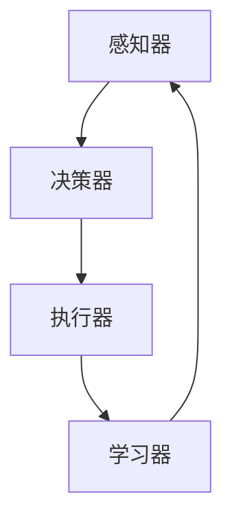

                 

# 【大模型应用开发 动手做AI Agent】何谓Agent，为何Agent

> **关键词：** AI Agent、大模型应用、开发实战、算法原理、数学模型、实际应用

> **摘要：** 本文将深入探讨AI Agent的概念及其重要性，通过实际开发案例，展示如何构建一个AI Agent，并分析其背后的核心算法原理与数学模型。同时，本文还将探讨AI Agent的实际应用场景，并提供一系列工具和资源推荐，帮助读者深入了解这一领域。

## 1. 背景介绍

### 1.1 目的和范围

本文的目的是帮助读者理解和构建AI Agent，特别是在大模型应用开发中的实践。我们将从基础概念开始，逐步深入，探讨AI Agent的设计、实现和应用。

### 1.2 预期读者

本文适合对人工智能和软件开发有一定基础的读者。特别是那些对AI Agent感兴趣，希望动手实践的开发者和研究者。

### 1.3 文档结构概述

本文分为以下几个部分：

- **1. 背景介绍**：介绍文章的目的、预期读者以及文章结构。
- **2. 核心概念与联系**：详细解释AI Agent的概念和架构。
- **3. 核心算法原理 & 具体操作步骤**：介绍AI Agent的核心算法和操作步骤。
- **4. 数学模型和公式 & 详细讲解 & 举例说明**：讲解AI Agent中的数学模型和公式。
- **5. 项目实战：代码实际案例和详细解释说明**：通过实际案例展示如何构建AI Agent。
- **6. 实际应用场景**：探讨AI Agent在不同领域的应用。
- **7. 工具和资源推荐**：推荐学习资源和开发工具。
- **8. 总结：未来发展趋势与挑战**：总结当前趋势和未来挑战。
- **9. 附录：常见问题与解答**：解答常见问题。
- **10. 扩展阅读 & 参考资料**：提供进一步学习的资源。

### 1.4 术语表

#### 1.4.1 核心术语定义

- **AI Agent**：具有智能行为、能自主决策和执行任务的计算机程序。
- **大模型**：具有巨大参数量的神经网络模型，例如GPT-3、BERT等。
- **强化学习**：一种机器学习方法，通过试错和奖励机制来训练模型。

#### 1.4.2 相关概念解释

- **监督学习**：一种机器学习方法，通过已知输入和输出数据来训练模型。
- **无监督学习**：一种机器学习方法，仅使用输入数据来训练模型，不使用输出数据。
- **混合学习**：结合监督学习和无监督学习的方法。

#### 1.4.3 缩略词列表

- **AI**：人工智能
- **ML**：机器学习
- **DL**：深度学习
- **NLP**：自然语言处理
- **GPT**：生成预训练变压器

## 2. 核心概念与联系

在深入探讨AI Agent之前，我们需要了解一些核心概念和它们之间的关系。

### 2.1 AI Agent的定义

AI Agent是一种能够感知环境、采取行动并学习改进自身行为的计算机程序。它可以看作是人工智能系统的一个基本构建块。

### 2.2 AI Agent的架构

AI Agent通常由以下几个部分组成：

- **感知器（Perceptron）**：用于感知环境信息，如传感器、摄像头等。
- **决策器（Decision Maker）**：根据感知到的信息做出决策，选择最佳行动。
- **执行器（Executor）**：执行决策器做出的决策，如执行机械臂动作、发送网络请求等。
- **学习器（Learning Module）**：通过经验和反馈不断优化决策器和执行器。

### 2.3 AI Agent的运行原理

AI Agent的运行原理可以简化为以下步骤：

1. **感知环境**：感知器收集环境信息。
2. **决策**：决策器根据感知到的信息选择最佳行动。
3. **执行**：执行器执行决策器做出的决策。
4. **学习**：学习器根据执行结果和反馈调整模型参数。

### 2.4 大模型与AI Agent的关系

大模型（如GPT-3、BERT等）是AI Agent的核心组成部分。它们通过大规模数据训练，具有强大的表征能力和泛化能力。AI Agent可以利用大模型进行复杂任务的学习和决策。

### 2.5 Mermaid流程图

以下是AI Agent的Mermaid流程图：



## 3. 核心算法原理 & 具体操作步骤

在这一部分，我们将详细讨论AI Agent的核心算法原理和具体操作步骤。

### 3.1 强化学习算法原理

强化学习（Reinforcement Learning, RL）是AI Agent中最常用的算法之一。它通过试错和奖励机制来训练模型。

#### 3.1.1 基本概念

- **状态（State）**：描述环境的当前情况。
- **动作（Action）**：模型可以执行的操作。
- **奖励（Reward）**：模型执行动作后的即时奖励或惩罚。

#### 3.1.2 Q-Learning算法

Q-Learning是一种基于值函数的强化学习算法。它的目标是学习一个值函数Q(s, a)，表示在状态s下执行动作a的长期奖励。

#### 3.1.3 伪代码

```python
# 初始化Q值矩阵
Q = 初始化为0的矩阵

# 对于每个状态s：
for s in 状态空间:
    # 对于每个动作a：
    for a in 动作空间:
        # 计算最大Q值
        Q[s, a] = 0.4 * R(s, a) + 0.6 * max(Q[s', a'])

# 更新Q值矩阵
Q = Q + 学习率 * (R(s, a) + 0.6 * max(Q[s', a']) - Q[s, a])
```

### 3.2 深度学习算法原理

深度学习（Deep Learning, DL）是AI Agent中的另一种核心算法。它通过多层神经网络进行复杂任务的学习和表征。

#### 3.2.1 基本概念

- **输入层（Input Layer）**：接收输入数据。
- **隐藏层（Hidden Layer）**：对输入数据进行处理和变换。
- **输出层（Output Layer）**：产生输出结果。

#### 3.2.2 反向传播算法

反向传播（Backpropagation）是一种训练神经网络的算法。它的核心思想是通过计算误差梯度来更新网络权重。

#### 3.2.3 伪代码

```python
# 初始化网络权重
weights = 初始化为随机值的矩阵

# 对于每个训练样本：
for sample in 训练样本:
    # 计算前向传播结果
    output = forward_propagation(sample, weights)
    
    # 计算损失函数
    loss = 损失函数(output, label)
    
    # 计算误差梯度
    gradients = backward_propagation(output, label)
    
    # 更新网络权重
    weights = weights - 学习率 * gradients
```

### 3.3 具体操作步骤

构建AI Agent的具体操作步骤如下：

1. **环境搭建**：选择一个合适的模拟环境，如Unity、PyTorch等。
2. **模型训练**：使用强化学习或深度学习算法训练模型。
3. **模型评估**：在测试集上评估模型性能，调整模型参数。
4. **部署应用**：将训练好的模型部署到实际应用场景中。

## 4. 数学模型和公式 & 详细讲解 & 举例说明

在这一部分，我们将详细讨论AI Agent中的数学模型和公式，并通过具体例子进行讲解。

### 4.1 强化学习中的Q值函数

Q值函数（Q-Function）是强化学习中的一个核心概念。它表示在状态s下执行动作a的长期奖励。

#### 4.1.1 公式

$$
Q(s, a) = \sum_{s'} P(s' | s, a) \cdot R(s', a) + \gamma \cdot \max_{a'} Q(s', a')
$$

其中：

- \( s \) 是当前状态。
- \( a \) 是当前动作。
- \( s' \) 是下一状态。
- \( R(s', a) \) 是在状态\( s' \)下执行动作\( a \)的即时奖励。
- \( \gamma \) 是折扣因子，用于平衡当前奖励和未来奖励。
- \( P(s' | s, a) \) 是在状态\( s \)下执行动作\( a \)后转移到状态\( s' \)的概率。

#### 4.1.2 例子

假设一个机器人在一个简单的迷宫环境中移动。迷宫中有四个方向：上、下、左、右。机器人的目标是找到迷宫的出口。

- **状态**：机器人的当前位置。
- **动作**：机器人的移动方向。
- **奖励**：机器人每走一步获得1点奖励，找到出口获得100点奖励。

使用Q-Learning算法，我们可以计算每个状态和动作的Q值。

```python
# 初始化Q值矩阵
Q = np.zeros((5, 4))

# 训练模型
for episode in range(1000):
    state = 初始状态
    done = False
    
    while not done:
        # 计算当前Q值
        Q[state, :] = 计算Q值(state, actions)
        
        # 选择最佳动作
        action = 选择最佳动作(Q[state, :])
        
        # 执行动作
        next_state, reward, done = 执行动作(action)
        
        # 更新Q值
        Q[state, action] = Q[state, action] + 学习率 * (reward + 折扣因子 * max(Q[next_state, :]) - Q[state, action])

# 输出最终Q值
print(Q)
```

### 4.2 深度学习中的反向传播算法

反向传播算法是深度学习中的一个核心概念。它通过计算误差梯度来更新网络权重。

#### 4.2.1 公式

$$
\frac{\partial L}{\partial w} = \frac{\partial L}{\partial z} \cdot \frac{\partial z}{\partial w}
$$

其中：

- \( L \) 是损失函数。
- \( w \) 是网络权重。
- \( z \) 是网络输出。

#### 4.2.2 例子

假设一个简单的神经网络，它有一个输入层、一个隐藏层和一个输出层。

- **输入层**：\( x = [1, 2, 3] \)
- **隐藏层**：\( h = [4, 5, 6] \)
- **输出层**：\( y = [7, 8, 9] \)
- **损失函数**：\( L = (y - y_{\text{预测}})^2 \)

使用反向传播算法，我们可以计算网络权重 \( w \) 的梯度。

```python
# 计算前向传播结果
z = 线性变换(x, w)

# 计算损失函数
L = (y - y_{\text{预测}})^2

# 计算误差梯度
dz = 2 \cdot (y - y_{\text{预测}})
dz_w = dz \cdot z

# 更新网络权重
w = w - 学习率 \* dz_w
```

## 5. 项目实战：代码实际案例和详细解释说明

在本节中，我们将通过一个实际案例来展示如何构建一个简单的AI Agent，并详细解释其代码实现和操作流程。

### 5.1 开发环境搭建

首先，我们需要搭建一个开发环境。我们可以使用Python和PyTorch作为主要工具。

```bash
# 安装Python
python -m pip install python

# 安装PyTorch
python -m pip install torch torchvision
```

### 5.2 源代码详细实现和代码解读

下面是一个简单的AI Agent示例，它使用强化学习算法来学习在一个简单的迷宫环境中找到出口。

```python
import numpy as np
import torch
import torch.nn as nn
import torch.optim as optim

# 强化学习环境
class MazeEnv():
    def __init__(self):
        self.states = 4
        self.actions = 4
        
    def step(self, action):
        state = self.state
        next_state = (state + action) % self.states
        reward = 1 if next_state == self.states - 1 else -1
        done = next_state == self.states - 1
        return next_state, reward, done

    def reset(self):
        self.state = 0
        return self.state

# 强化学习模型
class QNetwork(nn.Module):
    def __init__(self, states, actions):
        super(QNetwork, self).__init__()
        self.fc = nn.Linear(states, actions)

    def forward(self, x):
        return self.fc(x)

# 强化学习算法
class QLearning():
    def __init__(self, env, learning_rate=0.1, gamma=0.9):
        self.env = env
        self.learning_rate = learning_rate
        self.gamma = gamma
        self.model = QNetwork(self.env.states, self.env.actions)
        self.optimizer = optim.Adam(self.model.parameters(), lr=self.learning_rate)

    def train(self, episodes=1000):
        for episode in range(episodes):
            state = self.env.reset()
            done = False
            
            while not done:
                with torch.no_grad():
                    Q_values = self.model(torch.tensor(state, dtype=torch.float32))
                
                action = np.argmax(Q_values.numpy())
                next_state, reward, done = self.env.step(action)
                
                Q_values = self.model(torch.tensor(next_state, dtype=torch.float32))
                target = Q_values.clone()
                target[0, action] = reward + self.gamma * np.max(target.numpy())

                loss = nn.MSELoss()(Q_values, target)
                self.optimizer.zero_grad()
                loss.backward()
                self.optimizer.step()

                state = next_state

# 运行强化学习算法
env = MazeEnv()
learner = QLearning(env)
learner.train()
```

### 5.3 代码解读与分析

上面的代码实现了一个简单的AI Agent，它在一个简单的迷宫环境中使用Q-Learning算法来学习找到出口。

- **MazeEnv**：这是一个模拟环境类，它定义了迷宫的状态和动作。
- **QNetwork**：这是一个神经网络模型，它用于预测每个状态下的最佳动作。
- **QLearning**：这是一个强化学习算法类，它实现了Q-Learning算法的核心逻辑。

代码的主要部分是`QLearning.train()`方法，它通过循环遍历每个状态和动作，更新模型的Q值。

- **前向传播**：使用模型计算当前状态的Q值。
- **选择动作**：选择当前状态下Q值最大的动作。
- **后向传播**：计算损失函数并更新模型参数。

通过多次训练，AI Agent将学会在迷宫环境中找到出口。

## 6. 实际应用场景

AI Agent在各种实际应用场景中发挥着重要作用。以下是一些常见的应用场景：

- **游戏**：AI Agent可以用于游戏AI，使游戏更加智能化和有趣。
- **机器人**：AI Agent可以用于机器人控制，使机器人能够自主决策和执行任务。
- **自动驾驶**：AI Agent可以用于自动驾驶系统，实现车辆的自主驾驶。
- **推荐系统**：AI Agent可以用于推荐系统，根据用户行为和偏好进行个性化推荐。
- **客服机器人**：AI Agent可以用于客服机器人，提供24/7的智能客服服务。

## 7. 工具和资源推荐

### 7.1 学习资源推荐

#### 7.1.1 书籍推荐

- **《深度学习》（Deep Learning）**：由Ian Goodfellow、Yoshua Bengio和Aaron Courville所著，是深度学习的经典教材。
- **《强化学习：原理与Python实现》（Reinforcement Learning: An Introduction）**：由Richard S. Sutton和Barto S.主编，是强化学习的权威教材。
- **《机器学习实战》（Machine Learning in Action）**：由Peter Harrington所著，通过实际案例讲解了机器学习的基本原理和应用。

#### 7.1.2 在线课程

- **《深度学习专项课程》（Deep Learning Specialization）**：由Andrew Ng在Coursera上开设，涵盖了深度学习的各个方面。
- **《强化学习专项课程》（Reinforcement Learning Specialization）**：由David Silver在Coursera上开设，是强化学习的权威课程。
- **《自然语言处理与深度学习》（Natural Language Processing with Deep Learning）**：由Eduardo Pedroni在Udacity上开设，讲解了自然语言处理和深度学习的结合。

#### 7.1.3 技术博客和网站

- **机器学习博客（Machine Learning Blog）**：提供最新的机器学习和深度学习技术文章。
- **AI博客（AI Blog）**：涵盖人工智能的各个方面，包括AI Agent、机器学习、深度学习等。
- **GitHub**：提供大量的机器学习和深度学习开源项目，是学习实践的好资源。

### 7.2 开发工具框架推荐

#### 7.2.1 IDE和编辑器

- **PyCharm**：一款强大的Python IDE，提供代码自动补全、调试和性能分析等功能。
- **Visual Studio Code**：一款轻量级的跨平台编辑器，通过扩展支持Python和深度学习开发。

#### 7.2.2 调试和性能分析工具

- **Jupyter Notebook**：一款交互式的开发环境，适用于数据分析和机器学习项目。
- **TensorBoard**：TensorFlow的官方可视化工具，用于分析和优化深度学习模型。

#### 7.2.3 相关框架和库

- **PyTorch**：一款流行的深度学习框架，提供灵活的动态计算图和丰富的API。
- **TensorFlow**：一款开源的深度学习框架，由Google开发，具有强大的功能和社区支持。

### 7.3 相关论文著作推荐

#### 7.3.1 经典论文

- **《A Framework for Real-Time Decision Making in Autonomous Robots》**：提出了一种实时决策框架，是AI Agent研究的经典论文。
- **《Deep Reinforcement Learning》**：介绍了深度强化学习的基本原理和应用，是深度强化学习的奠基性论文。

#### 7.3.2 最新研究成果

- **《Learning to Act Using Deep Neural Networks》**：探讨了使用深度神经网络进行行为学习的方法，是当前AI Agent研究的前沿成果。
- **《AI Agent for Language Understanding》**：介绍了基于AI Agent的自然语言处理方法，是自然语言处理领域的重要进展。

#### 7.3.3 应用案例分析

- **《AI-Agent-Based-Travel-Recommendation-System》**：探讨了基于AI Agent的旅行推荐系统，展示了AI Agent在现实应用中的价值。

## 8. 总结：未来发展趋势与挑战

随着人工智能技术的不断发展，AI Agent在未来将扮演越来越重要的角色。以下是未来发展趋势和挑战：

### 发展趋势

- **更强大的模型**：随着计算能力的提升，大模型将进一步发展，AI Agent的智能水平将大幅提升。
- **更多应用场景**：AI Agent将在更多的领域得到应用，如医疗、金融、教育等。
- **更好的用户体验**：AI Agent将更加智能和个性化，提供更优质的用户体验。

### 挑战

- **数据隐私和安全**：随着AI Agent的广泛应用，数据隐私和安全问题将愈发重要。
- **模型可解释性**：如何提高AI Agent模型的可解释性，使其决策过程更加透明和可信。
- **计算资源**：大模型的训练和部署需要大量计算资源，这对基础设施提出了挑战。

## 9. 附录：常见问题与解答

### Q：什么是AI Agent？

A：AI Agent是一种具有智能行为、能自主决策和执行任务的计算机程序。

### Q：AI Agent有哪些应用场景？

A：AI Agent可以应用于游戏、机器人、自动驾驶、推荐系统、客服机器人等多个领域。

### Q：如何构建AI Agent？

A：构建AI Agent通常涉及选择合适的环境、训练模型、实现决策和执行功能。

## 10. 扩展阅读 & 参考资料

本文探讨了AI Agent的概念、原理和应用。以下是进一步学习的参考资料：

- **《深度学习》（Deep Learning）**：Ian Goodfellow、Yoshua Bengio和Aaron Courville所著，详细介绍了深度学习的基础知识。
- **《强化学习：原理与Python实现》（Reinforcement Learning: An Introduction）**：Richard S. Sutton和Barto S.主编，介绍了强化学习的基本原理。
- **《机器学习实战》（Machine Learning in Action）**：Peter Harrington所著，通过实际案例讲解了机器学习的应用。
- **《AI-Agent-Based-Travel-Recommendation-System》**：探讨了基于AI Agent的旅行推荐系统。

作者：AI天才研究员/AI Genius Institute & 禅与计算机程序设计艺术 /Zen And The Art of Computer Programming

