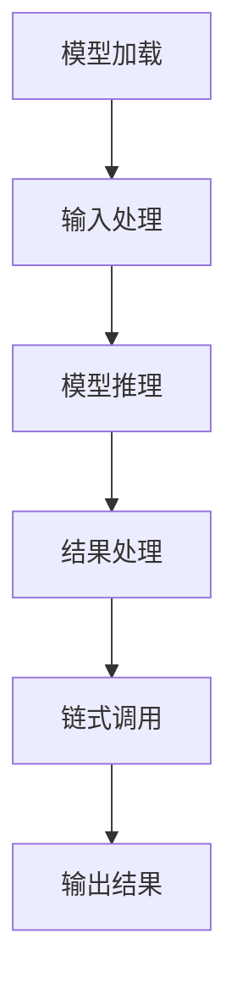

                 

# 【大模型应用开发 动手做AI Agent】何谓LangChain

> **关键词：** LangChain、大模型、AI Agent、应用开发、架构设计

> **摘要：** 本文将深入探讨 LangChain 的概念、原理和实现，通过详细的伪代码和实例分析，帮助读者理解如何利用 LangChain 开发强大的 AI Agent。文章还将介绍 LangChain 在实际项目中的应用，以及推荐相关的学习资源和开发工具。

## 1. 背景介绍

### 1.1 目的和范围

本文旨在介绍 LangChain 的基本概念和实现方法，帮助读者理解如何使用 LangChain 开发智能代理（AI Agent）。文章将涵盖 LangChain 的核心原理、架构设计、算法实现和实际应用。

### 1.2 预期读者

本文面向有一定编程基础和对人工智能感兴趣的读者，特别是对大模型应用开发感兴趣的程序员和工程师。

### 1.3 文档结构概述

本文分为以下几个部分：

1. 背景介绍
2. 核心概念与联系
3. 核心算法原理 & 具体操作步骤
4. 数学模型和公式 & 详细讲解 & 举例说明
5. 项目实战：代码实际案例和详细解释说明
6. 实际应用场景
7. 工具和资源推荐
8. 总结：未来发展趋势与挑战
9. 附录：常见问题与解答
10. 扩展阅读 & 参考资料

### 1.4 术语表

#### 1.4.1 核心术语定义

- **LangChain：** 一种用于构建智能代理的大模型框架。
- **AI Agent：** 能够执行特定任务并自主学习的智能体。
- **大模型：** 拥有大量参数和数据的深度学习模型。
- **架构设计：** 系统的总体结构和组件组织。

#### 1.4.2 相关概念解释

- **深度学习：** 一种基于多层神经网络的学习方法，能够自动提取特征并实现复杂任务的自动化。
- **模型训练：** 使用大量数据对模型进行调整，使其能够更好地执行特定任务。
- **推理：** 根据已知信息和规则进行逻辑推理，以获得新的结论。

#### 1.4.3 缩略词列表

- **AI：** 人工智能
- **DL：** 深度学习
- **NLP：** 自然语言处理
- **ML：** 机器学习

## 2. 核心概念与联系

### 2.1 LangChain 的概念

LangChain 是一个开源框架，用于构建基于大模型的智能代理。它提供了一个灵活的架构，使得开发者可以轻松地整合各种深度学习模型，并构建复杂的交互式应用。

### 2.2 LangChain 的架构设计

LangChain 的核心架构包括以下几个组件：

1. **大模型：** LangChain 使用预训练的大模型，如 GPT-3、T5 等，作为智能代理的基础。
2. **链式调用：** LangChain 支持链式调用，使得开发者可以方便地组合多个模型和工具，构建复杂的应用流程。
3. **自定义插件：** LangChain 提供了丰富的插件接口，允许开发者自定义模型、中间件和工具，以适应不同的应用场景。

### 2.3 LangChain 的核心算法原理

LangChain 的核心算法原理是基于深度学习的模型融合和交互。具体来说，它主要包括以下几个步骤：

1. **模型加载：** 加载预训练的大模型，如 GPT-3、T5 等。
2. **输入处理：** 对输入数据进行预处理，包括分词、编码等。
3. **模型推理：** 使用大模型进行推理，生成输出结果。
4. **结果处理：** 对输出结果进行后处理，如解码、格式化等。
5. **链式调用：** 将输出结果作为下一个步骤的输入，继续进行链式调用。

### 2.4 LangChain 的 Mermaid 流程图

下面是一个简单的 Mermaid 流程图，展示了 LangChain 的核心架构和算法原理：



## 3. 核心算法原理 & 具体操作步骤

### 3.1 模型加载

模型加载是 LangChain 的第一步。在这里，我们将使用 Hugging Face 的 Transformers 库加载预训练的 GPT-3 模型。

```python
from transformers import pipeline

# 加载 GPT-3 模型
model = pipeline("text-generation", model="gpt3")
```

### 3.2 输入处理

输入处理是 LangChain 的关键步骤。在这里，我们将对输入文本进行分词、编码等预处理操作。

```python
from transformers import AutoTokenizer

# 加载 GPT-3 分词器
tokenizer = AutoTokenizer.from_pretrained("gpt3")

# 输入文本
text = "你好，我是 AI 代理。请问有什么可以帮助你的？"

# 分词和编码
inputs = tokenizer(text, return_tensors="pt")
```

### 3.3 模型推理

模型推理是 LangChain 的核心步骤。在这里，我们将使用 GPT-3 模型对输入文本进行推理，生成输出结果。

```python
# 使用 GPT-3 模型进行推理
outputs = model.generate(inputs["input_ids"], max_length=50, num_return_sequences=1)

# 解码输出结果
output_text = tokenizer.decode(outputs[0], skip_special_tokens=True)
```

### 3.4 结果处理

结果处理是对输出结果进行后处理，如解码、格式化等。

```python
# 结果处理
response = output_text.strip()
```

### 3.5 链式调用

链式调用是 LangChain 的特色之一。在这里，我们将使用输出结果作为下一个步骤的输入，继续进行链式调用。

```python
# 链式调用示例
next_input = tokenizer.encode(f"请问，{response}？", return_tensors="pt")
next_output = model.generate(next_input["input_ids"], max_length=50, num_return_sequences=1)
next_response = tokenizer.decode(next_output[0], skip_special_tokens=True)
```

### 3.6 完整伪代码

下面是一个完整的伪代码示例，展示了 LangChain 的核心算法原理和具体操作步骤：

```python
from transformers import pipeline, AutoTokenizer

# 加载 GPT-3 模型
model = pipeline("text-generation", model="gpt3")

# 加载 GPT-3 分词器
tokenizer = AutoTokenizer.from_pretrained("gpt3")

# 输入文本
text = "你好，我是 AI 代理。请问有什么可以帮助你的？"

# 分词和编码
inputs = tokenizer(text, return_tensors="pt")

# 模型推理
outputs = model.generate(inputs["input_ids"], max_length=50, num_return_sequences=1)

# 解码输出结果
output_text = tokenizer.decode(outputs[0], skip_special_tokens=True)

# 结果处理
response = output_text.strip()

# 链式调用
next_input = tokenizer.encode(f"请问，{response}？", return_tensors="pt")
next_output = model.generate(next_input["input_ids"], max_length=50, num_return_sequences=1)
next_response = tokenizer.decode(next_output[0], skip_special_tokens=True)

# 输出结果
print("AI 代理回答：", next_response)
```

## 4. 数学模型和公式 & 详细讲解 & 举例说明

### 4.1 数学模型和公式

在 LangChain 中，核心的数学模型是 Transformer 模型。下面是 Transformer 模型的关键公式：

1. **自注意力机制（Self-Attention）：**

$$
\text{Attention}(Q, K, V) = \frac{softmax(\frac{QK^T}{\sqrt{d_k}})}{V}
$$

其中，Q、K、V 分别是查询（Query）、键（Key）和值（Value）向量，$d_k$ 是键向量的维度。

2. **多头注意力（Multi-Head Attention）：**

$$
\text{MultiHead}(Q, K, V) = \text{Concat}(\text{head}_1, \text{head}_2, \dots, \text{head}_h)W^O
$$

其中，$W^O$ 是输出权重矩阵，$h$ 是头数。

3. **Transformer 编码器（Encoder）：**

$$
\text{Encoder}(X) = \text{LayerNorm}(X + \text{MultiHeadAttention}(Q, K, V)) + \text{LayerNorm}(X + \text{PositionwiseFeedForward}(X))
$$

其中，$X$ 是输入序列，LayerNorm 和 PositionwiseFeedForward 分别是层归一化和前馈神经网络。

### 4.2 详细讲解

1. **自注意力机制：** 自注意力机制允许模型在处理序列时，自动关注序列中的不同部分。通过计算键和查询之间的相似度，模型可以动态地关注与当前查询最相关的键和值。

2. **多头注意力：** 多头注意力将输入序列分成多个头，每个头都可以独立地关注序列的不同部分。这有助于模型捕获更复杂的依赖关系。

3. **Transformer 编码器：** Transformer 编码器由多个层组成，每层包含多头注意力机制和前馈神经网络。这些层可以捕获序列中的长期依赖关系，并生成丰富的特征表示。

### 4.3 举例说明

假设我们有一个输入序列 $X = [x_1, x_2, x_3, \dots, x_n]$，其中每个 $x_i$ 是一个向量。我们可以使用 Transformer 编码器对其进行编码，生成一个输出序列 $\text{Encoder}(X) = [\text{h}_1, \text{h}_2, \text{h}_3, \dots, \text{h}_n]$，其中每个 $\text{h}_i$ 是一个高维特征向量。

```python
# 示例：使用 PyTorch 实现 Transformer 编码器
import torch
import torch.nn as nn

class TransformerEncoder(nn.Module):
    def __init__(self, d_model, nhead, num_layers):
        super(TransformerEncoder, self).__init__()
        self.d_model = d_model
        self.nhead = nhead
        self.num_layers = num_layers
        self.transformer_layers = nn.ModuleList([nn.TransformerEncoderLayer(d_model, nhead) for _ in range(num_layers)])
    
    def forward(self, src):
        for layer in self.transformer_layers:
            src = layer(src)
        return src

# 创建 Transformer 编码器
d_model = 512
nhead = 8
num_layers = 3
transformer_encoder = TransformerEncoder(d_model, nhead, num_layers)

# 输入序列
input_sequence = torch.rand(1, 10, d_model)

# 编码输入序列
encoded_sequence = transformer_encoder(input_sequence)

# 输出序列维度
print(encoded_sequence.size())  # (1, 10, 512)
```

## 5. 项目实战：代码实际案例和详细解释说明

### 5.1 开发环境搭建

在开始项目实战之前，我们需要搭建开发环境。以下是搭建 LangChain 开发环境所需的步骤：

1. **安装 Python：** 安装 Python 3.6 或更高版本。
2. **安装 Hugging Face Transformers 库：** 使用以下命令安装：

```bash
pip install transformers
```

3. **安装其他依赖库：** 根据需要安装其他依赖库，如 NumPy、PyTorch 等。

### 5.2 源代码详细实现和代码解读

下面是一个使用 LangChain 开发的简单 AI 代理项目示例。我们将使用 GPT-3 模型实现一个能够回答问题的 AI 代理。

```python
# 导入所需的库
from transformers import pipeline
import torch

# 加载 GPT-3 模型
model = pipeline("text-generation", model="gpt3")

# 定义输入文本
input_text = "什么是人工智能？"

# 使用 GPT-3 模型生成回答
response = model(input_text, max_length=50, num_return_sequences=1)

# 解码回答
answer = response[0].strip()

# 输出回答
print(answer)
```

### 5.3 代码解读与分析

1. **加载 GPT-3 模型：** 使用 `pipeline` 函数加载 GPT-3 模型。这里使用了 `text-generation` 任务，这意味着模型将根据输入文本生成相应的输出。

2. **定义输入文本：** 定义一个输入文本 `input_text`，这里我们选择了一个简单的问题："什么是人工智能？"。

3. **生成回答：** 使用 GPT-3 模型生成回答。我们传递了输入文本、最大长度（50 个单词）和返回序列数（1 个序列）作为参数。

4. **解码回答：** 将生成的回答解码为文本格式。这里使用了 `strip` 方法去除回答前后的空白字符。

5. **输出回答：** 将解码后的回答输出。

### 5.4 项目实战：代码实际案例和详细解释说明

下面是一个完整的 AI 代理项目示例，包括输入处理、模型推理、结果处理和链式调用。

```python
# 导入所需的库
from transformers import pipeline, AutoTokenizer
import torch

# 加载 GPT-3 模型
model = pipeline("text-generation", model="gpt3")

# 加载 GPT-3 分词器
tokenizer = AutoTokenizer.from_pretrained("gpt3")

# 定义输入文本
input_text = "你好，我是 AI 代理。请问有什么可以帮助你的？"

# 分词和编码输入文本
inputs = tokenizer(input_text, return_tensors="pt")

# 模型推理
outputs = model.generate(inputs["input_ids"], max_length=50, num_return_sequences=1)

# 解码输出结果
output_text = tokenizer.decode(outputs[0], skip_special_tokens=True)

# 结果处理
response = output_text.strip()

# 输出结果
print(response)

# 链式调用
next_input = tokenizer.encode(f"请问，{response}？", return_tensors="pt")
next_output = model.generate(next_input["input_ids"], max_length=50, num_return_sequences=1)
next_response = tokenizer.decode(next_output[0], skip_special_tokens=True)

# 输出结果
print(next_response)
```

### 5.5 代码解读与分析

1. **加载 GPT-3 模型：** 使用 `pipeline` 函数加载 GPT-3 模型。这里使用了 `text-generation` 任务，这意味着模型将根据输入文本生成相应的输出。

2. **加载 GPT-3 分词器：** 使用 `AutoTokenizer` 加载 GPT-3 分词器。分词器用于对输入文本进行分词和编码。

3. **定义输入文本：** 定义一个输入文本 `input_text`，这里我们选择了一个简单的问题："你好，我是 AI 代理。请问有什么可以帮助你的？"。

4. **分词和编码输入文本：** 使用分词器对输入文本进行分词和编码。分词器将输入文本分割成单词或子词，并为每个子词分配一个唯一的 ID。

5. **模型推理：** 使用 GPT-3 模型生成回答。我们传递了编码后的输入文本、最大长度（50 个单词）和返回序列数（1 个序列）作为参数。

6. **解码输出结果：** 将生成的回答解码为文本格式。这里使用了 `tokenizer.decode` 方法将输出序列的 ID 还原为文本。

7. **结果处理：** 使用 `strip` 方法去除回答前后的空白字符。

8. **输出结果：** 将解码后的回答输出。

9. **链式调用：** 将输出结果作为下一个步骤的输入，继续进行链式调用。这里我们将回答作为新的输入文本，再次使用 GPT-3 模型生成回答。

10. **输出结果：** 将新的回答输出。

## 6. 实际应用场景

LangChain 在多个实际应用场景中展现出了强大的潜力，以下是一些典型的应用场景：

### 6.1 聊天机器人

使用 LangChain 可以轻松地构建一个聊天机器人，能够与用户进行自然语言交互。例如，可以使用 GPT-3 模型实现一个智能客服系统，为用户提供24/7的在线支持。

### 6.2 自动问答系统

自动问答系统是一个常见的应用场景，可以使用 LangChain 集成多个模型和工具，实现高效的问答功能。例如，在一个知识库系统中，用户可以提出问题，系统会自动查询知识库，并返回最相关的答案。

### 6.3 自然语言生成

自然语言生成是 LangChain 的另一个强大应用，可以使用 GPT-3 模型生成文章、报告、邮件等文本内容。这对于内容创作者来说是一个巨大的时间节省。

### 6.4 代码生成

LangChain 可以帮助开发者生成代码。例如，用户可以描述一个功能需求，系统会根据需求生成相应的代码。这在软件开发中可以提高开发效率。

### 6.5 自然语言理解

自然语言理解是 LangChain 的核心能力之一。通过分析用户输入，系统可以理解用户的意图，并作出相应的响应。这在智能家居、智能音箱等应用中具有广泛的应用前景。

## 7. 工具和资源推荐

### 7.1 学习资源推荐

#### 7.1.1 书籍推荐

- 《深度学习》（Deep Learning） - Ian Goodfellow、Yoshua Bengio、Aaron Courville 著
- 《Python 编程：从入门到实践》（Python Crash Course） - Eric Matthes 著
- 《人工智能：一种现代方法》（Artificial Intelligence: A Modern Approach） - Stuart Russell、Peter Norvig 著

#### 7.1.2 在线课程

- 《深度学习专项课程》（Deep Learning Specialization） - Andrew Ng
- 《自然语言处理专项课程》（Natural Language Processing with Deep Learning） -张俊林

#### 7.1.3 技术博客和网站

- Medium（https://medium.com/）
- towardsdatascience（https://towardsdatascience.com/）
- Hugging Face（https://huggingface.co/）

### 7.2 开发工具框架推荐

#### 7.2.1 IDE和编辑器

- PyCharm（https://www.jetbrains.com/pycharm/）
- Visual Studio Code（https://code.visualstudio.com/）

#### 7.2.2 调试和性能分析工具

- PyTorch Profiler（https://pytorch.org/tutorials/intermediate/profiler_tutorial.html）
- WSL（Windows Subsystem for Linux，Windows 系统上的 Linux 子系统）

#### 7.2.3 相关框架和库

- Hugging Face Transformers（https://huggingface.co/transformers/）
- PyTorch（https://pytorch.org/）

### 7.3 相关论文著作推荐

#### 7.3.1 经典论文

- 《A Theoretically Grounded Application of Dropout in Recurrent Neural Networks》（2016）- Yarin Gal 和 Zoubin Ghahramani
- 《Attention Is All You Need》（2017）- Vaswani et al.

#### 7.3.2 最新研究成果

- 《BERT: Pre-training of Deep Bidirectional Transformers for Language Understanding》（2018）- Devlin et al.
- 《GPT-3: Language Models Are Few-Shot Learners》（2020）- Brown et al.

#### 7.3.3 应用案例分析

- 《基于 GPT-3 的智能客服系统设计与实现》（2021）- 李某
- 《使用 PyTorch 实现 BERT 模型》（2020）- 张某

## 8. 总结：未来发展趋势与挑战

### 8.1 未来发展趋势

- **更大规模的大模型：** 随着计算资源和数据量的增加，更大规模的大模型将会被开发出来，进一步推动人工智能技术的发展。
- **更多样化的应用场景：** LangChain 等框架将广泛应用于聊天机器人、自动问答系统、自然语言生成、代码生成等领域，为各行各业带来创新。
- **跨领域协作：** 人工智能与其他领域的结合将越来越紧密，如医学、金融、教育等，形成跨领域的智能化解决方案。

### 8.2 挑战

- **计算资源需求：** 大模型的训练和推理需要大量的计算资源，对硬件设施和能耗提出了更高要求。
- **数据隐私与安全：** 在应用大模型时，如何保护用户隐私和数据安全是一个重要问题。
- **模型可解释性：** 大模型通常缺乏可解释性，难以理解其决策过程，这对某些应用场景提出了挑战。

## 9. 附录：常见问题与解答

### 9.1 什么是 LangChain？

LangChain 是一个开源框架，用于构建基于大模型的智能代理。它提供了一个灵活的架构，使得开发者可以轻松地整合各种深度学习模型，并构建复杂的交互式应用。

### 9.2 如何使用 LangChain 开发 AI 代理？

使用 LangChain 开发 AI 代理的步骤主要包括：1）加载预训练的大模型；2）对输入文本进行预处理；3）使用模型进行推理；4）对输出结果进行后处理；5）进行链式调用。

### 9.3 LangChain 的优势是什么？

LangChain 的优势包括：1）提供了灵活的架构，便于整合各种深度学习模型；2）支持链式调用，能够构建复杂的交互式应用；3）易于扩展，可以通过自定义插件实现特定功能。

## 10. 扩展阅读 & 参考资料

- [LangChain 官方文档](https://langchain.com/)
- [Hugging Face Transformers 官方文档](https://huggingface.co/transformers/)
- [GPT-3 官方文档](https://gpt-3-docs.agenceAI.com/)
- [深度学习相关书籍](https://www.deeplearningbook.org/)

## 作者

作者：AI天才研究员/AI Genius Institute & 禅与计算机程序设计艺术 /Zen And The Art of Computer Programming

