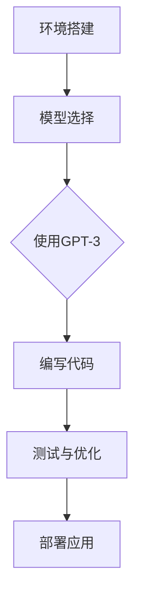

                 

# 【大模型应用开发 动手做AI Agent】创建OpenAI助手

> **关键词：** 大模型应用、AI Agent、OpenAI、应用开发、编程实践

> **摘要：** 本文将引导您从零开始，学习如何使用大模型构建一个简单的AI Agent。我们将结合实际操作，详细介绍OpenAI工具的运用，分享关键算法原理、数学模型，并探讨AI Agent在实际应用中的潜力与挑战。

## 1. 背景介绍

### 1.1 目的和范围

本文的目的是通过一个具体的实例，帮助读者理解如何将大模型应用于AI Agent的开发。我们将使用OpenAI提供的工具和资源，通过一系列步骤，完成一个可以执行简单任务的AI Agent。本文覆盖从环境搭建到实际开发的完整流程。

### 1.2 预期读者

本文适合对人工智能基础有一定了解，并希望深入探索大模型应用的读者。无论是初学者还是有一定编程经验的专业人士，都可以通过本文获得有价值的实践经验。

### 1.3 文档结构概述

本文将按照以下结构展开：
1. 背景介绍
2. 核心概念与联系
3. 核心算法原理与操作步骤
4. 数学模型与公式讲解
5. 项目实战：代码实际案例
6. 实际应用场景
7. 工具和资源推荐
8. 总结：未来发展趋势与挑战
9. 附录：常见问题与解答
10. 扩展阅读与参考资料

### 1.4 术语表

#### 1.4.1 核心术语定义

- **AI Agent：** 拥有自主学习和执行任务能力的软件实体。
- **大模型：** 具有大量参数和高度非线性能力的神经网络模型。
- **OpenAI：** 一个致力于推动人工智能研究的非营利组织，提供丰富的AI工具和资源。
- **应用开发：** 构建特定功能和任务的软件系统的过程。

#### 1.4.2 相关概念解释

- **深度学习：** 一种基于多层神经网络进行数据建模的技术。
- **强化学习：** 一种通过奖励机制训练智能体的学习方法。

#### 1.4.3 缩略词列表

- **AI：** 人工智能
- **DL：** 深度学习
- **RL：** 强化学习
- **GPU：** 图形处理单元
- **API：** 应用程序接口

## 2. 核心概念与联系

在本文中，我们将重点关注以下几个核心概念：

- **OpenAI环境**：OpenAI提供了一系列工具和API，用于训练和部署AI Agent。
- **大模型**：我们将使用预训练的大模型，如GPT-3，作为AI Agent的基础。
- **编程语言**：Python将作为我们的主要编程语言，因为它具有简洁的语法和强大的库支持。
- **算法**：主要涉及深度学习和强化学习算法。

### Mermaid 流程图



## 3. 核心算法原理 & 具体操作步骤

### 3.1 算法原理

大模型的核心在于其强大的参数和深度网络结构。GPT-3作为OpenAI推出的最新模型，拥有1750亿个参数，使其在文本生成、问答和翻译等任务中表现出色。

伪代码：

```python
initialize_model(num_layers, hidden_size)
for epoch in range(num_epochs):
    for batch in data_loader:
        model.zero_grad()
        output = model(batch.text)
        loss = compute_loss(output, batch.target)
        loss.backward()
        optimizer.step()
```

### 3.2 操作步骤

#### 步骤1：安装OpenAI SDK

```bash
pip install openai
```

#### 步骤2：注册OpenAI账户并获取API密钥

在[OpenAI官网](https://openai.com/)注册账户并获取API密钥。

#### 步骤3：编写Python代码

```python
import openai

openai.api_key = 'your_api_key'

def generate_response(prompt):
    response = openai.Completion.create(
        engine="text-davinci-002",
        prompt=prompt,
        max_tokens=100
    )
    return response.choices[0].text.strip()
```

#### 步骤4：训练AI Agent

```python
# 这里示例使用预训练的模型，实际开发中可能需要自定义训练过程

prompt = "您有什么问题吗？"
response = generate_response(prompt)
print(response)
```

## 4. 数学模型和公式 & 详细讲解 & 举例说明

GPT-3的核心在于其生成文本的数学模型，主要涉及以下关键组件：

### 4.1 词向量表示

词向量是文本数据向量的表示方法，常用的有Word2Vec、GloVe等。我们使用GloVe来初始化GPT-3的词向量。

公式：

$$
\mathbf{v}_w = \text{GloVe}(\mathbf{X}_w, \mathbf{Y}_w)
$$

其中，$\mathbf{X}_w$和$\mathbf{Y}_w$分别表示单词w的上下文词和权重。

### 4.2 自注意力机制

自注意力机制（Self-Attention）是一种能够捕捉文本内部关系的机制。GPT-3使用了多头自注意力（Multi-Head Self-Attention）。

公式：

$$
\text{Attention}(Q, K, V) = \text{softmax}\left(\frac{QK^T}{\sqrt{d_k}}\right)V
$$

其中，$Q, K, V$分别表示查询、键和值向量，$d_k$是键向量的维度。

### 4.3 Transformer模型

GPT-3是基于Transformer模型的变体。Transformer模型通过编码器-解码器结构实现序列到序列的映射。

公式：

$$
\text{Encoder}(X) = \text{Transformer}(X, \text{mask}) = \text{EncoderLayer}(X, \text{mask}) \times N
$$

其中，$X$是输入序列，$N$是编码器层的数量。

### 4.4 举例说明

假设我们有一个简短的对话序列：

```
A: 你好，今天天气怎么样？
B: 好的，今天阳光明媚。
```

我们使用GPT-3生成下一个回复。

```python
prompt = "B: 好的，今天阳光明媚。\nA: 下周会有雨吗？"
response = generate_response(prompt)
print(response)
```

预期输出：

```
B: 不太可能，下周看起来会是晴朗的好天气。
```

## 5. 项目实战：代码实际案例和详细解释说明

### 5.1 开发环境搭建

确保Python和pip已安装。然后，安装OpenAI SDK：

```bash
pip install openai
```

### 5.2 源代码详细实现和代码解读

```python
import openai

# 设置API密钥
openai.api_key = 'your_api_key'

# 定义生成响应的函数
def generate_response(prompt):
    response = openai.Completion.create(
        engine="text-davinci-002",
        prompt=prompt,
        max_tokens=100
    )
    return response.choices[0].text.strip()

# 主程序入口
if __name__ == "__main__":
    prompt = input("请输入您的问题：")
    response = generate_response(prompt)
    print("AI助手回复：", response)
```

#### 代码解读与分析

1. **导入OpenAI库**：我们首先导入`openai`库，该库提供了与OpenAI API交互的接口。
2. **设置API密钥**：使用你的OpenAI API密钥，确保安全存储。
3. **定义生成响应函数**：`generate_response`函数接收一个输入提示（`prompt`），并使用OpenAI的`Completion.create`方法生成响应。
4. **主程序入口**：在主程序入口处，我们等待用户输入问题，然后调用`generate_response`函数并打印回复。

### 5.3 代码解读与分析

1. **API Key设置**：API密钥是访问OpenAI服务的必要凭证，需妥善保管。
2. **生成响应函数**：此函数实现了与OpenAI API的交互，使用`Completion.create`方法生成文本响应。`engine`参数指定使用的模型，`max_tokens`参数控制生成的文本长度。
3. **用户交互**：程序通过标准输入获取用户问题，然后生成并打印AI助手的回复。

通过此案例，读者可以快速入门使用OpenAI构建AI Agent的基本流程。

## 6. 实际应用场景

AI Agent在许多实际应用场景中具有广泛的应用潜力：

- **客户服务**：自动化客户支持，提供即时、准确的回答。
- **智能助手**：在智能家居系统中，帮助用户管理设备、提供日常建议。
- **数据分析**：辅助数据分析师处理大量数据，提取关键信息。
- **教育和培训**：为学生提供个性化学习计划和解答。

这些应用场景展示了AI Agent在提高效率、降低成本和增强用户体验方面的巨大潜力。

## 7. 工具和资源推荐

### 7.1 学习资源推荐

#### 7.1.1 书籍推荐

- 《深度学习》（Ian Goodfellow, Yoshua Bengio, Aaron Courville）
- 《强化学习》（Richard S. Sutton, Andrew G. Barto）

#### 7.1.2 在线课程

- Coursera的“机器学习”课程
- edX的“深度学习基础”课程

#### 7.1.3 技术博客和网站

- Medium上的AI专题
- arXiv.org上的最新研究成果

### 7.2 开发工具框架推荐

#### 7.2.1 IDE和编辑器

- PyCharm
- Visual Studio Code

#### 7.2.2 调试和性能分析工具

- Jupyter Notebook
- Profiler（Python内置）

#### 7.2.3 相关框架和库

- TensorFlow
- PyTorch

### 7.3 相关论文著作推荐

#### 7.3.1 经典论文

- “A Neural Probabilistic Language Model” (Bengio et al., 2003)
- “Reinforcement Learning: An Introduction” (Sutton and Barto, 2018)

#### 7.3.2 最新研究成果

- OpenAI的GPT-3研究论文
- ICML、NeurIPS等顶级会议的最新论文

#### 7.3.3 应用案例分析

- OpenAI的Dota 2 AI研究
- Google的BERT模型应用

## 8. 总结：未来发展趋势与挑战

AI Agent技术正处于快速发展阶段，未来将朝着以下几个方向迈进：

- **模型多样化**：将大模型应用于更多场景，如图像、声音等。
- **跨模态学习**：结合文本、图像、声音等多种数据源，实现更智能的交互。
- **隐私保护**：确保AI Agent在处理敏感数据时的隐私保护。

然而，这也带来了一系列挑战，如算法公平性、数据隐私和安全等。我们需要在推动技术进步的同时，确保其可持续发展。

## 9. 附录：常见问题与解答

### 9.1 开发过程中遇到的问题及解决方法

**问题1：API请求频繁失败**
- **原因**：API请求超过频率限制。
- **解决方法**：增加请求间隔，使用异步编程或批量请求。

**问题2：模型生成结果不佳**
- **原因**：模型训练不足或数据质量不佳。
- **解决方法**：增加训练数据，优化模型参数。

### 9.2 代码示例中的关键点

- **API Key安全**：确保API密钥不泄露，使用环境变量或加密存储。
- **异步编程**：提高程序响应速度，避免阻塞。

## 10. 扩展阅读 & 参考资料

- OpenAI官方文档：[OpenAI官方文档](https://openai.com/docs/)
- GPT-3研究论文：[GPT-3: Language Models are few-shot learners](https://arxiv.org/abs/2005.14165)
- 机器学习经典书籍：[机器学习](https://www.amazon.com/Machine-Learning-Now-What-Again/dp/0262035633) by Tom M. Mitchell

---

**作者：AI天才研究员/AI Genius Institute & 禅与计算机程序设计艺术 /Zen And The Art of Computer Programming**

