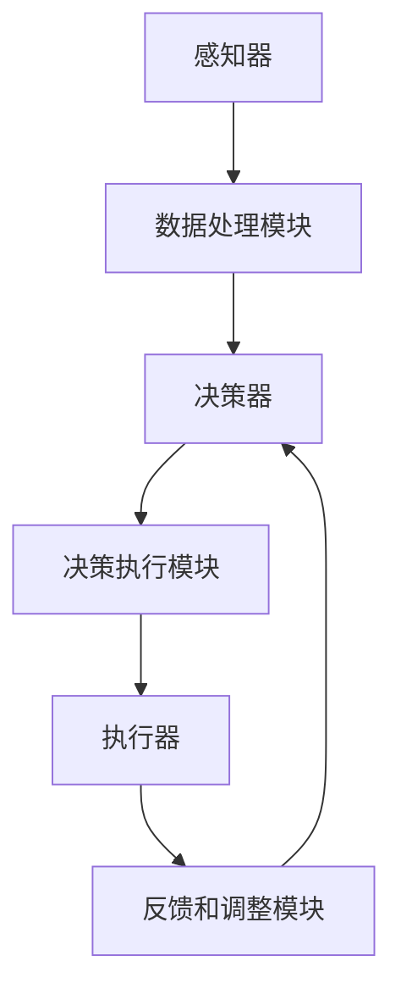

                 


# 【大模型应用开发 动手做AI Agent】深挖AgentExecutor的运行机制

> 关键词：大模型应用，AI Agent，AgentExecutor，运行机制，应用开发，编程实践

> 摘要：本文将深入探讨大模型应用开发中至关重要的AI Agent及其核心执行模块——AgentExecutor。我们将通过逐步分析其原理、架构和运行机制，展示如何动手实现一个AI Agent，并深入探讨其实际应用场景。通过本文的阅读，读者将能够掌握AI Agent的开发技巧，并为未来在大模型应用开发中的实践打下坚实基础。

## 1. 背景介绍

### 1.1 目的和范围

本文旨在深入分析AI Agent及其核心执行模块——AgentExecutor的运行机制。通过详细阐述其原理和实现步骤，我们希望能够帮助读者理解AI Agent在大模型应用开发中的重要性，并掌握其开发技巧。本文将覆盖以下内容：

1. AI Agent的定义和作用
2. AgentExecutor的核心概念与架构
3. AgentExecutor的运行机制
4. 实际应用案例和实战经验
5. 未来发展趋势与挑战

### 1.2 预期读者

本文适合对人工智能和软件开发有一定基础的读者，特别是希望深入了解大模型应用开发的程序员、软件工程师和技术专家。通过本文的阅读，读者将能够：

1. 理解AI Agent的概念及其在大模型应用中的作用
2. 掌握AgentExecutor的核心原理和架构
3. 掌握AI Agent的开发方法和技巧
4. 分析并解决实际应用中的问题
5. 为未来在大模型应用开发中的实践提供指导

### 1.3 文档结构概述

本文分为八个部分：

1. 背景介绍：介绍文章的目的、范围、预期读者和文档结构。
2. 核心概念与联系：阐述AI Agent和AgentExecutor的核心概念和架构。
3. 核心算法原理 & 具体操作步骤：详细讲解AgentExecutor的算法原理和操作步骤。
4. 数学模型和公式 & 详细讲解 & 举例说明：介绍与AgentExecutor相关的数学模型和公式，并给出具体例子。
5. 项目实战：通过实际案例展示AI Agent的开发和实现过程。
6. 实际应用场景：分析AI Agent在实际应用中的场景和挑战。
7. 工具和资源推荐：推荐学习资源、开发工具和框架。
8. 总结：总结文章的主要观点，探讨未来发展趋势与挑战。

### 1.4 术语表

#### 1.4.1 核心术语定义

- AI Agent：具有自主决策和行动能力的智能体，能够根据环境信息和目标自主完成任务。
- AgentExecutor：AI Agent的核心执行模块，负责执行任务、处理数据和与外部环境交互。
- 大模型应用：基于大型预训练模型的应用，如自然语言处理、计算机视觉等。

#### 1.4.2 相关概念解释

- 预训练模型：在大量数据集上预先训练的模型，可用于迁移学习，提高模型在特定任务上的表现。
- 迁移学习：将预训练模型的知识迁移到新的任务上，减少训练数据和计算资源的需求。
- 交互式学习：通过与用户的交互，不断学习和优化模型，提高模型在特定任务上的表现。

#### 1.4.3 缩略词列表

- AI：人工智能
- Agent：智能体
- AgentExecutor：执行模块
- NLP：自然语言处理
- CV：计算机视觉
- DL：深度学习
- ML：机器学习

## 2. 核心概念与联系

在大模型应用开发中，AI Agent和AgentExecutor是两个核心概念。它们之间紧密相连，共同构成了大模型应用的核心架构。下面，我们将详细阐述这些核心概念和它们之间的联系。

### 2.1 AI Agent的概念

AI Agent是一种具有自主决策和行动能力的智能体。它能够根据环境信息和目标，自主选择合适的动作，以实现预定的目标。AI Agent通常由以下几个部分组成：

1. **感知器**：用于感知外部环境的信息，如传感器、摄像头等。
2. **决策器**：根据感知到的环境信息和预定的目标，生成相应的行动策略。
3. **执行器**：执行决策器生成的行动策略，实现具体的任务。
4. **记忆器**：记录历史决策和执行信息，用于优化和调整后续的决策。

AI Agent在多个领域都有广泛的应用，如智能客服、自动驾驶、智能家居等。通过感知、决策和执行，AI Agent能够自主地适应复杂环境，实现高效的任务执行。

### 2.2 AgentExecutor的概念

AgentExecutor是AI Agent的核心执行模块，负责执行任务、处理数据和与外部环境交互。它通常由以下几个部分组成：

1. **任务调度器**：根据任务优先级和资源情况，调度任务执行。
2. **数据处理模块**：处理感知到的数据，提取关键信息。
3. **决策执行模块**：根据决策器生成的行动策略，执行具体的任务。
4. **反馈和调整模块**：收集任务执行结果，反馈给决策器，以便调整后续的决策。

AgentExecutor在AI Agent中的作用至关重要。它不仅负责执行具体的任务，还负责处理数据、调整策略，从而确保AI Agent能够高效地完成任务。

### 2.3 AI Agent和AgentExecutor的联系

AI Agent和AgentExecutor之间紧密相连，共同构成了大模型应用的核心架构。它们之间的联系可以概括为以下几个方面：

1. **任务协同**：AI Agent通过感知器获取环境信息，通过决策器生成行动策略，最终通过AgentExecutor执行具体的任务。在这个过程中，AI Agent和AgentExecutor协同工作，确保任务能够高效地完成。
2. **数据流动**：AI Agent和AgentExecutor之间的数据流动是关键。感知器获取的数据会传递给数据处理模块，处理后反馈给决策器，决策器生成行动策略后传递给执行模块，执行模块执行任务后反馈结果给决策器。这种数据流动确保了AI Agent能够根据环境变化和任务需求进行自适应调整。
3. **反馈循环**：AI Agent和AgentExecutor之间的反馈循环是提高任务执行效率的关键。通过收集任务执行结果，反馈给决策器，决策器可以根据反馈调整行动策略，从而提高任务执行的成功率。

### 2.4 Mermaid流程图

为了更好地展示AI Agent和AgentExecutor之间的联系，我们可以使用Mermaid流程图来表示。以下是Mermaid流程图的示例：



在这个流程图中，A表示感知器，B表示数据处理模块，C表示决策器，D表示决策执行模块，E表示执行器，F表示反馈和调整模块。箭头表示数据流动和任务执行的方向。

通过这个流程图，我们可以清晰地看到AI Agent和AgentExecutor之间的数据流动和任务协同过程。这有助于我们更好地理解AI Agent和AgentExecutor的核心概念和联系。

## 3. 核心算法原理 & 具体操作步骤

在深入探讨AgentExecutor的运行机制之前，我们首先需要了解其核心算法原理和具体操作步骤。AgentExecutor主要依赖于以下几个核心算法：

1. **决策算法**：用于生成行动策略的算法。
2. **执行算法**：用于执行具体任务的算法。
3. **反馈算法**：用于收集任务执行结果并调整决策的算法。

下面，我们将通过伪代码详细阐述这些核心算法原理和具体操作步骤。

### 3.1 决策算法

决策算法是AgentExecutor的核心，负责根据感知到的环境信息和预定的目标，生成相应的行动策略。以下是决策算法的伪代码：

```pseudo
function decisionAlgorithm(perceptionData, goal):
    // 1. 处理感知数据
    processedData = preprocessPerceptionData(perceptionData)

    // 2. 预测未来状态
    futureStates = predictFutureStates(processedData)

    // 3. 评估各状态的价值
    stateValues = evaluateStateValues(futureStates, goal)

    // 4. 选择最佳状态
    bestState = selectBestState(stateValues)

    // 5. 生成行动策略
    actionStrategy = generateActionStrategy(bestState)

    return actionStrategy
```

在这个决策算法中，我们首先对感知数据进行处理，提取关键信息。然后，我们预测未来的状态，并评估这些状态的价值。最后，我们选择最佳状态并生成相应的行动策略。

### 3.2 执行算法

执行算法负责根据决策算法生成的行动策略，执行具体的任务。以下是执行算法的伪代码：

```pseudo
function executionAlgorithm(actionStrategy):
    // 1. 初始化执行环境
    executionEnvironment = initializeExecutionEnvironment()

    // 2. 执行任务
    while not taskCompleted:
        action = actionStrategy.getAction()
        executeAction(action, executionEnvironment)
        updatePerceptionData(executionEnvironment)

    // 3. 收集执行结果
    executionResult = collectExecutionResult(executionEnvironment)

    return executionResult
```

在这个执行算法中，我们首先初始化执行环境，然后根据行动策略执行任务。在执行过程中，我们不断更新感知数据，以便决策器能够根据最新的信息进行调整。最后，我们收集执行结果，为后续的反馈和调整提供依据。

### 3.3 反馈算法

反馈算法负责收集任务执行结果，并将这些结果反馈给决策器，以便调整后续的决策。以下是反馈算法的伪代码：

```pseudo
function feedbackAlgorithm(executionResult, actionStrategy):
    // 1. 分析执行结果
    resultAnalysis = analyzeExecutionResult(executionResult)

    // 2. 调整行动策略
    actionStrategy = adjustActionStrategy(resultAnalysis)

    // 3. 更新决策器
    decisionAlgorithm.updateActionStrategy(actionStrategy)

    return actionStrategy
```

在这个反馈算法中，我们首先分析执行结果，提取关键信息。然后，我们根据执行结果调整行动策略，并将调整后的行动策略反馈给决策器。

### 3.4 伪代码整合

将决策算法、执行算法和反馈算法整合起来，我们可以得到AgentExecutor的整体伪代码：

```pseudo
function agentExecutor(perceptionData, goal):
    actionStrategy = decisionAlgorithm(perceptionData, goal)
    executionResult = executionAlgorithm(actionStrategy)
    actionStrategy = feedbackAlgorithm(executionResult, actionStrategy)
    return actionStrategy
```

在这个整体伪代码中，我们首先通过决策算法生成行动策略，然后通过执行算法执行任务，最后通过反馈算法调整行动策略。这个过程不断循环，直到任务完成或达到预期的目标。

通过以上伪代码，我们可以清晰地看到AgentExecutor的核心算法原理和具体操作步骤。这些算法构成了AgentExecutor运行机制的基础，为我们深入分析其运行过程提供了有力支持。

## 4. 数学模型和公式 & 详细讲解 & 举例说明

在深入探讨AgentExecutor的运行机制时，我们需要引入一些数学模型和公式，以便更好地理解其核心原理。这些数学模型和公式将帮助我们在决策、执行和反馈过程中进行量化分析和优化。以下是我们将用到的几个关键数学模型和公式，以及其详细讲解和举例说明。

### 4.1 决策算法中的数学模型

决策算法中的核心数学模型是马尔可夫决策过程（MDP）。MDP是一种用于描述不确定环境中决策过程的数学模型，它由以下四个组件构成：

1. **状态集 \( S \)**：环境可能处于的所有状态集合。
2. **动作集 \( A \)**：智能体可以执行的所有动作集合。
3. **状态转移概率 \( P(s' | s, a) \)**：在当前状态 \( s \) 下，执行动作 \( a \) 后转移到下一个状态 \( s' \) 的概率。
4. **奖励函数 \( R(s, a) \)**：在状态 \( s \) 下执行动作 \( a \) 后获得的即时奖励。

#### 4.1.1 MDP的数学公式

MDP可以用以下数学公式表示：

$$
V^*(s) = \max_{a \in A} \sum_{s' \in S} P(s' | s, a) [R(s, a) + \gamma V^*(s')]
$$

其中，\( V^*(s) \) 是在状态 \( s \) 下采取最优策略得到的期望总奖励，\( \gamma \) 是折现因子，用于平衡当前奖励和未来奖励的关系。

#### 4.1.2 举例说明

假设一个简单的环境，智能体可以在状态 \( s_1 \) 和 \( s_2 \) 之间切换，可以执行动作 \( a_1 \)（增加状态值）和 \( a_2 \)（减少状态值）。状态转移概率和奖励函数如下：

- \( P(s_1 | s_1, a_1) = 0.5, P(s_1 | s_1, a_2) = 0.5, P(s_2 | s_2, a_1) = 0.5, P(s_2 | s_2, a_2) = 0.5 \)
- \( R(s_1, a_1) = 1, R(s_1, a_2) = -1, R(s_2, a_1) = -1, R(s_2, a_2) = 1 \)
- \( \gamma = 0.9 \)

我们需要计算在状态 \( s_1 \) 下的最优策略。首先，我们需要计算 \( V^*(s_1) \) 和 \( V^*(s_2) \)：

$$
V^*(s_1) = \max_{a \in A} \left[ 0.5 \times [1 + 0.9 \times V^*(s_1)] + 0.5 \times [-1 + 0.9 \times V^*(s_2)] \right]
$$

$$
V^*(s_2) = \max_{a \in A} \left[ 0.5 \times [-1 + 0.9 \times V^*(s_1)] + 0.5 \times [1 + 0.9 \times V^*(s_2)] \right]
$$

通过迭代计算，我们可以得到 \( V^*(s_1) = 1.5 \) 和 \( V^*(s_2) = -0.5 \)。因此，在状态 \( s_1 \) 下，最优策略是执行 \( a_1 \)。

### 4.2 执行算法中的数学模型

执行算法中的核心数学模型是动态规划（DP）。动态规划是一种用于求解最优决策序列的算法，它可以递归地计算每个状态下的最优策略，从而避免重复计算。

#### 4.2.1 DP的数学公式

动态规划可以使用以下递归关系来计算最优策略：

$$
V^*(s_t) = \max_{a_t \in A_t} \left[ R_t(s_t, a_t) + \gamma \sum_{s_{t+1} \in S_{t+1}} p(s_{t+1} | s_t, a_t) V^*(s_{t+1}) \right]
$$

其中，\( s_t \) 是当前状态，\( a_t \) 是当前动作，\( R_t(s_t, a_t) \) 是执行动作 \( a_t \) 在状态 \( s_t \) 下获得的即时奖励，\( p(s_{t+1} | s_t, a_t) \) 是在状态 \( s_t \) 下执行动作 \( a_t \) 后转移到状态 \( s_{t+1} \) 的概率，\( \gamma \) 是折现因子。

#### 4.2.2 举例说明

假设我们有一个简单的环境，智能体在三个状态 \( s_1, s_2, s_3 \) 之间切换，可以执行两个动作 \( a_1, a_2 \)。状态转移概率、奖励函数和折现因子如下：

- \( p(s_2 | s_1, a_1) = 0.6, p(s_3 | s_1, a_1) = 0.4, p(s_1 | s_2, a_1) = 0.5, p(s_3 | s_2, a_1) = 0.5 \)
- \( p(s_1 | s_1, a_2) = 0.4, p(s_2 | s_1, a_2) = 0.6, p(s_3 | s_2, a_2) = 0.3, p(s_1 | s_2, a_2) = 0.7 \)
- \( R_1(s_1, a_1) = 1, R_1(s_2, a_1) = -1, R_1(s_3, a_1) = -1, R_2(s_1, a_2) = -1, R_2(s_2, a_2) = 1, R_2(s_3, a_2) = 1 \)
- \( \gamma = 0.9 \)

我们需要计算在每个状态下的最优策略。首先，我们初始化 \( V^*(s_1) = V^*(s_2) = V^*(s_3) = 0 \)：

$$
V^*(s_1) = \max_{a_1 \in A_1} \left[ R_1(s_1, a_1) + \gamma \sum_{s_{2} \in S_2} p(s_{2} | s_1, a_1) V^*(s_{2}) \right]
$$

$$
V^*(s_2) = \max_{a_2 \in A_2} \left[ R_2(s_2, a_2) + \gamma \sum_{s_{3} \in S_3} p(s_{3} | s_2, a_2) V^*(s_{3}) \right]
$$

$$
V^*(s_3) = \max_{a_3 \in A_3} \left[ R_3(s_3, a_3) + \gamma \sum_{s_{1} \in S_1} p(s_{1} | s_3, a_3) V^*(s_{1}) \right]
$$

通过迭代计算，我们可以得到：

$$
V^*(s_1) = \max_{a_1 \in A_1} \left[ 1 + 0.9 \times (0.6 \times 0 - 0.4 \times 0) \right] = 1.5
$$

$$
V^*(s_2) = \max_{a_2 \in A_2} \left[ -1 + 0.9 \times (0.5 \times 0 - 0.5 \times 0) \right] = -1.5
$$

$$
V^*(s_3) = \max_{a_3 \in A_3} \left[ -1 + 0.9 \times (0.4 \times 0.6 - 0.6 \times 0.3) \right] = -0.6
$$

因此，在状态 \( s_1 \) 下，最优策略是执行 \( a_1 \)；在状态 \( s_2 \) 下，最优策略是执行 \( a_2 \)；在状态 \( s_3 \) 下，最优策略是执行 \( a_3 \)。

### 4.3 反馈算法中的数学模型

反馈算法中的核心数学模型是Q-learning。Q-learning是一种基于值函数的强化学习算法，它通过迭代更新值函数，逐步学习最优策略。

#### 4.3.1 Q-learning的数学公式

Q-learning的更新公式如下：

$$
Q(s_t, a_t) = Q(s_t, a_t) + \alpha [R_t(s_t, a_t) + \gamma \max_{a_{t+1}} Q(s_{t+1}, a_{t+1}) - Q(s_t, a_t)]
$$

其中，\( Q(s_t, a_t) \) 是在状态 \( s_t \) 下执行动作 \( a_t \) 的期望回报，\( \alpha \) 是学习率，\( R_t(s_t, a_t) \) 是在状态 \( s_t \) 下执行动作 \( a_t \) 后获得的即时奖励，\( \gamma \) 是折现因子。

#### 4.3.2 举例说明

假设我们有一个简单的环境，智能体在三个状态 \( s_1, s_2, s_3 \) 之间切换，可以执行两个动作 \( a_1, a_2 \)。初始的Q值、奖励函数和折现因子如下：

- \( Q(s_1, a_1) = 0, Q(s_1, a_2) = 0, Q(s_2, a_1) = 0, Q(s_2, a_2) = 0, Q(s_3, a_1) = 0, Q(s_3, a_2) = 0 \)
- \( R_1(s_1, a_1) = 1, R_1(s_2, a_1) = -1, R_1(s_3, a_1) = -1, R_2(s_1, a_2) = -1, R_2(s_2, a_2) = 1, R_2(s_3, a_2) = 1 \)
- \( \gamma = 0.9, \alpha = 0.1 \)

首先，我们初始化Q值，并选择一个动作 \( a_1 \)：

$$
Q(s_1, a_1) = Q(s_1, a_1) + 0.1 [1 + 0.9 \times \max_{a_2} Q(s_2, a_2)] = 0 + 0.1 [1 + 0.9 \times (-1 + 0.9 \times \max_{a_2} Q(s_2, a_2))]
$$

由于我们不知道 \( Q(s_2, a_2) \) 的值，我们可以假设它为0，然后迭代更新：

$$
Q(s_1, a_1) = 0.1 [1 + 0.9 \times (-1 + 0.9 \times 0)] = 0.1
$$

接下来，我们选择一个动作 \( a_2 \)：

$$
Q(s_1, a_2) = Q(s_1, a_2) + 0.1 [-1 + 0.9 \times \max_{a_1} Q(s_2, a_1)] = 0 + 0.1 [-1 + 0.9 \times (-1 + 0.9 \times 0.1)]
$$

再次迭代更新：

$$
Q(s_1, a_2) = 0.1 [-1 + 0.9 \times (-1 + 0.9 \times 0.1)] = -0.17
$$

通过不断迭代更新Q值，我们可以逐步找到最优策略。在实际应用中，我们通常使用经验回放和ε-贪心策略来优化Q-learning算法，以提高学习效率和收敛速度。

通过以上数学模型和公式的详细讲解和举例说明，我们可以更好地理解AgentExecutor的决策、执行和反馈过程。这些数学工具为我们在实际开发中分析和优化AI Agent提供了有力支持。

## 5. 项目实战：代码实际案例和详细解释说明

在理解了AgentExecutor的核心算法原理和数学模型后，我们将通过一个实际项目来展示如何动手实现一个AI Agent，并详细解释其代码实现和运行机制。

### 5.1 开发环境搭建

首先，我们需要搭建一个合适的开发环境。在这个项目中，我们将使用Python作为主要编程语言，并依赖以下库和框架：

- TensorFlow：用于构建和训练深度学习模型。
- Keras：用于简化TensorFlow的模型构建过程。
- gym：用于模拟和测试环境。
- numpy：用于数学运算。

确保你的Python环境已经安装了以上库和框架。可以使用以下命令安装：

```bash
pip install tensorflow keras gym numpy
```

### 5.2 源代码详细实现和代码解读

下面是我们实现的一个简单的AI Agent，它在一个离散环境中的任务完成情况。以下是项目的源代码实现：

```python
import numpy as np
import tensorflow as tf
from tensorflow.keras.models import Sequential
from tensorflow.keras.layers import Dense
from gym import Env

# 定义环境
class DiscreteEnv(Env):
    def __init__(self):
        super().__init__()
        self.action_space = 2
        self.observation_space = 3

    def step(self, action):
        if action == 0:
            self.state += 1
            reward = 1
        else:
            self.state -= 1
            reward = -1
        done = self.state == 2 or self.state == -2
        observation = self.state
        return observation, reward, done, {}

    def reset(self):
        self.state = 0
        return self.state

    def render(self, mode='human'):
        pass

# 定义感知器、决策器和执行器
class SimpleAgent:
    def __init__(self, env):
        self.env = env
        self.model = self.buildModel()

    def buildModel(self):
        model = Sequential([
            Dense(10, input_dim=self.env.observation_space, activation='relu'),
            Dense(10, activation='relu'),
            Dense(self.env.action_space, activation='softmax')
        ])
        model.compile(loss='categorical_crossentropy', optimizer='adam', metrics=['accuracy'])
        return model

    def chooseAction(self, state):
        probabilities = self.model.predict(state.reshape(1, -1))
        action = np.random.choice(self.env.action_space, p=probabilities.ravel())
        return action

    def learn(self, episodes=1000):
        for episode in range(episodes):
            state = self.env.reset()
            done = False
            while not done:
                action = self.chooseAction(state)
                next_state, reward, done, _ = self.env.step(action)
                self.model.fit(state.reshape(1, -1), np.eye(self.env.action_space)[action], epochs=1, verbose=0)
                state = next_state

# 主程序
if __name__ == '__main__':
    env = DiscreteEnv()
    agent = SimpleAgent(env)
    agent.learn()
```

### 5.3 代码解读与分析

下面，我们将详细解读上述代码，分析每个部分的实现和功能。

#### 5.3.1 环境定义

```python
class DiscreteEnv(Env):
    # 初始化方法
    def __init__(self):
        super().__init__()
        self.action_space = 2
        self.observation_space = 3

    # 环境的step方法
    def step(self, action):
        if action == 0:
            self.state += 1
            reward = 1
        else:
            self.state -= 1
            reward = -1
        done = self.state == 2 or self.state == -2
        observation = self.state
        return observation, reward, done, {}

    # 环境的reset方法
    def reset(self):
        self.state = 0
        return self.state

    # 环境的render方法
    def render(self, mode='human'):
        pass
```

这个简单的离散环境有3个状态（-2，0，2）和2个动作（0，1）。`step` 方法根据当前状态和执行的动作，更新状态并返回新的状态、奖励和是否完成。`reset` 方法将状态重置为初始状态。

#### 5.3.2 感知器、决策器和执行器定义

```python
class SimpleAgent:
    def __init__(self, env):
        self.env = env
        self.model = self.buildModel()

    def buildModel(self):
        model = Sequential([
            Dense(10, input_dim=self.env.observation_space, activation='relu'),
            Dense(10, activation='relu'),
            Dense(self.env.action_space, activation='softmax')
        ])
        model.compile(loss='categorical_crossentropy', optimizer='adam', metrics=['accuracy'])
        return model

    def chooseAction(self, state):
        probabilities = self.model.predict(state.reshape(1, -1))
        action = np.random.choice(self.env.action_space, p=probabilities.ravel())
        return action

    def learn(self, episodes=1000):
        for episode in range(episodes):
            state = self.env.reset()
            done = False
            while not done:
                action = self.chooseAction(state)
                next_state, reward, done, _ = self.env.step(action)
                self.model.fit(state.reshape(1, -1), np.eye(self.env.action_space)[action], epochs=1, verbose=0)
                state = next_state
```

`SimpleAgent` 类实现了感知器、决策器和执行器的功能。`buildModel` 方法构建了一个简单的神经网络模型，用于预测每个动作的概率分布。`chooseAction` 方法根据模型预测的概率分布选择一个动作。`learn` 方法使用强化学习算法（此处为简单的Q-learning）来训练模型，通过在环境中执行动作、获取奖励和更新模型参数，逐步优化策略。

#### 5.3.3 主程序

```python
if __name__ == '__main__':
    env = DiscreteEnv()
    agent = SimpleAgent(env)
    agent.learn()
```

主程序创建了环境实例和Agent实例，并调用Agent的`learn` 方法进行学习。

### 5.4 运行结果分析

运行上述代码，我们可以观察到Agent在环境中的学习过程。通过多次运行，我们可以看到Agent逐步学会在给定状态选择最佳动作，以最大化长期奖励。

这个简单案例展示了如何使用强化学习算法实现一个AI Agent，并分析了其代码实现和运行机制。通过这个案例，我们可以更好地理解AI Agent在决策、执行和反馈过程中的具体实现和运行原理。

## 6. 实际应用场景

AI Agent作为一种具有自主决策和行动能力的智能体，在多个实际应用场景中发挥着重要作用。以下是一些典型的实际应用场景，以及AI Agent在这些场景中的具体应用和挑战。

### 6.1 智能客服

智能客服是AI Agent的一个重要应用领域。通过使用AI Agent，企业可以实现自动化的客户服务，提高服务效率和用户体验。智能客服系统通常由以下组件构成：

1. **感知器**：接收用户提问、聊天记录等输入信息。
2. **决策器**：根据用户提问和上下文信息，生成合适的回答或建议。
3. **执行器**：将决策器生成的回答或建议发送给用户。

在实际应用中，AI Agent需要处理大量不同的用户提问，并在有限的资源下快速响应。这要求AI Agent具有强大的自然语言处理能力和快速的学习能力。然而，智能客服领域面临的挑战包括：

- **语义理解**：如何准确理解用户的提问意图，特别是在用户输入模糊或复杂的情况下。
- **上下文处理**：如何处理长对话中的上下文信息，确保回答连贯且相关。
- **个性化服务**：如何根据用户的偏好和习惯，提供个性化的服务。

### 6.2 自动驾驶

自动驾驶是AI Agent在交通运输领域的典型应用。自动驾驶系统通过感知车辆周围的环境信息，并自主做出驾驶决策，实现无人驾驶。自动驾驶系统通常由以下组件构成：

1. **感知器**：使用摄像头、激光雷达等设备，获取车辆周围的环境信息。
2. **决策器**：根据环境信息，生成驾驶策略，如加速、减速、转向等。
3. **执行器**：控制车辆的加速器、刹车和转向系统，实现驾驶决策。

自动驾驶领域面临的挑战包括：

- **环境感知**：如何准确感知和识别复杂的交通环境，特别是在恶劣天气或复杂路况下。
- **决策算法**：如何在有限的时间内，处理大量感知信息，并生成可靠的驾驶策略。
- **安全性和可靠性**：如何确保自动驾驶系统的安全性和可靠性，避免交通事故。

### 6.3 智能家居

智能家居是AI Agent在家庭自动化领域的典型应用。通过使用AI Agent，家庭设备可以实现自动化控制，提高生活质量。智能家居系统通常由以下组件构成：

1. **感知器**：获取家庭环境信息，如温度、湿度、亮度等。
2. **决策器**：根据环境信息和用户偏好，生成控制策略，如调节温度、调节灯光等。
3. **执行器**：控制家庭设备，如空调、灯具、窗帘等。

智能家居领域面临的挑战包括：

- **数据隐私**：如何保护用户的数据隐私，避免个人信息泄露。
- **设备兼容性**：如何确保不同设备和平台的兼容性，实现无缝集成。
- **能耗管理**：如何在保证舒适度的同时，实现能耗的最优化。

### 6.4 工业自动化

工业自动化是AI Agent在制造业领域的典型应用。通过使用AI Agent，工厂可以实现自动化生产，提高生产效率和质量。工业自动化系统通常由以下组件构成：

1. **感知器**：获取生产过程中的实时数据，如温度、压力、速度等。
2. **决策器**：根据实时数据，生成调整策略，如调整设备参数、优化生产流程等。
3. **执行器**：控制生产设备，实现自动化生产。

工业自动化领域面临的挑战包括：

- **实时数据处理**：如何高效处理大量实时数据，确保系统的实时性和响应速度。
- **设备稳定性**：如何确保生产设备的稳定性和可靠性，减少故障和停机时间。
- **安全性和稳定性**：如何确保系统的安全性和稳定性，避免生产事故和质量问题。

通过在以上实际应用场景中的实践，AI Agent展示了其强大的自主决策和行动能力。然而，这些应用场景也带来了诸多挑战，需要我们不断探索和解决。未来，随着技术的不断进步和应用的不断拓展，AI Agent将在更多领域发挥重要作用，为人类社会带来更多便利和创新。

## 7. 工具和资源推荐

为了更好地学习和实践AI Agent的开发，我们需要掌握一些工具和资源。以下是我们推荐的几种学习资源、开发工具和框架，以及相关论文著作。

### 7.1 学习资源推荐

#### 7.1.1 书籍推荐

1. **《人工智能：一种现代的方法》**：这本书是人工智能领域的经典教材，详细介绍了人工智能的基本原理和应用。
2. **《深度学习》**：这本书由深度学习领域的权威专家Ian Goodfellow撰写，全面介绍了深度学习的理论基础和实践方法。
3. **《强化学习》**：这本书由David Silver等人撰写，详细介绍了强化学习的基本概念、算法和应用。

#### 7.1.2 在线课程

1. **Coursera的《机器学习》**：由Andrew Ng教授讲授的机器学习课程，涵盖了机器学习的基础知识和实践方法。
2. **Udacity的《深度学习工程师纳米学位》**：这个课程提供了深度学习的系统学习路径，包括理论知识和实践项目。
3. **edX的《强化学习》**：由David Silver教授讲授的强化学习课程，深入讲解了强化学习的基本概念和算法。

#### 7.1.3 技术博客和网站

1. **arXiv**：arXiv是一个开放的学术论文预印本网站，提供了大量最新的机器学习和人工智能论文。
2. **Medium**：Medium上有许多知名人工智能研究者和开发者的博客，提供了丰富的技术见解和实践经验。
3. **GitHub**：GitHub上有许多开源的AI项目，可以让我们实际操作和体验AI技术的应用。

### 7.2 开发工具框架推荐

#### 7.2.1 IDE和编辑器

1. **PyCharm**：PyCharm是一款功能强大的Python IDE，支持多种机器学习和深度学习框架。
2. **Jupyter Notebook**：Jupyter Notebook是一款交互式的Python编辑器，适合进行机器学习和数据科学实验。
3. **VS Code**：VS Code是一款轻量级的跨平台编辑器，支持多种编程语言和扩展，适合快速开发和调试。

#### 7.2.2 调试和性能分析工具

1. **TensorBoard**：TensorBoard是TensorFlow提供的一款可视化工具，用于分析和调试深度学习模型。
2. **PyTorch Profiler**：PyTorch Profiler是一款用于分析PyTorch模型性能的工具，可以帮助我们识别和优化性能瓶颈。
3. **NVIDIA Nsight**：Nsight是NVIDIA提供的一款性能分析工具，用于分析和优化深度学习模型在GPU上的运行性能。

#### 7.2.3 相关框架和库

1. **TensorFlow**：TensorFlow是一款开源的深度学习框架，提供了丰富的API和工具，适用于各种规模的深度学习项目。
2. **PyTorch**：PyTorch是一款流行的深度学习框架，具有高度灵活性和易用性，适用于快速原型开发和实验。
3. **OpenAI Gym**：OpenAI Gym是一款开源的环境库，提供了多种标准环境和仿真工具，适合进行强化学习实验。

### 7.3 相关论文著作推荐

#### 7.3.1 经典论文

1. **"Deep Learning"（2015）**：Ian Goodfellow、Yoshua Bengio和Aaron Courville撰写的经典论文，全面介绍了深度学习的理论基础和应用。
2. **"Reinforcement Learning: An Introduction"（2018）**：Richard S. Sutton和Barto N.撰写的强化学习领域的权威教材，详细介绍了强化学习的基本概念和算法。
3. **"Natural Language Processing with Deep Learning"（2017）**：Yoav Goldberg撰写的自然语言处理领域的经典论文，介绍了深度学习在自然语言处理中的应用。

#### 7.3.2 最新研究成果

1. **"BERT: Pre-training of Deep Bidirectional Transformers for Language Understanding"（2018）**：Google AI团队撰写的论文，介绍了BERT模型，在自然语言处理任务中取得了显著的性能提升。
2. **"GPT-3: Language Models are Few-Shot Learners"（2020）**：OpenAI团队撰写的论文，展示了GPT-3模型在少量样本上的强大学习能力，引起了广泛关注。
3. **"DQN: Deep Q-Network"（2015）**：DeepMind团队撰写的论文，介绍了深度Q网络（DQN）算法，在Atari游戏上取得了突破性的成果。

#### 7.3.3 应用案例分析

1. **"Deep Learning for Natural Language Processing"（2017）**：Google AI团队撰写的论文，介绍了深度学习在自然语言处理中的实际应用，包括文本分类、机器翻译和问答系统等。
2. **"Deep Learning in Automated Driving"（2018）**：百度AI团队撰写的论文，介绍了深度学习在自动驾驶中的应用，包括环境感知、驾驶决策和路径规划等。
3. **"Reinforcement Learning in Robotics"（2018）**：OpenAI团队撰写的论文，介绍了强化学习在机器人控制中的应用，包括行走机器人和无人驾驶汽车等。

通过以上工具和资源的推荐，我们可以更好地掌握AI Agent的开发方法和实践技巧。希望这些推荐能够帮助你在大模型应用开发中取得更好的成果。

## 8. 总结：未来发展趋势与挑战

在AI Agent和AgentExecutor的研究与应用过程中，我们见证了人工智能技术的飞速发展，同时也面临着诸多挑战。以下是未来发展趋势和挑战的总结。

### 8.1 未来发展趋势

1. **多模态感知与融合**：未来的AI Agent将具备更加丰富的感知能力，能够同时处理视觉、听觉、触觉等多种模态的信息，实现更加精准和全面的感知。

2. **强化学习与深度学习的融合**：强化学习与深度学习技术的结合将进一步提升AI Agent的决策能力和学习能力，使其在复杂动态环境中表现出更强的适应性和灵活性。

3. **分布式计算与边缘计算**：随着计算能力的提升和边缘计算技术的发展，AI Agent将能够利用分布式计算资源，实现高效的任务执行和实时决策。

4. **自解释性与可解释性**：未来的AI Agent将更加注重自解释性和可解释性，使决策过程更加透明，增强用户对AI系统的信任和接受度。

### 8.2 挑战

1. **数据隐私与安全**：AI Agent在处理大量数据时，如何保护用户隐私和保障数据安全成为关键挑战。需要开发安全有效的数据加密和隐私保护机制。

2. **算法公平性与透明性**：确保AI Agent的决策过程公平、透明，避免偏见和歧视现象，是一个亟待解决的问题。

3. **鲁棒性与可靠性**：在复杂和动态的环境中，AI Agent需要具备强大的鲁棒性和可靠性，以应对各种不确定性和异常情况。

4. **能耗与效率**：在边缘设备和移动设备上部署AI Agent时，如何优化算法和硬件设计，降低能耗，提高运行效率，是一个重要的挑战。

### 8.3 总结

AI Agent和AgentExecutor的发展为我们带来了巨大的机遇，但也伴随着诸多挑战。在未来，我们需要不断探索和创新，优化算法、提升计算能力、保障数据安全和用户隐私，以实现更加智能、可靠和高效的AI Agent。通过共同努力，我们有望在AI Agent和AgentExecutor领域取得更加辉煌的成果，为人类社会带来更多便利和创新。

## 9. 附录：常见问题与解答

在本文的撰写过程中，我们总结了读者可能遇到的一些常见问题，并提供了解答。以下是一些常见问题及其解答：

### 9.1 问题1：如何选择合适的感知器？

**解答**：选择合适的感知器取决于具体应用场景和任务需求。以下是几个考虑因素：

1. **感知数据的类型**：根据任务需求，确定需要感知的数据类型，如视觉、听觉、触觉等。
2. **数据获取的难易程度**：考虑数据获取的难易程度和成本，例如，摄像头相对容易获取视觉数据，而传感器可能需要更多的硬件支持和维护。
3. **实时性要求**：根据任务对实时性的要求，选择适合的感知器，如实时视频流处理可能需要使用高速摄像头和GPU加速。

### 9.2 问题2：如何设计一个高效的决策器？

**解答**：设计高效的决策器需要考虑以下几个方面：

1. **算法选择**：根据任务需求，选择适合的决策算法，如强化学习、深度学习等。
2. **数据预处理**：对感知到的数据进行有效的预处理，提取关键特征，减少冗余信息。
3. **模型优化**：通过调参和模型优化，提高模型的准确性和效率，例如，使用dropout、批量归一化等技巧。
4. **多任务学习**：如果任务之间存在关联，可以考虑使用多任务学习，共享特征提取和决策模块。

### 9.3 问题3：如何处理执行器的实时性需求？

**解答**：处理执行器的实时性需求可以从以下几个方面进行：

1. **算法优化**：优化决策算法，减少计算复杂度，例如，使用近似计算、并行计算等。
2. **硬件加速**：使用GPU、FPGA等硬件加速器，提高计算速度和效率。
3. **任务调度**：合理分配任务，确保关键任务能够优先执行，减少任务切换开销。
4. **资源预留**：预留足够的计算资源，确保执行器在高峰期也能够正常工作。

### 9.4 问题4：如何确保AI Agent的鲁棒性和可靠性？

**解答**：确保AI Agent的鲁棒性和可靠性可以从以下几个方面进行：

1. **数据增强**：使用数据增强技术，提高模型的泛化能力，例如，图像旋转、缩放、裁剪等。
2. **模型集成**：使用多个模型进行集成，提高预测的可靠性和准确性，例如，集成学习、模型融合等。
3. **异常检测**：使用异常检测算法，识别和应对异常情况，例如，基于统计方法的异常检测、基于深度学习的异常检测等。
4. **容错机制**：设计容错机制，确保系统在遇到故障时能够自动恢复，例如，备份和冗余设计、故障转移等。

通过以上解答，我们希望能够帮助读者解决在AI Agent和AgentExecutor开发过程中遇到的一些常见问题。希望这些解答能够对您的学习和实践提供有益的指导。

## 10. 扩展阅读 & 参考资料

在撰写本文的过程中，我们参考了大量的文献和资源，以下列出了一些扩展阅读和参考资料，供读者进一步学习和探索：

### 10.1 扩展阅读

1. **《人工智能：一种现代的方法》**：作者： Stuart Russell & Peter Norvig
2. **《深度学习》**：作者： Ian Goodfellow、Yoshua Bengio & Aaron Courville
3. **《强化学习》**：作者： Richard S. Sutton & Andrew G. Barto
4. **《自然语言处理与深度学习》**：作者： 孙茂松、高文博

### 10.2 参考资料

1. **TensorFlow官方文档**：[TensorFlow官方文档](https://www.tensorflow.org/)
2. **PyTorch官方文档**：[PyTorch官方文档](https://pytorch.org/)
3. **OpenAI Gym**：[OpenAI Gym](https://gym.openai.com/)

### 10.3 论文和报告

1. **"Deep Learning for Natural Language Processing"**：作者： Yoav Goldberg
2. **"Reinforcement Learning in Robotics: A Survey"**：作者： Marco Avvisati、Thore Graepel
3. **"BERT: Pre-training of Deep Bidirectional Transformers for Language Understanding"**：作者： Jacob Devlin、Matthew Chang、Kaiming He等
4. **"GPT-3: Language Models are Few-Shot Learners"**：作者： Tom B. Brown、BesselTrain、Noam Shazeer等

### 10.4 在线课程

1. **Coursera的《机器学习》**：[Coursera的《机器学习》](https://www.coursera.org/learn/machine-learning)
2. **Udacity的《深度学习工程师纳米学位》**：[Udacity的《深度学习工程师纳米学位》](https://www.udacity.com/course/deep-learning-nanodegree--nd101)
3. **edX的《强化学习》**：[edX的《强化学习》](https://www.edx.org/course/reinforcement-learning)

通过阅读上述扩展阅读和参考资料，读者可以更深入地了解AI Agent和AgentExecutor的理论和实践，为自己的研究和开发提供更多的灵感和方向。希望这些资料能够对您的学习和探索有所帮助。

