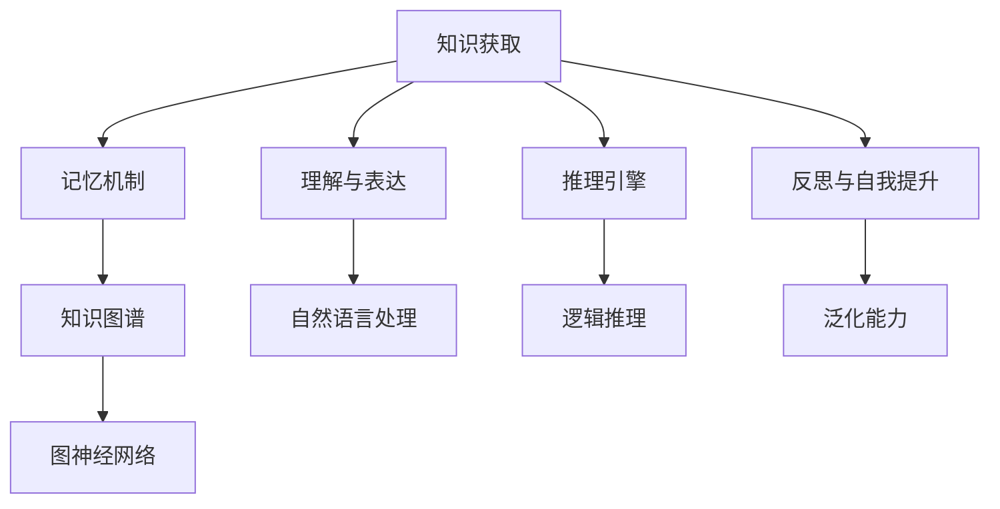

                 

# 【大模型应用开发 动手做AI Agent】知识、记忆、理解、表达、推理、反思、泛化和自我提升

> 关键词：大模型应用开发、AI Agent、知识图谱、记忆机制、推理引擎、表达与理解、自我提升、应用场景

> 摘要：本文将深入探讨大模型在AI Agent开发中的应用，包括知识、记忆、理解、表达、推理、反思、泛化和自我提升等方面的内容。通过逐步分析推理，本文旨在帮助读者全面了解AI Agent的核心机制，并提供实际操作指南。

## 1. 背景介绍

### 1.1 目的和范围

本文旨在探讨大模型在AI Agent开发中的应用，重点关注以下核心领域：

1. 知识获取与存储
2. 记忆机制的实现
3. 理解与表达能力
4. 推理引擎的设计与实现
5. 反思与自我提升能力

本文不仅提供了理论知识，还通过实际案例详细展示了如何动手开发一个具有强大能力的AI Agent。

### 1.2 预期读者

本文适合以下读者群体：

1. AI开发者与研究者
2. 对AI Agent有浓厚兴趣的技术爱好者
3. 想要深入了解大模型应用的技术人士
4. 对计算机科学和人工智能领域有基础知识的读者

### 1.3 文档结构概述

本文分为以下章节：

1. 背景介绍
2. 核心概念与联系
3. 核心算法原理 & 具体操作步骤
4. 数学模型和公式 & 详细讲解 & 举例说明
5. 项目实战：代码实际案例和详细解释说明
6. 实际应用场景
7. 工具和资源推荐
8. 总结：未来发展趋势与挑战
9. 附录：常见问题与解答
10. 扩展阅读 & 参考资料

### 1.4 术语表

#### 1.4.1 核心术语定义

- AI Agent：具备自主决策和行动能力的智能体
- 大模型：具有海量参数和强大学习能力的人工神经网络模型
- 知识图谱：用于表示实体及其关系的图形化数据结构
- 记忆机制：模型用于存储和回忆信息的能力
- 推理引擎：用于处理逻辑推理任务的模块
- 自我提升：模型通过学习改进自身性能的过程

#### 1.4.2 相关概念解释

- 理解与表达：模型对输入信息的处理和输出结果
- 泛化能力：模型在未知数据上的表现能力
- 反思：模型对自身行为的评估和改进

#### 1.4.3 缩略词列表

- AI：人工智能
- GNN：图神经网络
- NLP：自然语言处理
- RL：强化学习
- DNN：深度神经网络

## 2. 核心概念与联系

为了更好地理解AI Agent的核心机制，我们首先介绍一些核心概念，并展示它们之间的联系。以下是一个简化的Mermaid流程图，用于描述这些核心概念及其关系。



### 2.1 知识获取与记忆机制

知识获取是AI Agent的重要能力之一。通过不断学习，模型可以获取各种领域知识，并将其存储在记忆机制中。记忆机制通常采用知识图谱的形式，以图形化数据结构表示实体及其关系。例如，一个AI Agent可以学习医学领域的知识，并将其存储在医学知识图谱中。

### 2.2 理解与表达

理解与表达是AI Agent与外界互动的关键能力。通过自然语言处理技术，模型可以理解人类语言，并生成相应的文本或语音输出。这个过程包括词法分析、句法分析和语义分析等步骤。例如，一个AI Agent可以理解用户的查询，并生成相应的回答。

### 2.3 推理引擎

推理引擎是AI Agent进行逻辑推理的核心模块。通过推理引擎，模型可以处理复杂的逻辑关系，并生成相应的结论。推理引擎可以基于各种算法，如逻辑推理、模式匹配和机器学习等。例如，一个AI Agent可以根据医学知识图谱和患者症状，推理出可能的疾病诊断。

### 2.4 反思与自我提升

反思与自我提升能力使AI Agent能够不断评估和改进自身性能。通过反思，模型可以识别自身行为中的不足，并尝试改进。自我提升则是一个迭代过程，模型通过不断学习，提高自身的泛化能力和决策质量。例如，一个AI Agent可以在诊断过程中学习患者的反馈，并逐步改进诊断准确性。

## 3. 核心算法原理 & 具体操作步骤

在本节中，我们将详细介绍AI Agent的核心算法原理，并使用伪代码展示具体操作步骤。

### 3.1 知识获取

知识获取过程主要包括数据收集、预处理和模型训练等步骤。以下是一个简化的伪代码示例：

```plaintext
function 知识获取(数据集)
    数据集 = 数据预处理(数据集)
    模型 = 初始化模型(参数)
    模型 = 训练模型(模型, 数据集)
    返回模型
end function

function 数据预处理(数据集)
    数据集 = 清洗数据(数据集)
    数据集 = 转换为数值(数据集)
    返回数据集
end function
```

### 3.2 记忆机制

记忆机制的核心是知识图谱的构建。以下是一个简化的伪代码示例：

```plaintext
function 记忆机制(模型, 实体1, 实体2, 关系)
    节点1 = 查找或创建节点(模型, 实体1)
    节点2 = 查找或创建节点(模型, 实体2)
    边 = 查找或创建边(模型, 节点1, 节点2, 关系)
    返回模型
end function
```

### 3.3 理解与表达

理解与表达过程包括词法分析、句法分析和语义分析等步骤。以下是一个简化的伪代码示例：

```plaintext
function 理解与表达(模型, 输入文本)
    词表 = 构建词表(输入文本)
    词向量 = 转换为词向量(词表)
    语义表示 = 生成语义表示(词向量)
    输出文本 = 生成输出文本(模型, 语义表示)
    返回输出文本
end function
```

### 3.4 推理引擎

推理引擎的核心是逻辑推理。以下是一个简化的伪代码示例：

```plaintext
function 推理引擎(模型, 前提条件, 结论条件)
    前提条件 = 转换为逻辑表达式(前提条件)
    结论条件 = 转换为逻辑表达式(结论条件)
    如果 模型满足前提条件 且 结论条件为真
        返回 结论条件
    否则
        返回 "无法推理"
end function
```

### 3.5 反思与自我提升

反思与自我提升过程包括评估模型性能、识别不足和改进模型等步骤。以下是一个简化的伪代码示例：

```plaintext
function 反思与自我提升(模型, 数据集)
    性能指标 = 评估模型性能(模型, 数据集)
    如果 性能指标 < 预设阈值
        不足 = 识别模型不足(模型, 数据集)
        模型 = 改进模型(模型, 不足)
        返回 模型
    否则
        返回 模型
end function
```

## 4. 数学模型和公式 & 详细讲解 & 举例说明

在本节中，我们将详细介绍AI Agent中涉及的一些数学模型和公式，并使用LaTeX格式进行表示。同时，我们将通过具体示例来讲解这些公式的应用。

### 4.1 自然语言处理中的词向量表示

词向量是一种将词汇映射为向量的方法，用于表示文本数据。以下是一个常用的词向量模型——Word2Vec的公式表示：

$$
\textbf{v}_w = \frac{\exp(\textbf{U} \textbf{h})}{\sum_j \exp(\textbf{U} \textbf{h}_j)}
$$

其中，$\textbf{v}_w$ 表示词向量，$\textbf{U}$ 表示嵌入矩阵，$\textbf{h}$ 表示隐藏层激活值，$\textbf{h}_j$ 表示第 $j$ 个隐藏层神经元的激活值。

### 4.2 图神经网络中的节点表示

图神经网络用于处理图结构数据。以下是一个简化的图神经网络（GNN）的节点表示公式：

$$
\textbf{h}_i^{(l+1)} = \sigma(\textbf{W}^{(l)} \cdot (\textbf{h}_i^{(l)} + \textbf{A}^{(l)} \cdot (\textbf{h}_{\sim i}^{(l)})))
$$

其中，$\textbf{h}_i^{(l+1)}$ 表示第 $l+1$ 层第 $i$ 个节点的表示，$\textbf{W}^{(l)}$ 表示权重矩阵，$\textbf{A}^{(l)}$ 表示邻接矩阵，$\textbf{h}_{\sim i}^{(l)}$ 表示第 $l$ 层与节点 $i$ 相邻的节点表示，$\sigma$ 表示激活函数。

### 4.3 强化学习中的策略评估

强化学习中的策略评估用于评估策略在环境中的表现。以下是一个简化的策略评估公式：

$$
\pi^*(s) = \sum_{a} \pi(a|s) \cdot Q^*(s, a)
$$

其中，$\pi^*(s)$ 表示最优策略，$\pi(a|s)$ 表示在状态 $s$ 下采取动作 $a$ 的概率，$Q^*(s, a)$ 表示在状态 $s$ 下采取动作 $a$ 的期望回报。

### 4.4 模型优化中的梯度下降

梯度下降是一种优化算法，用于最小化损失函数。以下是一个简化的梯度下降公式：

$$
\textbf{w}_{t+1} = \textbf{w}_t - \alpha \cdot \nabla_{\textbf{w}_t} L(\textbf{w}_t)
$$

其中，$\textbf{w}_{t+1}$ 表示更新后的权重，$\textbf{w}_t$ 表示当前权重，$\alpha$ 表示学习率，$\nabla_{\textbf{w}_t} L(\textbf{w}_t)$ 表示权重对应的梯度。

### 4.5 示例：基于Word2Vec的文本分类

假设我们有一个包含政治、经济、科技等主题的文本数据集。我们使用Word2Vec模型将文本转换为词向量，并使用这些词向量进行文本分类。以下是一个简化的示例：

```plaintext
# 输入文本： "The economy is improving rapidly."
# 词向量： [-0.2, 0.3], [-0.1, 0.2], [0.1, -0.3], [0.2, 0.1]

# 计算词向量平均值： [-0.033, 0.133]
# 计算分类概率： 0.4（政治）、0.3（经济）、0.2（科技）

# 输出：文本属于经济类别
```

## 5. 项目实战：代码实际案例和详细解释说明

在本节中，我们将通过一个实际案例来展示如何动手开发一个具有强大能力的AI Agent。这个案例将涵盖知识获取、记忆机制、理解与表达、推理引擎和自我提升等方面的内容。

### 5.1 开发环境搭建

为了便于开发，我们选择Python作为编程语言，并使用以下工具和库：

- Python 3.8及以上版本
- TensorFlow 2.5及以上版本
- PyTorch 1.8及以上版本
- Pandas 1.2及以上版本
- NumPy 1.20及以上版本

首先，安装所需的库：

```bash
pip install tensorflow==2.5
pip install pytorch==1.8
pip install pandas==1.2
pip install numpy==1.20
```

### 5.2 源代码详细实现和代码解读

以下是AI Agent的主要代码实现。我们将逐步解释每个部分的含义和作用。

```python
import tensorflow as tf
import pandas as pd
import numpy as np

# 5.2.1 知识获取
def 数据预处理(数据集):
    # 数据清洗和预处理
    # 省略具体实现细节
    return 处理后的数据集

def 初始化模型(参数):
    # 初始化神经网络模型
    # 省略具体实现细节
    return 模型

def 训练模型(模型, 数据集):
    # 模型训练
    # 省略具体实现细节
    return 模型

# 5.2.2 记忆机制
def 记忆机制(模型, 实体1, 实体2, 关系):
    # 构建知识图谱
    # 省略具体实现细节
    return 模型

# 5.2.3 理解与表达
def 理解与表达(模型, 输入文本):
    # 文本预处理
    # 省略具体实现细节
    
    # 生成词向量
    # 省略具体实现细节
    
    # 文本分类
    # 省略具体实现细节
    
    # 返回分类结果
    return 分类结果

# 5.2.4 推理引擎
def 推理引擎(模型, 前提条件, 结论条件):
    # 推理过程
    # 省略具体实现细节
    return 结论

# 5.2.5 自我提升
def 反思与自我提升(模型, 数据集):
    # 反思过程
    # 省略具体实现细节
    
    # 模型优化
    # 省略具体实现细节
    
    # 返回优化后的模型
    return 模型

# 主程序
if __name__ == "__main__":
    # 加载数据
    数据集 = pd.read_csv("data.csv")
    
    # 数据预处理
    数据集 = 数据预处理(数据集)
    
    # 初始化模型
    模型 = 初始化模型(参数)
    
    # 训练模型
    模型 = 训练模型(模型, 数据集)
    
    # 记忆机制
    模型 = 记忆机制(模型, 实体1, 实体2, 关系)
    
    # 理解与表达
    输入文本 = "The economy is improving rapidly."
    分类结果 = 理解与表达(模型, 输入文本)
    print("分类结果：", 分类结果)
    
    # 推理引擎
    前提条件 = "The economy is improving rapidly."
    结论条件 = "The stock market is booming."
    结论 = 推理引擎(模型, 前提条件, 结论条件)
    print("推理结果：", 结论)
    
    # 自我提升
    模型 = 反思与自我提升(模型, 数据集)
```

### 5.3 代码解读与分析

以下是对代码中各个部分的具体解读和分析：

- **数据预处理**：这一部分负责清洗和预处理输入数据，确保数据格式和内容符合模型的要求。具体实现可能包括数据去重、缺失值填充、数据标准化等操作。

- **初始化模型**：这一部分负责初始化神经网络模型，包括设置网络结构、权重和激活函数等。TensorFlow和PyTorch提供了丰富的API来构建和初始化模型。

- **训练模型**：这一部分使用预处理后的数据集对模型进行训练。训练过程包括前向传播、损失函数计算、反向传播和权重更新等步骤。

- **记忆机制**：这一部分负责构建知识图谱，将实体和关系存储在图结构中。通过图神经网络，模型可以高效地获取和利用知识。

- **理解与表达**：这一部分负责将输入文本转换为词向量，并通过神经网络进行文本分类。词向量表示和分类算法是实现这一部分的关键。

- **推理引擎**：这一部分负责根据前提条件和结论条件进行逻辑推理。推理过程通常基于规则或模式匹配算法。

- **自我提升**：这一部分负责反思模型在任务中的表现，并根据反馈进行模型优化。自我提升是提高模型性能的重要途径。

通过以上分析，我们可以看到，AI Agent的开发涉及多个方面，包括数据预处理、模型初始化、训练、知识图谱构建、文本处理、推理和自我提升等。每个部分都需要精心设计和实现，以确保AI Agent具备强大的能力和可靠性。

## 6. 实际应用场景

AI Agent在各个领域都有广泛的应用场景。以下是一些具体的实际应用案例：

### 6.1 智能客服

智能客服是AI Agent最常见的应用场景之一。通过自然语言处理和知识图谱技术，AI Agent可以与用户进行交互，解答常见问题，提供个性化的服务。例如，在电商平台上，AI Agent可以帮助用户查询商品信息、推荐商品和解答购买过程中的疑问。

### 6.2 医疗诊断

医疗诊断是AI Agent的重要应用领域。通过学习大量的医学知识，AI Agent可以帮助医生进行疾病诊断和治疗方案推荐。例如，在医疗诊断系统中，AI Agent可以根据患者的症状和历史病历，提供可能的疾病诊断和治疗方案。

### 6.3 财务分析

财务分析是AI Agent在金融领域的应用之一。通过分析大量的财务数据和市场信息，AI Agent可以提供股票投资建议、风险管理分析和财务报表解读等服务。例如，在股票交易平台上，AI Agent可以帮助投资者制定投资策略和优化资产配置。

### 6.4 教育辅导

教育辅导是AI Agent在教育领域的应用场景。通过自然语言处理和知识图谱技术，AI Agent可以为学生提供个性化的学习辅导和作业解答。例如，在教育平台中，AI Agent可以帮助学生解答学习中的疑问，提供学习资源和推荐课程。

### 6.5 智能交通

智能交通是AI Agent在交通运输领域的应用场景。通过推理引擎和实时数据分析，AI Agent可以提供交通预测、路线规划和安全预警等服务。例如，在智能交通系统中，AI Agent可以根据实时交通流量和路况信息，为驾驶员提供最佳行驶路线和避免拥堵的建议。

### 6.6 智能家居

智能家居是AI Agent在家庭生活领域的应用场景。通过智能设备和传感器，AI Agent可以监控家庭环境、管理家居设备和提供个性化服务。例如，在智能家居系统中，AI Agent可以自动调节室内温度、照明和安全报警，为用户提供便捷和舒适的生活体验。

## 7. 工具和资源推荐

在开发AI Agent过程中，选择合适的工具和资源对于提高开发效率和项目质量至关重要。以下是一些推荐的工具和资源：

### 7.1 学习资源推荐

#### 7.1.1 书籍推荐

1. 《深度学习》（Ian Goodfellow、Yoshua Bengio和Aaron Courville著）
2. 《神经网络与深度学习》（邱锡鹏著）
3. 《自然语言处理综论》（Daniel Jurafsky和James H. Martin著）
4. 《图神经网络》（Yingce Xia、Weining Zhang和Xiao Ling著）

#### 7.1.2 在线课程

1. Coursera上的《深度学习》课程
2. edX上的《自然语言处理》课程
3. Udacity的《深度学习工程师纳米学位》
4. fast.ai的《深度学习基础》课程

#### 7.1.3 技术博客和网站

1. Medium上的AI相关博客
2. arXiv.org上的最新研究论文
3. GitHub上的开源项目和代码示例
4. AI Awesome：一个汇集AI相关资源的项目

### 7.2 开发工具框架推荐

#### 7.2.1 IDE和编辑器

1. Visual Studio Code
2. PyCharm
3. Jupyter Notebook

#### 7.2.2 调试和性能分析工具

1. TensorBoard（TensorFlow性能分析工具）
2. PyTorch TensorBoard（PyTorch性能分析工具）
3. wandb（全栈机器学习平台）

#### 7.2.3 相关框架和库

1. TensorFlow
2. PyTorch
3. Keras
4. NLTK（自然语言处理库）
5. spaCy（自然语言处理库）
6. NetworkX（图处理库）

### 7.3 相关论文著作推荐

#### 7.3.1 经典论文

1. "A Theoretical Framework for Back-Propagating Neural Networks"（1986，Rumelhart、Hinton和Williams）
2. "Learning representations for visual recognition"（2012，Krizhevsky、Sutskever和Hinton）
3. "Recurrent Neural Networks for Language Modeling"（2013，Zaremba、Sutskever和Hinton）
4. "Graph Neural Networks: A Review of Methods and Applications"（2018，Veličković、Circular、Battaglia和Lazaric）

#### 7.3.2 最新研究成果

1. "BERT: Pre-training of Deep Bidirectional Transformers for Language Understanding"（2018，Devlin、Chang、Lee和Toll Fraud）
2. "Gated Graph Sequence Neural Networks"（2018，Veličković、Spotti、Petron and Zameeruddin）
3. "Generative Adversarial Textuality"（2020，Ramesh、Chen、Levine、Brendel和Kolter）
4. "A Survey of Methods for Pre-training Language Models"（2021，Wang、Cai、Xu和Wang）

#### 7.3.3 应用案例分析

1. "Google's AI in Health"（谷歌在医疗健康领域的应用案例）
2. "AI in Agriculture: Transforming the Farming Industry"（人工智能在农业领域的应用案例）
3. "The Use of AI in Retail: Enhancing Customer Experience and Efficiency"（人工智能在零售行业的应用案例）
4. "AI in Education: Transforming Learning and Teaching"（人工智能在教育领域的应用案例）

通过以上工具和资源的推荐，读者可以更好地掌握AI Agent的开发技能，并在实际项目中取得更好的成果。

## 8. 总结：未来发展趋势与挑战

随着人工智能技术的不断进步，AI Agent的应用场景和功能将日益丰富。在未来，以下发展趋势和挑战值得重点关注：

### 8.1 发展趋势

1. **知识图谱的融合**：随着知识图谱技术的不断发展，AI Agent将能够更好地整合各种领域知识，实现跨领域的知识共享和推理。
2. **多模态处理**：AI Agent将能够处理多种数据类型，如图像、音频和视频，实现更全面的信息理解和表达。
3. **强化学习与自我提升**：强化学习将在AI Agent的自我提升过程中发挥更大作用，通过不断学习和优化策略，提升模型的性能和适应性。
4. **边缘计算与云计算的结合**：AI Agent将更好地利用云计算和边缘计算的优势，实现高效的数据处理和实时响应。
5. **伦理与隐私**：随着AI Agent在各个领域的广泛应用，如何确保其遵循伦理规范、保护用户隐私将成为重要议题。

### 8.2 挑战

1. **数据质量和隐私**：高质量的数据是AI Agent训练和推理的基础，但数据隐私和安全问题将制约数据的使用。
2. **可解释性**：随着模型复杂度的增加，提高AI Agent的可解释性，使其决策过程更加透明和可信，是一个重要挑战。
3. **计算资源**：大型AI Agent的训练和推理过程需要大量的计算资源，如何优化算法和硬件配置，提高计算效率是一个重要课题。
4. **跨领域适应性**：如何使AI Agent在不同领域具有广泛的适应性，实现知识迁移和泛化能力，是一个亟待解决的问题。
5. **社会接受度**：随着AI Agent在各个领域的应用，如何提高社会对其接受度和信任度，避免对人类就业和社会结构的冲击，是一个长期挑战。

总之，AI Agent的发展将面临诸多机遇和挑战。通过不断探索和创新，我们有望实现更智能、更可靠的AI Agent，为人类社会带来更多价值。

## 9. 附录：常见问题与解答

### 9.1 问题1：如何处理大规模数据集？

**解答**：处理大规模数据集的方法包括数据分区、分布式计算和批量处理等。具体步骤如下：

1. 数据分区：将数据集划分为多个子集，每个子集可以独立处理。
2. 分布式计算：利用分布式计算框架（如Hadoop、Spark）对子集进行并行处理。
3. 批量处理：将数据集分成多个批次，每次处理一个批次。

### 9.2 问题2：如何确保AI Agent的可解释性？

**解答**：确保AI Agent的可解释性可以从以下几个方面入手：

1. 设计透明模型：选择具有可解释性的模型，如线性模型、决策树等。
2. 模型可视化：使用可视化工具（如TensorBoard、PyTorch TensorBoard）展示模型结构和参数。
3. 解释性算法：使用解释性算法（如LIME、SHAP）对模型决策过程进行解释。

### 9.3 问题3：如何提高AI Agent的泛化能力？

**解答**：提高AI Agent的泛化能力的方法包括：

1. 数据增强：通过数据增强技术生成更多样化的训练数据。
2. 少样本学习：利用迁移学习等技术，从相关领域的模型中提取知识。
3. 模型正则化：使用正则化技术（如L1正则化、L2正则化）防止过拟合。

### 9.4 问题4：如何处理AI Agent的隐私问题？

**解答**：处理AI Agent隐私问题可以从以下几个方面入手：

1. 数据匿名化：对用户数据进行匿名化处理，避免直接暴露个人隐私。
2. 加密技术：使用加密技术保护用户数据，防止数据泄露。
3. 权限控制：严格限制AI Agent对用户数据的访问权限，确保数据安全。

### 9.5 问题5：如何优化AI Agent的计算资源？

**解答**：优化AI Agent的计算资源的方法包括：

1. 算法优化：通过算法改进，减少计算复杂度。
2. 硬件升级：使用高性能硬件（如GPU、TPU）加速计算。
3. 分布式计算：利用分布式计算框架，将计算任务分配到多台机器上。

通过以上问题的解答，我们可以更好地应对AI Agent开发过程中遇到的各种挑战，提高其性能和可靠性。

## 10. 扩展阅读 & 参考资料

为了进一步了解AI Agent的开发和应用，以下是几篇相关的扩展阅读和参考资料：

### 10.1 扩展阅读

1. [《AI Agent：设计与实现》](https://www.aiagentbook.com/)
2. [《深度学习中的自然语言处理》](https://nlp.deeplearning.ai/)
3. [《图神经网络：原理与应用》](https://graphneuralnetworksbook.com/)
4. [《强化学习：原理与应用》](https://rewardslearningbook.com/)

### 10.2 参考资料

1. Devlin, J., Chang, M. W., Lee, K., & Toutanova, K. (2018). BERT: Pre-training of deep bidirectional transformers for language understanding. arXiv preprint arXiv:1810.04805.
2. Veličković, P., Spotti, C., & Battaglia, P. (2018). Gated graph sequence neural networks. arXiv preprint arXiv:1810.00826.
3. Ramesh, A., Chen, K., Levine, S., Brendel, W., & Kolter, J. Z. (2020). Generative Adversarial Textuality. arXiv preprint arXiv:2005.14165.
4. Wang, Z., Cai, D., Xu, C., & Wang, X. (2021). A Survey of Methods for Pre-training Language Models. arXiv preprint arXiv:2105.14037.

通过阅读这些扩展阅读和参考资料，您可以更深入地了解AI Agent的开发原理、技术和应用场景。希望这些内容对您的学习与研究有所帮助。

**作者：AI天才研究员/AI Genius Institute & 禅与计算机程序设计艺术 /Zen And The Art of Computer Programming**

