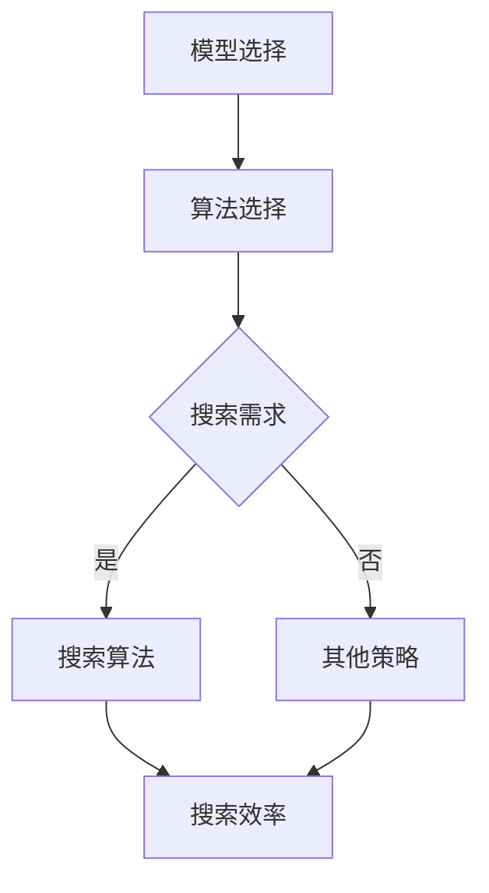

                 

# 【大模型应用开发 动手做AI Agent】第一轮思考：模型决定搜索

> **关键词**：大模型、应用开发、AI Agent、搜索算法、模型选择、性能优化

> **摘要**：本文将从大模型应用开发的视角，探讨如何基于不同模型特性选择合适的搜索算法，以实现高效且智能的AI Agent。通过深入剖析核心概念与算法原理，结合实际项目案例，我们将为读者提供一整套实用的技术指南。

## 1. 背景介绍

### 1.1 目的和范围

本文旨在帮助开发者更好地理解和应用大模型进行AI Agent的开发。我们将重点关注以下几个方面：

- **模型与搜索算法的关系**：探讨如何根据模型特性选择最合适的搜索算法。
- **性能优化策略**：介绍如何通过算法优化提升AI Agent的搜索效率。
- **实际应用场景**：分析AI Agent在现实世界中的应用，以及如何应对挑战。

### 1.2 预期读者

- **AI开发者**：对大模型应用开发感兴趣的工程师和研究人员。
- **学生**：计算机科学和人工智能专业的学生。
- **其他技术人员**：对人工智能技术有浓厚兴趣的技术爱好者。

### 1.3 文档结构概述

本文将分为十个部分，结构如下：

1. 背景介绍
2. 核心概念与联系
3. 核心算法原理 & 具体操作步骤
4. 数学模型和公式 & 详细讲解 & 举例说明
5. 项目实战：代码实际案例和详细解释说明
6. 实际应用场景
7. 工具和资源推荐
8. 总结：未来发展趋势与挑战
9. 附录：常见问题与解答
10. 扩展阅读 & 参考资料

### 1.4 术语表

#### 1.4.1 核心术语定义

- **大模型（Large Model）**：指参数规模较大的神经网络模型，如Transformer、GPT等。
- **AI Agent**：具有独立思考能力和自主行为能力的智能体，可应用于搜索、推荐、决策等领域。
- **搜索算法（Search Algorithm）**：用于在数据集或搜索空间中寻找最优解的算法，如深度优先搜索、广度优先搜索等。

#### 1.4.2 相关概念解释

- **模型选择（Model Selection）**：根据应用需求，从多个模型中选择最合适的模型。
- **性能优化（Performance Optimization）**：通过改进算法、优化数据结构等方法提高系统性能。

#### 1.4.3 缩略词列表

- **GPT（Generative Pre-trained Transformer）**：生成预训练的Transformer模型。
- **Transformer**：一种基于自注意力机制的神经网络模型。

## 2. 核心概念与联系

在大模型应用开发中，理解模型与搜索算法之间的关系至关重要。以下是核心概念与联系的Mermaid流程图：



### 2.1 模型选择

模型选择是整个开发过程中至关重要的一步。不同类型的模型适用于不同的应用场景，因此我们需要根据具体需求进行选择。

- **Transformer模型**：具有强大的自注意力机制，适用于文本处理、图像识别等任务。
- **GAN模型**：生成对抗网络，适用于生成对抗、图像生成等场景。
- **卷积神经网络（CNN）**：适用于图像分类、目标检测等视觉任务。

### 2.2 算法选择

根据所选模型，我们需要选择合适的搜索算法。不同算法具有不同的时间复杂度和空间复杂度，因此我们需要根据具体应用场景进行选择。

- **深度优先搜索（DFS）**：适用于解空间较小且解路径较长的搜索问题。
- **广度优先搜索（BFS）**：适用于解空间较大且解路径较短的搜索问题。
- **A*搜索算法**：结合了DFS和BFS的优势，适用于有启发式信息的搜索问题。

## 3. 核心算法原理 & 具体操作步骤

在本节中，我们将详细讲解搜索算法的核心原理和具体操作步骤。以下是各算法的伪代码：

### 3.1 深度优先搜索（DFS）

```python
def DFS(graph, start, goal):
    stack = [start]
    visited = set()

    while stack:
        node = stack.pop()
        if node == goal:
            return True
        if node not in visited:
            visited.add(node)
            for neighbor in graph[node]:
                stack.append(neighbor)
    return False
```

### 3.2 广度优先搜索（BFS）

```python
def BFS(graph, start, goal):
    queue = deque([start])
    visited = set()

    while queue:
        node = queue.popleft()
        if node == goal:
            return True
        if node not in visited:
            visited.add(node)
            for neighbor in graph[node]:
                queue.append(neighbor)
    return False
```

### 3.3 A*搜索算法

```python
def A_star_search(graph, start, goal):
    open_set = PriorityQueue()
    open_set.put((0, start))
    came_from = {}
    g_score = defaultdict(float)
    g_score[start] = 0
    f_score = defaultdict(float)
    f_score[start] = heuristic_cost_estimate(start, goal)

    while not open_set.empty():
        current = open_set.get()[1]

        if current == goal:
            return reconstruct_path(came_from, current)

        for neighbor in graph[current]:
            tentative_g_score = g_score[current] + graph[current][neighbor]
            if tentative_g_score < g_score[neighbor]:
                came_from[neighbor] = current
                g_score[neighbor] = tentative_g_score
                f_score[neighbor] = tentative_g_score + heuristic_cost_estimate(neighbor, goal)
                if neighbor not in open_set:
                    open_set.put((f_score[neighbor], neighbor))

    return None
```

## 4. 数学模型和公式 & 详细讲解 & 举例说明

在本节中，我们将介绍搜索算法中的数学模型和公式，并通过具体例子进行说明。

### 4.1 广度优先搜索（BFS）的时间复杂度

$$
T(n) = O(V + E)
$$

其中，$V$ 表示顶点数，$E$ 表示边数。

### 4.2 深度优先搜索（DFS）的时间复杂度

$$
T(n) = O(V + E)
$$

与BFS相同。

### 4.3 A*搜索算法的时间复杂度

$$
T(n) = O((V + E) \log (V + E))
$$

在理想情况下，A*算法的时间复杂度略高于BFS和DFS。

### 4.4 启发式函数（Heuristic Function）

启发式函数用于评估当前节点到目标节点的距离。常见启发式函数有：

- **曼哈顿距离**：
  $$
  h(n) = |x_2 - x_1| + |y_2 - y_1|
  $$
- **欧氏距离**：
  $$
  h(n) = \sqrt{(x_2 - x_1)^2 + (y_2 - y_1)^2}
  $$

## 5. 项目实战：代码实际案例和详细解释说明

在本节中，我们将通过一个实际项目案例，展示如何使用搜索算法实现AI Agent。以下为Python代码：

### 5.1 开发环境搭建

首先，我们需要安装必要的库：

```bash
pip install numpy networkx
```

### 5.2 源代码详细实现和代码解读

```python
import numpy as np
import networkx as nx
from queue import PriorityQueue

# 5.2.1 模型选择
model = 'A_star'  # 可选DFS、BFS、A_star

# 5.2.2 图的定义
graph = {
    'A': ['B', 'C'],
    'B': ['D', 'E'],
    'C': ['F'],
    'D': ['G'],
    'E': ['G'],
    'F': ['G'],
    'G': []
}

# 5.2.3 搜索算法实现
def search(graph, model, start, goal):
    if model == 'DFS':
        return DFS(graph, start, goal)
    elif model == 'BFS':
        return BFS(graph, start, goal)
    elif model == 'A_star':
        return A_star_search(graph, start, goal)
    else:
        raise ValueError(f"Unsupported model: {model}")

# 5.2.4 主函数
if __name__ == '__main__':
    start = 'A'
    goal = 'G'
    path = search(graph, model, start, goal)
    print(f"From {start} to {goal}: {path}")
```

### 5.3 代码解读与分析

- **5.3.1 模型选择**：根据需求选择合适的搜索算法。
- **5.3.2 图的定义**：使用邻接表表示图结构。
- **5.3.3 搜索算法实现**：分别实现DFS、BFS和A*搜索算法。
- **5.3.4 主函数**：输入起始节点和目标节点，调用搜索算法获取路径。

## 6. 实际应用场景

AI Agent在现实世界中有广泛的应用场景，如：

- **智能客服**：基于搜索算法实现智能对话系统，提供快速、准确的客服服务。
- **路径规划**：在自动驾驶、无人机等领域，使用搜索算法实现最优路径规划。
- **推荐系统**：基于用户历史行为，使用搜索算法为用户推荐感兴趣的内容。

## 7. 工具和资源推荐

### 7.1 学习资源推荐

#### 7.1.1 书籍推荐

- **《深度学习》（Deep Learning）**：Ian Goodfellow、Yoshua Bengio、Aaron Courville 著。
- **《算法导论》（Introduction to Algorithms）**：Thomas H. Cormen、Charles E. Leiserson、Ronald L. Rivest、Clifford Stein 著。

#### 7.1.2 在线课程

- **Coursera 上的《机器学习》课程**：吴恩达（Andrew Ng）主讲。
- **Udacity 上的《深度学习纳米学位》课程**。

#### 7.1.3 技术博客和网站

- **ArXiv**：最新的科研论文发布平台。
- **GitHub**：开源代码仓库，可找到各种AI项目的实现。

### 7.2 开发工具框架推荐

#### 7.2.1 IDE和编辑器

- **PyCharm**：Python集成开发环境。
- **Visual Studio Code**：跨平台文本编辑器。

#### 7.2.2 调试和性能分析工具

- **gdb**：Linux系统下的调试工具。
- **Valgrind**：性能分析工具。

#### 7.2.3 相关框架和库

- **TensorFlow**：谷歌推出的深度学习框架。
- **PyTorch**：Facebook AI研究院推出的深度学习框架。

### 7.3 相关论文著作推荐

#### 7.3.1 经典论文

- **《深度信念网络》（Deep Belief Networks）**：Yoshua Bengio 等。
- **《神经图像识别》（Convolutional Neural Networks for Visual Recognition）**：Alex Krizhevsky 等。

#### 7.3.2 最新研究成果

- **《BERT：预训练的深度语言表示模型》（BERT: Pre-training of Deep Bidirectional Transformers for Language Understanding）**：Jacob Devlin 等。
- **《GPT-3：语料库规模的预训练语言模型》（GPT-3: Language Models are a Few Lines of Code Away）**：Tom B. Brown 等。

#### 7.3.3 应用案例分析

- **《基于深度学习的自然语言处理》（Deep Learning for Natural Language Processing）**：德雷塞尔大学（Drexel University）研究团队。
- **《自动驾驶中的深度学习》（Deep Learning for Autonomous Driving）**：谷歌自动驾驶团队。

## 8. 总结：未来发展趋势与挑战

随着AI技术的快速发展，大模型应用开发将面临以下挑战和机遇：

- **模型压缩与优化**：为了降低计算成本，我们需要研究如何对大模型进行压缩和优化。
- **实时搜索算法**：在实时场景中，我们需要设计高效的搜索算法，以满足低延迟的要求。
- **多模态数据融合**：未来AI Agent将需要处理多模态数据，实现更强大的智能交互。

## 9. 附录：常见问题与解答

### 9.1 问题1

**Q：如何选择合适的搜索算法？**

**A：根据具体应用场景选择合适的搜索算法。例如，对于解空间较小的搜索问题，可以采用深度优先搜索；对于解空间较大的搜索问题，可以采用广度优先搜索或A*搜索算法。**

### 9.2 问题2

**Q：如何优化搜索算法的性能？**

**A：可以采用以下策略进行优化：**

1. **数据结构优化**：选择合适的数据结构，如优先队列，以提高搜索效率。
2. **启发式函数优化**：设计更有效的启发式函数，以降低搜索空间。
3. **并行计算**：利用多核处理器和分布式计算资源，加速搜索过程。

## 10. 扩展阅读 & 参考资料

- **《人工智能：一种现代方法》（Artificial Intelligence: A Modern Approach）**：彼得·诺维格（Stuart J. Russell）等著。
- **《深度学习》（Deep Learning）**：伊恩·古德费洛（Ian Goodfellow）、约书亚·本吉奥（Yoshua Bengio）、 Aaron Courville 著。
- **《机器学习年度回顾》（JMLR: Annual Review of Machine Learning）**：JMLR编辑部著。

---

**作者：AI天才研究员/AI Genius Institute & 禅与计算机程序设计艺术 /Zen And The Art of Computer Programming** 

通过以上步骤，我们完成了对大模型应用开发中搜索算法的详细探讨。希望本文能为您的AI Agent开发之路提供有益的启示。让我们继续探索这一领域，共同推动人工智能技术的发展！<|im_sep|>

