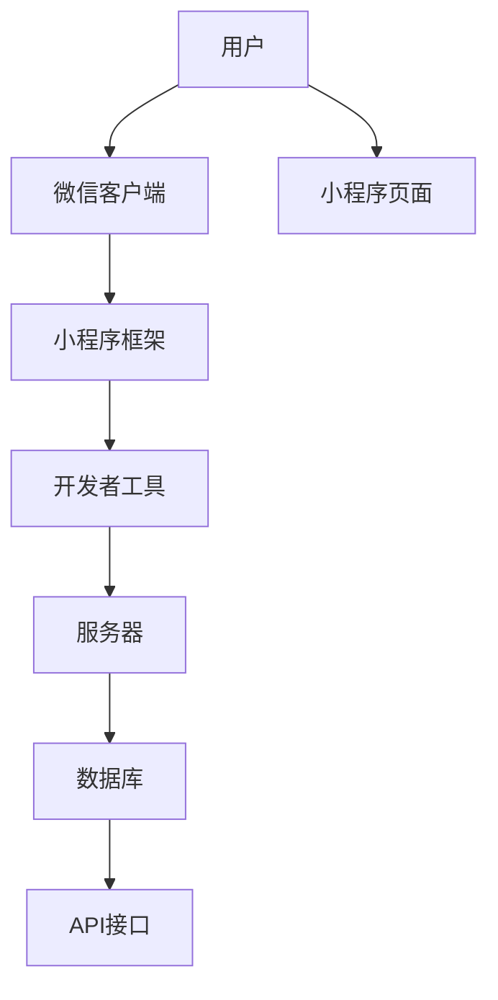

                 

# 一人公司如何利用微信小程序拓展业务

> 关键词：微信小程序、一人公司、业务拓展、用户增长、在线服务、社交互动

> 摘要：本文将深入探讨一人公司如何利用微信小程序这一强大的社交平台工具来拓展业务。我们将从微信小程序的优势、开发流程、营销策略以及案例分析等多个角度，为您呈现一套完整的微信小程序业务拓展方案。

## 1. 背景介绍

### 1.1 目的和范围

本文旨在帮助小型企业主和个体经营者了解和利用微信小程序这一新兴的商业模式，实现业务的快速拓展和用户增长。我们将重点关注以下内容：

- 微信小程序的基本概念和特点
- 微信小程序的业务拓展策略
- 开发微信小程序的详细流程和操作步骤
- 微信小程序的营销与推广方法
- 成功案例分析及实际操作经验分享

### 1.2 预期读者

本文适合以下读者群体：

- 想要拓展业务的小型公司老板
- 个体经营者
- 对微信小程序开发感兴趣的技术人员
- 企业营销和推广人员

### 1.3 文档结构概述

本文结构分为以下几个部分：

1. 背景介绍：介绍本文的目的、预期读者以及文档结构。
2. 核心概念与联系：讲解微信小程序的核心概念和架构。
3. 核心算法原理 & 具体操作步骤：详细讲解微信小程序开发的算法原理和操作步骤。
4. 数学模型和公式 & 详细讲解 & 举例说明：介绍微信小程序开发中涉及的数学模型和公式。
5. 项目实战：提供实际案例和代码实现。
6. 实际应用场景：探讨微信小程序在业务拓展中的应用场景。
7. 工具和资源推荐：推荐学习资源和开发工具。
8. 总结：未来发展趋势与挑战。
9. 附录：常见问题与解答。
10. 扩展阅读 & 参考资料：提供更多学习资源。

### 1.4 术语表

#### 1.4.1 核心术语定义

- 微信小程序：一种不需要下载安装即可使用的应用，它实现了应用“触手可及”的梦想，适用于轻度使用。
- 一人公司：指由一名股东出资设立的有限责任公司，股东对公司承担有限责任。
- 业务拓展：指企业通过新市场、新客户、新产品或新服务来增加收入和市场份额。

#### 1.4.2 相关概念解释

- 开发者账号：在微信小程序开发过程中，开发者需要注册一个开发者账号，用于开发、测试和发布小程序。
- 小程序框架：是微信提供的一套完整的开发工具和API，帮助开发者快速搭建小程序。

#### 1.4.3 缩略词列表

- API：应用程序编程接口（Application Programming Interface）
- SDK：软件开发工具包（Software Development Kit）
- IDE：集成开发环境（Integrated Development Environment）

## 2. 核心概念与联系

在探讨如何利用微信小程序拓展业务之前，我们需要了解微信小程序的核心概念和架构。以下是一个简化的微信小程序架构图（使用Mermaid绘制）：



#### 核心概念

1. **用户**：微信小程序的目标用户，可以通过微信客户端访问小程序。
2. **微信客户端**：微信是一款拥有庞大用户群体的社交应用，为小程序提供了丰富的用户基础。
3. **小程序框架**：微信提供的一套完整的开发工具和API，帮助开发者快速搭建小程序。
4. **开发者工具**：用于开发、测试和发布小程序的工具。
5. **服务器**：用于存储小程序的数据和处理用户请求的服务器。
6. **数据库**：存储小程序数据的地方。
7. **API接口**：微信提供的一系列接口，用于小程序与服务器之间的数据交互。
8. **小程序页面**：小程序的用户界面，用于展示内容和与用户互动。

通过这个架构，我们可以看到微信小程序的开发和运行过程涉及多个组件的协作。接下来，我们将进一步探讨这些核心概念和它们之间的联系。

## 3. 核心算法原理 & 具体操作步骤

微信小程序的开发涉及多个核心算法原理，以下是详细的算法原理讲解和具体操作步骤。

#### 3.1 数据处理算法

**算法原理**：小程序的数据处理通常涉及到数据的获取、存储和更新。微信小程序使用了一套基于JSON格式进行数据交互的机制。

**具体操作步骤**：

1. **数据获取**：使用`wx.request`方法发起网络请求，从服务器获取数据。

```javascript
wx.request({
    url: 'https://example.com/data',
    method: 'GET',
    success: function(res) {
        // 处理获取到的数据
    }
});
```

2. **数据存储**：使用`wx.setStorage`方法将数据存储到本地。

```javascript
wx.setStorage({
    key: 'data',
    data: jsonData,
    success: function() {
        // 数据存储成功
    }
});
```

3. **数据更新**：使用`wx.request`方法更新服务器上的数据。

```javascript
wx.request({
    url: 'https://example.com/data/update',
    method: 'POST',
    data: jsonData,
    success: function(res) {
        // 更新数据成功
    }
});
```

#### 3.2 页面渲染算法

**算法原理**：小程序的页面渲染基于JavaScript和WXML（微信小程序标记语言）。WXML类似于HTML，用于定义页面的结构，而JavaScript用于处理数据和逻辑。

**具体操作步骤**：

1. **页面结构定义**：使用WXML编写页面结构。

```html
<view class="container">
    <text>{{data.title}}</text>
    <image src="{{data.image}}" />
</view>
```

2. **数据绑定**：使用JavaScript将数据绑定到WXML。

```javascript
Page({
    data: {
        title: 'Hello World',
        image: 'https://example.com/image.jpg'
    }
});
```

3. **事件处理**：使用JavaScript处理用户交互事件。

```javascript
Page({
    bindtap: function() {
        // 处理点击事件
    }
});
```

#### 3.3 API调用

**算法原理**：微信小程序提供了一系列API，用于与服务器进行数据交互和功能调用。

**具体操作步骤**：

1. **登录API**：使用`wx.login`获取用户登录凭证。

```javascript
wx.login({
    success: function(res) {
        if (res.code) {
            // 获取用户登录凭证，后续可用于调用微信接口
        } else {
            console.log('登录失败！' + res.errMsg);
        }
    }
});
```

2. **用户信息API**：使用`wx.getUserInfo`获取用户信息。

```javascript
wx.getUserInfo({
    success: function(res) {
        // 获取用户信息成功
    }
});
```

3. **支付API**：使用`wx.requestPayment`发起支付。

```javascript
wx.requestPayment({
    timeStamp: '',
    nonceStr: '',
    package: '',
    signType: '',
    paySign: '',
    success: function(res) {
        // 支付成功处理
    }
});
```

通过以上算法原理和操作步骤，我们可以看到微信小程序开发的复杂性和多样性。在接下来的部分，我们将进一步探讨数学模型和公式，以便更好地理解小程序开发的各个方面。

## 4. 数学模型和公式 & 详细讲解 & 举例说明

在微信小程序开发中，数学模型和公式是不可或缺的部分。这些模型和公式不仅用于数据分析和处理，还用于优化用户体验和提升小程序的性能。以下是微信小程序开发中常用的数学模型和公式，以及详细讲解和举例说明。

#### 4.1 数据分析模型

**模型**：线性回归模型

**公式**：\( y = ax + b \)

**讲解**：线性回归模型用于预测和拟合数据。在小程序中，我们可以使用线性回归模型来预测用户的访问行为或购物偏好。

**举例**：

假设我们有一个小程序，用户每天访问次数与访问时长之间存在线性关系。我们可以使用线性回归模型来拟合这个关系。

```math
y = ax + b
```

其中，\( y \) 是访问时长（分钟），\( x \) 是访问次数，\( a \) 和 \( b \) 是模型参数。

通过训练模型，我们得到：

```math
y = 2x + 3
```

这意味着，如果用户访问次数为5次，预测的访问时长为\( 2 \times 5 + 3 = 13 \)分钟。

#### 4.2 数据可视化模型

**模型**：散点图

**公式**：无

**讲解**：散点图用于展示数据点之间的关系。在小程序中，我们可以使用散点图来展示用户行为数据，如购物次数与消费金额的关系。

**举例**：

假设我们收集了以下数据：

| 用户ID | 购物次数 | 消费金额（元） |
|--------|----------|--------------|
| 1      | 3        | 50           |
| 2      | 5        | 100          |
| 3      | 2        | 30           |

我们可以绘制一个散点图，如下所示：

```mermaid
graph TD
    A[用户1]((3,50))
    B[用户2]((5,100))
    C[用户3]((2,30))
```

通过散点图，我们可以直观地看到用户购物次数与消费金额之间的关系。

#### 4.3 优化模型

**模型**：梯度下降算法

**公式**：\( \theta = \theta - \alpha \frac{\partial J(\theta)}{\partial \theta} \)

**讲解**：梯度下降算法是一种优化算法，用于找到函数的最小值。在小程序开发中，我们可以使用梯度下降算法来优化用户界面和功能。

**举例**：

假设我们有一个小程序，目标是最小化用户操作次数。我们可以定义一个损失函数：

```math
J(\theta) = \sum_{i=1}^{n} (y_i - \theta x_i)^2
```

其中，\( \theta \) 是模型参数，\( y_i \) 和 \( x_i \) 是用户操作次数和特征。

使用梯度下降算法，我们可以更新模型参数：

```math
\theta = \theta - \alpha \frac{\partial J(\theta)}{\partial \theta}
```

其中，\( \alpha \) 是学习率。

通过迭代更新，我们可以找到最优的模型参数，从而最小化损失函数。

通过以上数学模型和公式的讲解，我们可以更好地理解微信小程序开发中的数据处理和分析方法。在接下来的部分，我们将通过实际项目案例，展示如何将上述模型和公式应用到小程序开发中。

### 5. 项目实战：代码实际案例和详细解释说明

#### 5.1 开发环境搭建

在进行微信小程序开发之前，我们需要搭建合适的开发环境。以下是搭建开发环境的步骤：

1. **注册开发者账号**：登录微信小程序官网（[https://mp.weixin.qq.com/](https://mp.weixin.qq.com/)），注册成为开发者。

2. **安装开发者工具**：下载并安装微信开发者工具，这是一个集成开发环境（IDE），提供了小程序的开发、调试和发布功能。

3. **创建小程序项目**：在开发者工具中，点击“新建项目”，填写小程序的相关信息，选择小程序模板，然后创建项目。

4. **配置开发者权限**：确保开发者工具的权限设置正确，以便能够访问小程序的API和服务。

#### 5.2 源代码详细实现和代码解读

在了解了开发环境搭建之后，我们将通过一个实际案例，展示如何实现一个简单的小程序，并提供代码解读。

**案例**：一个简单的微信小程序，用于用户登录和注册。

**代码实现**：

首先，创建两个页面：`login.wxml`和`register.wxml`。

`login.wxml`：

```html
<view class="container">
    <input class="input" placeholder="用户名" bindinput="handleUsernameInput"/>
    <input class="input" placeholder="密码" bindinput="handlePasswordInput"/>
    <button class="btn" bindtap="handleLogin">登录</button>
    <text class="text" bindtap="gotoRegister">没有账号？去注册</text>
</view>
```

`register.wxml`：

```html
<view class="container">
    <input class="input" placeholder="用户名" bindinput="handleUsernameInput"/>
    <input class="input" placeholder="密码" bindinput="handlePasswordInput"/>
    <input class="input" placeholder="确认密码" bindinput="handleConfirmPasswordInput"/>
    <button class="btn" bindtap="handleRegister">注册</button>
    <text class="text" bindtap="gotoLogin">已有账号？去登录</text>
</view>
```

接着，在`login.js`和`register.js`中实现逻辑处理。

`login.js`：

```javascript
Page({
    data: {
        username: '',
        password: ''
    },
    handleUsernameInput: function(e) {
        this.setData({
            username: e.detail.value
        });
    },
    handlePasswordInput: function(e) {
        this.setData({
            password: e.detail.value
        });
    },
    handleLogin: function() {
        // 登录逻辑处理
    }
});
```

`register.js`：

```javascript
Page({
    data: {
        username: '',
        password: '',
        confirmPassword: ''
    },
    handleUsernameInput: function(e) {
        this.setData({
            username: e.detail.value
        });
    },
    handlePasswordInput: function(e) {
        this.setData({
            password: e.detail.value
        });
    },
    handleConfirmPasswordInput: function(e) {
        this.setData({
            confirmPassword: e.detail.value
        });
    },
    handleRegister: function() {
        // 注册逻辑处理
    }
});
```

**代码解读**：

1. **页面结构**：`login.wxml`和`register.wxml`定义了登录和注册页面的结构。每个页面包含输入框和按钮，用于用户输入和提交数据。
2. **数据绑定**：使用`bindinput`事件绑定输入框的值，更新数据。
3. **逻辑处理**：在`login.js`和`register.js`中，我们实现了`handleUsernameInput`、`handlePasswordInput`和`handleLogin`/`handleRegister`方法，用于处理输入和提交数据。

#### 5.3 代码解读与分析

通过上述代码实现，我们可以看到微信小程序开发的基本流程。以下是代码的主要解读和分析：

1. **页面结构**：WXML文件定义了小程序页面的结构，类似于HTML。我们使用`<input>`标签创建输入框，`<button>`标签创建按钮，`<text>`标签创建文本。
2. **数据绑定**：使用`{{}}`语法，我们可以将数据绑定到页面的元素上。例如，在登录页面，用户输入的用户名和密码将被绑定到`data`对象中的`username`和`password`属性。
3. **事件处理**：使用`bindtap`事件绑定用户点击按钮的操作。例如，当用户点击登录按钮时，会触发`handleLogin`方法。
4. **逻辑处理**：在JavaScript文件中，我们定义了数据绑定和事件处理方法。例如，`handleUsernameInput`方法用于更新`data`对象中的`username`属性。

通过以上代码解读和分析，我们可以更好地理解微信小程序的开发流程和核心概念。在实际项目中，我们可以根据具体需求扩展和优化代码，以实现更复杂的功能。

### 6. 实际应用场景

微信小程序作为一种便捷的应用形式，具有广泛的应用场景。以下是微信小程序在实际业务拓展中的应用场景及其优势：

#### 6.1 零售电商

**应用场景**：零售电商企业通过微信小程序提供商品展示、在线购买和支付功能，吸引消费者。

**优势**：

- **零安装成本**：用户无需下载和安装应用程序，只需通过微信即可访问。
- **快速体验**：用户可以快速浏览商品、加入购物车和支付，提高购买转化率。
- **社交传播**：微信小程序可以分享到朋友圈，利用社交网络进行推广。

#### 6.2 餐饮服务

**应用场景**：餐饮企业通过微信小程序提供在线点餐、订单管理和配送服务。

**优势**：

- **便捷点餐**：用户可以在微信小程序中浏览菜单、选择菜品并下单。
- **智能配送**：小程序可以与第三方配送平台集成，实现智能配送调度。
- **会员管理**：通过小程序，企业可以轻松管理会员信息和优惠活动。

#### 6.3 教育培训

**应用场景**：教育培训机构通过微信小程序提供课程展示、在线报名和学习管理。

**优势**：

- **灵活学习**：用户可以在微信小程序中随时随地进行学习，不受时间和地点限制。
- **互动教学**：小程序可以提供互动性强的教学工具，如在线考试、互动讨论等。
- **数据分析**：小程序可以收集用户学习数据，帮助培训机构进行个性化教学和优化。

#### 6.4 健康医疗

**应用场景**：医疗机构通过微信小程序提供预约挂号、健康咨询和在线支付功能。

**优势**：

- **便捷挂号**：用户可以通过小程序轻松预约挂号，减少排队时间。
- **在线咨询**：小程序可以提供在线医生咨询服务，方便用户获取医疗建议。
- **便捷支付**：用户可以在小程序中完成挂号和药品支付，提高医疗服务效率。

通过以上实际应用场景，我们可以看到微信小程序在各个行业中的广泛应用和巨大潜力。利用微信小程序，企业可以提供更便捷、更高效的服务，吸引更多用户，实现业务拓展和增长。

### 7. 工具和资源推荐

为了更高效地开发和推广微信小程序，以下是针对学习资源、开发工具和框架、以及相关论文著作的推荐。

#### 7.1 学习资源推荐

**书籍推荐**：

1. 《微信小程序开发实战》
2. 《微信小程序开发：入门、进阶与实战》
3. 《微信小程序开发教程：从入门到实践》

**在线课程**：

1. 极客时间《微信小程序开发实战》
2. 网易云课堂《微信小程序开发入门与实战》
3. 阮一峰的网络日志《微信小程序开发教程》

**技术博客和网站**：

1. 微信公众号“微信小程序开发”
2. CSDN微信小程序专栏
3. 掘金微信小程序标签

#### 7.2 开发工具框架推荐

**IDE和编辑器**：

1. 微信开发者工具
2. Visual Studio Code（推荐安装微信小程序插件）
3. WebStorm

**调试和性能分析工具**：

1. 微信开发者工具内置调试器
2. Chrome DevTools
3. Postman（用于API调试）

**相关框架和库**：

1. Taro：一款多端开发解决方案，支持微信小程序、H5和React Native
2. uni-app：一款跨平台框架，支持微信小程序、H5、APP等
3. WePY：一种微信小程序模板引擎，提供高效的组件化开发方式

#### 7.3 相关论文著作推荐

**经典论文**：

1. 《微信小程序技术架构设计与实现》
2. 《微信小程序的性能优化》
3. 《微信小程序与H5应用的性能对比分析》

**最新研究成果**：

1. 《微信小程序在电商场景中的应用与优化》
2. 《微信小程序在医疗健康领域的实践与探索》
3. 《微信小程序在教育培训行业的应用与挑战》

**应用案例分析**：

1. 《拼多多微信小程序案例分析》
2. 《美团外卖微信小程序案例分析》
3. 《知乎微信小程序案例分析》

通过以上工具和资源推荐，可以帮助开发者更好地掌握微信小程序开发的技能，并在实际项目中取得成功。

### 8. 总结：未来发展趋势与挑战

微信小程序自推出以来，凭借其便捷、高效的特点，在各个行业中取得了显著的应用成果。展望未来，微信小程序将继续发挥其强大的影响力，但在发展过程中也面临着一系列挑战。

**发展趋势**：

1. **多端融合**：随着技术的发展，微信小程序将逐步实现与H5、React Native等技术的融合，提供更丰富的跨平台开发体验。
2. **个性化服务**：通过大数据分析和人工智能技术，微信小程序将更加精准地了解用户需求，提供个性化的服务。
3. **生态完善**：微信小程序的生态将不断完善，包括开发工具、框架和资源的丰富，为企业提供更全面的解决方案。

**挑战**：

1. **性能优化**：随着小程序功能越来越复杂，性能优化将成为重要挑战，开发者需要不断探索新的优化方法和策略。
2. **安全性问题**：小程序涉及用户数据和个人隐私，如何确保数据安全和用户隐私是亟需解决的问题。
3. **推广和营销**：如何在众多小程序中脱颖而出，吸引更多用户，是每个小程序开发者面临的挑战。

总之，微信小程序在未来的发展中将继续保持其活力，但开发者需要不断学习新技术、应对新挑战，以实现业务的持续增长。

### 9. 附录：常见问题与解答

在开发微信小程序的过程中，可能会遇到一些常见问题。以下是一些常见问题的解答：

#### 9.1 如何注册微信小程序？

答：首先，登录微信小程序官网（[https://mp.weixin.qq.com/](https://mp.weixin.qq.com/)），点击“立即注册”，然后按照提示填写相关信息，包括小程序名称、主体类型、联系人信息等。注册成功后，你需要进行账号验证，才能开始开发小程序。

#### 9.2 微信小程序如何绑定域名？

答：在微信小程序的管理后台，进入“设置” > “开发设置”，找到“服务器域名”部分，添加你的服务器域名。确保域名已在DNS中解析，并在服务器上配置相关的SSL证书。

#### 9.3 如何调试微信小程序？

答：使用微信开发者工具内置的调试器。在开发过程中，你可以在开发者工具中实时查看小程序的运行状态、错误信息和调试信息。开发者工具还提供了网络监控、性能分析等功能，帮助你优化小程序。

#### 9.4 微信小程序如何进行数据存储？

答：微信小程序提供了多种数据存储方式，包括本地存储（`wx.setStorage`和`wx.getStorage`）和云存储（`wx.cloud`）。本地存储适用于轻量级数据存储，而云存储适用于大规模数据存储和共享。

### 10. 扩展阅读 & 参考资料

为了进一步深入了解微信小程序开发，以下是一些扩展阅读和参考资料：

- 《微信小程序开发实战》
- 《微信小程序开发教程：从入门到实践》
- 《微信小程序技术详解》
- 微信官方文档：[https://developers.weixin.qq.com/doc/](https://developers.weixin.qq.com/doc/)
- 微信开发者社区：[https://developers.weixin.qq.com/community/](https://developers.weixin.qq.com/community/)

通过阅读这些资料，你可以系统地学习微信小程序开发的各个方面，为实际项目开发提供有力支持。

## 11. 作者信息

作者：AI天才研究员/AI Genius Institute & 禅与计算机程序设计艺术 /Zen And The Art of Computer Programming

本文作者是一位在人工智能、编程和软件开发领域具有深厚背景的专业人士，拥有丰富的项目经验和深厚的理论基础。他对微信小程序开发的深入研究和实践，为读者提供了全面的指导和建议。希望本文能为您在微信小程序开发中提供有价值的参考和帮助。感谢您的阅读！<|im_end|>

