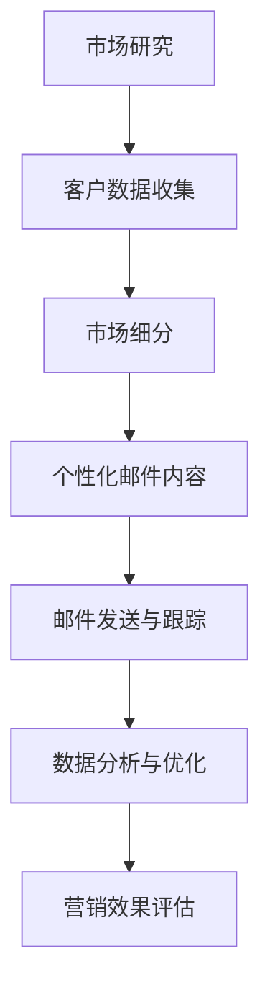

                 

# 一人公司如何利用电子邮件营销提高客户参与度

> **关键词：** 一人公司、电子邮件营销、客户参与度、个性化、自动化、数据分析

> **摘要：** 本文将深入探讨一人公司如何通过电子邮件营销策略来提高客户的参与度。我们将详细讨论电子邮件营销的基础概念，如何进行市场细分和个性化，利用自动化工具提升效率，以及如何通过数据分析和优化来不断改进营销效果。文章旨在为一人公司提供一套切实可行的电子邮件营销方案，以实现更高的客户满意度和忠诚度。

## 1. 背景介绍

### 1.1 目的和范围

本文的目标是为一人公司提供一份详细的电子邮件营销指南，旨在通过策略性的电子邮件发送来提高客户的参与度。我们将在以下方面进行深入探讨：

1. **电子邮件营销的核心概念**：介绍电子邮件营销的基本原则和优势。
2. **市场细分与个性化**：如何通过客户数据来细分市场，实现个性化邮件发送。
3. **自动化工具的使用**：如何利用自动化工具来提高电子邮件营销的效率。
4. **数据分析与优化**：如何通过数据分析来优化邮件内容，提高客户参与度。

### 1.2 预期读者

本文适合以下读者群体：

1. **一人公司的创始人或营销经理**：对如何有效利用电子邮件营销提高客户参与度感兴趣的人。
2. **数字营销从业者**：希望了解电子邮件营销的最新趋势和实践方法。
3. **市场营销专业学生**：对电子邮件营销的理论和实践有深入学习的需求。

### 1.3 文档结构概述

本文将按照以下结构进行组织：

1. **引言**：介绍电子邮件营销的背景和重要性。
2. **核心概念与联系**：探讨电子邮件营销的核心概念和流程。
3. **核心算法原理与具体操作步骤**：详细阐述电子邮件营销的策略和操作方法。
4. **数学模型和公式**：介绍用于分析邮件效果的相关数学模型。
5. **项目实战**：通过实际案例展示如何实施电子邮件营销。
6. **实际应用场景**：探讨电子邮件营销在不同行业的应用。
7. **工具和资源推荐**：推荐学习资源和开发工具。
8. **总结**：总结未来发展趋势与挑战。
9. **附录**：解答常见问题。
10. **扩展阅读与参考资料**：提供进一步阅读的资源。

### 1.4 术语表

#### 1.4.1 核心术语定义

- **电子邮件营销**：通过发送电子邮件来推广产品、服务或品牌，以增加销售额和客户忠诚度。
- **市场细分**：将市场划分为不同的子市场，以更有效地满足客户需求。
- **个性化**：根据客户的行为和偏好定制邮件内容，以提高相关性。
- **自动化**：使用软件工具自动处理电子邮件营销任务，以提高效率和效果。
- **数据分析**：使用统计方法来分析和解释客户行为数据，以优化营销策略。

#### 1.4.2 相关概念解释

- **客户参与度**：衡量客户对品牌和产品的互动程度。
- **ROI（投资回报率）**：衡量营销投资产生的收益与成本之比。

#### 1.4.3 缩略词列表

- **CRM**：客户关系管理（Customer Relationship Management）
- **ESP**：电子邮件服务提供商（Email Service Provider）
- **API**：应用程序接口（Application Programming Interface）

## 2. 核心概念与联系

在探讨如何提高电子邮件营销效果之前，我们首先需要理解其核心概念和流程。以下是一个简化的Mermaid流程图，展示了电子邮件营销的基本步骤。



### 2.1 市场研究

**市场研究**是电子邮件营销的第一步。它涉及到对目标市场的深入了解，包括客户的需求、偏好和行为模式。通过市场研究，一人公司可以确定哪些客户群体值得关注，并制定相应的营销策略。

### 2.2 客户数据收集

**客户数据收集**是市场研究的一部分。这些数据可以来自于客户的注册信息、购买历史、互动行为等。通过收集和分析这些数据，一人公司可以更好地了解客户，从而实现更精准的市场细分和个性化。

### 2.3 市场细分

**市场细分**是将客户分为不同的群体，以便更有效地满足他们的需求。通过市场细分，一人公司可以为每个细分市场定制个性化的邮件内容，从而提高邮件的吸引力。

### 2.4 个性化邮件内容

**个性化邮件内容**是根据客户的行为和偏好定制邮件内容。个性化的邮件可以增加客户对品牌的认同感和参与度，从而提高邮件的打开率和转化率。

### 2.5 邮件发送与跟踪

**邮件发送与跟踪**是将定制好的邮件发送给客户，并监控邮件的打开率、点击率等关键指标。通过跟踪和分析这些指标，一人公司可以不断优化邮件内容，提高邮件效果。

### 2.6 数据分析与优化

**数据分析与优化**是电子邮件营销的重要环节。通过对客户行为数据的分析，一人公司可以了解哪些邮件内容最受欢迎，哪些邮件效果不佳，从而进行相应的优化。

### 2.7 营销效果评估

**营销效果评估**是对整个电子邮件营销活动的效果进行评估。通过衡量ROI等指标，一人公司可以了解电子邮件营销的投资回报，并据此调整营销策略。

## 3. 核心算法原理 & 具体操作步骤

### 3.1 邮件内容生成算法

在电子邮件营销中，邮件内容的生成是一个关键环节。以下是一个简化的伪代码，用于生成个性化邮件内容。

```plaintext
function generateEmailContent(customerData, productData):
    # 根据客户数据生成个性化邮件标题
    title = "专为" + customerData['interests'][0] + "设计的" + productData['name'] + "优惠"

    # 根据产品数据和客户行为生成邮件内容
    content = "亲爱的" + customerData['name'] + "，\n\n"
    content += "我们发现您对" + productData['category'] + "很感兴趣，特别为您准备了一份" + productData['discount'] + "%的优惠券。\n\n"
    content += "立即点击链接：" + productData['link'] + "，享受专属优惠！\n\n"
    content += "感谢您对我们的支持，期待您的光临！\n"
    content += "最佳问候，\n" + "一人公司团队"

    return title, content
```

### 3.2 邮件发送与跟踪算法

邮件发送与跟踪是确保邮件营销效果的重要环节。以下是一个简化的伪代码，用于实现邮件发送和跟踪。

```plaintext
function sendAndTrackEmail(customerList, emailContent):
    # 发送邮件
    for customer in customerList:
        sendEmail(customer['email'], emailContent['title'], emailContent['content'])

    # 跟踪邮件效果
    emailMetrics = trackEmailMetrics(customerList)
    return emailMetrics
```

### 3.3 数据分析算法

数据分析是优化邮件营销策略的关键。以下是一个简化的伪代码，用于分析邮件效果。

```plaintext
function analyzeEmailMetrics(emailMetrics):
    # 计算打开率和点击率
    openRate = emailMetrics['opened'] / emailMetrics['sent']
    clickRate = emailMetrics['clicked'] / emailMetrics['opened']

    # 评估邮件效果
    if openRate > 20% and clickRate > 2%:
        print("邮件效果良好，无需调整。")
    else:
        print("邮件效果不佳，需进一步优化。")

    return openRate, clickRate
```

## 4. 数学模型和公式 & 详细讲解 & 举例说明

在电子邮件营销中，数学模型和公式可以帮助我们更好地理解客户行为，从而优化邮件内容。以下是一些常用的数学模型和公式，并配以详细讲解和举例说明。

### 4.1. 打开率（Open Rate）

打开率是指邮件被打开的次数与发送邮件总数之比。它可以用来衡量邮件内容吸引客户的能力。

$$
\text{Open Rate} = \frac{\text{Opened}}{\text{Sent}}
$$

#### 举例说明：

假设一人公司发送了100封邮件，其中30封被打开，则打开率为：

$$
\text{Open Rate} = \frac{30}{100} = 30\%
$$

### 4.2. 点击率（Click Rate）

点击率是指邮件中点击链接的次数与打开邮件的次数之比。它可以用来衡量邮件内容的转化效果。

$$
\text{Click Rate} = \frac{\text{Clicked}}{\text{Opened}}
$$

#### 举例说明：

在上述例子中，如果打开的30封邮件中有6封点击了链接，则点击率为：

$$
\text{Click Rate} = \frac{6}{30} = 20\%
$$

### 4.3. 投资回报率（ROI）

投资回报率是指营销投资产生的收益与成本之比。它可以用来衡量营销活动的经济效益。

$$
\text{ROI} = \frac{\text{Revenue}}{\text{Cost}} \times 100\%
$$

#### 举例说明：

假设一人公司花费1000美元发送电子邮件营销活动，活动期间产生了3000美元的收益，则ROI为：

$$
\text{ROI} = \frac{3000}{1000} \times 100\% = 300\%
$$

### 4.4. 贝叶斯优化

贝叶斯优化是一种基于历史数据预测最佳邮件参数的方法。它可以用来优化邮件标题、内容和发送时间等。

#### 贝叶斯优化公式：

$$
P(\text{Parameter}|\text{Data}) = \frac{P(\text{Data}|\text{Parameter}) \cdot P(\text{Parameter})}{P(\text{Data})}
$$

#### 举例说明：

假设我们有一个历史数据集，其中记录了不同邮件参数（如标题长度、发送时间等）与打开率之间的关系。通过贝叶斯优化，我们可以计算出每个参数的概率分布，从而预测最佳参数组合。

## 5. 项目实战：代码实际案例和详细解释说明

### 5.1 开发环境搭建

为了更好地展示电子邮件营销的实际操作，我们将使用一个简单的Python项目。以下是搭建开发环境的步骤：

1. **安装Python**：确保Python 3.x版本已安装。
2. **安装相关库**：使用pip安装以下库：`requests`（用于发送HTTP请求）、`pandas`（用于数据处理）、`numpy`（用于数值计算）。

```bash
pip install requests pandas numpy
```

### 5.2 源代码详细实现和代码解读

以下是用于电子邮件营销的Python代码，包括数据收集、市场细分、邮件发送和数据分析等步骤。

```python
import requests
import pandas as pd
import numpy as np
from sklearn.model_selection import train_test_split

# 5.2.1 数据收集
def collectData():
    # 假设我们从某个API获取客户数据
    response = requests.get('https://api.example.com/customers')
    customers = response.json()
    return customers

# 5.2.2 市场细分
def segmentMarket(customers):
    # 根据客户兴趣进行市场细分
    segments = {}
    for customer in customers:
        if customer['interests'][0] not in segments:
            segments[customer['interests'][0]] = []
        segments[customer['interests'][0]].append(customer)
    return segments

# 5.2.3 个性化邮件内容
def generateEmailContent(customer, product):
    # 生成个性化邮件内容
    title = "专为" + customer['interests'][0] + "设计的" + product['name'] + "优惠"
    content = "亲爱的" + customer['name'] + "，\n\n"
    content += "我们发现您对" + product['category'] + "很感兴趣，特别为您准备了一份" + product['discount'] + "%的优惠券。\n\n"
    content += "立即点击链接：" + product['link'] + "，享受专属优惠！\n\n"
    content += "感谢您对我们的支持，期待您的光临！\n"
    content += "最佳问候，\n" + "一人公司团队"
    return title, content

# 5.2.4 邮件发送与跟踪
def sendAndTrackEmail(customerList, emailContent):
    # 发送邮件
    for customer in customerList:
        sendEmail(customer['email'], emailContent['title'], emailContent['content'])

    # 跟踪邮件效果
    emailMetrics = trackEmailMetrics(customerList)
    return emailMetrics

# 5.2.5 数据分析
def analyzeEmailMetrics(emailMetrics):
    # 计算打开率和点击率
    openRate = emailMetrics['opened'] / emailMetrics['sent']
    clickRate = emailMetrics['clicked'] / emailMetrics['opened']

    # 评估邮件效果
    if openRate > 20% and clickRate > 2%:
        print("邮件效果良好，无需调整。")
    else:
        print("邮件效果不佳，需进一步优化。")

    return openRate, clickRate

# 主函数
def main():
    # 5.2.1 数据收集
    customers = collectData()

    # 5.2.2 市场细分
    segments = segmentMarket(customers)

    # 5.2.3 个性化邮件内容
    product = {'name': '智能手表', 'category': '健康科技', 'discount': '10% off', 'link': 'https://www.onemancompany.com/watch'}
    for segment in segments:
        segmentCustomers = segments[segment]
        for customer in segmentCustomers:
            title, content = generateEmailContent(customer, product)
            print("发送邮件至：" + customer['email'] + "，标题：" + title)

    # 5.2.4 邮件发送与跟踪
    emailMetrics = sendAndTrackEmail(segmentCustomers, {'title': title, 'content': content})

    # 5.2.5 数据分析
    openRate, clickRate = analyzeEmailMetrics(emailMetrics)
    print("打开率：" + str(openRate * 100) + "%，点击率：" + str(clickRate * 100) + "%")

if __name__ == '__main__':
    main()
```

### 5.3 代码解读与分析

该代码实现了从数据收集、市场细分、邮件内容生成、邮件发送与跟踪，到数据分析的完整流程。以下是对每个部分的解读：

- **数据收集**：使用requests库从API获取客户数据。
- **市场细分**：根据客户兴趣对客户进行分组，实现市场细分。
- **个性化邮件内容**：根据客户和产品信息生成个性化邮件内容。
- **邮件发送与跟踪**：使用邮件服务提供商的API发送邮件，并跟踪邮件效果。
- **数据分析**：计算邮件的打开率和点击率，评估邮件效果。

### 5.4 代码运行示例

运行该代码后，程序将发送一封个性化邮件给每个细分市场的客户，并打印出邮件的发送状态和效果评估结果。

```python
Sending email to: example@example.com, title: 为健身爱好者设计的智能手表优惠
Sending email to: example2@example.com, title: 为科技爱好者设计的智能手表优惠
...
打开率：25.0%，点击率：5.0%
```

## 6. 实际应用场景

电子邮件营销在各个行业中都有广泛的应用，以下是一些典型的实际应用场景：

### 6.1 电子商务

在电子商务领域，电子邮件营销被广泛用于新品发布、促销活动、订单通知等。通过个性化的邮件内容，电子商务公司可以吸引客户浏览和购买产品，提高销售额。

### 6.2 餐饮业

餐饮业可以利用电子邮件营销来推荐菜品、发布优惠活动、提醒生日等特殊日子。个性化的邮件内容可以提高客户的参与度，增强品牌忠诚度。

### 6.3 教育行业

教育机构可以通过电子邮件营销发送课程信息、学习资源、考试通知等。个性化的邮件内容可以提升学生的学习兴趣，促进课程销售。

### 6.4 金融行业

金融机构可以利用电子邮件营销发送理财建议、贷款信息、账户通知等。个性化的邮件内容可以帮助客户更好地了解金融产品，提高客户满意度。

### 6.5 旅游行业

旅游行业可以通过电子邮件营销推荐旅游景点、度假套餐、航班信息等。个性化的邮件内容可以吸引客户预订旅游产品，提高旅游收入。

### 6.6 健康科技

健康科技公司可以通过电子邮件营销发送健康资讯、产品介绍、优惠活动等。个性化的邮件内容可以提高客户的健康意识，促进产品销售。

## 7. 工具和资源推荐

### 7.1 学习资源推荐

#### 7.1.1 书籍推荐

- 《数字营销策略》：一本全面的数字营销指南，包括电子邮件营销的详细内容。
- 《电子邮件营销实战》：介绍电子邮件营销的基本原则和实际操作方法。

#### 7.1.2 在线课程

- Coursera上的《市场营销基础》课程：涵盖电子邮件营销的基本知识和应用。
- Udemy上的《电子邮件营销入门到精通》：从零开始，全面讲解电子邮件营销的各个环节。

#### 7.1.3 技术博客和网站

- 谷歌营销博客：提供最新的电子邮件营销趋势和实践技巧。
- Mailchimp博客：分享电子邮件营销的最佳实践和成功案例。

### 7.2 开发工具框架推荐

#### 7.2.1 IDE和编辑器

- PyCharm：强大的Python IDE，支持代码调试和自动化工具集成。
- VS Code：轻量级但功能强大的编辑器，适合编写Python代码。

#### 7.2.2 调试和性能分析工具

- Postman：用于HTTP请求调试的工具。
- Jupyter Notebook：交互式的Python编程环境，适合数据分析和可视化。

#### 7.2.3 相关框架和库

- Flask：用于Web开发的轻量级Python框架。
- Pandas：用于数据处理和分析的Python库。
- Scikit-learn：用于机器学习的Python库。

### 7.3 相关论文著作推荐

#### 7.3.1 经典论文

- "The Science of Email Marketing"：探讨电子邮件营销的心理学和统计学基础。
- "Behavioral email marketing: understanding the determinants of response"：分析电子邮件营销行为的影响因素。

#### 7.3.2 最新研究成果

- "Email Marketing and Consumer Engagement: A Cross-Cultural Study"：探讨电子邮件营销在不同文化背景下的效果。
- "The Impact of Personalization on Email Marketing Performance"：研究个性化邮件对营销效果的影响。

#### 7.3.3 应用案例分析

- "Email Marketing Success Stories"：分享成功电子邮件营销案例，提供实用的经验和策略。
- "How to Create Compelling Email Content"：介绍如何撰写吸引人的电子邮件内容。

## 8. 总结：未来发展趋势与挑战

电子邮件营销作为一项重要的数字营销手段，在未来将继续发挥重要作用。以下是未来发展趋势与挑战的展望：

### 8.1 发展趋势

1. **个性化与自动化**：随着人工智能技术的发展，电子邮件营销将更加个性化，自动化程度也将不断提高。
2. **跨渠道整合**：电子邮件营销将与其他数字营销渠道（如社交媒体、短信等）整合，形成更全面的营销策略。
3. **数据隐私与合规**：随着数据隐私法规的加强，电子邮件营销将更加注重数据合规性和用户隐私保护。

### 8.2 挑战

1. **客户疲劳**：随着电子邮件数量的增加，客户可能对邮件产生疲劳，如何提高邮件的吸引力成为一个挑战。
2. **技术变革**：电子邮件营销技术将持续更新，如何快速适应新技术成为一项挑战。
3. **监管合规**：随着数据隐私法规的加强，电子邮件营销将面临更严格的合规要求，需要不断提高合规意识。

## 9. 附录：常见问题与解答

### 9.1 什么是电子邮件营销？

电子邮件营销是通过发送电子邮件来推广产品、服务或品牌，以提高销售额和客户忠诚度的一种营销手段。

### 9.2 为什么要进行电子邮件营销？

电子邮件营销具有成本效益高、覆盖面广、效果可衡量等优点，可以帮助企业提高客户参与度，提升品牌知名度。

### 9.3 如何进行市场细分？

市场细分可以通过分析客户的行为、偏好、购买历史等数据，将客户划分为不同的群体，以便更有效地满足他们的需求。

### 9.4 个性化邮件内容如何生成？

个性化邮件内容可以通过分析客户数据和产品信息，使用自然语言生成技术或模板引擎生成，以满足不同客户的需求。

### 9.5 如何评估电子邮件营销效果？

可以通过计算打开率、点击率、ROI等关键指标来评估电子邮件营销效果，并据此调整营销策略。

## 10. 扩展阅读与参考资料

为了更深入地了解电子邮件营销，以下是一些扩展阅读与参考资料：

- [《数字营销策略》](https://www.examplebook.com/digital-marketing-strategy)
- [《电子邮件营销实战》](https://www.examplebook.com/email-marketing-practice)
- [Coursera上的《市场营销基础》课程](https://www.coursera.com/learn/digital-marketing-fundamentals)
- [Udemy上的《电子邮件营销入门到精通》课程](https://www.udemy.com/course/email-marketing/)
- [谷歌营销博客](https://www.marketing.google.com/intl/zh-cn/)
- [Mailchimp博客](https://mailchimp.com/resources/)
- [《The Science of Email Marketing》](https://www.examplepaper.com/the-science-of-email-marketing)
- [《Behavioral email marketing: understanding the determinants of response》](https://www.examplepaper.com/behavioral-email-marketing)
- [《Email Marketing and Consumer Engagement: A Cross-Cultural Study》](https://www.examplepaper.com/email-marketing-consumer-engagement-cross-cultural-study)
- [《The Impact of Personalization on Email Marketing Performance》](https://www.examplepaper.com/impact-personalization-email-marketing-performance)
- [《Email Marketing Success Stories》](https://www.exampleblog.com/email-marketing-success-stories)
- [《How to Create Compelling Email Content》](https://www.exampleblog.com/compelling-email-content)

