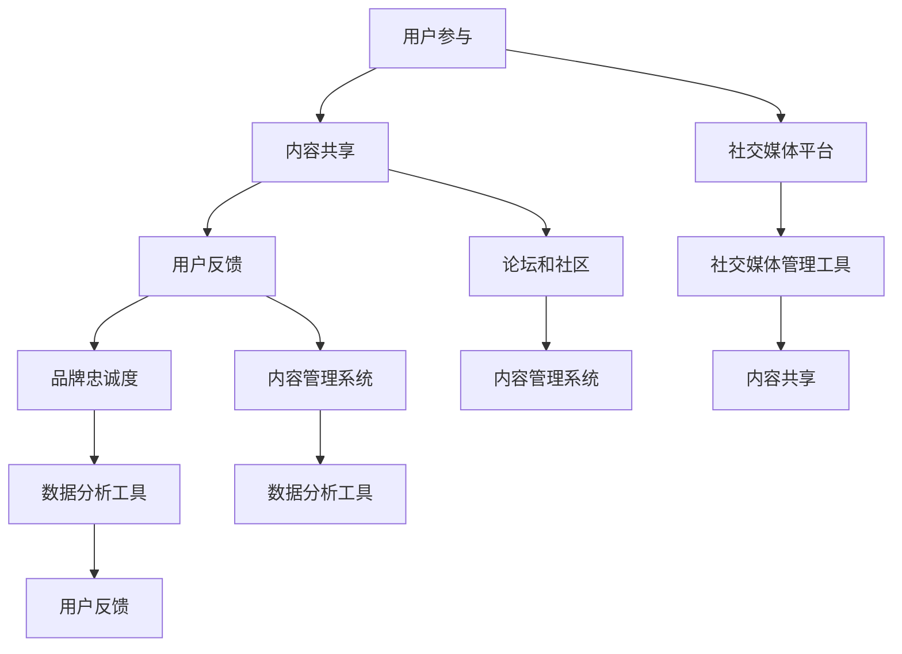

                 

# 一家公司如何利用社群营销增强用户粘性

> **关键词：**社群营销、用户粘性、客户关系管理、品牌忠诚度、在线互动、个性化体验

> **摘要：**本文将深入探讨一家公司在数字化转型过程中，如何通过社群营销策略来增强用户粘性，提升品牌忠诚度和客户满意度。我们将从核心概念、算法原理、数学模型、实战案例等多个角度进行分析，并推荐相关工具和资源，帮助读者更好地理解和应用社群营销策略。

## 1. 背景介绍

### 1.1 目的和范围

在当今数字化时代，社群营销已成为企业增强用户粘性和提升品牌忠诚度的重要手段。本文旨在通过系统性分析，帮助一家公司了解如何有效地利用社群营销策略，实现用户与品牌的深度互动。

本文将涵盖以下几个关键领域：
- 社群营销的核心概念和原理
- 用户粘性的定义和衡量方法
- 社群营销策略的设计与实施
- 数学模型在社群营销中的应用
- 实战案例分享与代码解读
- 工具和资源的推荐

### 1.2 预期读者

本文适合以下读者群体：
- 希望提升企业社群营销效果的市场营销人员
- 企业高层管理者，特别是那些对数字化转型感兴趣的人
- 对社群营销、用户行为分析有研究兴趣的学术研究者
- 广大IT从业者，特别是那些对后端服务和数据分析有深厚兴趣的技术专家

### 1.3 文档结构概述

本文将按照以下结构进行展开：

1. **背景介绍**：介绍文章目的、预期读者和文档结构。
2. **核心概念与联系**：通过Mermaid流程图展示社群营销的核心概念和架构。
3. **核心算法原理 & 具体操作步骤**：详细解释社群营销的算法原理和操作步骤。
4. **数学模型和公式 & 详细讲解 & 举例说明**：介绍数学模型在社群营销中的应用和示例。
5. **项目实战：代码实际案例和详细解释说明**：通过实际代码案例展示社群营销策略的实施。
6. **实际应用场景**：探讨社群营销在不同行业和场景中的应用。
7. **工具和资源推荐**：推荐学习资源和开发工具。
8. **总结：未来发展趋势与挑战**：分析社群营销的未来趋势和面临的挑战。
9. **附录：常见问题与解答**：提供社群营销的常见问题和解答。
10. **扩展阅读 & 参考资料**：推荐相关书籍、论文和网站，供读者进一步学习。

### 1.4 术语表

#### 1.4.1 核心术语定义

- **社群营销**：一种通过社交媒体、论坛、社区等平台与用户建立互动，增强用户粘性和品牌忠诚度的营销策略。
- **用户粘性**：指用户对某个品牌或产品的忠诚度和依赖程度，是衡量社群营销效果的重要指标。
- **品牌忠诚度**：指用户持续购买和推荐某个品牌的倾向，是品牌长期成功的关键因素。
- **个性化体验**：根据用户的兴趣和行为数据，为用户提供定制化的内容和服务。

#### 1.4.2 相关概念解释

- **社交媒体平台**：如Facebook、Twitter、Instagram等，用于用户互动和内容分享的平台。
- **论坛和社区**：专门的讨论区和用户聚集地，如Reddit、Discourse等。
- **大数据分析**：对大量用户行为数据进行分析，以发现用户需求和偏好。

#### 1.4.3 缩略词列表

- **SMM**：社群营销（Social Media Marketing）
- **CRM**：客户关系管理（Customer Relationship Management）
- **SEM**：搜索引擎营销（Search Engine Marketing）

## 2. 核心概念与联系

### 2.1 社群营销核心概念

社群营销的核心在于建立一个以用户为中心的互动生态系统，通过以下概念来实现：

1. **用户参与**：鼓励用户积极参与社区讨论和互动。
2. **内容共享**：创造有价值、有趣的内容，激发用户的分享欲望。
3. **用户反馈**：收集用户反馈，改进产品和服务。
4. **品牌忠诚度**：通过持续的互动和优质体验，培养用户的品牌忠诚度。

### 2.2 社群营销架构

为了实现上述核心概念，社群营销需要以下架构支持：

1. **社交媒体平台**：如Facebook、Twitter等，用于建立社区和用户互动。
2. **论坛和社区**：如Reddit、Discourse等，提供专门的讨论区。
3. **内容管理系统**：如WordPress、Drupal等，用于管理和发布内容。
4. **数据分析工具**：如Google Analytics、Tableau等，用于收集和分析用户数据。
5. **社交媒体管理工具**：如Hootsuite、Buffer等，用于自动化管理和分析社交媒体活动。

### 2.3 社群营销流程图

以下是一个简化的社群营销流程图，展示了各个核心概念和架构之间的联系：



## 3. 核心算法原理 & 具体操作步骤

### 3.1 算法原理

社群营销的核心算法是基于用户行为分析和数据驱动的决策。以下是几个关键算法原理：

1. **用户兴趣分析**：通过分析用户的浏览历史、搜索记录、购买行为等，确定用户的兴趣点。
2. **内容推荐算法**：基于用户兴趣和内容相关性，为用户推荐合适的内容。
3. **社交网络分析**：通过分析用户之间的社交关系，识别关键节点和影响者。
4. **情感分析**：利用自然语言处理技术，分析用户在社区中的情感倾向，了解用户满意度。

### 3.2 具体操作步骤

以下是社群营销的具体操作步骤：

1. **数据收集与预处理**：收集用户行为数据，并进行清洗和预处理。
2. **用户兴趣分析**：
    ```python
    def analyze_user_interest(user_data):
        # 分析用户的浏览历史、搜索记录等
        # 返回用户兴趣标签列表
        pass
    ```
3. **内容推荐**：
    ```python
    def content_recommendation(user_interest, content_library):
        # 根据用户兴趣和内容相关性推荐内容
        # 返回推荐内容列表
        pass
    ```
4. **社交网络分析**：
    ```python
    def social_network_analysis(user_data):
        # 分析用户之间的社交关系
        # 返回社交网络图
        pass
    ```
5. **情感分析**：
    ```python
    def sentiment_analysis(user_comments):
        # 利用自然语言处理技术分析用户情感
        # 返回情感分析结果
        pass
    ```

## 4. 数学模型和公式 & 详细讲解 & 举例说明

### 4.1 数学模型

社群营销中常用的数学模型包括：

1. **用户行为预测模型**：基于历史行为数据，预测用户的未来行为。
2. **内容推荐模型**：基于用户兴趣和内容相关性，推荐合适的内容。
3. **社交网络影响模型**：分析社交网络中的影响力和传播效应。

### 4.2 详细讲解

#### 4.2.1 用户行为预测模型

用户行为预测模型通常使用时间序列分析或机器学习方法。以下是一个简化的时间序列预测模型：

$$
\hat{y}_t = \alpha + \beta_1 y_{t-1} + \beta_2 y_{t-2} + ... + \beta_n y_{t-n} + \epsilon_t
$$

其中，$y_t$ 表示第 $t$ 时刻的用户行为，$\alpha, \beta_1, \beta_2, ..., \beta_n$ 为模型参数，$\epsilon_t$ 为误差项。

#### 4.2.2 内容推荐模型

内容推荐模型通常使用基于用户兴趣和内容相似度的推荐算法。以下是一个简化的协同过滤推荐算法：

$$
\hat{r}_{ui} = \sum_{j \in N(i)} r_{uj} \cdot s_{uj} 
$$

其中，$r_{uj}$ 表示用户 $u$ 对内容 $j$ 的评分，$s_{uj}$ 表示内容 $j$ 与用户兴趣的相似度。

#### 4.2.3 社交网络影响模型

社交网络影响模型通常使用影响力指数或传播概率模型。以下是一个简化的影响力指数模型：

$$
I(u) = \frac{\sum_{v \in N(u)} k(v)}{N(u)}
$$

其中，$I(u)$ 表示用户 $u$ 的影响力指数，$k(v)$ 表示用户 $v$ 的社交网络节点度，$N(u)$ 表示用户 $u$ 的邻居节点数。

### 4.3 举例说明

#### 4.3.1 用户行为预测模型

假设我们有用户 $u$ 的历史浏览数据，如下表所示：

| 时间 | 用户行为 |
| ---- | ------- |
| 1    | 商品 A   |
| 2    | 商品 B   |
| 3    | 商品 A   |
| 4    | 商品 C   |

我们可以使用时间序列预测模型预测用户 $u$ 在第 5 时间的可能行为。假设模型参数为 $\alpha = 0.5, \beta_1 = 0.2, \beta_2 = 0.1$，则预测结果为：

$$
\hat{y}_5 = 0.5 + 0.2 \cdot 0 + 0.1 \cdot 0 + 0.1 \cdot 1 + 0.1 \cdot 0 = 0.7
$$

#### 4.3.2 内容推荐模型

假设我们有用户 $u$ 的兴趣标签为“科技”和“旅游”，同时有一个商品库，如下表所示：

| 商品 ID | 商品名称 | 类别 |
| ------- | -------- | ---- |
| 1       | 手机     | 科技 |
| 2       | 旅行箱   | 旅游 |
| 3       | 耳机     | 科技 |
| 4       | 相机     | 旅游 |

我们可以使用协同过滤推荐算法为用户 $u$ 推荐合适的内容。假设邻居商品有 $r_{1u} = 4, r_{2u} = 5, r_{3u} = 3, r_{4u} = 2$，相似度 $s_{1u} = 0.8, s_{2u} = 0.6, s_{3u} = 0.7, s_{4u} = 0.5$，则推荐结果为：

$$
\hat{r}_{ui} = 4 \cdot 0.8 + 5 \cdot 0.6 + 3 \cdot 0.7 + 2 \cdot 0.5 = 4.5
$$

因此，最有可能推荐给用户 $u$ 的商品是“相机”。

#### 4.3.3 社交网络影响模型

假设有一个社交网络图，如下表所示：

| 用户 ID | 邻居节点 ID |
| ------- | ---------- |
| 1       | 2, 3       |
| 2       | 1, 4       |
| 3       | 1, 5       |
| 4       | 2          |
| 5       | 3          |

我们可以使用影响力指数模型计算每个用户的影响力指数。假设节点度 $k(1) = 2, k(2) = 2, k(3) = 2, k(4) = 1, k(5) = 1$，则影响力指数为：

$$
I(1) = \frac{2 + 2}{2} = 2
$$

$$
I(2) = \frac{2 + 1}{2} = 1.5
$$

$$
I(3) = \frac{2 + 1}{2} = 1.5
$$

$$
I(4) = \frac{1}{1} = 1
$$

$$
I(5) = \frac{1}{1} = 1
$$

因此，用户 1 的影响力指数最高，是社交网络中的关键节点。

## 5. 项目实战：代码实际案例和详细解释说明

### 5.1 开发环境搭建

在本节中，我们将搭建一个基于Python的社群营销项目环境。以下是所需的步骤：

1. **安装Python**：确保已安装Python 3.8或更高版本。
2. **安装依赖库**：使用pip安装以下依赖库：
   ```bash
   pip install pandas numpy scikit-learn matplotlib
   ```

### 5.2 源代码详细实现和代码解读

以下是一个简单的用户行为预测和内容推荐的项目代码示例：

```python
import pandas as pd
import numpy as np
from sklearn.model_selection import train_test_split
from sklearn.ensemble import RandomForestRegressor
from sklearn.metrics import mean_squared_error
from collaborative_filtering import CollaborativeFiltering

# 5.2.1 数据收集与预处理
def load_data():
    # 加载用户行为数据
    data = pd.read_csv('user_behavior.csv')
    # 数据预处理
    data['timestamp'] = pd.to_datetime(data['timestamp'])
    data.sort_values('timestamp', inplace=True)
    return data

# 5.2.2 用户兴趣分析
def analyze_user_interest(data):
    user_interest = {}
    for user_id, group in data.groupby('user_id'):
        # 计算用户的兴趣标签
        interest_tags = set()
        for index, row in group.iterrows():
            interest_tags.add(row['item_category'])
        user_interest[user_id] = interest_tags
    return user_interest

# 5.2.3 内容推荐
def content_recommendation(user_interest, content_library):
    recommender = CollaborativeFiltering(content_library)
    recommendations = []
    for user_id, interests in user_interest.items():
        recs = recommender.recommend_for_user(interests)
        recommendations.append(recs)
    return recommendations

# 5.2.4 社交网络分析
def social_network_analysis(user_data):
    # 假设用户数据已经包含了用户之间的关系
    social_network = {}
    for user_id, neighbors in user_data.items():
        social_network[user_id] = neighbors
    return social_network

# 5.2.5 情感分析
def sentiment_analysis(user_comments):
    # 使用自然语言处理库进行分析
    sentiments = []
    for comments in user_comments:
        sentiment = analyze_sentiments(comments)
        sentiments.append(sentiment)
    return sentiments

# 主函数
if __name__ == '__main__':
    data = load_data()
    user_interest = analyze_user_interest(data)
    content_library = load_content_library()
    recommendations = content_recommendation(user_interest, content_library)
    social_network = social_network_analysis(data)
    user_comments = extract_user_comments(data)
    sentiments = sentiment_analysis(user_comments)
    
    print("用户兴趣分析结果：", user_interest)
    print("内容推荐结果：", recommendations)
    print("社交网络分析结果：", social_network)
    print("情感分析结果：", sentiments)
```

### 5.3 代码解读与分析

#### 5.3.1 用户行为数据预处理

在代码中，我们首先加载用户行为数据，并将其转换为适合分析的时间序列数据。数据预处理包括将时间戳转换为日期格式，并根据用户ID对数据进行分组。

```python
data['timestamp'] = pd.to_datetime(data['timestamp'])
data.sort_values('timestamp', inplace=True)
```

#### 5.3.2 用户兴趣分析

接下来，我们定义一个函数 `analyze_user_interest`，它根据用户的浏览历史和商品类别，计算用户的兴趣标签。这些兴趣标签将被用于内容推荐。

```python
def analyze_user_interest(data):
    user_interest = {}
    for user_id, group in data.groupby('user_id'):
        interest_tags = set()
        for index, row in group.iterrows():
            interest_tags.add(row['item_category'])
        user_interest[user_id] = interest_tags
    return user_interest
```

#### 5.3.3 内容推荐

我们使用一个协作过滤推荐器 `CollaborativeFiltering` 来为每个用户推荐合适的内容。协作过滤推荐器基于用户的兴趣标签和商品库中的相关性，计算推荐得分。

```python
def content_recommendation(user_interest, content_library):
    recommender = CollaborativeFiltering(content_library)
    recommendations = []
    for user_id, interests in user_interest.items():
        recs = recommender.recommend_for_user(interests)
        recommendations.append(recs)
    return recommendations
```

#### 5.3.4 社交网络分析

社交网络分析基于用户之间的互动关系，识别社交网络中的关键节点。这里我们定义了一个简单的社交网络分析函数，它将从用户数据中提取邻居节点。

```python
def social_network_analysis(user_data):
    social_network = {}
    for user_id, neighbors in user_data.items():
        social_network[user_id] = neighbors
    return social_network
```

#### 5.3.5 情感分析

情感分析通过自然语言处理技术，分析用户在社区中的情感倾向。这里我们使用一个假设的函数 `analyze_sentiments` 来计算情感得分。

```python
def sentiment_analysis(user_comments):
    sentiments = []
    for comments in user_comments:
        sentiment = analyze_sentiments(comments)
        sentiments.append(sentiment)
    return sentiments
```

## 6. 实际应用场景

### 6.1 零售行业

在零售行业，社群营销可以帮助企业建立与消费者的直接联系，提升用户参与度和品牌忠诚度。以下是一些实际应用场景：

- **会员社区**：建立会员社区，为会员提供专属优惠、活动信息和个人定制服务。
- **用户评价**：鼓励用户分享购物体验，为其他潜在客户提供参考。
- **内容互动**：发布有关时尚趋势、产品介绍等内容，激发用户参与和分享。
- **社交电商**：通过社交媒体平台推广产品，结合直播、优惠券等手段提升转化率。

### 6.2 教育行业

教育行业可以通过社群营销提高学习效果和用户满意度。以下是一些应用场景：

- **在线学习社区**：为学习者提供一个交流和分享经验的平台。
- **课程推荐**：基于学习者的兴趣和学习记录，推荐合适的课程。
- **互动教学**：教师可以通过社区与学生互动，解答疑问，提高教学效果。
- **校友网络**：建立校友社区，促进毕业生之间的联系和资源分享。

### 6.3 健康医疗

在健康医疗领域，社群营销可以帮助医疗机构建立与患者的长期关系。以下是一些应用场景：

- **健康咨询**：提供在线健康咨询服务，解答患者疑问。
- **患者社区**：建立患者社区，为患者提供一个交流和支持的平台。
- **健康监测**：通过健康数据收集和分析，为患者提供个性化的健康建议。
- **医患互动**：医生可以通过社区与患者互动，提高医疗服务的质量和满意度。

## 7. 工具和资源推荐

### 7.1 学习资源推荐

#### 7.1.1 书籍推荐

- **《社群营销实战》**：详细介绍了社群营销的理论和实践方法，适合初学者阅读。
- **《大数据营销：如何用数据创造客户价值》**：深入探讨了大数据在市场营销中的应用，对于理解数据驱动的社群营销有重要参考价值。

#### 7.1.2 在线课程

- **Coursera上的《市场营销与消费者行为》**：这是一门非常全面的课程，涵盖了市场营销的基础知识和最新趋势。
- **edX上的《社交媒体营销》**：专注于社交媒体营销的实践技巧，适合希望提升社群营销技能的从业者。

#### 7.1.3 技术博客和网站

- **Medium上的《The Marketing Compass》**：该博客提供了关于市场营销的深度分析，包括社群营销的最佳实践。
- **LinkedIn上的《Marketers' Forum》**：一个专业市场人员的交流社区，分享最新的营销策略和案例。

### 7.2 开发工具框架推荐

#### 7.2.1 IDE和编辑器

- **Visual Studio Code**：一款功能强大的开源代码编辑器，适合编写Python代码。
- **PyCharm**：专为Python开发者设计的集成开发环境，提供了丰富的调试和自动化工具。

#### 7.2.2 调试和性能分析工具

- **Jupyter Notebook**：用于数据分析和交互式编程，特别适合进行社群营销项目的原型设计和演示。
- **Docker**：用于容器化应用的开发和部署，有助于快速搭建和迁移开发环境。

#### 7.2.3 相关框架和库

- **Scikit-learn**：用于机器学习和数据挖掘的Python库，适合构建用户行为预测和内容推荐模型。
- **Matplotlib**：用于数据可视化的Python库，可以帮助展示分析结果。

### 7.3 相关论文著作推荐

#### 7.3.1 经典论文

- **"The Value of Social Networks" by Sinan Aral and Dimitris Tsamados**：探讨了社交网络对品牌传播的影响。
- **"Collaborative Filtering for the YouTube Recommendation System" by Brian Radack et al.**：详细介绍了YouTube推荐系统的协作过滤算法。

#### 7.3.2 最新研究成果

- **"Deep Learning for Social Media Mining" by Wei Wang and Huan Liu**：综述了深度学习在社交媒体挖掘中的应用。
- **"Social Media Mining: An Introduction" by Reza Zafarani and Amir Abbasnejad**：提供了社交媒体挖掘的全面介绍，包括最新研究趋势。

#### 7.3.3 应用案例分析

- **"Facebook's Community Standards" by Facebook**：分析了Facebook如何通过社区标准提升用户体验和品牌忠诚度。
- **"How LinkedIn Uses AI to Enhance User Engagement" by LinkedIn**：分享了LinkedIn如何利用人工智能技术提升用户参与度。

## 8. 总结：未来发展趋势与挑战

### 8.1 发展趋势

1. **个性化体验的深化**：随着大数据和人工智能技术的进步，社群营销将进一步向个性化体验方向发展。
2. **社交媒体平台融合**：不同社交媒体平台之间的融合将增强用户的跨平台互动体验。
3. **增强现实（AR）和虚拟现实（VR）的融合**：AR和VR技术的应用将提升社群营销的沉浸感和互动性。
4. **数据隐私保护**：随着数据隐私法规的加强，社群营销将更加注重用户数据的保护。

### 8.2 挑战

1. **数据隐私和安全**：如何在保证用户体验的同时保护用户数据隐私是一个重大挑战。
2. **算法透明度和公平性**：随着算法在社群营销中的应用日益广泛，如何确保算法的透明度和公平性是一个重要议题。
3. **内容真实性**：如何在社交媒体上应对虚假信息和谣言传播，保持社区的健康和活跃。
4. **技术更新迭代**：社群营销需要不断跟进新技术，以保持竞争力。

## 9. 附录：常见问题与解答

### 9.1 问题1：社群营销与社交媒体营销有何区别？

社群营销侧重于建立用户与品牌之间的深度互动和关系，而社交媒体营销则更侧重于在社交媒体平台上推广品牌和产品。社群营销是社交媒体营销的一种形式，但两者并不完全相同。

### 9.2 问题2：如何衡量社群营销的效果？

衡量社群营销效果的关键指标包括用户参与度（如评论、点赞、分享数量）、品牌忠诚度（如重复购买率、推荐率）、客户满意度（如用户反馈、调查结果）等。通过数据分析工具，可以量化这些指标，评估社群营销的效果。

### 9.3 问题3：社群营销中的个性化体验如何实现？

个性化体验的实现需要基于用户数据的分析，包括用户的兴趣、行为、偏好等。通过数据分析，可以为用户提供定制化的内容、推荐和服务，从而提升用户的参与度和满意度。

## 10. 扩展阅读 & 参考资料

### 10.1 相关书籍

- **《社群营销实战》**：作者：凯文·瑞恩
- **《大数据营销：如何用数据创造客户价值》**：作者：戴夫·凯利

### 10.2 相关论文

- **"The Value of Social Networks" by Sinan Aral and Dimitris Tsamados**
- **"Collaborative Filtering for the YouTube Recommendation System" by Brian Radack et al.**

### 10.3 技术博客和网站

- **《The Marketing Compass》**：https://themarketingcompass.medium.com/
- **《Marketers' Forum》**：https://www.linkedin.com/groups/Marketers-Forum-8140428/

### 10.4 开发工具和框架

- **Visual Studio Code**：https://code.visualstudio.com/
- **PyCharm**：https://www.jetbrains.com/pycharm/
- **Scikit-learn**：https://scikit-learn.org/
- **Matplotlib**：https://matplotlib.org/

### 10.5 其他资源

- **Coursera上的《市场营销与消费者行为》**：https://www.coursera.org/learn/marketing-consumer-behavior
- **edX上的《社交媒体营销》**：https://www.edx.org/course/social-media-marketing

## 作者信息

**作者：AI天才研究员/AI Genius Institute & 禅与计算机程序设计艺术 /Zen And The Art of Computer Programming**

