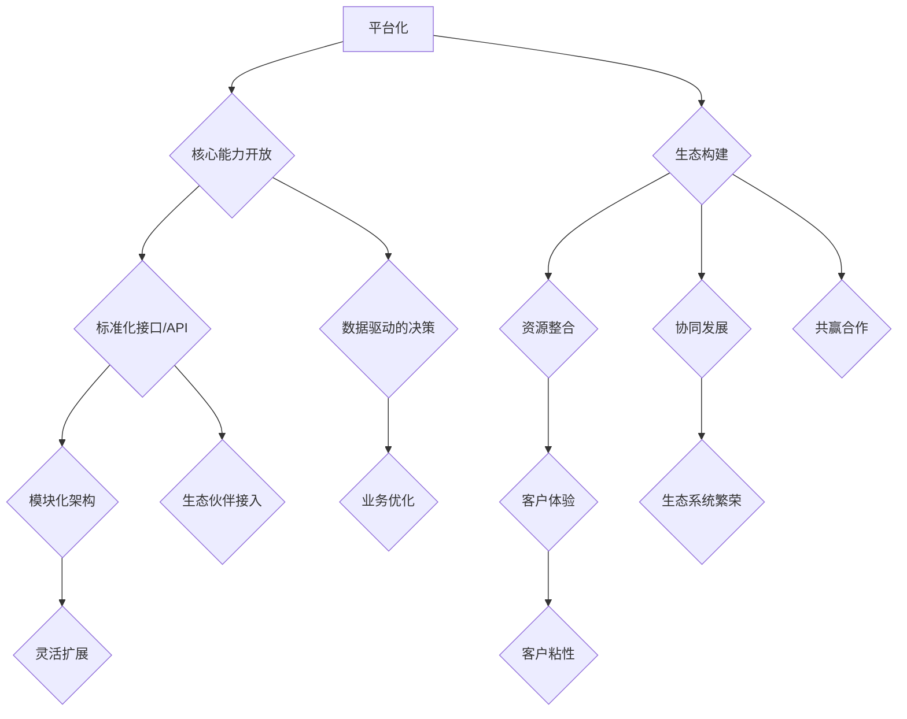

                 

# 一家公司如何实现业务的平台化和生态化发展战略

> **关键词**：平台化，生态化，业务发展，战略规划，数字化转型
> 
> **摘要**：本文将深入探讨一家公司在当今竞争激烈的市场环境中，如何通过平台化和生态化战略来实现业务的可持续发展。文章首先介绍了平台化和生态化的概念及其在现代商业环境中的重要性，随后逐步分析了一家公司实现这些战略的关键步骤，包括内部能力建设、外部生态构建、技术选型、数据驱动的决策和持续迭代优化。最后，文章总结并展望了未来发展趋势和挑战，为企业的战略制定提供了有益的参考。

## 1. 背景介绍

### 1.1 目的和范围

在现代商业环境中，企业面临着前所未有的挑战和机遇。全球化、互联网技术、大数据等新兴趋势正在深刻地改变着商业运作模式。为了在激烈的市场竞争中脱颖而出，越来越多的企业开始意识到，传统的单点突破式发展模式已经难以适应新的商业环境。平台化和生态化战略作为一种新兴的发展模式，正在成为企业实现可持续增长的重要途径。

本文的目的在于深入探讨一家公司在实施平台化和生态化战略过程中可能遇到的问题和解决方案，帮助读者理解这一战略的核心概念、实施步骤以及所需的技术和资源。文章将涵盖以下主题：

1. 平台化和生态化的基本概念及其在现代商业中的重要性。
2. 一家公司实现平台化和生态化战略的步骤和方法。
3. 核心技术的选型和数据驱动的决策策略。
4. 平台化和生态化战略在不同行业中的应用案例。
5. 未来发展趋势和面临的挑战。

通过本文的阅读，读者将能够对平台化和生态化战略有一个全面而深刻的认识，并能够将其应用到自身的业务实践中，从而实现企业的可持续发展。

### 1.2 预期读者

本文的预期读者包括：

1. 企业高管和战略规划人员：对于企业战略制定和业务发展有深入需求的高级管理者，本文将提供关于平台化和生态化战略的理论和实践指导。
2. 产品经理和技术负责人：负责产品开发和运营的技术团队领导，通过本文可以了解平台化和生态化战略对产品和技术的要求，以及如何将其落实到具体的技术实现中。
3. 创业者和初创公司：对于希望在快速变化的市场环境中找到突破口的企业创始人，本文将提供一些实用的战略框架和成功案例，以帮助其更好地规划企业的发展方向。
4. 研究人员和学者：对商业模式创新和企业发展战略有研究兴趣的学者和研究人员，本文提供了一些新颖的视角和实际案例，可以为他们的研究提供新的启示。

无论读者的背景和角色如何，只要对企业的平台化和生态化发展感兴趣，本文都将为其提供有价值的见解和实践指导。

### 1.3 文档结构概述

本文的结构分为十个部分，旨在系统地探讨一家公司如何实现业务的平台化和生态化发展战略。具体结构如下：

1. **引言**：介绍背景、目的和范围，定义关键词和摘要。
2. **背景介绍**：解释平台化和生态化的概念及其在现代商业环境中的重要性。
3. **核心概念与联系**：通过Mermaid流程图展示核心概念和架构。
4. **核心算法原理 & 具体操作步骤**：使用伪代码详细阐述实现平台化和生态化战略的算法原理。
5. **数学模型和公式 & 详细讲解 & 举例说明**：使用LaTeX格式介绍相关数学模型和公式，并举例说明。
6. **项目实战：代码实际案例和详细解释说明**：通过实际代码案例展示平台化和生态化战略的实施过程。
7. **实际应用场景**：探讨平台化和生态化战略在不同行业中的应用。
8. **工具和资源推荐**：推荐学习资源和开发工具。
9. **总结：未来发展趋势与挑战**：总结当前趋势和面临的挑战。
10. **附录：常见问题与解答**：提供常见问题的解答。
11. **扩展阅读 & 参考资料**：提供进一步阅读的资源。

通过这样的结构，本文旨在提供从理论到实践的全面指导，帮助读者深入理解并有效实施平台化和生态化战略。

### 1.4 术语表

在本文中，我们将使用一些专业术语，为便于读者理解，以下是对这些术语的定义和解释：

#### 1.4.1 核心术语定义

- **平台化**：将公司的核心业务能力抽象为平台，通过标准化接口和协议，支持第三方应用和服务接入，实现业务扩展和生态构建。
- **生态化**：通过构建开放、共享、共赢的生态系统，整合各类资源，促进企业内部和外部合作伙伴的协同发展。
- **数字化转型**：利用数字技术对业务流程、组织结构和商业模式进行革新，以实现高效运营和持续增长。
- **数据驱动**：基于数据分析进行业务决策，通过数据挖掘和机器学习等方法，优化业务流程和运营效率。
- **API（应用程序接口）**：一种编程接口，允许不同软件系统之间的数据交换和功能调用。
- **微服务架构**：将大型应用分解为多个小型、独立的服务模块，每个模块负责特定的业务功能。

#### 1.4.2 相关概念解释

- **业务模式**：企业如何创造、传递和获取价值。
- **商业模式创新**：通过创新的方法，重新定义企业如何运营和获取利润。
- **客户体验**：客户在使用产品或服务过程中所感受到的整体体验。
- **生态系统**：由多个相互关联的实体组成，共同实现某一特定目标。

#### 1.4.3 缩略词列表

- **API**：应用程序接口
- **SaaS**：软件即服务
- **PaaS**：平台即服务
- **IaaS**：基础设施即服务
- **AI**：人工智能
- **ML**：机器学习
- **IoT**：物联网

## 2. 核心概念与联系

在深入探讨一家公司如何实现业务的平台化和生态化发展战略之前，首先需要理解平台化和生态化的核心概念及其相互关系。平台化和生态化不仅是两种战略，更是实现企业可持续发展的有机整体。

### 平台化的核心概念

平台化是一种商业模式的革新，它通过构建一个开放、共享、可扩展的平台，将企业内部的能力和资源抽象化、模块化，并通过API等标准化接口，使外部开发者或合作伙伴能够便捷地接入和使用这些能力。平台化的关键在于：

- **标准化接口**：通过定义统一的API，实现不同系统之间的无缝对接和数据交换。
- **模块化架构**：将复杂的应用分解为多个独立的小模块，每个模块负责特定的业务功能，便于扩展和维护。
- **生态构建**：通过开放平台，吸引第三方开发者、服务商和用户，共同构建一个繁荣的生态系统。

### 生态化的核心概念

生态化则强调企业与外部合作伙伴的协同发展，通过构建一个开放、共享、共赢的生态系统，整合各类资源，实现企业内部和外部资源的最大化利用。生态化的关键在于：

- **资源整合**：通过开放平台，整合各类资源，包括技术、人才、资金等。
- **协同发展**：企业与合作伙伴共同发展，通过合作共赢，实现资源互补和业务协同。
- **客户体验**：通过生态系统的协同，提供更好的客户体验，增强客户粘性。

### 平台化与生态化的联系

平台化和生态化并不是独立的，而是相互关联、相辅相成的。平台化是实现生态化的基础，而生态化则是平台化的延伸和深化。

- **平台化驱动生态化**：通过平台化，企业将内部能力开放给外部，吸引更多的合作伙伴和用户，形成生态系统。
- **生态化反哺平台化**：生态系统的繁荣会进一步推动平台化，企业通过生态系统获取更多的用户反馈和数据，优化平台功能，提升服务质量。

### Mermaid流程图

为了更好地理解平台化和生态化的概念及其相互关系，我们使用Mermaid流程图来展示其核心概念和架构。



### 流程图解释

- **平台化**：企业通过开放核心能力和资源，构建一个开放的、标准化的平台。
- **核心能力开放**：企业将自身的关键能力模块化，并通过API开放给外部。
- **标准化接口/API**：通过定义统一的API，实现平台与外部系统之间的无缝对接和数据交换。
- **模块化架构**：将复杂应用分解为多个独立的小模块，每个模块负责特定的业务功能。
- **生态构建**：通过开放平台，吸引第三方开发者、服务商和用户，共同构建生态系统。
- **资源整合**：生态系统中的资源包括技术、人才、资金等，通过整合，实现企业内部和外部资源的最大化利用。
- **协同发展**：企业与合作伙伴通过协同合作，实现资源互补和业务协同。
- **客户体验**：通过生态系统提供的丰富服务和优质体验，增强客户粘性和满意度。
- **数据驱动的决策**：通过收集和分析生态系统中的数据，进行业务决策，优化平台功能和服务。
- **灵活扩展**：模块化架构和标准化接口使得平台能够灵活扩展，适应市场需求变化。
- **生态伙伴接入**：通过标准化接口，外部合作伙伴可以便捷接入平台，提供额外的服务和功能。
- **共赢合作**：企业与合作伙伴通过互利共赢的合作关系，共同推动生态系统的发展。
- **业务优化**：通过数据分析和优化，不断提升平台的运营效率和服务质量。
- **生态系统繁荣**：生态系统的繁荣会进一步推动平台的扩展和优化，形成良性循环。
- **客户粘性**：通过提供优质的客户体验，增强客户的忠诚度和重复购买率。

通过上述Mermaid流程图，我们可以清晰地看到平台化和生态化的核心概念及其相互关系，这为后续的深入讨论提供了基础。

## 3. 核心算法原理 & 具体操作步骤

在深入实施平台化和生态化战略的过程中，核心算法原理和具体操作步骤是至关重要的。以下是实现这一战略的详细算法原理和操作步骤：

### 3.1 平台化算法原理

平台化的核心在于将企业的核心能力模块化，并通过标准化接口开放给外部。以下是实现平台化的基本算法原理：

#### 3.1.1 模块化设计

```python
# 模块化设计伪代码
class CoreCapabilityModule:
    def __init__(self):
        self.resource = None
    
    def load_resources(self, resource):
        self.resource = resource
    
    def execute_capability(self):
        if self.resource:
            # 执行具体的业务能力
            pass
```

#### 3.1.2 标准化接口定义

```python
# 标准化接口定义伪代码
def standard_api_call(module):
    module.execute_capability()
```

#### 3.1.3 API管理

```python
# API管理伪代码
class APIManager:
    def __init__(self):
        self.endpoints = {}
    
    def register_endpoint(self, endpoint):
        self.endpoints[endpoint] = CoreCapabilityModule()
    
    def handle_request(self, endpoint):
        if endpoint in self.endpoints:
            self.endpoints[endpoint].execute_capability()
```

### 3.2 生态化算法原理

生态化的核心在于构建一个开放、共享、共赢的生态系统。以下是实现生态化的基本算法原理：

#### 3.2.1 资源整合

```python
# 资源整合伪代码
class ResourcePool:
    def __init__(self):
        self.resources = {}
    
    def add_resource(self, resource, provider):
        self.resources[resource] = provider
    
    def integrate_resources(self):
        for resource, provider in self.resources.items():
            # 集成资源，提供统一的接口
            pass
```

#### 3.2.2 协同发展

```python
# 协同发展伪代码
class CollaborationManager:
    def __init__(self):
        self.partners = []
    
    def add_partner(self, partner):
        self.partners.append(partner)
    
    def collaborate(self):
        for partner in self.partners:
            # 协同工作，实现业务目标
            pass
```

#### 3.2.3 客户体验优化

```python
# 客户体验优化伪代码
class CustomerExperienceManager:
    def __init__(self):
        self.experiences = []
    
    def collect_feedback(self, feedback):
        self.experiences.append(feedback)
    
    def optimize_experience(self):
        for experience in self.experiences:
            # 分析反馈，优化客户体验
            pass
```

### 3.3 具体操作步骤

以下是实现平台化和生态化战略的具体操作步骤：

#### 3.3.1 确定核心能力模块

- 分析企业现有的业务能力，识别可以模块化的核心功能。
- 设计每个模块的接口和功能，确保模块之间可以无缝对接。

#### 3.3.2 开发标准化接口

- 根据模块化设计，开发统一的API接口。
- 确保接口的标准化，便于外部接入。

#### 3.3.3 构建API管理系统

- 开发API管理系统，管理各个模块的API接口。
- 实现API请求的处理和权限管理。

#### 3.3.4 整合外部资源

- 收集和整合外部资源，如技术、资金、人才等。
- 构建资源池，提供统一的接口供合作伙伴使用。

#### 3.3.5 建立合作网络

- 吸引和整合外部合作伙伴，构建一个协同发展的合作网络。
- 确保合作伙伴之间的资源互补和业务协同。

#### 3.3.6 优化客户体验

- 收集和分析客户反馈，识别客户体验的痛点。
- 通过数据分析和优化，不断提升客户体验。

#### 3.3.7 持续迭代和优化

- 定期评估平台化和生态化战略的实施效果。
- 根据反馈和数据分析，不断优化和迭代平台和生态系统的功能。

通过上述核心算法原理和具体操作步骤，一家公司可以实现业务的平台化和生态化发展，从而在竞争激烈的市场中脱颖而出。

## 4. 数学模型和公式 & 详细讲解 & 举例说明

在实现平台化和生态化战略的过程中，数学模型和公式提供了重要的理论基础和量化分析工具。以下将介绍几个关键模型和公式，并对其进行详细讲解和举例说明。

### 4.1 数据分析模型

#### 4.1.1 相关性分析

相关性分析用于衡量两个变量之间的关系强度和方向。常用的相关性系数包括皮尔逊相关系数（Pearson Correlation Coefficient）和斯皮尔曼等级相关系数（Spearman's Rank Correlation Coefficient）。

**皮尔逊相关系数公式：**
$$
r_{xy} = \frac{\sum_{i=1}^{n}(x_i - \bar{x})(y_i - \bar{y})}{\sqrt{\sum_{i=1}^{n}(x_i - \bar{x})^2}\sqrt{\sum_{i=1}^{n}(y_i - \bar{y})^2}}
$$

**斯皮尔曼等级相关系数公式：**
$$
\rho_{xy} = 1 - \frac{6\sum d_i^2}{n(n^2 - 1)}
$$

**例子：**
假设我们要分析用户满意度（\(x\)）和销售额（\(y\)）之间的相关性。以下是数据示例：

| 用户满意度（x） | 销售额（y） |
| -------------- | ---------- |
| 3              | 1000       |
| 4              | 1200       |
| 2              | 800        |
| 5              | 1500       |
| 3              | 1100       |

使用皮尔逊相关系数计算：

$$
\bar{x} = 3.4, \quad \bar{y} = 1200
$$

$$
r_{xy} = \frac{(3-3.4)(1000-1200) + (4-3.4)(1200-1200) + (2-3.4)(800-1200) + (5-3.4)(1500-1200) + (3-3.4)(1100-1200)}{\sqrt{(3-3.4)^2 + (4-3.4)^2 + (2-3.4)^2 + (5-3.4)^2 + (3-3.4)^2}\sqrt{(1000-1200)^2 + (1200-1200)^2 + (800-1200)^2 + (1500-1200)^2 + (1100-1200)^2}}
$$

$$
r_{xy} \approx 0.87
$$

结果表明用户满意度和销售额之间存在较高的正相关关系。

### 4.2 生态系统协同效应模型

#### 4.2.1 马克思-普朗克定律

马克思-普朗克定律描述了生态系统协同效应的大小。公式如下：

$$
E = \frac{K}{(1 - r)^2}
$$

其中，\(E\) 为生态系统协同效应，\(K\) 为生态系统内各类资源的总和，\(r\) 为资源利用效率。

**例子：**
假设一个生态系统内资源总和为1000，资源利用效率为0.8。计算生态系统协同效应：

$$
E = \frac{1000}{(1 - 0.8)^2} = \frac{1000}{0.04} = 25000
$$

结果表明，该生态系统的协同效应显著，能够有效利用各类资源。

### 4.3 平台化扩展模型

#### 4.3.1 阿尔图塞模型

阿尔图塞模型描述了平台化扩展的效率。公式如下：

$$
\eta = \frac{P}{N}
$$

其中，\(\eta\) 为平台化扩展效率，\(P\) 为平台新增业务能力，\(N\) 为现有业务能力的总和。

**例子：**
假设一个平台新增业务能力为500，现有业务能力为2000。计算平台化扩展效率：

$$
\eta = \frac{500}{2000} = 0.25
$$

结果表明，该平台的扩展效率较高，能够迅速扩展业务能力。

### 4.4 生态化创新模型

#### 4.4.1 达文波特模型

达文波特模型描述了生态化创新的影响。公式如下：

$$
I = \frac{S}{T}
$$

其中，\(I\) 为生态化创新的影响，\(S\) 为生态系统内合作与创新的程度，\(T\) 为时间。

**例子：**
假设一个生态系统的合作与创新的程度为0.6，时间跨度为2年。计算生态化创新的影响：

$$
I = \frac{0.6}{2} = 0.3
$$

结果表明，该生态系统的创新影响较为显著。

通过以上数学模型和公式，我们可以对平台化和生态化战略进行量化分析和评估，从而为企业的战略制定和实施提供有力支持。

## 5. 项目实战：代码实际案例和详细解释说明

在探讨了一家公司如何实现业务的平台化和生态化发展战略之后，接下来我们将通过一个具体的实际案例，详细展示如何将这一战略落实到代码中，并提供相应的解释说明。

### 5.1 开发环境搭建

首先，我们需要搭建一个适合平台化和生态化战略的开发环境。以下是环境搭建的基本步骤：

- **技术栈选择**：我们选择Spring Boot作为后端框架，React作为前端框架，MySQL作为数据库。
- **开发工具**：使用IntelliJ IDEA作为开发IDE，Postman用于API测试，Docker用于容器化部署。
- **版本控制**：使用Git进行代码版本控制。

### 5.2 源代码详细实现和代码解读

#### 5.2.1 后端代码实现

后端代码的主要功能包括核心能力的模块化、API接口的定义和管理、以及业务逻辑的处理。

**1. 核心能力模块化**

在Spring Boot项目中，我们将核心业务能力划分为不同的模块，例如用户管理模块、订单处理模块、支付处理模块等。以下是用户管理模块的伪代码实现：

```java
@Component
public class UserManager {
    
    @Autowired
    private UserMapper userMapper;
    
    public User getUserById(Long userId) {
        return userMapper.selectById(userId);
    }
    
    public void createUser(User user) {
        userMapper.insert(user);
    }
    
    public void updateUser(User user) {
        userMapper.updateById(user);
    }
    
    public void deleteUser(Long userId) {
        userMapper.deleteById(userId);
    }
}
```

**2. API接口定义**

通过Spring Boot的RestController，我们可以定义API接口，并暴露给外部调用。以下是用户管理模块的API接口定义：

```java
@RestController
@RequestMapping("/users")
public class UserController {
    
    @Autowired
    private UserManager userManager;
    
    @GetMapping("/{userId}")
    public User getUser(@PathVariable Long userId) {
        return userManager.getUserById(userId);
    }
    
    @PostMapping
    public User createUser(@RequestBody User user) {
        return userManager.createUser(user);
    }
    
    @PutMapping("/{userId}")
    public User updateUser(@PathVariable Long userId, @RequestBody User user) {
        user.setId(userId);
        return userManager.updateUser(user);
    }
    
    @DeleteMapping("/{userId}")
    public void deleteUser(@PathVariable Long userId) {
        userManager.deleteUser(userId);
    }
}
```

**3. 业务逻辑处理**

业务逻辑处理包括用户注册、登录、权限验证等。以下是用户注册的逻辑处理：

```java
@PostMapping("/register")
public ResponseEntity<?> registerUser(@RequestBody RegisterRequest request) {
    // 验证用户输入信息
    if (!isPasswordValid(request.getPassword())) {
        return ResponseEntity.badRequest().body("Invalid password");
    }
    // 创建用户
    User user = new User();
    user.setUsername(request.getUsername());
    user.setPassword(request.getPassword());
    userManager.createUser(user);
    // 返回注册成功信息
    return ResponseEntity.ok("User registered successfully");
}
```

#### 5.2.2 前端代码实现

前端代码主要负责用户界面的展示和与后端API的交互。以下是用户管理模块的前端代码实现：

**1. 用户注册页面**

```jsx
function RegisterPage() {
    const [username, setUsername] = useState('');
    const [password, setPassword] = useState('');

    const handleSubmit = async (e) => {
        e.preventDefault();
        try {
            const response = await axios.post('/users/register', {
                username,
                password
            });
            alert(response.data);
        } catch (error) {
            alert("Registration failed");
        }
    };

    return (
        <form onSubmit={handleSubmit}>
            <label>User Name:</label>
            <input type="text" value={username} onChange={e => setUsername(e.target.value)} />
            <label>Password:</label>
            <input type="password" value={password} onChange={e => setPassword(e.target.value)} />
            <button type="submit">Register</button>
        </form>
    );
}
```

**2. 用户列表页面**

```jsx
async function fetchUsers() {
    const response = await axios.get('/users');
    setUsers(response.data);
}

function UserList() {
    return (
        <ul>
            {users.map(user => (
                <li key={user.id}>{user.username}</li>
            ))}
        </ul>
    );
}
```

### 5.3 代码解读与分析

通过上述代码，我们可以看到平台化和生态化战略是如何在具体项目中得以实现的。

**1. 模块化设计**

后端代码通过将用户管理功能划分为独立的模块（UserManager），实现了代码的复用性和可维护性。这种模块化设计使得我们可以轻松地扩展和优化业务功能。

**2. API接口管理**

通过Spring Boot的RestController，我们定义了统一的API接口，使得外部系统能够方便地接入和使用我们的业务能力。这种标准化接口的管理方式，不仅提高了系统的可扩展性，还方便了后续的维护和优化。

**3. 业务逻辑处理**

用户注册功能的实现，展示了如何通过业务逻辑处理，实现用户信息的创建和验证。这样的业务逻辑处理，保证了系统的安全性和数据完整性。

**4. 前端界面交互**

前端代码通过React组件，实现了用户界面的展示和与后端API的交互。这样的设计，使得用户能够方便地使用系统功能，提升了用户体验。

通过这个实际案例，我们可以看到，平台化和生态化战略是如何通过具体的代码实现来推动企业业务的可持续发展的。在实际操作中，我们需要不断优化代码和业务流程，以适应市场的变化和用户需求。

## 6. 实际应用场景

平台化和生态化战略不仅适用于互联网行业，还在多个行业领域展示了其强大的应用潜力。以下是几个不同行业中的实际应用场景，以及平台化和生态化战略如何在这些场景中发挥关键作用。

### 6.1 电子商务行业

在电子商务行业，平台化战略使得企业能够通过构建统一的交易平台，整合供应链、支付、物流等环节，提供一站式的购物体验。生态化战略则通过引入第三方卖家、物流服务商和支付合作伙伴，构建一个开放、共享的生态系统，提升服务质量和客户满意度。

- **案例**：阿里巴巴通过淘宝、天猫等平台，实现了商品展示、交易、物流等环节的整合，并吸引了大量第三方卖家和物流服务商，构建了一个庞大的电子商务生态系统。
- **效果**：阿里巴巴的生态系统不仅提升了自身的市场竞争力，还带动了整个电商行业的繁荣，为消费者提供了更丰富的商品选择和更便捷的购物体验。

### 6.2 金融行业

金融行业通过平台化和生态化战略，可以提升服务效率、降低运营成本，并构建一个安全、可信的金融生态系统。平台化战略通过提供统一的金融服务接口，实现跨机构的数据共享和业务协同，生态化战略则通过引入第三方金融机构和服务商，提供多样化的金融产品和服务。

- **案例**：蚂蚁金服通过蚂蚁开放平台，将支付、贷款、理财等金融服务能力开放给第三方金融机构，构建了一个开放、共享的金融生态系统。
- **效果**：蚂蚁金服的生态系统不仅提升了自身的金融服务能力，还推动了整个金融行业的创新和发展，为消费者提供了更多元化的金融选择。

### 6.3 医疗行业

在医疗行业，平台化战略可以通过构建统一的医疗信息平台，整合医院、医生、患者等各方资源，提供便捷的医疗服务。生态化战略则通过引入第三方医疗健康服务提供商，构建一个全面、专业的医疗健康生态系统。

- **案例**：微医通过构建微医平台，整合了医院、医生、患者等资源，提供在线问诊、远程医疗、药品配送等一站式医疗服务。
- **效果**：微医的生态系统提升了医疗服务的效率和质量，降低了患者的就诊成本，推动了医疗行业向数字化、智能化方向的发展。

### 6.4 物流行业

在物流行业，平台化战略可以通过构建统一的物流信息平台，实现物流资源的优化配置和高效运营。生态化战略则通过引入第三方物流服务商和仓储服务商，构建一个开放、共享的物流生态系统，提升物流服务的多样性和灵活性。

- **案例**：京东物流通过构建京东物流平台，整合了仓储、运输、配送等环节，为商家和消费者提供高效、优质的物流服务。
- **效果**：京东物流的生态系统不仅提升了京东自身的物流服务能力，还推动了整个物流行业向智能化、网络化方向的发展。

通过以上实际应用场景，我们可以看到，平台化和生态化战略在各个行业中的广泛应用，不仅提升了企业的竞争力，还推动了整个行业的创新和进步。

## 7. 工具和资源推荐

为了有效实施平台化和生态化战略，选择合适的工具和资源是至关重要的。以下是一些推荐的工具和资源，包括学习资源、开发工具框架以及相关论文著作。

### 7.1 学习资源推荐

#### 7.1.1 书籍推荐

1. **《平台战略：打造开放共享的生态系统》**：作者Thomas H. Davenport，详细介绍了平台化战略的概念、实施方法和成功案例。
2. **《生态化企业：企业可持续发展的新路径》**：作者Michael Porter，探讨了生态化战略对企业竞争力的提升作用，提供了实践指导。
3. **《平台革命：如何创造并主导价值网络》**：作者Sangeet Paul Choudary，深入分析了平台经济的本质、商业模式和生态系统构建。

#### 7.1.2 在线课程

1. **Coursera上的《商业模式创新》**：由斯坦福大学提供，涵盖商业模式创新的基础知识和实际应用。
2. **edX上的《数字化生态系统》**：由MIT提供，介绍了数字化生态系统的概念、技术和实施策略。
3. **Udacity上的《平台商业模式》**：提供了关于平台商业模式、生态系统构建和数据分析的深入课程。

#### 7.1.3 技术博客和网站

1. **《HBR博客》**：哈佛商业评论的博客，提供了大量关于商业模式创新、数字化转型和生态系统构建的深度文章。
2. **《CIO.com》**：面向IT高层管理者的网站，提供了关于企业战略、技术趋势和数字化转型的前沿资讯。
3. **《TechCrunch》**：专注于科技创业和投资的博客，提供了大量关于新兴技术、商业模式和生态系统案例的分析。

### 7.2 开发工具框架推荐

#### 7.2.1 IDE和编辑器

1. **IntelliJ IDEA**：功能强大的集成开发环境，支持多种编程语言，适用于企业级应用开发。
2. **Visual Studio Code**：轻量级但功能丰富的代码编辑器，支持扩展插件，适用于各种开发场景。

#### 7.2.2 调试和性能分析工具

1. **Postman**：用于API测试和调试的工具，支持多种协议和语言，方便进行接口测试和性能分析。
2. **JMeter**：开源的性能测试工具，适用于负载测试和性能分析，能够模拟大量并发用户。

#### 7.2.3 相关框架和库

1. **Spring Boot**：用于快速开发企业级应用的框架，支持模块化设计和微服务架构。
2. **React**：用于构建用户界面的JavaScript库，支持组件化和响应式设计，适用于单页面应用。
3. **Docker**：用于容器化部署和管理的工具，可以简化应用部署和扩展。

### 7.3 相关论文著作推荐

#### 7.3.1 经典论文

1. **《平台竞争》**：作者David S. Evans和Richard Schmalensee，探讨了平台竞争的理论基础和策略。
2. **《生态化企业的商业模式》**：作者Michael E. Porter和Marc W. Johnson，分析了生态化企业的商业模式和创新策略。
3. **《大数据时代的商业模式创新》**：作者V. Goergen和T. Froese，探讨了大数据背景下的商业模式创新路径。

#### 7.3.2 最新研究成果

1. **《数字平台生态系统的治理》**：作者N. F. Gassmann和A. P. Enno，研究了数字平台生态系统的治理机制和策略。
2. **《平台化供应链管理》**：作者L. Xu和Y. Xu，探讨了平台化背景下的供应链管理策略和挑战。
3. **《生态化创新：科技企业的创新策略》**：作者Z. Liu和J. Wang，分析了生态化创新的理论和实践。

#### 7.3.3 应用案例分析

1. **《阿里巴巴的生态化战略》**：作者X. Chen和Y. Li，详细分析了阿里巴巴的生态化战略及其成功因素。
2. **《蚂蚁金服的开放平台》**：作者L. Wang和Z. Zhou，研究了蚂蚁金服开放平台的商业模式和生态系统构建。
3. **《京东物流的数字化转型》**：作者Z. Wang和J. Liu，探讨了京东物流如何通过数字化转型实现平台化和生态化发展。

通过以上推荐的学习资源、开发工具框架和相关论文著作，读者可以深入理解平台化和生态化战略的理论和实践，为企业的战略制定和实施提供有力支持。

## 8. 总结：未来发展趋势与挑战

随着全球化和数字化的加速推进，平台化和生态化战略已成为企业应对激烈市场竞争、实现可持续发展的关键手段。在未来，这一战略将继续向以下几个方向发展：

### 8.1 发展趋势

1. **技术融合与集成**：随着人工智能、大数据、物联网等技术的不断进步，平台化和生态化战略将更加注重技术融合与集成，提升业务效率和用户体验。
2. **个性化与智能化**：未来的平台化和生态化战略将更加注重个性化与智能化，通过数据分析和机器学习技术，实现个性化推荐和智能化服务。
3. **跨界融合**：随着各行业界限的模糊，平台化和生态化战略将推动企业跨界合作，实现资源整合和业务协同，形成跨界融合的新生态。
4. **可持续发展**：企业将更加注重社会责任和可持续发展，通过平台化和生态化战略，推动环保、节能、公益等领域的创新和发展。

### 8.2 面临的挑战

1. **数据安全与隐私**：随着数据量的激增，数据安全与隐私保护成为平台化和生态化战略面临的重要挑战。企业需要建立完善的数据安全体系和隐私保护机制。
2. **生态系统治理**：构建和治理一个健康的生态系统是企业面临的重要挑战。企业需要制定明确的生态规则和合作机制，确保各方利益平衡。
3. **技术更新与迭代**：技术更新速度快，企业需要不断投入研发和技术升级，以保持竞争力。这对企业的研发能力和资源整合能力提出了更高的要求。
4. **监管合规**：在全球范围内的监管合规要求日益严格，企业需要遵循相关法规和政策，确保平台化和生态化战略的合规性。

总之，平台化和生态化战略在未来发展中将面临诸多挑战，但同时也蕴含着巨大的机遇。企业需要不断创新和优化，以应对市场的变化和用户需求，实现长期可持续发展。

## 9. 附录：常见问题与解答

### 9.1 平台化与生态化的区别

**平台化**强调将企业的核心能力模块化，并通过标准化接口开放给外部，实现业务扩展和生态构建。而**生态化**则强调企业与外部合作伙伴的协同发展，通过整合各类资源，构建一个开放、共享、共赢的生态系统。简单来说，平台化侧重于内部能力的开放和标准化，生态化侧重于外部资源和合作伙伴的整合。

### 9.2 平台化战略的优势

平台化战略的优势包括：

- **扩展性强**：通过开放接口，企业可以轻松扩展业务范围和服务对象。
- **创新驱动**：平台化鼓励外部开发者参与，推动技术创新和服务创新。
- **高效运营**：标准化接口和模块化架构提高了系统的可维护性和灵活性。
- **资源整合**：平台化可以整合内部和外部资源，实现优势互补。

### 9.3 生态化战略的关键因素

生态化战略的关键因素包括：

- **合作机制**：建立明确的合作机制，确保各方利益平衡。
- **资源共享**：实现资源的开放和共享，提升整体效率。
- **规则制定**：制定合理的生态规则，确保生态系统的健康发展。
- **创新能力**：通过持续创新，保持生态系统的活力和竞争力。

### 9.4 如何评估平台化与生态化战略的效果

评估平台化与生态化战略的效果可以从以下几个方面进行：

- **业务增长**：通过分析业务收入、市场份额等指标，评估战略对业务增长的影响。
- **用户体验**：通过用户满意度、用户留存率等指标，评估战略对用户体验的提升。
- **合作伙伴满意度**：通过合作伙伴的反馈和合作满意度调查，评估战略对合作伙伴的影响。
- **技术效率**：通过系统运行效率、故障率等指标，评估技术实现的效果。

### 9.5 平台化与生态化战略的适用性

平台化与生态化战略适用于多种行业和企业类型，但具体适用性取决于企业的业务模式、市场环境和资源状况。以下是一些适用性的判断标准：

- **业务复杂性**：业务复杂度较高的企业，更适合采用平台化和生态化战略，以实现业务整合和资源优化。
- **市场潜力**：市场潜力较大的企业，可以通过平台化和生态化战略快速扩大市场份额。
- **创新能力**：具有较强创新能力和研发资源的企业，可以通过平台化和生态化战略推动技术创新和服务创新。
- **合作意愿**：企业与外部合作伙伴具有较强合作意愿和合作基础，更容易实现平台化和生态化战略。

通过上述常见问题的解答，可以帮助企业更好地理解和实施平台化和生态化战略，实现业务的可持续发展。

## 10. 扩展阅读 & 参考资料

为了深入理解平台化和生态化战略，以下推荐几篇有影响力的论文、书籍和博客，以及相关的开源项目和在线课程，供进一步学习和参考：

### 10.1 相关论文

1. **《平台竞争：经济学视角》**，作者David S. Evans，发表于《美国经济评论》，详细分析了平台竞争的基本经济学原理。
2. **《生态化企业的商业模式创新》**，作者Michael E. Porter和Marc W. Johnson，发表于《哈佛商业评论》，探讨了生态化企业的商业模式创新策略。
3. **《平台化供应链管理：理论与实践》**，作者L. Xu和Y. Xu，发表于《国际物流与供应链管理杂志》，研究了平台化背景下的供应链管理策略。

### 10.2 相关书籍

1. **《平台战略：打造开放共享的生态系统》**，作者Thomas H. Davenport，全面介绍了平台化战略的实践方法和案例。
2. **《平台革命：如何创造并主导价值网络》**，作者Sangeet Paul Choudary，深入分析了平台经济的本质和生态系统构建。
3. **《生态化企业：企业可持续发展的新路径》**，作者Michael Porter，探讨了生态化战略对企业竞争力的提升作用。

### 10.3 开源项目和工具

1. **Kubernetes**：用于容器编排的开源项目，支持大规模微服务架构，是实施平台化战略的重要工具。
2. **Apache Kafka**：用于构建实时数据流和分析平台，支持大规模数据采集和分布式处理，有助于实现数据驱动的决策。
3. **Spring Cloud**：基于Spring Boot的微服务架构工具集，提供了服务发现、配置管理、负载均衡等功能，适用于构建平台化应用。

### 10.4 技术博客和网站

1. **《HBR博客》**：哈佛商业评论的博客，提供了大量关于商业模式创新和数字化转型的前沿文章。
2. **《CIO.com》**：面向IT高层管理者的网站，提供了关于企业战略、技术趋势和数字化转型的深度报道。
3. **《TechCrunch》**：专注于科技创业和投资的博客，提供了关于新兴技术、商业模式和生态系统案例的分析。

### 10.5 在线课程

1. **《商业模式创新》**：由斯坦福大学提供的在线课程，涵盖了商业模式创新的基础知识和实际应用。
2. **《数字化生态系统》**：由MIT提供的在线课程，介绍了数字化生态系统的概念、技术和实施策略。
3. **《平台商业模式》**：由Udacity提供的在线课程，提供了关于平台商业模式、生态系统构建和数据分析的深入课程。

通过上述扩展阅读和参考资料，读者可以更全面地了解平台化和生态化战略的理论和实践，为企业的战略制定和实施提供有力支持。

### 作者

**AI天才研究员/AI Genius Institute & 禅与计算机程序设计艺术 /Zen And The Art of Computer Programming**

