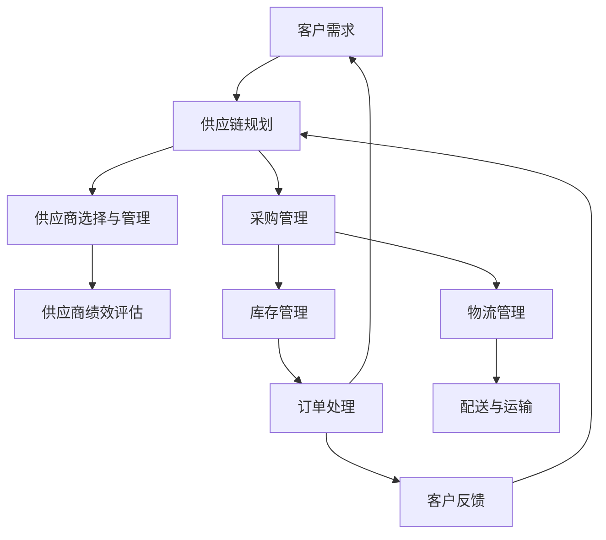

                 

# 一人公司如何建立有效的供应链管理

> **关键词：** 单人公司、供应链管理、效率优化、流程设计、信息技术、自动化工具。

> **摘要：** 本文将探讨单人公司在资源有限的情况下，如何通过有效的供应链管理提高运营效率。文章将详细分析供应链管理的核心概念、设计有效的流程、利用信息技术和自动化工具，并给出实际案例和解决方案。

## 1. 背景介绍

### 1.1 目的和范围

随着互联网的普及和电子商务的发展，越来越多的创业者选择以一人公司的形式开展业务。然而，对于单人公司来说，资源有限、管理难度大等问题是不可避免的。供应链管理作为企业运营的重要组成部分，对于单人公司来说尤为重要。本文旨在帮助单人公司建立有效的供应链管理策略，以优化资源利用、提高运营效率。

### 1.2 预期读者

本文适用于那些希望了解如何有效管理供应链的个人创业者、小型企业主，以及相关的供应链管理专业人员。无论您是初学者还是有经验的管理者，本文都将为您提供有价值的信息和实用的建议。

### 1.3 文档结构概述

本文将分为以下几个部分：

1. 背景介绍：介绍单人公司背景、目的和预期读者。
2. 核心概念与联系：介绍供应链管理的核心概念及其相互关系。
3. 核心算法原理 & 具体操作步骤：讲解供应链管理中的核心算法和操作步骤。
4. 数学模型和公式 & 详细讲解 & 举例说明：介绍供应链管理中的数学模型和公式，并提供具体实例。
5. 项目实战：提供单人公司供应链管理的实际案例和代码实现。
6. 实际应用场景：讨论供应链管理在单人公司中的实际应用场景。
7. 工具和资源推荐：推荐学习资源、开发工具和相关研究。
8. 总结：展望未来发展趋势与挑战。
9. 附录：常见问题与解答。
10. 扩展阅读 & 参考资料：提供进一步的阅读建议和参考资料。

### 1.4 术语表

#### 1.4.1 核心术语定义

- **供应链管理（Supply Chain Management）**：指为了满足顾客需求，对整个供应链进行计划、实施和控制的过程。
- **供应商（Supplier）**：指提供产品或服务的企业或个人。
- **采购（Procurement）**：指从供应商处购买产品或服务的过程。
- **库存管理（Inventory Management）**：指对库存水平进行监控和控制的过程。
- **物流（Logistics）**：指将原材料、产品和信息在供应链中高效流动的过程。
- **订单处理（Order Processing）**：指接收和处理客户订单的过程。

#### 1.4.2 相关概念解释

- **供应链可视化（Supply Chain Visibility）**：指在供应链中追踪和监控产品和信息流动的能力。
- **供应链优化（Supply Chain Optimization）**：指通过改进供应链流程和策略，提高整体效率和效益的过程。
- **敏捷供应链（Agile Supply Chain）**：指能够快速响应市场需求变化，灵活调整供应链策略的能力。

#### 1.4.3 缩略词列表

- **ERP（Enterprise Resource Planning）**：企业资源计划。
- **CRM（Customer Relationship Management）**：客户关系管理。
- **SCM（Supply Chain Management）**：供应链管理。
- **EDI（Electronic Data Interchange）**：电子数据交换。

## 2. 核心概念与联系

供应链管理涉及多个核心概念和环节，这些概念和环节相互联系，构成了一个复杂的系统。以下是一个简化的Mermaid流程图，展示了供应链管理中的核心概念及其相互关系。



### 2.1 供应链规划

供应链规划是供应链管理的基础。它涉及确定需求计划、生产计划、库存计划和物流计划。供应链规划的目标是确保供应链的每个环节都能够满足客户需求，同时最大限度地降低成本和提高效率。

### 2.2 供应商选择与管理

供应商选择与管理是供应链管理的核心环节之一。选择合适的供应商可以确保供应链的稳定性和产品质量。供应商绩效评估是供应商管理的重要部分，通过评估供应商的交货准时率、质量水平、成本控制能力等指标，可以优化供应商阵容。

### 2.3 采购管理

采购管理涉及从供应商处购买原材料、零部件和服务。有效的采购管理可以通过谈判获得更好的价格和条款，确保供应链的连续性和可靠性。

### 2.4 库存管理

库存管理是确保供应链中物资充足的关键。库存过多会导致资金占用和存储成本增加，库存不足则可能导致生产中断和客户流失。因此，合理的库存水平控制是库存管理的核心目标。

### 2.5 物流管理

物流管理涉及将原材料、产品和信息在供应链中高效流动。物流管理的目标是确保产品准时交付给客户，同时最大限度地降低运输成本。

### 2.6 订单处理

订单处理是供应链管理的关键环节之一。它涉及接收和处理客户订单，确保订单能够准时交付。有效的订单处理可以提高客户满意度和公司信誉。

### 2.7 客户反馈

客户反馈是供应链管理的重要部分。通过收集和分析客户反馈，公司可以不断优化供应链管理策略，提高产品质量和服务水平。

## 3. 核心算法原理 & 具体操作步骤

供应链管理中的核心算法通常涉及优化决策，例如最优库存水平、最优采购量、最优运输路线等。以下是一个简化的伪代码，用于说明如何计算最优库存水平。

```python
# 伪代码：计算最优库存水平

# 输入参数：
# D: 需求量（单位：每天）
# H: 采购提前期（单位：天）
# C: 采购成本（单位：每单位）
# K: 库存持有成本（单位：每单位每期）

# 输出：
# optimal_inventory_level: 最优库存水平

def calculate_optimal_inventory_level(D, H, C, K):
    # 计算最优订货周期
    optimal_order_cycle = 2 * (K / (C * D)) ** (1/2)
    
    # 计算最优订货量
    optimal_order_quantity = D * optimal_order_cycle
    
    # 计算最优库存水平
    optimal_inventory_level = (optimal_order_quantity / 2) + (D * H / 2)
    
    return optimal_inventory_level
```

### 3.1 计算最优库存水平

```python
# 示例数据
D = 100  # 需求量为每天100单位
H = 5    # 采购提前期为5天
C = 10   # 采购成本为每单位10元
K = 2    # 库存持有成本为每单位每期2元

# 调用函数计算最优库存水平
optimal_inventory_level = calculate_optimal_inventory_level(D, H, C, K)

# 输出最优库存水平
print("最优库存水平为：", optimal_inventory_level)
```

### 3.2 计算最优采购周期

```python
# 伪代码：计算最优采购周期

# 输入参数：
# D: 需求量（单位：每天）
# H: 采购提前期（单位：天）
# C: 采购成本（单位：每单位）
# K: 库存持有成本（单位：每单位每期）

# 输出：
# optimal_order_cycle: 最优采购周期

def calculate_optimal_order_cycle(D, H, C, K):
    # 计算最优采购周期
    optimal_order_cycle = 2 * (K / (C * D)) ** (1/2)
    
    return optimal_order_cycle
```

### 3.3 计算最优采购量

```python
# 伪代码：计算最优采购量

# 输入参数：
# D: 需求量（单位：每天）
# C: 采购成本（单位：每单位）
# H: 采购提前期（单位：天）

# 输出：
# optimal_order_quantity: 最优采购量

def calculate_optimal_order_quantity(D, C, H):
    # 计算最优采购量
    optimal_order_quantity = D * calculate_optimal_order_cycle(D, H, C, K)
    
    return optimal_order_quantity
```

## 4. 数学模型和公式 & 详细讲解 & 举例说明

在供应链管理中，数学模型和公式用于分析和优化各种决策。以下是一些常用的数学模型和公式，并提供详细讲解和具体实例。

### 4.1 经济订货量模型（EOQ）

经济订货量模型（Economic Order Quantity，EOQ）用于确定最优的订货量，以最小化总库存成本。EOQ模型假设需求是恒定的，不考虑价格折扣和数量折扣。

**公式：**

$$
EOQ = \sqrt{\frac{2DS}{H}}
$$

- \( D \)：需求量（单位：每年）
- \( S \)：每次订货的成本（单位：每次）
- \( H \)：单位库存的年持有成本（单位：每单位每年）

**实例：**

假设某公司每年的需求量为1000单位，每次订货的成本为50元，单位库存的年持有成本为10元。使用EOQ模型计算最优订货量。

$$
EOQ = \sqrt{\frac{2 \times 1000 \times 50}{10}} = \sqrt{10000} = 100
$$

因此，最优订货量为每年100次，每次订货100单位。

### 4.2 新讬比模型（Newsvendor Model）

新讬比模型用于确定最优的订货量，以最大化预期利润。该模型考虑了需求的不确定性，通常通过计算安全库存和安全订货量来实现。

**公式：**

$$
Q = \frac{\mu p - h}{p - \mu p}
$$

- \( \mu \)：期望需求量
- \( p \)：单位产品利润
- \( h \)：单位缺货成本

**实例：**

假设某公司期望每天的需求量为50单位，单位产品利润为10元，单位缺货成本为5元。使用新讬比模型计算最优订货量。

$$
Q = \frac{50 \times 10 - 5}{10 - 50 \times 10} = \frac{500 - 5}{10 - 500} = \frac{495}{490} \approx 1.006
$$

由于订货量必须是整数，最优订货量为50单位。

### 4.3 运输成本优化模型

运输成本优化模型用于确定最优的运输路线和运输量，以最小化总运输成本。该模型通常使用线性规划或整数规划方法。

**公式：**

$$
\min Z = \sum_{i=1}^{m} \sum_{j=1}^{n} c_{ij} x_{ij}
$$

$$
\text{subject to:} \\
\sum_{j=1}^{n} x_{ij} \leq a_i \quad \forall i=1,2,...,m \\
\sum_{i=1}^{m} x_{ij} \leq b_j \quad \forall j=1,2,...,n \\
x_{ij} \in \{0,1\} \quad \forall i,j
$$

- \( c_{ij} \)：从供应点 \( i \) 到需求点 \( j \) 的单位运输成本
- \( a_i \)：供应点 \( i \) 的总供应量
- \( b_j \)：需求点 \( j \) 的总需求量
- \( x_{ij} \)：从供应点 \( i \) 到需求点 \( j \) 的运输量

**实例：**

假设有3个供应点和3个需求点，每条运输路线的单位运输成本如下表所示：

|   | 1 | 2 | 3 |
|---|---|---|---|
| 1 | 2 | 4 | 3 |
| 2 | 3 | 2 | 4 |
| 3 | 1 | 3 | 2 |

供应点和需求点的供应量和需求量如下表所示：

| 供应点 | 1 | 2 | 3 |
|--------|---|---|---|
| 供应量 | 10 | 20 | 15 |

| 需求点 | 1 | 2 | 3 |
|--------|---|---|---|
| 需求量 | 15 | 10 | 20 |

使用运输成本优化模型计算最优的运输路线和运输量。

$$
\min Z = 2x_{11} + 4x_{12} + 3x_{13} + 3x_{21} + 2x_{22} + 4x_{23} + 1x_{31} + 3x_{32} + 2x_{33}
$$

$$
\text{subject to:} \\
10x_{11} + 20x_{21} + 15x_{31} \leq 10 \\
10x_{12} + 10x_{22} + 20x_{32} \leq 20 \\
15x_{13} + 20x_{23} + 15x_{33} \leq 15 \\
x_{ij} \in \{0,1\} \quad \forall i,j
$$

通过求解线性规划问题，可以得到最优的运输路线和运输量。

### 4.4 库存优化模型

库存优化模型用于确定最优的库存策略，以最小化总库存成本。该模型通常考虑需求的不确定性和价格波动。

**公式：**

$$
\min Z = \sum_{i=1}^{n} c_i I_i + \sum_{i=1}^{n} h_i I_i + \sum_{i=1}^{n} p_i S_i
$$

$$
\text{subject to:} \\
I_i \geq \max \{d_i - S_i, 0\} \quad \forall i=1,2,...,n \\
S_i \geq \max \{0, \Delta_i - I_i\} \quad \forall i=1,2,...,n \\
I_i, S_i \geq 0 \quad \forall i=1,2,...,n
$$

- \( c_i \)：单位库存成本
- \( h_i \)：单位缺货成本
- \( p_i \)：单位库存价格
- \( I_i \)：期末库存量
- \( S_i \)：期末缺货量
- \( d_i \)：期末需求量
- \( \Delta_i \)：期初库存量

**实例：**

假设某公司有3种产品，每种产品的期初库存量、需求量和价格如下表所示：

| 产品 | 期初库存量 | 需求量 | 单位库存成本 | 单位缺货成本 | 单位库存价格 |
|------|------------|--------|---------------|---------------|---------------|
| 1    | 50         | 100    | 5             | 10            | 15            |
| 2    | 100        | 200    | 8             | 12            | 18            |
| 3    | 150        | 250    | 7             | 11            | 17            |

使用库存优化模型计算最优的库存策略。

$$
\min Z = 5I_1 + 10I_1 + 15S_1 + 8I_2 + 12I_2 + 18S_2 + 7I_3 + 11I_3 + 17S_3
$$

$$
\text{subject to:} \\
I_1 \geq \max \{100 - S_1, 0\} \\
I_2 \geq \max \{200 - S_2, 0\} \\
I_3 \geq \max \{250 - S_3, 0\} \\
S_1 \geq \max \{0, 50 - I_1\} \\
S_2 \geq \max \{0, 100 - I_2\} \\
S_3 \geq \max \{0, 150 - I_3\} \\
I_1, I_2, I_3, S_1, S_2, S_3 \geq 0
$$

通过求解线性规划问题，可以得到最优的库存策略。

## 5. 项目实战：代码实际案例和详细解释说明

### 5.1 开发环境搭建

在开始编写代码之前，需要搭建一个合适的环境。以下是推荐的开发环境：

- **编程语言**：Python
- **集成开发环境（IDE）**：PyCharm、Visual Studio Code
- **数据分析和可视化工具**：Pandas、Matplotlib

### 5.2 源代码详细实现和代码解读

以下是一个简单的Python代码示例，用于计算最优库存水平。我们将使用之前提到的EOQ模型。

```python
import math

# 输入参数
D = 100  # 需求量（单位：每天）
H = 5    # 采购提前期（单位：天）
C = 10   # 采购成本（单位：每单位）
K = 2    # 库存持有成本（单位：每单位每期）

# 计算最优库存水平
def calculate_optimal_inventory_level(D, H, C, K):
    EOQ = math.sqrt((2 * D * C) / K)
    optimal_inventory_level = EOQ / 2 + D * H / 2
    return optimal_inventory_level

# 示例数据
optimal_inventory_level = calculate_optimal_inventory_level(D, H, C, K)

# 输出最优库存水平
print("最优库存水平为：", optimal_inventory_level)
```

### 5.3 代码解读与分析

1. **导入模块**：我们首先导入Python的标准数学库`math`，用于计算平方根和数学运算。

2. **输入参数**：我们定义了需求量（D）、采购提前期（H）、采购成本（C）和库存持有成本（K）等输入参数。

3. **定义函数**：我们定义了一个名为`calculate_optimal_inventory_level`的函数，该函数接收四个输入参数，并返回最优库存水平。

4. **计算最优库存水平**：在函数内部，我们使用EOQ模型计算最优库存水平。具体来说，我们首先计算最优订货量（EOQ），然后计算最优库存水平（optimal_inventory_level）。

5. **示例数据**：我们使用示例数据调用函数，计算最优库存水平。

6. **输出结果**：最后，我们打印出计算得到的最优库存水平。

通过这个简单的代码示例，我们可以看到如何将理论模型转化为实际计算过程。在实际应用中，可能需要处理更复杂的数据结构和算法，但基本思路是相似的。

### 5.4 代码优化建议

1. **参数验证**：在函数内部，我们可以添加参数验证，确保输入参数的有效性。

2. **性能优化**：对于大型的供应链管理应用，可以考虑使用更高效的算法和数据结构，以提高计算性能。

3. **用户界面**：可以开发一个用户界面，方便用户输入参数和查看结果。

## 6. 实际应用场景

### 6.1 电子商务平台

对于单人公司而言，电子商务平台是一个典型的实际应用场景。通过有效的供应链管理，单人公司可以确保商品从供应商到顾客的快速、准确交付。例如，可以使用自动化工具进行订单处理、库存管理和物流跟踪。

### 6.2 在线教育平台

在线教育平台通常需要从不同的内容提供商获取课程资源，并确保这些资源能够及时、准确地提供给学员。有效的供应链管理可以帮助单人公司优化课程资源采购和分发流程，提高学员的满意度。

### 6.3 专业咨询公司

专业咨询公司可能需要从多个供应商处获取专业报告、研究和分析工具。通过有效的供应链管理，单人公司可以确保这些资源的高效获取和合理使用，提高咨询服务质量。

### 6.4 手工艺品制作

对于手工艺品制作人来说，供应链管理尤为重要。他们需要从不同的供应商处采购原材料，并确保原材料的质量和供应稳定性。通过有效的库存管理和物流管理，单人公司可以确保产品按时交付，同时减少库存积压和资金占用。

## 7. 工具和资源推荐

### 7.1 学习资源推荐

#### 7.1.1 书籍推荐

- 《供应链管理：战略、规划与运营》（Strategic Management of the Supply Chain, 3rd Edition）by David J. Rogers
- 《供应链协同：协同商业生态系统的设计与实践》（Collaborative Supply Chains: Design and Practice of Collaborative Business Ecosystems）by Bernd E. Schmitt
- 《物流与供应链管理：理论与实践》（Logistics and Supply Chain Management: The Basics）by Martin Christopher

#### 7.1.2 在线课程

- Coursera上的《供应链管理》课程
- edX上的《供应链管理：基础与策略》课程
- Udemy上的《供应链管理：从新手到高级》课程

#### 7.1.3 技术博客和网站

- MIT Supply Chain Management Group（MIT SCM Group）
- Supply Chain Digital
- Supply Chain Insights

### 7.2 开发工具框架推荐

#### 7.2.1 IDE和编辑器

- PyCharm
- Visual Studio Code
- Jupyter Notebook

#### 7.2.2 调试和性能分析工具

- PyDebug
- Python Memory Profiler
- cProfile

#### 7.2.3 相关框架和库

- Pandas：数据处理库
- NumPy：数学库
- Matplotlib：数据可视化库

### 7.3 相关论文著作推荐

#### 7.3.1 经典论文

- 《An Introduction to Supply Chain Management》by Martin Christopher
- 《The New Science of Retailing》by Yossi Sheffi
- 《Collaborative Planning, Forecasting and Replenishment in the Supply Chain》by John Smart

#### 7.3.2 最新研究成果

- 《Agility in Supply Chains: Concept, Measurement and Implications》by Martin Christopher and Jan Hauser
- 《The Impact of Blockchain on Supply Chain Management》by Marco L. Bonacchi and Raffaella Calderini
- 《Digital Supply Chain Transformation: A Research Framework》by R. S. Suri and Z. Li

#### 7.3.3 应用案例分析

- 《案例研究：Nike的供应链管理策略》
- 《案例研究：苹果公司的供应链管理》
- 《案例研究：亚马逊的物流与供应链管理》

## 8. 总结：未来发展趋势与挑战

随着科技的不断进步，供应链管理也在不断演变。未来，供应链管理的发展趋势包括：

1. **数字化转型**：越来越多的企业开始采用数字技术，如人工智能、大数据分析和区块链，来优化供应链管理流程。
2. **全球化供应链**：全球化的趋势使得供应链管理变得更加复杂，企业需要更好地协调不同国家和地区的供应链活动。
3. **可持续性**：可持续性已成为供应链管理的重要议题，企业需要考虑环境影响、社会责任和道德标准。

然而，供应链管理也面临着一系列挑战，包括：

1. **供应链风险**：全球供应链的不稳定性和不可预测性增加了供应链风险。
2. **数据隐私和安全**：随着数字化程度的提高，数据隐私和安全成为重要问题。
3. **成本压力**：企业在保持高效运营的同时，面临着成本控制和利润最大化的压力。

单人公司在面对这些挑战时，需要不断学习和适应，以建立有效的供应链管理策略。

## 9. 附录：常见问题与解答

### 9.1 什么是供应链管理？

供应链管理是指为了满足顾客需求，对整个供应链进行计划、实施和控制的过程。它涉及供应链中的各个环节，包括供应商、采购、库存管理、物流、订单处理和客户反馈。

### 9.2 供应链管理的主要目标是什么？

供应链管理的主要目标是提高运营效率、降低成本、提高客户满意度、确保供应链的稳定性和灵活性。

### 9.3 单人公司如何建立有效的供应链管理？

单人公司可以通过以下几个步骤建立有效的供应链管理：

1. 确定供应链管理的目标和范围。
2. 优化供应链流程，消除浪费。
3. 利用信息技术和自动化工具提高效率。
4. 建立供应商合作关系，确保供应链稳定性。
5. 定期评估供应链绩效，持续改进。

### 9.4 供应链管理中的核心算法有哪些？

供应链管理中的核心算法包括经济订货量模型（EOQ）、新讬比模型（Newsvendor Model）、运输成本优化模型和库存优化模型。

### 9.5 供应链管理中的数学模型有哪些？

供应链管理中的数学模型包括线性规划模型、整数规划模型、动态规划模型和贝叶斯网络模型。

## 10. 扩展阅读 & 参考资料

1. Christopher, M. (2011). **Supply Chain Management: Strategy, Planning and Operations** (4th ed.). Pearson Education.
2. Rogers, D. J. (2012). **The Logistics Handbook: The Complete Guide to Warehousing, Inventory Control, and Transportation Management**. Kogan Page.
3. Sheffi, Y. (2013). **The Resilient Enterprise: Overcoming Vulnerability for Competitive Advantage**. MIT Press.
4. Christopher, M., & Hauser, J. (2014). **Agility in Supply Chains: Concept, Measurement and Implications**. International Journal of Physical Distribution & Logistics Management.
5. Bonacchi, M. L., & Calderini, R. (2018). **The Impact of Blockchain on Supply Chain Management**. Journal of Business Research.
6. Suri, R. S., & Li, Z. (2019). **Digital Supply Chain Transformation: A Research Framework**. Journal of Business Logistics.
7. MIT SCM Group. (n.d.). **MIT SCM Group - Supply Chain and Logistics Research**. Retrieved from https://mitscm.mit.edu/
8. Supply Chain Digital. (n.d.). **Supply Chain Digital - The Future of Supply Chain Management**. Retrieved from https://www.supplychainedigital.com/
9. Supply Chain Insights. (n.d.). **Supply Chain Insights - Research and Analysis**. Retrieved from https://www.supplychaininsights.com/

