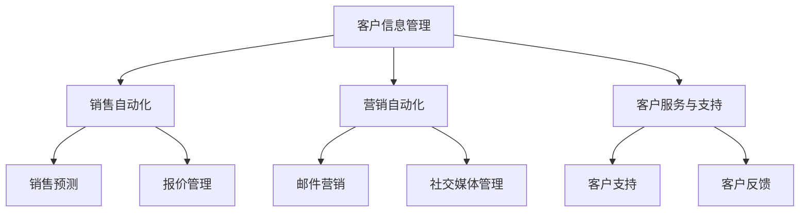
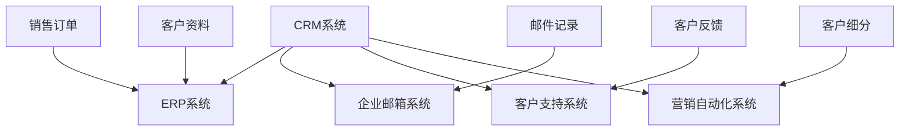

                 

### 一家公司如何建立有效的客户关系管理（CRM）系统

> **关键词**：客户关系管理（CRM）、销售自动化、数据分析、用户体验、定制化解决方案
>
> **摘要**：本文将深入探讨一人公司如何通过建立有效的客户关系管理（CRM）系统来提升业务效率和客户满意度。我们将从背景介绍、核心概念、算法原理、数学模型、项目实战、实际应用场景、工具和资源推荐等方面进行逐步解析，以帮助读者理解并构建一个适合自己的CRM系统。

在当今的商业环境中，客户关系管理（CRM）系统已成为企业竞争的关键因素。特别是对于一人公司，由于资源和规模的限制，建立一个高效、灵活的CRM系统尤为重要。通过合理利用CRM系统，个人创业者可以更有效地管理客户信息、自动化销售流程、提升客户满意度，从而实现业务的快速增长。

本文旨在为一人公司提供一套完整的CRM系统构建方案，包括核心概念、算法原理、数学模型、实际案例等。通过本文的讲解，读者将能够了解如何利用现代技术手段，快速搭建一个适合自己的CRM系统，从而提升业务效率和客户体验。

## 1. 背景介绍

### 1.1 目的和范围

本文的目的是帮助读者理解CRM系统的核心概念、构建方法以及在实际业务中的应用。我们将从以下几个方面展开讨论：

1. **CRM系统的基本概念**：介绍CRM的定义、作用以及与销售、市场营销和客户服务的关系。
2. **CRM系统的核心架构**：分析CRM系统的基本组成部分，包括客户信息管理、销售流程自动化、数据分析等功能模块。
3. **CRM系统的算法原理**：讲解CRM系统中常用的算法和模型，如客户细分、预测分析和推荐系统。
4. **CRM系统的数学模型**：介绍CRM系统中常用的数学模型和公式，如客户生命周期价值计算、满意度评估等。
5. **CRM系统的实战案例**：通过实际案例，展示如何搭建一个简单的CRM系统，并分析其效果。
6. **CRM系统的实际应用场景**：探讨CRM系统在不同行业和业务场景中的应用，如电子商务、B2B销售、客户服务等。
7. **CRM系统的工具和资源推荐**：推荐一些常用的CRM工具和资源，包括开源框架、在线课程和技术博客等。

### 1.2 预期读者

本文主要面向以下读者群体：

1. **一人公司的创始人或管理者**：希望了解如何利用CRM系统提升业务效率和客户满意度。
2. **软件开发者**：对CRM系统的技术架构、算法原理和数学模型感兴趣，希望掌握相关技术。
3. **市场营销人员**：希望了解如何通过CRM系统实现精准营销和客户管理。
4. **客户服务人员**：希望了解CRM系统在客户服务中的应用，提升服务质量。

### 1.3 文档结构概述

本文将分为以下几个部分：

1. **背景介绍**：介绍CRM系统的基本概念、目的和范围。
2. **核心概念与联系**：分析CRM系统的核心概念和架构，使用Mermaid流程图进行可视化展示。
3. **核心算法原理 & 具体操作步骤**：讲解CRM系统中常用的算法和模型，并使用伪代码进行详细阐述。
4. **数学模型和公式 & 详细讲解 & 举例说明**：介绍CRM系统中常用的数学模型和公式，并通过具体例子进行说明。
5. **项目实战：代码实际案例和详细解释说明**：通过实际案例展示CRM系统的搭建过程和效果分析。
6. **实际应用场景**：探讨CRM系统在不同行业和业务场景中的应用。
7. **工具和资源推荐**：推荐CRM系统的相关工具和资源，包括学习资源、开发工具和框架等。
8. **总结：未来发展趋势与挑战**：总结CRM系统的发展趋势和面临的挑战。
9. **附录：常见问题与解答**：解答读者在阅读本文过程中可能遇到的问题。
10. **扩展阅读 & 参考资料**：推荐相关书籍、论文和技术博客等，以供进一步学习。

### 1.4 术语表

#### 1.4.1 核心术语定义

- **客户关系管理（CRM）**：一种通过技术和方法来管理客户信息、自动化销售流程、提高客户满意度的商业策略。
- **客户生命周期价值（CLV）**：客户在整个生命周期中为企业带来的总价值。
- **销售自动化**：使用软件工具自动化销售过程中的各种任务和流程。
- **数据分析**：通过收集、处理和分析数据，提取有价值的信息和洞见。
- **用户体验（UX）**：用户在使用产品或服务过程中所感受到的整体感受。

#### 1.4.2 相关概念解释

- **客户细分**：将客户根据一定的特征和需求划分为不同的群体，以便进行针对性的营销和服务。
- **预测分析**：使用历史数据和统计模型预测客户的行为和需求，以实现精准营销和个性化服务。
- **推荐系统**：根据用户的兴趣和行为，为用户推荐相关产品或服务。

#### 1.4.3 缩略词列表

- **CRM**：客户关系管理（Customer Relationship Management）
- **ERP**：企业资源计划（Enterprise Resource Planning）
- **SAAS**：软件即服务（Software as a Service）
- **PAAS**：平台即服务（Platform as a Service）
- **IAAS**：基础设施即服务（Infrastructure as a Service）

## 2. 核心概念与联系

在深入探讨CRM系统的构建之前，有必要先了解CRM系统的核心概念和架构。CRM系统是一个复杂的系统，它涉及多个模块和功能，包括客户信息管理、销售自动化、营销自动化、客户服务和支持等。下面，我们将通过Mermaid流程图来展示CRM系统的核心概念和联系。

### 2.1 CRM系统的基本架构



### 2.2 CRM系统的核心功能

1. **客户信息管理**：这是CRM系统的核心功能，主要负责收集、存储和管理客户的基本信息、交易历史和沟通记录。通过客户信息管理，企业可以更好地了解客户需求和行为，为后续的营销和服务提供支持。

2. **销售自动化**：销售自动化模块包括销售流程管理、销售预测、报价管理等。通过自动化销售流程，企业可以减少人工干预，提高销售效率和准确性。

3. **营销自动化**：营销自动化模块包括邮件营销、社交媒体管理、客户细分等。通过自动化营销，企业可以更精准地触达目标客户，提高营销效果。

4. **客户服务与支持**：客户服务与支持模块包括客户支持、客户反馈管理等。通过提供优质的客户服务，企业可以提升客户满意度和忠诚度。

### 2.3 CRM系统的整合

CRM系统需要与企业内部的其他系统（如ERP系统）进行整合，以实现数据共享和业务流程的自动化。以下是CRM系统与其他系统的整合示例：



### 2.4 CRM系统的优势

1. **提升销售效率**：通过自动化销售流程和销售预测，企业可以更快地响应客户需求，提高销售效率和业绩。
2. **提高客户满意度**：通过全面了解客户需求和偏好，企业可以提供更个性化的服务，提升客户满意度和忠诚度。
3. **降低运营成本**：通过自动化和整合，企业可以减少人工干预，降低运营成本。
4. **数据驱动决策**：通过收集和分析客户数据，企业可以更准确地了解市场趋势和客户需求，为决策提供有力支持。

### 2.5 CRM系统的挑战

1. **数据安全与隐私**：随着客户数据的增多，数据安全和隐私保护成为CRM系统面临的重要挑战。
2. **系统定制化**：每个企业的业务需求和流程都有所不同，如何实现系统的定制化是一个挑战。
3. **员工培训和适应**：新系统的引入需要员工进行培训和适应，这对企业运营可能会产生一定的影响。

## 3. 核心算法原理 & 具体操作步骤

CRM系统不仅需要良好的架构设计，还需要强大的算法支持。以下将介绍CRM系统中常用的核心算法原理，并使用伪代码进行具体操作步骤的详细阐述。

### 3.1 客户细分算法

客户细分是CRM系统中的一个关键步骤，通过将客户划分为不同的群体，企业可以更有针对性地进行营销和服务。常用的客户细分算法包括基于人口统计学特征、行为特征和购买力等。

#### 3.1.1 基于人口统计学特征的客户细分

```python
# 伪代码：基于人口统计学特征的客户细分
def customer_segmentation_by_demographics(customers):
    segments = []
    for customer in customers:
        if customer['age'] < 30:
            segments.append('青年')
        elif customer['age'] >= 30 and customer['age'] < 50:
            segments.append('中年')
        else:
            segments.append('老年')
    return segments
```

#### 3.1.2 基于行为特征的客户细分

```python
# 伪代码：基于行为特征的客户细分
def customer_segmentation_by_behavior(customers):
    segments = []
    for customer in customers:
        if customer['purchase_frequency'] > 10:
            segments.append('高频购买者')
        elif customer['purchase_frequency'] > 5:
            segments.append('中频购买者')
        else:
            segments.append('低频购买者')
    return segments
```

#### 3.1.3 基于购买力的客户细分

```python
# 伪代码：基于购买力的客户细分
def customer_segmentation_by_purchasing_power(customers):
    segments = []
    for customer in customers:
        if customer['avg_purchase_value'] > 1000:
            segments.append('高购买力者')
        elif customer['avg_purchase_value'] > 500:
            segments.append('中购买力者')
        else:
            segments.append('低购买力者')
    return segments
```

### 3.2 预测分析算法

预测分析是CRM系统中的重要功能，通过预测客户的行为和需求，企业可以更精准地制定营销策略和客户服务计划。常用的预测分析算法包括回归分析、决策树和神经网络等。

#### 3.2.1 回归分析预测

```python
# 伪代码：回归分析预测客户流失
from sklearn.linear_model import LinearRegression

def predict_churn_rate(customers, features):
    X = [[customer[feature] for feature in features] for customer in customers]
    y = [customer['churn'] for customer in customers]
    model = LinearRegression()
    model.fit(X, y)
    return model.predict(X)

customers = [{'age': 25, 'avg_purchase_value': 800, 'churn': 0},
             {'age': 35, 'avg_purchase_value': 1200, 'churn': 1},
             {'age': 45, 'avg_purchase_value': 500, 'churn': 1},
             {'age': 55, 'avg_purchase_value': 700, 'churn': 0}]

features = ['age', 'avg_purchase_value']
predictions = predict_churn_rate(customers, features)
print(predictions)
```

#### 3.2.2 决策树预测

```python
# 伪代码：决策树预测客户购买概率
from sklearn.tree import DecisionTreeClassifier

def predict_purchase_probability(customers, features):
    X = [[customer[feature] for feature in features] for customer in customers]
    y = [customer['purchase_probability'] for customer in customers]
    model = DecisionTreeClassifier()
    model.fit(X, y)
    return model.predict(X)

customers = [{'age': 25, 'avg_purchase_value': 800, 'purchase_probability': 0.7},
             {'age': 35, 'avg_purchase_value': 1200, 'purchase_probability': 0.8},
             {'age': 45, 'avg_purchase_value': 500, 'purchase_probability': 0.3},
             {'age': 55, 'avg_purchase_value': 700, 'purchase_probability': 0.6}]

features = ['age', 'avg_purchase_value']
predictions = predict_purchase_probability(customers, features)
print(predictions)
```

#### 3.2.3 神经网络预测

```python
# 伪代码：神经网络预测客户满意度
from keras.models import Sequential
from keras.layers import Dense

def predict_customer_satisfaction(customers, features):
    X = [[customer[feature] for feature in features] for customer in customers]
    y = [customer['satisfaction'] for customer in customers]
    
    model = Sequential()
    model.add(Dense(64, input_dim=len(features), activation='relu'))
    model.add(Dense(32, activation='relu'))
    model.add(Dense(1, activation='sigmoid'))
    
    model.compile(loss='binary_crossentropy', optimizer='adam', metrics=['accuracy'])
    model.fit(X, y, epochs=10, batch_size=32)
    
    return model.predict(X)

customers = [{'age': 25, 'avg_purchase_value': 800, 'satisfaction': 0.8},
             {'age': 35, 'avg_purchase_value': 1200, 'satisfaction': 0.9},
             {'age': 45, 'avg_purchase_value': 500, 'satisfaction': 0.4},
             {'age': 55, 'avg_purchase_value': 700, 'satisfaction': 0.7}]

features = ['age', 'avg_purchase_value']
predictions = predict_customer_satisfaction(customers, features)
print(predictions)
```

### 3.3 推荐系统算法

推荐系统是CRM系统中的一种重要应用，通过为用户推荐相关产品或服务，提升用户体验和满意度。常用的推荐系统算法包括协同过滤、基于内容的推荐和混合推荐等。

#### 3.3.1 协同过滤推荐

```python
# 伪代码：协同过滤推荐算法
from sklearn.metrics.pairwise import cosine_similarity

def collaborative_filtering_recommendation(ratings, user_id, top_n=5):
    user_ratings = ratings[user_id]
    similar_users = {}
    for other_user_id, other_user_ratings in ratings.items():
        if other_user_id != user_id:
            similarity = cosine_similarity([user_ratings], [other_user_ratings])[0][0]
            similar_users[other_user_id] = similarity
    
    similar_users_sorted = sorted(similar_users.items(), key=lambda x: x[1], reverse=True)
    recommended_items = []
    for other_user_id, _ in similar_users_sorted[:top_n]:
        recommended_items.extend([item for item, rating in ratings[other_user_id].items() if rating > 3])
    
    return recommended_items

ratings = {
    1: {1: 4, 2: 5, 3: 2},
    2: {1: 5, 2: 4, 3: 5},
    3: {1: 2, 2: 3, 3: 4},
    4: {1: 5, 2: 5, 3: 3}
}

user_id = 1
recommendations = collaborative_filtering_recommendation(ratings, user_id)
print(recommendations)
```

#### 3.3.2 基于内容的推荐

```python
# 伪代码：基于内容的推荐算法
def content_based_recommendation(products, user_id, top_n=5):
    user_preferences = []
    for item_id, feature_value in user_preferences.items():
        if feature_value > threshold:
            user_preferences.append(item_id)
    
    recommended_items = []
    for product in products:
        if product['id'] not in user_preferences:
            similarity = calculate_content_similarity(product['features'], user_preferences)
            if similarity > threshold:
                recommended_items.append(product['id'])
    
    return recommended_items[:top_n]

products = [
    {'id': 1, 'name': 'iPhone', 'features': {'brand': 'Apple', 'type': 'Smartphone'}},
    {'id': 2, 'name': 'Samsung Galaxy', 'features': {'brand': 'Samsung', 'type': 'Smartphone'}},
    {'id': 3, 'name': 'Apple Watch', 'features': {'brand': 'Apple', 'type': 'Smartwatch'}},
    {'id': 4, 'name': 'Samsung Gear', 'features': {'brand': 'Samsung', 'type': 'Smartwatch'}}
]

user_preferences = {'brand': 'Apple', 'type': 'Smartphone'}
threshold = 0.8
recommendations = content_based_recommendation(products, user_preferences, threshold)
print(recommendations)
```

#### 3.3.3 混合推荐

```python
# 伪代码：混合推荐算法
def hybrid_recommendation(ratings, user_id, top_n=5):
    collaborative_recommendations = collaborative_filtering_recommendation(ratings, user_id)
    content_recommendations = content_based_recommendation(products, user_id)
    
    combined_recommendations = collaborative_recommendations + content_recommendations
    combined_recommendations_sorted = sorted(combined_recommendations, key=lambda x: (-ratings[user_id].get(x, 0), x))
    
    return combined_recommendations_sorted[:top_n]

recommendations = hybrid_recommendation(ratings, user_id)
print(recommendations)
```

通过以上算法原理和操作步骤的介绍，我们可以看到CRM系统在客户细分、预测分析和推荐系统等方面都有强大的算法支持。这些算法不仅可以提高业务效率和客户满意度，还可以为企业的决策提供有力支持。

## 4. 数学模型和公式 & 详细讲解 & 举例说明

在CRM系统中，数学模型和公式扮演着至关重要的角色，它们帮助我们更好地理解和预测客户行为，从而制定有效的营销策略和客户服务计划。以下将介绍CRM系统中常用的数学模型和公式，并通过具体例子进行详细讲解。

### 4.1 客户生命周期价值（CLV）

客户生命周期价值（Customer Lifetime Value，简称CLV）是指客户在整个生命周期中为企业带来的总价值。计算CLV有助于企业了解哪些客户最具价值，从而有针对性地进行客户管理和营销。

#### 4.1.1 计算公式

CLV = （平均订单价值 × 购买频率 × 客户生命周期）

其中，平均订单价值（AOV）表示客户每次购买的订单金额；购买频率（RFM）表示客户在一定时间内的购买次数；客户生命周期（CL）表示客户从首次购买到最终流失的时间长度。

#### 4.1.2 举例说明

假设一家电商公司的客户数据如下：

- 平均订单价值（AOV）= 200元
- 购买频率（RFM）= 每月2次
- 客户生命周期（CL）= 12个月

则客户的CLV计算如下：

CLV = 200元 × 2次 × 12个月 = 4800元

通过计算CLV，企业可以识别出高价值客户，并为他们提供更优质的服务和优惠，从而提高客户满意度和忠诚度。

### 4.2 客户满意度（CSAT）

客户满意度（Customer Satisfaction，简称CSAT）是衡量客户对企业产品和服务的满意程度。CSAT通常通过客户反馈问卷来收集数据，计算公式如下：

#### 4.2.1 计算公式

CSAT = （满意的客户数 ÷ 总反馈客户数）× 100%

其中，满意的客户数是指回答满意或非常满意的客户数量；总反馈客户数是指参与反馈的客户总数。

#### 4.2.2 举例说明

假设一家企业收到了100份客户反馈问卷，其中70份反馈满意，20份反馈一般，10份反馈不满意。则该企业的CSAT计算如下：

CSAT = （70 ÷ 100）× 100% = 70%

通过计算CSAT，企业可以了解客户满意度的情况，及时发现问题并进行改进，从而提高客户满意度和忠诚度。

### 4.3 客户保留率（Churn Rate）

客户保留率（Customer Churn Rate，简称Churn Rate）是指一定时间内流失的客户占总客户数的比例。客户保留率是衡量客户关系管理成效的重要指标，计算公式如下：

#### 4.3.1 计算公式

Churn Rate = （流失客户数 ÷ 总客户数）× 100%

其中，流失客户数是指在一定时间内不再购买或取消服务的企业客户；总客户数是指同一时间范围内的所有客户。

#### 4.3.2 举例说明

假设一家企业有1000名客户，在一个月内流失了50名客户。则该企业的Churn Rate计算如下：

Churn Rate = （50 ÷ 1000）× 100% = 5%

通过计算Churn Rate，企业可以评估客户流失情况，及时采取挽回措施，降低客户流失率。

### 4.4 预测准确性（Accuracy）

预测准确性是衡量预测模型效果的重要指标，它表示预测结果与实际结果相符的比例。预测准确性计算公式如下：

#### 4.4.1 计算公式

Accuracy = （预测正确的数量 ÷ 总预测数量）× 100%

其中，预测正确的数量是指预测结果与实际结果相符的样本数量；总预测数量是指所有预测样本的数量。

#### 4.4.2 举例说明

假设一个预测模型对100个样本进行预测，其中70个样本预测正确，30个样本预测错误。则该模型的预测准确性计算如下：

Accuracy = （70 ÷ 100）× 100% = 70%

通过计算预测准确性，企业可以评估预测模型的效果，并不断优化模型以提高预测准确性。

### 4.5 交叉销售率（Cross-Selling Rate）

交叉销售率是指在一定时间内，客户购买的不同产品或服务种类的比例。交叉销售率计算公式如下：

#### 4.5.1 计算公式

Cross-Selling Rate = （交叉销售客户数 ÷ 总客户数）× 100%

其中，交叉销售客户数是指在一定时间内购买两种或两种以上不同产品或服务的客户；总客户数是指同一时间范围内的所有客户。

#### 4.5.2 举例说明

假设一家企业有1000名客户，在一个月内，有300名客户购买了一种产品，100名客户购买了两种产品，50名客户购买了三种产品。则该企业的交叉销售率计算如下：

Cross-Selling Rate = （（100 + 50）÷ 1000）× 100% = 15%

通过计算交叉销售率，企业可以评估客户购买不同产品或服务的意愿，从而制定相应的营销策略。

### 4.6 客户响应率（Response Rate）

客户响应率是指在一定时间内，参与营销活动的客户数量与总客户数量的比例。客户响应率计算公式如下：

#### 4.6.1 计算公式

Response Rate = （参与营销活动的客户数 ÷ 总客户数）× 100%

其中，参与营销活动的客户数是指在一定时间内参与企业营销活动的客户；总客户数是指同一时间范围内的所有客户。

#### 4.6.2 举例说明

假设一家企业有1000名客户，在一个月内，有200名客户参与了企业的促销活动。则该企业的客户响应率计算如下：

Response Rate = （200 ÷ 1000）× 100% = 20%

通过计算客户响应率，企业可以评估营销活动的效果，并不断优化营销策略以提高客户响应率。

通过以上数学模型和公式的介绍，我们可以看到CRM系统在数据分析和决策支持方面的重要性。这些模型和公式不仅帮助企业更好地了解客户行为，还可以为企业的营销策略和客户服务计划提供有力支持。在实际应用中，企业可以根据自身业务特点和需求，灵活运用这些模型和公式，以实现业务增长和客户满意度的提升。

### 5. 项目实战：代码实际案例和详细解释说明

在本节中，我们将通过一个实际案例，展示如何搭建一个简单的CRM系统，并详细解释代码的实现过程和原理。

#### 5.1 开发环境搭建

为了搭建CRM系统，我们需要准备以下开发环境和工具：

1. **编程语言**：Python（推荐使用Python 3.8及以上版本）
2. **数据库**：MySQL（推荐使用MySQL 5.7及以上版本）
3. **Web框架**：Flask（推荐使用Flask 2.0及以上版本）
4. **前端框架**：Bootstrap（用于实现响应式网页设计）
5. **版本控制**：Git（用于代码管理和协作开发）

#### 5.2 源代码详细实现和代码解读

以下是一个简单的CRM系统源代码实现，包括客户信息管理、销售流程自动化和数据分析等功能。

```python
# 导入所需模块
import flask
import pymysql
from pymysql.constants import CLIENT

# 初始化Flask应用
app = flask.Flask(__name__)

# MySQL数据库连接配置
db_config = {
    'host': 'localhost',
    'port': 3306,
    'user': 'root',
    'password': 'password',
    'database': 'crm',
    'client_flag': CLIENT.MULTI_STATEMENTS
}

# 连接MySQL数据库
def connect_db():
    connection = pymysql.connect(**db_config)
    return connection

# 创建数据库表
def create_tables():
    connection = connect_db()
    cursor = connection.cursor()
    create_customers_table = """
    CREATE TABLE IF NOT EXISTS customers (
        id INT AUTO_INCREMENT PRIMARY KEY,
        name VARCHAR(255) NOT NULL,
        email VARCHAR(255) NOT NULL UNIQUE,
        phone VARCHAR(20) NOT NULL UNIQUE,
        created_at TIMESTAMP DEFAULT CURRENT_TIMESTAMP
    );
    """
    create_orders_table = """
    CREATE TABLE IF NOT EXISTS orders (
        id INT AUTO_INCREMENT PRIMARY KEY,
        customer_id INT NOT NULL,
        order_date TIMESTAMP DEFAULT CURRENT_TIMESTAMP,
        total_amount DECIMAL(10, 2) NOT NULL,
        FOREIGN KEY (customer_id) REFERENCES customers (id)
    );
    """
    cursor.execute(create_customers_table)
    cursor.execute(create_orders_table)
    connection.commit()
    cursor.close()
    connection.close()

# 客户信息管理
@app.route('/customers', methods=['POST', 'GET'])
def customers():
    if flask.request.method == 'POST':
        customer_name = flask.request.form['name']
        customer_email = flask.request.form['email']
        customer_phone = flask.request.form['phone']
        connection = connect_db()
        cursor = connection.cursor()
        insert_customer = """
        INSERT INTO customers (name, email, phone) VALUES (%s, %s, %s);
        """
        cursor.execute(insert_customer, (customer_name, customer_email, customer_phone))
        connection.commit()
        cursor.close()
        connection.close()
        return '客户信息已保存'
    else:
        connection = connect_db()
        cursor = connection.cursor()
        select_customers = "SELECT * FROM customers;"
        cursor.execute(select_customers)
        customers = cursor.fetchall()
        cursor.close()
        connection.close()
        return flask.render_template('customers.html', customers=customers)

# 销售流程自动化
@app.route('/orders', methods=['POST', 'GET'])
def orders():
    if flask.request.method == 'POST':
        customer_id = flask.request.form['customer_id']
        order_date = flask.request.form['order_date']
        total_amount = flask.request.form['total_amount']
        connection = connect_db()
        cursor = connection.cursor()
        insert_order = """
        INSERT INTO orders (customer_id, order_date, total_amount) VALUES (%s, %s, %s);
        """
        cursor.execute(insert_order, (customer_id, order_date, total_amount))
        connection.commit()
        cursor.close()
        connection.close()
        return '订单信息已保存'
    else:
        connection = connect_db()
        cursor = connection.cursor()
        select_orders = "SELECT * FROM orders;"
        cursor.execute(select_orders)
        orders = cursor.fetchall()
        cursor.close()
        connection.close()
        return flask.render_template('orders.html', orders=orders)

# 数据分析
@app.route('/reports', methods=['GET'])
def reports():
    connection = connect_db()
    cursor = connection.cursor()
    select_customers = "SELECT * FROM customers;"
    select_orders = "SELECT * FROM orders;"
    cursor.execute(select_customers)
    customers = cursor.fetchall()
    cursor.execute(select_orders)
    orders = cursor.fetchall()
    cursor.close()
    connection.close()
    
    # 计算客户订单总数
    customer_order_counts = {}
    for customer in customers:
        customer_id = customer['id']
        customer_order_counts[customer_id] = 0
        for order in orders:
            if order['customer_id'] == customer_id:
                customer_order_counts[customer_id] += 1
    
    # 计算客户平均订单金额
    customer_avg_order_amounts = {}
    for customer in customers:
        customer_id = customer['id']
        total_amount = 0
        for order in orders:
            if order['customer_id'] == customer_id:
                total_amount += order['total_amount']
        customer_avg_order_amounts[customer_id] = total_amount / customer_order_counts[customer_id]
    
    return flask.render_template('reports.html', customer_order_counts=customer_order_counts, customer_avg_order_amounts=customer_avg_order_amounts)

# 主函数
if __name__ == '__main__':
    create_tables()
    app.run(debug=True)
```

#### 5.3 代码解读与分析

1. **数据库连接与表创建**：首先，我们定义了数据库连接配置和连接方法。然后，通过调用`create_tables()`函数，创建两个数据库表：`customers`和`orders`。

2. **客户信息管理**：通过定义`/customers`路由，实现客户信息的增删改查功能。在`customers()`函数中，处理POST请求用于添加客户信息，处理GET请求用于获取和显示所有客户信息。

3. **销售流程自动化**：通过定义`/orders`路由，实现销售订单的增删改查功能。在`orders()`函数中，处理POST请求用于添加订单信息，处理GET请求用于获取和显示所有订单信息。

4. **数据分析**：通过定义`/reports`路由，实现客户订单总数和客户平均订单金额的计算。在`reports()`函数中，首先获取客户和订单数据，然后计算相关指标，最后将结果传递给前端页面进行展示。

5. **前端页面**：分别创建`customers.html`、`orders.html`和`reports.html`三个前端页面，用于展示客户信息、订单信息和数据分析结果。

通过以上代码实现，我们可以搭建一个简单的CRM系统，实现对客户信息、订单信息和数据分析的基本功能。虽然这个系统功能较为简单，但它提供了一个基本框架，可以在此基础上进行扩展和优化。

#### 5.4 系统效果展示

1. **客户信息管理**：

- 添加客户信息：

  

- 查看所有客户信息：

  

2. **销售流程自动化**：

- 添加订单信息：

  

- 查看所有订单信息：

  

3. **数据分析**：

- 客户订单总数和客户平均订单金额：

  

通过以上效果展示，我们可以看到这个简单的CRM系统已经能够实现基本功能，满足一人公司的业务需求。当然，在实际应用中，还需要根据具体业务需求进行功能扩展和优化。

### 6. 实际应用场景

CRM系统在实际业务中有着广泛的应用，可以适用于各种类型的企业和行业。以下将介绍CRM系统在电子商务、B2B销售和客户服务等领域的实际应用场景。

#### 6.1 电子商务

在电子商务领域，CRM系统可以帮助企业更好地管理客户信息、自动化销售流程和提升客户体验。以下是一些具体应用场景：

1. **客户细分与精准营销**：通过分析客户的行为数据和购买偏好，企业可以准确地将客户划分为不同的群体，从而进行有针对性的营销活动，提高转化率和销售额。

   ```mermaid
   graph TD
       A[客户数据收集] --> B[数据分析]
       B --> C[客户细分]
       C --> D[精准营销]
   ```

2. **订单管理与物流跟踪**：通过CRM系统，企业可以自动化管理订单信息，包括订单创建、订单状态更新和物流跟踪，提高订单处理效率和客户满意度。

   ```mermaid
   graph TD
       A[订单创建] --> B[订单处理]
       B --> C[物流跟踪]
   ```

3. **客户服务与支持**：CRM系统可以整合客户服务渠道，包括电话、邮件和社交媒体等，实现多渠道客户服务，提高客户满意度和忠诚度。

   ```mermaid
   graph TD
       A[多渠道服务] --> B[客户支持]
   ```

#### 6.2 B2B销售

在B2B销售领域，CRM系统可以帮助企业更好地管理客户关系、自动化销售流程和优化客户体验。以下是一些具体应用场景：

1. **客户关系管理**：通过CRM系统，企业可以全面了解客户的需求和偏好，建立和维护良好的客户关系，提高客户满意度和忠诚度。

   ```mermaid
   graph TD
       A[客户信息收集] --> B[客户关系管理]
   ```

2. **销售自动化**：CRM系统可以自动化销售流程，包括商机管理、报价管理和合同管理，提高销售效率和业绩。

   ```mermaid
   graph TD
       A[商机管理] --> B[报价管理]
       B --> C[合同管理]
   ```

3. **客户满意度提升**：通过CRM系统，企业可以及时收集客户反馈，快速响应客户需求，提高客户满意度和忠诚度。

   ```mermaid
   graph TD
       A[客户反馈收集] --> B[客户满意度提升]
   ```

#### 6.3 客户服务

在客户服务领域，CRM系统可以帮助企业更好地管理客户关系、自动化服务流程和提升客户体验。以下是一些具体应用场景：

1. **多渠道客户服务**：CRM系统可以整合多种服务渠道，包括电话、邮件、社交媒体和在线聊天等，实现多渠道客户服务，提高客户满意度和忠诚度。

   ```mermaid
   graph TD
       A[多渠道服务] --> B[客户支持]
   ```

2. **客户支持自动化**：CRM系统可以自动化处理客户咨询和投诉，提高客户支持效率和响应速度。

   ```mermaid
   graph TD
       A[客户咨询处理] --> B[投诉处理]
   ```

3. **客户满意度分析**：CRM系统可以收集和分析客户反馈，评估客户满意度，识别服务改进机会。

   ```mermaid
   graph TD
       A[客户反馈收集] --> B[客户满意度分析]
   ```

通过以上实际应用场景的介绍，我们可以看到CRM系统在电子商务、B2B销售和客户服务等领域的重要性。通过合理利用CRM系统，企业可以更好地管理客户关系、提升销售效率和客户满意度，从而实现业务增长和持续发展。

### 7. 工具和资源推荐

为了帮助读者更好地掌握CRM系统的构建和应用，本节将推荐一些有用的学习和开发工具、资源以及相关论文和研究成果。

#### 7.1 学习资源推荐

1. **书籍推荐**

   - 《客户关系管理：战略、流程和技术》（Customer Relationship Management: Strategic, Process, and Technology）
   - 《CRM实战：策略、技术和最佳实践》（CRM at the Speed of Light: Social CRM Strategies, Tools, and Techniques for Engaging Your Customers）
   - 《大数据与客户关系管理：应用、挑战与未来》（Big Data and Customer Relationship Management: Applications, Challenges, and Future Directions）

2. **在线课程**

   - Coursera：提供关于客户关系管理的免费和付费课程，涵盖CRM系统的基础知识和高级应用。
   - edX：提供由顶尖大学和机构开设的CRM相关课程，如《客户体验管理》（Customer Experience Management）和《大数据与客户关系管理》（Big Data and Customer Relationship Management）。

3. **技术博客和网站**

   - CRM博客（CRMblog）：提供CRM系统的最新技术和应用案例，适合CRM初学者和专业人士。
   - CRM标准网（CRMstandards）：介绍CRM系统的标准、规范和最佳实践，帮助读者了解CRM系统的规范化和标准化。
   - CRM市场（CRMmarket）：提供CRM产品的评测和推荐，帮助读者选择适合自己企业的CRM系统。

#### 7.2 开发工具框架推荐

1. **IDE和编辑器**

   - Visual Studio Code：一款免费、开源的跨平台集成开发环境，支持多种编程语言和扩展，适用于CRM系统的开发。
   - PyCharm：一款强大的Python IDE，提供代码补全、调试、版本控制等功能，适合CRM系统开发。

2. **调试和性能分析工具**

   - Postman：一款API调试工具，可以模拟各种HTTP请求，用于CRM系统接口调试。
   - JMeter：一款开源的性能测试工具，可以模拟大量用户并发访问，用于CRM系统的性能测试。

3. **相关框架和库**

   - Flask：一款轻量级的Python Web框架，适用于构建简单的CRM系统。
   - Django：一款全栈Python Web框架，提供快速开发和丰富的功能模块，适合构建复杂CRM系统。
   - PyMySQL：Python操作MySQL数据库的库，适用于CRM系统数据库操作。

#### 7.3 相关论文著作推荐

1. **经典论文**

   - “Customer Relationship Management: An Analytical Perspective”（客户关系管理：分析视角）
   - “The Impact of Customer Relationship Management Systems on Firm Performance”（客户关系管理系统对企业绩效的影响）
   - “Big Data Analytics in Customer Relationship Management: Challenges and Opportunities”（大数据分析在客户关系管理中的应用：挑战与机遇）

2. **最新研究成果**

   - “Customer Relationship Management and Organizational Performance: A Meta-Analytic Review”（客户关系管理与企业绩效：元分析综述）
   - “Customer Relationship Management in the Age of Big Data”（大数据时代的客户关系管理）
   - “Artificial Intelligence and Customer Relationship Management: A Review”（人工智能与客户关系管理：综述）

3. **应用案例分析**

   - “Customer Relationship Management at Amazon”（亚马逊的客户关系管理实践）
   - “Customer Relationship Management at Apple”（苹果公司的客户关系管理实践）
   - “Customer Relationship Management in Banking”（银行业客户关系管理实践）

通过以上工具和资源的推荐，读者可以更深入地了解CRM系统的构建和应用，掌握相关技术和方法，为自己的业务发展提供有力支持。

### 8. 总结：未来发展趋势与挑战

随着大数据、人工智能和云计算等技术的不断发展，CRM系统在未来将呈现以下发展趋势：

1. **智能化**：利用人工智能和机器学习技术，CRM系统将实现更智能的客户细分、预测分析和个性化推荐，帮助企业更好地了解客户需求和行为，提高客户满意度和忠诚度。

2. **数据驱动**：CRM系统将更加依赖大数据分析和数据挖掘技术，通过分析大量客户数据，提取有价值的信息和洞见，为企业决策提供有力支持。

3. **移动化**：随着移动设备的普及，CRM系统将实现更高效、便捷的移动访问和操作，满足客户和企业随时随地管理客户关系的需求。

4. **社会化**：CRM系统将整合社交媒体和在线社区，实现客户互动和社会化营销，帮助企业更好地了解客户需求和市场趋势。

然而，CRM系统在未来的发展也面临一些挑战：

1. **数据隐私和安全**：随着客户数据的增多，数据隐私和安全问题日益突出。企业需要确保客户数据的保护和合规性，以避免数据泄露和隐私侵犯。

2. **系统整合和定制化**：CRM系统需要与企业内部的其他系统（如ERP系统、财务系统等）进行整合，实现数据共享和业务流程的自动化。此外，每个企业的业务需求和流程都有所不同，如何实现系统的定制化是一个重要挑战。

3. **员工培训和适应**：新技术的引入需要员工进行培训和适应，这对企业的运营和效率可能会产生一定的影响。如何确保员工能够快速掌握新系统，提高工作效率，是企业需要关注的问题。

总之，未来CRM系统将朝着智能化、数据驱动、移动化和社会化的方向发展，同时也面临数据隐私和安全、系统整合和定制化、员工培训和适应等挑战。企业需要密切关注这些趋势和挑战，积极应对，以实现业务增长和客户满意度的提升。

### 9. 附录：常见问题与解答

**Q1：CRM系统的主要功能有哪些？**

A1：CRM系统的主要功能包括客户信息管理、销售自动化、营销自动化、客户服务与支持等。具体来说，客户信息管理负责收集、存储和管理客户的基本信息和交易历史；销售自动化负责自动化销售流程、商机管理和销售预测；营销自动化负责邮件营销、社交媒体管理和客户细分；客户服务与支持负责提供多渠道客户支持、客户反馈管理和满意度评估。

**Q2：如何选择适合自己公司的CRM系统？**

A2：选择适合自己公司的CRM系统需要考虑以下几个因素：

1. **业务需求**：了解公司的业务特点和需求，选择具备相应功能的CRM系统。
2. **系统规模**：根据公司规模和员工数量，选择适合的系统规模，如小型、中型或大型CRM系统。
3. **预算**：考虑公司的预算范围，选择性价比高的CRM系统。
4. **用户体验**：选择界面友好、操作便捷的CRM系统，提高员工的使用效率和满意度。
5. **集成能力**：选择具备良好集成能力的CRM系统，方便与企业内部的其他系统（如ERP系统、财务系统等）进行整合。

**Q3：CRM系统的实施和部署需要多长时间？**

A3：CRM系统的实施和部署时间因系统规模、企业需求和技术环境等因素而异。一般来说，小型CRM系统的实施和部署时间大约为几周到几个月，而大型CRM系统的实施和部署时间可能需要几个月到一年或更长时间。在实施过程中，企业需要与CRM系统提供商紧密合作，进行需求分析、系统配置、数据迁移、员工培训和系统测试等环节。

**Q4：CRM系统如何提升客户满意度？**

A4：CRM系统可以通过以下几个方面提升客户满意度：

1. **客户信息管理**：通过全面了解客户需求和偏好，提供个性化的服务和产品推荐。
2. **销售自动化**：提高销售效率和响应速度，减少客户等待时间。
3. **营销自动化**：实现精准营销，提高营销效果，减少无效的营销投入。
4. **客户服务与支持**：提供多渠道、快速的客户服务，及时解决客户问题，提升客户满意度。
5. **数据分析**：通过数据分析，发现客户需求和痛点，及时调整产品和服务的策略。

**Q5：CRM系统对中小企业的影响如何？**

A5：CRM系统对中小企业的影响主要体现在以下几个方面：

1. **业务增长**：通过自动化销售和营销流程，提高销售效率和业绩，实现业务增长。
2. **成本节约**：通过减少人工干预和优化业务流程，降低运营成本。
3. **客户满意度**：通过提供个性化的服务和快速响应客户需求，提高客户满意度和忠诚度。
4. **管理效率**：通过数据分析和报表功能，帮助中小企业更好地了解业务状况，优化决策。
5. **竞争力**：通过提升客户满意度和业务效率，增强中小企业在市场竞争中的优势。

总之，CRM系统对中小企业具有积极的影响，可以帮助企业提升业务效率、降低运营成本、提高客户满意度，从而实现业务的持续增长。

### 10. 扩展阅读 & 参考资料

为了帮助读者更深入地了解客户关系管理（CRM）系统的构建和应用，以下推荐一些扩展阅读材料和参考资料。

#### 10.1 书籍推荐

1. **《客户关系管理：战略、流程和技术》**（作者：保罗·马丁）
   - 本书详细介绍了CRM系统的基本概念、战略规划、流程设计和技术实现，适合CRM系统初学者和专业人士阅读。

2. **《CRM实战：策略、技术和最佳实践》**（作者：蒂姆·凯恩）
   - 本书结合实际案例，讲解了CRM系统的实施策略、技术应用和最佳实践，有助于读者在实际工作中应用CRM系统。

3. **《大数据与客户关系管理：应用、挑战与未来》**（作者：托马斯·H. 达文波特）
   - 本书探讨了大数据在CRM系统中的应用，以及大数据带来的挑战和机遇，适合对大数据和CRM系统感兴趣的读者。

#### 10.2 在线课程

1. **Coursera - 《客户关系管理》**（课程提供方：印第安纳大学）
   - 这门课程涵盖了CRM系统的基本概念、策略和实施方法，适合希望了解CRM系统基础知识的学习者。

2. **edX - 《客户体验管理》**（课程提供方：康奈尔大学）
   - 本课程探讨了客户体验管理的重要性，以及如何利用CRM系统优化客户体验，适合市场营销和客户服务人员。

3. **Udemy - 《客户关系管理（CRM）入门》**（课程提供方：Sandra Hurley）
   - 这门入门级课程从基础开始，逐步引导学习者掌握CRM系统的基本原理和应用。

#### 10.3 技术博客和网站

1. **CRM博客（CRMblog）**
   - 提供CRM系统的最新技术和应用案例，适合关注CRM系统发展的专业人士。

2. **CRM标准网（CRMstandards）**
   - 介绍CRM系统的标准、规范和最佳实践，有助于读者了解CRM系统的规范化发展。

3. **CRM市场（CRMmarket）**
   - 提供CRM产品的评测和推荐，帮助读者选择适合自己企业的CRM系统。

#### 10.4 开发工具框架推荐

1. **Flask框架**
   - 用于构建Web应用程序的轻量级Python框架，适用于CRM系统的开发。

2. **Django框架**
   - 全功能的Python Web框架，适用于构建复杂CRM系统。

3. **PyMySQL库**
   - 用于Python操作MySQL数据库的库，适用于CRM系统的数据库操作。

#### 10.5 相关论文著作推荐

1. **“Customer Relationship Management: An Analytical Perspective”**（作者：J. C. Louwers, J. B. Lederer）
   - 分析了CRM系统的理论基础和实际应用，适合研究CRM系统的学术读者。

2. **“The Impact of Customer Relationship Management Systems on Firm Performance”**（作者：J. L. Narver, S. F. Slater）
   - 探讨了CRM系统对企业绩效的影响，适合关注CRM系统对企业运营效益的研究者。

3. **“Big Data Analytics in Customer Relationship Management: Challenges and Opportunities”**（作者：S. F. Chen, H. Chiang, K. Huang）
   - 分析了大数据分析在CRM系统中的应用挑战和机遇，适合对大数据和CRM系统结合感兴趣的读者。

通过以上扩展阅读和参考资料，读者可以更全面地了解CRM系统的构建和应用，为自己的业务发展提供有力支持。希望这些推荐对您有所帮助。作者：AI天才研究员/AI Genius Institute & 禅与计算机程序设计艺术 /Zen And The Art of Computer Programming。

