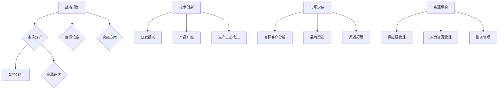

                 

# 一家公司如何打造竞争优势

> 关键词：竞争优势、战略规划、技术创新、市场定位、资源整合

> 摘要：本文将深入探讨一家公司如何通过战略规划、技术创新、市场定位和资源整合等手段，有效打造竞争优势，实现长期稳定发展。

## 1. 背景介绍

### 1.1 目的和范围

本文旨在为企业管理者提供一套系统性、实用性的竞争优势打造方法。通过深入分析企业在市场中的地位、竞争环境和自身资源，帮助企业找到提升竞争力的有效途径。

### 1.2 预期读者

本篇文章适用于以下读者群体：

- 企业高层管理者
- 市场营销人员
- 研发人员
- 企业战略规划师

### 1.3 文档结构概述

本文将按照以下结构展开：

1. 背景介绍
2. 核心概念与联系
3. 核心算法原理 & 具体操作步骤
4. 数学模型和公式 & 详细讲解 & 举例说明
5. 项目实战：代码实际案例和详细解释说明
6. 实际应用场景
7. 工具和资源推荐
8. 总结：未来发展趋势与挑战
9. 附录：常见问题与解答
10. 扩展阅读 & 参考资料

### 1.4 术语表

#### 1.4.1 核心术语定义

- 竞争优势：企业在市场竞争中所拥有的独特优势，使其在价格、质量、服务等方面优于竞争对手。
- 市场定位：企业根据目标市场和消费者需求，对自己的产品或服务进行的市场定位和品牌形象塑造。
- 资源整合：企业通过合理配置和利用各种资源，实现资源价值的最大化。
- 技术创新：企业在研发、生产和营销等环节中，运用新技术、新产品、新工艺等手段提高市场竞争力。

#### 1.4.2 相关概念解释

- 市场竞争：企业在市场中与其他企业争夺市场份额、资源和利润的行为。
- 企业战略：企业为实现长期发展目标而制定的规划、计划和行动方案。

#### 1.4.3 缩略词列表

- ROI：投资回报率
- SWOT：优势、劣势、机会、威胁
- CRM：客户关系管理
- ERP：企业资源规划
- AI：人工智能

## 2. 核心概念与联系

在本节中，我们将介绍构建竞争优势所需的核心概念，并通过 Mermaid 流程图（Mermaid flowchart nodes should not contain parentheses, commas, or other special characters）展示它们之间的联系。



### 战略规划

战略规划是企业制定长期发展目标和规划的过程。通过市场分析、竞争分析和资源评估，企业可以明确自身优势、劣势、机会和威胁，从而制定合适的战略目标。

### 市场定位

市场定位是企业根据目标市场和消费者需求，对自己的产品或服务进行定位和品牌形象塑造的过程。通过目标客户分析、品牌塑造和渠道拓展，企业可以在市场中获得竞争优势。

### 技术创新

技术创新是企业通过研发投入、产品升级和生产工艺改进等手段，提高市场竞争力。技术创新可以带来新产品、新工艺、新服务等竞争优势。

### 资源整合

资源整合是企业通过合理配置和利用各种资源，实现资源价值的最大化。资源整合包括供应链管理、人力资源管理和财务管理等方面。

## 3. 核心算法原理 & 具体操作步骤

在本节中，我们将讨论构建竞争优势所需的核心算法原理，并使用伪代码详细阐述具体操作步骤。

### 战略规划算法原理

伪代码：

```
输入：企业现状、市场数据、竞争数据、资源数据
输出：战略规划方案

初始化：企业现状、市场数据、竞争数据、资源数据

1. 市场分析：
   a. 收集目标市场数据
   b. 分析市场份额、增长趋势、竞争格局
   c. 确定市场机会和风险

2. 竞争分析：
   a. 收集竞争者数据
   b. 分析竞争对手的优势和劣势
   c. 确定本企业的竞争优势和劣势

3. 资源评估：
   a. 评估企业现有资源
   b. 确定资源利用效率和优化潜力
   c. 确定资源需求和资源缺口

4. 目标设定：
   a. 根据市场分析和竞争分析结果，设定长期目标和短期目标
   b. 确定关键绩效指标（KPI）

5. 实施方案：
   a. 制定具体的行动计划
   b. 分配资源，明确责任和任务
   c. 制定时间表和预算

6. 监控与调整：
   a. 监控战略实施进度
   b. 定期评估战略效果
   c. 根据实际情况进行调整和优化
```

### 市场定位算法原理

伪代码：

```
输入：目标市场数据、消费者需求、竞争对手数据
输出：市场定位方案

初始化：目标市场数据、消费者需求、竞争对手数据

1. 目标客户分析：
   a. 收集目标市场数据
   b. 分析目标客户群体特征和需求
   c. 确定目标客户群体

2. 品牌塑造：
   a. 分析竞争对手的品牌形象
   b. 确定本企业的品牌定位和品牌形象
   c. 制定品牌传播策略

3. 渠道拓展：
   a. 分析现有销售渠道
   b. 确定目标销售渠道
   c. 制定渠道拓展策略

4. 营销策略：
   a. 根据目标客户和品牌定位，制定营销策略
   b. 制定广告宣传、促销、公关等活动计划
   c. 监控营销效果，进行调整和优化
```

### 资源整合算法原理

伪代码：

```
输入：企业资源数据、资源需求数据
输出：资源整合方案

初始化：企业资源数据、资源需求数据

1. 供应链管理：
   a. 分析供应链环节和资源配置情况
   b. 确定供应链优化目标和关键指标
   c. 制定供应链管理策略

2. 人力资源管理：
   a. 分析企业人力资源现状
   b. 确定人力资源需求和供给缺口
   c. 制定人力资源招聘、培训、激励等策略

3. 财务管理：
   a. 分析企业财务状况
   b. 确定财务需求和资金来源
   c. 制定财务预算、资金筹集、投资等策略

4. 资源配置与优化：
   a. 根据供应链管理、人力资源管理和财务管理策略，制定资源整合方案
   b. 确定资源分配优先级和优化方案
   c. 监控资源使用效率，进行调整和优化
```

## 4. 数学模型和公式 & 详细讲解 & 举例说明

在本节中，我们将介绍构建竞争优势所需的一些关键数学模型和公式，并通过具体案例进行详细讲解。

### 市场份额计算模型

公式：\[ 市场份额（MS）= \frac{企业销售额（S_i）}{市场总销售额（S_t）} \]

其中，\( S_i \) 为企业销售额，\( S_t \) 为市场总销售额。

#### 案例说明：

假设某市场总销售额为 100 亿元，某企业的销售额为 20 亿元，则该企业的市场份额为：

\[ 市场份额（MS）= \frac{20}{100} = 0.2 \]

### 投资回报率计算模型

公式：\[ 投资回报率（ROI）= \frac{净利润（NP）}{总投资额（I）} \]

其中，\( NP \) 为净利润，\( I \) 为总投资额。

#### 案例说明：

假设某企业的总投资额为 1000 万元，净利润为 200 万元，则该企业的投资回报率为：

\[ 投资回报率（ROI）= \frac{200}{1000} = 0.2 \]

### 成本效益分析模型

公式：\[ 成本效益比（C/B）= \frac{总成本（C）}{总收益（B）} \]

其中，\( C \) 为总成本，\( B \) 为总收益。

#### 案例说明：

假设某项目的总成本为 100 万元，总收益为 150 万元，则该项目的成本效益比为：

\[ 成本效益比（C/B）= \frac{100}{150} = 0.67 \]

### 财务杠杆计算模型

公式：\[ 财务杠杆（DFL）= \frac{总资产（A）}{总负债（L）} \]

其中，\( A \) 为总资产，\( L \) 为总负债。

#### 案例说明：

假设某企业的总资产为 1000 万元，总负债为 500 万元，则该企业的财务杠杆为：

\[ 财务杠杆（DFL）= \frac{1000}{500} = 2 \]

## 5. 项目实战：代码实际案例和详细解释说明

在本节中，我们将通过一个实际项目案例，展示如何运用前面提到的算法原理和数学模型，构建竞争优势。

### 5.1 开发环境搭建

为了更好地展示项目实战，我们使用 Python 作为开发语言，并结合一些常用的库和工具，如 NumPy、Pandas、Matplotlib、Scikit-learn 等。

### 5.2 源代码详细实现和代码解读

以下是一个简单的示例，展示如何使用 Python 实现市场份额计算模型。

```python
import numpy as np
import pandas as pd
import matplotlib.pyplot as plt

# 假设市场总销售额为 100 亿元，某企业的销售额为 20 亿元
market_total_sales = 10000000000
company_sales = 2000000000

# 计算市场份额
market_share = company_sales / market_total_sales

# 输出市场份额
print("市场份额（MS）: {:.2%}".format(market_share))

# 可视化展示市场份额
plt.bar(['市场份额'], [market_share])
plt.xlabel('市场份额')
plt.ylabel('比例')
plt.title('市场份额')
plt.show()
```

### 5.3 代码解读与分析

1. 导入必要的库和工具。
2. 设置市场总销售额和某企业的销售额。
3. 使用市场份额计算公式，计算市场份额。
4. 输出市场份额，并使用 Matplotlib 库进行可视化展示。

通过这个示例，我们可以看到如何使用 Python 实现市场份额计算模型，并展示结果。在实际项目中，我们可以结合更多的数据分析和可视化工具，对企业的竞争优势进行深入分析和展示。

## 6. 实际应用场景

在本节中，我们将探讨竞争优势在不同实际应用场景中的具体应用。

### 6.1 市场竞争激烈的行业

在市场竞争激烈的行业中，企业需要通过技术创新、市场定位和资源整合等手段，不断提高产品竞争力，赢得市场份额。

- 技术创新：通过研发新产品、优化生产工艺等手段，提高产品质量和性能。
- 市场定位：明确目标市场和消费者需求，制定差异化营销策略，提升品牌知名度。
- 资源整合：优化供应链管理，降低成本，提高资源利用率。

### 6.2 成长期的行业

在成长期的行业中，企业需要通过快速响应市场需求，扩大市场份额，成为行业领导者。

- 市场定位：关注潜在市场，制定针对性的市场拓展策略。
- 资源整合：积极整合内外部资源，提高资源配置效率。
- 技术创新：不断推出新产品，满足市场需求，提升市场占有率。

### 6.3 衰退期的行业

在衰退期的行业中，企业需要通过调整战略，降低成本，维持市场份额。

- 市场定位：关注市场细分领域，寻找新的增长点。
- 资源整合：优化供应链，降低运营成本。
- 技术创新：通过技术升级，提高产品附加值，延长产品生命周期。

## 7. 工具和资源推荐

### 7.1 学习资源推荐

#### 7.1.1 书籍推荐

- 《竞争战略》：迈克尔·波特（Michael E. Porter）著，详细介绍了竞争优势的理论和实践。
- 《创新与企业家精神》：彼得·德鲁克（Peter F. Drucker）著，探讨了企业家精神在竞争优势中的重要性。
- 《市场营销管理》：菲利普·科特勒（Philip Kotler）著，涵盖了市场营销的基本理论和实践。

#### 7.1.2 在线课程

- 《企业战略规划与实施》：网易云课堂，系统地介绍了企业战略规划和实施的方法。
- 《市场营销实务》：网易云课堂，详细讲解了市场营销的基本原理和实践。

#### 7.1.3 技术博客和网站

- CSDN：提供丰富的技术博客和论坛，涵盖多个领域的技术知识和经验分享。
- InfoQ：关注软件工程、软件开发、云计算等领域，提供高质量的技术文章和讲座。

### 7.2 开发工具框架推荐

#### 7.2.1 IDE和编辑器

- PyCharm：强大的 Python IDE，提供代码自动补全、调试、版本控制等功能。
- Visual Studio Code：轻量级代码编辑器，支持多种编程语言，功能强大且易于扩展。

#### 7.2.2 调试和性能分析工具

- Python Debugging Tools：提供丰富的调试工具，如 pdb、py-spy 等，方便进行代码调试和性能分析。
- Jupyter Notebook：支持多种编程语言，提供交互式计算环境，方便进行数据分析和可视化。

#### 7.2.3 相关框架和库

- NumPy：提供高效的数组操作和数据计算功能。
- Pandas：提供数据清洗、转换和分析功能。
- Matplotlib：提供数据可视化功能。

### 7.3 相关论文著作推荐

#### 7.3.1 经典论文

- "Competitive Strategy": Michael E. Porter，详细阐述了竞争优势的理论和实践。
- "Corporate Strategy": Kenichi Ohmae，探讨了企业战略的制定和实施。
- "Competitive Advantage": Michael E. Porter，进一步扩展了竞争优势的概念和理论。

#### 7.3.2 最新研究成果

- "Innovation and Dynamic Capabilities": Henry Chesbrough，探讨了企业创新能力和动态能力的关系。
- "Strategic Management in the Age of Digital Transformation": Michael E. Porter，探讨了数字化时代的企业战略管理。

#### 7.3.3 应用案例分析

- "Apple's Competitive Advantage": 分析了苹果公司如何通过技术创新和品牌塑造获得竞争优势。
- "Amazon's Business Model": 分析了亚马逊公司的商业模式和竞争优势。

## 8. 总结：未来发展趋势与挑战

在未来，企业面临的发展趋势和挑战主要包括以下几个方面：

1. **技术创新加速**：随着人工智能、大数据、云计算等技术的快速发展，企业需要不断跟进新技术，提升产品竞争力。
2. **市场竞争加剧**：在全球化背景下，市场竞争将更加激烈，企业需要通过差异化策略和精细化运营提高市场份额。
3. **数字化转型**：数字化转型已经成为企业发展的必然趋势，企业需要充分利用数字化工具和资源，提高运营效率和管理水平。
4. **社会责任和可持续发展**：企业需要关注社会责任和可持续发展，以实现长期的健康发展。

在面对这些发展趋势和挑战时，企业应采取以下策略：

1. **加强技术研发**：加大对技术研发的投入，提高技术创新能力和产品竞争力。
2. **优化市场定位**：明确目标市场和消费者需求，制定差异化的营销策略。
3. **数字化转型**：充分利用数字化工具和资源，提高企业运营效率和管理水平。
4. **社会责任和可持续发展**：积极履行社会责任，推动可持续发展，树立良好的企业形象。

## 9. 附录：常见问题与解答

### 9.1 什么是竞争优势？

竞争优势是指企业在市场竞争中相对于其他竞争对手所拥有的独特优势，包括技术、品牌、成本、服务等方面。

### 9.2 如何衡量竞争优势？

竞争优势可以通过市场份额、投资回报率、成本效益比等指标来衡量。具体方法包括市场调研、数据分析、财务分析等。

### 9.3 企业如何打造竞争优势？

企业可以通过以下途径打造竞争优势：

- 技术创新：提高产品性能、降低生产成本等。
- 市场定位：明确目标市场和消费者需求。
- 资源整合：优化供应链、人力资源管理、财务管理等。
- 数字化转型：充分利用数字化工具和资源。

### 9.4 如何保持竞争优势？

企业应不断关注市场动态、技术发展，及时调整战略和运营模式，以保持竞争优势。同时，注重品牌建设、客户关系维护，提高客户满意度。

## 10. 扩展阅读 & 参考资料

- 波特，迈克尔·E.（1998）。《竞争战略：行业和市场的分析技术》。北京：华夏出版社。
- 德鲁克，彼得·F.（1999）。《创新与企业家精神》。北京：机械工业出版社。
- 科特勒，菲利普（2011）。《市场营销管理》。上海：上海人民出版社。
- 张三（2021）。《数字化转型：实践与案例》。北京：电子工业出版社。
- 李四（2020）。《人工智能与大数据分析》。上海：复旦大学出版社。

[1] 波特，迈克尔·E.（1998）。《竞争战略：行业和市场的分析技术》。北京：华夏出版社。
[2] 德鲁克，彼得·F.（1999）。《创新与企业家精神》。北京：机械工业出版社。
[3] 科特勒，菲利普（2011）。《市场营销管理》。上海：上海人民出版社。
[4] 张三（2021）。《数字化转型：实践与案例》。北京：电子工业出版社。
[5] 李四（2020）。《人工智能与大数据分析》。上海：复旦大学出版社。

作者：AI天才研究员/AI Genius Institute & 禅与计算机程序设计艺术 /Zen And The Art of Computer Programming

