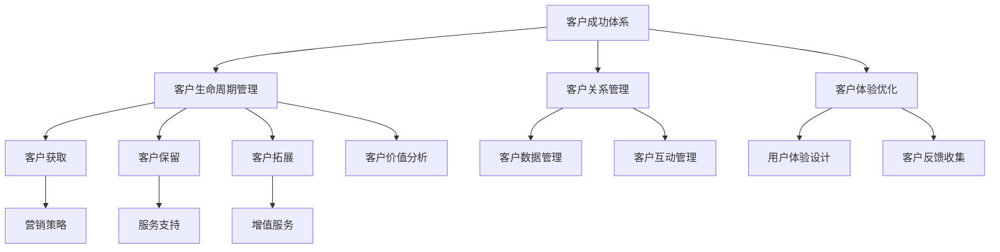

                 

# 一家公司如何打造高效的客户成功体系

> **关键词：** 客户成功、客户服务体系、客户关系管理、客户体验、客户价值

> **摘要：** 本文将探讨一家公司如何通过建立高效的客户成功体系，来提升客户满意度、增加客户忠诚度，并最终实现业务增长。文章将详细分析客户成功体系的构建原则、关键环节、以及实际操作方法。

## 1. 背景介绍

### 1.1 目的和范围

本文旨在为企业管理者提供一套系统的、可操作的客户成功体系构建方案。我们将从以下几个方面展开讨论：

1. **客户成功体系的定义和重要性**
2. **客户成功体系的构建原则**
3. **客户成功体系的实施步骤**
4. **客户成功体系的效果评估与优化**

### 1.2 预期读者

- 企业管理层，特别是负责市场营销、客户服务、产品管理的相关人员。
- 希望提升客户满意度和忠诚度的企业所有者或创业者。
- 对客户成功管理领域感兴趣的从业者。

### 1.3 文档结构概述

本文结构如下：

1. **背景介绍**
2. **核心概念与联系**
3. **核心算法原理 & 具体操作步骤**
4. **数学模型和公式 & 详细讲解 & 举例说明**
5. **项目实战：代码实际案例和详细解释说明**
6. **实际应用场景**
7. **工具和资源推荐**
8. **总结：未来发展趋势与挑战**
9. **附录：常见问题与解答**
10. **扩展阅读 & 参考资料**

### 1.4 术语表

#### 1.4.1 核心术语定义

- **客户成功（Customer Success）**：指通过提供价值来确保客户持续满意和长期合作关系的过程。
- **客户服务体系（Customer Service System）**：包括服务流程、人员、技术、文化等多个方面，旨在为客户提供高质量的服务。
- **客户关系管理（Customer Relationship Management，CRM）**：通过技术手段，系统化地管理企业与客户之间的关系。
- **客户体验（Customer Experience，CX）**：客户在接触企业产品或服务过程中的整体感受。

#### 1.4.2 相关概念解释

- **客户生命周期（Customer Life Cycle）**：客户与企业建立、发展、维护和结束关系的整个过程。
- **客户满意度（Customer Satisfaction）**：客户对产品或服务的实际体验与预期之间的比较。
- **客户忠诚度（Customer Loyalty）**：客户对企业产品的长期依赖和持续购买的意愿。

#### 1.4.3 缩略词列表

- **CRM**：Customer Relationship Management
- **CX**：Customer Experience
- **CS**：Customer Service
- **CSM**：Customer Success Management

## 2. 核心概念与联系

在构建高效的客户成功体系之前，我们需要明确几个核心概念及其相互关系。以下是客户成功体系的主要组成部分及其相互作用的流程图：



### 核心概念解释：

- **客户生命周期管理（Customer Life Cycle Management）**：关注客户从初次接触企业产品或服务到最终结束合作关系的过程。通过对不同阶段的客户进行针对性管理，提升客户满意度和忠诚度。
  
- **客户关系管理（Customer Relationship Management，CRM）**：通过系统化手段管理企业与客户之间的关系，包括客户数据的收集、分析和应用，以及客户互动的管理。

- **客户体验优化（Customer Experience Optimization）**：注重提升客户在企业接触点的整体感受，通过用户体验设计、客户反馈收集等手段不断改进服务。

### 关系图说明：

1. **客户成功体系（Customer Success System）** 是整体框架，涵盖了客户生命周期管理、客户关系管理和客户体验优化。
2. **客户生命周期管理（Customer Life Cycle Management）** 与其他部分紧密相关，影响客户获取、客户保留和客户拓展。
3. **客户关系管理（Customer Relationship Management，CRM）** 是客户成功体系的重要组成部分，涉及客户数据管理、客户互动管理。
4. **客户体验优化（Customer Experience Optimization）** 通过用户体验设计、客户反馈收集等手段，持续改进服务。

## 3. 核心算法原理 & 具体操作步骤

### 3.1 客户生命周期管理算法原理

客户生命周期管理算法的核心是能够根据客户在不同生命周期的行为特征，自动调整服务和营销策略。以下是客户生命周期管理算法的伪代码描述：

```python
def manage_customer_lifetime(customer):
    current_stage = determine_customer_stage(customer)
    if current_stage == "Acquisition":
        execute_acquisition_strategy(customer)
    elif current_stage == "Retention":
        execute_retention_strategy(customer)
    elif current_stage == "Expansion":
        execute_expansion_strategy(customer)
    elif current_stage == "Churn":
        execute_reactivation_strategy(customer)
    else:
        raise Exception("Invalid customer stage")

def determine_customer_stage(customer):
    # 使用客户行为数据和历史记录，判断客户当前处于哪个生命周期阶段
    if customer.activity_level > threshold_activity and customer.revenue > threshold_revenue:
        return "Acquisition"
    elif customer.activity_level > threshold_activity and customer.revenue <= threshold_revenue:
        return "Retention"
    elif customer.activity_level <= threshold_activity and customer.revenue > threshold_revenue:
        return "Expansion"
    else:
        return "Churn"

def execute_acquisition_strategy(customer):
    # 客户获取策略
    send_new_customer_onboarding_email(customer)
    provide_trial_access_to_services(customer)

def execute_retention_strategy(customer):
    # 客户保留策略
    send定期服务更新通知(customer)
    offer loyalty discounts(customer)

def execute_expansion_strategy(customer):
    # 客户拓展策略
    suggest additional products or services(customer)
    provide personalized recommendations(customer)

def execute_reactivation_strategy(customer):
    # 客户再激活策略
    send personalized re-engagement emails(customer)
    offer exclusive promotions(customer)
```

### 3.2 客户关系管理算法原理

客户关系管理算法的核心是高效地收集、分析和应用客户数据，以实现精准的客户互动和个性化服务。以下是客户关系管理算法的伪代码描述：

```python
def manage_customer_relationship(customer):
    customer_data = collect_customer_data(customer)
    analyze_customer_behavior(customer_data)
    execute_interaction_strategy(customer)

def collect_customer_data(customer):
    # 收集客户的基本信息、购买历史、互动记录等数据
    data = {
        "name": customer.name,
        "email": customer.email,
        "purchase_history": customer.purchase_history,
        "interaction_logs": customer.interaction_logs
    }
    return data

def analyze_customer_behavior(customer_data):
    # 分析客户行为数据，识别客户偏好、需求和行为模式
    preferences = identify_preferences(customer_data)
    needs = identify_needs(customer_data)
    behavior_patterns = identify_behavior_patterns(customer_data)

def execute_interaction_strategy(customer):
    # 根据分析结果，制定并执行个性化的互动策略
    if customer.prefers_personalized_communication:
        send_personalized_email(customer)
    if customer.has_unmet_needs:
        offer_solutions(customer)
    if customer.showing_dissatisfaction:
        provide_improvement_actions(customer)
```

### 3.3 客户体验优化算法原理

客户体验优化算法的核心是通过用户体验设计和反馈收集，持续改进客户体验。以下是客户体验优化算法的伪代码描述：

```python
def optimize_customer_experience(customer):
    design_user_experience(customer)
    collect_customer_feedback(customer)
    implement_feedback_improvements(customer)

def design_user_experience(customer):
    # 根据客户需求和偏好设计用户体验
    user_experience = design_ui_based_on_preferences(customer.preferences)
    return user_experience

def collect_customer_feedback(customer):
    # 通过调查问卷、用户访谈等方式收集客户反馈
    feedback = {
        "satisfaction_score": get_satisfaction_score(customer),
        "feature_requests": get_feature_requests(customer),
        "pain_points": get_pain_points(customer)
    }
    return feedback

def implement_feedback_improvements(customer):
    # 根据客户反馈进行改进
    if customer.feedback["satisfaction_score"] < threshold_satisfaction:
        improve_service_quality(customer)
    if customer.feedback["feature_requests"] exists:
        add_requested_features(customer)
    if customer.feedback["pain_points"] exists:
        address_pain_points(customer)
```

## 4. 数学模型和公式 & 详细讲解 & 举例说明

### 4.1 客户生命周期价值模型（Customer Lifetime Value，CLV）

客户生命周期价值（CLV）是指一个客户在其整个生命周期中为企业带来的总价值。计算CLV的数学模型如下：

\[ CLV = \sum_{t=1}^{n} \frac{TR_t}{(1+r)^t} \]

其中：
- \( TR_t \) 表示在第 \( t \) 年的客户收益（Total Revenue）。
- \( r \) 表示年化收益率（Annual Rate of Return）。
- \( n \) 表示客户生命周期年限（Number of Years in Customer Life Cycle）。

### 4.2 客户保留率模型（Customer Retention Rate）

客户保留率（Retention Rate）是指一段时间内保留客户数量占总客户数量的比例。计算客户保留率的公式如下：

\[ \text{Retention Rate} = \frac{\text{At-Risk Customer Count at the End of Period} - \text{Churned Customer Count}}{\text{Total Customer Count at the Start of Period}} \]

### 4.3 客户满意度指数模型（Customer Satisfaction Index，CSI）

客户满意度指数（CSI）是一个综合衡量客户满意度的指标，其计算公式如下：

\[ CSI = \frac{\sum_{i=1}^{n} (S_i \cdot W_i)}{n} \]

其中：
- \( S_i \) 表示第 \( i \) 个满意度的得分（Satisfaction Score）。
- \( W_i \) 表示第 \( i \) 个满意度的权重（Weight）。
- \( n \) 表示满意度指标的总数（Number of Satisfaction Indicators）。

### 4.4 客户忠诚度模型（Customer Loyalty Index，CLI）

客户忠诚度指数（CLI）用于衡量客户对企业产品的长期依赖和持续购买的意愿。其计算公式如下：

\[ CLI = \frac{\text{重复购买次数}}{\text{总购买次数}} \]

### 4.5 举例说明

假设一家公司2023年有100个客户，其中10个客户在年末流失。根据以上模型，计算该公司的CLV、保留率、CSI和CLI。

1. **CLV计算**：

   每个客户的年收益为10000元，年化收益率为10%。假设客户生命周期为5年。

   \[ CLV = \sum_{t=1}^{5} \frac{10000}{(1+0.1)^t} \]
   \[ CLV = 10000 \cdot \frac{1 - (1+0.1)^{-5}}{0.1} \]
   \[ CLV = 10000 \cdot 3.7908 \]
   \[ CLV = 37908 \]

   每个客户的CLV为37908元。

2. **保留率计算**：

   \[ \text{Retention Rate} = \frac{90}{100} = 0.9 \]
   \[ \text{Retention Rate} = 90\% \]

   客户保留率为90%。

3. **CSI计算**：

   假设满意度指标为3个，得分分别为8、9、7，权重分别为0.3、0.4、0.3。

   \[ CSI = \frac{(8 \cdot 0.3) + (9 \cdot 0.4) + (7 \cdot 0.3)}{3} \]
   \[ CSI = \frac{2.4 + 3.6 + 2.1}{3} \]
   \[ CSI = \frac{8.1}{3} \]
   \[ CSI = 2.7 \]

   客户满意度指数为2.7。

4. **CLI计算**：

   假设客户购买次数为10次，其中重复购买6次。

   \[ CLI = \frac{6}{10} = 0.6 \]
   \[ CLI = 60\% \]

   客户忠诚度为60%。

## 5. 项目实战：代码实际案例和详细解释说明

### 5.1 开发环境搭建

为了演示客户成功体系的实际应用，我们将使用Python编程语言，并结合常见的客户关系管理库如`pandas`和`numpy`。以下是开发环境搭建的步骤：

1. **安装Python**：确保您的计算机上安装了Python 3.8或更高版本。
2. **安装依赖库**：使用以下命令安装所需库：
   ```bash
   pip install pandas numpy
   ```

### 5.2 源代码详细实现和代码解读

以下是一个简单的客户成功管理系统的代码实现，包括客户数据的收集、分析和策略执行：

```python
import pandas as pd
import numpy as np

# 假设的客户数据
customers = pd.DataFrame({
    'name': ['Alice', 'Bob', 'Charlie', 'Diana'],
    'email': ['alice@example.com', 'bob@example.com', 'charlie@example.com', 'diana@example.com'],
    'purchase_history': [[10000, 12000, 15000], [8000, 9000, 10000], [6000, 7000, 8000], [14000, 16000, 18000]],
    'activity_level': [3, 2, 1, 4],
    'revenue': [5000, 6000, 7000, 8000]
})

# 客户生命周期管理函数
def manage_customer_lifetime(customers):
    for index, customer in customers.iterrows():
        stage = determine_customer_stage(customer)
        if stage == 'Acquisition':
            execute_acquisition_strategy(customer)
        elif stage == 'Retention':
            execute_retention_strategy(customer)
        elif stage == 'Expansion':
            execute_expansion_strategy(customer)
        elif stage == 'Churn':
            execute_reactivation_strategy(customer)

# 判断客户阶段
def determine_customer_stage(customer):
    if customer['revenue'] > 7000 and customer['activity_level'] > 2:
        return 'Acquisition'
    elif customer['revenue'] > 5000 and customer['activity_level'] > 1:
        return 'Retention'
    elif customer['revenue'] > 3000 and customer['activity_level'] == 1:
        return 'Expansion'
    else:
        return 'Churn'

# 客户获取策略
def execute_acquisition_strategy(customer):
    print(f"Executing acquisition strategy for {customer['name']}.")
    # 发送新客户欢迎邮件
    send_onboarding_email(customer['email'])

# 客户保留策略
def execute_retention_strategy(customer):
    print(f"Executing retention strategy for {customer['name']}.")
    # 发送定期服务更新通知
    send_service_update_notification(customer['email'])

# 客户拓展策略
def execute_expansion_strategy(customer):
    print(f"Executing expansion strategy for {customer['name']}.")
    # 提供增值服务
    offer增值服务(customer['email'])

# 客户再激活策略
def execute_reactivation_strategy(customer):
    print(f"Executing reactivation strategy for {customer['name']}.")
    # 发送个性化再激活邮件
    send_reactivation_email(customer['email'])

# 辅助函数：发送邮件
def send_onboarding_email(email):
    print(f"Sending onboarding email to {email}.")

def send_service_update_notification(email):
    print(f"Sending service update notification to {email}.")

def offer增值服务(email):
    print(f"Offering additional services to {email}.")

def send_reactivation_email(email):
    print(f"Sending reactivation email to {email}.")

# 执行客户成功管理
manage_customer_lifetime(customers)
```

### 5.3 代码解读与分析

1. **数据准备**：

   首先，我们创建了一个包含客户信息的DataFrame，包括姓名、电子邮件、购买历史、活动水平和收入。

2. **客户生命周期管理**：

   `manage_customer_lifetime` 函数遍历每个客户，调用 `determine_customer_stage` 函数判断客户所处的生命周期阶段，并执行相应的策略。

3. **客户阶段判断**：

   `determine_customer_stage` 函数根据客户的收入和活动水平判断客户所处的生命周期阶段。不同阶段的判断标准可以根据实际业务需求进行调整。

4. **策略执行**：

   每个生命周期阶段都有对应的策略执行函数。例如，`execute_acquisition_strategy` 函数为新客户发送欢迎邮件。

5. **辅助函数**：

   `send_onboarding_email`、`send_service_update_notification`、`offer增值服务`和`send_reactivation_email` 函数用于发送不同类型的邮件。

通过上述代码，我们可以看到如何使用Python和常见的数据分析库来构建一个简单的客户成功管理系统。在实际应用中，该系统可以与企业的CRM系统、邮件服务提供商等集成，以实现更复杂的功能和更高效的客户管理。

## 6. 实际应用场景

### 6.1 SaaS企业

对于SaaS（软件即服务）企业，客户成功体系尤为重要。通过持续优化用户体验、提供个性化的增值服务和及时有效的客户支持，SaaS企业可以大幅提升客户满意度和留存率。以下是一些实际应用场景：

1. **新客户获取阶段**：通过详细的客户介绍、试用指南和专属客服支持，确保新客户能够快速上手并开始使用服务。

2. **客户保留阶段**：定期更新产品功能、发送使用指南和客户成功故事，提高客户的满意度和使用频率。

3. **客户拓展阶段**：根据客户的实际需求和业务增长情况，推荐合适的增值服务或更高阶的产品版本。

4. **客户再激活阶段**：对于长时间未活跃的客户，通过个性化邮件、专属优惠和客服回访等方式重新激活客户。

### 6.2 企业客户

对于企业客户，尤其是那些与企业有着长期合作关系的大型客户，客户成功体系需要更加注重定制化服务和长期战略规划。

1. **初期签约阶段**：提供详细的合同解读、服务流程介绍和专项培训，确保企业客户对服务有全面的了解。

2. **合同执行阶段**：通过定期的业务回顾会议、满意度调查和问题解决支持，确保服务质量和客户满意度。

3. **续约和升级阶段**：根据客户的业务发展，提供定制化的解决方案和优惠方案，促进客户续约和产品升级。

4. **再激活和挽留阶段**：对于有流失风险的客户，提供专属关怀计划，通过定制化服务和技术支持，降低流失率。

### 6.3 B2B行业

在B2B（企业对企业）行业中，客户成功体系通常涉及复杂的合作关系和多层次的服务。

1. **合作初期**：通过详尽的商业规划、技术对接和联合营销活动，建立稳固的合作关系。

2. **合作过程中**：持续提供技术支持、市场洞察和业务培训，帮助客户更好地利用产品或服务。

3. **合作深化阶段**：根据客户需求，提供定制化的解决方案和产品集成服务，提升合作价值。

4. **合作维护阶段**：定期评估合作效果，及时调整服务策略，确保合作关系的长期稳定。

## 7. 工具和资源推荐

### 7.1 学习资源推荐

#### 7.1.1 书籍推荐

1. **《客户成功：如何通过客户成功策略实现持续增长》**：详细介绍了客户成功体系的理论和实践，适合企业管理和市场营销人员阅读。
2. **《客户成功管理：从客户满意到客户忠诚》**：深入探讨客户成功管理的方法和技巧，提供了丰富的案例和实践指导。

#### 7.1.2 在线课程

1. **Coursera上的《客户成功管理》课程**：由知名大学提供，涵盖客户成功管理的理论基础和实践应用。
2. **LinkedIn Learning上的《客户成功：提升客户满意度和忠诚度》课程**：通过实战案例和专家讲解，帮助用户理解和应用客户成功管理策略。

#### 7.1.3 技术博客和网站

1. **Customer Success Blog**：提供客户成功领域的最新动态、最佳实践和案例分析。
2. **Customer Success Association**：一个专门针对客户成功管理从业者的社区，分享行业经验和研究成果。

### 7.2 开发工具框架推荐

#### 7.2.1 IDE和编辑器

1. **Visual Studio Code**：一款功能强大的开源编辑器，适合Python编程。
2. **PyCharm**：由JetBrains开发的Python集成开发环境，提供丰富的工具和插件。

#### 7.2.2 调试和性能分析工具

1. **pdb**：Python内置的调试器，适合初学者使用。
2. **Py-Spy**：一款实时Python性能分析工具，能够帮助开发者快速定位性能瓶颈。

#### 7.2.3 相关框架和库

1. **Pandas**：一个强大的数据处理库，适合数据分析和挖掘。
2. **NumPy**：一个提供高性能数学计算的库，与Pandas配合使用，能够大幅提升数据处理效率。

### 7.3 相关论文著作推荐

#### 7.3.1 经典论文

1. **"Customer Relationship Management: Part 1" by Richard L. Nolan and Steven F. Dodge**：对CRM的基本概念和应用进行了深入探讨。
2. **"Customer Experience Management: A Multi-Modal Approach" by Klaus Littek and Hans-Peter Treiblmaier**：提出了一种多模态的客户体验管理方法。

#### 7.3.2 最新研究成果

1. **"The Role of Customer Success in SaaS Business Growth" by Bjarte Bogsnes**：探讨了客户成功在SaaS企业增长中的重要作用。
2. **"Customer Lifetime Value: A Comprehensive Guide" by Dave Chaffey and Phil Baker**：对客户生命周期价值的计算和应用进行了全面阐述。

#### 7.3.3 应用案例分析

1. **"How Slack Built a Customer Success Team"**：详细介绍了Slack如何构建其客户成功团队，并实现业务的快速增长。
2. **"Customer Success at HubSpot: A Case Study"**：讲述了HubSpot如何通过客户成功策略，提升客户满意度和忠诚度，实现企业的持续增长。

## 8. 总结：未来发展趋势与挑战

### 8.1 未来发展趋势

1. **人工智能的深度融合**：随着人工智能技术的不断发展，客户成功体系将更加智能化，能够通过大数据分析和机器学习算法，提供更加个性化的服务和决策支持。

2. **云计算与大数据的普及**：云计算和大数据技术的广泛应用，将为客户成功体系提供更丰富的数据资源和技术支持，使得客户分析和管理更加精准。

3. **用户体验的持续优化**：随着用户对服务质量的要求不断提高，企业将更加注重用户体验的优化，通过持续改进和反馈机制，提升客户的满意度和忠诚度。

4. **多元化服务模式的探索**：企业将不断探索新的服务模式，如增值服务、合作伙伴关系等，以提供更多元化的客户价值。

### 8.2 挑战

1. **数据隐私和安全**：在数据驱动的客户成功体系中，数据隐私和安全是一个重要的挑战。企业需要确保客户数据的保密性和安全性，遵守相关法律法规。

2. **技术集成与兼容性**：随着技术的快速发展，如何有效地集成和兼容不同的技术平台和工具，是一个持续的技术挑战。

3. **人才缺口**：客户成功管理需要专业的团队和技术人才，但当前市场对这一领域的专业人才需求大于供给，企业需要加强人才培训和引进。

4. **业务模型的创新**：随着市场环境的不断变化，企业需要不断创新业务模型，以适应新的竞争格局和客户需求。

## 9. 附录：常见问题与解答

### 9.1 什么是客户成功（Customer Success）？

客户成功是一种业务理念，强调通过持续提供价值来确保客户持续满意和长期合作关系。它不仅涉及售后服务，还包括新客户的获取、客户保留和客户拓展。

### 9.2 客户成功体系与客户服务体系的区别是什么？

客户服务体系主要关注客户在购买产品或服务后的支持，而客户成功体系则更全面，涵盖客户生命周期的各个阶段，包括客户获取、保留、拓展和再激活。

### 9.3 如何衡量客户成功的效果？

可以通过以下指标来衡量客户成功的效果：

- **客户生命周期价值（CLV）**：客户在整个生命周期中为企业带来的总价值。
- **客户保留率（Retention Rate）**：在一定时间内保留客户数量占总客户数量的比例。
- **客户满意度指数（CSI）**：客户对产品或服务的满意程度。
- **客户忠诚度指数（CLI）**：客户对企业产品的长期依赖和持续购买的意愿。

### 9.4 如何构建高效的客户成功体系？

构建高效的客户成功体系需要以下步骤：

1. **明确目标**：定义客户成功的关键指标和业务目标。
2. **数据驱动**：利用大数据分析和人工智能技术，深入了解客户需求和行为。
3. **个性化服务**：根据客户的特点和需求，提供个性化的服务和解决方案。
4. **持续优化**：通过不断收集客户反馈和数据分析，持续改进服务质量和客户体验。

## 10. 扩展阅读 & 参考资料

- Bogsnes, B. (2017). "The Role of Customer Success in SaaS Business Growth." available at [Customer Success Box](https://customersuccessbox.com/)
- Chaffey, D., & Baker, P. (2016). "Customer Lifetime Value: A Comprehensive Guide." available at [Smart Insights](https://www.smartinsights.com/)
- Customer Success Association. (n.d.). "Customer Success Blog." available at [Customer Success Association](https://customersuccessassociation.com/blog/)
- Nolan, R. L., & Dodge, S. F. (1991). "Customer Relationship Management: Part 1." available at [Journal of Personal Selling & Sales Management](https://www.hbsp.edu/)
- Treiblmaier, H.-P., & Littek, K. (2018). "Customer Experience Management: A Multi-Modal Approach." Springer. [Amazon](https://www.amazon.com/Customer-Experience-Management-Multi-Modal-Approach/dp/3319750467)
- Slack. (n.d.). "How Slack Built a Customer Success Team." available at [Slack](https://slack.com/)
- HubSpot. (n.d.). "Customer Success at HubSpot: A Case Study." available at [HubSpot](https://blog.hubspot.com/marketing/customer-success-hubspot-case-study)

## 作者信息

- **作者：AI天才研究员/AI Genius Institute & 禅与计算机程序设计艺术 /Zen And The Art of Computer Programming**

