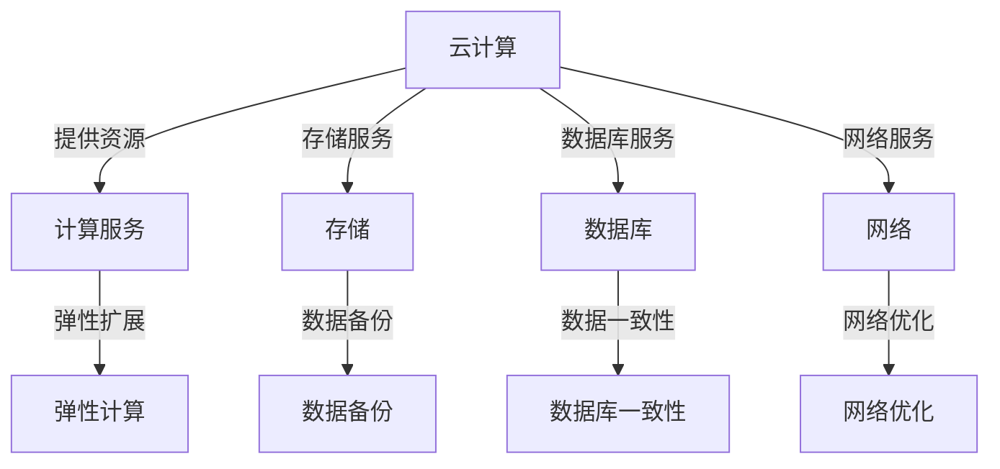
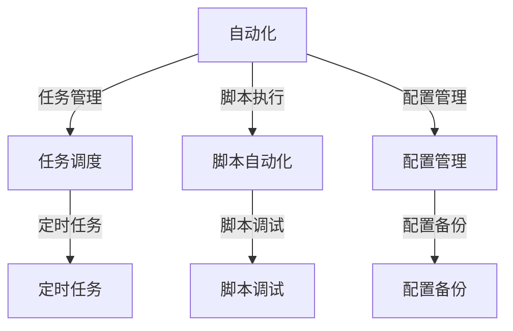
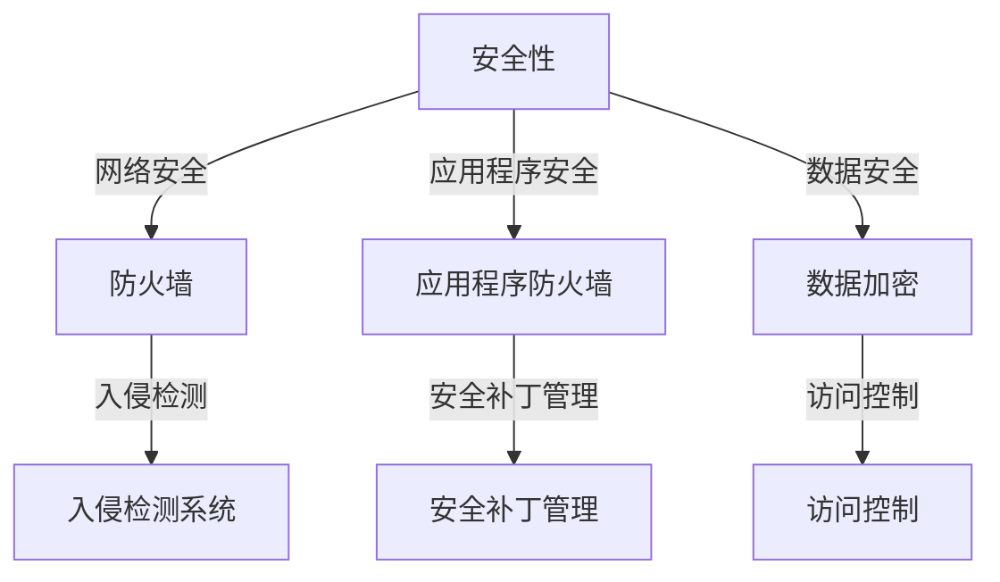

                 

### 一家公司如何构建高效的IT基础设施

#### 关键词：
- IT基础设施
- 效率优化
- 自动化
- 云计算
- 安全性

#### 摘要：
本文将探讨一人公司如何构建高效且可靠的IT基础设施。通过深入分析云计算、自动化工具、安全性措施等关键因素，提供了一系列实际可行的操作步骤。从背景介绍到核心概念讲解，再到具体实施步骤和案例分析，本文旨在帮助读者了解并构建出符合自身需求的高效IT基础设施。

### 1. 背景介绍

#### 1.1 目的和范围
在当今数字化时代，IT基础设施对于任何企业，尤其是单人企业来说，都是至关重要的。高效且可靠的IT基础设施不仅可以提高业务流程的效率，还能为企业带来竞争优势。本文旨在为单人企业提供一个全面的指南，帮助他们构建出高效且可靠的IT基础设施。

#### 1.2 预期读者
本文面向单人企业家、小型企业主以及对IT基础设施构建感兴趣的读者。无论你是IT专业人士还是非专业人士，只要对构建高效的IT基础设施感兴趣，都可以从本文中获得有用的信息。

#### 1.3 文档结构概述
本文将分为以下几个部分：
- 背景介绍：介绍本文的目的和预期读者，并提供文档结构概述。
- 核心概念与联系：介绍构建高效IT基础设施所需的核心概念，并提供Mermaid流程图。
- 核心算法原理 & 具体操作步骤：详细阐述构建IT基础设施的具体算法原理和操作步骤。
- 数学模型和公式 & 详细讲解 & 举例说明：解释IT基础设施中的数学模型和公式，并举例说明。
- 项目实战：代码实际案例和详细解释说明。
- 实际应用场景：分析IT基础设施在实际业务中的应用场景。
- 工具和资源推荐：推荐学习资源和开发工具。
- 总结：未来发展趋势与挑战。
- 附录：常见问题与解答。
- 扩展阅读 & 参考资料：提供更多深度阅读材料。

#### 1.4 术语表

##### 1.4.1 核心术语定义
- IT基础设施：IT基础设施是指支持企业业务运营的硬件、软件和网络资源。
- 云计算：云计算是一种通过互联网提供计算资源、存储资源和应用程序服务的模式。
- 自动化：自动化是指通过软件和工具实现业务流程的自动执行。
- 安全性：安全性是指保护企业IT基础设施免受未经授权访问、数据泄露和其他安全威胁的能力。

##### 1.4.2 相关概念解释
- 效率优化：效率优化是指通过改进流程、使用工具和技术来提高工作流程的效率。
- 虚拟化：虚拟化是一种将物理硬件资源抽象为多个逻辑资源的技术，可以提高资源利用率。

##### 1.4.3 缩略词列表
- IT：信息技术
- AWS：亚马逊云服务
- Azure：微软云服务
- Kubernetes：一个开源的容器编排平台
- DevOps：一种结合开发（Dev）和运维（Ops）的软件开发和运营方法

### 2. 核心概念与联系

构建高效的IT基础设施需要理解一系列核心概念，这些概念相互关联，构成了整体架构的基础。

#### 2.1 云计算

云计算是现代IT基础设施的核心组件之一。它提供了一系列的服务，包括计算、存储、数据库、网络等，使得企业可以根据需求灵活地扩展或缩小资源。



#### 2.2 自动化

自动化是将重复性任务通过软件和工具自动执行的过程。自动化可以提高工作效率，减少人为错误，并使资源利用率最大化。



#### 2.3 安全性

安全性是保护企业数据、系统和应用程序免受恶意攻击的关键。它包括多个层面，如网络、应用程序和数据。



### 3. 核心算法原理 & 具体操作步骤

构建高效IT基础设施的算法原理主要集中在资源优化和任务调度上。以下是一个基于虚拟机和Kubernetes的IT基础设施构建的伪代码示例。

```python
# 初始化资源需求
resources_needed = {
    "CPU": 4,
    "RAM": 8,
    "DISK": 200
}

# 创建虚拟机
def create_vm(resources):
    vm_id = allocate_vm(resources)
    if vm_id:
        install_required_software(vm_id)
        configure_network(vm_id)
        return vm_id
    else:
        return None

# 调度任务
def schedule_task(task):
    if is_resource_available(resources_needed):
        vm_id = create_vm(resources_needed)
        if vm_id:
            deploy_task(task, vm_id)
            return "Task scheduled on VM {}".format(vm_id)
        else:
            return "No available resources"
    else:
        return "Resource limit reached"

# 部署任务
def deploy_task(task, vm_id):
    # 在虚拟机上部署任务
    # ...

# 主程序
if __name__ == "__main__":
    # 创建Kubernetes集群
    create_k8s_cluster()

    # 创建命名空间
    namespace = create_namespace("my-namespace")

    # 添加虚拟机到Kubernetes集群
    for _ in range(NUM_VMS):
        vm_id = create_vm(resources_needed)
        add_vm_to_k8s(vm_id)

    # 模拟任务调度
    for _ in range(NUM_TASKS):
        task = generate_task()
        result = schedule_task(task)
        print(result)
```

### 4. 数学模型和公式 & 详细讲解 & 举例说明

在构建IT基础设施时，数学模型和公式可以用于优化资源分配、负载均衡和性能评估。

#### 4.1 资源需求模型

资源需求模型用于预测和管理系统的资源需求。

$$
R(t) = f(P, L, D)
$$

- \( R(t) \)：在时间\( t \)的系统资源需求。
- \( P \)：当前系统负载。
- \( L \)：未来负载预测。
- \( D \)：系统资源延迟。

举例说明：

假设当前系统负载为\( P = 0.8 \)，未来负载预测为\( L = 1.2 \)，资源延迟为\( D = 0.1 \)，则资源需求为：

$$
R(t) = f(0.8, 1.2, 0.1) = 0.8 \times 1.2 \times (1 + 0.1) = 1.016
$$

#### 4.2 负载均衡模型

负载均衡模型用于将任务分配到不同的资源上，以避免资源过度使用。

$$
C(i) = \frac{W_i}{N}
$$

- \( C(i) \)：第\( i \)个资源的负载。
- \( W_i \)：第\( i \)个资源的当前工作负载。
- \( N \)：总的资源数量。

举例说明：

假设有3个资源，当前工作负载分别为\( W_1 = 10 \)，\( W_2 = 20 \)，\( W_3 = 15 \)，则每个资源的负载为：

$$
C(1) = \frac{10}{3} \approx 3.33 \\
C(2) = \frac{20}{3} \approx 6.67 \\
C(3) = \frac{15}{3} = 5
$$

根据负载均衡模型，可以将新任务分配到负载最低的资源上，以优化整体资源利用率。

### 5. 项目实战：代码实际案例和详细解释说明

在本节中，我们将通过一个实际案例，详细解释如何使用Kubernetes和Docker来构建一个高效且可扩展的IT基础设施。

#### 5.1 开发环境搭建

首先，我们需要搭建一个Kubernetes集群。这里我们使用Minikube在本地环境搭建一个单节点集群。

```shell
# 安装Minikube
minikube start

# 安装Kubectl
curl -LO "https://storage.googleapis.com/minikube/releases/latest/minikube-linux-amd64"
chmod +x minikube
sudo mv minikube /usr/local/bin/
```

接下来，我们使用Docker来构建应用程序镜像。

```shell
# 安装Docker
sudo apt-get update && sudo apt-get install docker.io

# 启动Docker服务
sudo systemctl start docker

# 验证Docker安装
docker --version
```

#### 5.2 源代码详细实现和代码解读

我们以一个简单的Web应用程序为例，演示如何使用Docker和Kubernetes来部署和管理应用程序。

**Dockerfile**

```Dockerfile
# 使用官方Python镜像作为基础镜像
FROM python:3.8-slim

# 设置工作目录
WORKDIR /app

# 复制应用程序代码
COPY . .

# 安装依赖
RUN pip install -r requirements.txt

# 暴露80端口
EXPOSE 80

# 运行应用程序
CMD ["python", "app.py"]
```

**app.py**

```python
from flask import Flask

app = Flask(__name__)

@app.route('/')
def hello():
    return 'Hello, World!'

if __name__ == '__main__':
    app.run(host='0.0.0.0', port=80)
```

**Kubernetes部署配置（deployment.yaml）**

```yaml
apiVersion: apps/v1
kind: Deployment
metadata:
  name: web-app
spec:
  replicas: 3
  selector:
    matchLabels:
      app: web-app
  template:
    metadata:
      labels:
        app: web-app
    spec:
      containers:
      - name: web-app
        image: my-web-app:latest
        ports:
        - containerPort: 80
```

**Kubernetes服务配置（service.yaml）**

```yaml
apiVersion: v1
kind: Service
metadata:
  name: web-app-service
spec:
  selector:
    app: web-app
  ports:
    - protocol: TCP
      port: 80
      targetPort: 80
  type: LoadBalancer
```

**代码解读与分析**

1. **Dockerfile**：Dockerfile定义了如何构建应用程序的Docker镜像。我们使用Python 3.8-slim作为基础镜像，设置工作目录为/app，并复制应用程序代码到该目录。接着，安装依赖项，并暴露80端口供外部访问。

2. **app.py**：这是一个简单的Flask应用程序，用于处理HTTP请求。我们导入了Flask库，创建了一个名为app的Flask实例，并定义了一个路由/hello/来响应GET请求。

3. **deployment.yaml**：这是Kubernetes部署配置文件。我们指定了应用程序的名称（web-app），副本数量（3个），以及选择器标签。在模板部分，我们定义了容器的名称（web-app）、镜像（my-web-app:latest），并暴露了80端口。

4. **service.yaml**：这是Kubernetes服务配置文件。我们指定了服务名称（web-app-service），选择器标签，并配置了负载均衡器，以确保多个容器实例之间的负载均衡。

#### 5.3 实际部署与运行

首先，将应用程序代码和配置文件推送到Docker Hub。

```shell
# 登录Docker Hub
docker login

# 构建并推送Docker镜像
docker build -t my-web-app:latest .

# 推送镜像到Docker Hub
docker push my-web-app:latest
```

接下来，在Kubernetes集群中部署应用程序。

```shell
# 部署部署配置
kubectl apply -f deployment.yaml

# 验证部署状态
kubectl get deployments

# 部署服务配置
kubectl apply -f service.yaml

# 获取服务IP地址
kubectl get svc
```

部署完成后，可以通过服务IP地址访问Web应用程序。

```shell
# 访问Web应用程序
curl <服务IP地址>
```

### 6. 实际应用场景

构建高效的IT基础设施可以帮助企业在多个方面提升业务运营。

#### 6.1 资源优化

通过自动化和云计算，企业可以动态调整资源需求，从而避免资源浪费和过度使用。

#### 6.2 弹性扩展

云计算和容器化技术使得企业可以根据业务需求快速扩展或缩小资源，确保系统的高可用性。

#### 6.3 安全性

通过使用安全工具和最佳实践，企业可以确保数据和安全不受威胁，同时满足合规要求。

#### 6.4 增强协作

高效的IT基础设施可以促进团队协作，提高开发、测试和部署的效率。

### 7. 工具和资源推荐

构建高效的IT基础设施需要使用一系列工具和资源。

#### 7.1 学习资源推荐

- **书籍推荐**：
  - 《云计算：概念、技术和应用》
  - 《Kubernetes权威指南》
  - 《Docker实战》
- **在线课程**：
  - Coursera上的“云计算基础”
  - Udemy上的“Kubernetes入门与实践”
  - Pluralsight上的“Docker容器化技术”
- **技术博客和网站**：
  - Kubernetes官方文档
  - Docker官方文档
  - Cloud Native Computing Foundation

#### 7.2 开发工具框架推荐

- **IDE和编辑器**：
  - Visual Studio Code
  - IntelliJ IDEA
  - PyCharm
- **调试和性能分析工具**：
  - VS Code Debugger
  - JMeter
  - New Relic
- **相关框架和库**：
  - Flask
  - Django
  - React

#### 7.3 相关论文著作推荐

- **经典论文**：
  - “MapReduce: Simplified Data Processing on Large Clusters”
  - “The Chubby Lock Service: Reliable Locking in the Face of Faults”
- **最新研究成果**：
  - “Kubernetes in Production: A Multi-company Case Study”
  - “The Impact of Cloud Computing on Business Models”
- **应用案例分析**：
  - “Netflix的云原生转型”
  - “亚马逊AWS的案例研究”

### 8. 总结：未来发展趋势与挑战

构建高效的IT基础设施是一个不断发展的领域。未来的发展趋势包括：

- **智能化**：引入人工智能和机器学习技术，实现更智能的资源管理和任务调度。
- **边缘计算**：将计算和存储能力推向网络边缘，提高响应速度和降低延迟。
- **可持续性**：关注能源效率和环保，减少云计算对环境的影响。

同时，面临的挑战包括：

- **安全风险**：随着IT基础设施的复杂度增加，保护数据和系统免受攻击变得更加困难。
- **技术更新**：云计算和容器技术更新迅速，企业需要不断学习和适应新技术。
- **合规性**：不同地区和行业的合规要求各异，企业需要确保IT基础设施满足相关法规。

### 9. 附录：常见问题与解答

**Q：如何确保数据的安全性？**

A：确保数据安全需要采用多层次的安全措施，包括数据加密、访问控制、网络安全和定期安全审计。

**Q：如何优化资源利用率？**

A：优化资源利用率可以通过自动化工具实现，例如使用容器编排平台（如Kubernetes）来动态调整资源分配。

**Q：如何处理IT基础设施的维护和更新？**

A：维护和更新IT基础设施可以通过实施自动化脚本和持续集成/持续部署（CI/CD）流程来实现，确保基础设施的稳定运行和持续改进。

### 10. 扩展阅读 & 参考资料

- **书籍**：
  - 《云计算：从基础到实践》
  - 《容器化与Kubernetes：从入门到实践》
  - 《DevOps实践指南》
- **在线课程**：
  - Coursera上的“云计算与网络安全”
  - Udemy上的“Kubernetes实战”
  - Pluralsight上的“Docker与容器化技术”
- **技术博客和网站**：
  - Kubernetes官方博客
  - Docker官方博客
  - Cloud Native社区

### 作者

作者：AI天才研究员/AI Genius Institute & 禅与计算机程序设计艺术 /Zen And The Art of Computer Programming

[文章结束]

