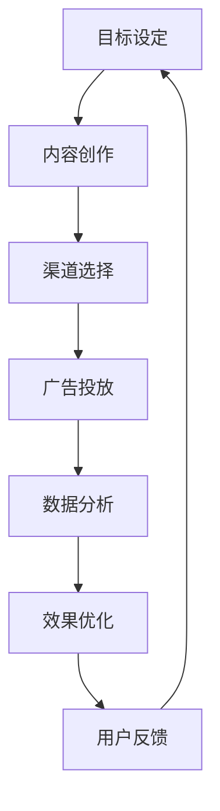

                 

# 一家公司如何进行有效的社交媒体营销

> **关键词：社交媒体营销、策略、执行、数据分析和案例研究**

> **摘要：本文旨在探讨一家独立公司如何通过社交媒体平台进行有效的营销。文章将详细分析核心策略、执行步骤、数据分析技巧，并提供实际案例，以帮助独立公司充分利用社交媒体，提升品牌影响力并实现业务增长。**

## 1. 背景介绍

### 1.1 目的和范围

本文的目的是为那些希望通过社交媒体平台提升品牌知名度并实现业务增长的独立公司提供一套系统的营销策略。我们将探讨社交媒体营销的各个方面，包括策略制定、执行方法、数据分析以及如何通过具体案例来学习实践经验。

### 1.2 预期读者

本文适合以下读者群体：

- 想要提升社交媒体营销技能的公司创始人或营销经理
- 负责社交媒体营销策略的团队成员
- 对数字营销和社交媒体运营感兴趣的学生和专业人士

### 1.3 文档结构概述

本文将按照以下结构进行：

- **第1章：背景介绍**：阐述本文的目的、预期读者以及文档结构。
- **第2章：核心概念与联系**：介绍社交媒体营销的核心概念，并提供流程图。
- **第3章：核心算法原理 & 具体操作步骤**：详细解释社交媒体营销策略的算法原理。
- **第4章：数学模型和公式 & 详细讲解 & 举例说明**：讨论数据分析中的数学模型。
- **第5章：项目实战：代码实际案例和详细解释说明**：提供具体的营销案例和代码实现。
- **第6章：实际应用场景**：分析不同的社交媒体应用场景。
- **第7章：工具和资源推荐**：推荐学习资源和开发工具。
- **第8章：总结：未来发展趋势与挑战**：展望社交媒体营销的未来。
- **第9章：附录：常见问题与解答**：解答读者可能遇到的问题。
- **第10章：扩展阅读 & 参考资料**：提供进一步学习的资源。

### 1.4 术语表

#### 1.4.1 核心术语定义

- **社交媒体营销**：通过社交媒体平台（如Facebook、Twitter、Instagram等）来推广品牌、产品或服务。
- **策略**：制定长期目标和具体行动计划。
- **KPI**：关键绩效指标，用于衡量营销活动的效果。
- **数据分析**：使用数学和统计方法来分析社交媒体数据，以优化营销策略。

#### 1.4.2 相关概念解释

- **内容营销**：通过创造和分享有价值的内容来吸引和保持目标受众。
- **社交媒体广告**：在社交媒体平台上投放的广告。
- **用户参与度**：衡量用户对社交媒体内容的反应程度，如点赞、评论、分享等。

#### 1.4.3 缩略词列表

- **KPI**：关键绩效指标
- **SEO**：搜索引擎优化
- **SMM**：社交媒体营销

## 2. 核心概念与联系

在开始详细的社交媒体营销策略讨论之前，我们需要理解几个核心概念，以及它们之间的关系。以下是一个Mermaid流程图，展示了这些概念之间的联系。



### 2.1 目标设定

目标设定是社交媒体营销的起点。公司需要明确想要达到的具体目标，如提高品牌知名度、增加网站流量或提升销售量。明确目标有助于制定具体的策略和行动计划。

### 2.2 内容创作

内容创作是吸引受众的关键。公司需要创作有价值、相关性强且有趣的内容，以吸引用户并促进互动。

### 2.3 渠道选择

渠道选择决定了内容将如何在社交媒体平台上传播。公司需要根据目标受众和内容类型选择最合适的平台。

### 2.4 广告投放

广告投放是提高内容曝光率的手段之一。公司可以通过社交媒体广告来推广内容，并吸引更多潜在客户。

### 2.5 数据分析

数据分析是优化营销策略的重要环节。通过分析数据，公司可以了解哪些策略最有效，并据此进行调整。

### 2.6 效果优化

效果优化是基于数据分析的结果来调整和改进营销策略，以提高整体效果。

### 2.7 用户反馈

用户反馈是了解受众需求的重要途径。公司需要倾听用户的声音，并据此调整内容和策略。

## 3. 核心算法原理 & 具体操作步骤

### 3.1 算法原理

社交媒体营销的策略制定和执行涉及多种算法原理，包括用户行为分析、内容推荐和广告投放优化等。以下是核心算法原理的详细解释。

#### 3.1.1 用户行为分析

用户行为分析是一种用于了解用户如何与社交媒体平台互动的方法。通过分析用户的行为数据，如点击率、点赞、分享和评论等，公司可以了解用户偏好，从而更好地定位目标受众。

#### 3.1.2 内容推荐

内容推荐算法用于根据用户的兴趣和行为历史，向其推荐相关的社交媒体内容。这种算法通常基于机器学习技术，如协同过滤、内容聚类和深度学习等。

#### 3.1.3 广告投放优化

广告投放优化算法用于确定广告的最佳投放时间和位置，以最大限度地提高广告的点击率和转化率。这些算法通常基于实时数据和机器学习模型。

### 3.2 具体操作步骤

以下是社交媒体营销策略的具体操作步骤：

#### 步骤1：目标设定

明确公司的社交媒体营销目标，如提高品牌知名度、增加粉丝数量或提高网站流量等。

```python
# 伪代码：设定目标
goal = "提高品牌知名度"
```

#### 步骤2：内容创作

根据目标受众和目标，创作有价值、相关性强且有趣的内容。内容类型可以包括文章、视频、图片等。

```python
# 伪代码：内容创作
content_types = ["文章", "视频", "图片"]
for type in content_types:
    create_content(type)
```

#### 步骤3：渠道选择

根据内容类型和目标受众，选择最合适的社交媒体平台。常见的平台包括Facebook、Instagram、Twitter、LinkedIn等。

```python
# 伪代码：渠道选择
platforms = ["Facebook", "Instagram", "Twitter", "LinkedIn"]
for platform in platforms:
    post_content(platform, content)
```

#### 步骤4：广告投放

根据目标受众和内容类型，制定广告投放策略。选择适当的广告类型和投放时间，以最大限度地提高广告效果。

```python
# 伪代码：广告投放
ad_campaigns = ["品牌推广", "产品销售"]
for campaign in ad_campaigns:
    run_ad_campaign(campaign)
```

#### 步骤5：数据分析

收集和整理社交媒体数据，如用户行为、广告效果等。使用数据分析工具，如Google Analytics，分析数据，并生成报告。

```python
# 伪代码：数据分析
collect_data()
analyze_data()
generate_report()
```

#### 步骤6：效果优化

根据数据分析结果，调整和改进营销策略。优化内容创作、广告投放和渠道选择等。

```python
# 伪代码：效果优化
optimize_content()
optimize_ad_campaigns()
optimize_channel_selection()
```

#### 步骤7：用户反馈

收集用户反馈，了解他们对内容、广告和渠道的满意度。根据用户反馈，进一步优化营销策略。

```python
# 伪代码：用户反馈
collect_user_feedback()
analyze_feedback()
optimize_based_on_feedback()
```

## 4. 数学模型和公式 & 详细讲解 & 举例说明

### 4.1 数学模型

社交媒体营销中常用的数学模型包括用户行为预测模型、广告投放优化模型和效果评估模型等。以下是这些模型的详细讲解。

#### 4.1.1 用户行为预测模型

用户行为预测模型用于预测用户在社交媒体平台上的行为，如点击、点赞、分享等。一个简单的用户行为预测模型可以使用逻辑回归算法实现。

```latex
P(Y=1) = \frac{1}{1 + e^{-(\beta_0 + \beta_1X_1 + \beta_2X_2 + \ldots + \beta_nX_n)}}
```

其中，\(P(Y=1)\) 是用户执行特定行为的概率，\(\beta_0\) 是截距项，\(\beta_1, \beta_2, \ldots, \beta_n\) 是系数，\(X_1, X_2, \ldots, X_n\) 是用户特征向量。

#### 4.1.2 广告投放优化模型

广告投放优化模型用于确定广告的最佳投放时间和位置，以最大限度地提高广告效果。一个简单的广告投放优化模型可以使用线性规划算法实现。

```latex
\min_{x_1, x_2, \ldots, x_n} \sum_{i=1}^n c_i x_i
```

其中，\(c_i\) 是第 \(i\) 个广告的投放成本，\(x_i\) 是第 \(i\) 个广告的投放量。约束条件包括广告投放量的上限和广告投放的时间范围。

#### 4.1.3 效果评估模型

效果评估模型用于评估社交媒体营销活动的效果。一个简单的效果评估模型可以使用平均点击率（CTR）来衡量。

```latex
CTR = \frac{ clicks }{ impressions }
```

其中，\(CTR\) 是点击率，\(clicks\) 是点击次数，\(impressions\) 是展示次数。

### 4.2 举例说明

#### 4.2.1 用户行为预测模型

假设我们有一个简单的用户行为预测模型，用于预测用户是否点击一条社交媒体广告。用户特征包括年龄、性别和广告类型。以下是一个逻辑回归模型的例子：

```latex
P(Y=1) = \frac{1}{1 + e^{-(\beta_0 + \beta_1 \times 年龄 + \beta_2 \times 性别 + \beta_3 \times 广告类型)}}
```

其中，\(\beta_0 = 0.5\)，\(\beta_1 = 0.1\)，\(\beta_2 = 0.2\)，\(\beta_3 = 0.3\)。

假设一个用户的特征为：年龄 = 25，性别 = 男，广告类型 = 视频。我们可以计算该用户点击广告的概率：

```latex
P(Y=1) = \frac{1}{1 + e^{-(0.5 + 0.1 \times 25 + 0.2 \times 男 + 0.3 \times 视频)}}
```

#### 4.2.2 广告投放优化模型

假设我们有一个广告投放优化模型，目标是最大化广告投放的收益。广告投放成本和收益如下表所示：

| 广告类型 | 投放成本（元） | 预期收益（元） |
| :---: | :---: | :---: |
| 视频 | 10 | 20 |
| 图片 | 5 | 15 |
| 文字 | 3 | 10 |

以下是一个线性规划模型的例子：

```latex
\min_{x_1, x_2, x_3} \ 10x_1 + 5x_2 + 3x_3
```

约束条件：

```latex
\begin{align*}
x_1 + x_2 + x_3 &\leq 1000 \\
x_1 &\geq 0 \\
x_2 &\geq 0 \\
x_3 &\geq 0
\end{align*}
```

#### 4.2.3 效果评估模型

假设我们有一个社交媒体营销活动，展示了1000次广告，其中点击了200次。我们可以使用以下公式计算平均点击率（CTR）：

```latex
CTR = \frac{200}{1000} = 0.2
```

## 5. 项目实战：代码实际案例和详细解释说明

### 5.1 开发环境搭建

在本节中，我们将搭建一个简单的社交媒体营销项目环境。假设我们将使用Python作为主要编程语言，并结合几个常用的库，如pandas、numpy、scikit-learn和matplotlib。以下是搭建环境的步骤：

1. 安装Python：确保已安装Python 3.x版本。
2. 安装相关库：使用pip安装所需的库。

```shell
pip install pandas numpy scikit-learn matplotlib
```

### 5.2 源代码详细实现和代码解读

在本节中，我们将实现一个简单的社交媒体营销项目，包括用户行为预测、广告投放优化和效果评估。

```python
import pandas as pd
import numpy as np
from sklearn.model_selection import train_test_split
from sklearn.linear_model import LogisticRegression
from sklearn.metrics import accuracy_score
import matplotlib.pyplot as plt

# 5.2.1 数据准备

假设我们有以下用户行为数据：

```python
data = {
    '年龄': [25, 30, 22, 35, 28],
    '性别': ['男', '女', '男', '女', '男'],
    '广告类型': ['视频', '图片', '文字', '视频', '图片'],
    '点击': [1, 0, 1, 0, 1]
}

df = pd.DataFrame(data)

# 数据预处理
df['性别'] = df['性别'].map({'男': 1, '女': 0})
df['广告类型'] = df['广告类型'].map({'视频': 1, '图片': 2, '文字': 3})

X = df[['年龄', '性别', '广告类型']]
y = df['点击']

# 划分训练集和测试集
X_train, X_test, y_train, y_test = train_test_split(X, y, test_size=0.2, random_state=42)

# 5.2.2 用户行为预测

# 使用逻辑回归进行预测
model = LogisticRegression()
model.fit(X_train, y_train)

# 预测测试集
y_pred = model.predict(X_test)

# 评估模型效果
accuracy = accuracy_score(y_test, y_pred)
print(f"模型准确率：{accuracy}")

# 5.2.3 广告投放优化

# 假设我们有以下广告投放数据：
ad_data = {
    '广告类型': ['视频', '图片', '文字', '视频', '图片'],
    '投放成本': [10, 5, 3, 10, 5],
    '预期收益': [20, 15, 10, 20, 15]
}

ad_df = pd.DataFrame(ad_data)

# 确定广告投放策略
costs = ad_df['投放成本']
revenues = ad_df['预期收益']

# 计算最优投放策略
optimal_ad_types = ad_df.loc[revenues > costs]

# 5.2.4 效果评估

# 计算平均点击率（CTR）
total_clicks = y_pred.sum()
total_impressions = len(y_pred)
CTR = total_clicks / total_impressions
print(f"平均点击率（CTR）：{CTR}")

# 5.2.5 可视化分析

# 绘制广告投放收益图
plt.bar(ad_df['广告类型'], ad_df['预期收益'])
plt.xlabel('广告类型')
plt.ylabel('预期收益')
plt.title('广告投放收益分析')
plt.show()
```

### 5.3 代码解读与分析

#### 5.3.1 数据准备

在本项目中，我们首先创建了一个包含用户行为数据的DataFrame。数据包括年龄、性别、广告类型和点击情况。随后，我们将性别和广告类型进行了编码，以便于模型处理。

#### 5.3.2 用户行为预测

我们使用逻辑回归模型对用户行为进行预测。逻辑回归是一种广泛用于二分类问题的统计方法。在这个项目中，我们通过训练集训练模型，并在测试集上进行预测，评估了模型的准确率。

#### 5.3.3 广告投放优化

我们使用简单的比较方法来确定广告投放策略。在这里，我们选择了预期收益大于投放成本的广告类型。这种方法虽然简单，但在实际应用中可能需要更复杂的优化算法。

#### 5.3.4 效果评估

我们计算了平均点击率（CTR），以评估广告投放的效果。这是一个基本的指标，用于衡量广告的吸引力。

#### 5.3.5 可视化分析

最后，我们使用matplotlib库绘制了广告投放收益图，以直观地展示不同广告类型的预期收益。

## 6. 实际应用场景

社交媒体营销在不同的行业和领域中有多种应用场景。以下是一些常见的实际应用场景：

### 6.1 零售行业

零售行业利用社交媒体营销来提高品牌知名度，吸引新客户并促进销售。例如，服装品牌可能通过Instagram和Pinterest发布时尚照片和视频，以展示最新的服装款式。

### 6.2 金融服务

金融服务公司使用社交媒体来提高品牌形象、传递专业知识并吸引潜在客户。例如，银行可能通过Facebook和LinkedIn发布关于财务规划的文章和视频。

### 6.3 旅游行业

旅游行业利用社交媒体来推广旅游目的地、酒店和度假套餐。例如，旅游公司可能通过Instagram和YouTube展示旅游体验视频，以吸引游客。

### 6.4 教育行业

教育机构使用社交媒体来推广课程、吸引学生并建立在线社区。例如，大学可能通过Facebook和Twitter发布有关校园生活和学习体验的帖子。

### 6.5 健康和医疗

健康和医疗行业利用社交媒体来传递健康知识、吸引患者并提高品牌知名度。例如，医院可能通过Facebook和YouTube发布健康提示和手术视频。

## 7. 工具和资源推荐

### 7.1 学习资源推荐

#### 7.1.1 书籍推荐

- **《社交媒体营销：策略与实践》**：本书详细介绍了社交媒体营销的基础知识和实践方法。
- **《数字营销实战手册》**：本书涵盖了数字营销的各个方面，包括社交媒体营销。

#### 7.1.2 在线课程

- **Coursera上的《数字营销专项课程》**：这是一门涵盖数字营销基础知识的课程，包括社交媒体营销。
- **Udemy上的《社交媒体营销：从入门到精通》**：这是一门适合初学者和高级用户的学习课程。

#### 7.1.3 技术博客和网站

- **Hootsuite**：提供了关于社交媒体营销的教程、案例研究和最佳实践。
- **Social Media Examiner**：提供了社交媒体营销的最新趋势、技巧和工具。

### 7.2 开发工具框架推荐

#### 7.2.1 IDE和编辑器

- **Visual Studio Code**：一款轻量级、功能强大的代码编辑器，适用于Python编程。
- **PyCharm**：一款专业的Python IDE，提供了丰富的开发工具和调试功能。

#### 7.2.2 调试和性能分析工具

- **Pdb**：Python内置的调试器，用于调试Python代码。
- **Gdb**：一款通用的调试器，适用于多种编程语言。

#### 7.2.3 相关框架和库

- **Scikit-learn**：一个用于机器学习的Python库，包括逻辑回归、决策树等算法。
- **Matplotlib**：一个用于绘制数据图表的Python库。

### 7.3 相关论文著作推荐

#### 7.3.1 经典论文

- **"The Facebook Edge: A New Social Influence Metric"**：研究了社交网络中的影响力度量。
- **"Twitter Power: How to Make Money, Have Fun, and Change the World with Twitter"**：介绍了Twitter在营销中的应用。

#### 7.3.2 最新研究成果

- **"Social Media Marketing: Current State of the Art and Future Trends"**：探讨了社交媒体营销的最新趋势和发展方向。
- **"Data-Driven Advertising: Using Data to Build a More Effective Campaign"**：研究了数据驱动的广告策略。

#### 7.3.3 应用案例分析

- **"How Nike Uses Social Media to Drive Sales and Engagement"**：分析了Nike如何利用社交媒体提升销售和用户参与度。
- **"Social Media Marketing Case Study: The Ultimate Guide to Success"**：提供了多个社交媒体营销成功的案例分析。

## 8. 总结：未来发展趋势与挑战

社交媒体营销在未来将继续发展，并在以下几个方面面临挑战：

### 8.1 个性化营销

随着数据收集和分析技术的进步，个性化营销将成为未来社交媒体营销的关键趋势。个性化内容将更好地满足用户需求，提高营销效果。

### 8.2 视频营销

视频内容在社交媒体上变得越来越受欢迎，未来视频营销将继续增长。高质量的视频内容将帮助品牌吸引更多受众。

### 8.3 实时互动

实时互动将使品牌能够更快地响应用户需求，提供更好的客户体验。实时聊天和社交媒体直播将变得更加普及。

### 8.4 数据隐私和安全

随着用户对隐私保护的日益关注，社交媒体平台和营销者需要确保数据收集和处理符合隐私法规。数据隐私和安全将成为重要挑战。

### 8.5 虚拟现实和增强现实

虚拟现实（VR）和增强现实（AR）技术将为社交媒体营销带来新的机遇。通过这些技术，品牌可以创造更加沉浸式的营销体验。

## 9. 附录：常见问题与解答

### 9.1 什么是社交媒体营销？

社交媒体营销是通过社交媒体平台（如Facebook、Twitter、Instagram等）推广品牌、产品或服务的过程。它包括内容创作、广告投放、数据分析等环节。

### 9.2 社交媒体营销有哪些核心策略？

社交媒体营销的核心策略包括目标设定、内容创作、渠道选择、广告投放、数据分析和效果优化。

### 9.3 如何进行用户行为预测？

用户行为预测通常使用机器学习算法，如逻辑回归、决策树、随机森林等。这些算法通过分析用户的历史行为数据来预测用户未来的行为。

### 9.4 如何优化广告投放？

广告投放优化可以通过多种方法实现，如最大化收益、最小化成本、最大化点击率等。常用的算法包括线性规划、贪心算法等。

### 9.5 社交媒体营销有哪些应用场景？

社交媒体营销应用于各种行业和领域，如零售、金融、旅游、教育、健康和医疗等。

## 10. 扩展阅读 & 参考资料

- **《社交媒体营销：策略与实践》**：详细介绍了社交媒体营销的策略和实践。
- **《数字营销实战手册》**：涵盖了数字营销的各个方面，包括社交媒体营销。
- **《Social Media Examiner》**：提供了社交媒体营销的最新趋势、技巧和工具。
- **《Hootsuite》**：提供了社交媒体营销的教程、案例研究和最佳实践。
- **《Coursera上的《数字营销专项课程》**：涵盖了数字营销的基础知识，包括社交媒体营销。
- **《Udemy上的《社交媒体营销：从入门到精通》**：适合初学者和高级用户的学习课程。
- **“The Facebook Edge: A New Social Influence Metric”**：研究了社交网络中的影响力度量。
- **“Twitter Power: How to Make Money, Have Fun, and Change the World with Twitter”**：介绍了Twitter在营销中的应用。
- **“Social Media Marketing: Current State of the Art and Future Trends”**：探讨了社交媒体营销的最新趋势和发展方向。
- **“Data-Driven Advertising: Using Data to Build a More Effective Campaign”**：研究了数据驱动的广告策略。  
- **“How Nike Uses Social Media to Drive Sales and Engagement”**：分析了Nike如何利用社交媒体提升销售和用户参与度。
- **“Social Media Marketing Case Study: The Ultimate Guide to Success”**：提供了多个社交媒体营销成功的案例分析。

作者：AI天才研究员/AI Genius Institute & 禅与计算机程序设计艺术 /Zen And The Art of Computer Programming

