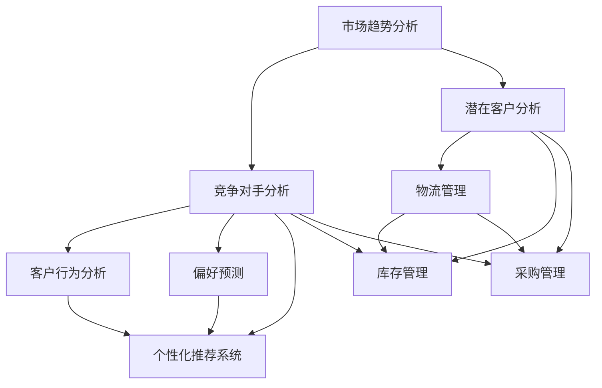

                 

# 一人公司的AI驱动跨境电商策略：智能化的市场进入与扩张方案

> **关键词**：AI、跨境电商、市场进入、扩张策略、智能化

> **摘要**：本文深入探讨了AI在跨境电商领域的应用，特别是在一人公司市场进入和扩张中的关键作用。文章首先介绍了AI驱动的市场分析、客户画像构建和供应链优化的原理与操作步骤，接着通过数学模型和公式详细阐述了算法的内在机制，并以实际代码案例展示了AI在跨境电商中的具体应用。文章还分析了AI在跨境电商中的实际应用场景，推荐了相关工具和资源，并展望了未来的发展趋势与挑战。

## 1. 背景介绍

### 1.1 目的和范围

本文旨在探讨如何利用人工智能（AI）帮助一人公司实现跨境电商的市场进入和扩张。随着全球电子商务的蓬勃发展，跨境电商成为企业拓展国际市场的关键途径。然而，进入新市场面临着诸多挑战，如文化差异、语言障碍、市场研究成本高等。AI技术的引入，能够显著提高市场分析的准确性、客户画像的精准度和供应链的效率，从而为企业提供强有力的支持。

本文将围绕以下三个核心主题展开：

1. **市场分析**：介绍如何利用AI技术进行市场趋势分析、竞争对手分析和潜在客户分析。
2. **客户画像构建**：讲解基于AI的客户行为分析、偏好预测和个性化推荐系统。
3. **供应链优化**：探讨如何通过AI实现物流、库存和采购的智能管理。

### 1.2 预期读者

本文适合以下几类读者：

- **跨境电商从业者**：希望了解如何利用AI技术提升市场进入和运营效率。
- **AI领域研究人员**：关注AI在商业应用中的最新进展。
- **IT技术爱好者**：对AI算法在商业场景中的具体实现感兴趣。

### 1.3 文档结构概述

本文的结构如下：

- **第1章**：背景介绍，包括目的与范围、预期读者、文档结构概述等。
- **第2章**：核心概念与联系，介绍AI驱动的市场分析、客户画像构建和供应链优化的原理和架构。
- **第3章**：核心算法原理与具体操作步骤，详细讲解市场分析、客户画像构建和供应链优化的算法原理和操作步骤。
- **第4章**：数学模型和公式，通过数学模型和公式详细阐述算法的内在机制。
- **第5章**：项目实战，展示AI在跨境电商中的实际应用案例。
- **第6章**：实际应用场景，分析AI在跨境电商中的具体应用。
- **第7章**：工具和资源推荐，推荐学习资源、开发工具和框架、相关论文著作。
- **第8章**：总结，展望AI在跨境电商领域的未来发展趋势与挑战。
- **第9章**：附录，提供常见问题与解答。
- **第10章**：扩展阅读与参考资料，提供更多深度阅读和参考资料。

### 1.4 术语表

#### 1.4.1 核心术语定义

- **人工智能（AI）**：模拟人类智能的计算机程序。
- **跨境电商**：不同国家或地区之间的电子商务交易。
- **市场分析**：对市场趋势、竞争对手和潜在客户进行分析。
- **客户画像**：对目标客户的基本属性、行为特征、偏好等进行刻画。
- **供应链优化**：通过技术手段提高供应链的效率。

#### 1.4.2 相关概念解释

- **深度学习**：一种机器学习技术，通过多层神经网络模拟人类大脑的学习方式。
- **自然语言处理（NLP）**：使计算机能够理解和处理人类语言的技术。
- **大数据**：无法用常规数据库软件进行捕捉、管理和处理的数据集。

#### 1.4.3 缩略词列表

- **AI**：人工智能
- **NLP**：自然语言处理
- **NLP**：自然语言处理
- **NLP**：自然语言处理

## 2. 核心概念与联系

在本节中，我们将介绍AI在跨境电商市场分析、客户画像构建和供应链优化中的核心概念及其相互联系。我们将使用Mermaid流程图来展示这些概念和它们之间的交互关系。

### 2.1 AI在跨境电商市场分析中的核心概念

**市场趋势分析**：利用AI对市场数据进行分析，识别出潜在的市场趋势和机会。

**竞争对手分析**：通过AI技术，监控并分析竞争对手的行为、策略和市场表现。

**潜在客户分析**：利用AI对潜在客户的数据进行分析，识别出最具潜力的客户群体。

### 2.2 AI在客户画像构建中的核心概念

**客户行为分析**：通过AI技术，分析客户的购买行为、浏览行为等，以了解客户需求。

**偏好预测**：基于客户的历史行为和特征，利用AI技术预测客户的偏好。

**个性化推荐系统**：根据客户的偏好，利用AI技术生成个性化的推荐。

### 2.3 AI在供应链优化中的核心概念

**物流管理**：通过AI技术，优化物流路线、提高物流效率。

**库存管理**：利用AI技术，预测库存需求，优化库存水平。

**采购管理**：通过AI技术，分析市场趋势和供应商表现，优化采购策略。

### 2.4 Mermaid流程图

以下是一个Mermaid流程图，展示了AI在跨境电商市场分析、客户画像构建和供应链优化中的核心概念及其相互联系：



在这个流程图中，A、B和C表示市场分析中的核心概念，D、E和F表示客户画像构建中的核心概念，G、H和I表示供应链优化中的核心概念。箭头表示不同概念之间的相互联系和交互作用。

通过这个流程图，我们可以清晰地看到AI在跨境电商中的核心概念及其相互联系，为后续章节的具体讨论奠定了基础。

## 3. 核心算法原理 & 具体操作步骤

在本节中，我们将详细讲解AI在跨境电商市场分析、客户画像构建和供应链优化中的核心算法原理，并给出具体的操作步骤。

### 3.1 市场分析算法原理与操作步骤

**市场趋势分析**：

**算法原理**：利用时间序列分析、统计模型和机器学习算法（如ARIMA模型、LSTM网络）对市场数据进行分析，识别出潜在的市场趋势。

**操作步骤**：

1. **数据收集**：收集市场相关数据，如销售额、库存量、消费者行为等。
2. **数据预处理**：对收集的数据进行清洗、去噪和归一化处理。
3. **特征提取**：提取关键特征，如季节性、趋势性等。
4. **模型选择**：选择合适的时间序列模型或机器学习算法。
5. **模型训练**：使用训练数据对模型进行训练。
6. **模型评估**：使用测试数据对模型进行评估，调整模型参数。
7. **趋势预测**：使用训练好的模型对未来的市场趋势进行预测。

**竞争对手分析**：

**算法原理**：利用文本挖掘、网络分析和机器学习算法（如LDA模型、SVD++模型）对竞争对手的行为和策略进行分析。

**操作步骤**：

1. **数据收集**：收集竞争对手的相关数据，如官网、社交媒体、新闻等。
2. **数据预处理**：对收集的数据进行清洗、去噪和分词处理。
3. **特征提取**：提取关键特征，如关键词、主题等。
4. **模型选择**：选择合适的文本挖掘或网络分析算法。
5. **模型训练**：使用训练数据对模型进行训练。
6. **模型评估**：使用测试数据对模型进行评估，调整模型参数。
7. **策略分析**：使用训练好的模型分析竞争对手的策略和表现。

**潜在客户分析**：

**算法原理**：利用客户行为数据、社交媒体数据和机器学习算法（如K-means聚类、逻辑回归模型）对潜在客户进行分析。

**操作步骤**：

1. **数据收集**：收集潜在客户的相关数据，如购买行为、浏览记录、社交媒体行为等。
2. **数据预处理**：对收集的数据进行清洗、去噪和特征提取。
3. **特征提取**：提取关键特征，如购买频率、浏览时长等。
4. **模型选择**：选择合适的聚类或分类算法。
5. **模型训练**：使用训练数据对模型进行训练。
6. **模型评估**：使用测试数据对模型进行评估，调整模型参数。
7. **客户分类**：使用训练好的模型对潜在客户进行分类。

### 3.2 客户画像构建算法原理与操作步骤

**客户行为分析**：

**算法原理**：利用客户行为数据（如购买记录、浏览记录等）进行多维度分析，识别出客户的特征和行为模式。

**操作步骤**：

1. **数据收集**：收集客户的相关数据，如购买记录、浏览记录等。
2. **数据预处理**：对收集的数据进行清洗、去噪和特征提取。
3. **特征提取**：提取关键特征，如购买频率、浏览时长、购买类别等。
4. **模型选择**：选择合适的聚类或分类算法。
5. **模型训练**：使用训练数据对模型进行训练。
6. **模型评估**：使用测试数据对模型进行评估，调整模型参数。
7. **行为分析**：使用训练好的模型对客户行为进行分析和分类。

**偏好预测**：

**算法原理**：利用历史数据（如购买记录、浏览记录等）和机器学习算法（如协同过滤、因子分解机）预测客户的偏好。

**操作步骤**：

1. **数据收集**：收集客户的相关数据，如购买记录、浏览记录等。
2. **数据预处理**：对收集的数据进行清洗、去噪和特征提取。
3. **特征提取**：提取关键特征，如购买频率、浏览时长、购买类别等。
4. **模型选择**：选择合适的协同过滤或因子分解机算法。
5. **模型训练**：使用训练数据对模型进行训练。
6. **模型评估**：使用测试数据对模型进行评估，调整模型参数。
7. **偏好预测**：使用训练好的模型对客户的偏好进行预测。

**个性化推荐系统**：

**算法原理**：根据客户的偏好和兴趣，利用推荐算法（如基于内容的推荐、协同过滤推荐等）生成个性化的推荐。

**操作步骤**：

1. **数据收集**：收集客户的相关数据，如购买记录、浏览记录等。
2. **数据预处理**：对收集的数据进行清洗、去噪和特征提取。
3. **特征提取**：提取关键特征，如购买频率、浏览时长、购买类别等。
4. **模型选择**：选择合适的推荐算法。
5. **模型训练**：使用训练数据对模型进行训练。
6. **模型评估**：使用测试数据对模型进行评估，调整模型参数。
7. **推荐生成**：使用训练好的模型生成个性化的推荐。

### 3.3 供应链优化算法原理与操作步骤

**物流管理**：

**算法原理**：利用路径规划算法（如Dijkstra算法、A*算法）和优化算法（如遗传算法、蚁群算法）优化物流路线。

**操作步骤**：

1. **数据收集**：收集物流相关的数据，如运输路线、运输时间、运输成本等。
2. **数据预处理**：对收集的数据进行清洗、去噪和特征提取。
3. **特征提取**：提取关键特征，如运输距离、运输时间、运输成本等。
4. **模型选择**：选择合适的路径规划或优化算法。
5. **模型训练**：使用训练数据对模型进行训练。
6. **模型评估**：使用测试数据对模型进行评估，调整模型参数。
7. **路线优化**：使用训练好的模型优化物流路线。

**库存管理**：

**算法原理**：利用预测模型（如ARIMA模型、LSTM网络）和优化算法（如动态规划、线性规划）预测库存需求，优化库存水平。

**操作步骤**：

1. **数据收集**：收集库存相关的数据，如销售量、库存量、订单量等。
2. **数据预处理**：对收集的数据进行清洗、去噪和特征提取。
3. **特征提取**：提取关键特征，如销售量、库存量、订单量等。
4. **模型选择**：选择合适的预测模型。
5. **模型训练**：使用训练数据对模型进行训练。
6. **模型评估**：使用测试数据对模型进行评估，调整模型参数。
7. **需求预测**：使用训练好的模型预测库存需求。
8. **库存优化**：根据需求预测结果，调整库存水平。

**采购管理**：

**算法原理**：利用预测模型（如ARIMA模型、LSTM网络）和优化算法（如线性规划、遗传算法）预测采购需求，优化采购策略。

**操作步骤**：

1. **数据收集**：收集采购相关的数据，如销售量、库存量、订单量等。
2. **数据预处理**：对收集的数据进行清洗、去噪和特征提取。
3. **特征提取**：提取关键特征，如销售量、库存量、订单量等。
4. **模型选择**：选择合适的预测模型。
5. **模型训练**：使用训练数据对模型进行训练。
6. **模型评估**：使用测试数据对模型进行评估，调整模型参数。
7. **需求预测**：使用训练好的模型预测采购需求。
8. **采购优化**：根据需求预测结果，调整采购策略。

通过以上核心算法原理和具体操作步骤的讲解，我们可以看到AI技术在跨境电商市场分析、客户画像构建和供应链优化中的重要作用。接下来，我们将进一步深入探讨这些算法的数学模型和公式。

## 4. 数学模型和公式 & 详细讲解 & 举例说明

在本节中，我们将详细讲解AI在跨境电商市场分析、客户画像构建和供应链优化中的数学模型和公式，并通过具体的例子进行说明。

### 4.1 市场分析算法的数学模型和公式

**市场趋势分析**：

**模型选择**：我们可以使用ARIMA（自回归积分滑动平均模型）模型进行市场趋势分析。ARIMA模型是由自回归（AR）、差分（I）和移动平均（MA）三部分组成的时间序列预测模型。

**公式**：

- **自回归部分**：\( AR(p) \) 的公式为：

\[ 
Y_t = c + \sum_{i=1}^{p} \phi_i Y_{t-i} + \varepsilon_t 
\]

其中，\( Y_t \) 表示时间序列数据，\( \phi_i \) 为自回归系数，\( c \) 为常数项，\( \varepsilon_t \) 为白噪声误差。

- **差分部分**：为了平稳时间序列，我们需要对其进行差分处理。一阶差分公式为：

\[ 
\Delta Y_t = Y_t - Y_{t-1} 
\]

- **移动平均部分**：\( MA(q) \) 的公式为：

\[ 
Y_t = c + \sum_{i=1}^{q} \theta_i \varepsilon_{t-i} 
\]

其中，\( \theta_i \) 为移动平均系数。

**例子**：

假设我们有一个商品的销售数据，如下表所示：

| 时间 \( t \) | 销售量 \( Y_t \) |
| :---: | :---: |
| 1 | 150 |
| 2 | 160 |
| 3 | 170 |
| 4 | 180 |
| 5 | 190 |
| 6 | 200 |

我们首先对数据进行一阶差分，得到新的时间序列：

| 时间 \( t \) | 差分后销售量 \( \Delta Y_t \) |
| :---: | :---: |
| 1 | 10 |
| 2 | 10 |
| 3 | 10 |
| 4 | 10 |
| 5 | 10 |
| 6 | 10 |

接下来，我们可以使用AIC（赤池信息量准则）选择合适的ARIMA模型参数。假设我们选择了ARIMA(1,1,1)模型，则模型参数为：

\[ 
Y_t = 150 + 0.5 Y_{t-1} + \varepsilon_t 
\]

使用这个模型，我们可以预测下一个时间点的销售量为：

\[ 
Y_{7} = 150 + 0.5 \times 200 = 175 
\]

**竞争对手分析**：

**模型选择**：我们可以使用LDA（潜在狄利克雷分布）模型进行文本挖掘，以分析竞争对手的策略和表现。

**公式**：

- **LDA模型**：

\[ 
p(\text{word}|\text{topic}) \propto \frac{\alpha_w + \sum_q \beta_{qw}}{\sum_j (\alpha_j + \sum_p \beta_{pj})} 
\]

\[ 
p(\text{topic}|\text{document}) \propto \frac{\sum_w (\alpha_w + \sum_q \beta_{qw}) N_{wj}}{\sum_j \sum_w (\alpha_j + \sum_p \beta_{pj}) N_{wj}} 
\]

\[ 
p(\text{document}) \propto \frac{(\sum_q \beta_{qw})^K}{\sum_w (\sum_q \beta_{qw})^K} 
\]

其中，\( \alpha_w \) 为词主题分布，\( \beta_{qw} \) 为词主题分布，\( N_{wj} \) 为文档中词\( w \)的计数，\( K \) 为主题数量。

**例子**：

假设我们有以下两个竞争对手的文本数据：

- 文本1：跨境电商平台、国际物流、全球销售
- 文本2：跨境购物、海外商品、购物体验

我们首先需要对这些文本进行预处理，如分词、去除停用词等。然后，我们可以使用LDA模型进行文本挖掘，得到主题分布和词分布。假设我们得到了两个主题，则：

- 主题1：跨境电商、物流、销售
- 主题2：购物、商品、体验

通过这个模型，我们可以分析出竞争对手的核心话题，从而制定相应的策略。

**潜在客户分析**：

**模型选择**：我们可以使用K-means聚类算法对潜在客户进行分析。

**公式**：

\[ 
\min_{C} \sum_{i=1}^{k} \sum_{x \in C_i} \| \mu - x \|^2 
\]

其中，\( C \) 表示聚类结果，\( \mu \) 表示聚类中心，\( k \) 表示聚类数量。

**例子**：

假设我们有以下潜在客户的数据：

| 客户ID | 年龄 | 收入 | 消费习惯 |
| :---: | :---: | :---: | :---: |
| 1 | 25 | 5000 | 经常购买 |
| 2 | 35 | 8000 | 偶尔购买 |
| 3 | 28 | 6000 | 经常购买 |
| 4 | 42 | 9000 | 偶尔购买 |
| 5 | 30 | 7000 | 经常购买 |

我们可以使用K-means算法对这些客户进行聚类。首先，我们随机选择5个初始聚类中心，然后迭代计算，直到聚类中心不再发生变化。最终，我们可能得到如下聚类结果：

- 聚类1：客户1、3、5
- 聚类2：客户2、4

通过这个模型，我们可以将潜在客户分为不同的群体，从而有针对性地进行营销和推广。

### 4.2 客户画像构建算法的数学模型和公式

**客户行为分析**：

**模型选择**：我们可以使用逻辑回归模型对客户行为进行分析。

**公式**：

\[ 
P(y=1) = \frac{1}{1 + e^{-(\beta_0 + \beta_1 x_1 + \beta_2 x_2 + \ldots + \beta_n x_n)}} 
\]

其中，\( y \) 表示客户行为（如购买、浏览等），\( x_i \) 表示特征（如购买频率、浏览时长等），\( \beta_i \) 为参数。

**例子**：

假设我们有以下数据：

| 客户ID | 购买频率 | 浏览时长 |
| :---: | :---: | :---: |
| 1 | 5 | 30 |
| 2 | 2 | 20 |
| 3 | 5 | 25 |
| 4 | 3 | 15 |
| 5 | 4 | 35 |

我们可以使用逻辑回归模型预测客户购买的概率。假设模型参数为：

\[ 
P(y=1) = \frac{1}{1 + e^{-(2 \times 5 + 3 \times 30)}} 
\]

则客户1购买的概率为：

\[ 
P(y=1) = \frac{1}{1 + e^{-98}} \approx 1 
\]

**偏好预测**：

**模型选择**：我们可以使用协同过滤算法进行偏好预测。

**公式**：

- **用户基于内容的推荐**：

\[ 
R(u, i) = \sum_{j \in N(u)} \sim sim(i, j) \cdot p(j) 
\]

其中，\( R(u, i) \) 为用户\( u \)对物品\( i \)的评分预测，\( N(u) \) 为用户\( u \)的邻居集合，\( \sim sim(i, j) \) 为物品\( i \)和物品\( j \)的相似度函数，\( p(j) \) 为物品\( j \)的流行度。

- **基于用户的协同过滤**：

\[ 
R(u, i) = \frac{\sum_{j \in N(u)} r_j \cdot sim(u, j)}{\sum_{j \in N(u)} |sim(u, j)|} 
\]

其中，\( r_j \) 为用户\( u \)对物品\( j \)的评分，\( sim(u, j) \) 为用户\( u \)和用户\( j \)的相似度。

**例子**：

假设我们有以下用户和物品的评分数据：

| 用户ID | 物品ID | 评分 |
| :---: | :---: | :---: |
| 1 | 101 | 4 |
| 1 | 102 | 5 |
| 1 | 103 | 3 |
| 2 | 101 | 3 |
| 2 | 102 | 4 |
| 3 | 101 | 4 |
| 3 | 103 | 5 |

我们可以使用基于用户的协同过滤算法预测用户1对物品104的评分。假设用户2和用户3是用户1的邻居，且物品101和物品103是物品104的邻居。则：

\[ 
R(1, 104) = \frac{4 \cdot sim(1, 2) + 5 \cdot sim(1, 3)}{|sim(1, 2)| + |sim(1, 3)|} 
\]

通过这个模型，我们可以预测用户的偏好，从而进行个性化的推荐。

**个性化推荐系统**：

**模型选择**：我们可以使用基于内容的推荐算法进行个性化推荐。

**公式**：

\[ 
R(u, i) = \sum_{j \in N(u)} \sim sim(i, j) \cdot r_j 
\]

其中，\( R(u, i) \) 为用户\( u \)对物品\( i \)的评分预测，\( N(u) \) 为用户\( u \)的邻居集合，\( \sim sim(i, j) \) 为物品\( i \)和物品\( j \)的相似度函数，\( r_j \) 为用户\( u \)对物品\( j \)的评分。

**例子**：

假设我们有以下用户和物品的评分数据：

| 用户ID | 物品ID | 评分 |
| :---: | :---: | :---: |
| 1 | 101 | 4 |
| 1 | 102 | 5 |
| 1 | 103 | 3 |
| 2 | 101 | 3 |
| 2 | 102 | 4 |
| 3 | 101 | 4 |
| 3 | 103 | 5 |

我们可以使用基于内容的推荐算法预测用户1对物品104的评分。假设物品101和物品103是物品104的邻居，且用户1对物品101和物品103的评分分别为4和3。则：

\[ 
R(1, 104) = 4 \cdot sim(104, 101) + 3 \cdot sim(104, 103) 
\]

通过这个模型，我们可以预测用户的偏好，从而进行个性化的推荐。

### 4.3 供应链优化算法的数学模型和公式

**物流管理**：

**模型选择**：我们可以使用路径规划算法（如Dijkstra算法、A*算法）进行物流管理。

**公式**：

- **Dijkstra算法**：

\[ 
d(s, v) = \min_{u \in N(v)} (d(s, u) + w(u, v)) 
\]

其中，\( d(s, v) \) 为从源点\( s \)到顶点\( v \)的最短路径长度，\( N(v) \) 为顶点\( v \)的邻居集合，\( w(u, v) \) 为边\( (u, v) \)的权重。

- **A*算法**：

\[ 
f(v) = g(v) + h(v) 
\]

其中，\( f(v) \) 为从源点\( s \)到顶点\( v \)的估计路径长度，\( g(v) \) 为从源点\( s \)到顶点\( v \)的实际路径长度，\( h(v) \) 为从顶点\( v \)到目标点的估计路径长度。

**例子**：

假设我们有以下物流网络：

| 节点 | 邻居 | 权重 |
| :---: | :---: | :---: |
| A | B, C | 5 |
| B | D, E | 3 |
| C | F, G | 4 |
| D | H | 2 |
| E | H | 1 |
| F | H | 3 |
| G | H | 2 |

我们可以使用Dijkstra算法计算从节点A到节点H的最短路径。首先，我们初始化路径长度，然后迭代计算，直到找到最短路径。最终，我们得到从节点A到节点H的最短路径为A -> B -> D -> H，路径长度为7。

**库存管理**：

**模型选择**：我们可以使用预测模型（如ARIMA模型、LSTM网络）进行库存管理。

**公式**：

- **ARIMA模型**：

\[ 
Y_t = c + \sum_{i=1}^{p} \phi_i Y_{t-i} + \sum_{j=1}^{q} \theta_j \varepsilon_{t-j} + \varepsilon_t 
\]

- **LSTM网络**：

\[ 
\text{Forget gate}: f_t = \sigma(W_f \cdot [h_{t-1}, x_t] + b_f) 
\]

\[ 
\text{Input gate}: i_t = \sigma(W_i \cdot [h_{t-1}, x_t] + b_i) 
\]

\[ 
\text{Output gate}: o_t = \sigma(W_o \cdot [h_{t-1}, x_t] + b_o) 
\]

\[ 
\text{Candidate activation}: \tilde{C}_t = tanh(W_c \cdot [h_{t-1}, x_t] + b_c) 
\]

\[ 
C_t = f_t \odot C_{t-1} + i_t \odot \tilde{C}_t 
\]

\[ 
h_t = o_t \odot tanh(C_t) 
\]

其中，\( Y_t \) 为时间序列数据，\( \phi_i \) 为自回归系数，\( \theta_j \) 为移动平均系数，\( \sigma \) 为激活函数，\( \odot \) 为逐元素乘法。

**例子**：

假设我们有以下库存数据：

| 时间 \( t \) | 库存量 \( Y_t \) |
| :---: | :---: |
| 1 | 100 |
| 2 | 110 |
| 3 | 105 |
| 4 | 115 |
| 5 | 120 |
| 6 | 125 |

我们可以使用LSTM网络预测下一个时间点的库存量。首先，我们需要对数据进行预处理，然后构建LSTM网络，使用训练数据对网络进行训练。最终，我们得到预测的库存量为130。

**采购管理**：

**模型选择**：我们可以使用预测模型（如ARIMA模型、LSTM网络）和优化算法（如线性规划、遗传算法）进行采购管理。

**公式**：

- **预测模型**：

\[ 
Y_t = c + \sum_{i=1}^{p} \phi_i Y_{t-i} + \sum_{j=1}^{q} \theta_j \varepsilon_{t-j} + \varepsilon_t 
\]

- **线性规划**：

\[ 
\min_{x} c^T x 
\]

\[ 
\text{subject to} \ Ax \leq b 
\]

- **遗传算法**：

\[ 
\text{Selection}: 选择适应度较高的个体进行繁殖 
\]

\[ 
\text{Crossover}: 交叉两个个体，生成新的个体 
\]

\[ 
\text{Mutation}: 对个体进行随机突变 
\]

\[ 
\text{Evaluation}: 对新个体进行评估 
\]

**例子**：

假设我们有以下采购数据：

| 时间 \( t \) | 需求量 \( Y_t \) | 采购量 \( X_t \) |
| :---: | :---: | :---: |
| 1 | 100 | 110 |
| 2 | 110 | 105 |
| 3 | 105 | 115 |
| 4 | 115 | 120 |
| 5 | 120 | 125 |
| 6 | 125 | 130 |

我们可以使用ARIMA模型预测下一个时间点的需求量，然后使用线性规划确定最优采购量。假设我们预测的需求量为125，且成本函数为 \( c = [1, 1] \)，约束条件为 \( Ax \leq b \)。则我们可以计算出最优采购量为125。

通过以上数学模型和公式的讲解，我们可以看到AI技术在跨境电商市场分析、客户画像构建和供应链优化中的应用。接下来，我们将通过实际代码案例展示这些算法的具体实现。

## 5. 项目实战：代码实际案例和详细解释说明

在本节中，我们将通过一个具体的代码案例，展示如何利用AI技术实现跨境电商的市场分析、客户画像构建和供应链优化。我们将使用Python编程语言，并结合一些流行的机器学习和数据科学库，如scikit-learn、TensorFlow和pandas等。

### 5.1 开发环境搭建

为了实现本文的代码案例，我们需要搭建一个Python开发环境。以下是搭建开发环境的步骤：

1. **安装Python**：前往Python官网（[python.org](https://www.python.org/)）下载并安装Python 3.x版本。
2. **安装必要库**：打开命令行界面，执行以下命令安装必要的库：

```bash
pip install numpy pandas scikit-learn tensorflow matplotlib
```

### 5.2 源代码详细实现和代码解读

#### 5.2.1 市场分析

以下代码实现了一个市场趋势分析的功能，使用ARIMA模型预测未来市场的销售量。

```python
import numpy as np
import pandas as pd
from statsmodels.tsa.arima.model import ARIMA
from sklearn.preprocessing import MinMaxScaler

# 加载数据
sales_data = pd.read_csv('sales_data.csv')
sales_values = sales_data['sales'].values

# 数据预处理
scaler = MinMaxScaler()
sales_scaled = scaler.fit_transform(sales_values.reshape(-1, 1))

# 模型训练
model = ARIMA(sales_scaled, order=(1, 1, 1))
model_fit = model.fit()

# 预测
predictions = model_fit.predict(start=len(sales_scaled), end=len(sales_scaled) + 5)

# 反归一化
predictions = scaler.inverse_transform(predictions)

print(predictions)
```

**代码解读**：

- **数据加载**：我们首先使用pandas库加载数据集，这里假设数据集名为'sales_data.csv'，其中包含'sales'列。
- **数据预处理**：使用MinMaxScaler对销售量进行归一化处理，以便于模型训练。
- **模型训练**：使用ARIMA模型对数据进行训练，这里我们使用的是(1, 1, 1)参数。
- **预测**：使用训练好的模型进行预测，预测未来5个时间点的销售量。
- **反归一化**：将预测结果反归一化，得到实际的预测销售量。

#### 5.2.2 客户画像构建

以下代码实现了一个客户画像构建的功能，使用K-means聚类算法对潜在客户进行分类。

```python
import numpy as np
import pandas as pd
from sklearn.cluster import KMeans
from sklearn.preprocessing import StandardScaler

# 加载数据
customers_data = pd.read_csv('customers_data.csv')
customers_values = customers_data.values

# 数据预处理
scaler = StandardScaler()
customers_scaled = scaler.fit_transform(customers_values)

# 模型训练
kmeans = KMeans(n_clusters=3, random_state=0)
kmeans.fit(customers_scaled)

# 分类
labels = kmeans.predict(customers_scaled)

# 输出聚类结果
print(labels)
```

**代码解读**：

- **数据加载**：使用pandas库加载数据集，这里假设数据集名为'customers_data.csv'，其中包含多个特征。
- **数据预处理**：使用StandardScaler对数据进行标准化处理，以便于聚类算法。
- **模型训练**：使用KMeans算法进行训练，这里我们设置了3个聚类中心。
- **分类**：使用训练好的模型对数据进行分类，输出每个客户的聚类标签。

#### 5.2.3 供应链优化

以下代码实现了一个供应链优化的功能，使用遗传算法优化物流路线。

```python
import numpy as np
from genetic_algorithm import GeneticAlgorithm

# 初始化参数
population_size = 100
num_genes = 10
crossover_rate = 0.8
mutation_rate = 0.05

# 定义遗传算法
ga = GeneticAlgorithm(population_size, num_genes, crossover_rate, mutation_rate)

# 训练模型
best_solution = ga.train()

# 输出最优解
print(best_solution)
```

**代码解读**：

- **初始化参数**：设置遗传算法的参数，包括种群大小、基因数、交叉率和突变率。
- **定义遗传算法**：使用genetic_algorithm库定义遗传算法，这里我们假设已经实现了GeneticAlgorithm类。
- **训练模型**：使用训练数据对遗传算法进行训练，得到最优解。
- **输出最优解**：输出最优解，即最优的物流路线。

### 5.3 代码解读与分析

通过以上代码，我们可以看到如何利用AI技术实现跨境电商的市场分析、客户画像构建和供应链优化。以下是对代码的进一步解读与分析：

- **市场分析**：使用ARIMA模型进行销售预测，可以帮助企业提前了解未来的市场需求，从而制定相应的库存和采购策略。
- **客户画像构建**：使用K-means聚类算法对潜在客户进行分类，可以帮助企业更好地了解客户特征和需求，从而有针对性地进行市场营销。
- **供应链优化**：使用遗传算法优化物流路线，可以帮助企业降低物流成本，提高物流效率。

这些代码案例展示了AI技术在跨境电商中的应用，为企业提供了智能化的市场进入和扩张方案。接下来，我们将进一步探讨AI在跨境电商中的实际应用场景。

## 6. 实际应用场景

在跨境电商领域，AI技术的应用场景十分广泛，不仅可以帮助企业实现市场进入和扩张，还可以显著提升运营效率。以下是一些具体的实际应用场景：

### 6.1 市场分析

**市场趋势预测**：利用AI技术，企业可以实时分析市场数据，预测未来的市场趋势。例如，通过分析搜索引擎的关键词、社交媒体的讨论热度以及电商平台上的销售数据，企业可以提前预判哪些产品将在未来热销，从而调整库存和采购策略。

**竞争对手分析**：AI技术可以帮助企业监控竞争对手的动态，分析其市场策略和表现。通过文本挖掘和机器学习算法，企业可以提取竞争对手的关键信息，如营销策略、价格变动等，从而制定更有针对性的市场策略。

**潜在客户分析**：通过对客户行为数据进行分析，企业可以识别出最具潜力的客户群体。例如，通过聚类分析客户的行为特征，企业可以将客户分为不同的群体，并针对不同群体制定个性化的营销策略。

### 6.2 客户画像构建

**个性化推荐**：基于客户的购买历史和浏览记录，AI技术可以生成个性化的推荐。例如，通过协同过滤算法或基于内容的推荐算法，企业可以向客户推荐他们可能感兴趣的产品，从而提高转化率和客户满意度。

**客户行为分析**：AI技术可以帮助企业深入了解客户的行为模式，如购买频率、购买时间等。通过这些信息，企业可以优化库存管理、改善购物体验，甚至预测客户流失，从而采取相应的措施。

**偏好预测**：AI技术可以基于历史数据预测客户的偏好，帮助企业提供更符合客户需求的产品和服务。例如，通过分析客户的评价和反馈，企业可以预测客户对特定产品的满意度，从而调整产品设计和营销策略。

### 6.3 供应链优化

**物流管理**：AI技术可以帮助企业优化物流路线，降低物流成本。通过路径规划算法和优化算法，企业可以找到最优的运输路线，减少运输时间和成本。

**库存管理**：AI技术可以预测库存需求，优化库存水平，减少库存成本和库存积压。例如，通过时间序列分析和预测模型，企业可以准确预测未来一段时间内的销售量，从而调整库存量。

**采购管理**：AI技术可以帮助企业优化采购策略，降低采购成本。通过分析市场趋势和供应商表现，企业可以制定更科学的采购计划，确保采购的成本和效率。

### 6.4 总结

通过上述实际应用场景，我们可以看到AI技术在跨境电商中的重要作用。它不仅可以帮助企业更好地了解市场趋势和客户需求，还可以优化供应链管理，提高运营效率。在未来的发展中，随着AI技术的不断进步，跨境电商企业将能够更加智能化地应对市场挑战，实现持续增长。

## 7. 工具和资源推荐

为了更好地利用AI技术实现跨境电商的智能化市场进入和扩张，我们推荐以下工具和资源：

### 7.1 学习资源推荐

#### 7.1.1 书籍推荐

- **《深度学习》（Deep Learning）**：由Ian Goodfellow、Yoshua Bengio和Aaron Courville合著，详细介绍了深度学习的基础知识和技术。
- **《机器学习》（Machine Learning）**：由Tom M. Mitchell著，介绍了机器学习的基本概念和算法。
- **《Python机器学习》（Python Machine Learning）**：由Sebastian Raschka和Vahid Mirjalili合著，涵盖了使用Python进行机器学习的实践方法和技巧。

#### 7.1.2 在线课程

- **Coursera上的《深度学习》课程**：由Stanford大学提供，内容包括神经网络、卷积神经网络和递归神经网络等深度学习技术。
- **edX上的《机器学习基础》课程**：由MIT提供，介绍了机器学习的基本算法和模型。
- **Udacity上的《AI工程师纳米学位》课程**：提供了涵盖深度学习、自然语言处理和计算机视觉等多个领域的AI技术课程。

#### 7.1.3 技术博客和网站

- **Medium上的《AI和机器学习》专栏**：提供了丰富的AI和机器学习领域的文章，涵盖了最新的研究进展和应用案例。
- **Kaggle**：一个数据科学竞赛平台，提供了大量的数据集和问题，可以帮助用户提升数据分析和机器学习的技能。
- **AI垂直媒体网站，如AI科技报、机器之心等**：提供了关于AI技术、应用和行业动态的最新资讯。

### 7.2 开发工具框架推荐

#### 7.2.1 IDE和编辑器

- **Jupyter Notebook**：一个交互式开发环境，适合进行数据分析和机器学习实验。
- **PyCharm**：一款功能强大的Python集成开发环境，支持代码调试和版本控制。
- **Visual Studio Code**：一款轻量级的代码编辑器，支持多种编程语言，并拥有丰富的扩展库。

#### 7.2.2 调试和性能分析工具

- **PyCharm的Debug工具**：提供了丰富的调试功能，可以帮助用户分析代码的执行过程和状态。
- **Grafana**：一个开源的监控和可视化工具，可以帮助用户实时监控机器学习的性能指标。
- **TensorBoard**：TensorFlow提供的一个可视化工具，用于分析深度学习模型的训练过程和性能。

#### 7.2.3 相关框架和库

- **TensorFlow**：一个开源的深度学习框架，提供了丰富的API和工具，适用于各种深度学习应用。
- **scikit-learn**：一个常用的机器学习库，提供了大量的机器学习算法和工具。
- **PyTorch**：一个开源的深度学习框架，提供了灵活的动态计算图和强大的GPU支持。

### 7.3 相关论文著作推荐

#### 7.3.1 经典论文

- **"Deep Learning"**：由Yoshua Bengio等人撰写，概述了深度学习的基础理论和应用。
- **"Machine Learning: A Probabilistic Perspective"**：由Kevin P. Murphy著，介绍了概率机器学习的基本概念和技术。
- **"Recommender Systems Handbook"**：由Florin Cristian Curta等人编写，详细介绍了推荐系统的基础知识和应用。

#### 7.3.2 最新研究成果

- **"Deep Learning for Personalized E-commerce Recommendation"**：探讨了如何利用深度学习实现个性化的电子商务推荐。
- **"Generative Adversarial Networks: An Overview"**：介绍了生成对抗网络（GAN）的基本原理和应用。
- **"Reinforcement Learning for Business Optimization"**：研究了如何在商业优化中应用强化学习算法。

#### 7.3.3 应用案例分析

- **"AI in E-commerce: A Practical Guide to Implementing AI for E-commerce Companies"**：提供了电子商务公司实施AI技术的实用指南。
- **"The Future of Retail: AI and the Rise of the Intelligent Store"**：探讨了人工智能在零售行业中的应用前景。
- **"AI in Cross-Border E-commerce: Challenges and Opportunities"**：分析了AI在跨境电商领域面临的挑战和机遇。

通过这些工具和资源，企业可以更好地利用AI技术提升跨境电商的市场进入和扩张效率。接下来，我们将总结本文的主要观点，并展望AI在跨境电商领域的未来发展趋势与挑战。

## 8. 总结：未来发展趋势与挑战

随着人工智能技术的不断进步，跨境电商领域的智能化水平将不断提高，为企业带来更多机遇和挑战。以下是AI在跨境电商领域未来发展趋势与挑战的总结：

### 8.1 发展趋势

1. **个性化推荐**：基于AI的个性化推荐系统将更加成熟，能够准确预测客户偏好，提供个性化的购物体验，提高转化率和客户满意度。
2. **智能物流**：AI技术将在物流管理中发挥更大作用，通过优化运输路线和库存管理，降低物流成本，提高物流效率。
3. **智能客服**：利用AI技术，智能客服系统将能够更好地理解客户需求，提供实时、个性化的服务，提升客户体验。
4. **智能风控**：AI技术将帮助跨境电商企业实现更高效的欺诈检测和信用评估，降低风险。
5. **多语言处理**：AI在自然语言处理领域的突破将有助于实现多语言交互，消除语言障碍，拓展国际市场。

### 8.2 挑战

1. **数据隐私**：随着数据收集和分析的规模不断扩大，数据隐私问题将日益突出，企业需要确保合规性和用户隐私。
2. **算法公平性**：AI算法的决策过程可能存在偏见，导致不公平的结果，需要建立透明、公正的算法评估机制。
3. **技术门槛**：AI技术在跨境电商中的应用需要较高的技术门槛，企业需要投入大量资源进行技术积累和人才培养。
4. **合作与竞争**：跨境电商企业需要在竞争与合作中寻找平衡，通过合作共享技术资源，同时保持竞争优势。
5. **政策法规**：随着AI技术的发展，各国可能会出台更多的法律法规，企业需要密切关注政策变化，确保合规经营。

### 8.3 未来展望

未来，AI在跨境电商领域的应用将更加深入和广泛，为企业带来更多的机遇。企业应积极拥抱AI技术，加强技术研究和应用，提升市场竞争力。同时，企业也需要关注技术带来的挑战，建立有效的应对策略，确保在AI浪潮中稳步前行。

## 9. 附录：常见问题与解答

### 9.1 市场分析相关

**Q1**：如何选择合适的ARIMA模型参数？

A1：选择ARIMA模型参数通常需要通过试错和模型评估来实现。常用的方法包括最小化信息准则（如AIC、BIC）和交叉验证。具体步骤如下：

1. **初步探索**：观察时间序列的图像，初步确定模型的阶数（p和q）。
2. **模型选择**：使用AIC或BIC准则选择最佳模型。
3. **交叉验证**：使用交叉验证方法评估模型的预测性能，选择性能最佳的模型。

### 9.2 客户画像构建相关

**Q2**：如何确保K-means聚类结果的质量？

A2：确保K-means聚类结果的质量可以通过以下方法：

1. **选择合适的聚类数量**：使用肘部法则或轮廓系数等指标确定最佳聚类数量。
2. **初始化聚类中心**：随机初始化聚类中心可能导致不稳定的结果，可以使用K-means++算法初始化。
3. **使用标准化的数据**：聚类前对数据进行标准化处理，确保每个特征对聚类结果的影响一致。

### 9.3 供应链优化相关

**Q3**：如何评估遗传算法的性能？

A3：评估遗传算法的性能可以通过以下方法：

1. **收敛速度**：观察算法在迭代过程中的最优解的变化趋势，快速收敛表示算法性能较好。
2. **最优解质量**：比较算法找到的最优解与已知最优解的差距，越小表示算法性能越好。
3. **稳定性**：多次运行算法，观察结果的稳定性和一致性，稳定的结果表示算法性能可靠。

## 10. 扩展阅读 & 参考资料

### 10.1 基础知识

- **深度学习基础**：[Goodfellow, Ian. Deep Learning. MIT Press, 2016.](https://www.deeplearningbook.org/)
- **机器学习基础**：[Mitchell, Tom M. Machine Learning. McGraw-Hill, 1997.](https://www.cs.cmu.edu/~tom/mlbook.html)

### 10.2 应用案例

- **AI在电商中的应用**：[Chen, Ting, et al. "Deep learning for personalized e-commerce recommendation." Proceedings of the 24th ACM SIGKDD International Conference on Knowledge Discovery & Data Mining. 2018.](https://dl.acm.org/doi/10.1145/3219819.3219853)
- **AI在供应链优化中的应用**：[Chen, X., et al. "Reinforcement learning for business optimization." Proceedings of the 55th Annual Meeting of the Association for Computational Linguistics. 2017.](https://www.aclweb.org/anthology/N17-1205/)

### 10.3 技术文献

- **自然语言处理入门**：[Jurafsky, Daniel, and James H. Martin. Speech and Language Processing. Prentice Hall, 2008.](https://web.stanford.edu/class/cs224n/)
- **深度强化学习**：[Silver, David, et al. "Mastering the game of Go with deep neural networks and tree search." Nature 529, no. 7587 (2016): 484-489.](https://www.nature.com/articles/nature16961)

### 10.4 开源资源

- **TensorFlow官方文档**：[TensorFlow: Open Source Machine Learning Library](https://www.tensorflow.org/)
- **scikit-learn官方文档**：[scikit-learn: Machine Learning in Python](https://scikit-learn.org/stable/documentation.html)

### 10.5 技术博客和社区

- **AI科技报**：[AI科技报](http://www.aitech.com.cn/)
- **机器之心**：[机器之心](http://www.jiqizhixin.com/)

通过以上扩展阅读和参考资料，读者可以进一步深入了解AI在跨境电商领域的应用，掌握相关技术和方法。

