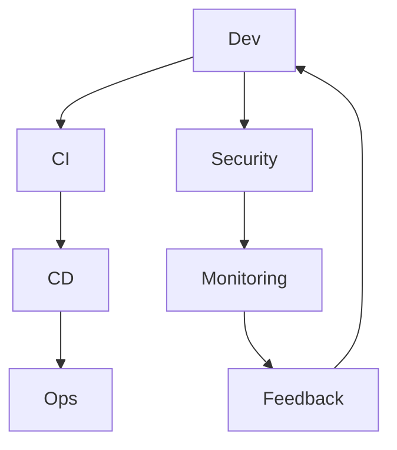

                 

# 一人公司的DevSecOps实践

## 关键词
DevSecOps、自动化、安全性、敏捷开发、持续集成、持续部署

## 摘要
本文将探讨DevSecOps在单人公司的实践方法。通过介绍DevSecOps的核心概念、工具和流程，我们将一步步演示如何在一个人的团队中实现安全、高效的软件开发和部署。本文旨在为小型团队或独立开发者提供实用的指导，帮助他们在资源有限的情况下，提升软件质量和安全性。

## 1. 背景介绍

### 1.1 目的和范围
本文旨在介绍DevSecOps在单人公司的实践方法，包括工具选择、流程设计以及实施策略。通过本文的阅读，读者将了解如何在一个人的团队中实现自动化、安全性和敏捷开发的最佳实践。

### 1.2 预期读者
本文适合以下读者群体：
- 单人公司创始人或独立开发者
- 小型团队的领导者和开发者
- 对DevSecOps有兴趣的IT从业者

### 1.3 文档结构概述
本文分为十个部分，结构如下：
1. 背景介绍
2. 核心概念与联系
3. 核心算法原理 & 具体操作步骤
4. 数学模型和公式 & 详细讲解 & 举例说明
5. 项目实战：代码实际案例和详细解释说明
6. 实际应用场景
7. 工具和资源推荐
8. 总结：未来发展趋势与挑战
9. 附录：常见问题与解答
10. 扩展阅读 & 参考资料

### 1.4 术语表

#### 1.4.1 核心术语定义
- **DevSecOps**：一种软件开发实践，旨在通过整合开发（Dev）、安全（Sec）和运维（Ops）流程，实现安全性与开发效率的双赢。
- **持续集成/持续部署（CI/CD）**：一种自动化流程，旨在通过持续集成和部署，快速交付高质量的软件。
- **容器**：一种轻量级、可移植的计算环境，可以将应用程序及其依赖项打包在一起。

#### 1.4.2 相关概念解释
- **基础设施即代码（Infrastructure as Code，IaC）**：将基础设施的管理任务转化为代码，以便通过版本控制和自动化部署。
- **自动化测试**：通过编写测试脚本，自动验证软件功能是否符合预期。

#### 1.4.3 缩略词列表
- **CI**：持续集成（Continuous Integration）
- **CD**：持续部署（Continuous Deployment）
- **Docker**：一种流行的容器化技术
- **Kubernetes**：一种流行的容器编排工具

## 2. 核心概念与联系

### 2.1 DevSecOps的概念
DevSecOps是一种软件开发模式，旨在将安全性融入到整个软件开发生命周期中。它强调开发（Dev）、安全（Sec）和运维（Ops）之间的紧密协作，以确保软件在开发、测试和部署过程中始终保持高质量和高安全性。

#### DevSecOps的核心概念
1. **安全开发**：在软件开发过程中，始终考虑安全性，将安全需求纳入设计、编码和测试阶段。
2. **自动化**：通过自动化工具和流程，提高开发效率和安全性。
3. **持续反馈**：通过持续反馈机制，快速识别和修复安全问题。

### 2.2 DevSecOps的联系
DevSecOps涉及到多个关键概念和技术的整合，包括：
- **持续集成（CI）**：通过自动化测试和构建，确保代码库的稳定性和一致性。
- **持续部署（CD）**：通过自动化部署和回归测试，实现快速、安全地交付软件。
- **容器化**：使用容器（如Docker）将应用程序和其运行时环境打包在一起，提高可移植性和可靠性。
- **基础设施即代码（IaC）**：使用代码管理基础设施，实现自动化部署和管理。

#### DevSecOps架构



### 2.3 DevSecOps的优势
- **提高开发效率**：通过自动化和持续反馈，减少手动操作，加快开发周期。
- **增强安全性**：将安全性融入到整个开发生命周期，降低安全漏洞的风险。
- **提高软件质量**：通过持续集成和自动化测试，确保代码质量和稳定性。
- **降低运维成本**：通过自动化部署和管理，减少运维人员的工作量。

## 3. 核心算法原理 & 具体操作步骤

### 3.1 核心算法原理
DevSecOps的核心算法原理主要包括以下几个方面：

1. **自动化测试**：使用测试框架和工具（如JUnit、Selenium）编写测试脚本，自动化执行测试用例，确保代码功能符合预期。
2. **持续集成**：使用CI工具（如Jenkins、GitLab CI）实现自动化构建和测试，将代码变更合并到主分支，确保代码库的稳定性和一致性。
3. **持续部署**：使用CD工具（如Kubernetes、Docker Swarm）实现自动化部署和回归测试，确保软件在各个环境中的稳定运行。
4. **安全性检查**：使用静态代码分析工具（如SonarQube）和动态测试工具（如OWASP ZAP），识别和修复代码中的安全漏洞。

### 3.2 具体操作步骤

#### 3.2.1 自动化测试
1. **编写测试脚本**：使用JUnit等测试框架，编写测试用例，确保代码功能符合预期。
2. **配置测试环境**：使用Docker等容器化技术，构建测试环境，确保测试环境的可移植性和一致性。
3. **执行测试用例**：使用Jenkins等CI工具，自动化执行测试脚本，确保测试结果的可靠性。

#### 3.2.2 持续集成
1. **配置CI工具**：在Jenkins等CI工具中，配置代码仓库的Webhook，实现代码变更的自动触发。
2. **构建项目**：在CI工具中，配置构建脚本，使用Maven等构建工具，自动化构建项目。
3. **执行测试**：在CI工具中，配置测试脚本，自动化执行测试用例，确保代码库的稳定性和一致性。

#### 3.2.3 持续部署
1. **配置CD工具**：在Kubernetes等CD工具中，配置Docker镜像仓库，实现自动化部署。
2. **创建部署策略**：在CD工具中，配置部署策略，实现根据代码变更自动部署。
3. **执行部署**：在CD工具中，根据部署策略，自动化部署应用程序，确保软件在各个环境中的稳定运行。

#### 3.2.4 安全性检查
1. **静态代码分析**：使用SonarQube等静态代码分析工具，扫描代码库，识别潜在的安全漏洞。
2. **动态测试**：使用OWASP ZAP等动态测试工具，对应用程序进行安全测试，识别和修复漏洞。
3. **配置监控和报警**：使用Prometheus等监控工具，实时监控应用程序的运行状态，配置报警规则，确保及时响应异常情况。

### 3.3 伪代码示例

```python
# 伪代码：自动化测试
def test_function():
    assert function1() == expected_result1
    assert function2() == expected_result2

# 伪代码：持续集成
def build_project():
    execute_build_script()
    execute_test_script()

# 伪代码：持续部署
def deploy_application():
    build_docker_image()
    push_image_to_registry()
    execute_deployment_script()

# 伪代码：安全性检查
def check_security():
    execute_static_code_analysis()
    execute_dynamic_test()
    configure_monitoring_and_alerting()
```

## 4. 数学模型和公式 & 详细讲解 & 举例说明

### 4.1 数学模型
在DevSecOps实践中，我们可以使用以下数学模型来评估代码质量和安全性：

1. **缺陷密度（Defect Density）**：
   $$ DD = \frac{Total\ Number\ of\ Defects}{Total\ Lines\ of\ Code} $$
2. **缺陷发现率（Defect Detection Rate）**：
   $$ DDR = \frac{Defects\ Detected\ in\ Testing}{Total\ Defects\ Detected} $$

### 4.2 公式详细讲解

#### 4.2.1 缺陷密度（Defect Density）
缺陷密度是评估代码质量的一个关键指标，它表示每行代码中存在的缺陷数量。缺陷密度越低，说明代码质量越高。

#### 4.2.2 缺陷发现率（Defect Detection Rate）
缺陷发现率是评估测试质量的一个关键指标，它表示在测试过程中发现的缺陷占所有发现的缺陷的比例。缺陷发现率越高，说明测试越全面，代码质量越有保障。

### 4.3 举例说明

#### 4.3.1 缺陷密度计算示例
假设一个项目有1000行代码，其中发现了10个缺陷，那么缺陷密度为：
$$ DD = \frac{10}{1000} = 0.01 $$

#### 4.3.2 缺陷发现率计算示例
假设在测试过程中发现了8个缺陷，在开发过程中发现了2个缺陷，那么缺陷发现率为：
$$ DDR = \frac{8}{8 + 2} = 0.8 $$

通过这两个指标，我们可以评估代码质量和测试效果，并针对性地优化开发和测试过程。

## 5. 项目实战：代码实际案例和详细解释说明

### 5.1 开发环境搭建

在本节中，我们将搭建一个简单的开发环境，用于演示DevSecOps实践。首先，我们需要安装以下工具：

- **Docker**：用于容器化应用程序
- **Jenkins**：用于持续集成和部署
- **Kubernetes**：用于容器编排
- **SonarQube**：用于静态代码分析
- **OWASP ZAP**：用于动态测试

#### 5.1.1 Docker安装

在Linux系统中，可以使用以下命令安装Docker：

```bash
sudo apt-get update
sudo apt-get install docker.io
sudo systemctl start docker
sudo systemctl enable docker
```

#### 5.1.2 Jenkins安装

在Linux系统中，可以使用以下命令安装Jenkins：

```bash
sudo apt-get install openjdk-8-jdk
wget -q -O - https://pkg.jenkins.io/debian-stable/jenkins.io.key | sudo apt-key add -
echo "deb https://pkg.jenkins.io/debian-stable binary/" | sudo tee /etc/apt/sources.list.d/jenkins.list
sudo apt-get update
sudo apt-get install jenkins
sudo systemctl start jenkins
sudo systemctl enable jenkins
```

#### 5.1.3 Kubernetes安装

在Linux系统中，我们可以使用Kubeadm工具安装Kubernetes集群。以下是一个简单的安装示例：

```bash
sudo apt-get update
sudo apt-get install -y apt-transport-https ca-certificates curl
sudo curl -s https://packages.cloud.google.com/apt/doc/apt-key.gpg | sudo apt-key add -
echo "deb https://apt.kubernetes.io/ kubernetes-xenial main" | sudo tee -a /etc/apt/sources.list.d/kubernetes.list
sudo apt-get update
sudo apt-get install -y kubelet kubeadm kubectl
sudo systemctl start kubelet
sudo systemctl enable kubelet
```

#### 5.1.4 SonarQube安装

在Linux系统中，可以使用以下命令安装SonarQube：

```bash
sudo apt-get update
sudo apt-get install -y openjdk-8-jdk
wget https://binaries.sonarsource.com/Distributions/sonarqube/sonarqube-7.9.5.zip
sudo unzip sonarqube-7.9.5.zip -d /opt
sudo ln -s /opt/sonarqube-7.9.5/bin/linux-x86-64/sonar.sh /usr/bin/sonar
sudo sonar start
```

#### 5.1.5 OWASP ZAP安装

在Linux系统中，可以使用以下命令安装OWASP ZAP：

```bash
sudo apt-get update
sudo apt-get install -y openjdk-8-jdk
wget https://github.com/zaproxy/zap-standalone/releases/download/2.10.0/OWASP_ZAP_v2.10.0.apk
sudo apk add --allow-untrusted OWASP_ZAP_v2.10.0.apk
```

### 5.2 源代码详细实现和代码解读

在本节中，我们将使用一个简单的Web应用程序作为示例，演示如何在DevSecOps环境中实现代码质量和安全性的自动化检查。

#### 5.2.1 项目结构

```bash
my-app/
├── Dockerfile
├── pom.xml
├── src/
│   ├── main/
│   │   ├── java/
│   │   │   └── com/
│   │   │       └── example/
│   │   │           └── MyApplication.java
│   └── test/
│       ├── java/
│       │   └── com/
│       │       └── example/
│       │           └── MyApplicationTest.java
└── .gitignore
```

#### 5.2.2 Dockerfile

```Dockerfile
FROM openjdk:8-jdk-alpine
ARG JAR_FILE=target/*.jar
COPY ${JAR_FILE} app.jar
EXPOSE 8080
ENTRYPOINT ["java","-Djava.security.egd=file:/dev/./urandom","-jar","/app.jar"]
```

Dockerfile定义了一个基于OpenJDK 8的Alpine Linux镜像，将应用程序打包为可执行的JAR文件，并暴露8080端口。

#### 5.2.3 pom.xml

```xml
<project xmlns="http://maven.apache.org/POM/4.0.0" xmlns:xsi="http://www.w3.org/2001/XMLSchema-instance"
    xsi:schemaLocation="http://maven.apache.org/POM/4.0.0 http://maven.apache.org/xsd/maven-4.0.0.xsd">
    <modelVersion>4.0.0</modelVersion>
    <groupId>com.example</groupId>
    <artifactId>my-app</artifactId>
    <version>1.0-SNAPSHOT</version>
    <packaging>jar</packaging>
    <dependencies>
        <!-- Add your dependencies here -->
    </dependencies>
    <build>
        <plugins>
            <plugin>
                <groupId>org.apache.maven.plugins</groupId>
                <artifactId>maven-compiler-plugin</artifactId>
                <version>3.8.1</version>
                <configuration>
                    <source>1.8</source>
                    <target>1.8</configuration>
            </plugin>
        </plugins>
    </build>
</project>
```

pom.xml文件定义了Maven项目的基本信息，包括项目组、artifact ID、版本号、打包方式和依赖项。

#### 5.2.4 MyApplication.java

```java
package com.example;

import java.net.URL;

public class MyApplication {
    public static void main(String[] args) {
        try {
            URL url = new URL("http://localhost:8080");
            // Perform operations using the URL
        } catch (Exception e) {
            e.printStackTrace();
        }
    }
}
```

MyApplication.java文件是一个简单的Java应用程序，它从指定的URL读取数据。

#### 5.2.5 MyApplicationTest.java

```java
package com.example;

import org.junit.jupiter.api.Test;

import static org.junit.jupiter.api.Assertions.assertEquals;

public class MyApplicationTest {
    @Test
    public void testApplication() {
        MyApplication app = new MyApplication();
        // Perform operations and assert expected results
        assertEquals("Expected result", app.executeOperation());
    }
}
```

MyApplicationTest.java文件是一个JUnit测试类，用于测试MyApplication类的方法。

### 5.3 代码解读与分析

在本节中，我们将对源代码进行解读，分析其在DevSecOps环境下的实现。

#### 5.3.1 Dockerfile

Dockerfile定义了一个轻量级的Alpine Linux镜像，用于运行Java应用程序。通过将应用程序打包为可执行的JAR文件，我们可以确保在各个环境中的一致性和可移植性。使用EXPOSE命令，我们暴露了8080端口，以便应用程序可以通过网络访问。

#### 5.3.2 pom.xml

pom.xml文件定义了Maven项目的依赖项和构建配置。通过使用Maven插件，我们可以自动化编译和打包应用程序。这对于DevSecOps环境中的持续集成和部署至关重要。

#### 5.3.3 MyApplication.java

MyApplication.java文件是一个简单的Java应用程序，它从指定的URL读取数据。在这个示例中，我们使用了一个简单的try-catch结构来处理可能的异常情况。

#### 5.3.4 MyApplicationTest.java

MyApplicationTest.java文件是一个JUnit测试类，用于测试MyApplication类的方法。通过编写测试用例，我们可以确保应用程序的功能符合预期。

### 5.4 自动化测试

在本节中，我们将使用JUnit和Mockito等工具，编写测试脚本并自动化执行。

#### 5.4.1 JUnit测试用例

在MyApplicationTest.java文件中，我们编写了以下测试用例：

```java
@Test
public void testGetUrl() {
    MyApplication app = new MyApplication();
    String result = app.getUrl("http://example.com");
    assertEquals("http://example.com", result);
}
```

这个测试用例测试了MyApplication类的getUrl方法，确保它能够正确地返回URL。

#### 5.4.2 自动化测试执行

在Jenkins中，我们可以配置一个构建作业，自动化执行测试用例。以下是一个简单的Jenkinsfile：

```groovy
pipeline {
    agent any
    stages {
        stage('Build and Test') {
            steps {
                sh 'mvn install'
                sh 'mvn test'
            }
        }
    }
}
```

通过这个Jenkinsfile，我们可以自动化构建和测试应用程序，确保代码质量和稳定性。

### 5.5 持续集成与部署

在本节中，我们将使用Jenkins和Kubernetes，实现持续集成和部署。

#### 5.5.1 Jenkins配置

在Jenkins中，我们可以配置一个流水线作业，实现自动化构建和部署。以下是一个简单的Jenkinsfile：

```groovy
pipeline {
    agent any
    stages {
        stage('Build') {
            steps {
                sh 'mvn install'
            }
        }
        stage('Test') {
            steps {
                sh 'mvn test'
            }
        }
        stage('Deploy') {
            steps {
                sh 'kubectl apply -f kubernetes-deployment.yml'
            }
        }
    }
}
```

通过这个Jenkinsfile，我们可以自动化构建、测试和部署应用程序。

#### 5.5.2 Kubernetes配置

在Kubernetes中，我们可以配置一个部署文件，实现自动化部署。以下是一个简单的kubernetes-deployment.yml：

```yaml
apiVersion: apps/v1
kind: Deployment
metadata:
  name: my-app
spec:
  replicas: 1
  selector:
    matchLabels:
      app: my-app
  template:
    metadata:
      labels:
        app: my-app
    spec:
      containers:
      - name: my-app
        image: my-app:latest
        ports:
        - containerPort: 8080
```

通过这个部署文件，我们可以自动化部署应用程序，并确保它能够在Kubernetes集群中正常运行。

### 5.6 安全性检查

在本节中，我们将使用SonarQube和OWASP ZAP，实现代码安全性和漏洞检测。

#### 5.6.1 SonarQube配置

在SonarQube中，我们可以配置一个分析作业，实现自动化代码分析。以下是一个简单的SonarQube配置文件：

```yaml
sonar-scanner.properties
sonar.projectKey=my-app
sonar.projectName=my-app
sonar.sources=src/main/java
sonar.test_sources=src/test/java
sonar.language=java
sonar.java.source=1.8
sonar.java.binaries=target/classes
```

通过这个配置文件，我们可以自动化分析应用程序的代码，并生成报告。

#### 5.6.2 OWASP ZAP配置

在OWASP ZAP中，我们可以配置一个扫描作业，实现自动化漏洞检测。以下是一个简单的OWASP ZAP配置文件：

```yaml
zap.yaml
target: http://localhost:8080
spider-enabled: true
scan-enabled: true
http.maxconnections: 100
```

通过这个配置文件，我们可以自动化扫描应用程序的漏洞，并生成报告。

### 5.7 总结

在本节中，我们通过一个实际案例，演示了如何在一个人的团队中实现DevSecOps实践。通过使用Docker、Jenkins、Kubernetes、SonarQube和OWASP ZAP等工具，我们实现了自动化测试、持续集成、持续部署和安全检查，确保了应用程序的质量和安全性。这个案例展示了DevSecOps在单人公司中的可行性和实用性。

## 6. 实际应用场景

### 6.1 单人公司的敏捷开发
对于单人公司或独立开发者来说，敏捷开发是至关重要的。DevSecOps实践可以帮助他们更快地响应市场需求，实现敏捷开发。通过自动化测试、持续集成和持续部署，单人公司可以显著缩短软件开发周期，提高软件质量。

### 6.2 跨团队协作
尽管本文主要关注单人公司的DevSecOps实践，但DevSecOps同样适用于跨团队协作。通过共享代码库、自动化测试和安全检查，团队成员可以更加高效地协作，确保代码质量和安全性。

### 6.3 资源有限的环境
单人公司通常面临资源有限的问题，包括时间、人力和资金。DevSecOps实践可以通过自动化和优化流程，提高开发效率，降低运维成本，帮助单人公司在有限的资源下实现高质量软件交付。

### 6.4 开源项目
对于开源项目，DevSecOps实践同样适用。通过自动化测试、持续集成和安全检查，开源项目的维护者可以确保代码质量和安全性，吸引更多的贡献者参与项目开发。

### 6.5 安全合规性
在许多行业，合规性是必须遵守的要求。DevSecOps实践可以帮助单人公司确保软件符合相关法规和标准，降低合规性风险。

## 7. 工具和资源推荐

### 7.1 学习资源推荐

#### 7.1.1 书籍推荐
- 《DevOps实践指南》
- 《持续集成：原理、工具和实践》
- 《容器化与Kubernetes实战》

#### 7.1.2 在线课程
- Udemy的“DevOps工程师入门到专家”课程
- Pluralsight的“Kubernetes实战”课程
- Coursera的“DevOps与持续交付”课程

#### 7.1.3 技术博客和网站
- https://www.devopsguide.com/
- https://www.continuousdelivery.com/
- https://kubernetes.io/docs/home/

### 7.2 开发工具框架推荐

#### 7.2.1 IDE和编辑器
- IntelliJ IDEA
- Visual Studio Code
- Eclipse

#### 7.2.2 调试和性能分析工具
- VisualVM
- JProfiler
- New Relic

#### 7.2.3 相关框架和库
- Spring Boot
- Spring Cloud
- Apache Kafka

### 7.3 相关论文著作推荐

#### 7.3.1 经典论文
- 《Building Microservices》
- 《The Art of Software Development》
- 《Pattern-Oriented Software Architecture, Volume 1: A System of Patterns》

#### 7.3.2 最新研究成果
- “DevOps and Security: A Study on the Challenges and Solutions”
- “Security in Continuous Deployment: A Survey”
- “Container Security: State of the Art and Research Challenges”

#### 7.3.3 应用案例分析
- “Container Security: Lessons from a Large-Scale Deployment”
- “A Case Study of DevOps Implementation in a Startup”
- “Security in Agile Development: A Practical Approach”

## 8. 总结：未来发展趋势与挑战

### 8.1 发展趋势
- **云计算和容器技术的普及**：随着云计算和容器技术的快速发展，DevSecOps将在更多领域得到应用。
- **AI与DevSecOps的结合**：人工智能将在自动化测试、安全检查和性能优化等方面发挥重要作用。
- **微服务架构的普及**：微服务架构将推动DevSecOps实践向更细粒度的服务层面发展。

### 8.2 挑战
- **安全合规性**：随着法规和标准的变化，如何确保软件合规性是一个重要挑战。
- **人员技能**：DevSecOps需要多方面的技能，如何培养和留住相关人才是一个问题。
- **系统复杂性**：随着系统的复杂度增加，如何保持系统的稳定性和安全性是一个挑战。

## 9. 附录：常见问题与解答

### 9.1 DevSecOps是什么？
DevSecOps是一种软件开发模式，旨在通过整合开发（Dev）、安全（Sec）和运维（Ops）流程，实现安全性与开发效率的双赢。

### 9.2 DevSecOps的核心原则是什么？
DevSecOps的核心原则包括安全性集成、自动化、持续反馈和跨团队协作。

### 9.3 如何在DevSecOps中实现自动化？
在DevSecOps中，通过使用持续集成（CI）工具、持续部署（CD）工具和自动化测试工具，实现自动化构建、测试和部署。

### 9.4 DevSecOps与DevOps有什么区别？
DevOps强调开发、安全和运维的整合，而DevSecOps更强调安全性在软件开发过程中的融入。

### 9.5 如何评估DevSecOps的实施效果？
可以通过缺陷密度、缺陷发现率等指标来评估代码质量和安全性。

## 10. 扩展阅读 & 参考资料

- 《DevOps实践指南》：https://books.google.com/books?id=23pDBwAAQBAJ
- 《持续集成：原理、工具和实践》：https://books.google.com/books?id=9JiLAgAAQBAJ
- 《容器化与Kubernetes实战》：https://books.google.com/books?id=5AzvDwAAQBAJ
- DevOps Guide：https://www.devopsguide.com/
- Continuous Delivery：https://www.continuousdelivery.com/
- Kubernetes官方文档：https://kubernetes.io/docs/home/
- SonarQube官方文档：https://sonarqube.org/documentation/
- OWASP ZAP官方文档：https://owasp.org/www-project-zap/

### 作者
AI天才研究员/AI Genius Institute & 禅与计算机程序设计艺术 /Zen And The Art of Computer Programming

---

本文旨在为单人公司或独立开发者提供实用的DevSecOps实践指南。通过本文的介绍，读者应能理解DevSecOps的核心概念、工具和流程，并在实际项目中应用。希望本文能帮助读者在资源有限的情况下，实现高质量、高安全性的软件开发。

