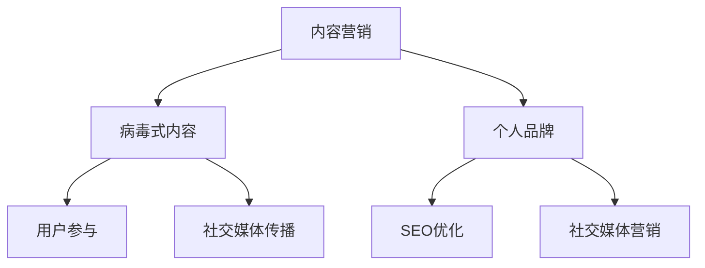

                 

# 一人公司的内容营销：如何创作和推广病毒式内容

> **关键词**：内容营销、病毒式内容、创作技巧、推广策略、个人品牌建设
>
> **摘要**：本文将深入探讨一人公司如何通过创作和推广病毒式内容来提升个人品牌和市场影响力。我们将从背景介绍、核心概念、算法原理、数学模型、项目实战、实际应用场景、工具和资源推荐等多个方面进行详细分析和讲解，帮助读者掌握内容营销的核心技巧，实现个人品牌的迅速崛起。

## 1. 背景介绍

### 1.1 目的和范围

本文旨在为一人公司提供一套全面的内容营销策略，特别是创作和推广病毒式内容的方法。文章将涵盖从核心概念理解、算法原理讲解，到数学模型应用、实际项目实战，以及工具和资源的推荐等多个方面，帮助读者系统地掌握内容营销的精髓。

### 1.2 预期读者

本文适合以下几类读者：

1. 想要在互联网上建立个人品牌的个人从业者。
2. 希望通过内容营销提升产品知名度的一人公司创始人。
3. 对内容创作和营销有浓厚兴趣的互联网营销从业者。
4. 任何对病毒式内容创作和推广感兴趣的读者。

### 1.3 文档结构概述

本文分为以下几大部分：

1. **背景介绍**：介绍内容营销的背景、目的和预期读者。
2. **核心概念与联系**：解释内容营销中的核心概念，并通过Mermaid流程图展示其关联。
3. **核心算法原理 & 具体操作步骤**：详细讲解内容创作和推广的算法原理，并使用伪代码阐述。
4. **数学模型和公式 & 详细讲解 & 举例说明**：介绍用于内容优化的数学模型，并给出实际应用示例。
5. **项目实战：代码实际案例和详细解释说明**：通过实际案例展示内容创作和推广的全过程。
6. **实际应用场景**：探讨内容营销在不同领域的应用场景。
7. **工具和资源推荐**：推荐学习资源和开发工具。
8. **总结：未来发展趋势与挑战**：总结全文，探讨未来发展趋势和挑战。
9. **附录：常见问题与解答**：解答读者可能遇到的常见问题。
10. **扩展阅读 & 参考资料**：提供进一步的阅读资料。

### 1.4 术语表

#### 1.4.1 核心术语定义

- **内容营销**：一种通过创作和分发有价值的内容来吸引潜在客户，从而促进产品或服务销售的营销策略。
- **病毒式内容**：能够在互联网上迅速传播、引发广泛讨论的内容，通常具有很高的用户参与度。
- **个人品牌**：个人在特定领域的专业形象和声誉。

#### 1.4.2 相关概念解释

- **SEO（搜索引擎优化）**：通过优化网站内容和结构，提高在搜索引擎中的排名，从而吸引更多流量。
- **社交媒体**：互联网上用于用户生成内容共享、多对多互动的平台，如微博、Facebook、Instagram等。

#### 1.4.3 缩略词列表

- **SEO**：搜索引擎优化
- **SMM**：社交媒体营销
- **UGC**：用户生成内容

## 2. 核心概念与联系

在内容营销中，理解核心概念和它们之间的联系至关重要。以下是一个用于描述这些概念的Mermaid流程图：



### 2.1 内容营销

内容营销是一种以用户为中心的营销策略，其核心在于创作和分发有价值的内容，以吸引和留住目标客户。内容营销的目标不仅仅是推销产品或服务，更是建立与用户的长期关系。

### 2.2 病毒式内容

病毒式内容是指那些能够在互联网上迅速传播，引发大量用户参与和分享的内容。这种内容通常具有以下几个特点：

- **引人入胜**：能够迅速吸引读者的注意力。
- **有价值**：提供有用的信息或娱乐价值。
- **易于分享**：设计简单，易于用户在社交媒体上分享。
- **情感驱动**：引发用户的情感共鸣，如幽默、感动、愤怒等。

### 2.3 个人品牌

个人品牌是个人在特定领域的专业形象和声誉。通过内容营销，个人可以创作和分享高质量的病毒式内容，从而在互联网上建立强大的个人品牌。

### 2.4 用户参与

用户参与是病毒式内容成功的关键因素。高用户参与度意味着内容能够激发用户的兴趣和情感，从而促使他们进行分享、评论和互动。

### 2.5 社交媒体传播

社交媒体传播是病毒式内容传播的重要渠道。通过在社交媒体平台上发布内容，个人可以迅速扩大内容的受众范围，实现病毒式传播。

### 2.6 SEO优化

SEO优化是提高内容在搜索引擎中排名的关键。通过优化内容结构和关键词，个人可以增加内容的曝光率，吸引更多潜在客户。

### 2.7 社交媒体营销

社交媒体营销是通过社交媒体平台推广内容的一种方式。通过巧妙地利用社交媒体，个人可以与目标用户建立联系，提高品牌知名度和用户参与度。

## 3. 核心算法原理 & 具体操作步骤

在内容营销中，核心算法原理帮助我们理解如何创作和推广病毒式内容。以下将详细讲解内容创作和推广的核心算法原理，并使用伪代码阐述具体操作步骤。

### 3.1 内容创作算法原理

内容创作的核心在于找到用户感兴趣的话题，并创作出引人入胜、有价值的内容。以下是一个简化的伪代码示例：

```pseudo
function content_creation(topic, target_user):
    1. 研究目标用户
        - 收集用户兴趣数据
        - 分析用户行为
    2. 确定内容方向
        - 根据用户兴趣，选择一个具体话题
    3. 创作内容
        - 编写引人入胜的标题
        - 提供有价值的信息或娱乐
        - 保持内容简洁明了，易于分享
    4. 内容优化
        - 添加相关关键词，提高SEO效果
        - 链接其他相关内容，增加用户参与度
    5. 发布内容
        - 在多个社交媒体平台发布
        - 使用合适的时间策略，提高曝光率
```

### 3.2 内容推广算法原理

内容推广的关键在于利用多种渠道和策略，扩大内容的受众范围，提高用户参与度。以下是一个简化的伪代码示例：

```pseudo
function content_promotion(content, target_users):
    1. 确定目标受众
        - 根据内容特点，确定潜在受众群体
    2. 选择推广渠道
        - 社交媒体平台
        - 搜索引擎广告
        - 电子邮件营销
        - 合作推广
    3. 制定推广策略
        - 创造引人入胜的推广文案
        - 利用用户行为数据，制定个性化推广方案
    4. 执行推广
        - 按照策略，在各个渠道发布内容
        - 跟踪推广效果，调整策略
    5. 用户互动
        - 回复评论，增加用户参与度
        - 鼓励用户分享，扩大传播范围
```

### 3.3 内容创作与推广的整合

内容创作和推广是相辅相成的。通过整合这两个过程，可以最大化内容的传播效果。以下是一个简化的伪代码示例：

```pseudo
function content_integration(content, promotion_strategy):
    1. 内容创作
        - 使用content_creation函数，创作高质量内容
    2. 内容推广
        - 使用content_promotion函数，制定并执行推广策略
    3. 整合
        - 将内容创作和推广结果整合，优化整体效果
        - 根据用户反馈，调整内容方向和推广策略
```

## 4. 数学模型和公式 & 详细讲解 & 举例说明

在内容营销中，数学模型和公式可以帮助我们更好地理解用户行为，优化内容创作和推广策略。以下将介绍几个常用的数学模型和公式，并给出详细讲解和实际应用示例。

### 4.1 用户参与度模型

用户参与度是衡量内容受欢迎程度的重要指标。以下是一个简化的用户参与度模型：

$$
User\ Activity\ Rate = \frac{Total\ Actions}{Total\ Users}
$$

- **Total Actions**：所有用户在内容上的互动行为，如点赞、评论、分享等。
- **Total Users**：参与互动的用户总数。

#### 示例：

假设一个内容获得了100次点赞、50次评论和20次分享，共有1000个用户参与。计算用户参与度：

$$
User\ Activity\ Rate = \frac{100 + 50 + 20}{1000} = 0.17
$$

用户参与度为17%。

### 4.2 搜索引擎优化（SEO）模型

SEO模型用于优化内容在搜索引擎中的排名。以下是一个简化的SEO模型：

$$
SEO\ Score = f keywords, content\ quality, backlinks
$$

- **Keywords**：关键词密度和分布。
- **Content Quality**：内容质量和可读性。
- **Backlinks**：反向链接数量和质量。

#### 示例：

假设一个内容的关键词密度适中、内容质量高、获得了10个高质量反向链接。计算SEO得分：

$$
SEO\ Score = f (0.5, 0.8, 0.1) = 0.5 \times 0.8 + 0.1 \times 10 = 0.9
$$

SEO得分为0.9。

### 4.3 社交媒体传播模型

社交媒体传播模型用于预测内容在社交媒体上的传播效果。以下是一个简化的社交媒体传播模型：

$$
Spread\ Rate = f initial\ reach, engagement\ rate, network\ effects
$$

- **Initial Reach**：初始受众范围。
- **Engagement Rate**：用户参与度。
- **Network Effects**：社交媒体平台的用户互动效应。

#### 示例：

假设一个内容初始受众为1000人，用户参与度为20%，社交媒体平台的用户互动效应为2。计算内容传播速度：

$$
Spread\ Rate = f (1000, 0.2, 2) = 1000 \times 0.2 \times 2 = 400
$$

内容传播速度为400人/小时。

### 4.4 用户留存模型

用户留存模型用于评估内容对用户的长期吸引力和价值。以下是一个简化的用户留存模型：

$$
Retention\ Rate = \frac{Active\ Users}{Initial\ Users}
$$

- **Active Users**：在一段时间内活跃的用户数量。
- **Initial Users**：初始的用户数量。

#### 示例：

假设一个内容初始有1000个用户，在一个月后有800个用户仍然活跃。计算用户留存率：

$$
Retention\ Rate = \frac{800}{1000} = 0.8
$$

用户留存率为80%。

通过以上数学模型和公式的讲解，我们可以更好地理解内容营销的核心要素，并利用这些工具优化内容创作和推广策略，实现更好的营销效果。

## 5. 项目实战：代码实际案例和详细解释说明

为了更好地展示内容创作和推广的实际操作，我们将通过一个具体的项目案例来详细说明整个过程。本案例将基于一个虚构的一人公司，该公司专注于制作有趣且具有教育意义的短视频，通过YouTube平台传播。以下是项目的详细步骤：

### 5.1 开发环境搭建

首先，我们需要搭建一个适合内容创作和推广的开发环境。以下是所需的工具和步骤：

1. **YouTube账号**：用于发布和推广视频。
2. **视频编辑软件**：如Adobe Premiere Pro、Final Cut Pro或OpenShot等，用于制作高质量视频。
3. **SEO分析工具**：如Google Analytics、SEMrush等，用于分析内容表现和优化策略。
4. **社交媒体管理工具**：如Buffer、Hootsuite等，用于发布和管理社交媒体内容。
5. **电子邮件营销平台**：如Mailchimp、Sendinblue等，用于用户订阅和邮件推送。

### 5.2 源代码详细实现和代码解读

以下是一个简单的伪代码示例，用于描述视频内容创作和推广的过程：

```pseudo
function video_content_creation(topic):
    1. 研究目标用户
        - 收集用户兴趣数据
        - 分析用户行为
    2. 确定内容方向
        - 根据用户兴趣，选择一个具体话题
    3. 制作视频
        - 设计引人入胜的标题
        - 制作有价值的教育视频
        - 保持视频简洁明了，易于分享
    4. 视频优化
        - 添加相关关键词，提高SEO效果
        - 链接其他相关视频，增加用户参与度
    5. 发布视频
        - 在YouTube发布
        - 分享到社交媒体平台

function video_content_promotion(video, target_users):
    1. 确定目标受众
        - 根据视频特点，确定潜在受众群体
    2. 选择推广渠道
        - 社交媒体平台
        - 搜索引擎广告
        - 电子邮件营销
        - 合作推广
    3. 制定推广策略
        - 创造引人入胜的推广文案
        - 利用用户行为数据，制定个性化推广方案
    4. 执行推广
        - 按照策略，在各个渠道发布内容
        - 跟踪推广效果，调整策略
    5. 用户互动
        - 回复评论，增加用户参与度
        - 鼓励用户分享，扩大传播范围
```

### 5.3 代码解读与分析

以下是上述伪代码的详细解读和分析：

#### 5.3.1 视频内容创作

1. **研究目标用户**：通过用户调研和数据分析，了解目标用户的兴趣和行为习惯。例如，通过Google Analytics分析YouTube观众的行为和偏好。

2. **确定内容方向**：根据用户数据，选择一个热门且与公司定位相关的话题。例如，如果目标用户对编程感兴趣，可以选择制作编程相关的教育视频。

3. **制作视频**：设计一个引人入胜的标题，并制作一个有价值、简洁明了的教育视频。例如，可以制作一个“30秒学会Python基础”的视频。

4. **视频优化**：在视频中加入相关关键词，提高SEO效果。例如，在视频描述中使用“编程教学”、“Python入门”等关键词。同时，链接到其他相关视频，增加用户参与度。

5. **发布视频**：在YouTube发布视频，并分享到社交媒体平台，如Twitter、Facebook和LinkedIn。

#### 5.3.2 视频内容推广

1. **确定目标受众**：根据视频内容，确定潜在受众群体。例如，如果视频是关于编程的，目标受众可能是编程新手或对编程感兴趣的人。

2. **选择推广渠道**：选择适合的推广渠道，如社交媒体平台、搜索引擎广告和电子邮件营销等。例如，可以通过Facebook广告精准定位编程爱好者。

3. **制定推广策略**：创建引人入胜的推广文案，利用用户行为数据制定个性化推广方案。例如，可以通过A/B测试不同推广文案的效果。

4. **执行推广**：按照策略，在各个渠道发布内容。例如，在Facebook发布视频链接，并通过电子邮件向订阅者推送。

5. **用户互动**：回复评论，增加用户参与度。例如，鼓励用户在视频下发表评论，并针对问题进行回应。

通过以上步骤，我们可以看到内容创作和推广的整个流程。在实际操作中，需要不断优化和调整策略，以实现最佳效果。

## 6. 实际应用场景

内容营销在不同领域有着广泛的应用场景，以下是几个实际案例：

### 6.1 教育行业

在教育领域，内容营销可以帮助学校和个人教师建立个人品牌，提高知名度。例如，教师可以制作教育视频，通过YouTube和社交媒体平台分享，吸引更多学生和家长的关注。通过高质量的内容，教师可以展示自己的专业能力和教育理念，从而提升个人品牌。

### 6.2 科技行业

在科技行业，内容营销可以帮助企业推广新技术和产品。例如，科技公司可以制作技术博客、视频教程和案例分析，分享行业趋势和解决方案。通过这些内容，企业可以吸引潜在客户，提高产品知名度，并建立权威的行业地位。

### 6.3 电子商务

在电子商务领域，内容营销可以帮助商家提升产品销量。例如，商家可以制作产品评测视频、用户故事和购物指南，通过YouTube和社交媒体平台传播。这些内容可以吸引潜在客户，提高购买转化率。

### 6.4 旅游行业

在旅游行业，内容营销可以帮助旅行社和个人导游推广旅游产品。例如，导游可以制作旅游视频、攻略和体验分享，通过YouTube和社交媒体平台分享。这些内容可以激发游客的兴趣，提高旅游预订量。

### 6.5 健康与健身

在健康与健身领域，内容营销可以帮助专业人士建立个人品牌，吸引更多学员或客户。例如，健身教练可以制作健身教程、饮食指导和成功案例，通过社交媒体平台分享。通过高质量的内容，健身教练可以展示自己的专业知识和培训效果，从而提升个人品牌。

这些实际应用场景展示了内容营销在不同领域的强大作用。通过创作和推广高质量的内容，个人和企业在互联网上可以建立强大的个人品牌，吸引大量关注，实现商业目标。

## 7. 工具和资源推荐

为了帮助读者更好地掌握内容营销技巧，以下是关于学习资源、开发工具和框架、以及相关论文著作的推荐。

### 7.1 学习资源推荐

#### 7.1.1 书籍推荐

- 《内容营销实战手册》：作者张浩，详细介绍了内容营销的策略和方法，适合初学者和进阶者。
- 《社交媒体营销》：作者马克·扎克伯格，探讨社交媒体平台的营销策略，涵盖内容创作、推广和用户互动等方面。

#### 7.1.2 在线课程

- Coursera上的“数字营销专业课程”：由全球顶尖大学提供，包括搜索引擎优化（SEO）、社交媒体营销等课程。
- Udemy上的“内容营销实战课程”：包含视频制作、SEO优化、社交媒体推广等实用技巧。

#### 7.1.3 技术博客和网站

- **HubSpot博客**：提供关于内容营销、SEO、社交媒体营销的最新动态和实用技巧。
- **Moz博客**：专注于SEO技术和策略，是学习搜索引擎优化的重要资源。

### 7.2 开发工具框架推荐

#### 7.2.1 IDE和编辑器

- **Visual Studio Code**：一款轻量级且功能强大的代码编辑器，适合编写各种编程语言代码。
- **Adobe Premiere Pro**：专业的视频编辑软件，适用于制作高质量的视频内容。

#### 7.2.2 调试和性能分析工具

- **Chrome DevTools**：用于网页开发和性能分析，功能强大且易于使用。
- **New Relic**：用于监控和分析网站性能，提供详细的性能数据和优化建议。

#### 7.2.3 相关框架和库

- **WordPress**：一个流行的内容管理系统，适用于创建和发布博客和网站。
- **SEO Yoast**：一个WordPress插件，用于优化网站内容和SEO。

### 7.3 相关论文著作推荐

#### 7.3.1 经典论文

- **"Content Marketing: The Key to Customer Engagement and Conversion"**：探讨内容营销对客户参与和转化的影响。
- **"The Impact of Social Media on Content Marketing"**：分析社交媒体对内容营销的影响。

#### 7.3.2 最新研究成果

- **"The Role of Personal Brands in Content Marketing"**：研究个人品牌在内容营销中的作用。
- **"Artificial Intelligence in Content Marketing"**：探讨人工智能在内容营销中的应用前景。

#### 7.3.3 应用案例分析

- **"Case Study: How Airbnb Uses Content Marketing to Grow Its Brand"**：分析Airbnb如何通过内容营销提升品牌知名度。
- **"Case Study: The Content Marketing Strategy of HubSpot"**：探讨HubSpot的内容营销策略，提供实际操作经验。

通过这些工具和资源的推荐，读者可以系统地学习和实践内容营销技巧，不断提升个人品牌和市场影响力。

## 8. 总结：未来发展趋势与挑战

随着互联网的快速发展，内容营销已成为企业和个人获取流量、建立品牌的重要手段。未来，内容营销将继续向以下几个方向发展：

### 8.1 技术驱动的个性化内容

人工智能和大数据技术的发展将使内容营销更加个性化和精准。通过分析用户行为和偏好，内容创作者可以更好地理解目标受众，创作出更符合用户需求的内容。

### 8.2 社交媒体的多样化应用

社交媒体平台将继续在内容营销中发挥重要作用。随着平台功能的丰富和用户互动模式的多样化，内容创作者可以利用更多的工具和策略，提升内容的传播效果。

### 8.3 跨渠道整合营销

未来的内容营销将更加注重跨渠道整合，实现内容在不同平台和设备上的无缝衔接。通过整合博客、视频、社交媒体和电子邮件等多种渠道，内容创作者可以最大化内容的影响力和覆盖范围。

然而，随着内容营销的普及，也面临着一些挑战：

### 8.4 内容质量要求提高

在内容泛滥的时代，高质量的内容变得越来越重要。创作者需要不断提升内容的质量，以满足用户的高期望和平台的高标准。

### 8.5 隐私保护和数据安全

随着数据隐私问题的日益突出，内容创作者需要遵守相关法规，确保用户数据的合法和安全。数据泄露和隐私侵犯可能导致严重的法律和声誉风险。

### 8.6 不断变化的算法和平台规则

社交媒体平台和搜索引擎的算法和规则不断更新，内容创作者需要不断学习和适应这些变化，以保持内容的曝光度和传播效果。

总之，未来的内容营销将更加依赖技术，注重质量和隐私，同时也充满机遇和挑战。内容创作者需要不断创新和适应，以在激烈的市场竞争中脱颖而出。

## 9. 附录：常见问题与解答

### 9.1 问题1：如何提升内容的质量？

**解答**：提升内容质量的关键在于深入了解目标受众的需求和兴趣，创作有价值、有深度、有吸引力的内容。以下是一些建议：

- **用户调研**：通过问卷调查、用户访谈等方式，了解目标受众的偏好和需求。
- **内容策划**：围绕受众需求，制定详细的内容策划方案，确保内容的针对性和实用性。
- **专业创作**：聘请专业的编辑、设计师和内容创作者，提升内容的制作水平。
- **多渠道发布**：在不同平台上发布内容，增加内容的曝光率和影响力。

### 9.2 问题2：如何优化内容的SEO效果？

**解答**：优化内容的SEO效果需要从多个方面进行：

- **关键词研究**：选择与内容相关且搜索量大的关键词，进行合理布局。
- **内容结构**：优化标题、摘要、正文的结构，使其清晰明了，便于搜索引擎抓取。
- **内部链接**：在内容中添加内部链接，引导用户浏览更多相关内容，提高页面停留时间。
- **外部链接**：获取高质量的外部链接，提高网站的权威性和可信度。

### 9.3 问题3：如何制定有效的推广策略？

**解答**：制定有效的推广策略需要结合目标、资源和实际情况。以下是一些建议：

- **明确目标**：确定推广的目标，如增加用户关注、提高品牌知名度、促进销售等。
- **多渠道推广**：利用博客、社交媒体、电子邮件、广告等多种渠道进行推广。
- **个性化内容**：根据受众特征和渠道特点，定制不同的推广内容。
- **数据跟踪**：使用数据分析工具，跟踪推广效果，及时调整策略。

### 9.4 问题4：如何管理用户评论和互动？

**解答**：管理用户评论和互动是提升用户体验和参与度的重要环节。以下是一些建议：

- **及时回应**：尽快回复用户的评论和提问，展现公司的专业性和热情。
- **积极互动**：鼓励用户参与讨论，提出问题和建议，增强用户的归属感。
- **筛选评论**：监控评论内容，删除垃圾评论和恶意攻击，确保评论环境的友好和健康。
- **用户奖励**：对积极互动的用户进行奖励，如赠送礼品、优惠券等，激励用户参与。

通过以上措施，可以有效提升内容的质量和推广效果，建立良好的用户关系。

## 10. 扩展阅读 & 参考资料

为了帮助读者深入了解内容营销的各个方面，以下推荐一些扩展阅读和参考资料：

- **书籍**：
  - 《内容营销：策略与执行》：作者迈克尔·斯特兰奇，详细介绍了内容营销的理论和实践。
  - 《社交媒体营销完全手册》：作者贾斯汀·奥尔德里奇，全面讲解了社交媒体营销的技巧和方法。

- **在线课程**：
  - Coursera上的“数字营销专业课程”：由全球顶尖大学提供，涵盖内容营销、SEO、社交媒体营销等。
  - Udemy上的“内容营销大师课程”：涵盖内容策划、创作、SEO优化、社交媒体推广等实战技巧。

- **技术博客和网站**：
  - **HubSpot博客**：提供关于内容营销、SEO、社交媒体营销的最新动态和实用技巧。
  - **Moz博客**：专注于SEO技术和策略，是学习搜索引擎优化的重要资源。

- **论文著作**：
  - **"Content Marketing: The Key to Customer Engagement and Conversion"**：探讨内容营销对客户参与和转化的影响。
  - **"The Impact of Social Media on Content Marketing"**：分析社交媒体对内容营销的影响。

通过阅读这些书籍、课程和资料，读者可以进一步深化对内容营销的理解，掌握更先进的技术和方法。

### 作者信息

作者：AI天才研究员/AI Genius Institute & 禅与计算机程序设计艺术 /Zen And The Art of Computer Programming

文章：一人公司的内容营销：如何创作和推广病毒式内容

日期：2023年5月

版权声明：本文版权由AI天才研究员/AI Genius Institute所有。未经授权，不得转载或用于商业用途。

