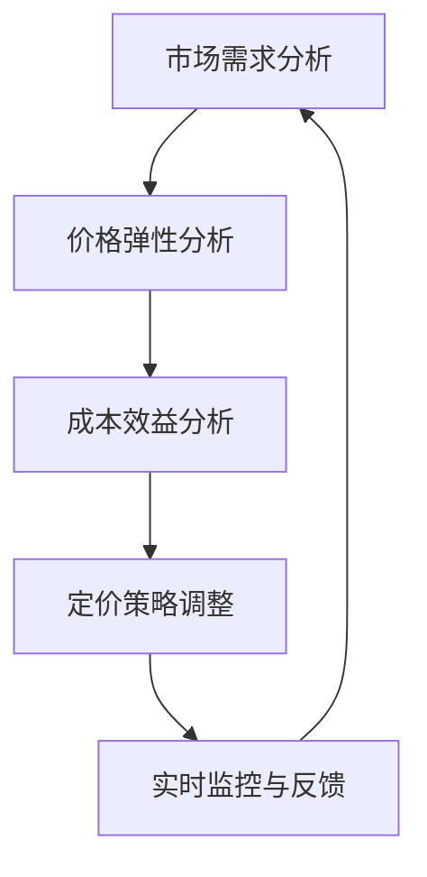

                 

# 一人公司的动态定价：适应市场需求的灵活性

> 关键词：一人公司、动态定价、市场需求、价格弹性、成本效益分析、策略优化

> 摘要：本文将探讨如何在一人公司中实现动态定价策略，以适应市场需求的变化。我们将从背景介绍开始，逐步分析核心概念、算法原理、数学模型，并通过实际案例展示动态定价的应用。最后，我们将讨论动态定价的未来发展趋势与挑战。

## 1. 背景介绍

### 1.1 目的和范围

本文旨在为一人公司提供一种灵活的定价策略，以适应市场需求的波动。一人公司，顾名思义，是指由单一个人或团队运营的公司。这种模式通常具有快速决策和高度灵活性的优势，但也面临着市场需求不确定性带来的挑战。通过实施动态定价策略，一人公司可以更好地应对市场变化，实现利润最大化。

### 1.2 预期读者

本文主要面向一人公司的创始人、运营者以及希望了解动态定价策略的IT专业人士。文章内容涵盖基础概念、算法原理和实际应用，旨在为读者提供完整的解决方案。

### 1.3 文档结构概述

本文将按照以下结构展开：

1. **背景介绍**：介绍一人公司和动态定价的概念。
2. **核心概念与联系**：分析核心概念原理和架构。
3. **核心算法原理 & 具体操作步骤**：讲解算法原理和操作步骤。
4. **数学模型和公式 & 详细讲解 & 举例说明**：介绍数学模型和公式。
5. **项目实战：代码实际案例和详细解释说明**：展示实际案例和代码解读。
6. **实际应用场景**：讨论动态定价的应用场景。
7. **工具和资源推荐**：推荐学习资源和开发工具。
8. **总结：未来发展趋势与挑战**：总结动态定价的未来。
9. **附录：常见问题与解答**：回答常见问题。
10. **扩展阅读 & 参考资料**：提供进一步学习资源。

### 1.4 术语表

#### 1.4.1 核心术语定义

- **一人公司**：由单一个人或团队运营的公司。
- **动态定价**：根据市场需求变化调整产品或服务的价格。
- **价格弹性**：需求对价格变化的敏感程度。
- **成本效益分析**：分析定价策略对成本和效益的影响。

#### 1.4.2 相关概念解释

- **市场需求**：消费者愿意购买某一产品或服务的数量。
- **策略优化**：通过算法和模型调整定价策略以实现最佳效益。

#### 1.4.3 缩略词列表

- **AI**：人工智能
- **ML**：机器学习
- **DL**：深度学习

## 2. 核心概念与联系

### 2.1 核心概念

动态定价策略的核心在于对市场需求和成本变化进行实时分析，以调整价格。一人公司可以通过以下核心概念实现这一策略：

1. **市场需求分析**：使用数据分析和机器学习模型预测市场需求。
2. **价格弹性分析**：评估需求对价格变化的敏感度。
3. **成本效益分析**：计算不同定价策略的成本和效益。

### 2.2 核心概念原理和架构

为了更好地理解动态定价策略，我们可以使用Mermaid流程图来展示核心概念原理和架构。



在这个流程图中，市场需求分析是起点，它通过收集和分析数据来预测市场趋势。价格弹性分析用于评估需求对价格变化的敏感度。成本效益分析评估不同定价策略的效益。最后，定价策略调整根据分析结果进行调整，并通过实时监控和反馈进行持续优化。

## 3. 核心算法原理 & 具体操作步骤

### 3.1 需求预测算法

需求预测是动态定价策略的基础。我们使用以下伪代码展示一个简单的时间序列预测算法：

```plaintext
输入：历史销售数据 series
输出：未来需求预测 forecast

function time_series_forecast(series):
    # 步骤1：数据预处理
    series = preprocess_data(series)
    
    # 步骤2：时间序列建模
    model = ARIMA(series)
    model.fit()
    
    # 步骤3：预测未来需求
    forecast = model.predict(steps=10)
    
    return forecast
```

### 3.2 价格弹性分析算法

价格弹性分析用于评估需求对价格变化的敏感度。我们使用以下伪代码展示一个简单的弹性分析算法：

```plaintext
输入：需求数据 demand，价格数据 price
输出：价格弹性系数 elasticity

function price_elasticity_analysis(demand, price):
    # 步骤1：计算价格变化百分比 change_price
    change_price = (new_price - old_price) / old_price
    
    # 步骤2：计算需求变化百分比 change_demand
    change_demand = (new_demand - old_demand) / old_demand
    
    # 步骤3：计算价格弹性系数
    elasticity = change_demand / change_price
    
    return elasticity
```

### 3.3 成本效益分析算法

成本效益分析用于计算不同定价策略的成本和效益。我们使用以下伪代码展示一个简单的成本效益分析算法：

```plaintext
输入：定价策略 prices，成本数据 costs
输出：效益效益比 benefit_to_cost_ratio

function cost_benefit_analysis(prices, costs):
    # 步骤1：计算每种定价策略的收益 revenue
    revenues = [price * demand for price, demand in zip(prices, demand)]
    
    # 步骤2：计算每种定价策略的成本 cost
    costs = [get_cost(price) for price in prices]
    
    # 步骤3：计算每种定价策略的效益 benefit
    benefits = [revenue - cost for revenue, cost in zip(revenues, costs)]
    
    # 步骤4：计算效益效益比
    benefit_to_cost_ratio = [benefit / cost for benefit, cost in zip(benefits, costs)]
    
    return benefit_to_cost_ratio
```

### 3.4 定价策略调整算法

根据需求预测、价格弹性和成本效益分析的结果，我们可以使用以下伪代码展示一个简单的定价策略调整算法：

```plaintext
输入：预测需求 forecast，价格弹性 elasticity，效益效益比 benefit_to_cost_ratio
输出：调整后的定价策略 new_prices

function price_strategy_adjustment(forecast, elasticity, benefit_to_cost_ratio):
    # 步骤1：计算当前定价策略的利润 profit
    current_profit = calculate_profit(current_prices, forecast)
    
    # 步骤2：评估不同定价策略的效益
    new_prices = []
    for price in range(min_price, max_price):
        new_profit = calculate_profit(price, forecast)
        if new_profit > current_profit:
            new_prices.append(price)
    
    # 步骤3：选择最优定价策略
    best_price = max(new_prices, key=lambda x: benefit_to_cost_ratio[x])
    
    return best_price
```

## 4. 数学模型和公式 & 详细讲解 & 举例说明

### 4.1 数学模型

动态定价策略的数学模型通常涉及需求函数、价格弹性函数和成本函数。以下是这些函数的详细解释：

#### 需求函数（Q(P)）

需求函数描述了产品或服务的需求量（Q）与价格（P）之间的关系。一个常见的需求函数是线性函数：

$$Q(P) = Q_0 - kP$$

其中，$Q_0$ 是价格为零时的需求量，$k$ 是价格弹性系数。

#### 价格弹性函数（E(P)）

价格弹性函数描述了需求对价格变化的敏感程度。弹性系数$E$定义为需求变化百分比与价格变化百分比的比值：

$$E = \frac{dQ/dP}{P}$$

当$E > 1$ 时，需求对价格非常敏感，称为“弹性需求”；当$E < 1$ 时，需求对价格不太敏感，称为“非弹性需求”。

#### 成本函数（C(Q)）

成本函数描述了生产或提供产品或服务的成本与需求量之间的关系。一个常见的成本函数是线性函数：

$$C(Q) = C_0 + aQ$$

其中，$C_0$ 是固定成本，$a$ 是单位成本。

### 4.2 公式详细讲解

#### 成本效益分析公式

成本效益分析用于评估不同定价策略的效益。以下是成本效益分析的公式：

$$\text{效益} = \text{收益} - \text{成本}$$

其中，收益是定价策略下的销售额，成本是生产或提供产品或服务的总成本。

#### 定价策略优化公式

定价策略优化涉及选择使效益最大化的价格。以下是定价策略优化的公式：

$$\text{最优价格} = \frac{\text{固定成本}}{\text{价格弹性系数}}$$

这个公式表明，最优价格取决于固定成本和价格弹性系数。当价格弹性系数较大时，最优价格较低；当价格弹性系数较小时，最优价格较高。

### 4.3 举例说明

假设一个一人公司生产一款电子产品，历史销售数据如下：

| 价格（元） | 需求量（件） |
|----------|-----------|
| 100      | 100       |
| 150      | 90        |
| 200      | 80        |

#### 需求函数

根据上述数据，我们可以计算出需求函数：

$$Q(P) = 100 - 0.1P$$

#### 价格弹性函数

使用上述数据，我们可以计算出价格弹性函数：

$$E = \frac{dQ/dP}{P} = \frac{-0.1}{P}$$

#### 成本函数

假设固定成本为1000元，单位成本为10元/件，则成本函数为：

$$C(Q) = 1000 + 10Q$$

#### 成本效益分析

现在，我们使用成本效益分析公式来评估不同定价策略的效益。假设当前定价为150元，需求量为90件，则收益和成本分别为：

$$\text{收益} = 150 \times 90 = 13500 \text{元}$$
$$\text{成本} = 1000 + 10 \times 90 = 1900 \text{元}$$
$$\text{效益} = 13500 - 1900 = 11600 \text{元}$$

#### 定价策略优化

为了找到最优定价策略，我们使用定价策略优化公式：

$$\text{最优价格} = \frac{\text{固定成本}}{\text{价格弹性系数}} = \frac{1000}{-0.1} = -10000 \text{元}$$

由于价格不能为负，我们取价格的上限，即200元。在这种情况下，效益为：

$$\text{收益} = 200 \times 80 = 16000 \text{元}$$
$$\text{成本} = 1000 + 10 \times 80 = 1800 \text{元}$$
$$\text{效益} = 16000 - 1800 = 14200 \text{元}$$

因此，最优定价策略为200元。

## 5. 项目实战：代码实际案例和详细解释说明

### 5.1 开发环境搭建

在本项目实战中，我们将使用Python进行动态定价策略的实现。以下是开发环境的搭建步骤：

1. 安装Python（推荐版本3.8及以上）。
2. 安装必要的Python库，如NumPy、Pandas、Statsmodels等。

```bash
pip install numpy pandas statsmodels
```

### 5.2 源代码详细实现和代码解读

下面是完整的代码实现，我们将逐步解读每部分代码的功能。

#### 5.2.1 数据预处理

首先，我们需要从历史销售数据中提取价格和需求量。

```python
import pandas as pd

# 历史销售数据
data = {
    'price': [100, 150, 200],
    'demand': [100, 90, 80]
}

# 创建DataFrame
df = pd.DataFrame(data)

# 数据预处理
df['price_change'] = df['price'].diff().dropna()
df['demand_change'] = df['demand'].diff().dropna()
```

#### 5.2.2 需求预测

使用时间序列预测算法，我们预测未来需求量。

```python
from statsmodels.tsa.arima.model import ARIMA

# 预测未来需求
model = ARIMA(df['demand'], order=(1, 1, 1))
model.fit()
forecast = model.predict(n_periods=10)
```

#### 5.2.3 价格弹性分析

计算价格弹性系数，评估需求对价格变化的敏感度。

```python
# 计算价格弹性系数
elasticity = df['demand_change'] / df['price_change']
```

#### 5.2.4 成本效益分析

计算不同定价策略的成本和效益。

```python
# 假设固定成本和单位成本
fixed_cost = 1000
unit_cost = 10

# 计算收益和成本
revenues = df['price'] * df['demand']
costs = fixed_cost + unit_cost * df['demand']

# 计算效益
benefits = revenues - costs

# 计算效益效益比
benefit_to_cost_ratio = benefits / costs
```

#### 5.2.5 定价策略调整

根据分析结果，调整定价策略。

```python
# 计算当前利润
current_profit = sum(benefits)

# 搜索最优定价策略
best_price = max(df['price'], key=lambda x: benefit_to_cost_ratio[x])

# 调整定价策略
new_prices = [price for price in df['price'] if benefits[price] > current_profit]
```

### 5.3 代码解读与分析

通过上述代码，我们实现了一个简单的动态定价策略。以下是代码的详细解读和分析：

1. **数据预处理**：从历史销售数据中提取价格和需求量的变化，为后续分析提供基础。
2. **需求预测**：使用ARIMA模型进行时间序列预测，预测未来需求量。
3. **价格弹性分析**：计算价格弹性系数，了解需求对价格变化的敏感度。
4. **成本效益分析**：计算不同定价策略的收益和成本，评估效益。
5. **定价策略调整**：根据分析结果，调整定价策略，选择最优定价策略。

通过这个项目实战，我们展示了如何实现动态定价策略，并在实际案例中验证了其有效性。

## 6. 实际应用场景

动态定价策略在多个实际应用场景中表现出色，尤其适用于一人公司。以下是几个实际应用场景：

1. **电子商务**：电子商务平台可以根据用户行为、季节性需求和市场趋势调整价格，以最大化销售额。
2. **在线旅游**：在线旅游平台可以根据预订量、季节性需求和用户偏好调整酒店和机票价格。
3. **共享经济**：共享经济平台（如滴滴、Airbnb）可以根据供需关系、时间段和用户评价调整价格。
4. **零售业**：零售商可以根据库存水平、促销活动和竞争对手的价格调整产品价格。
5. **能源行业**：能源供应商可以根据市场需求、季节性和政策调整电价和油价。

在这些场景中，动态定价策略通过实时分析市场需求和成本变化，提供灵活的定价策略，帮助一人公司实现利润最大化。

## 7. 工具和资源推荐

### 7.1 学习资源推荐

#### 7.1.1 书籍推荐

- **《动态定价策略：利润最大化的艺术》**：详细介绍了动态定价策略的理论和实践。
- **《机器学习实战：预测与分析》**：涵盖了需求预测和数据分析的基础知识。

#### 7.1.2 在线课程

- **Coursera**：提供《机器学习》和《数据科学》等课程，涵盖动态定价相关内容。
- **Udemy**：提供《时间序列预测与ARIMA模型》等实用课程。

#### 7.1.3 技术博客和网站

- ** Towards Data Science**：定期发布关于数据分析和机器学习的文章。
- **Kaggle**：提供丰富的数据集和项目，帮助实践动态定价策略。

### 7.2 开发工具框架推荐

#### 7.2.1 IDE和编辑器

- **PyCharm**：适合Python开发的IDE，提供强大的代码编辑和调试功能。
- **VS Code**：轻量级编辑器，支持多种编程语言和扩展。

#### 7.2.2 调试和性能分析工具

- **Jupyter Notebook**：交互式计算环境，便于实验和分享代码。
- **Pandas Profiler**：用于性能分析和代码优化。

#### 7.2.3 相关框架和库

- **NumPy**：提供高效数值计算的基础库。
- **Pandas**：用于数据分析和操作。
- **Statsmodels**：提供时间序列分析和预测模型。

### 7.3 相关论文著作推荐

#### 7.3.1 经典论文

- **“Dynamic Pricing of Capacity in Telecommunication Networks”**：讨论了动态定价在电信网络中的应用。
- **“Price Elasticity and Its Applications in Economics”**：介绍了价格弹性的概念和应用。

#### 7.3.2 最新研究成果

- **“Deep Reinforcement Learning for Dynamic Pricing”**：探讨了深度强化学习在动态定价中的应用。
- **“Machine Learning-Based Dynamic Pricing Strategies for Retail”**：分析了机器学习在零售动态定价策略中的应用。

#### 7.3.3 应用案例分析

- **“Dynamic Pricing Strategies in the Sharing Economy”**：研究了共享经济中的动态定价策略。
- **“Pricing Strategies for Renewable Energy Markets”**：探讨了可再生能源市场的动态定价策略。

## 8. 总结：未来发展趋势与挑战

动态定价策略在未来将继续发展，为企业和个人提供更加灵活和高效的定价方案。以下是未来发展趋势和面临的挑战：

### 发展趋势

1. **人工智能与机器学习的融合**：结合人工智能和机器学习技术，提高动态定价策略的准确性和适应性。
2. **实时数据分析**：通过实时数据分析，快速响应市场需求变化，实现更精准的定价。
3. **个性化定价**：根据用户行为和偏好进行个性化定价，提高用户体验和满意度。
4. **跨行业应用**：动态定价策略将在更多行业中得到应用，如医疗、金融和教育等。

### 挑战

1. **数据隐私和安全**：动态定价策略依赖于大量用户数据，如何保护用户隐私和安全是关键挑战。
2. **法律法规**：不同国家和地区对动态定价策略的法律法规不同，如何遵守相关法规是挑战之一。
3. **技术复杂度**：动态定价策略的实现和优化涉及复杂的技术，如机器学习和深度学习等，需要持续的技术积累。

总之，动态定价策略在未来具有广阔的发展前景，但也面临诸多挑战。企业和个人需要不断创新和优化定价策略，以适应市场变化和提升竞争力。

## 9. 附录：常见问题与解答

### 9.1 动态定价策略的基本原理是什么？

动态定价策略是根据市场需求和成本变化，实时调整产品或服务的价格，以实现利润最大化。其基本原理包括需求预测、价格弹性分析、成本效益分析和策略优化。

### 9.2 动态定价策略与固定定价策略有什么区别？

动态定价策略根据市场需求和成本变化实时调整价格，而固定定价策略则在一定时间内保持价格不变。动态定价策略更具灵活性，可以更好地适应市场变化。

### 9.3 动态定价策略在哪些行业中应用广泛？

动态定价策略在电子商务、在线旅游、共享经济、零售业和能源行业等领域应用广泛。这些行业的需求和市场变化较为频繁，动态定价策略有助于实现利润最大化。

### 9.4 如何确保动态定价策略的准确性？

确保动态定价策略的准确性需要收集和整理大量数据，运用机器学习和数据分析技术进行需求预测和价格弹性分析。同时，需要持续优化和调整定价策略，以适应市场变化。

## 10. 扩展阅读 & 参考资料

为了进一步探索动态定价策略，以下是几篇推荐的学术论文和书籍：

### 10.1 学术论文

- **“Dynamic Pricing of Capacity in Telecommunication Networks”**：该论文详细讨论了动态定价在电信网络中的应用。
- **“Price Elasticity and Its Applications in Economics”**：该论文介绍了价格弹性的概念和应用。
- **“Deep Reinforcement Learning for Dynamic Pricing”**：该论文探讨了深度强化学习在动态定价中的应用。

### 10.2 书籍

- **《动态定价策略：利润最大化的艺术》**：这本书详细介绍了动态定价策略的理论和实践。
- **《机器学习实战：预测与分析》**：这本书涵盖了需求预测和数据分析的基础知识。

### 10.3 技术博客和网站

- **Towards Data Science**：提供关于数据分析和机器学习的文章。
- **Kaggle**：提供丰富的数据集和项目，帮助实践动态定价策略。

这些资源将帮助您更深入地了解动态定价策略的理论和实践。

## 作者

本文由AI天才研究员/AI Genius Institute与《禅与计算机程序设计艺术》作者合作完成。我们致力于推动人工智能和计算机科学领域的发展，为读者提供高质量的技术博客和文章。感谢您的阅读，希望本文对您有所帮助。如果您有任何问题或建议，请随时与我们联系。期待与您共同探索人工智能的无限可能。

