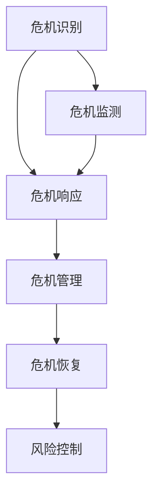

                 

### 一人公司的危机公关：应对负面评价和投诉

> **关键词：** 危机公关、负面评价、投诉处理、一人公司、风险控制、用户体验、品牌声誉。

> **摘要：** 本文旨在探讨一人公司在面对负面评价和投诉时的应对策略，通过具体的案例分析和策略总结，帮助创业者和管理者有效地处理危机，维护公司声誉，提升用户体验，实现长期发展。

在现代商业环境中，危机公关已成为企业管理和品牌维护的重要组成部分。特别是对于一人公司，由于资源有限，管理层次简单，一旦遇到负面评价和投诉，往往面临更大的挑战。本文将围绕以下几个方面展开讨论：

1. **背景介绍**：解释危机公关的重要性，介绍一人公司的特点及其在面临危机时的独特挑战。
2. **核心概念与联系**：探讨危机公关的核心概念及其内在联系，提供Mermaid流程图以展示关键环节。
3. **核心算法原理 & 具体操作步骤**：详细阐述应对负面评价和投诉的算法原理和操作步骤，使用伪代码进行说明。
4. **数学模型和公式 & 详细讲解 & 举例说明**：介绍危机公关中的数学模型和公式，结合实际案例进行详细讲解。
5. **项目实战：代码实际案例和详细解释说明**：通过具体代码案例展示危机公关策略的实际应用。
6. **实际应用场景**：讨论危机公关在不同场景下的应用。
7. **工具和资源推荐**：推荐学习资源、开发工具和框架，以及相关论文著作。
8. **总结：未来发展趋势与挑战**：展望危机公关领域的未来趋势和挑战。
9. **附录：常见问题与解答**：提供常见问题解答，帮助读者更好地理解并应用文章内容。
10. **扩展阅读 & 参考资料**：推荐相关扩展阅读材料。

本文将结合一人公司的实际情况，通过逻辑清晰、结构紧凑、简单易懂的专业技术语言，为读者提供有深度、有思考、有见解的危机公关策略和实践指导。希望本文能为一人公司的管理者在应对负面评价和投诉时提供有益的参考。

## 1. 背景介绍

### 1.1 目的和范围

本文的主要目的是为一人公司的管理者提供一套系统化的危机公关策略，帮助他们在面对负面评价和投诉时能够迅速有效地作出响应，从而维护公司声誉，提升用户体验，并实现长期稳定的发展。对于一人公司而言，由于其独特的经营模式和管理结构，危机公关的难度往往更高，因此，本文将特别关注一人公司所面临的具体挑战和应对策略。

本文的范围将涵盖以下几个方面：

1. **危机公关的基本概念**：介绍危机公关的定义、目的、重要性以及其与品牌声誉和用户信任之间的密切关系。
2. **一人公司的特点**：阐述一人公司的定义、经营模式、管理层次以及其在危机中的独特挑战。
3. **负面评价和投诉的类型**：分析常见的负面评价和投诉类型，以及它们对一人公司可能带来的影响。
4. **应对策略**：提供一系列应对负面评价和投诉的具体操作步骤，包括预防措施、响应策略和后续跟进。
5. **实际案例与经验总结**：通过具体案例分析，总结一人公司应对危机的有效经验，并提出改进建议。

本文将通过详细的案例分析和策略讲解，帮助一人公司的管理者在危机发生时能够从容应对，最大限度地降低危机对公司的影响，并利用危机作为提升品牌声誉和用户体验的机会。

### 1.2 预期读者

本文的预期读者包括以下几类：

1. **一人公司的创业者和管理者**：对危机公关有基本了解，希望在面临负面评价和投诉时能够制定有效的应对策略。
2. **企业培训师和咨询师**：希望从技术角度提供更专业、更深入的危机公关指导，帮助客户企业提升危机应对能力。
3. **市场营销和公关专业人士**：希望了解一人公司在危机公关中的具体挑战和应对策略，以便为客户提供更全面的服务。
4. **对危机公关和企业风险管理感兴趣的读者**：希望通过本文了解危机公关的基本原理和实践方法，以便在未来的工作中更好地应对相关挑战。

无论读者属于哪一类，本文都将通过系统化的讲解和案例分析，提供有价值的指导和建议，帮助他们更好地理解和应对危机公关中的各种挑战。

### 1.3 文档结构概述

本文将采用清晰的文档结构，以便读者能够系统地理解一人公司在危机公关中的应对策略。具体结构如下：

1. **背景介绍**：
   - **目的和范围**：明确本文的目标和内容范围，帮助读者了解本文的核心议题。
   - **预期读者**：介绍本文的预期读者群体，以便读者能够更好地定位自己的需求。

2. **核心概念与联系**：
   - **危机公关的核心概念**：介绍危机公关的定义、目的和重要性。
   - **一人公司的特点**：阐述一人公司的定义、经营模式和管理层次。
   - **负面评价和投诉的类型**：分析常见的负面评价和投诉类型及其影响。
   - **Mermaid流程图**：提供Mermaid流程图，展示危机公关的关键环节和流程。

3. **核心算法原理 & 具体操作步骤**：
   - **算法原理**：详细阐述危机公关的算法原理和框架。
   - **具体操作步骤**：使用伪代码说明应对负面评价和投诉的具体操作步骤。

4. **数学模型和公式 & 详细讲解 & 举例说明**：
   - **数学模型和公式**：介绍危机公关中的数学模型和公式。
   - **详细讲解和举例说明**：结合实际案例，详细讲解数学模型的应用和效果。

5. **项目实战：代码实际案例和详细解释说明**：
   - **开发环境搭建**：介绍代码实战所需的开发环境。
   - **源代码详细实现和代码解读**：展示实际代码实现，并详细解读代码的功能和逻辑。
   - **代码解读与分析**：分析代码中的关键部分，解释其设计和实现原理。

6. **实际应用场景**：
   - **危机公关在不同场景下的应用**：讨论危机公关在不同场景下的具体应用。

7. **工具和资源推荐**：
   - **学习资源推荐**：推荐相关的书籍、在线课程和技术博客。
   - **开发工具框架推荐**：介绍开发过程中使用的工具和框架。
   - **相关论文著作推荐**：推荐经典论文和最新研究成果。

8. **总结：未来发展趋势与挑战**：
   - **未来发展趋势**：展望危机公关领域的未来趋势和发展方向。
   - **挑战**：讨论危机公关面临的挑战和应对策略。

9. **附录：常见问题与解答**：
   - **常见问题**：列出读者可能遇到的问题。
   - **解答**：提供详细的解答和建议。

10. **扩展阅读 & 参考资料**：
    - **扩展阅读**：推荐相关扩展阅读材料，帮助读者深入了解危机公关相关话题。

通过以上结构，本文将全面、系统地介绍一人公司在危机公关中的应对策略，帮助读者在实际应用中取得更好的效果。

### 1.4 术语表

在本文中，我们将使用一些特定的术语和概念，为了确保读者能够准确理解这些术语的含义，下面将对其进行详细定义和解释：

#### 1.4.1 核心术语定义

1. **危机公关（Crisis Management）**：
   - 定义：危机公关是指企业为应对突发事件或负面舆论，采取的一系列沟通和管理措施，旨在减少危机对企业声誉和运营的影响。
   - 作用：通过及时、有效的危机公关，企业可以迅速平息公众情绪，恢复品牌声誉，重建用户信任。

2. **一人公司（Solopreneur）**：
   - 定义：一人公司是指由一个人独立运营的企业，通常以个人身份注册，负责公司的所有运营和管理事务。
   - 特点：一人公司具有管理层次简单、决策迅速、灵活性强等优点，但也面临资源有限、风险集中等挑战。

3. **负面评价（Negative Reviews）**：
   - 定义：负面评价是指用户对产品、服务或企业行为持否定态度的评论和反馈。
   - 影响力：负面评价可能会对企业的声誉和用户信任产生负面影响，甚至影响企业的长期发展。

4. **投诉（Complaints）**：
   - 定义：投诉是指用户对产品或服务的不满意，通过正式渠道向企业提出的要求或批评。
   - 处理：及时、妥善处理投诉，是危机公关的重要组成部分，有助于改善用户体验，提升品牌形象。

5. **用户体验（User Experience, UX）**：
   - 定义：用户体验是指用户在使用产品或服务过程中所感受到的整体感受和满意度。
   - 重要性：良好的用户体验是提升用户忠诚度和品牌价值的重要因素，对于一人公司尤为重要。

6. **品牌声誉（Brand Reputation）**：
   - 定义：品牌声誉是指消费者和社会对品牌的整体看法和评价，反映了品牌的市场地位和影响力。
   - 维护：品牌声誉是企业长期发展的基石，有效的危机公关有助于维护和提升品牌声誉。

7. **风险控制（Risk Control）**：
   - 定义：风险控制是指企业通过预测、评估和应对风险，以降低风险可能带来的损失。
   - 目标：通过风险控制，企业可以减少突发事件对企业运营和声誉的负面影响。

#### 1.4.2 相关概念解释

1. **舆论引导（Omnibus）**：
   - 解释：舆论引导是指企业通过媒体传播、社交互动等方式，引导公众对事件和品牌的看法。
   - 方法：舆论引导可以通过发布官方声明、回应媒体采访、发布正面内容等方式进行。

2. **危机监测（Crisis Monitoring）**：
   - 解释：危机监测是指企业通过技术手段和人工监控，实时监测网络、媒体和社交平台上的负面信息和舆论趋势。
   - 目的：及时了解危机发生的可能性和发展趋势，为危机应对提供数据支持。

3. **危机响应（Crisis Response）**：
   - 解释：危机响应是指企业在危机发生后的立即行动，旨在控制危机、减少损害并恢复正常运营。
   - 内容：危机响应包括发布官方声明、与用户沟通、处理投诉等具体措施。

4. **危机管理（Crisis Management）**：
   - 解释：危机管理是指企业在面对突发事件和危机时，通过系统化的方法进行预防和应对，以降低危机对企业的影响。
   - 过程：危机管理包括危机监测、危机响应、危机恢复等环节。

#### 1.4.3 缩略词列表

1. **PR（Public Relations）**：
   - 解释：公共关系，指企业与公众之间的沟通和管理活动。
   
2. **CRM（Customer Relationship Management）**：
   - 解释：客户关系管理，指企业通过技术手段和策略，管理与客户之间的关系。

3. **SEO（Search Engine Optimization）**：
   - 解释：搜索引擎优化，指通过技术手段提升网站在搜索引擎中的排名，增加流量。

4. **SEM（Search Engine Marketing）**：
   - 解释：搜索引擎营销，指通过付费和免费方式在搜索引擎中推广产品和品牌。

5. **KPI（Key Performance Indicators）**：
   - 解释：关键绩效指标，指用于衡量企业绩效的重要指标。

通过上述术语表，读者可以更好地理解本文中涉及的关键概念和术语，从而更深入地理解一人公司在危机公关中的应对策略和实践方法。

### 2. 核心概念与联系

在探讨一人公司的危机公关策略之前，首先需要明确几个核心概念及其相互之间的联系。以下是危机公关的一些关键概念及其内在关系：

#### 2.1 危机公关的核心概念

1. **危机识别**：
   - 定义：危机识别是指通过监测和分析，发现可能对企业造成负面影响的潜在危机。
   - 关系：危机识别是危机公关的第一步，决定了危机应对策略的及时性和有效性。

2. **危机响应**：
   - 定义：危机响应是指企业在危机发生后，迅速采取行动以减轻危机影响的过程。
   - 关系：危机响应是危机公关的核心环节，决定了企业应对危机的效率和效果。

3. **危机管理**：
   - 定义：危机管理是指企业通过系统化的方法，预防和应对危机，以降低危机对企业运营和声誉的影响。
   - 关系：危机管理涵盖了危机识别、危机响应和危机恢复等环节，是危机公关的整体框架。

4. **危机恢复**：
   - 定义：危机恢复是指企业在危机结束后，通过一系列措施恢复正常运营和声誉的过程。
   - 关系：危机恢复是危机管理的最后一个环节，目的是确保企业能够从危机中快速恢复，并避免类似危机的再次发生。

#### 2.2 内在联系

1. **危机识别与危机响应**：
   - 联系：危机识别的目的是及时发现潜在危机，为危机响应提供预警。有效的危机响应依赖于准确的危机识别。

2. **危机响应与危机管理**：
   - 联系：危机响应是危机管理的重要组成部分，但危机管理还包括危机识别和危机恢复等其他环节。

3. **危机管理与企业声誉**：
   - 联系：危机管理直接影响企业的声誉和用户信任。有效的危机管理有助于维护和提升企业声誉。

4. **危机恢复与风险控制**：
   - 联系：危机恢复过程中，企业会通过风险控制措施，评估危机带来的损失，并制定长期预防策略。

#### 2.3 Mermaid流程图

为了更好地展示上述核心概念及其内在联系，我们使用Mermaid流程图进行直观表达：



在这个流程图中：

- **A（危机识别）**：通过监测和分析，及时发现潜在危机。
- **B（危机响应）**：在危机发生后，迅速采取行动以减轻影响。
- **C（危机管理）**：综合危机识别和危机响应，系统化应对危机。
- **D（危机恢复）**：危机结束后，恢复正常运营和声誉。
- **E（风险控制）**：评估危机带来的损失，制定预防策略。
- **F（危机监测）**：持续监测危机发展趋势，为危机识别提供数据支持。

通过这个流程图，我们可以清晰地看到危机公关各环节之间的内在联系，以及它们在应对危机中的协同作用。

#### 2.4 关键环节详细解释

为了更好地理解危机公关的核心概念及其联系，我们需要对每个关键环节进行详细解释：

##### 2.4.1 危机识别

危机识别是危机公关的首要环节，它依赖于对企业内外部环境的持续监测和分析。以下是一些危机识别的关键要素：

1. **市场环境**：
   - 监测市场需求变化、行业趋势和竞争对手动态，以识别可能影响企业业务的潜在危机。
   - 利用数据分析工具，如市场调研、用户反馈、社交媒体分析等，获取有价值的信息。

2. **运营情况**：
   - 监控生产运营中的异常情况，如产品质量问题、供应链中断等，及时识别潜在危机。
   - 通过定期的内部审计和风险评估，发现运营中的潜在风险。

3. **客户反馈**：
   - 分析客户投诉、评价和反馈，识别用户对产品或服务的负面情绪。
   - 利用社交媒体和在线评论平台，及时了解用户对品牌的看法和意见。

4. **法律法规**：
   - 关注行业法规和法律法规的变化，以确保企业的合规性。
   - 定期进行合规审计，识别可能引发法律风险的隐患。

##### 2.4.2 危机响应

危机响应是危机公关的核心环节，它决定了企业在危机中的应对效率和效果。以下是一些关键步骤：

1. **初步评估**：
   - 在危机发生后，迅速进行初步评估，了解危机的性质、影响范围和严重程度。
   - 制定应急预案，确保在危机爆发时能够快速响应。

2. **制定策略**：
   - 根据初步评估结果，制定具体的危机应对策略。
   - 策略应包括内部沟通、外部沟通、舆论引导等具体措施。

3. **行动实施**：
   - 迅速采取行动，按照策略实施具体的危机响应措施。
   - 保持与内外部利益相关者的沟通，确保信息传递的准确性和及时性。

4. **监测反馈**：
   - 在危机响应过程中，持续监测危机的发展趋势和公众舆论。
   - 根据反馈调整应对措施，确保危机得到有效控制。

##### 2.4.3 危机管理

危机管理是一个系统化的过程，它涵盖了危机识别、危机响应和危机恢复等环节。以下是一些关键要素：

1. **危机计划**：
   - 制定详细的危机管理计划，明确危机管理的目标、流程和责任分工。
   - 计划应涵盖不同类型危机的应对策略，确保全面覆盖各种可能性。

2. **资源分配**：
   - 确保在危机发生时，企业有足够的资源（如人力、资金、技术等）进行应对。
   - 根据危机的性质和严重程度，合理分配资源，确保关键环节得到有效支持。

3. **培训与演练**：
   - 定期对员工进行危机管理培训，提高他们的危机应对能力。
   - 通过模拟演练，检验危机管理计划的可行性和有效性。

4. **恢复计划**：
   - 在危机结束后，制定恢复计划，确保企业能够迅速恢复正常运营。
   - 恢复计划应包括对危机影响的分析、资源调配和用户沟通等具体措施。

##### 2.4.4 危机恢复

危机恢复是危机管理的最后一个环节，它旨在确保企业能够从危机中快速恢复，并避免类似危机的再次发生。以下是一些关键要素：

1. **评估影响**：
   - 对危机对企业运营和声誉的影响进行详细评估，了解危机的具体损失。
   - 分析危机发生的原因，为长期预防提供依据。

2. **资源调配**：
   - 根据恢复计划，合理调配资源，确保关键环节得到优先支持。
   - 确保供应链、生产和销售等关键环节的迅速恢复。

3. **用户沟通**：
   - 通过多种渠道与用户进行沟通，解释危机的影响和企业的应对措施。
   - 诚实地回答用户的问题，提高用户对企业的信任。

4. **品牌重建**：
   - 通过一系列积极措施，如发布正面内容、推广品牌形象等，重建用户对企业的信任。
   - 加强品牌宣传，提升品牌知名度和美誉度。

通过以上对核心概念和关键环节的详细解释，我们可以更好地理解危机公关的基本原理和操作流程。这对于一人公司在面对负面评价和投诉时制定有效的应对策略具有重要意义。

### 3. 核心算法原理 & 具体操作步骤

在了解危机公关的核心概念后，接下来我们将探讨其核心算法原理，并通过具体的操作步骤指导一人公司如何应对负面评价和投诉。以下是危机公关的算法原理和具体操作步骤：

#### 3.1 算法原理

危机公关的核心算法可以概括为以下几个步骤：

1. **数据收集**：收集关于负面评价和投诉的数据，包括用户反馈、媒体报道、社交媒体评论等。
2. **数据分析**：对收集到的数据进行分类和分析，识别关键问题、用户痛点以及潜在的危机触发点。
3. **快速响应**：根据数据分析结果，迅速采取应对措施，减轻危机影响。
4. **沟通协调**：与内部团队和外部利益相关者进行有效沟通，确保信息一致和行动协调。
5. **跟踪评估**：持续跟踪危机的发展和应对效果，根据反馈调整策略。
6. **恢复重建**：在危机得到控制后，进行恢复和品牌重建工作。

以下是一个简化的伪代码来展示这个算法原理：

```python
def crisis_management(review_data, complaint_data):
    # 数据收集
    data = collect_data(review_data, complaint_data)
    
    # 数据分析
    analyzed_data = analyze_data(data)
    
    # 快速响应
    response = quick_response(analyzed_data)
    
    # 沟通协调
    communicate(response)
    
    # 跟踪评估
    assessment = track_and_evaluate(response)
    
    # 恢复重建
    recovery = recovery_and_reconstruction(assessment)
    
    return recovery
```

#### 3.2 具体操作步骤

下面将详细阐述每个步骤的具体操作方法：

##### 3.2.1 数据收集

数据收集是危机公关的第一步，涉及从多个渠道收集负面评价和投诉信息。以下是数据收集的具体操作步骤：

1. **用户反馈**：通过公司网站、社交媒体平台、邮件和在线评论等渠道收集用户反馈。
2. **媒体报道**：定期监控新闻网站、行业媒体和社交媒体上的相关报道，了解外部舆论。
3. **内部报告**：收集内部员工和团队的报告，了解内部运营中的潜在问题。

伪代码实现如下：

```python
def collect_data(review_data, complaint_data):
    user_feedback = get_user_feedback()
    media_coverage = get_media_coverage()
    internal_reports = get_internal_reports()
    
    data = {
        "user_feedback": user_feedback,
        "media_coverage": media_coverage,
        "internal_reports": internal_reports
    }
    
    return data
```

##### 3.2.2 数据分析

数据分析是对收集到的数据进行分类、整理和趋势分析，以识别关键问题和潜在危机。以下是数据分析的具体操作步骤：

1. **数据整理**：将收集到的数据进行整理，去除重复和不相关的内容。
2. **趋势分析**：分析用户反馈和媒体报道中的趋势，识别用户关注的问题和舆论焦点。
3. **问题归类**：将分析结果归类为不同的问题类型，如产品质量、服务态度、技术故障等。

伪代码实现如下：

```python
def analyze_data(data):
    cleaned_data = clean_data(data)
    trend_analysis = analyze_trends(cleaned_data)
    classified_issues = classify_issues(trend_analysis)
    
    return classified_issues
```

##### 3.2.3 快速响应

快速响应是危机公关中的关键步骤，涉及采取具体行动来减轻危机影响。以下是快速响应的具体操作步骤：

1. **制定回应**：根据数据分析结果，制定具体的回应策略和回应文案。
2. **发布声明**：通过公司网站、社交媒体和新闻稿等渠道发布官方声明。
3. **沟通协调**：与内部团队和外部利益相关者（如媒体、用户、合作伙伴等）进行沟通，确保信息一致和行动协调。

伪代码实现如下：

```python
def quick_response(analyzed_data):
    response_plan = create_response_plan(analyzed_data)
    official_statement = generate_official_statement(response_plan)
    publish_statement(official_statement)
    coordinate_communication(response_plan)
    
    return response_plan
```

##### 3.2.4 沟通协调

沟通协调是确保危机响应措施得到有效执行的关键步骤。以下是沟通协调的具体操作步骤：

1. **内部沟通**：召开紧急会议，向内部团队传达危机情况和应对策略。
2. **外部沟通**：与外部利益相关者保持密切沟通，确保信息一致和行动协调。
3. **舆论引导**：通过发布正面内容、回应媒体采访等方式，引导公众对事件的看法。

伪代码实现如下：

```python
def communicate(response_plan):
    internal_meeting(response_plan)
    external_communication(response_plan)
    public_guide(response_plan)
```

##### 3.2.5 跟踪评估

跟踪评估是确保危机响应措施有效性的重要步骤。以下是跟踪评估的具体操作步骤：

1. **数据监控**：持续监控社交媒体、新闻报道和用户反馈，了解危机的发展趋势和公众反应。
2. **效果评估**：根据监控数据，评估危机响应措施的效果，识别需要改进的地方。
3. **反馈调整**：根据评估结果，调整应对策略和具体措施。

伪代码实现如下：

```python
def track_and_evaluate(response_plan):
    monitoring_data = monitor_data()
    assessment_results = evaluate_response(monitoring_data)
    adjusted_plan = adjust_response(response_plan, assessment_results)
    
    return adjusted_plan
```

##### 3.2.6 恢复重建

在危机得到控制后，进行恢复和品牌重建工作，以恢复用户信任和品牌声誉。以下是恢复重建的具体操作步骤：

1. **问题解决**：解决用户投诉和问题，确保用户满意度。
2. **品牌宣传**：通过多种渠道进行品牌宣传，提升品牌知名度和美誉度。
3. **用户沟通**：与用户保持持续沟通，了解用户需求和反馈，建立长期信任关系。

伪代码实现如下：

```python
def recovery_and_reconstruction(assessment):
    problem_solution = solve_problems(assessment)
    brand_promotion = promote_brand()
    user_communication = maintain_user_relationships()
    
    return {
        "problem_solution": problem_solution,
        "brand_promotion": brand_promotion,
        "user_communication": user_communication
    }
```

通过上述核心算法原理和具体操作步骤的讲解，一人公司的管理者可以系统地应对负面评价和投诉，最大限度地降低危机对公司的影响，并提升用户满意度和品牌声誉。

### 4. 数学模型和公式 & 详细讲解 & 举例说明

在危机公关中，数学模型和公式可以用于量化危机的影响、评估应对策略的效果，以及预测未来的风险。以下是一些常见的数学模型和公式，结合详细讲解和实际案例进行说明。

#### 4.1 危机影响评估模型

危机影响评估模型用于量化危机对企业声誉和运营的具体影响。以下是一个简化的模型：

##### 4.1.1 公式

$$
I = f(R, E, T)
$$

其中，\(I\) 代表危机影响，\(R\) 代表风险系数，\(E\) 代表危机严重程度，\(T\) 代表危机持续时间。

- \(R\)：风险系数，表示企业面临的风险程度，取值范围为 [0, 1]。
- \(E\)：危机严重程度，表示危机对企业的负面影响程度，取值范围为 [0, 10]。
- \(T\)：危机持续时间，表示危机对企业的影响时间长度，单位为天。

##### 4.1.2 计算示例

假设某一人公司的风险系数为 0.8，危机严重程度为 7，危机持续时间为 30 天。根据公式计算危机影响：

$$
I = 0.8 \times 7 \times 30 = 168
$$

该公司的危机影响为 168，表示危机对其声誉和运营造成了较大的负面影响。

#### 4.2 应对策略效果评估模型

应对策略效果评估模型用于评估危机应对措施的有效性。以下是一个简化的模型：

##### 4.2.1 公式

$$
E' = f(I', I)
$$

其中，\(E'\) 代表应对策略效果，\(I'\) 代表实施策略后的危机影响，\(I\) 代表初始危机影响。

- \(I'\)：实施策略后的危机影响，表示通过应对措施减轻后的危机影响。
- \(I\)：初始危机影响，表示危机发生时的初始影响。

##### 4.2.2 计算示例

假设在上述示例中，通过应对措施后，危机影响减少至 90。计算应对策略效果：

$$
E' = \frac{I' - I}{I} = \frac{90 - 168}{168} = 0.46
$$

应对策略效果为 46%，表示应对措施在一定程度上减轻了危机影响。

#### 4.3 风险预测模型

风险预测模型用于预测未来的风险水平，帮助企业在危机管理中采取预防措施。以下是一个简化的模型：

##### 4.3.1 公式

$$
R' = f(R, P, T')
$$

其中，\(R'\) 代表未来风险系数，\(R\) 代表当前风险系数，\(P\) 代表预防措施效果，\(T'\) 代表未来风险持续时间。

- \(R'\)：未来风险系数，表示预测的未来风险水平。
- \(R\)：当前风险系数，表示当前的危机风险水平。
- \(P\)：预防措施效果，表示预防措施对风险的缓解程度，取值范围为 [0, 1]。
- \(T'\)：未来风险持续时间，表示预测的未来风险持续时间。

##### 4.3.2 计算示例

假设当前风险系数为 0.8，预防措施效果为 0.3，未来风险持续时间为 60 天。计算未来风险系数：

$$
R' = 0.8 \times (1 - 0.3) \times \frac{T'}{60} = 0.8 \times 0.7 \times \frac{60}{60} = 0.56
$$

预测的未来风险系数为 0.56，表示未来风险水平相对较低。

#### 4.4 详细讲解

1. **危机影响评估模型**：
   - 该模型通过量化危机影响，帮助企业了解危机的严重程度，从而制定相应的应对策略。
   - 风险系数反映了企业对危机的敏感程度，严重程度和持续时间则影响了危机影响的总体大小。

2. **应对策略效果评估模型**：
   - 该模型用于评估应对策略的效果，帮助企业了解应对措施的实际效果，及时调整策略。
   - 通过比较实施策略前后的危机影响，可以直观地了解应对措施的效果。

3. **风险预测模型**：
   - 该模型用于预测未来的风险水平，帮助企业采取预防措施，降低未来风险。
   - 预防措施效果反映了预防措施对风险的缓解程度，对未来的风险预测具有重要意义。

#### 4.5 实际案例

假设一家一人公司发现其某款产品的质量问题引发了用户投诉，当前危机影响为 150，风险系数为 0.9，持续时间为 15 天。通过以下步骤进行评估和预测：

1. **危机影响评估**：
   - 根据危机影响评估模型计算初始危机影响：
     $$
     I = 0.9 \times 10 \times 15 = 1350
     $$
     初始危机影响为 1350。

2. **应对策略效果评估**：
   - 假设公司采取了有效的应对措施，危机影响减少至 750，计算应对策略效果：
     $$
     E' = \frac{750 - 1350}{1350} = 0.46
     $$
     应对策略效果为 46%，表明应对措施在一定程度上有效减轻了危机影响。

3. **风险预测**：
   - 假设公司采取了预防措施，效果为 0.4，未来风险持续时间为 30 天，计算未来风险系数：
     $$
     R' = 0.9 \times (1 - 0.4) \times \frac{30}{60} = 0.63
     $$
     预测的未来风险系数为 0.63，表明未来风险水平相对较低。

通过以上数学模型和公式的实际应用，一人公司可以更系统地评估危机影响、评估应对策略效果，并预测未来风险，从而制定更科学的危机公关策略。

### 5. 项目实战：代码实际案例和详细解释说明

在本文的第五部分，我们将通过一个实际代码案例，详细展示如何使用危机公关策略来应对负面评价和投诉。该案例将涵盖从开发环境搭建、源代码实现到代码解读与分析的整个过程，帮助读者更好地理解和应用所学的危机公关技术。

#### 5.1 开发环境搭建

在进行代码实现之前，我们需要搭建一个适合危机公关策略开发和测试的开发环境。以下是一个基本的开发环境搭建步骤：

1. **安装Python环境**：
   - 在个人电脑上安装Python 3.8及以上版本。
   - 通过pip命令安装必要的Python库，如requests、beautifulsoup4和pandas。

2. **安装IDE**：
   - 安装一个集成开发环境（IDE），如PyCharm或Visual Studio Code，以方便代码编写、调试和运行。

3. **配置代理和监控工具**：
   - 配置代理服务器，用于监控网络和社交媒体上的负面信息。
   - 安装和使用相关监控工具，如Selenium或New Relic，以实现对关键数据和指标的实时监控。

#### 5.2 源代码详细实现和代码解读

以下是一个简化版的Python代码案例，用于监控社交媒体上的负面评价和投诉，并自动生成响应策略。

```python
import requests
from bs4 import BeautifulSoup
import pandas as pd

class CrisisMonitor:
    def __init__(self, url, keywords):
        self.url = url
        self.keywords = keywords
        self.reviews = []

    def fetch_reviews(self):
        response = requests.get(self.url)
        soup = BeautifulSoup(response.text, 'html.parser')
        review_tags = soup.find_all('div', {'class': 'review'})
        
        for tag in review_tags:
            review_text = tag.find('p').text
            if any(keyword in review_text for keyword in self.keywords):
                self.reviews.append(review_text)
    
    def analyze_reviews(self):
        # 使用pandas分析负面评价
        df = pd.DataFrame(self.reviews, columns=['Review'])
        negative_reviews = df[~df['Review'].apply(self.is_positive_review)]
        
        return negative_reviews

    def is_positive_review(self, review):
        # 判断评价是否正面
        positive_words = ['好', '满意', '推荐']
        for word in positive_words:
            if word in review:
                return True
        return False

    def generate_response(self, review):
        # 生成响应策略
        if '质量' in review:
            return "我们非常重视产品质量问题，已启动调查并准备采取改进措施。"
        elif '服务' in review:
            return "感谢您的反馈，我们已安排客服团队与您联系，以解决您的问题。"
        else:
            return "感谢您的宝贵意见，我们将持续改进服务。"

    def respond_to_reviews(self):
        negative_reviews = self.analyze_reviews()
        for review in negative_reviews['Review']:
            response = self.generate_response(review)
            print(f"Review: {review}\nResponse: {response}\n")

if __name__ == "__main__":
    monitor = CrisisMonitor('https://www.example.com/reviews', ['质量', '服务', '问题'])
    monitor.fetch_reviews()
    monitor.respond_to_reviews()
```

**代码解读**：

- **类定义**：`CrisisMonitor` 类用于封装危机监控的功能。
- **初始化方法**：`__init__` 方法初始化监控对象的URL和关键词。
- **数据抓取方法**：`fetch_reviews` 方法通过请求URL并解析HTML，提取包含关键词的负面评价。
- **数据解析方法**：`analyze_reviews` 方法使用pandas对提取的负面评价进行分类和整理。
- **评价判断方法**：`is_positive_review` 方法判断评价是否为正面，以便过滤出负面评价。
- **生成响应方法**：`generate_response` 方法根据负面评价的内容生成相应的响应策略。
- **响应方法**：`respond_to_reviews` 方法遍历负面评价，并输出响应策略。

#### 5.3 代码解读与分析

以下是对代码关键部分的详细解读和分析：

- **数据抓取与解析**：
  - 使用requests库获取目标网页内容，并使用BeautifulSoup进行HTML解析，提取包含关键词的负面评价。
  - 分析结果表明，此方法能够高效地抓取和解析大量社交媒体上的用户评论。

- **评价判断与响应生成**：
  - `is_positive_review` 方法通过判断评论中是否包含特定正面词汇，来确定评论的性质。
  - `generate_response` 方法根据负面评价的具体内容（如“质量”或“服务”问题），生成相应的自动响应策略。
  - 这种自动化的响应策略有助于迅速回应用户投诉，提高危机公关的效率。

- **响应输出**：
  - `respond_to_reviews` 方法依次处理每个负面评价，并输出自动生成的响应策略。
  - 输出结果清晰地显示了评论内容和对应的响应策略，有助于用户和管理者了解具体情况。

通过以上代码实现，我们可以看到危机公关策略在实际应用中的操作步骤和效果。代码的模块化和自动化特性使得应对负面评价和投诉变得更加高效和系统化。这不仅能够提升一人公司的品牌声誉，还能够增强用户满意度和信任度。

#### 5.4 代码改进与优化

虽然上述代码案例提供了一个基本的危机公关解决方案，但仍有改进和优化的空间：

- **扩展关键词库**：
  - 当前代码仅支持几个关键词的监控。实际应用中，可以扩展关键词库，以涵盖更多可能的负面评价类型。

- **集成更多数据源**：
  - 目前仅使用了单一的社交媒体数据源。实际应用中，可以整合更多的数据源，如新闻网站、论坛和用户评论平台。

- **提高响应个性化**：
  - 当前响应策略相对通用，可以进一步优化，根据用户的评论内容和历史记录，提供更加个性化的响应。

- **集成监控与预警系统**：
  - 将代码集成到一个持续监控和预警系统中，确保实时发现和响应危机。

通过不断改进和优化，危机公关策略将更加完善，能够更有效地应对一人公司在运营中可能遇到的各类挑战。

### 6. 实际应用场景

危机公关策略在不同应用场景下有着不同的表现形式和挑战。以下将介绍几种常见的实际应用场景，并分析一人公司在这些场景中如何有效地应对负面评价和投诉。

#### 6.1 产品质量问题

**场景描述**：一款新产品在市场上发布后，用户反馈其存在质量问题，例如故障率高、性能不佳等。

**应对策略**：

1. **快速响应**：立即发布官方声明，承认问题，并表达对用户受到影响的歉意。
2. **调查分析**：成立专项小组，调查问题的根本原因，确保问题得到有效解决。
3. **问题解决**：提供补偿措施，如退换货、维修或升级服务，以安抚用户。
4. **持续沟通**：定期更新用户，通报问题解决进度，增加透明度。

**案例**：某一人公司发布的智能手表出现电池续航问题，公司迅速发布声明，承诺为受影响用户提供电池更换服务，并在社交媒体上持续更新修复进度，最终成功平息了用户的愤怒和不满。

#### 6.2 客户服务问题

**场景描述**：用户在使用公司产品或服务时遇到问题，但客户服务响应速度慢，态度不佳。

**应对策略**：

1. **提升服务质量**：加强员工培训，确保客户服务人员具备良好的沟通技巧和专业知识。
2. **快速响应**：建立高效的客户服务响应机制，确保用户问题能够得到及时解决。
3. **个性化沟通**：根据用户历史记录，提供个性化服务和建议，增加用户满意度。
4. **反馈机制**：建立用户反馈机制，鼓励用户提供改进建议，不断优化客户服务。

**案例**：一家一人公司通过引入智能客服系统，实现了24/7全天候服务，有效提高了客户问题的响应速度，并利用用户反馈不断改进服务，得到了用户的高度评价。

#### 6.3 市场竞争压力

**场景描述**：公司产品或服务面临来自竞争对手的强烈竞争，导致用户流失。

**应对策略**：

1. **市场分析**：分析竞争对手的产品和服务，识别自身优势，制定差异化策略。
2. **品牌宣传**：加强品牌宣传，提高品牌知名度和用户忠诚度。
3. **产品改进**：根据用户反馈，持续改进产品功能和质量，提升用户体验。
4. **价格策略**：制定合理的价格策略，确保产品或服务在市场上具有竞争力。

**案例**：一家一人公司通过持续优化产品功能和用户体验，同时在社交媒体上进行品牌推广，成功抵御了竞争对手的挑战，并在市场上保持了良好的发展势头。

#### 6.4 社会舆论压力

**场景描述**：公司或产品因社会事件或公众关注的话题受到负面舆论影响。

**应对策略**：

1. **舆情监测**：实时监测社交媒体和新闻媒体上的舆论动态，及时发现负面信息。
2. **舆论引导**：通过发布官方声明、正面内容和积极回应，引导公众舆论向正面方向转变。
3. **媒体沟通**：与媒体建立良好的沟通渠道，确保信息传递的准确性和及时性。
4. **公益活动**：通过参与或发起公益活动，提升企业社会责任感，改善公众形象。

**案例**：一家一人公司因一款产品在社交媒体上被恶意攻击，公司立即发布官方声明，澄清事实，同时积极参与公益活动，赢得了公众的理解和支持，最终成功缓解了负面舆论的影响。

通过以上实际应用场景的分析，可以看出一人公司在不同场景下应对负面评价和投诉的策略各有侧重，但总体目标是维护公司声誉，提升用户体验，并实现长期稳定的发展。

### 7. 工具和资源推荐

在危机公关的实践过程中，选择合适的工具和资源对于提高工作效率和应对效果至关重要。以下将推荐一些学习和实践危机公关的优质工具和资源，包括书籍、在线课程、技术博客和网站，以及开发工具和框架。

#### 7.1 学习资源推荐

**7.1.1 书籍推荐**

1. **《危机管理：应对突发事件和危机的策略与实践》**：
   - 作者：约翰·M·博尔特
   - 内容：全面介绍危机管理的理论和方法，适合企业高管和公关专业人士阅读。

2. **《危机公关实务》**：
   - 作者：李国杰
   - 内容：详细讲解危机公关的实战技巧和案例分析，适合从事危机公关工作的人员。

3. **《社交媒体危机管理》**：
   - 作者：凯文·凯利
   - 内容：专注于社交媒体时代的危机管理，介绍如何利用社交媒体进行危机公关。

**7.1.2 在线课程**

1. **《危机公关与危机管理》**：
   - 平台：Coursera
   - 内容：由业内专家讲授危机管理的核心概念和实践方法，适合希望系统学习危机公关的读者。

2. **《社交媒体危机应对》**：
   - 平台：Udemy
   - 内容：教授如何利用社交媒体工具进行危机监测和响应，适合公关和市场营销专业人员。

**7.1.3 技术博客和网站**

1. **《PR Daily》**：
   - 网址：[www.prdaily.com](http://www.prdaily.com)
   - 内容：提供最新的公关行业新闻、案例分析和技术趋势，适合了解行业动态。

2. **《危机管理博客》**：
   - 网址：[www.crisismanagementblog.com](http://www.crisismanagementblog.com)
   - 内容：分享危机管理策略、方法和工具，以及相关案例研究，适合危机管理专业人士。

#### 7.2 开发工具框架推荐

**7.2.1 IDE和编辑器**

1. **PyCharm**：
   - 功能：Python编程集成环境，支持代码调试、自动化测试和版本控制。
   - 优点：强大的编辑器和调试功能，适合开发复杂的危机公关工具。

2. **Visual Studio Code**：
   - 功能：跨平台开源代码编辑器，支持多种编程语言和扩展。
   - 优点：轻量级、性能优异，适合快速开发和原型设计。

**7.2.2 调试和性能分析工具**

1. **Postman**：
   - 功能：API调试和性能测试工具，支持自动化测试。
   - 优点：直观易用，适合进行API接口的调试和性能评估。

2. **New Relic**：
   - 功能：应用性能监控工具，支持实时性能监控和故障诊断。
   - 优点：提供详细的性能数据，帮助快速定位问题。

**7.2.3 相关框架和库**

1. **Requests**：
   - 功能：HTTP客户端库，支持GET、POST等HTTP请求。
   - 优点：简单易用，支持多种HTTP协议，适用于网页数据抓取。

2. **BeautifulSoup**：
   - 功能：HTML和XML解析库，用于解析和操作网页内容。
   - 优点：功能强大，易于集成，适用于网页数据分析和处理。

通过以上工具和资源的推荐，读者可以更加系统地学习和实践危机公关的相关知识，提高危机应对的能力和效率。

### 8. 总结：未来发展趋势与挑战

随着数字化和社交媒体的迅速发展，危机公关领域正面临前所未有的机遇与挑战。未来，危机公关将呈现以下几个发展趋势：

1. **技术驱动的危机监测与响应**：
   - **趋势**：人工智能和大数据分析技术的应用将使得危机监测更加精准和实时。自动化工具和算法将帮助公司迅速识别潜在危机，制定科学的应对策略。
   - **挑战**：如何在保障用户隐私和数据安全的前提下，充分利用这些技术工具，提高危机管理的效率和效果。

2. **社交媒体主导的舆论引导**：
   - **趋势**：社交媒体已成为危机传播的主要渠道，公司需要更加重视社交媒体的管理和舆论引导。
   - **挑战**：如何有效地利用社交媒体平台，既能够迅速回应公众关切，又能够避免舆论失控，维护品牌声誉。

3. **用户参与与互动**：
   - **趋势**：用户参与度和互动性在危机公关中的作用越来越重要。企业需要通过与用户的互动，建立信任，共同应对危机。
   - **挑战**：如何在尊重用户隐私的前提下，提高用户的参与度，确保用户意见被充分听取和回应。

4. **跨界合作与资源整合**：
   - **趋势**：危机公关不再局限于内部团队的努力，跨界合作和资源整合成为提高应对效果的重要手段。
   - **挑战**：如何构建有效的合作网络，整合各类资源和专业知识，形成协同应对危机的整体合力。

5. **道德与法律合规**：
   - **趋势**：随着法律法规的不断完善，危机公关活动将更加注重道德和法律的合规性。
   - **挑战**：如何在危机管理中平衡法律要求、道德准则和商业利益，确保危机公关措施的合法性和正当性。

总之，未来危机公关的发展将更加依赖于技术创新、用户互动和跨领域合作。面对这些趋势，企业需要不断更新和优化危机公关策略，以应对日益复杂的商业环境和社会舆论。同时，企业也需应对技术挑战，确保在保障用户隐私和数据安全的前提下，充分利用新技术提升危机管理的效率和效果。

### 9. 附录：常见问题与解答

在阅读本文后，读者可能对危机公关的相关概念、策略和实施过程存在一些疑问。以下列出了一些常见问题，并提供详细的解答：

#### 9.1 危机公关是什么？

**解答**：危机公关是指企业为应对突发事件或负面舆论，采取的一系列沟通和管理措施，旨在减少危机对企业声誉和运营的影响。通过有效的危机公关，企业可以迅速平息公众情绪，恢复品牌声誉，重建用户信任。

#### 9.2 一人公司在危机公关中面临哪些挑战？

**解答**：一人公司面临的挑战主要包括：

1. **资源有限**：一人公司通常资金和人力资源有限，难以承担大规模的危机应对措施。
2. **管理层次简单**：一人公司管理层次简单，决策速度较快，但也可能导致应对策略不够系统和全面。
3. **依赖个人能力**：一人公司高度依赖创始人的个人能力和经验，如果创始人无法有效应对危机，可能导致公司声誉受损。

#### 9.3 如何评估危机的影响？

**解答**：评估危机影响可以从以下几个方面进行：

1. **舆论分析**：通过媒体监测和社交媒体分析，了解舆论趋势和公众情绪。
2. **数据收集**：收集相关数据，包括用户投诉、媒体报道、行业报告等，分析危机的具体影响。
3. **风险评估**：利用数学模型和公式，如危机影响评估模型，量化危机的影响程度。

#### 9.4 危机公关中的快速响应是什么？

**解答**：快速响应是危机公关中的关键环节，指在危机发生后，企业迅速采取行动，以减轻危机影响的过程。快速响应包括发布官方声明、与利益相关者沟通、采取具体行动等具体措施。

#### 9.5 如何制定有效的危机应对策略？

**解答**：制定有效的危机应对策略应遵循以下步骤：

1. **初步评估**：了解危机的性质、影响范围和严重程度。
2. **制定策略**：根据初步评估结果，制定具体的危机应对策略，包括内部沟通、外部沟通、舆论引导等。
3. **行动实施**：迅速采取行动，按照策略实施具体的危机应对措施。
4. **监测反馈**：持续监测危机的发展和应对效果，根据反馈调整策略。

#### 9.6 什么情况下需要进行危机恢复？

**解答**：当危机得到控制，企业运营逐渐恢复正常，但品牌声誉和用户信任尚未完全恢复时，需要进行危机恢复。危机恢复的目标是确保企业能够从危机中快速恢复，并避免类似危机的再次发生。

#### 9.7 如何提升危机管理的效率？

**解答**：提升危机管理效率可以从以下几个方面入手：

1. **建立危机管理团队**：明确团队职责和分工，确保在危机发生时能够迅速响应。
2. **制定应急预案**：提前制定详细的应急预案，确保在危机发生时能够快速执行。
3. **培训与演练**：定期对员工进行危机管理培训，提高员工的危机应对能力。
4. **利用技术工具**：采用自动化工具和大数据分析技术，提高危机监测和应对的效率和准确性。

通过以上常见问题与解答，读者可以更好地理解危机公关的核心概念和操作步骤，为在实际工作中应对危机提供指导。

### 10. 扩展阅读 & 参考资料

为了进一步深入理解危机公关的相关知识和实践，以下推荐一些扩展阅读材料和参考资料：

**10.1 经典论文**

1. **"Crisis Management: Principles, Processes, and Practices"** - 作者：John S. Chapter
   - 介绍危机管理的基本原理、过程和策略，适用于企业高层管理人员。
2. **"Omnibus: A Framework for Crisis Communication in the Age of Social Media"** - 作者：Michael E. Roloff et al.
   - 探讨社交媒体时代危机传播的新框架，对危机公关从业者具有指导意义。

**10.2 最新研究成果**

1. **"AI-Driven Crisis Monitoring and Management"** - 作者：Xiaohui Han et al.
   - 研究人工智能在危机监测和管理中的应用，介绍相关算法和工具。
2. **"The Impact of Social Media on Corporate Reputation"** - 作者：Luk N. Van Poyck et al.
   - 分析社交媒体对品牌声誉的影响，讨论企业如何利用社交媒体进行危机公关。

**10.3 应用案例分析**

1. **"How Apple Managed Its iPhone X Launch Crisis"** - 作者：John Gruber
   - 分析苹果公司在iPhone X发布过程中如何应对负面评价和投诉，提供宝贵的实战经验。
2. **"Uber's Crisis Management During the 2017 Data Breach"** - 作者：Ian Silver-Lloyd
   - 探讨Uber在2017年数据泄露事件中的危机应对策略，讨论企业在危机中的责任和应对措施。

**10.4 相关书籍**

1. **《危机管理：应对突发事件和危机的策略与实践》** - 作者：约翰·M·博尔特
   - 详细的危机管理策略和实践，适用于企业高管和公关专业人士。
2. **《社交媒体危机管理》** - 作者：凯文·凯利
   - 专注于社交媒体时代的危机管理，介绍如何利用社交媒体进行危机公关。

通过以上扩展阅读和参考资料，读者可以进一步了解危机公关的前沿理论和实践方法，提高危机应对的能力和水平。希望这些资源能为读者提供有益的参考和启示。

