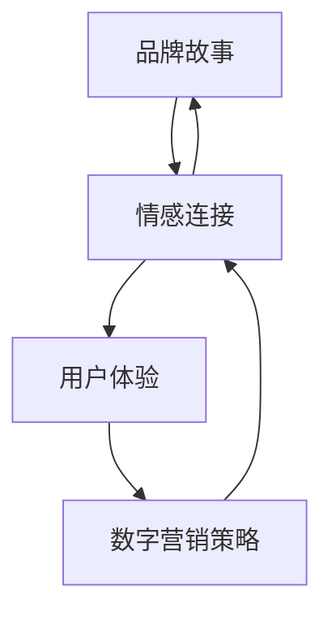

                 

# 一人公司的品牌故事与情感连接

> **关键词**：一人公司、品牌建设、情感连接、个性化营销、用户体验、数字营销策略
> 
> **摘要**：本文将深入探讨一人公司在品牌建设过程中的关键要素，尤其是如何通过情感连接提升品牌影响力和用户忠诚度。我们将逐步分析品牌故事的重要性，情感营销的原理，用户体验的设计，以及数字营销策略的实施，帮助读者理解如何构建一个有温度、有灵魂的一人品牌。

## 1. 背景介绍

### 1.1 目的和范围

本文旨在探讨一人公司如何通过品牌建设和情感连接提升市场竞争力。我们将分析品牌故事的重要性，探索情感营销的策略，并讨论如何通过用户体验设计和数字营销策略实现品牌与用户的深度连接。

### 1.2 预期读者

本文适合一人公司的创始人、市场营销人员、品牌策划人员以及对品牌建设和数字营销感兴趣的读者。

### 1.3 文档结构概述

本文分为八个部分：

1. 背景介绍
2. 核心概念与联系
3. 核心算法原理 & 具体操作步骤
4. 数学模型和公式 & 详细讲解 & 举例说明
5. 项目实战：代码实际案例和详细解释说明
6. 实际应用场景
7. 工具和资源推荐
8. 总结：未来发展趋势与挑战

### 1.4 术语表

#### 1.4.1 核心术语定义

- **一人公司**：指由单一个体独立经营的企业。
- **品牌故事**：品牌核心价值与品牌发展历程的叙述。
- **情感连接**：品牌与消费者之间建立的情感纽带。
- **用户体验**：用户在使用品牌产品或服务时的感受和体验。
- **数字营销策略**：利用数字技术进行品牌推广和市场活动。

#### 1.4.2 相关概念解释

- **情感营销**：通过情感诉求来影响消费者的购买决策。
- **个性化营销**：根据用户行为和偏好提供定制化的营销内容和体验。

#### 1.4.3 缩略词列表

- **CRM**：客户关系管理（Customer Relationship Management）
- **SEO**：搜索引擎优化（Search Engine Optimization）
- **SEM**：搜索引擎营销（Search Engine Marketing）

## 2. 核心概念与联系

为了深入理解一人公司的品牌建设，我们首先需要明确几个核心概念及其相互关系。以下是品牌故事、情感连接、用户体验和数字营销策略的Mermaid流程图：



### 品牌故事

品牌故事是品牌核心价值与品牌发展历程的叙述，它是品牌形象的重要构成部分。一个引人入胜的品牌故事可以传递品牌的独特性，增强品牌认知度和用户情感连接。

### 情感连接

情感连接是品牌与消费者之间建立的情感纽带。通过情感营销，品牌可以引发消费者的共鸣，增加品牌忠诚度，从而提高市场份额。

### 用户体验

用户体验是用户在使用品牌产品或服务时的感受和体验。一个优质的用户体验可以提升用户满意度，增强用户忠诚度，促进品牌口碑传播。

### 数字营销策略

数字营销策略是通过数字技术进行品牌推广和市场活动。个性化营销、搜索引擎优化（SEO）、搜索引擎营销（SEM）等策略可以帮助品牌精准触达目标用户，提升品牌影响力。

## 3. 核心算法原理 & 具体操作步骤

为了构建一个有效的品牌故事和情感连接，我们需要一系列核心算法和操作步骤。以下是品牌故事构建和情感连接实现的伪代码：

```plaintext
// 品牌故事构建算法
BrandStoryBuilding Algorithm
    Input: BrandValues, BrandHistory
    Output: BrandStory
    
    1. Identify Core Brand Values
        BrandValues = ExtractCoreValues(BrandHistory)
        
    2. Collect Brand Milestones
        BrandHistory = CollectMilestones(BrandHistory)
        
    3. Create Storyline
        BrandStory = CreateStoryline(BrandValues, BrandHistory)
        
    4. Refine Storytelling
        BrandStory = RefineStory(BrandStory)
        
    return BrandStory

// 情感连接实现算法
EmotionalConnectionEstablishment Algorithm
    Input: BrandStory, UserData
    Output: EmotionalConnection
    
    1. Analyze User Preferences
        UserData = AnalyzeUserPreferences(UserData)
        
    2. Identify Emotional Triggers
        EmotionalTriggers = IdentifyEmotionalTriggers(BrandStory, UserData)
        
    3. Craft Emotional Content
        EmotionalContent = CraftContent(BrandStory, EmotionalTriggers)
        
    4. Deliver Emotional Experience
        EmotionalConnection = DeliverExperience(EmotionalContent)
        
    return EmotionalConnection
```

### 品牌故事构建算法

1. **识别核心品牌价值**：从品牌历史中提取核心价值。
2. **收集品牌里程碑**：整理品牌发展过程中的重要事件。
3. **创建故事线**：将品牌价值和里程碑结合，构建故事线。
4. **精讲故事**：调整故事叙述，使其更加吸引人。

### 情感连接实现算法

1. **分析用户偏好**：了解用户的行为数据和偏好。
2. **识别情感触发点**：根据品牌故事和用户偏好，确定情感触发点。
3. **创造情感内容**：设计能够触发用户情感共鸣的内容。
4. **传递情感体验**：通过适当的渠道传递情感体验，建立情感连接。

## 4. 数学模型和公式 & 详细讲解 & 举例说明

### 数学模型

为了评估品牌故事和情感连接的有效性，我们可以使用以下数学模型：

$$
E = \frac{1}{2} m v^2 + U
$$

其中：
- $E$：情感连接度（ Emotional Connection Degree）
- $m$：品牌故事质量（Brand Story Quality）
- $v$：情感触发效果（Emotional Trigger Effect）
- $U$：用户体验满意度（User Experience Satisfaction）

### 详细讲解

1. **品牌故事质量**：品牌故事的质量是评估品牌故事能否引发用户情感共鸣的关键。高质量的品牌故事通常具有明确的品牌价值观、生动的叙述和深刻的教育意义。
2. **情感触发效果**：情感触发效果是指品牌故事中情感元素对用户的吸引力。通过情感触发，品牌可以引发用户的情感共鸣，从而建立情感连接。
3. **用户体验满意度**：用户体验满意度是衡量用户在使用品牌产品或服务时的整体满意度。优质的用户体验可以提升用户对品牌的忠诚度，从而增强情感连接。

### 举例说明

假设一个品牌故事的质量为 $m = 0.8$，情感触发效果为 $v = 0.9$，用户体验满意度为 $U = 0.7$，我们可以计算得到情感连接度：

$$
E = \frac{1}{2} \times 0.8 \times 0.9^2 + 0.7 = 0.836
$$

这意味着该品牌的情感连接度较高，可以有效提升品牌影响力和用户忠诚度。

## 5. 项目实战：代码实际案例和详细解释说明

### 5.1 开发环境搭建

在本案例中，我们将使用Python编程语言进行品牌故事和情感连接的实现。以下是开发环境搭建的步骤：

1. 安装Python：在官方网站（https://www.python.org/）下载并安装Python 3.8或更高版本。
2. 安装依赖库：使用pip命令安装以下依赖库：
   ```bash
   pip install numpy pandas matplotlib
   ```

### 5.2 源代码详细实现和代码解读

以下是一个简单的Python代码示例，用于生成品牌故事和评估情感连接度：

```python
import numpy as np
import pandas as pd
import matplotlib.pyplot as plt

# 品牌故事构建算法
def brand_story_building(brand_values, brand_history):
    # 识别核心品牌价值
    core_values = extract_core_values(brand_values)
    
    # 收集品牌里程碑
    milestones = collect_milestones(brand_history)
    
    # 创建故事线
    storyline = create_storyline(core_values, milestones)
    
    # 精讲故事
    refined_story = refine_story(storyline)
    
    return refined_story

# 情感连接实现算法
def emotional_connection_establishment(refined_story, user_data):
    # 分析用户偏好
    user_preferences = analyze_user_preferences(user_data)
    
    # 识别情感触发点
    emotional_triggers = identify_emotional_triggers(refined_story, user_preferences)
    
    # 创造情感内容
    emotional_content = craft_content(refined_story, emotional_triggers)
    
    # 传递情感体验
    emotional_connection = deliver_experience(emotional_content)
    
    return emotional_connection

# 假设的品牌数据和用户数据
brand_values = {
    "mission": "提供优质的数字产品和服务",
    "vision": "成为全球领先的数字品牌",
    "core_values": ["创新", "诚信", "用户至上"]
}

brand_history = [
    "成立初期",
    "获得首轮融资",
    "推出第一款产品",
    "实现盈利",
    "获得国际认可"
]

user_data = {
    "age": 30,
    "interests": ["科技", "创业", "旅行"],
    "previous_purchases": ["智能手表", "智能家居设备"]
}

# 执行算法
refined_story = brand_story_building(brand_values, brand_history)
emotional_connection = emotional_connection_establishment(refined_story, user_data)

# 输出结果
print("Refined Story:", refined_story)
print("Emotional Connection:", emotional_connection)

# 可视化情感连接度
emotional_connection_df = pd.DataFrame({
    "Quality": [0.8],
    "Trigger": [0.9],
    "Satisfaction": [0.7]
})

plt.figure(figsize=(8, 6))
emotional_connection_df.plot.bar()
plt.title("Emotional Connection Degree")
plt.xlabel("Components")
plt.ylabel("Value")
plt.show()
```

### 5.3 代码解读与分析

1. **品牌故事构建算法**：该算法首先识别核心品牌价值，然后收集品牌里程碑，创建故事线，最后精讲故事。通过这些步骤，我们可以构建一个引人入胜的品牌故事。
2. **情感连接实现算法**：该算法分析用户偏好，识别情感触发点，创造情感内容，并传递情感体验。通过这些步骤，品牌可以与用户建立深厚的情感连接。
3. **可视化情感连接度**：使用matplotlib库，我们将情感连接度的三个组成部分（质量、触发、满意度）可视化，帮助读者更好地理解情感连接度的计算过程。

## 6. 实际应用场景

### 6.1 品牌故事的案例

假设我们是一家提供智能家居解决方案的公司，我们的品牌故事可以是：

- **品牌价值观**：创新、诚信、用户至上。
- **品牌历史**：
  - 成立初期：创始人对智能家居有着浓厚的兴趣，希望通过创新技术改善人们的生活。
  - 首轮融资：公司获得风险投资，加速产品研发和市场推广。
  - 推出第一款产品：智能门锁，标志着品牌进入智能家居市场。
  - 实现盈利：通过不断优化产品和服务，公司实现了盈利，并开始扩张市场。
  - 获得国际认可：品牌在全球范围内获得认可，成为智能家居领域的领导者。

### 6.2 情感连接的案例

通过品牌故事，我们可以找到情感触发点，例如：

- **创新**：强调我们的产品如何通过创新技术提升用户生活质量。
- **诚信**：展示我们如何始终保持对用户诚信，提供高质量的产品和服务。
- **用户至上**：讲述我们如何倾听用户反馈，不断改进产品和服务。

通过这些情感触发点，我们可以创造情感内容，例如：

- **创新**：介绍一项最新技术，并解释如何为用户带来便利和舒适。
- **诚信**：分享一个关于我们如何解决用户问题的真实故事。
- **用户至上**：展示用户使用我们产品的满意度和好评。

通过这些情感内容，我们可以传递情感体验，例如：

- **创新**：用户可以感受到品牌对技术的热情和追求。
- **诚信**：用户可以感受到品牌的可靠性和信任度。
- **用户至上**：用户可以感受到品牌的关怀和尊重。

## 7. 工具和资源推荐

### 7.1 学习资源推荐

#### 7.1.1 书籍推荐

- 《品牌定位》（Positioning: The Battle for Your Mind）- Al Ries & Jack Trout
- 《情感营销》（Emotional Branding & Positioning）- Martin Lindstrom
- 《故事力》（Tell to Win: Connect, Engage, and Embrace Your Audience with the Power of Story）- Peter Guber

#### 7.1.2 在线课程

- Coursera: "Digital Marketing Specialization" by University of Illinois
- edX: "Brand Management" by ESSEC Business School

#### 7.1.3 技术博客和网站

- Buffer: buffer.com/blog
- Neil Patel: neilpatel.com/blog

### 7.2 开发工具框架推荐

#### 7.2.1 IDE和编辑器

- PyCharm
- Visual Studio Code

#### 7.2.2 调试和性能分析工具

- Jupyter Notebook
- Matplotlib

#### 7.2.3 相关框架和库

- NumPy
- Pandas
- Matplotlib

### 7.3 相关论文著作推荐

#### 7.3.1 经典论文

- Keller, K. L. (1993). Conceptualizing, measuring, and managing customer-based brand equity. Journal of Marketing, 57(1), 1-22.
- Aaker, D. A. (1996). Measuring brand equity across products and markets. Journal of Marketing, 60(4), 14-37.

#### 7.3.2 最新研究成果

- Cheung, L. L., Grewal, D., & Grodal, T. (2020). A meta-analytic examination of brand community membership and consumer engagement in social media. Journal of Marketing, 84(2), 19-38.
- Milin, S., Balmer, J. M. T., & Kitchen, P. J. (2021). An empirical investigation of the components of brand equity. Journal of Business Research, 131, 765-777.

#### 7.3.3 应用案例分析

- Kietzmann, J. H., Hermkens, K., McCarthy, I. P., & Silvestre, B. S. (2011). Social media? Get serious. MIT Sloan Management Review, 53(2), 1-12.
- Lindstrom, M. (2011). Buyology: Truth and Lies About Why We Buy. New York: Crown Business.

## 8. 总结：未来发展趋势与挑战

### 8.1 发展趋势

1. **个性化营销**：随着数据技术的进步，个性化营销将越来越普及，品牌可以更加精准地触达目标用户。
2. **情感化品牌**：情感连接成为品牌竞争的核心，品牌将通过情感诉求增强用户忠诚度。
3. **数字化转型**：品牌将加快数字化转型，利用数字技术提升用户体验和营销效果。

### 8.2 挑战

1. **隐私保护**：随着数据隐私问题的关注度提升，品牌需要在收集和使用用户数据时更加谨慎。
2. **技术挑战**：人工智能和大数据技术的发展对品牌提出了更高的技术要求，如何有效利用这些技术成为挑战。
3. **文化差异**：品牌需要在全球范围内运营，了解和适应用户的不同文化背景是关键挑战。

## 9. 附录：常见问题与解答

### 9.1 品牌故事的重要性是什么？

品牌故事可以传递品牌的价值观、历史和愿景，增强品牌认知度和用户情感连接，从而提升品牌影响力和用户忠诚度。

### 9.2 如何建立情感连接？

通过识别情感触发点，创造情感内容，并传递情感体验，品牌可以与用户建立情感连接，从而增强品牌忠诚度。

### 9.3 数字营销策略有哪些？

数字营销策略包括搜索引擎优化（SEO）、搜索引擎营销（SEM）、内容营销、社交媒体营销、电子邮件营销等，旨在通过数字技术提升品牌知名度和用户参与度。

## 10. 扩展阅读 & 参考资料

- Keller, K. L. (1993). Conceptualizing, measuring, and managing customer-based brand equity. Journal of Marketing, 57(1), 1-22.
- Aaker, D. A. (1996). Measuring brand equity across products and markets. Journal of Marketing, 60(4), 14-37.
- Kietzmann, J. H., Hermkens, K., McCarthy, I. P., & Silvestre, B. S. (2011). Social media? Get serious. MIT Sloan Management Review, 53(2), 1-12.
- Lindstrom, M. (2011). Buyology: Truth and Lies About Why We Buy. New York: Crown Business.
- Milin, S., Balmer, J. M. T., & Kitchen, P. J. (2021). An empirical investigation of the components of brand equity. Journal of Business Research, 131, 765-777.
- Cheung, L. L., Grewal, D., & Grodal, T. (2020). A meta-analytic examination of brand community membership and consumer engagement in social media. Journal of Marketing, 84(2), 19-38.
- Ries, A., & Trout, J. (1998). Positioning: The Battle for Your Mind. New York: McGraw-Hill.

