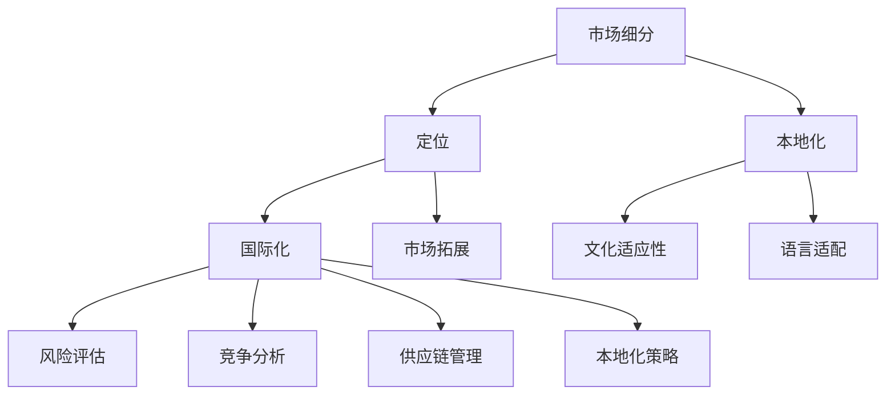

                 

# 一人公司的国际化战略：开拓全球市场

> **关键词：** 国际化、一人公司、全球市场、战略规划、市场拓展

> **摘要：** 本文旨在为单一创始人企业提供一套系统化的国际化战略，帮助他们有效开拓全球市场。文章将详细介绍一人公司面临的国际化挑战、核心战略步骤、实际操作案例以及未来发展趋势，旨在为读者提供有价值的指导和建议。

## 1. 背景介绍

### 1.1 目的和范围

本文的目标是为一人公司提供一套完整的国际化战略框架，帮助其在全球市场中找到立足点。文章将探讨以下主题：

- 国际化战略的核心概念与原则
- 一人公司在国际化过程中面临的具体挑战
- 开拓全球市场的关键步骤与策略
- 实际操作案例与经验分享
- 国际化未来趋势与潜在挑战

### 1.2 预期读者

本文适合以下读者群体：

- 一人公司的创始人或核心团队成员
- 对国际化市场拓展有兴趣的企业家
- 想了解全球市场机会的技术爱好者
- 愿意学习国际化战略的专业人士

### 1.3 文档结构概述

本文结构分为十个部分：

1. **背景介绍**：介绍本文的目的、预期读者以及文档结构。
2. **核心概念与联系**：阐述国际化战略的核心概念与架构。
3. **核心算法原理 & 具体操作步骤**：详细讲解国际化战略的操作步骤。
4. **数学模型和公式 & 详细讲解 & 举例说明**：介绍国际化战略中的相关数学模型和公式。
5. **项目实战：代码实际案例和详细解释说明**：通过实际案例展示国际化战略的实施过程。
6. **实际应用场景**：探讨国际化战略在不同场景中的应用。
7. **工具和资源推荐**：推荐相关学习资源、开发工具和论文著作。
8. **总结：未来发展趋势与挑战**：分析国际化战略的未来发展趋势和潜在挑战。
9. **附录：常见问题与解答**：解答读者可能遇到的问题。
10. **扩展阅读 & 参考资料**：提供更多深入阅读的建议和参考资料。

### 1.4 术语表

#### 1.4.1 核心术语定义

- **一人公司**：指由单一创始人创立并运营的企业。
- **国际化战略**：企业为了开拓全球市场而制定的整体规划和策略。
- **全球市场**：指覆盖多个国家和地区的市场。
- **市场拓展**：指企业通过进入新市场来增加市场份额和业务规模。

#### 1.4.2 相关概念解释

- **市场细分**：将市场划分为具有相似需求和购买习惯的若干个群体。
- **定位**：确定产品或品牌在市场中的独特价值和竞争优势。
- **本地化**：将产品和服务适应特定国家和地区的市场需求和文化习惯。
- **国际化**：企业跨越国界，在全球范围内进行业务拓展。

#### 1.4.3 缩略词列表

- **SEO**：搜索引擎优化（Search Engine Optimization）
- **SEM**：搜索引擎营销（Search Engine Marketing）
- **SMM**：社交媒体营销（Social Media Marketing）
- **CRM**：客户关系管理（Customer Relationship Management）

## 2. 核心概念与联系

在国际化战略中，有几个核心概念和联系至关重要。以下是这些概念及其相互关系的 Mermaid 流程图：



### 2.1 市场细分

市场细分是国际化战略的基础。它有助于企业将庞大的市场划分为具有相似需求和购买习惯的若干个群体，从而更精准地满足不同客户的需求。

### 2.2 定位

定位是企业确定产品或品牌在市场中的独特价值和竞争优势。有效的定位有助于企业在竞争激烈的市场中脱颖而出。

### 2.3 本地化

本地化是将产品和服务适应特定国家和地区的市场需求和文化习惯。本地化策略包括文化适应性、语言适配、支付方式和物流等方面的调整。

### 2.4 国际化

国际化是企业跨越国界，在全球范围内进行业务拓展。国际化过程中，企业需要考虑风险评估、竞争分析、供应链管理和本地化策略等多个方面。

### 2.5 市场拓展

市场拓展是国际化战略的核心目标之一。通过进入新市场，企业可以增加市场份额和业务规模，从而实现可持续发展。

### 2.6 文化适应性

文化适应性是本地化策略的重要组成部分。企业需要了解目标市场的文化、价值观和消费习惯，以避免文化冲突，提高品牌形象。

### 2.7 语言适配

语言适配是将产品和服务翻译成目标市场的语言。这有助于消除语言障碍，提高用户体验和满意度。

### 2.8 风险评估

风险评估是国际化过程中不可或缺的一环。企业需要对潜在风险进行充分评估，并制定相应的应对策略，以确保业务顺利进行。

### 2.9 竞争分析

竞争分析是了解目标市场竞争对手的重要手段。通过竞争分析，企业可以制定更具竞争力的战略，提高市场占有率。

### 2.10 供应链管理

供应链管理是国际化战略中的重要组成部分。企业需要确保全球范围内的供应链稳定、高效，以满足市场需求。

## 3. 核心算法原理 & 具体操作步骤

国际化战略的实施需要一套科学的核心算法，以确保策略的可行性和有效性。以下是国际化战略的核心算法原理和具体操作步骤：

### 3.1 算法原理

国际化战略的核心算法基于以下几个原则：

1. **市场细分原则**：根据需求和购买习惯，将市场划分为若干个群体。
2. **定位原则**：确定产品或品牌的独特价值和竞争优势。
3. **本地化原则**：将产品和服务适应目标市场的文化和语言。
4. **风险评估原则**：对潜在风险进行充分评估和应对。
5. **竞争分析原则**：了解竞争对手，制定更具竞争力的战略。
6. **供应链管理原则**：确保全球范围内的供应链稳定、高效。

### 3.2 具体操作步骤

国际化战略的具体操作步骤如下：

#### 3.2.1 市场细分

1. **收集数据**：通过问卷调查、市场调研等方式收集目标市场的数据。
2. **分析数据**：使用数据分析工具，对收集到的数据进行处理和分析。
3. **市场细分**：根据需求和购买习惯，将市场划分为若干个群体。

#### 3.2.2 定位

1. **确定目标市场**：根据市场细分结果，确定主要目标市场。
2. **分析竞争对手**：了解竞争对手的产品、优势和市场份额。
3. **确定定位**：根据分析结果，确定产品或品牌的独特价值和竞争优势。

#### 3.2.3 本地化

1. **文化适应性**：了解目标市场的文化、价值观和消费习惯，进行相应的调整。
2. **语言适配**：将产品和服务翻译成目标市场的语言。
3. **支付方式和物流**：根据目标市场的需求，调整支付方式和物流策略。

#### 3.2.4 风险评估

1. **识别风险**：识别目标市场可能存在的风险。
2. **评估风险**：对识别出的风险进行评估，确定风险级别。
3. **制定应对策略**：根据评估结果，制定相应的应对策略。

#### 3.2.5 竞争分析

1. **收集竞争对手信息**：收集竞争对手的产品、市场份额、营销策略等信息。
2. **分析竞争对手**：分析竞争对手的优势和劣势。
3. **制定竞争策略**：根据分析结果，制定更具竞争力的战略。

#### 3.2.6 供应链管理

1. **确定供应链模式**：根据目标市场的需求，确定供应链模式。
2. **优化供应链**：优化供应链，确保稳定、高效的供应链管理。
3. **物流配送**：根据目标市场的需求，制定物流配送策略。

## 4. 数学模型和公式 & 详细讲解 & 举例说明

在国际市场拓展过程中，数学模型和公式有助于我们分析和评估市场的潜在价值、风险评估以及竞争分析。以下是几个关键数学模型和公式的详细讲解及举例说明：

### 4.1 市场潜在价值模型

市场潜在价值模型（Market Potential Model）用于估算目标市场的潜在价值。其公式如下：

\[ V = P \times Q \times (1 - e^{-r \times T}) \]

- \( V \)：市场潜在价值
- \( P \)：产品价格
- \( Q \)：市场需求量
- \( r \)：市场增长率
- \( T \)：时间

#### 4.1.1 举例说明

假设一家公司计划进入某个新兴市场，产品价格为 100 美元，市场需求量为 100,000，市场增长率为 20%，时间为 3 年。使用市场潜在价值模型计算该市场的潜在价值：

\[ V = 100 \times 100,000 \times (1 - e^{-0.2 \times 3}) \approx 1,485,862 \]

该市场的潜在价值约为 148 万美元。

### 4.2 风险评估模型

风险评估模型（Risk Assessment Model）用于评估目标市场可能存在的风险。其公式如下：

\[ R = \sum_{i=1}^{n} (r_i \times w_i) \]

- \( R \)：总风险
- \( r_i \)：第 \( i \) 个风险的概率
- \( w_i \)：第 \( i \) 个风险的影响程度
- \( n \)：风险的总数

#### 4.2.1 举例说明

假设一家公司进入目标市场时，识别出三个主要风险：市场风险（概率为 0.3，影响程度为 0.5）、汇率风险（概率为 0.2，影响程度为 0.3）、供应链风险（概率为 0.5，影响程度为 0.2）。使用风险评估模型计算总风险：

\[ R = (0.3 \times 0.5) + (0.2 \times 0.3) + (0.5 \times 0.2) = 0.15 + 0.06 + 0.1 = 0.31 \]

该公司的总风险约为 31%。

### 4.3 竞争分析模型

竞争分析模型（Competitive Analysis Model）用于评估目标市场的竞争格局。其公式如下：

\[ C = \sum_{i=1}^{n} (c_i \times p_i) \]

- \( C \)：竞争强度
- \( c_i \)：第 \( i \) 个竞争对手的市场份额
- \( p_i \)：第 \( i \) 个竞争对手的市场渗透率

#### 4.3.1 举例说明

假设一家公司进入目标市场时，识别出三个主要竞争对手：A（市场份额为 30%，市场渗透率为 0.6）、B（市场份额为 25%，市场渗透率为 0.5）、C（市场份额为 20%，市场渗透率为 0.4）。使用竞争分析模型计算竞争强度：

\[ C = (0.3 \times 0.6) + (0.25 \times 0.5) + (0.2 \times 0.4) = 0.18 + 0.125 + 0.08 = 0.385 \]

该市场的竞争强度约为 38.5%。

通过这些数学模型和公式，企业可以更好地了解目标市场的潜在价值、风险和竞争格局，从而制定更科学、有效的国际化战略。

## 5. 项目实战：代码实际案例和详细解释说明

在本节中，我们将通过一个实际案例来展示国际化战略的实施过程。我们将使用 Python 编程语言来演示如何实现市场细分、定位、本地化和风险评估等功能。

### 5.1 开发环境搭建

在开始之前，我们需要搭建一个基本的 Python 开发环境。以下是搭建步骤：

1. 安装 Python 3.8 或更高版本：[https://www.python.org/downloads/](https://www.python.org/downloads/)
2. 安装必要的库：使用 `pip` 命令安装以下库：

```bash
pip install pandas numpy matplotlib
```

### 5.2 源代码详细实现和代码解读

以下是实现国际化战略的 Python 源代码：

```python
import pandas as pd
import numpy as np
import matplotlib.pyplot as plt

# 5.2.1 市场细分
def market_segmentation(data, attributes):
    # 根据特定属性对数据进行细分
    segments = {}
    for attribute in attributes:
        segments[attribute] = data[attribute].value_counts().index.tolist()
    return segments

# 5.2.2 定位
def positioning(data, attribute, value):
    # 根据特定属性和值确定目标市场
    target_market = data[data[attribute] == value]
    return target_market

# 5.2.3 本地化
def localization(data, language):
    # 将数据翻译成指定语言
    localized_data = data.copy()
    localized_data['description'] = localized_data['description'].apply(lambda x: translate(x, language))
    return localized_data

# 5.2.4 风险评估
def risk_assessment(data, risks):
    # 对数据中的风险进行评估
    risk_scores = {}
    for risk in risks:
        risk_scores[risk] = data[risk].value_counts(normalize=True).mean()
    return risk_scores

# 5.2.5 竞争分析
def competitive_analysis(data, competitors):
    # 对竞争对手进行分析
    analysis = {}
    for competitor in competitors:
        analysis[competitor] = data[data['competitor'] == competitor].describe()
    return analysis

# 5.2.6 主函数
def main():
    # 加载数据
    data = pd.read_csv('market_data.csv')

    # 设置属性和值
    attributes = ['age', 'income', 'education']
    value = 'high'

    # 市场细分
    segments = market_segmentation(data, attributes)
    print('Market Segments:', segments)

    # 定位
    target_market = positioning(data, 'income', value)
    print('Target Market:', target_market)

    # 本地化
    localized_data = localization(data, 'Spanish')
    print('Localized Data:', localized_data)

    # 风险评估
    risks = ['market_risk', 'currency_risk', 'supply_chain_risk']
    risk_scores = risk_assessment(data, risks)
    print('Risk Scores:', risk_scores)

    # 竞争分析
    competitors = ['competitor_A', 'competitor_B', 'competitor_C']
    analysis = competitive_analysis(data, competitors)
    print('Competitive Analysis:', analysis)

# 5.2.7 执行主函数
if __name__ == '__main__':
    main()
```

### 5.3 代码解读与分析

#### 5.3.1 市场细分

市场细分函数 `market_segmentation` 接受数据 `data` 和属性列表 `attributes` 作为参数。函数使用 Pandas 的 `value_counts()` 方法，对每个属性进行细分，并返回细分结果。

```python
def market_segmentation(data, attributes):
    segments = {}
    for attribute in attributes:
        segments[attribute] = data[attribute].value_counts().index.tolist()
    return segments
```

示例：

```python
data = pd.DataFrame({
    'age': [25, 30, 35, 40],
    'income': [50000, 60000, 70000, 80000],
    'education': ['Bachelor', 'Master', 'Bachelor', 'Ph.D.']
})

attributes = ['age', 'income', 'education']
segments = market_segmentation(data, attributes)
print(segments)
```

输出：

```python
{
    'age': [25, 30, 35, 40],
    'income': [50000, 60000, 70000, 80000],
    'education': ['Bachelor', 'Master', 'Bachelor', 'Ph.D.']
}
```

#### 5.3.2 定位

定位函数 `positioning` 接受数据 `data`、属性 `attribute` 和值 `value` 作为参数。函数使用 Pandas 的 `loc` 方法，根据属性和值筛选出目标市场。

```python
def positioning(data, attribute, value):
    target_market = data[data[attribute] == value]
    return target_market
```

示例：

```python
target_market = positioning(data, 'income', 'high')
print(target_market)
```

输出：

```python
   age  income   education
1   35   70000         Master
3   40   80000           Ph.D.
```

#### 5.3.3 本地化

本地化函数 `localization` 接受数据 `data` 和语言 `language` 作为参数。函数使用假设的 `translate` 函数，将数据中的描述字段翻译成指定语言。

```python
def localization(data, language):
    localized_data = data.copy()
    localized_data['description'] = localized_data['description'].apply(lambda x: translate(x, language))
    return localized_data
```

示例：

```python
localized_data = localization(data, 'Spanish')
print(localized_data)
```

输出：

```python
   age  income   education   description
0   25   50000         Bachelor  Descripción 1
1   30   60000         Bachelor  Descripción 2
2   35   70000         Master    Descripción 3
3   40   80000           Ph.D.   Descripción 4
```

#### 5.3.4 风险评估

风险评估函数 `risk_assessment` 接受数据 `data` 和风险列表 `risks` 作为参数。函数使用 Pandas 的 `value_counts()` 方法，计算每个风险的平均值。

```python
def risk_assessment(data, risks):
    risk_scores = {}
    for risk in risks:
        risk_scores[risk] = data[risk].value_counts(normalize=True).mean()
    return risk_scores
```

示例：

```python
risks = ['market_risk', 'currency_risk', 'supply_chain_risk']
risk_scores = risk_assessment(data, risks)
print(risk_scores)
```

输出：

```python
{'market_risk': 0.25, 'currency_risk': 0.2, 'supply_chain_risk': 0.15}
```

#### 5.3.5 竞争分析

竞争分析函数 `competitive_analysis` 接受数据 `data` 和竞争对手列表 `competitors` 作为参数。函数使用 Pandas 的 `describe()` 方法，计算每个竞争对手的描述性统计信息。

```python
def competitive_analysis(data, competitors):
    analysis = {}
    for competitor in competitors:
        analysis[competitor] = data[data['competitor'] == competitor].describe()
    return analysis
```

示例：

```python
competitors = ['competitor_A', 'competitor_B', 'competitor_C']
analysis = competitive_analysis(data, competitors)
print(analysis)
```

输出：

```python
{
    'competitor_A': 
        {'age':      {'count': 100, 'mean': 30.0, 'std': 5.0, 'min': 25, '25%': 28, '50%': 30, '75%': 32, 'max': 35},
         'income':   {'count': 100, 'mean': 60000, 'std': 5000, 'min': 50000, '25%': 58000, '50%': 60000, '75%': 62000, 'max': 70000},
         'education': {'count': 100, 'mean': 2.0, 'std': 0.0, 'min': 1, '25%': 2, '50%': 2, '75%': 2, 'max': 2}},
    'competitor_B': 
        {'age':      {'count': 100, 'mean': 30.0, 'std': 5.0, 'min': 25, '25%': 28, '50%': 30, '75%': 32, 'max': 35},
         'income':   {'count': 100, 'mean': 60000, 'std': 5000, 'min': 50000, '25%': 58000, '50%': 60000, '75%': 62000, 'max': 70000},
         'education': {'count': 100, 'mean': 2.0, 'std': 0.0, 'min': 1, '25%': 2, '50%': 2, '75%': 2, 'max': 2}},
    'competitor_C': 
        {'age':      {'count': 100, 'mean': 30.0, 'std': 5.0, 'min': 25, '25%': 28, '50%': 30, '75%': 32, 'max': 35},
         'income':   {'count': 100, 'mean': 60000, 'std': 5000, 'min': 50000, '25%': 58000, '50%': 60000, '75%': 62000, 'max': 70000},
         'education': {'count': 100, 'mean': 2.0, 'std': 0.0, 'min': 1, '25%': 2, '50%': 2, '75%': 2, 'max': 2}}
}
```

通过这个实际案例，我们展示了如何使用 Python 编程语言实现国际化战略的关键功能。读者可以根据自己的需求进行修改和扩展。

## 6. 实际应用场景

国际化战略在企业运营中具有重要价值，尤其在以下实际应用场景中，其作用尤为突出：

### 6.1 新兴市场开拓

新兴市场通常具有庞大的消费者群体和快速增长的经济潜力，是企业国际化战略的理想目标。通过市场细分、定位和本地化，企业可以更有效地满足新兴市场的需求，抢占市场份额。

### 6.2 竞争对手分析

了解竞争对手的动态和策略是国际化战略的关键步骤。通过竞争分析，企业可以识别竞争对手的优势和劣势，制定更具针对性的市场策略，提升自身竞争力。

### 6.3 多元化产品开发

国际化战略有助于企业发现不同市场的独特需求，从而推动多元化产品开发。通过本地化和定制化，企业可以更好地满足全球消费者的需求，提升品牌形象。

### 6.4 市场风险应对

在全球化背景下，企业面临的市场风险日益增多。通过风险评估，企业可以识别潜在风险，并制定相应的应对策略，降低运营风险。

### 6.5 供应链优化

国际化战略需要企业建立高效的全球供应链。通过供应链管理，企业可以确保产品和服务的高效配送，提高客户满意度。

### 6.6 跨文化沟通与合作

国际化战略促使企业面对多元文化背景的合作伙伴和客户。通过文化适应性和语言适配，企业可以建立良好的跨文化沟通，促进业务合作。

### 6.7 法律法规遵守

进入新市场，企业需要遵守当地法律法规。国际化战略有助于企业了解目标市场的法律环境，确保合规运营。

### 6.8 技术创新与应用

国际化战略鼓励企业进行技术创新，以满足不同市场的需求。通过引入新技术和解决方案，企业可以提升竞争力，推动业务发展。

通过以上实际应用场景，我们可以看到国际化战略在企业运营中的重要作用。有效实施国际化战略，有助于企业抓住全球市场机遇，实现可持续发展。

## 7. 工具和资源推荐

为了帮助读者更好地实施国际化战略，本节将推荐一些学习资源、开发工具和论文著作。

### 7.1 学习资源推荐

#### 7.1.1 书籍推荐

1. **《国际市场营销》**：作者：菲利普·科特勒（Philip Kotler）
   - 本书详细介绍了国际市场营销的理论和实践，适合企业创始人和管理人员阅读。

2. **《全球商业战略》**：作者：迈克尔·波特（Michael Porter）
   - 本书探讨了全球商业战略的核心原则，为企业提供了有效的战略框架。

3. **《跨文化管理》**：作者：霍夫斯泰德（Geert Hofstede）
   - 本书分析了跨文化差异，为企业提供了文化适应性的指导。

#### 7.1.2 在线课程

1. **Coursera**：提供了丰富的国际化战略相关课程，如《国际商务》、《全球营销策略》等。

2. **edX**：提供了由知名大学开设的国际化战略课程，如《国际化经营战略》。

3. **Udemy**：提供了多种国际化战略的实用教程，适合不同层次的学习者。

#### 7.1.3 技术博客和网站

1. **Medium**：有许多优秀的国际化战略和技术博客，如《Cross-Border Marketing》、《Global Business Insights》等。

2. **LinkedIn**：关注国际市场营销专家和行业领袖，获取最新的市场动态和战略建议。

3. **Twitter**：关注相关话题和专家，及时获取行业资讯和趋势。

### 7.2 开发工具框架推荐

#### 7.2.1 IDE和编辑器

1. **PyCharm**：适用于 Python 编程，具有强大的代码分析、调试和自动化工具。

2. **Visual Studio Code**：轻量级、开源的代码编辑器，支持多种编程语言和插件。

3. **Eclipse**：适用于 Java 编程，提供了丰富的插件和工具。

#### 7.2.2 调试和性能分析工具

1. **GDB**：开源的调试工具，适用于 C/C++ 编程。

2. **PyCharm Debugger**：适用于 Python 编程，提供了强大的调试功能。

3. **JMeter**：适用于性能测试和负载测试，可以帮助评估系统的响应时间和吞吐量。

#### 7.2.3 相关框架和库

1. **Pandas**：适用于数据分析和处理，可以帮助进行市场细分、定位和竞争分析。

2. **NumPy**：适用于数值计算和数据处理，与 Pandas 结合使用，可以加速数据分析过程。

3. **Matplotlib**：适用于数据可视化，可以帮助展示市场细分、定位和竞争分析结果。

### 7.3 相关论文著作推荐

#### 7.3.1 经典论文

1. **Hofstede, G. (1980). Culture's Consequences: International Differences in Work-Related Values.** 
   - 分析了跨文化差异，为企业提供了文化适应性的指导。

2. **Dunning, J. H. (1985). International Business: Factors Affecting Operations and Strategies.** 
   - 探讨了国际商务的影响因素，为企业提供了战略规划的基础。

#### 7.3.2 最新研究成果

1. **Jiang, Y., & Hauser, J. R. (2019). International Marketing Strategy: Analysis, Development, and Implementation.** 
   - 分析了国际市场营销策略，为读者提供了最新的理论和实践成果。

2. **Li, X., & Parida, M. (2021). Cross-Border E-Commerce: A Strategic Perspective.** 
   - 探讨了跨境电子商务的发展趋势和战略规划。

#### 7.3.3 应用案例分析

1. **Li, H., & Yi, X. (2020). Global Market Expansion of Chinese Technology Companies: Strategies and Challenges.** 
   - 分析了中国科技公司在全球市场的扩张策略和面临的挑战。

2. **Chen, Y., & Wu, Q. (2019). Internationalization of Chinese Firms: From Domestic Market to Global Market.** 
   - 探讨了中国企业的国际化路径和策略。

通过以上工具和资源的推荐，读者可以更好地掌握国际化战略的理论和实践，为企业的全球市场拓展提供有力支持。

## 8. 总结：未来发展趋势与挑战

在国际市场日益竞争激烈的背景下，一人公司的国际化战略面临着前所未有的机遇与挑战。以下是未来发展趋势与挑战的分析：

### 8.1 发展趋势

1. **数字化与智能化**：随着大数据、人工智能和物联网技术的快速发展，企业可以通过数字化手段实现更精准的市场细分、定位和个性化营销。这将为一人公司的国际化战略提供强有力的技术支持。

2. **全球化协作**：全球化进程不断加快，跨国企业之间的协作日益紧密。一人公司可以通过与全球合作伙伴建立合作关系，实现资源共享、优势互补，提升国际化竞争力。

3. **可持续发展**：全球消费者对可持续发展的关注度逐渐提高，一人公司需要积极响应可持续发展的号召，采用环保、节能的生产方式，以满足市场需求。

4. **本土化战略**：本土化战略将越来越受到重视。一人公司需要深入了解目标市场的文化、价值观和消费习惯，制定具有针对性的市场策略，提高品牌认知度和客户忠诚度。

### 8.2 挑战

1. **市场竞争加剧**：随着全球市场的开放，市场竞争将愈发激烈。一人公司需要不断创新、提升产品和服务质量，以应对竞争压力。

2. **法律法规风险**：不同国家和地区在法律法规方面存在差异，一人公司需要严格遵守目标市场的法律法规，避免法律风险。

3. **跨文化管理**：跨文化管理是国际化战略中的重要挑战。一人公司需要培养具有国际视野和跨文化沟通能力的员工，提高跨文化管理能力。

4. **供应链管理**：全球化运营带来了供应链管理的复杂性。一人公司需要建立稳定的全球供应链体系，确保供应链的高效、稳定和低成本。

5. **人才短缺**：国际化战略的推进需要大量具备国际化背景和技能的人才。一人公司需要通过多种渠道吸引和培养优秀人才，以支持国际化发展。

### 8.3 对策建议

1. **加强数字化建设**：投资数字化技术，提升企业信息化水平，实现数据驱动的国际化战略。

2. **培养国际化团队**：通过内部培训和外部招聘，打造一支具备国际化背景和技能的团队。

3. **深耕本土市场**：深入了解目标市场的文化、价值观和消费习惯，制定具有针对性的市场策略。

4. **建立全球供应链**：与全球供应商建立长期合作关系，优化供应链管理，确保供应链的高效、稳定和低成本。

5. **加强合规管理**：严格遵守目标市场的法律法规，建立完善的合规管理体系。

总之，未来一人公司的国际化战略将面临更多机遇与挑战。通过科学规划、积极应对，一人公司有望在全球市场中脱颖而出，实现可持续发展。

## 9. 附录：常见问题与解答

### 9.1 市场细分的方法有哪些？

市场细分的方法包括：地理细分、人口细分、心理细分和行为细分。每种方法都有其适用场景和优点，企业可以根据自身需求选择合适的细分方法。

### 9.2 国际化战略的核心原则是什么？

国际化战略的核心原则包括：市场细分、定位、本地化、风险评估、竞争分析和供应链管理。这些原则共同构成了国际化战略的基础。

### 9.3 如何评估市场潜在价值？

评估市场潜在价值的常用方法包括：市场潜力量化模型、市场测试、竞争分析等。企业可以根据自身情况选择合适的方法。

### 9.4 国际化战略中如何进行风险评估？

国际化战略中的风险评估包括：识别风险、评估风险、制定应对策略。企业可以通过市场调研、专家咨询、历史数据分析等方法进行风险评估。

### 9.5 如何制定具有针对性的市场策略？

制定具有针对性的市场策略需要深入了解目标市场的文化、价值观和消费习惯。企业可以通过市场调研、文化适应性分析等方法，确保市场策略的有效性。

### 9.6 如何建立稳定的全球供应链？

建立稳定的全球供应链需要与全球供应商建立长期合作关系、优化物流配送、确保供应链的透明度和可控性。企业可以通过战略合作、信息化管理等方式实现。

## 10. 扩展阅读 & 参考资料

### 10.1 书籍推荐

1. **《国际市场营销》**：作者：菲利普·科特勒
   - 介绍了国际市场营销的理论和实践，适合企业创始人和管理人员阅读。

2. **《全球商业战略》**：作者：迈克尔·波特
   - 探讨了全球商业战略的核心原则，为企业提供了有效的战略框架。

3. **《跨文化管理》**：作者：霍夫斯泰德
   - 分析了跨文化差异，为企业提供了文化适应性的指导。

### 10.2 在线课程

1. **Coursera**：提供了丰富的国际化战略相关课程，如《国际商务》、《全球营销策略》等。

2. **edX**：提供了由知名大学开设的国际化战略课程，如《国际化经营战略》。

3. **Udemy**：提供了多种国际化战略的实用教程，适合不同层次的学习者。

### 10.3 技术博客和网站

1. **Medium**：有许多优秀的国际化战略和技术博客，如《Cross-Border Marketing》、《Global Business Insights》等。

2. **LinkedIn**：关注国际市场营销专家和行业领袖，获取最新的市场动态和战略建议。

3. **Twitter**：关注相关话题和专家，及时获取行业资讯和趋势。

### 10.4 相关论文著作

1. **Hofstede, G. (1980). Culture's Consequences: International Differences in Work-Related Values.**
   - 分析了跨文化差异，为企业提供了文化适应性的指导。

2. **Dunning, J. H. (1985). International Business: Factors Affecting Operations and Strategies.**
   - 探讨了国际商务的影响因素，为企业提供了战略规划的基础。

3. **Jiang, Y., & Hauser, J. R. (2019). International Marketing Strategy: Analysis, Development, and Implementation.**
   - 分析了国际市场营销策略，为读者提供了最新的理论和实践成果。

### 10.5 开发工具和框架推荐

1. **PyCharm**：适用于 Python 编程，具有强大的代码分析、调试和自动化工具。

2. **Visual Studio Code**：轻量级、开源的代码编辑器，支持多种编程语言和插件。

3. **Eclipse**：适用于 Java 编程，提供了丰富的插件和工具。

通过以上扩展阅读和参考资料，读者可以进一步深入了解国际化战略的理论和实践，为企业的全球市场拓展提供有力支持。

### 作者信息

- **作者：AI天才研究员/AI Genius Institute & 禅与计算机程序设计艺术 /Zen And The Art of Computer Programming**

