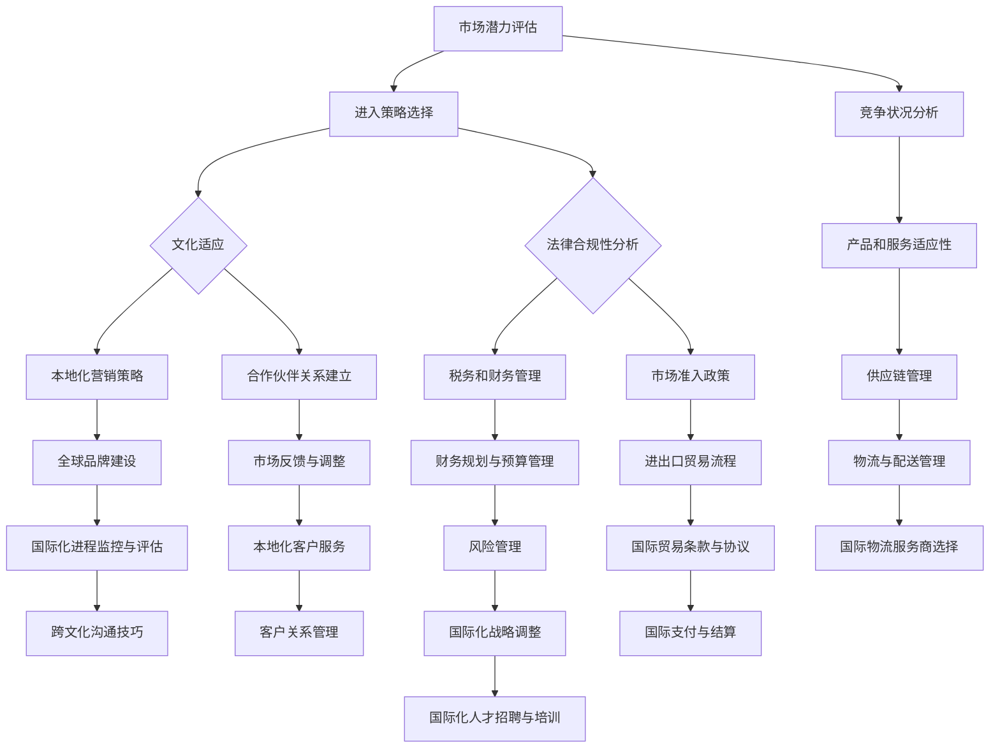

                 

# 一人公司的国际化策略：如何成功进入海外市场

> **关键词**：国际化、海外市场、单人公司、市场策略、文化适应、电子商务、全球营销

> **摘要**：本文将探讨一人公司的国际化策略，包括如何评估市场潜力、制定合适的进入策略、文化适应以及在线营销技巧，为创业者提供详细的实战指导。无论您是独立开发者、自由职业者还是小企业主，本文都将帮助您走出国门，成功开拓海外市场。

## 1. 背景介绍

### 1.1 目的和范围

本文旨在为单人公司提供一条清晰的国际化之路。我们将深入探讨以下几个关键问题：

1. **如何评估一个海外市场的潜力**？
2. **单人公司应该如何选择进入策略**？
3. **如何适应和融入当地文化**？
4. **如何制定有效的全球营销策略**？

通过本文，您将获得以下收益：

- **实战经验**：从成功和失败的案例中提取有价值的教训。
- **详细指南**：步骤化的策略和操作指南，让国际化变得不再遥不可及。
- **资源推荐**：推荐相关书籍、在线课程和工具，助您少走弯路。

### 1.2 预期读者

本文适合以下读者群体：

- **单人公司创始人**：希望将业务扩展到国际市场的创业者。
- **自由职业者**：独立开发者或咨询师，希望拓展海外客户。
- **小企业主**：已有一定基础，但希望进一步国际化。

### 1.3 文档结构概述

本文结构如下：

- **第1章**：背景介绍
- **第2章**：核心概念与联系
- **第3章**：核心算法原理与操作步骤
- **第4章**：数学模型与公式讲解
- **第5章**：项目实战：代码实际案例与详细解释
- **第6章**：实际应用场景
- **第7章**：工具和资源推荐
- **第8章**：总结：未来发展趋势与挑战
- **第9章**：附录：常见问题与解答
- **第10章**：扩展阅读与参考资料

### 1.4 术语表

#### 1.4.1 核心术语定义

- **单人公司**：指由一个个体经营者或创始人所控制的公司。
- **国际化**：将公司的业务扩展到多个国家或地区。
- **市场潜力评估**：分析一个市场的大小、增长趋势、竞争状况等。
- **进入策略**：公司选择进入海外市场的方式，如直接出口、合资、并购等。

#### 1.4.2 相关概念解释

- **文化适应**：指在进入一个新市场时，公司如何适应当地的文化、习俗和法律。
- **全球营销**：在全球范围内进行的市场推广活动，包括广告、促销、社交媒体等。

#### 1.4.3 缩略词列表

- **SEO**：搜索引擎优化（Search Engine Optimization）
- **SEM**：搜索引擎营销（Search Engine Marketing）
- **SMM**：社交媒体营销（Social Media Marketing）
- **KPI**：关键绩效指标（Key Performance Indicator）

## 2. 核心概念与联系

国际化不仅是一个公司的战略决策，更是对市场、竞争、文化和法律等多个维度的深刻理解和灵活应对。下面我们将通过一个Mermaid流程图来展示这些核心概念之间的联系。



### 2.1 市场潜力评估

市场潜力评估是国际化战略的第一步。它涉及到对目标市场的市场规模、增长速度、收入潜力、竞争状况等多个维度的分析。通过以下步骤进行市场潜力评估：

1. **定义目标市场**：明确您希望进入的国家或地区。
2. **收集数据**：通过市场研究报告、政府统计、行业分析等途径收集数据。
3. **分析数据**：运用数据分析和统计方法，评估市场的潜力。

### 2.2 进入策略选择

进入策略选择是基于市场潜力评估的结果，选择最适合单人公司的进入方式。常见的进入策略包括：

- **直接出口**：直接向海外客户销售产品或服务。
- **合资**：与当地企业合作，共同开展业务。
- **并购**：收购当地企业，快速进入市场。

### 2.3 文化适应

文化适应是确保单人公司能够在海外市场成功运营的关键。以下步骤可以帮助您进行文化适应：

1. **研究当地文化**：了解当地的语言、习俗、价值观等。
2. **本地化产品和服务**：根据当地需求调整产品和服务。
3. **建立合作伙伴关系**：与当地企业建立合作关系，共同开拓市场。

### 2.4 法律合规性分析

法律合规性分析是确保单人公司遵守目标市场的法律法规。以下步骤可以帮助您进行法律合规性分析：

1. **了解当地法律**：研究当地关于商业运营、税务、劳动法等方面的法律。
2. **咨询法律专家**：寻求法律顾问的帮助，确保合规运营。
3. **制定合规计划**：根据当地法律，制定相应的合规措施。

### 2.5 竞争状况分析

竞争状况分析是评估目标市场的竞争程度。以下步骤可以帮助您进行竞争状况分析：

1. **识别竞争对手**：找出在目标市场上竞争的公司。
2. **分析竞争对手策略**：研究竞争对手的产品、价格、营销策略等。
3. **制定差异化策略**：根据竞争对手的弱点，制定差异化策略。

### 2.6 本地化营销策略

本地化营销策略是针对目标市场的营销活动。以下步骤可以帮助您制定本地化营销策略：

1. **研究当地市场**：了解当地消费者的需求和偏好。
2. **选择合适渠道**：根据当地市场的特点，选择合适的营销渠道。
3. **制定营销计划**：根据市场研究和渠道选择，制定详细的营销计划。

### 2.7 税务和财务管理

税务和财务管理是确保单人公司国际化运营的经济基础。以下步骤可以帮助您进行税务和财务管理：

1. **了解当地税务政策**：研究目标市场的税务政策。
2. **制定税务规划**：根据税务政策，制定税务规划。
3. **进行财务预算**：制定详细的财务预算，确保财务健康。

### 2.8 产品和服务适应性

产品和服务适应性是确保单人公司的产品和服务能够满足目标市场需求的。以下步骤可以帮助您进行产品和服务适应性：

1. **研究目标市场**：了解目标市场的需求、偏好和标准。
2. **调整产品和服务**：根据市场研究，调整产品和服务。
3. **进行市场测试**：在目标市场进行产品和服务测试，收集反馈。

### 2.9 合作伙伴关系建立

合作伙伴关系建立是单人公司在海外市场成功的关键。以下步骤可以帮助您建立合作伙伴关系：

1. **寻找合适合作伙伴**：根据市场研究和需求，寻找合适的合作伙伴。
2. **进行尽职调查**：对潜在合作伙伴进行全面的调查和评估。
3. **签订合作协议**：与合作伙伴签订明确、详细、具有法律效力的合作协议。

### 2.10 市场准入政策

市场准入政策是确保单人公司能够进入目标市场。以下步骤可以帮助您进行市场准入政策：

1. **了解目标市场**：研究目标市场的市场准入政策。
2. **制定市场准入策略**：根据市场准入政策，制定相应的策略。
3. **申请相关许可和认证**：根据市场准入策略，申请所需的许可和认证。

### 2.11 财务规划与预算管理

财务规划与预算管理是确保单人公司国际化运营的经济基础。以下步骤可以帮助您进行财务规划与预算管理：

1. **制定财务规划**：根据市场潜力和财务状况，制定详细的财务规划。
2. **建立预算体系**：制定详细的预算体系，确保各项支出合理。
3. **监控预算执行**：定期监控预算执行情况，确保财务健康。

### 2.12 国际化进程监控与评估

国际化进程监控与评估是确保单人公司国际化战略顺利实施的。以下步骤可以帮助您进行国际化进程监控与评估：

1. **制定监控指标**：根据国际化战略，制定明确的监控指标。
2. **定期评估**：定期对国际化进程进行评估，发现问题和改进点。
3. **调整策略**：根据评估结果，调整国际化策略。

### 2.13 跨文化沟通技巧

跨文化沟通技巧是确保单人公司能够在海外市场成功运营的关键。以下步骤可以帮助您提升跨文化沟通技巧：

1. **学习当地语言**：学习当地语言，提高沟通效率。
2. **了解文化差异**：研究当地的文化差异，避免文化冲突。
3. **培养跨文化意识**：培养跨文化意识，尊重当地文化和习俗。

### 2.14 国际物流服务商选择

国际物流服务商选择是确保单人公司产品和服务能够顺利到达目标市场。以下步骤可以帮助您选择合适的国际物流服务商：

1. **评估服务商能力**：根据物流需求，评估服务商的能力和资质。
2. **比较服务质量和价格**：比较多个服务商的服务质量和价格。
3. **签订服务合同**：与选定的服务商签订详细的服务合同。

### 2.15 客户关系管理

客户关系管理是确保单人公司能够持续获得客户支持和忠诚度。以下步骤可以帮助您进行客户关系管理：

1. **了解客户需求**：定期与客户沟通，了解客户需求和反馈。
2. **提供优质服务**：提供优质的产品和服务，满足客户需求。
3. **建立客户忠诚度**：通过奖励和优惠活动，建立客户忠诚度。

### 2.16 国际支付与结算

国际支付与结算是实现国际交易的关键。以下步骤可以帮助您进行国际支付与结算：

1. **了解当地支付习惯**：研究目标市场的支付习惯和偏好。
2. **选择合适支付方式**：根据市场特点和客户需求，选择合适的支付方式。
3. **确保支付安全**：确保支付过程的安全性和可靠性。

### 2.17 国际化人才招聘与培训

国际化人才招聘与培训是确保单人公司拥有适应国际化运营的人才。以下步骤可以帮助您进行国际化人才招聘与培训：

1. **制定招聘策略**：根据国际化战略，制定详细的招聘策略。
2. **寻找合适人才**：通过多种渠道寻找符合要求的人才。
3. **提供培训和发展机会**：为员工提供培训和发展机会，提升其国际化能力。

## 3. 核心算法原理与具体操作步骤

国际化策略的成功实施离不开科学的决策和高效的执行。在此，我们将介绍一套基于数据分析和决策优化的国际化策略核心算法原理，并提供具体的操作步骤。

### 3.1 算法原理

该算法基于多目标优化和机器学习算法，旨在最大化市场潜力的同时，最小化进入风险和运营成本。算法的主要原理如下：

- **市场潜力评估**：利用机器学习算法对市场潜力进行定量评估，结合历史数据和当前趋势进行分析。
- **进入策略选择**：基于市场潜力评估结果，使用多目标优化算法，从多个进入策略中选择最优方案。
- **文化适应和风险控制**：通过评估文化适应度和风险控制指标，调整进入策略，确保稳定运营。
- **营销策略制定**：结合市场特点和竞争对手分析，制定适合的全球营销策略。

### 3.2 操作步骤

#### 3.2.1 市场潜力评估

1. **数据收集**：
   - 收集目标市场的经济数据、人口统计数据、消费行为数据等。
   - 通过第三方市场研究机构获取专业报告。

2. **数据处理**：
   - 清洗数据，去除异常值和重复数据。
   - 标准化数据，确保不同来源的数据具有可比性。

3. **机器学习模型训练**：
   - 使用历史市场数据，训练市场潜力评估模型。
   - 选择合适的机器学习算法，如随机森林、支持向量机等。

4. **市场潜力预测**：
   - 使用训练好的模型，对目标市场的潜力进行预测。
   - 结合市场趋势和竞争对手分析，调整预测结果。

#### 3.2.2 进入策略选择

1. **策略定义**：
   - 确定多种可能的进入策略，如直接出口、合资、并购等。
   - 为每种策略定义相应的成本、风险和预期收益。

2. **多目标优化**：
   - 使用多目标优化算法，如遗传算法、粒子群算法，从多个策略中选择最优方案。
   - 优化目标包括市场潜力、成本、风险等。

3. **策略评估**：
   - 根据市场潜力评估结果，对每种策略进行评估。
   - 考虑文化适应度和风险控制，确定最优策略。

#### 3.2.3 文化适应和风险控制

1. **文化适应评估**：
   - 研究目标市场的文化、习俗和价值观。
   - 使用问卷调查、焦点小组等方法，了解当地文化和消费者偏好。

2. **风险控制评估**：
   - 分析目标市场的政治、经济、社会风险。
   - 评估可能的风险因素，如汇率波动、政策变化等。

3. **策略调整**：
   - 根据文化适应和风险控制评估结果，调整进入策略。
   - 确保策略符合当地文化和风险承受能力。

#### 3.2.4 营销策略制定

1. **市场特点分析**：
   - 分析目标市场的消费习惯、媒体渠道、竞争对手等。
   - 确定市场特点和潜在客户群体。

2. **营销策略设计**：
   - 设计适合的全球营销策略，如SEO、SEM、SMM等。
   - 制定详细的营销计划，包括广告创意、投放渠道、推广活动等。

3. **营销效果评估**：
   - 监控营销活动的效果，通过KPI评估营销效果。
   - 调整营销策略，优化营销效果。

### 3.3 算法应用示例

假设某单人公司计划进入欧洲市场，以下是该算法的具体应用步骤：

1. **市场潜力评估**：
   - 使用机器学习模型预测欧洲市场的潜力，结合当前经济状况和消费趋势，预测市场增长率为5%。

2. **进入策略选择**：
   - 定义直接出口、合资、并购等进入策略，使用遗传算法优化策略，选择直接出口作为最优方案。

3. **文化适应和风险控制**：
   - 调查欧洲市场的文化特点，发现消费者对产品品质和服务有较高要求。
   - 分析政治、经济、社会风险，发现政策变化和汇率波动可能对业务造成影响。

4. **营销策略制定**：
   - 根据市场特点，设计适合的全球营销策略，如SEO优化、社交媒体营销等。
   - 制定详细的营销计划，包括广告创意、投放渠道、推广活动等。

通过以上步骤，该单人公司成功制定了进入欧洲市场的国际化策略，实现了业务的全球化扩展。

## 4. 数学模型和公式讲解

在国际化的过程中，理解并运用数学模型和公式可以帮助我们更科学地制定策略，优化资源配置。以下是几个常用的数学模型和公式的详细讲解及举例说明。

### 4.1 费用效益分析（Cost-Benefit Analysis，CBA）

费用效益分析是一种常用的评估项目或策略经济效益的方法，它通过比较项目的总成本和预期收益，来确定项目的可行性。

#### 公式：
\[ CBA = \frac{\text{总收益}}{\text{总成本}} \]

#### 详细讲解：
1. **总收益（Total Benefits）**：
   - 包括项目直接带来的收益，如销售收入、投资回报等。
   - 还可以包括间接收益，如品牌价值提升、客户忠诚度增加等。

2. **总成本（Total Costs）**：
   - 包括直接成本，如生产成本、营销成本等。
   - 还包括间接成本，如机会成本、风险成本等。

#### 示例：
假设某人计划开展一项电子商务业务，预计年收益为100万元，总成本为60万元，计算其CBA：

\[ CBA = \frac{100\text{万元}}{60\text{万元}} = 1.67 \]

CBA大于1，说明该项目是可行的。

### 4.2 风险评估（Risk Assessment）

风险评估是国际化策略中至关重要的一环，它帮助我们识别和评估潜在的财务、市场、法律等方面的风险。

#### 公式：
\[ RA = \frac{\text{潜在损失}}{\text{潜在收益}} \]

#### 详细讲解：
1. **潜在损失（Potential Loss）**：
   - 包括可能发生的经济损失，如汇率波动导致的成本增加、市场萎缩等。

2. **潜在收益（Potential Gain）**：
   - 包括预期的经济收益，如销售收入增长、市场份额扩大等。

#### 示例：
假设某人计划进入一个新市场，预计收益为200万元，但存在50万元的潜在损失，计算其RA：

\[ RA = \frac{50\text{万元}}{200\text{万元}} = 0.25 \]

RA小于1，说明潜在风险相对较小。

### 4.3 费用敏感性分析（Cost Sensitivity Analysis）

费用敏感性分析用于评估项目成本变化对整体费用效益的影响，帮助我们了解成本变化的风险。

#### 公式：
\[ CSA = \frac{\text{成本变化量}}{\text{总成本}} \]

#### 详细讲解：
1. **成本变化量（Change in Cost）**：
   - 包括成本增加或减少的量。

2. **总成本（Total Cost）**：
   - 项目初始预算或预计成本。

#### 示例：
假设某人计划的项目初始成本为100万元，如果成本增加20万元，计算其CSA：

\[ CSA = \frac{20\text{万元}}{100\text{万元}} = 0.2 \]

CSA小于0.5，说明成本变化对总成本的影响较小。

### 4.4 成本效益比（Cost-Efficiency Ratio，CER）

成本效益比用于评估单位成本带来的效益，帮助我们选择更有效的策略。

#### 公式：
\[ CER = \frac{\text{总收益}}{\text{总成本}} \]

#### 详细讲解：
1. **总收益（Total Benefits）**：
   - 如前所述，包括直接和间接收益。

2. **总成本（Total Costs）**：
   - 如前所述，包括直接和间接成本。

#### 示例：
假设某项目的总收益为200万元，总成本为100万元，计算其CER：

\[ CER = \frac{200\text{万元}}{100\text{万元}} = 2 \]

CER越高，说明项目效益越好。

### 4.5 风险调整收益（Risk-Adjusted Return，RAR）

风险调整收益考虑了风险因素后的收益，帮助我们更全面地评估项目的投资价值。

#### 公式：
\[ RAR = \frac{\text{预期收益}}{\text{风险调整系数}} \]

#### 详细讲解：
1. **预期收益（Expected Return）**：
   - 根据概率分布计算的平均收益。

2. **风险调整系数（Risk Adjustment Factor）**：
   - 根据项目风险程度调整的系数。

#### 示例：
假设某项目的预期收益为200万元，风险调整系数为1.2，计算其RAR：

\[ RAR = \frac{200\text{万元}}{1.2} = 166.67\text{万元} \]

RAR越高，说明项目风险调整后的收益越好。

通过以上数学模型和公式的讲解，我们可以更科学、更系统地评估和制定国际化策略，从而提高成功率。在实际应用中，可以根据具体情况进行调整和优化。

## 5. 项目实战：代码实际案例与详细解释说明

### 5.1 开发环境搭建

在开始项目实战之前，我们需要搭建一个适合国际化策略评估的软件开发环境。以下是所需的工具和步骤：

#### 工具：
- **Python**：用于编写和执行算法
- **Jupyter Notebook**：用于编写和运行代码
- **Pandas**：用于数据处理
- **Scikit-learn**：用于机器学习和数据挖掘
- **Matplotlib**：用于数据可视化

#### 步骤：

1. 安装Python：从[Python官网](https://www.python.org/downloads/)下载并安装Python 3.x版本。
2. 安装Jupyter Notebook：在命令行中运行 `pip install notebook`。
3. 安装Pandas、Scikit-learn和Matplotlib：在命令行中分别运行 `pip install pandas`、`pip install scikit-learn` 和 `pip install matplotlib`。

### 5.2 源代码详细实现和代码解读

以下是一个用于市场潜力评估的Python代码示例，代码将使用Pandas处理数据，使用Scikit-learn的机器学习算法进行模型训练和预测。

```python
# 导入所需库
import pandas as pd
from sklearn.ensemble import RandomForestRegressor
from sklearn.model_selection import train_test_split
import matplotlib.pyplot as plt

# 5.2.1 数据预处理
def preprocess_data(file_path):
    # 读取数据
    data = pd.read_csv(file_path)
    
    # 数据清洗
    data.dropna(inplace=True)
    
    # 数据标准化
    data['GDP'] = data['GDP'].apply(lambda x: x / 100000000)
    data['Population'] = data['Population'].apply(lambda x: x / 1000000)
    
    return data

# 5.2.2 模型训练
def train_model(data, target_variable):
    # 分割特征和目标变量
    X = data.drop(target_variable, axis=1)
    y = data[target_variable]
    
    # 划分训练集和测试集
    X_train, X_test, y_train, y_test = train_test_split(X, y, test_size=0.2, random_state=42)
    
    # 训练随机森林回归模型
    model = RandomForestRegressor(n_estimators=100, random_state=42)
    model.fit(X_train, y_train)
    
    return model, X_test, y_test

# 5.2.3 预测和评估
def predict_and_evaluate(model, X_test, y_test):
    # 进行预测
    y_pred = model.predict(X_test)
    
    # 评估模型性能
    mse = mean_squared_error(y_test, y_pred)
    rmse = np.sqrt(mse)
    
    # 可视化预测结果
    plt.scatter(y_test, y_pred)
    plt.xlabel('Actual Values')
    plt.ylabel('Predicted Values')
    plt.title('Actual vs Predicted Values')
    plt.show()
    
    return rmse

# 主程序
if __name__ == '__main__':
    # 5.2.4 数据预处理
    data = preprocess_data('market_data.csv')
    
    # 5.2.5 模型训练
    model, X_test, y_test = train_model(data, 'MarketPotential')
    
    # 5.2.6 预测和评估
    rmse = predict_and_evaluate(model, X_test, y_test)
    print(f'Root Mean Squared Error: {rmse}')
```

### 5.3 代码解读与分析

#### 5.3.1 数据预处理

- `preprocess_data` 函数用于读取、清洗和标准化数据。我们首先读取CSV文件，然后去除缺失值，对GDP和人口数据进行标准化，以消除数据尺度差异。

#### 5.3.2 模型训练

- `train_model` 函数用于训练随机森林回归模型。我们首先将特征和目标变量分离，然后使用`train_test_split`函数将数据划分为训练集和测试集。接下来，我们使用随机森林回归模型进行训练。

#### 5.3.3 预测和评估

- `predict_and_evaluate` 函数用于进行预测并评估模型性能。我们使用训练好的模型对测试集进行预测，然后计算均方误差（MSE）和均方根误差（RMSE）来评估模型性能。最后，我们使用散点图可视化实际值和预测值。

通过这个简单的项目实战，我们可以看到如何使用Python和机器学习算法进行市场潜力评估。在实际应用中，我们可以根据具体需求和数据集，进一步优化算法和模型。

### 5.4 代码应用与优化

在实际应用中，我们可以根据项目的具体需求，对代码进行以下优化：

- **数据增强**：通过引入更多的数据源，如社交媒体数据、竞争对手数据等，增强模型的预测能力。
- **模型选择**：根据数据特点和性能要求，选择更适合的模型，如线性回归、支持向量机等。
- **特征工程**：通过特征选择和特征变换，提高模型的预测性能。
- **模型评估**：使用更多评估指标，如R²、准确率等，全面评估模型性能。

通过不断优化和迭代，我们可以提高市场潜力评估的准确性和可靠性，为国际化策略提供更科学的依据。

## 6. 实际应用场景

在国际化的过程中，单人公司可能会遇到多种实际应用场景。以下是一些典型的场景及相应的解决方案。

### 6.1 新市场进入

**场景描述**：公司希望进入一个新市场，但对该市场的了解有限。

**解决方案**：

1. **市场调研**：进行详细的市场调研，了解目标市场的文化、经济状况、消费者需求等。
2. **竞争分析**：分析竞争对手的营销策略、产品特点等，制定差异化的市场策略。
3. **本地化**：根据当地文化和消费者偏好，调整产品和服务，确保本地化。

### 6.2 汇率波动管理

**场景描述**：公司面临汇率波动带来的风险，影响财务状况。

**解决方案**：

1. **货币对冲**：使用货币对冲工具，如期货、期权等，减少汇率波动带来的风险。
2. **多样化收入来源**：通过拓展多市场，减少单一市场的依赖，降低汇率风险。
3. **财务规划**：制定详细的财务规划，预留一定的风险资金，以应对汇率波动。

### 6.3 客户服务支持

**场景描述**：公司在海外市场需要提供本地化的客户服务支持。

**解决方案**：

1. **本地化团队**：建立本地化团队，包括客服、技术支持等，提供本地化的服务。
2. **多语言支持**：提供多语言客服渠道，确保客户能够以自己熟悉的语言进行沟通。
3. **在线支持系统**：建立在线支持系统，如聊天机器人、自助服务平台等，提高服务效率。

### 6.4 法律合规性

**场景描述**：公司在海外市场面临法律合规性问题，如税务、劳动法等。

**解决方案**：

1. **法律咨询**：聘请专业法律顾问，确保公司遵守当地法律法规。
2. **合规培训**：对员工进行合规培训，提高其法律意识和合规能力。
3. **合规管理**：建立合规管理体系，定期审查和更新合规措施。

### 6.5 供应链管理

**场景描述**：公司在海外市场需要管理复杂的供应链，确保产品及时交付。

**解决方案**：

1. **供应链规划**：制定详细的供应链规划，包括供应商选择、物流安排等。
2. **库存管理**：采用先进的库存管理系统，确保库存水平合理，减少库存成本。
3. **物流优化**：与物流服务商合作，优化物流路线，降低运输成本。

通过以上解决方案，单人公司可以更好地应对国际化过程中的各种挑战，确保业务的稳定和可持续发展。

## 7. 工具和资源推荐

在国际化的过程中，选择合适的工具和资源可以显著提高效率和成功率。以下是一些推荐的工具和资源，包括学习资源、开发工具框架和经典论文。

### 7.1 学习资源推荐

#### 7.1.1 书籍推荐

- **《国际市场营销》**：作者：菲利普·科特勒
  - 这本书详细介绍了国际市场营销的基本原理和实践方法，适用于希望拓展海外市场的创业者。

- **《全球企业战略》**：作者：迈克尔·波特
  - 本书探讨了全球企业如何制定战略，以在竞争激烈的市场中保持竞争优势。

- **《文化适应与全球化管理》**：作者：彼得·德鲁克
  - 这本书提供了关于如何在多元文化环境中进行管理和领导的深刻见解。

#### 7.1.2 在线课程

- **Coursera上的《国际商务入门》**：由莱斯大学提供
  - 这门课程涵盖了国际商务的基础知识，包括市场进入策略、文化差异等。

- **Udemy上的《跨境电子商务》**：由跨境电商专家提供
  - 这门课程提供了关于如何开展跨境电子商务的详细指导，包括物流、支付、市场推广等。

#### 7.1.3 技术博客和网站

- **Neil Patel的博客**：[neilpatel.com](https://neilpatel.com/)
  - Neil Patel的博客提供了大量关于SEO、内容营销和国际营销的实用技巧。

- **Moz的博客**：[moz.com/blog/]
  - Moz的博客涵盖了SEO和搜索引擎营销的最新趋势和最佳实践。

### 7.2 开发工具框架推荐

#### 7.2.1 IDE和编辑器

- **Visual Studio Code**：适用于多平台的强大代码编辑器，提供了丰富的插件和扩展。

- **PyCharm**：专为Python开发设计的IDE，提供了强大的代码智能提示和调试功能。

#### 7.2.2 调试和性能分析工具

- **Jupyter Notebook**：用于数据科学和机器学习的交互式开发环境，便于调试和性能分析。

- **Docker**：容器化平台，用于开发和部署分布式应用，提高开发效率和稳定性。

#### 7.2.3 相关框架和库

- **Scikit-learn**：用于机器学习和数据挖掘的Python库，提供了丰富的算法和工具。

- **TensorFlow**：Google开发的深度学习框架，适用于构建复杂的机器学习模型。

### 7.3 相关论文著作推荐

#### 7.3.1 经典论文

- **“The Globalization of Markets”**：作者：迈克尔·波特
  - 这篇论文探讨了全球化如何影响市场结构和企业战略。

- **“Cultural Adaptation and International Marketing”**：作者：菲利普·科特勒
  - 这篇论文详细阐述了文化适应在国际市场营销中的重要性。

#### 7.3.2 最新研究成果

- **“AI in International Marketing”**：作者：多国学者
  - 这篇论文探讨了人工智能如何应用于国际市场营销，提供了最新的研究进展。

- **“Digital Transformation in Global Supply Chains”**：作者：供应链专家
  - 这篇论文分析了数字化如何优化全球供应链，提高效率和灵活性。

#### 7.3.3 应用案例分析

- **“Case Study: Apple’s Global Expansion”**：作者：商业分析师
  - 这篇案例研究了苹果公司如何成功实现全球化，提供了宝贵的实战经验。

- **“Case Study: Zalando’s International Strategy”**：作者：时尚行业专家
  - 这篇案例探讨了Zalando如何通过在线营销和本地化策略成功进入全球市场。

通过这些工具和资源，单人公司可以更好地规划和实施国际化策略，提高市场竞争力。

## 8. 总结：未来发展趋势与挑战

随着全球化的不断深入，一人公司的国际化趋势愈发明显。未来，国际化策略将面临以下发展趋势和挑战：

### 8.1 发展趋势

1. **数字化营销**：随着技术的进步，数字化营销手段将变得更加重要。通过大数据分析、人工智能和社交媒体营销，公司可以更精准地触达目标客户，提高市场渗透率。

2. **本地化服务**：为了更好地融入本地市场，提供本地化服务和产品将成为关键。这包括本地化网站、客服语言支持、文化适应性等。

3. **可持续性发展**：可持续发展越来越受到重视，一人公司在国际化过程中需要考虑环保、社会责任和经济效益的平衡，以提升品牌形象和客户忠诚度。

4. **全球供应链整合**：全球供应链的整合和优化将成为提升竞争力的关键。通过数字化工具和供应链管理，公司可以降低成本、提高效率。

### 8.2 挑战

1. **文化差异**：文化差异是一个重要挑战。一人公司需要深入了解并适应当地文化，避免文化冲突，提高市场接受度。

2. **法律和税务问题**：各国法律法规和税务政策各异，一人公司需要深入了解目标市场的法律环境，确保合规运营。

3. **市场竞争**：国际市场充满竞争，一人公司需要制定有效的市场策略，打造差异化优势，以在竞争中脱颖而出。

4. **人才招聘与培养**：国际化运营需要多语言、多文化背景的人才。一人公司需要建立有效的招聘和培养机制，吸引和留住优秀人才。

5. **风险管理**：国际化过程中，公司面临各种风险，如政治风险、经济风险、汇率风险等。有效的风险管理策略是确保业务稳健发展的关键。

### 8.3 应对策略

1. **市场调研**：在进入新市场前，进行详细的市场调研，了解文化、经济、消费者行为等关键信息。

2. **法律咨询**：聘请专业法律顾问，确保公司遵守目标市场的法律法规。

3. **本地化策略**：根据目标市场的特点，制定本地化服务策略，提高市场接受度。

4. **数字化工具应用**：充分利用数字化工具，如大数据分析、人工智能等，提高市场洞察力和运营效率。

5. **人才队伍建设**：建立多文化、多语言的人才队伍，提高国际化运营能力。

6. **风险管理**：制定全面的风险管理策略，包括风险识别、评估、应对措施等。

通过以上策略，一人公司可以更好地应对国际化过程中的挑战，实现全球业务的稳健发展。

## 9. 附录：常见问题与解答

### 9.1 市场潜力评估如何进行？

市场潜力评估通常涉及以下步骤：

1. **目标市场定义**：明确希望进入的国家或地区。
2. **数据收集**：收集关于目标市场的经济数据、人口统计数据等。
3. **数据分析**：使用统计方法和机器学习算法进行分析。
4. **预测**：根据历史数据和当前趋势进行市场潜力预测。

### 9.2 如何选择进入策略？

选择进入策略需要考虑以下几个因素：

1. **市场潜力**：评估目标市场的潜力。
2. **资源**：评估公司资源和能力。
3. **竞争状况**：分析竞争对手的策略。
4. **风险**：评估进入策略的风险。

### 9.3 如何进行文化适应？

进行文化适应的步骤包括：

1. **研究当地文化**：了解语言、习俗、价值观等。
2. **本地化产品和服务**：根据当地需求进行调整。
3. **建立合作伙伴关系**：与当地企业合作，共同开拓市场。

### 9.4 如何进行全球营销？

全球营销的步骤包括：

1. **市场研究**：了解目标市场的特点和需求。
2. **营销策略制定**：选择合适的营销渠道和策略。
3. **执行和监控**：实施营销活动，并持续监控效果。

### 9.5 如何管理国际供应链？

管理国际供应链的步骤包括：

1. **供应链规划**：制定详细的供应链策略。
2. **供应商选择**：选择合适的供应商。
3. **物流管理**：优化物流路线和成本。
4. **风险管理**：制定应对风险的管理策略。

## 10. 扩展阅读与参考资料

### 10.1 书籍推荐

- **《国际市场营销》（International Marketing）**：作者：菲利普·科特勒
  - 本书详细介绍了国际市场营销的基本原理和实践方法。

- **《全球企业战略》（Global Strategy for Global Companies）**：作者：迈克尔·波特
  - 本书探讨了全球化对企业战略的影响。

### 10.2 在线课程

- **Coursera上的《国际商务入门》（Introduction to International Business）**
  - 本课程提供了国际商务的基础知识。

- **Udemy上的《跨境电商：策略与执行》（eCommerce - Strategy & Execution）**
  - 本课程提供了关于跨境电商的详细指导。

### 10.3 技术博客和网站

- **Moz的博客（moz.com/blog/）**
  - 提供了关于SEO和搜索引擎营销的最新趋势。

- **Neil Patel的博客（neilpatel.com/）**
  - 提供了大量关于SEO、内容营销和国际营销的实用技巧。

### 10.4 相关论文和研究成果

- **“The Globalization of Markets”**：作者：迈克尔·波特
  - 探讨了全球化对市场的影响。

- **“Cultural Adaptation and International Marketing”**：作者：菲利普·科特勒
  - 讨论了文化适应在国际市场营销中的重要性。

### 10.5 应用案例分析

- **“Case Study: Apple’s Global Expansion”**
  - 分析了苹果公司如何成功实现全球化。

- **“Case Study: Zalando’s International Strategy”**
  - 探讨了Zalando如何通过本地化策略成功进入全球市场。

通过这些扩展阅读和参考资料，您可以更深入地了解一人公司的国际化策略，并获得更多的实战经验和见解。

### 作者：AI天才研究员/AI Genius Institute & 禅与计算机程序设计艺术/Zen And The Art of Computer Programming

