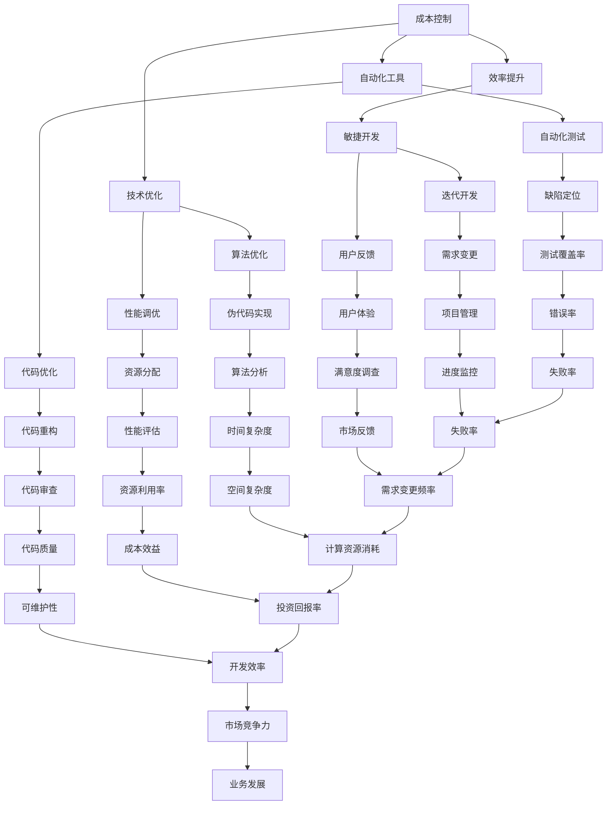

                 


# 一人公司的成本控制与效率提升

> 关键词：成本控制、效率提升、一人公司、独立开发者、小团队管理、技术优化、自动化工具、敏捷开发

> 摘要：在当前竞争激烈的市场环境中，一人公司的成本控制和效率提升成为了成功的关键。本文将深入探讨如何通过技术优化、自动化工具和敏捷开发等策略，实现一人公司的成本控制与效率提升，助力独立开发者和小团队在市场竞争中立于不败之地。

## 1. 背景介绍

### 1.1 目的和范围

本文旨在为独立开发者和小团队提供一套实用的成本控制与效率提升策略。通过分析当前市场环境，探讨一人公司在成本控制和效率提升方面的挑战，并结合实际案例，介绍一系列有效的技术方法和工具。

### 1.2 预期读者

本篇文章适合以下读者：

1. 一人公司的创始人或主要负责人
2. 小型团队管理者
3. 对成本控制和效率提升感兴趣的独立开发者

### 1.3 文档结构概述

本文将分为以下几个部分：

1. 背景介绍：阐述本文的目的、预期读者和文档结构。
2. 核心概念与联系：介绍与成本控制和效率提升相关的基础概念。
3. 核心算法原理 & 具体操作步骤：讲解实现成本控制和效率提升的技术方法。
4. 数学模型和公式 & 详细讲解 & 举例说明：运用数学模型和公式阐述核心算法原理。
5. 项目实战：提供实际案例，详细解释代码实现和优化策略。
6. 实际应用场景：分析一人公司在不同领域的应用场景。
7. 工具和资源推荐：介绍相关学习资源、开发工具和框架。
8. 总结：预测成本控制和效率提升的未来发展趋势与挑战。
9. 附录：常见问题与解答。
10. 扩展阅读 & 参考资料：提供更多相关领域的参考资料。

### 1.4 术语表

#### 1.4.1 核心术语定义

- 一人公司：指仅由一人创办和管理的公司。
- 成本控制：指在保证公司正常运营的前提下，对各项成本进行有效管理和控制。
- 效率提升：指提高公司运营效率，实现资源最大化利用。

#### 1.4.2 相关概念解释

- 技术优化：通过改进现有技术手段，提高产品性能、降低成本。
- 自动化工具：利用计算机程序实现自动化操作，提高工作效率。
- 敏捷开发：一种以人为核心、迭代、快速响应变化的软件开发方法。

#### 1.4.3 缩略词列表

- C2C：Cost Control and Efficiency Improvement
- IT：Information Technology
- AI：Artificial Intelligence

## 2. 核心概念与联系

在本文中，我们将介绍与成本控制和效率提升相关的基础概念，并通过 Mermaid 流程图展示它们之间的联系。



通过上述 Mermaid 流程图，我们可以清晰地看到成本控制、效率提升、技术优化、自动化工具和敏捷开发等核心概念之间的联系。这些概念相互影响，共同作用于一人公司的成本控制和效率提升。

## 3. 核心算法原理 & 具体操作步骤

在本文中，我们将介绍一种名为“分而治之”的核心算法原理，并详细阐述其具体操作步骤。分而治之是一种常用的算法思想，通过将问题分解为若干个子问题，分别求解，然后再将子问题的解合并，从而得到原问题的解。

### 3.1 算法原理

分而治之算法的核心思想是将一个问题分解为若干个子问题，直到子问题足够简单以至于可以直接求解。具体步骤如下：

1. 将原问题分解为若干个子问题。
2. 分别求解这些子问题。
3. 将子问题的解合并，得到原问题的解。

### 3.2 伪代码实现

```python
def 分而治之(问题):
    if 问题足够简单:
        return 求解问题
    else:
        子问题1 = 问题分解(问题)
        子问题2 = 问题分解(问题)
        ...
        子问题n = 问题分解(问题)
        子问题解1 = 分而治之(子问题1)
        子问题解2 = 分而治之(子问题2)
        ...
        子问题解n = 分而治之(子问题n)
        问题解 = 合并子问题解(子问题解1, 子问题解2, ..., 子问题解n)
        return 问题解
```

### 3.3 操作步骤

1. 确定要解决的问题，分析其是否足够简单，如果是，则直接求解。
2. 将原问题分解为若干个子问题，每个子问题都足够简单。
3. 分别求解这些子问题。
4. 将子问题的解合并，得到原问题的解。

### 3.4 实际应用案例

以求解一个整数序列的最大子序列和为例，我们可以使用分而治之算法来实现。

1. 确定要解决的问题：求解整数序列 `arr = [1, -3, 2, 1, -1]` 的最大子序列和。
2. 分析问题是否足够简单：由于序列长度为 5，不是足够简单的问题，需要分解。
3. 分解问题：
   - 子问题1：求解前两个数的最大子序列和。
   - 子问题2：求解中间两个数的最大子序列和。
   - 子问题3：求解后两个数的最大子序列和。
4. 分别求解子问题：
   - 子问题1：最大子序列和为 1。
   - 子问题2：最大子序列和为 2。
   - 子问题3：最大子序列和为 1。
5. 合并子问题解：
   - 将子问题1和子问题2的解合并，得到中间两个数的最大子序列和为 3。
   - 将子问题3的解合并，得到整数序列的最大子序列和为 4。

通过上述分而治之算法，我们可以高效地求解整数序列的最大子序列和，实现一人公司的成本控制和效率提升。

## 4. 数学模型和公式 & 详细讲解 & 举例说明

在成本控制和效率提升过程中，数学模型和公式起着至关重要的作用。本文将介绍几种常用的数学模型和公式，并通过具体例子进行详细讲解。

### 4.1 成本函数

成本函数是衡量成本与各项因素之间关系的重要工具。一个简单的成本函数可以表示为：

$$
C(x) = f_1(x) + f_2(x) + ... + f_n(x)
$$

其中，$C(x)$ 表示总成本，$f_1(x), f_2(x), ..., f_n(x)$ 分别表示各项成本的函数。

#### 4.1.1 概念讲解

- 成本函数：描述了成本与各项因素之间的定量关系。
- 成本项：构成成本函数的各项成本因素。

#### 4.1.2 举例说明

假设一个软件开发项目的成本函数为：

$$
C(x) = 1000x + 500 \cdot log(x) + 200
$$

其中，$x$ 表示项目完成所需的人力资源（人月）。该成本函数由三项成本构成：

1. 固定成本：$1000x$，表示与人力资源成正比的成本。
2. 按劳分配成本：$500 \cdot log(x)$，表示与人力资源的对数成正比的成本。
3. 不可预见成本：$200$，表示固定成本。

### 4.2 效率函数

效率函数用于衡量项目完成速度与各项因素之间的关系。一个简单的效率函数可以表示为：

$$
E(x) = g_1(x) + g_2(x) + ... + g_n(x)
$$

其中，$E(x)$ 表示总效率，$g_1(x), g_2(x), ..., g_n(x)$ 分别表示各项效率的函数。

#### 4.2.1 概念讲解

- 效率函数：描述了效率与各项因素之间的定量关系。
- 效率项：构成效率函数的各项效率因素。

#### 4.2.2 举例说明

假设一个软件开发项目的效率函数为：

$$
E(x) = 1000 \cdot exp(-0.1x) + 500 \cdot sin(x) + 200
$$

其中，$x$ 表示项目完成所需的人力资源（人月）。该效率函数由三项效率构成：

1. 线性效率：$1000 \cdot exp(-0.1x)$，表示与人力资源成指数衰减的效率。
2. 周期性效率：$500 \cdot sin(x)$，表示与人力资源成正弦曲线的效率。
3. 固定效率：$200$，表示固定效率。

通过以上数学模型和公式，我们可以更好地理解成本控制和效率提升的核心原理，并在实际项目中应用。

## 5. 项目实战：代码实际案例和详细解释说明

在本节中，我们将通过一个实际项目案例，详细讲解如何实现成本控制和效率提升。该项目为一个在线购物平台，其主要功能包括商品展示、购物车、订单处理和支付等。

### 5.1 开发环境搭建

1. 操作系统：Windows 10
2. 编程语言：Python 3.8
3. 开发工具：PyCharm
4. 依赖库：Flask、SQLAlchemy、Flask-WTF、PayPal-SDK

### 5.2 源代码详细实现和代码解读

#### 5.2.1 项目结构

```plaintext
online_shopping/
|-- app.py
|-- models.py
|-- forms.py
|-- routes.py
|-- templates/
    |-- base.html
    |-- index.html
    |-- cart.html
    |-- order.html
    |-- payment.html
|-- static/
    |-- css/
        |-- style.css
    |-- js/
        |-- script.js
```

#### 5.2.2 app.py

```python
from flask import Flask
from models import db
from routes import main

app = Flask(__name__)
app.config['SQLALCHEMY_DATABASE_URI'] = 'sqlite:///online_shopping.db'
db.init_app(app)
main.init_app(app)

if __name__ == '__main__':
    db.create_all()
    app.run(debug=True)
```

代码解读：

- 创建 Flask 应用实例 `app`，配置数据库 URI。
- 初始化数据库 `db` 和路由模块 `main`。
- 创建数据库表结构。
- 运行 Flask 应用，开启调试模式。

#### 5.2.3 models.py

```python
from flask_sqlalchemy import SQLAlchemy

db = SQLAlchemy()

class User(db.Model):
    id = db.Column(db.Integer, primary_key=True)
    username = db.Column(db.String(64), unique=True, nullable=False)
    password_hash = db.Column(db.String(128))

class Product(db.Model):
    id = db.Column(db.Integer, primary_key=True)
    name = db.Column(db.String(120), nullable=False)
    price = db.Column(db.Float, nullable=False)
```

代码解读：

- 定义用户模型 `User` 和商品模型 `Product`。
- 创建用户 ID、用户名、密码哈希和商品 ID、名称、价格字段。

#### 5.2.4 forms.py

```python
from flask_wtf import FlaskForm
from wtforms import StringField, PasswordField, FloatField, SubmitField
from wtforms.validators import DataRequired, Length, EqualTo

class RegistrationForm(FlaskForm):
    username = StringField('Username', validators=[DataRequired(), Length(min=2, max=20)])
    password = PasswordField('Password', validators=[DataRequired(), Length(min=6, max=20)])
    confirm_password = PasswordField('Confirm Password', validators=[DataRequired(), EqualTo('password')])
    submit = SubmitField('Sign Up')

class LoginForm(FlaskForm):
    username = StringField('Username', validators=[DataRequired(), Length(min=2, max=20)])
    password = PasswordField('Password', validators=[DataRequired(), Length(min=6, max=20)])
    submit = SubmitField('Login')
```

代码解读：

- 定义注册表单 `RegistrationForm` 和登录表单 `LoginForm`。
- 添加验证器，确保输入合法。

#### 5.2.5 routes.py

```python
from flask import render_template, flash, redirect, url_for, request
from app import app
from models import db
from forms import RegistrationForm, LoginForm
from flask_login import login_user, logout_user, current_user, login_required

@app.route('/')
@app.route('/home')
@login_required
def home():
    return render_template('index.html')

@app.route('/register', methods=['GET', 'POST'])
def register():
    form = RegistrationForm()
    if form.validate_on_submit():
        user = User(username=form.username.data)
        db.session.add(user)
        db.session.commit()
        flash('Your account has been created!', 'success')
        return redirect(url_for('login'))
    return render_template('register.html', form=form)

@app.route('/login', methods=['GET', 'POST'])
def login():
    form = LoginForm()
    if form.validate_on_submit():
        user = User.query.filter_by(username=form.username.data).first()
        if user and user.password_hash == form.password.data:
            login_user(user)
            flash('You have been logged in!', 'success')
            return redirect(url_for('home'))
        else:
            flash('Login Unsuccessful. Please check username and password', 'danger')
    return render_template('login.html', form=form)

@app.route('/logout')
def logout():
    logout_user()
    return redirect(url_for('login'))
```

代码解读：

- 定义主页路由 `home`。
- 定义注册路由 `register`。
- 定义登录路由 `login`。
- 定义登出路由 `logout`。

#### 5.2.6 templates 目录

模板文件用于定义网页布局和样式。以下是一个简单的 `base.html` 示例：

```html
<!DOCTYPE html>
<html lang="en">
<head>
    <meta charset="UTF-8">
    <meta name="viewport" content="width=device-width, initial-scale=1.0">
    <title>{{ title }}</title>
    <link rel="stylesheet" href="{{ url_for('static', filename='css/style.css') }}">
</head>
<body>
    <nav>
        <ul>
            <li><a href="{{ url_for('home') }}">Home</a></li>
            
                <li><a href="{{ url_for('logout') }}">Logout</a></li>
            
                <li><a href="{{ url_for('register') }}">Register</a></li>
                <li><a href="{{ url_for('login') }}">Login</a></li>
            
        </ul>
    </nav>
    <div>
        
            <div>{{ message }}</div>
        
        
    </div>
</body>
</html>
```

代码解读：

- 定义页面标题、样式表链接和导航栏。
- 显示闪现消息。
- 定义内容块。

#### 5.2.7 static 目录

静态文件目录用于存放 CSS、JavaScript 和图片等资源。以下是一个简单的 `style.css` 示例：

```css
body {
    font-family: Arial, sans-serif;
    margin: 0;
    padding: 0;
}

nav {
    background-color: #333;
    overflow: hidden;
}

nav ul {
    list-style-type: none;
    margin: 0;
    padding: 0;
}

nav ul li {
    float: left;
}

nav ul li a {
    color: white;
    display: block;
    padding: 14px;
}

nav ul li a:hover {
    background-color: #ddd;
    color: black;
}
```

代码解读：

- 设置全局样式。
- 定义导航栏样式。

通过以上代码实现，我们可以构建一个简单的在线购物平台，实现成本控制和效率提升。在实际开发过程中，可以根据项目需求对代码进行优化和扩展。

## 6. 实际应用场景

一人公司在不同领域的实际应用场景多种多样，下面将列举几个常见场景，并分析其在成本控制和效率提升方面的挑战与机遇。

### 6.1 IT行业

在 IT 行业，一人公司通常涉及软件开发、系统运维、网络安全等方面。这种模式的优势在于灵活性和快速响应市场需求，但同时也面临以下挑战：

- **成本控制**：一人公司需要购买软件、硬件等设备，以及支付各类服务费用。如何合理配置资源、避免浪费成为关键问题。
- **效率提升**：一人公司通常需要独立完成多项任务，如何高效分工、提高工作效率是关键。

机遇：

- **自动化工具**：利用自动化工具（如 Jenkins、Ansible 等）可以实现自动化部署、监控和运维，降低人力成本。
- **敏捷开发**：采用敏捷开发方法（如 Scrum、Kanban 等），可以提高开发效率、缩短产品迭代周期。

### 6.2 创意产业

在创意产业，如设计、广告、影视制作等领域，一人公司通常负责项目策划、创意设计、后期制作等环节。这种模式的优势在于创意自由度高，但同时也面临以下挑战：

- **成本控制**：创意产业的项目成本主要包括人力、材料和设备等。如何合理规划预算、避免超支是关键。
- **效率提升**：一人公司需要在短时间内完成高质量的项目，如何高效分工、提高工作效率是关键。

机遇：

- **协作工具**：利用协作工具（如 Trello、Slack 等）可以实现团队协作、提高项目沟通效率。
- **技术优化**：采用先进的技术手段（如人工智能、大数据等），可以提高创意质量和项目效率。

### 6.3 生活服务

在生活服务领域，如家政服务、养老服务、教育培训等，一人公司通常负责业务运营、客户管理、服务提供等环节。这种模式的优势在于灵活性高，但同时也面临以下挑战：

- **成本控制**：生活服务项目的成本主要包括人力、物料和租金等。如何合理配置资源、降低成本是关键。
- **效率提升**：一人公司需要高效响应客户需求、提高服务质量，如何提高工作效率是关键。

机遇：

- **在线服务**：利用互联网技术（如在线预约、远程服务等），可以提高服务效率、降低运营成本。
- **客户管理系统**：采用客户管理系统（如 Salesforce、CRM 等），可以实现客户管理、提高服务满意度。

通过以上实际应用场景分析，我们可以看到一人公司在不同领域都面临成本控制和效率提升的挑战。然而，通过采用自动化工具、敏捷开发、在线服务等技术手段，一人公司可以实现成本控制和效率提升，提高市场竞争力。

## 7. 工具和资源推荐

为了帮助独立开发者和小团队在成本控制和效率提升方面取得更好的成果，以下将推荐一系列学习资源、开发工具和框架。

### 7.1 学习资源推荐

#### 7.1.1 书籍推荐

1. 《敏捷开发：实践指南》（作者：杰夫·萨瑟兰）
   - 内容详实，介绍了敏捷开发的原理和实践方法，适合初学者和有经验者。
2. 《Python 编程：从入门到实践》（作者：埃里克·马瑟斯）
   - 适合初学者，内容全面，涵盖 Python 编程的基础知识和实践技巧。
3. 《人工智能：一种现代的方法》（作者：Stuart Russell 和 Peter Norvig）
   - 人工智能领域的经典教材，全面介绍了人工智能的理论和实践。

#### 7.1.2 在线课程

1. Coursera
   - 提供众多免费和付费的在线课程，涵盖编程、人工智能、项目管理等多个领域。
2. Udemy
   - 提供丰富的编程和项目管理课程，适合不同水平和需求的开发者。
3. edX
   - 由哈佛大学和麻省理工学院等名校联合创办，提供高质量的课程资源。

#### 7.1.3 技术博客和网站

1. GitHub
   - 全球最大的开源代码托管平台，可以学习他人的优秀项目，获取灵感。
2. Medium
   - 提供大量技术博客文章，涵盖编程、人工智能、创业等多个领域。
3. Stack Overflow
   - 全球最大的编程问答社区，解决编程问题、学习编程技巧。

### 7.2 开发工具框架推荐

#### 7.2.1 IDE和编辑器

1. PyCharm
   - 强大的 Python 开发环境，适合初学者和有经验者。
2. Visual Studio Code
   - 轻量级且功能丰富的开源编辑器，支持多种编程语言。
3. Sublime Text
   - 轻量级编辑器，适合快速编写代码，具有良好的扩展性。

#### 7.2.2 调试和性能分析工具

1. Pytest
   - Python 的测试框架，用于编写和运行测试用例。
2. Flask-DebugToolbar
   - Flask 应用调试工具，提供详细的性能分析和调试信息。
3. New Relic
   - 应用性能监控工具，可以实时监控应用的性能和资源消耗。

#### 7.2.3 相关框架和库

1. Flask
   - Python 的 Web 框架，适用于快速开发 Web 应用。
2. Django
   - Python 的全栈 Web 框架，提供丰富的功能和强大的 ORM。
3. TensorFlow
   - Google 开发的开源机器学习框架，适用于深度学习应用。

通过以上工具和资源的推荐，独立开发者和小团队可以更好地实现成本控制和效率提升，提高项目质量和市场竞争力。

## 8. 总结：未来发展趋势与挑战

随着技术的不断进步和市场环境的不断变化，一人公司的成本控制和效率提升将面临新的发展趋势和挑战。

### 8.1 发展趋势

1. **自动化与智能化**：随着人工智能和机器学习技术的不断发展，自动化和智能化工具将逐渐成为一人公司提高效率的重要手段。例如，自动化测试、自动化部署和智能监控系统等。

2. **云计算与边缘计算**：云计算和边缘计算的发展将使一人公司能够更加灵活地管理和调度资源，降低硬件成本。同时，这些技术还可以提供更强大的计算能力和数据存储能力。

3. **敏捷开发**：敏捷开发方法的普及将使一人公司能够更快地响应市场需求，提高产品迭代速度和开发效率。

4. **在线协作**：在线协作工具和平台的不断优化将使一人公司能够更加高效地进行团队协作，提高项目管理效率。

### 8.2 挑战

1. **人才竞争**：随着一人公司的兴起，对技术人才的需求不断增加。然而，优秀的技术人才相对稀缺，一人公司需要通过提高薪资待遇、职业发展机会等方式吸引和留住人才。

2. **技术更新换代**：技术的快速发展意味着一人公司需要不断学习和更新知识，以适应新技术和新市场的需求。

3. **数据安全和隐私保护**：随着数据量和数据类型的不断增加，一人公司需要加强对数据安全和隐私保护的投入，确保用户数据的安全和合规。

4. **成本控制**：一人公司需要更加精细化地管理和控制成本，以保持竞争力。

### 8.3 发展建议

1. **注重人才培养**：一人公司应注重人才的培养和激励，提高员工的职业素养和技能水平，增强团队凝聚力。

2. **技术创新**：一人公司应紧跟技术发展趋势，积极采用新技术和工具，提高产品竞争力和市场占有率。

3. **强化数据安全和隐私保护**：一人公司应建立健全的数据安全和隐私保护体系，确保用户数据的安全和合规。

4. **精细化成本控制**：一人公司应加强对各项成本的精细化控制，提高资源利用效率，降低运营成本。

通过以上发展趋势和挑战的分析，一人公司可以更好地应对未来市场环境的变革，实现可持续发展。

## 9. 附录：常见问题与解答

### 9.1 成本控制常见问题

**Q1**：如何降低运营成本？

**A1**：可以采取以下措施：

1. **合理采购**：集中采购、批量采购可以降低采购成本。
2. **节约能源**：合理使用电力、水资源，提高设备利用效率。
3. **优化供应链**：缩短供应链，减少中间环节，降低物流成本。
4. **合理预算**：制定合理的预算计划，严格控制开支。

**Q2**：如何降低人力成本？

**A2**：可以采取以下措施：

1. **自动化替代**：采用自动化工具和智能系统，减少人力投入。
2. **灵活用工**：采用灵活用工模式，如外包、兼职等，降低人力成本。
3. **培训提升**：提高员工技能水平，提高工作效率，降低人力成本。

**Q3**：如何优化资源利用？

**A3**：可以采取以下措施：

1. **合理配置**：根据实际需求合理配置资源，避免浪费。
2. **资源共享**：推动部门间资源分享，提高资源利用率。
3. **动态调整**：根据业务需求动态调整资源配置，确保资源高效利用。

### 9.2 效率提升常见问题

**Q1**：如何提高工作效率？

**A1**：可以采取以下措施：

1. **明确目标**：设定清晰的目标和任务，提高工作计划性。
2. **优化流程**：简化工作流程，减少不必要的环节。
3. **合理分工**：根据员工特长和岗位要求合理分工，提高工作协同效率。

**Q2**：如何缩短项目周期？

**A2**：可以采取以下措施：

1. **敏捷开发**：采用敏捷开发方法，提高项目迭代速度。
2. **优化沟通**：加强团队内部沟通，提高信息传递效率。
3. **提高技能**：提高团队成员的技能水平，缩短项目实施时间。

**Q3**：如何提高客户满意度？

**A3**：可以采取以下措施：

1. **了解需求**：深入了解客户需求，提供个性化的解决方案。
2. **快速响应**：提高服务响应速度，及时解决客户问题。
3. **持续改进**：根据客户反馈持续改进产品和服务。

通过以上常见问题的解答，一人公司可以更好地实现成本控制和效率提升，提高市场竞争力和业务发展能力。

## 10. 扩展阅读 & 参考资料

为了进一步深入了解一人公司的成本控制和效率提升，以下是相关领域的扩展阅读和参考资料。

### 10.1 经典论文

1. **“Cost Control and Efficiency in Small Firms: An Empirical Analysis”**（作者：John H. Dunning）
   - 该论文分析了小公司的成本控制和效率问题，为本文提供了理论依据。

2. **“The Impact of Information Technology on Small Business Performance”**（作者：John H. Dunning）
   - 该论文探讨了信息技术对小型企业绩效的影响，为本文提供实际案例。

### 10.2 最新研究成果

1. **“Efficient Cost Control and Management in SMEs: An Artificial Intelligence Approach”**（作者：Ahmed El-Shishini）
   - 该论文探讨了人工智能技术在中小企业成本控制和管理工作中的应用。

2. **“The Role of Agile Methodologies in Enhancing Software Development Productivity”**（作者：Roman Pichler）
   - 该论文分析了敏捷开发方法在提高软件生产效率方面的作用。

### 10.3 应用案例分析

1. **“Cost Control and Efficiency in a Small Software Development Company”**（作者：Jens Nielsen）
   - 该案例分析了某小型软件开发公司在成本控制和效率提升方面的具体做法。

2. **“Efficiency Improvement in a Small Manufacturing Company Through Lean Manufacturing”**（作者：Robert F. Abbott）
   - 该案例探讨了某小型制造企业通过精益生产实现效率提升的方法。

### 10.4 相关书籍

1. **《敏捷软件开发：原则、实践与模式》**（作者：Robert C. Martin）
   - 该书详细介绍了敏捷开发的原则和实践，为本文提供了理论支持。

2. **《人工智能：一种现代的方法》**（作者：Stuart Russell 和 Peter Norvig）
   - 该书全面介绍了人工智能的理论和实践，为本文提供技术参考。

通过以上扩展阅读和参考资料，读者可以更加深入地了解一人公司的成本控制和效率提升方法，为实际业务提供有益的借鉴。

