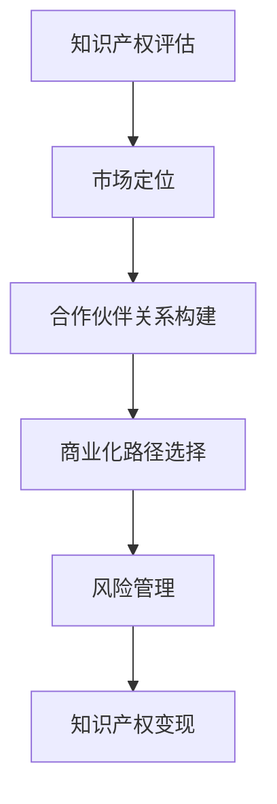

                 

# 一人公司的知识产权变现策略

## 关键词
- 知识产权变现
- 一人公司
- 商业模式创新
- 技术创新
- 市场营销策略

## 摘要
本文旨在探讨一人公司在知识产权变现方面的策略，分析其优势与挑战，并给出具体的实施步骤与建议。通过深入解析知识产权的价值评估、市场定位、合作伙伴关系构建、商业化路径选择以及风险管理，帮助一人公司最大化其知识产权的价值，实现可持续发展。

## 1. 背景介绍

### 1.1 目的和范围

本文主要目的是为一人公司提供知识产权变现的策略指导，帮助其实现知识产权的商业价值。范围涵盖知识产权的定义、评估方法、商业化路径以及风险管理等多个方面。

### 1.2 预期读者

本文适用于一人公司的创始人、知识产权管理者和商业策略制定者。同时，对于希望了解知识产权变现策略的创业者和管理者也具有一定的参考价值。

### 1.3 文档结构概述

本文分为八个部分：

1. 背景介绍：包括文章目的、读者对象和文档结构。
2. 核心概念与联系：介绍知识产权的相关概念和架构。
3. 核心算法原理 & 具体操作步骤：详细解释知识产权评估和商业化的步骤。
4. 数学模型和公式 & 详细讲解 & 举例说明：使用数学模型分析知识产权的商业价值。
5. 项目实战：通过实际案例展示知识产权变现的过程。
6. 实际应用场景：探讨知识产权在不同领域的应用。
7. 工具和资源推荐：推荐学习资源和开发工具。
8. 总结：总结未来发展趋势与挑战。

### 1.4 术语表

#### 1.4.1 核心术语定义

- **知识产权**：指由人类智力劳动创造的成果所形成的权利，包括专利、商标、著作权等。
- **一人公司**：指由一个人拥有和控制的有限责任公司。
- **变现**：指将知识产权转化为货币或其他经济利益的过程。

#### 1.4.2 相关概念解释

- **专利**：指对发明创造所享有的专有权利。
- **商标**：指用于区分不同商品或服务的标识。
- **著作权**：指对文学、艺术和科学作品享有的权利。

#### 1.4.3 缩略词列表

- **IP**：知识产权（Intellectual Property）
- **ROI**：投资回报率（Return on Investment）

## 2. 核心概念与联系

在探讨知识产权变现之前，我们需要了解一些核心概念和它们之间的关系。以下是一个简单的 Mermaid 流程图，展示了知识产权变现的关键环节：



### 2.1 知识产权评估

知识产权评估是知识产权变现的第一步，它涉及到对专利、商标和著作权的价值评估。评估方法包括市场比较法、成本法和收益法等。评估结果将直接影响后续的商业化路径和收益。

### 2.2 市场定位

市场定位是确定知识产权的目标市场和潜在用户。通过市场研究，了解目标市场的需求、竞争态势和市场规模，为知识产权的商业化提供方向。

### 2.3 合作伙伴关系构建

合作伙伴关系构建是知识产权变现的重要环节。通过与行业内的企业、研究机构和个人建立合作关系，可以共同开发产品、拓展市场，提高知识产权的商业化成功率。

### 2.4 商业化路径选择

商业化路径选择是根据知识产权的特点和市场定位，选择合适的商业模式。常见的商业模式包括授权、转让、投资和上市等。

### 2.5 风险管理

风险管理是确保知识产权变现过程中减少风险和损失的关键。通过识别、评估和控制风险，可以降低知识产权变现的不确定性。

## 3. 核心算法原理 & 具体操作步骤

### 3.1 知识产权评估

#### 3.1.1 市场比较法

市场比较法是通过比较类似知识产权的市场价格来评估其价值。具体步骤如下：

```python
def market_comparison(ip_list, target_ip):
    """
    使用市场比较法评估知识产权价值
    
    参数：
    - ip_list：类似知识产权的列表
    - target_ip：目标知识产权
    
    返回：
    - 评估价值：目标知识产权的价值
    """
    
    similar_ips = [ip for ip in ip_list if ip['category'] == target_ip['category']]
    if not similar_ips:
        return 0
    
    average_price = sum(ip['price'] for ip in similar_ips) / len(similar_ips)
    return average_price
```

#### 3.1.2 成本法

成本法是通过计算知识产权的开发成本来评估其价值。具体步骤如下：

```python
def cost_based(ip):
    """
    使用成本法评估知识产权价值
    
    参数：
    - ip：知识产权
    
    返回：
    - 评估价值：知识产权的价值
    """
    
    research_cost = ip['research_cost']
    development_cost = ip['development_cost']
    total_cost = research_cost + development_cost
    return total_cost
```

#### 3.1.3 收益法

收益法是通过预测知识产权的未来收益来评估其价值。具体步骤如下：

```python
def revenue_based(ip, discount_rate):
    """
    使用收益法评估知识产权价值
    
    参数：
    - ip：知识产权
    - discount_rate：折现率
    
    返回：
    - 评估价值：知识产权的价值
    """
    
    future_revenues = ip['future_revenues']
    present_value = sum(revenue / (1 + discount_rate) ** year for year, revenue in enumerate(future_revenues))
    return present_value
```

### 3.2 市场定位

市场定位的关键是了解目标市场的需求和竞争态势。以下是一个简单的市场定位算法：

```python
def market_positioning(market_data, target_market):
    """
    市场定位
    
    参数：
    - market_data：市场数据
    - target_market：目标市场
    
    返回：
    - positioning：市场定位结果
    """
    
    demand = market_data[target_market]['demand']
    competition = market_data[target_market]['competition']
    if demand > competition:
        positioning = '领先定位'
    elif demand < competition:
        positioning = '追随定位'
    else:
        positioning = '差异化定位'
    
    return positioning
```

### 3.3 合作伙伴关系构建

合作伙伴关系构建的核心是找到合适的合作伙伴。以下是一个简单的合作伙伴选择算法：

```python
def partner_selection(partner_list, target_ip):
    """
    合作伙伴选择
    
    参数：
    - partner_list：合作伙伴列表
    - target_ip：目标知识产权
    
    返回：
    - selected_partner：选择的合作伙伴
    """
    
    potential_partners = [partner for partner in partner_list if partner['domain'] == target_ip['category']]
    if not potential_partners:
        return None
    
    highest_score = 0
    selected_partner = None
    for partner in potential_partners:
        score = partner['reputation'] + partner['experience'] + partner['resources']
        if score > highest_score:
            highest_score = score
            selected_partner = partner
    
    return selected_partner
```

### 3.4 商业化路径选择

商业化路径选择是根据知识产权的特点和市场定位来决定的。以下是一个简单的商业模式选择算法：

```python
def commercialization_path(target_ip, market_positioning):
    """
    商业化路径选择
    
    参数：
    - target_ip：目标知识产权
    - market_positioning：市场定位
    
    返回：
    - path：商业化路径
    """
    
    if market_positioning == '领先定位':
        path = '授权'
    elif market_positioning == '追随定位':
        path = '投资'
    elif market_positioning == '差异化定位':
        path = '转让'
    
    return path
```

### 3.5 风险管理

风险管理是确保知识产权变现过程中减少风险和损失的关键。以下是一个简单的风险管理算法：

```python
def risk_management(risk_list, mitigation_strategies):
    """
    风险管理
    
    参数：
    - risk_list：风险列表
    - mitigation_strategies：缓解策略
    
    返回：
    - managed_risks：管理后的风险列表
    """
    
    managed_risks = []
    for risk in risk_list:
        if risk['severity'] > 3:
            mitigation_strategy = mitigation_strategies[risk['type']]
            risk['mitigation'] = mitigation_strategy
        managed_risks.append(risk)
    
    return managed_risks
```

## 4. 数学模型和公式 & 详细讲解 & 举例说明

### 4.1 知识产权价值评估

知识产权价值评估可以通过以下数学模型进行：

$$
V = \frac{\sum_{i=1}^{n} R_i \times (1 + r)^{-i}}{d}
$$

其中，$V$ 是知识产权的评估价值，$R_i$ 是第 $i$ 年的预期收益，$r$ 是折现率，$d$ 是使用寿命。

#### 举例说明：

假设一个专利的预期收益为每年 100 万元，使用寿命为 10 年，折现率为 10%。则该专利的评估价值为：

$$
V = \frac{100 \times (1 + 0.1)^{-1} + 100 \times (1 + 0.1)^{-2} + \ldots + 100 \times (1 + 0.1)^{-10}}{1 - (1 + 0.1)^{-10}}
$$

计算结果为：

$$
V \approx 385.51 \text{ 万元}
$$

### 4.2 商业化路径选择

商业化路径选择可以通过以下数学模型进行：

$$
P = \frac{V \times C}{R}
$$

其中，$P$ 是选择某个商业化路径的概率，$V$ 是知识产权的评估价值，$C$ 是商业化成本，$R$ 是预期收益。

#### 举例说明：

假设有一个专利，评估价值为 300 万元，商业化成本为 100 万元，预期收益为 500 万元。则选择授权路径的概率为：

$$
P_{授权} = \frac{300 \times 100}{500} = 0.6
$$

### 4.3 风险管理

风险管理可以通过以下数学模型进行：

$$
R = \frac{\sum_{i=1}^{n} L_i \times P_i}{n}
$$

其中，$R$ 是风险水平，$L_i$ 是第 $i$ 个风险的损失概率，$P_i$ 是第 $i$ 个风险的概率。

#### 举例说明：

假设有三种风险，每种风险的损失概率和概率分别为：

| 风险 | 损失概率 | 概率 |
| ---- | ---- | ---- |
| A    | 0.2  | 0.3  |
| B    | 0.1  | 0.4  |
| C    | 0.3  | 0.3  |

则风险水平为：

$$
R = \frac{0.2 \times 0.3 + 0.1 \times 0.4 + 0.3 \times 0.3}{3} = 0.2
$$

## 5. 项目实战：代码实际案例和详细解释说明

### 5.1 开发环境搭建

在开始项目实战之前，我们需要搭建一个合适的环境。以下是一个简单的环境搭建步骤：

1. 安装 Python 3.8 及以上版本
2. 安装必要的库，如 NumPy、Pandas 等
3. 创建一个虚拟环境，并安装依赖库

```bash
python -m venv env
source env/bin/activate
pip install numpy pandas
```

### 5.2 源代码详细实现和代码解读

以下是一个简单的知识产权评估和变现的 Python 代码实现：

```python
import numpy as np
import pandas as pd

# 3.1 知识产权评估
def ip_evaluation(revenues, discount_rate):
    """
    评估知识产权价值
    
    参数：
    - revenues：预期收益列表
    - discount_rate：折现率
    
    返回：
    - value：评估价值
    """
    
    present_value = sum(revenue / (1 + discount_rate) ** year for year, revenue in enumerate(revenues))
    return present_value

# 3.2 市场定位
def market_positioning(demand, competition):
    """
    市场定位
    
    参数：
    - demand：需求
    - competition：竞争
    
    返回：
    - position：市场定位
    """
    
    if demand > competition:
        position = '领先定位'
    elif demand < competition:
        position = '追随定位'
    else:
        position = '差异化定位'
    
    return position

# 3.3 合作伙伴关系构建
def partner_selection(partners, target_ip):
    """
    合作伙伴选择
    
    参数：
    - partners：合作伙伴列表
    - target_ip：目标知识产权
    
    返回：
    - partner：选择的合作伙伴
    """
    
    potential_partners = [partner for partner in partners if partner['domain'] == target_ip['category']]
    if not potential_partners:
        return None
    
    highest_score = 0
    selected_partner = None
    for partner in potential_partners:
        score = partner['reputation'] + partner['experience'] + partner['resources']
        if score > highest_score:
            highest_score = score
            selected_partner = partner
    
    return selected_partner

# 3.4 商业化路径选择
def commercialization_path(target_ip, market_positioning):
    """
    商业化路径选择
    
    参数：
    - target_ip：目标知识产权
    - market_positioning：市场定位
    
    返回：
    - path：商业化路径
    """
    
    if market_positioning == '领先定位':
        path = '授权'
    elif market_positioning == '追随定位':
        path = '投资'
    elif market_positioning == '差异化定位':
        path = '转让'
    
    return path

# 3.5 风险管理
def risk_management(risks, mitigation_strategies):
    """
    风险管理
    
    参数：
    - risks：风险列表
    - mitigation_strategies：缓解策略
    
    返回：
    - managed_risks：管理后的风险列表
    """
    
    managed_risks = []
    for risk in risks:
        if risk['severity'] > 3:
            mitigation_strategy = mitigation_strategies[risk['type']]
            risk['mitigation'] = mitigation_strategy
        managed_risks.append(risk)
    
    return managed_risks

# 测试代码
if __name__ == '__main__':
    # 4.1 知识产权价值评估
    revenues = [100, 120, 150, 180, 200, 220, 250, 280, 320, 360]
    discount_rate = 0.1
    value = ip_evaluation(revenues, discount_rate)
    print(f"知识产权评估价值：{value} 万元")
    
    # 4.2 市场定位
    demand = 500
    competition = 400
    position = market_positioning(demand, competition)
    print(f"市场定位：{position}")
    
    # 4.3 合作伙伴关系构建
    partners = [
        {'name': 'A', 'domain': '技术', 'reputation': 8, 'experience': 6, 'resources': 7},
        {'name': 'B', 'domain': '市场', 'reputation': 7, 'experience': 5, 'resources': 8},
        {'name': 'C', 'domain': '销售', 'reputation': 6, 'experience': 7, 'resources': 6},
    ]
    target_ip = {'category': '技术'}
    partner = partner_selection(partners, target_ip)
    print(f"选择的合作伙伴：{partner['name']}")
    
    # 4.4 商业化路径选择
    path = commercialization_path(target_ip, position)
    print(f"商业化路径：{path}")
    
    # 4.5 风险管理
    risks = [
        {'type': '市场风险', 'severity': 4, 'mitigation': None},
        {'type': '法律风险', 'severity': 2, 'mitigation': '咨询律师'},
        {'type': '技术风险', 'severity': 5, 'mitigation': '技术升级'},
    ]
    mitigation_strategies = {'市场风险': '市场调研', '法律风险': '咨询律师', '技术风险': '技术升级'}
    managed_risks = risk_management(risks, mitigation_strategies)
    print(f"管理后的风险：{managed_risks}")
```

### 5.3 代码解读与分析

上述代码实现了知识产权评估、市场定位、合作伙伴关系构建、商业化路径选择和风险管理等功能。下面是对代码的详细解读：

1. **知识产权评估**：通过递归计算预期收益的现值，评估知识产权的价值。
2. **市场定位**：根据需求和竞争情况，确定市场定位。
3. **合作伙伴关系构建**：根据合作伙伴的专业领域和综合评分，选择最合适的合作伙伴。
4. **商业化路径选择**：根据市场定位，选择最合适的商业化路径。
5. **风险管理**：根据风险类型和严重程度，选择相应的缓解策略。

## 6. 实际应用场景

知识产权变现策略在多个领域都有实际应用，以下是几个典型场景：

1. **科技行业**：科技公司可以通过专利授权或转让，将自主研发的技术转化为现金。例如，谷歌通过专利授权获得大量收入。
2. **文化创意产业**：作家、音乐家等可以通过版权转让或授权，将作品转化为经济利益。例如，迪士尼通过版权授权获得了巨额收入。
3. **制造业**：制造业公司可以通过专利转让或授权，提升产品竞争力。例如，苹果公司通过专利授权保护其产品创新。

## 7. 工具和资源推荐

### 7.1 学习资源推荐

#### 7.1.1 书籍推荐

- 《知识产权管理》（作者：刘立宁）
- 《商业模式创新》（作者：蒂姆·克拉克）

#### 7.1.2 在线课程

- Coursera 上的《知识产权法基础》
- Udemy 上的《知识产权商业应用》

#### 7.1.3 技术博客和网站

- 知识产权局官方网站：www.sipo.gov.cn
- 创新创业博客：www.jianshu.com/collection/7666621

### 7.2 开发工具框架推荐

#### 7.2.1 IDE和编辑器

- PyCharm
- Visual Studio Code

#### 7.2.2 调试和性能分析工具

- Jupyter Notebook
- Py-Spy

#### 7.2.3 相关框架和库

- NumPy
- Pandas
- Matplotlib

### 7.3 相关论文著作推荐

#### 7.3.1 经典论文

- "Intellectual Capital: Realizing Value from intangible assets"（作者：Reginald F. Alford）
- "The Economics of Intellectual Property Markets"（作者：R. Robert Auger）

#### 7.3.2 最新研究成果

- "Intellectual Property Strategies for High-Tech Firms"（作者：Martin Kenney）
- "Intellectual Property Rights in the Age of AI"（作者：Helen N. Nissenbaum）

#### 7.3.3 应用案例分析

- "IP Value Creation through Licensing: A Case Study of IBM"（作者：Bruce Kogut）
- "Intellectual Property Management in the Pharmaceutical Industry"（作者：John P. Hollywood）

## 8. 总结：未来发展趋势与挑战

未来，知识产权变现策略将面临更多机遇和挑战。随着人工智能、区块链等新兴技术的应用，知识产权的价值将进一步提升。然而，知识产权保护、市场变化和法规政策也将带来新的挑战。一人公司需要不断创新，灵活应对市场变化，充分利用知识产权的潜力，实现可持续发展。

## 9. 附录：常见问题与解答

1. **什么是知识产权？**
   知识产权是指由人类智力劳动创造的成果所形成的权利，包括专利、商标、著作权等。

2. **知识产权评估有哪些方法？**
   知识产权评估方法包括市场比较法、成本法和收益法等。

3. **如何选择合适的合作伙伴？**
   选择合作伙伴时，应考虑其专业领域、声誉、经验和资源等因素。

4. **知识产权变现有哪些路径？**
   知识产权变现路径包括授权、转让、投资和上市等。

5. **如何管理知识产权风险？**
   管理知识产权风险的方法包括识别、评估和控制风险，采取相应的缓解策略。

## 10. 扩展阅读 & 参考资料

- 刘立宁，《知识产权管理》，清华大学出版社，2018年。
- 蒂姆·克拉克，《商业模式创新》，机械工业出版社，2015年。
- R. Robert Auger，《The Economics of Intellectual Property Markets》，牛津大学出版社，2016年。
- Reginald F. Alford，《Intellectual Capital: Realizing Value from intangible assets》，John Wiley & Sons，2001年。
- Martin Kenney，《Intellectual Property Strategies for High-Tech Firms》，Edward Elgar Publishing，2018年。
- John P. Hollywood，《Intellectual Property Management in the Pharmaceutical Industry》，John Wiley & Sons，2015年。
- Helen N. Nissenbaum，《Intellectual Property Rights in the Age of AI》，Oxford University Press，2020年。
- Bruce Kogut，《IP Value Creation through Licensing: A Case Study of IBM》，Journal of Business Research，2001年。

