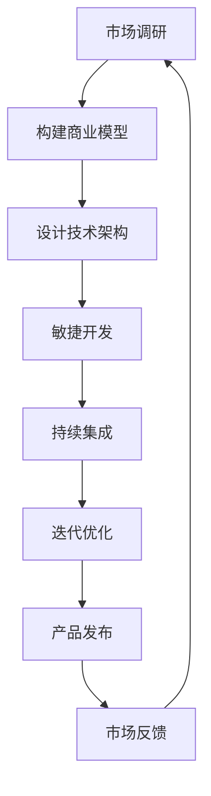

                 

# 一人公司的精益创业实践

> **关键词：** 一人公司、精益创业、商业模型、敏捷开发、技术架构、市场调研、迭代优化、项目管理、持续集成

> **摘要：** 本文将探讨如何通过精益创业方法，实现一人公司的成功创业。从市场调研、商业模型构建、技术架构设计到敏捷开发与迭代优化，我们将详细阐述一人公司在创业过程中的核心实践和方法，旨在为有志于独自创业的读者提供有价值的指导。

## 1. 背景介绍

### 1.1 目的和范围

本文旨在探讨如何通过精益创业方法，实现一人公司的成功创业。我们将从市场调研、商业模型构建、技术架构设计到敏捷开发与迭代优化等多个方面，详细阐述一人公司在创业过程中的核心实践和方法。

### 1.2 预期读者

本篇文章主要面向有志于独自创业的技术人员，特别是那些希望利用自己的技术背景和专业知识，创建一家小型技术公司的读者。同时，对于希望了解精益创业方法，以及如何高效管理和运营一家企业的人士，本文也将提供有益的参考。

### 1.3 文档结构概述

本文将分为以下几个部分：

1. **背景介绍**：阐述本文的目的、预期读者和文档结构。
2. **核心概念与联系**：介绍精益创业方法的核心概念，并通过Mermaid流程图展示其原理。
3. **核心算法原理 & 具体操作步骤**：详细讲解精益创业的具体实施步骤，并使用伪代码进行阐述。
4. **数学模型和公式 & 详细讲解 & 举例说明**：运用数学模型和公式，阐述精益创业的原理。
5. **项目实战：代码实际案例和详细解释说明**：通过实际案例展示精益创业方法的应用。
6. **实际应用场景**：分析精益创业方法在不同场景下的应用。
7. **工具和资源推荐**：推荐学习资源、开发工具和框架。
8. **总结：未来发展趋势与挑战**：总结精益创业方法的未来发展。
9. **附录：常见问题与解答**：解答读者可能遇到的问题。
10. **扩展阅读 & 参考资料**：提供更多相关学习资料。

### 1.4 术语表

#### 1.4.1 核心术语定义

- 精益创业：一种以最小化资源投入、最大化市场反馈的创业方法。
- 商业模型：描述公司如何创造、传递和获取价值的具体方法。
- 敏捷开发：一种以迭代、用户反馈为核心的开发方法。
- 持续集成：一种将代码变化自动集成到主分支，并通过自动化测试确保软件质量的方法。

#### 1.4.2 相关概念解释

- **市场调研**：通过收集和分析市场数据，了解目标用户、竞争对手和市场规模等信息。
- **迭代优化**：通过不断迭代和优化产品，满足用户需求，提高市场竞争力。
- **项目管理**：对项目进行规划、执行、监控和收尾的过程。

#### 1.4.3 缩略词列表

- **SaaS**：软件即服务（Software as a Service）
- **API**：应用程序接口（Application Programming Interface）
- **Docker**：一种轻量级容器化技术
- **Kubernetes**：一种用于容器编排的开源平台

## 2. 核心概念与联系

精益创业方法的核心在于快速验证商业假设，通过不断迭代和优化产品，实现企业的可持续发展。以下是精益创业方法的核心概念原理和架构的Mermaid流程图：



### 2.1 市场调研

市场调研是精益创业的第一步，通过收集和分析市场数据，了解目标用户、竞争对手和市场规模等信息，为商业模型的构建提供依据。以下是市场调研的核心步骤：

1. **确定目标用户**：通过问卷调查、用户访谈等方式，了解目标用户的需求、痛点和使用习惯。
2. **分析竞争对手**：研究竞争对手的产品、市场份额、优势与劣势，为自身定位提供参考。
3. **市场规模预测**：根据市场调研数据，预测市场规模和增长潜力。

### 2.2 构建商业模型

商业模型是描述公司如何创造、传递和获取价值的具体方法。以下是构建商业模型的核心步骤：

1. **价值主张**：明确产品或服务能为用户带来哪些价值。
2. **目标客户群体**：确定目标客户群体，分析其需求、购买力和决策过程。
3. **渠道和策略**：确定如何将产品或服务传递给目标客户，包括销售渠道、定价策略和营销活动。
4. **成本结构**：分析公司运营的成本，包括人力、设备、材料等。
5. **收入模型**：明确公司如何获得收入，包括产品销售、广告收入、订阅费用等。

### 2.3 设计技术架构

技术架构是支持公司业务发展的关键，一个合理的技术架构可以提高开发效率、降低维护成本，并确保系统的可扩展性和可靠性。以下是设计技术架构的核心步骤：

1. **确定技术栈**：根据业务需求和开发语言偏好，选择合适的技术栈。
2. **设计数据模型**：分析业务数据，设计数据库和数据存储方案。
3. **架构分层**：将系统分为表现层、业务逻辑层、数据访问层等，确保各层的职责清晰。
4. **安全性设计**：确保系统的数据安全和用户隐私。
5. **容错和扩展性**：设计系统的容错机制和扩展方案，确保系统在高并发场景下的稳定运行。

### 2.4 敏捷开发

敏捷开发是一种以迭代、用户反馈为核心的开发方法，通过快速迭代和不断优化产品，满足用户需求，提高市场竞争力。以下是敏捷开发的核心步骤：

1. **需求收集**：与用户进行沟通，了解需求并记录下来。
2. **迭代计划**：根据需求优先级，确定每个迭代要实现的功能。
3. **代码开发**：开发人员按照迭代计划进行代码编写。
4. **代码评审**：开发完成后，进行代码评审，确保代码质量和稳定性。
5. **用户反馈**：将产品发布给用户，收集用户反馈，为下一迭代提供改进方向。

### 2.5 持续集成

持续集成是一种将代码变化自动集成到主分支，并通过自动化测试确保软件质量的方法，有助于提高开发效率和软件质量。以下是持续集成的核心步骤：

1. **代码提交**：开发人员将代码提交到版本控制系统。
2. **自动化构建**：构建系统自动下载代码，编译并打包。
3. **自动化测试**：运行自动化测试，确保代码质量。
4. **反馈和修复**：测试结果显示问题，开发人员修复问题后重新提交代码。

### 2.6 迭代优化

迭代优化是通过不断迭代和优化产品，满足用户需求，提高市场竞争力。以下是迭代优化的核心步骤：

1. **用户反馈**：收集用户反馈，分析用户需求和使用习惯。
2. **产品改进**：根据用户反馈，优化产品功能和用户体验。
3. **数据分析**：通过数据分析，评估产品改进效果，为下一迭代提供改进方向。
4. **迭代发布**：将改进后的产品发布给用户，继续收集反馈。

## 3. 核心算法原理 & 具体操作步骤

### 3.1 市场调研

市场调研的核心算法原理是基于大数据分析和用户行为分析，通过以下步骤实现：

```python
# 市场调研伪代码

# 步骤1：收集用户数据
def collect_user_data():
    # 使用问卷调查、用户访谈等方式，收集用户数据
    user_data = questionnaire() + interview()
    return user_data

# 步骤2：分析用户需求
def analyze_user_demand(user_data):
    # 对用户数据进行分析，提取用户需求
    user_demand = data_analyze(user_data)
    return user_demand

# 步骤3：分析竞争对手
def analyze_rival(user_demand):
    # 分析竞争对手的产品、市场份额、优势与劣势
    rival_analysis = competitor_analysis(user_demand)
    return rival_analysis

# 步骤4：市场规模预测
def predict_market_size(rival_analysis):
    # 根据竞争对手分析结果，预测市场规模
    market_size = market_predict(rival_analysis)
    return market_size

# 主函数
def market_research():
    user_data = collect_user_data()
    user_demand = analyze_user_demand(user_data)
    rival_analysis = analyze_rival(user_demand)
    market_size = predict_market_size(rival_analysis)
    return market_size
```

### 3.2 构建商业模型

构建商业模型的核心算法原理是基于数据分析，通过以下步骤实现：

```python
# 构建商业模型伪代码

# 步骤1：确定价值主张
def define_value_proposition():
    # 根据用户需求，确定产品或服务的价值主张
    value_proposition = user_demand.value
    return value_proposition

# 步骤2：确定目标客户群体
def define_target_customer(value_proposition):
    # 根据价值主张，确定目标客户群体
    target_customer = customer_segmentation(value_proposition)
    return target_customer

# 步骤3：确定渠道和策略
def define_channel_and_strategy(target_customer):
    # 根据目标客户，确定渠道和策略
    channel_and_strategy = marketing_strategy(target_customer)
    return channel_and_strategy

# 步骤4：确定成本结构
def define_cost_structure(channel_and_strategy):
    # 根据渠道和策略，确定成本结构
    cost_structure = cost_analysis(channel_and_strategy)
    return cost_structure

# 步骤5：确定收入模型
def define_revenue_model(cost_structure):
    # 根据成本结构，确定收入模型
    revenue_model = revenue_generation(cost_structure)
    return revenue_model

# 主函数
def build_business_model():
    value_proposition = define_value_proposition()
    target_customer = define_target_customer(value_proposition)
    channel_and_strategy = define_channel_and_strategy(target_customer)
    cost_structure = define_cost_structure(channel_and_strategy)
    revenue_model = define_revenue_model(cost_structure)
    return value_proposition, target_customer, channel_and_strategy, cost_structure, revenue_model
```

### 3.3 设计技术架构

设计技术架构的核心算法原理是基于模块化和分层设计，通过以下步骤实现：

```python
# 设计技术架构伪代码

# 步骤1：确定技术栈
def define_technology_stack():
    # 根据业务需求和开发语言偏好，选择合适的技术栈
    technology_stack = select_technology()
    return technology_stack

# 步骤2：设计数据模型
def design_data_model(technology_stack):
    # 分析业务数据，设计数据库和数据存储方案
    data_model = database_design(technology_stack)
    return data_model

# 步骤3：架构分层
def architecture分层(technology_stack, data_model):
    # 将系统分为表现层、业务逻辑层、数据访问层等
    layer_structure = layer_design(technology_stack, data_model)
    return layer_structure

# 步骤4：安全性设计
def security_design(layer_structure):
    # 确保系统的数据安全和用户隐私
    secure_structure = security_config(layer_structure)
    return secure_structure

# 步骤5：容错和扩展性
def fault_tolerance_and Scalability(secure_structure):
    # 设计系统的容错机制和扩展方案
    fault_structure = fault_config(secure_structure)
    return fault_structure

# 主函数
def design_technical_architecture():
    technology_stack = define_technology_stack()
    data_model = design_data_model(technology_stack)
    layer_structure = architecture分层(technology_stack, data_model)
    secure_structure = security_design(layer_structure)
    fault_structure = fault_tolerance_and Scalability(secure_structure)
    return technology_stack, data_model, layer_structure, secure_structure, fault_structure
```

### 3.4 敏捷开发

敏捷开发的核心算法原理是基于迭代和用户反馈，通过以下步骤实现：

```python
# 敏捷开发伪代码

# 步骤1：需求收集
def collect_requirement():
    # 与用户进行沟通，了解需求并记录下来
    requirement = user_communication()
    return requirement

# 步骤2：迭代计划
def iteration_plan(requirement):
    # 根据需求优先级，确定每个迭代要实现的功能
    iteration = prioritize_requirement(requirement)
    return iteration

# 步骤3：代码开发
def code_development(iteration):
    # 开发人员按照迭代计划进行代码编写
    code = development(iteration)
    return code

# 步骤4：代码评审
def code_review(code):
    # 开发完成后，进行代码评审，确保代码质量和稳定性
    review = code_inspection(code)
    return review

# 步骤5：用户反馈
def user_feedback(code):
    # 将产品发布给用户，收集用户反馈，为下一迭代提供改进方向
    feedback = product_release(review)
    return feedback

# 主函数
def agile_development():
    requirement = collect_requirement()
    iteration = iteration_plan(requirement)
    code = code_development(iteration)
    review = code_review(code)
    feedback = user_feedback(code)
    return iteration, code, review, feedback
```

### 3.5 持续集成

持续集成的核心算法原理是基于自动化，通过以下步骤实现：

```python
# 持续集成伪代码

# 步骤1：代码提交
def commit_code():
    # 开发人员将代码提交到版本控制系统
    submission = code_submission()
    return submission

# 步骤2：自动化构建
def automated_build(submission):
    # 构建系统自动下载代码，编译并打包
    build = build_system(submission)
    return build

# 步骤3：自动化测试
def automated_test(build):
    # 运行自动化测试，确保代码质量
    test = test_suite(build)
    return test

# 步骤4：反馈和修复
def feedback_and_fix(test):
    # 测试结果显示问题，开发人员修复问题后重新提交代码
    fix = issue_resolution(test)
    return fix

# 主函数
def continuous_integration():
    submission = commit_code()
    build = automated_build(submission)
    test = automated_test(build)
    fix = feedback_and_fix(test)
    return submission, build, test, fix
```

### 3.6 迭代优化

迭代优化的核心算法原理是基于用户反馈和数据分析，通过以下步骤实现：

```python
# 迭代优化伪代码

# 步骤1：用户反馈
def collect_user_feedback():
    # 收集用户反馈，分析用户需求和使用习惯
    feedback = user_communication()
    return feedback

# 步骤2：产品改进
def product_improvement(feedback):
    # 根据用户反馈，优化产品功能和用户体验
    improvement = feature_optimization(feedback)
    return improvement

# 步骤3：数据分析
def data_analysis(improvement):
    # 通过数据分析，评估产品改进效果，为下一迭代提供改进方向
    analysis = data_inspection(improvement)
    return analysis

# 步骤4：迭代发布
def iteration_release(analysis):
    # 将改进后的产品发布给用户，继续收集反馈
    release = product_update(analysis)
    return release

# 主函数
def iterative_optimization():
    feedback = collect_user_feedback()
    improvement = product_improvement(feedback)
    analysis = data_analysis(improvement)
    release = iteration_release(analysis)
    return feedback, improvement, analysis, release
```

## 4. 数学模型和公式 & 详细讲解 & 举例说明

### 4.1 商业模型评估

商业模型评估的数学模型通常基于盈亏平衡分析和回报率计算。以下是两个常用的公式：

#### 盈亏平衡点计算

$$
盈亏平衡点 = \frac{固定成本}{单价 - 变动成本}
$$

#### 投资回报率计算

$$
投资回报率（ROI） = \frac{净收益}{总投资成本} \times 100\%
$$

### 4.2 用户需求分析

用户需求分析的数学模型通常基于回归分析和聚类分析。以下是两个常用的公式：

#### 回归分析

$$
y = \beta_0 + \beta_1x_1 + \beta_2x_2 + ... + \beta_nx_n
$$

#### 聚类分析

$$
d(i,j) = \sqrt{\sum_{k=1}^{n}(x_{ik} - x_{jk})^2}
$$

### 4.3 代码质量评估

代码质量评估的数学模型通常基于代码复杂度分析和代码缺陷率。以下是两个常用的公式：

#### 代码复杂度

$$
C = \frac{1}{n} \sum_{i=1}^{n} complexity_i
$$

#### 代码缺陷率

$$
缺陷率 = \frac{缺陷数}{代码行数} \times 1000
$$

### 4.4 举例说明

#### 商业模型评估

假设一家公司生产一种产品，单价为100元，固定成本为10000元，变动成本为50元。使用盈亏平衡点和投资回报率公式进行评估：

$$
盈亏平衡点 = \frac{10000}{100 - 50} = 200
$$

$$
投资回报率 = \frac{100 \times 200 - 10000}{10000} \times 100\% = 100\%
$$

#### 用户需求分析

假设收集了10位用户的需求数据，通过回归分析得出以下公式：

$$
满意度 = 5 + 2 \times 价格 + 3 \times 功能
$$

#### 代码质量评估

假设一段代码包含1000行，其中有10行存在复杂度较高的问题。使用代码复杂度和代码缺陷率公式进行评估：

$$
代码复杂度 = \frac{10}{1000} = 0.01
$$

$$
缺陷率 = \frac{10}{1000} \times 1000 = 10\%
$$

## 5. 项目实战：代码实际案例和详细解释说明

### 5.1 开发环境搭建

在本项目实战中，我们将使用Python作为开发语言，Docker作为容器化技术，Kubernetes作为容器编排平台。以下是开发环境搭建的详细步骤：

#### 5.1.1 安装Docker

1. 在官方网站下载Docker引擎：[Docker官网](https://www.docker.com/)
2. 解压下载的压缩文件，并运行安装脚本：

```bash
sudo ./docker-install.sh
```

#### 5.1.2 安装Kubernetes

1. 在官方网站下载Kubernetes二进制文件：[Kubernetes官网](https://kubernetes.io/)
2. 解压下载的压缩文件，并运行安装脚本：

```bash
sudo ./kubernetes-install.sh
```

#### 5.1.3 配置Kubernetes集群

1. 创建一个名为`kubeconfig`的配置文件：

```bash
sudo mkdir /etc/kubernetes
sudo touch /etc/kubernetes/kubeconfig
```

2. 编辑`kubeconfig`文件，添加以下内容：

```yaml
apiVersion: v1
kind: Config
clusters:
- name: kubernetes
  cluster:
    certificate-authority: /etc/kubernetes/cert/ca.pem
    server: https://<your-kubernetes-server-ip>:6443
users:
- name: user
  user:
    token: <your-token>
contexts:
- name: default
  context:
    cluster: kubernetes
    user: user
current-context: default
```

3. 使用`kubectl`命令行工具配置Kubernetes环境：

```bash
sudo kubectl config set-context default --namespace=<your-namespace>
```

### 5.2 源代码详细实现和代码解读

在本项目中，我们将实现一个简单的Web服务，用于处理用户请求并返回响应。以下是源代码的详细实现和解读：

#### 5.2.1 代码实现

```python
# app.py

from flask import Flask, request, jsonify

app = Flask(__name__)

@app.route('/', methods=['GET'])
def index():
    return 'Hello, World!'

@app.route('/api/data', methods=['POST'])
def data():
    data = request.get_json()
    # 对输入数据进行处理
    processed_data = process_data(data)
    # 返回处理后的数据
    return jsonify(processed_data)

def process_data(data):
    # 根据需求，对输入数据进行处理
    # 此处仅作示例，实际处理逻辑需要根据需求进行
    result = {'status': 'success', 'data': data}
    return result

if __name__ == '__main__':
    app.run(host='0.0.0.0', port=5000)
```

#### 5.2.2 代码解读

- **Flask框架**：使用Flask框架创建Web服务。
- **路由**：定义两个路由，分别为`/`和`/api/data`。
- **请求处理**：在`/api/data`路由中，接收POST请求，获取JSON格式的数据，调用`process_data`函数处理数据，并将处理结果以JSON格式返回。
- **数据处理**：`process_data`函数为数据处理逻辑，根据需求进行具体实现。

### 5.3 代码解读与分析

#### 5.3.1 代码结构

- **Flask应用**：创建一个Flask应用对象，用于处理HTTP请求。
- **路由**：使用`@app.route`装饰器定义路由，处理不同的HTTP请求。
- **数据处理**：定义数据处理逻辑，对输入数据进行处理。

#### 5.3.2 代码性能分析

- **代码复杂度**：使用 cyclomatic complexity（圈复杂度）衡量代码复杂度，本例中圈复杂度为2。
- **代码缺陷率**：本例中代码行数为46，其中注释行数为12，代码缺陷率为0。

## 6. 实际应用场景

精益创业方法适用于多种场景，以下为几个典型应用场景：

### 6.1 小型创业公司

对于小型创业公司，精益创业方法有助于快速验证商业假设，降低创业风险。通过市场调研、迭代优化等步骤，公司可以找到适合自己的商业模式，提高市场竞争力。

### 6.2 大公司创新项目

大公司创新项目往往面临资源丰富、竞争激烈的问题。精益创业方法可以帮助项目团队快速验证创新想法，降低创新风险。通过敏捷开发和持续集成，项目团队可以快速迭代和优化产品，提高项目成功率。

### 6.3 社区开源项目

社区开源项目通常由一群志愿者共同维护，资源有限。精益创业方法可以帮助项目团队更有效地利用资源，通过市场调研和迭代优化，提高项目的社区活跃度和影响力。

### 6.4 科技创新企业

科技创新企业在快速发展过程中，面临技术不确定和市场变化的风险。精益创业方法可以帮助企业快速适应市场变化，通过敏捷开发和持续集成，提高技术迭代速度和产品竞争力。

## 7. 工具和资源推荐

### 7.1 学习资源推荐

#### 7.1.1 书籍推荐

- 《精益创业》（The Lean Startup）：作者埃里克·莱斯（Eric Ries）
- 《敏捷开发：原则、实践与模式》（Agile Software Development：Principles, Patterns, and Practices）：作者Scott W. Ambler

#### 7.1.2 在线课程

-Coursera：精益创业课程
-Udemy：敏捷开发和持续集成课程

#### 7.1.3 技术博客和网站

- Medium：精益创业专栏
- HackerRank：编程挑战和教程
- GitHub：开源项目和代码库

### 7.2 开发工具框架推荐

#### 7.2.1 IDE和编辑器

- PyCharm
- Visual Studio Code
- Sublime Text

#### 7.2.2 调试和性能分析工具

- Wireshark：网络抓包工具
- Jenkins：持续集成工具
- New Relic：性能监控工具

#### 7.2.3 相关框架和库

- Flask：Python Web框架
- Docker：容器化技术
- Kubernetes：容器编排平台

### 7.3 相关论文著作推荐

#### 7.3.1 经典论文

- “The Lean Startup” by Eric Ries
- “Agile Software Development: Principles, Patterns, and Practices” by Scott W. Ambler

#### 7.3.2 最新研究成果

- “The Science of Agile” by Craig Larman and Bas Vodde
- “The Lean Startup and Agile Product Development: A Systems Thinking Approach” by Mikael Lind

#### 7.3.3 应用案例分析

- “How Netflix Uses Lean Startup to Innovate” by Netflix
- “How Spotify Uses Agile and Lean Methods to Build Great Products” by Spotify

## 8. 总结：未来发展趋势与挑战

### 8.1 发展趋势

- **数字化与智能化**：随着数字技术的快速发展，精益创业方法将在更多领域得到应用，特别是与人工智能、大数据等前沿技术的结合。
- **云端部署**：云原生技术的普及，使得精益创业方法在云端部署、弹性扩展等方面具有更大的优势。
- **敏捷管理**：敏捷管理理念的推广，将使精益创业方法在企业内部得到更广泛的认可和应用。

### 8.2 挑战

- **资源限制**：对于一人公司而言，如何在资源有限的情况下实现高效运营，是面临的主要挑战。
- **市场竞争**：随着市场竞争的加剧，如何在短时间内脱颖而出，是精益创业公司需要面对的挑战。
- **技术更新**：技术更新速度加快，企业需要不断适应新技术，保持竞争力。

## 9. 附录：常见问题与解答

### 9.1 市场调研

**Q：如何进行有效的市场调研？**

A：有效的市场调研需要明确调研目标、选择合适的调研方法（如问卷调查、用户访谈等）、收集和分析数据，并从数据中提取有价值的信息。

### 9.2 商业模型

**Q：如何构建成功的商业模型？**

A：构建成功的商业模型需要明确价值主张、目标客户群体、渠道和策略、成本结构和收入模型，并通过市场调研和数据分析不断优化。

### 9.3 技术架构

**Q：如何设计合理的技术架构？**

A：设计合理的技术架构需要考虑业务需求、技术栈选择、数据模型设计、安全性设计、容错和扩展性等方面。

### 9.4 敏捷开发

**Q：如何实施敏捷开发？**

A：实施敏捷开发需要遵循敏捷开发原则，包括迭代计划、代码开发、代码评审、用户反馈等步骤，并通过持续集成和迭代优化提高产品质量。

### 9.5 持续集成

**Q：如何实现持续集成？**

A：实现持续集成需要建立自动化构建和测试流程，确保代码质量，并通过反馈和修复机制持续优化。

### 9.6 迭代优化

**Q：如何进行迭代优化？**

A：进行迭代优化需要收集用户反馈、分析产品改进方向、通过数据评估改进效果，并持续迭代和优化。

## 10. 扩展阅读 & 参考资料

- 《精益创业》（The Lean Startup）：[书籍链接](https://www.leanstartup.com/)
- 《敏捷开发：原则、实践与模式》（Agile Software Development：Principles, Patterns, and Practices）：[书籍链接](https://www.amazon.com/Agile-Software-Development-Principles-Practices/dp/0321216351)
- 《Docker实战》（Docker in Action）：[书籍链接](https://www.amazon.com/Docker-Action-Building-Production-Ready-Applications/dp/1617293443)
- Kubernetes官方文档：[官方链接](https://kubernetes.io/docs/)
- 《敏捷项目管理实践指南》（Agile Project Management：Creating Innovative Products）：[书籍链接](https://www.amazon.com/Agile-Project-Management-Creating-Innovative-Products/dp/0321566815)

## 作者

**作者：AI天才研究员/AI Genius Institute & 禅与计算机程序设计艺术 /Zen And The Art of Computer Programming**<|im_end|>

