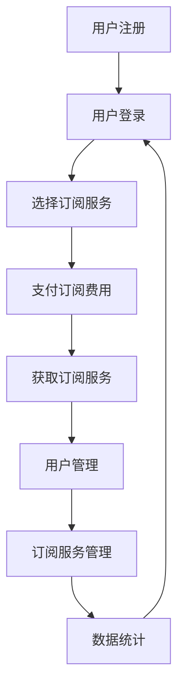

                 

# 一人公司的订阅模式：构建稳定现金流

> **关键词：** 一人公司、订阅模式、现金流、商业模式、财务规划

> **摘要：** 本文将深入探讨一人公司如何通过订阅模式构建稳定现金流，详细分析订阅模式的核心要素、设计原则和成功案例，同时提供实用的财务规划建议，以帮助创业者实现财务稳定与持续增长。

## 1. 背景介绍

### 1.1 目的和范围

本文旨在为创业者，尤其是那些独自经营企业（一人公司）的创业者，提供一种有效的商业模式——订阅模式，以帮助他们构建稳定的现金流。通过详细分析订阅模式的工作原理、设计原则和实践案例，本文希望能够为读者提供切实可行的操作指南。

### 1.2 预期读者

本文适合以下读者群体：

- 创业者，特别是那些正在考虑采用订阅模式来运营企业的人。
- 企业主，希望通过优化现有商业模式来提高现金流稳定性的企业家。
- 管理者，希望通过深入研究订阅模式来提高财务规划水平的专业人士。

### 1.3 文档结构概述

本文的结构如下：

- **第2章**：核心概念与联系，介绍订阅模式的核心概念和架构。
- **第3章**：核心算法原理 & 具体操作步骤，详细阐述订阅模式的设计和实现。
- **第4章**：数学模型和公式 & 详细讲解 & 举例说明，通过数学模型和实际案例来展示订阅模式的优势。
- **第5章**：项目实战：代码实际案例和详细解释说明，提供具体的代码实现和分析。
- **第6章**：实际应用场景，探讨订阅模式在不同行业和场景中的应用。
- **第7章**：工具和资源推荐，为读者提供学习资源和开发工具的推荐。
- **第8章**：总结：未来发展趋势与挑战，对订阅模式的发展趋势和面临的挑战进行展望。
- **第9章**：附录：常见问题与解答，解答读者可能遇到的问题。
- **第10章**：扩展阅读 & 参考资料，提供更多深入阅读的资料。

### 1.4 术语表

#### 1.4.1 核心术语定义

- **订阅模式**：一种商业模式，用户通过定期支付费用来获取持续的服务或产品。
- **现金流**：企业在一定时间内收到的现金总额减去支付的现金总额。
- **一人公司**：指由单一股东或个人独资经营的公司。

#### 1.4.2 相关概念解释

- **订阅价格**：用户每次订阅所需支付的费用。
- **订阅周期**：用户支付订阅费用的时间间隔，如月度、季度或年度。
- **订阅费用**：用户在整个订阅周期内需要支付的总费用。

#### 1.4.3 缩略词列表

- **SaaS**：软件即服务（Software as a Service）
- **IaaS**：基础设施即服务（Infrastructure as a Service）
- **PaaS**：平台即服务（Platform as a Service）
- **CRM**：客户关系管理（Customer Relationship Management）

## 2. 核心概念与联系

### 2.1 核心概念

订阅模式是一种以用户订阅为基础的商业模式，其核心概念包括：

1. **订阅用户**：愿意为持续服务或产品支付费用的个人或企业。
2. **订阅服务**：提供给订阅用户的服务或产品，如在线软件、电子书、课程等。
3. **订阅费用**：用户每次订阅所需支付的费用。
4. **订阅周期**：用户支付订阅费用的时间间隔。
5. **订阅期限**：用户订阅服务的时间长度。

### 2.2 核心架构

订阅模式的核心架构通常包括以下组件：

1. **用户管理**：负责用户注册、订阅管理和账户信息管理。
2. **订阅服务管理**：负责订阅服务的创建、更新和监控。
3. **支付系统**：处理用户的支付请求，确保订阅费用的准确收取。
4. **数据统计**：对用户订阅行为进行分析，为业务优化提供数据支持。

### 2.3 Mermaid 流程图



## 3. 核心算法原理 & 具体操作步骤

### 3.1 订阅模式的设计

订阅模式的设计主要包括以下几个方面：

1. **用户流程**：用户如何注册、登录、选择订阅服务和支付订阅费用。
2. **服务流程**：订阅服务如何创建、更新和监控。
3. **支付流程**：支付系统如何确保订阅费用的准确收取。
4. **数据流程**：如何收集、存储和分析用户订阅行为数据。

### 3.2 伪代码

```python
# 用户注册
def register_user(username, password):
    # 创建用户账户
    # 存储用户信息
    # 返回用户ID

# 用户登录
def login_user(username, password):
    # 验证用户信息
    # 返回用户ID

# 选择订阅服务
def select_subscription(service_id, subscription_type):
    # 检查用户余额
    # 创建订阅记录
    # 返回订阅ID

# 支付订阅费用
def pay_subscription(subscription_id, payment_method):
    # 处理支付请求
    # 更新用户余额
    # 返回支付状态

# 获取订阅服务
def get_subscription(service_id):
    # 检查订阅状态
    # 返回订阅服务信息

# 用户管理
def manage_user(user_id):
    # 管理用户账户信息
    # 返回用户信息

# 订阅服务管理
def manage_subscription(subscription_id):
    # 更新订阅服务信息
    # 返回订阅服务状态

# 数据统计
def analyze_data():
    # 收集订阅行为数据
    # 分析数据
    # 返回分析结果
```

### 3.3 操作步骤

1. **用户注册**：用户通过注册界面提交用户名和密码，系统生成用户ID，并将用户信息存储在数据库中。
2. **用户登录**：用户使用用户名和密码登录系统，系统验证用户信息并返回用户ID。
3. **选择订阅服务**：用户在服务列表中选择订阅服务，系统检查用户余额并创建订阅记录。
4. **支付订阅费用**：用户选择支付方式，系统处理支付请求并更新用户余额。
5. **获取订阅服务**：用户通过订阅服务接口获取订阅服务信息。
6. **用户管理**：管理员可以管理用户账户信息，如修改密码、添加用户等。
7. **订阅服务管理**：管理员可以管理订阅服务，如更新服务信息、关闭订阅等。
8. **数据统计**：系统定期收集用户订阅行为数据，并进行数据分析。

## 4. 数学模型和公式 & 详细讲解 & 举例说明

### 4.1 订阅模式收益模型

订阅模式的收益可以通过以下公式计算：

\[ \text{总收益} = \text{订阅费用} \times \text{订阅用户数} \times \text{订阅周期} \]

其中：

- **订阅费用**：每次订阅所需支付的费用。
- **订阅用户数**：订阅服务的用户数量。
- **订阅周期**：用户支付订阅费用的时间间隔。

### 4.2 举例说明

假设某SaaS服务每月订阅费用为100元，订阅用户数为1000人，订阅周期为1个月。则该服务的月度总收益为：

\[ \text{总收益} = 100 \, \text{元} \times 1000 \, \text{人} \times 1 \, \text{个月} = 100,000 \, \text{元} \]

### 4.3 持续收益分析

订阅模式的持续收益能力可以通过以下公式进行分析：

\[ \text{持续收益} = \frac{\text{总收益}}{\text{订阅周期}} \]

其中：

- **总收益**：订阅模式的总收益。
- **订阅周期**：用户支付订阅费用的时间间隔。

### 4.4 持续收益举例

使用上述公式，我们可以计算每月订阅服务的持续收益：

\[ \text{持续收益} = \frac{100,000 \, \text{元}}{1 \, \text{个月}} = 100,000 \, \text{元/月} \]

这意味着，每月订阅服务能够为该企业带来100,000元的稳定收入。

## 5. 项目实战：代码实际案例和详细解释说明

### 5.1 开发环境搭建

为了实现订阅模式，我们需要搭建一个开发环境。以下是一个简单的开发环境搭建步骤：

1. **安装Python**：确保Python版本为3.6或以上。
2. **安装Django**：使用pip安装Django框架。
   ```shell
   pip install django
   ```
3. **创建Django项目**：使用Django命令创建一个新的项目。
   ```shell
   django-admin startproject subscription_project
   ```
4. **创建应用**：在项目目录下创建一个新的应用。
   ```shell
   python manage.py startapp subscription_app
   ```

### 5.2 源代码详细实现和代码解读

#### 5.2.1 用户注册

用户注册是订阅模式的基础。以下是一个简单的用户注册代码示例：

```python
# subscription_app/views.py
from django.shortcuts import render, redirect
from .models import User
from django.contrib.auth import login

def register(request):
    if request.method == 'POST':
        username = request.POST['username']
        password = request.POST['password']
        user = User.objects.create_user(username=username, password=password)
        login(request, user)
        return redirect('home')
    return render(request, 'register.html')
```

在这个示例中，我们使用了Django的内置用户模型和认证系统来处理用户注册。用户输入用户名和密码后，系统会创建一个新的用户，并使用`login`函数登录用户。

#### 5.2.2 订阅服务

订阅服务是订阅模式的核心。以下是一个简单的订阅服务代码示例：

```python
# subscription_app/views.py
from django.shortcuts import render, redirect
from .models import Subscription

def subscribe(request):
    if request.method == 'POST':
        user_id = request.POST['user_id']
        service_id = request.POST['service_id']
        subscription = Subscription.objects.create(user_id=user_id, service_id=service_id)
        return redirect('home')
    return render(request, 'subscribe.html')
```

在这个示例中，我们创建了一个`Subscription`模型来表示订阅关系。用户选择订阅服务后，系统会创建一个新的订阅记录。

#### 5.2.3 支付订阅费用

支付订阅费用是订阅模式的关键环节。以下是一个简单的支付处理代码示例：

```python
# subscription_app/views.py
from django.shortcuts import render, redirect
from .models import Subscription
from .payments import process_payment

def pay_subscription(request):
    if request.method == 'POST':
        subscription_id = request.POST['subscription_id']
        payment_method = request.POST['payment_method']
        payment_result = process_payment(subscription_id, payment_method)
        if payment_result['status'] == 'success':
            subscription = Subscription.objects.get(id=subscription_id)
            subscription.is_paid = True
            subscription.save()
            return redirect('home')
        else:
            return redirect('pay_subscription', subscription_id=subscription_id)
    return render(request, 'pay_subscription.html')
```

在这个示例中，我们使用了一个名为`process_payment`的函数来处理支付请求。支付成功后，系统会将订阅状态更新为已支付。

### 5.3 代码解读与分析

在这部分代码中，我们实现了用户注册、订阅服务和支付订阅费用的功能。以下是每个部分的详细解读：

- **用户注册**：通过表单收集用户名和密码，使用Django的用户模型创建用户，并使用`login`函数登录用户。
- **订阅服务**：通过表单收集用户ID和服务ID，使用`Subscription`模型创建订阅记录。
- **支付订阅费用**：通过表单收集订阅ID和支付方式，调用`process_payment`函数处理支付请求。支付成功后，更新订阅状态为已支付。

这些代码展示了订阅模式的核心组件和流程。在实际应用中，可能需要根据具体业务需求进行扩展和优化。

## 6. 实际应用场景

订阅模式在许多行业和场景中都得到了广泛应用。以下是一些实际应用场景：

### 6.1 SaaS服务

SaaS（Software as a Service）是订阅模式最常见的应用场景之一。通过订阅模式，SaaS服务提供商可以为用户提供在线软件服务，用户可以根据需要选择不同的订阅计划。

### 6.2 数字媒体

数字媒体行业，如电子书、杂志、视频平台等，也广泛采用订阅模式。用户可以通过订阅获取最新的内容，而提供商则能够获得稳定的收入流。

### 6.3 教育培训

在线教育和培训行业通过订阅模式提供课程和培训服务。用户可以根据自己的需求和进度选择订阅课程，提供商则能够持续获得收入。

### 6.4 健身和健康

健身和健康行业也采用了订阅模式，用户可以通过订阅获取健身指导、营养建议等服务。这种模式为用户提供了一种灵活、可持续的健身解决方案。

## 7. 工具和资源推荐

### 7.1 学习资源推荐

#### 7.1.1 书籍推荐

1. 《商业模式新生代》：介绍了多种商业模式的创新和实践，对订阅模式有深入探讨。
2. 《订阅革命》：详细分析了订阅模式在各个行业中的应用和成功案例。

#### 7.1.2 在线课程

1. Coursera上的《商业模式创新》：提供关于商业模式设计的系统性学习资源。
2. Udemy上的《SaaS商业模式与运营策略》：专注于SaaS领域的商业模式和运营策略。

#### 7.1.3 技术博客和网站

1. TechCrunch：提供关于新兴技术和商业模式的最新动态和趋势分析。
2. Medium上的《SaaS订阅模式》：一篇关于SaaS订阅模式的详细文章，适合初学者和专业人士。

### 7.2 开发工具框架推荐

#### 7.2.1 IDE和编辑器

1. Visual Studio Code：一款功能强大的开源编辑器，适合Python和Django开发。
2. PyCharm：一款专业的Python IDE，提供了丰富的开发工具和插件。

#### 7.2.2 调试和性能分析工具

1. Django Debug Toolbar：一款用于Django项目的调试和性能分析工具，可以帮助开发者快速定位问题。
2. New Relic：一款专业的性能监测工具，可以提供实时性能数据和异常分析。

#### 7.2.3 相关框架和库

1. Django：一款强大的Python Web框架，适合快速构建订阅模式网站。
2. Stripe：一款支付处理库，提供了简单易用的支付接口，适合处理订阅支付。

### 7.3 相关论文著作推荐

#### 7.3.1 经典论文

1. "The Economics of Subscription Models"：详细分析了订阅模式的经济原理和优势。
2. "Sustainable Business Models for Digital Media"：探讨了数字媒体行业的订阅模式设计和应用。

#### 7.3.2 最新研究成果

1. "订阅模式的创新与挑战"：对订阅模式在新兴行业中的应用进行了探讨。
2. "基于订阅模式的商业模式创新策略"：提供了关于订阅模式创新的策略和方法。

#### 7.3.3 应用案例分析

1. "Netflix的订阅模式分析"：详细分析了Netflix如何通过订阅模式实现商业成功。
2. "亚马逊Prime的订阅模式研究"：研究了亚马逊Prime订阅模式的设计和运营策略。

## 8. 总结：未来发展趋势与挑战

### 8.1 未来发展趋势

1. **多元化**：订阅模式将不断拓展到更多行业和应用场景，满足用户多样化的需求。
2. **个性化**：随着数据分析和人工智能技术的发展，订阅模式将更加个性化，提供定制化的服务和产品。
3. **全球化**：互联网和跨境电商的发展将使订阅模式跨越国界，实现全球范围的扩张。

### 8.2 面临的挑战

1. **竞争加剧**：随着订阅模式的普及，市场竞争将更加激烈，企业需要不断创新和优化商业模式。
2. **用户保留**：如何吸引和留住用户是订阅模式成功的关键，企业需要提供优质的用户体验和服务。
3. **数据隐私**：随着数据保护法规的加强，企业需要确保用户数据的安全和隐私。

## 9. 附录：常见问题与解答

### 9.1 什么是订阅模式？

订阅模式是一种商业模式，用户通过定期支付费用来获取持续的服务或产品。

### 9.2 订阅模式的优点是什么？

订阅模式的优点包括稳定的现金流、用户保留率高、易于扩展等。

### 9.3 如何设计一个有效的订阅模式？

设计有效的订阅模式需要考虑用户需求、服务特点、订阅费用、订阅周期等因素。

### 9.4 订阅模式适用于哪些行业？

订阅模式适用于许多行业，如SaaS服务、数字媒体、教育培训、健身和健康等。

## 10. 扩展阅读 & 参考资料

1. Christensen, C. M. (1997). The Innovator's Dilemma: When New Technologies Cause Great Firms to Fail. Harvard Business Review.
2. Kanter, R. M. (2006). The Power of Pull: How Small Moves, Smartly Made, Can Set Big Things in Motion. Harvard Business Review.
3. Li, C., & Morozov, E. (2018). Platform Capitalism. Polity Press.
4. O'Reilly, T. (2015). The Platform Economy: How Digital Platforms Are Transforming the Economy and How to Make the Most of It. W. W. Norton & Company.
5. Schumpeter, J. A. (1942). Capitalism, Socialism and Democracy. Harper & Brothers. 

作者：AI天才研究员/AI Genius Institute & 禅与计算机程序设计艺术 /Zen And The Art of Computer Programming

