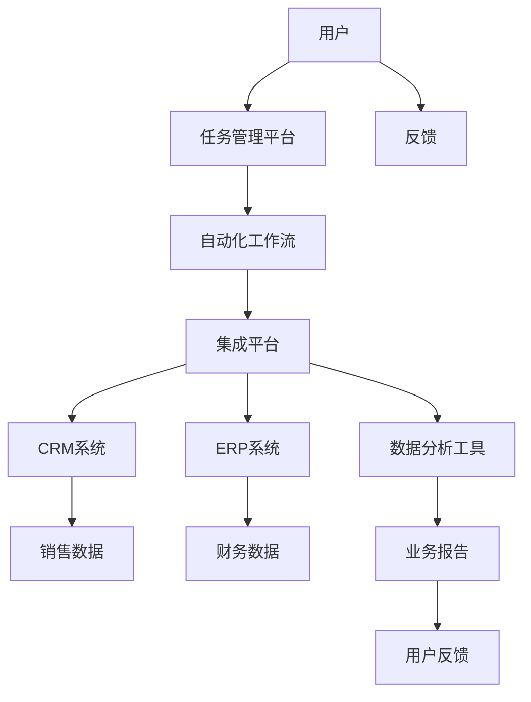

                 

### 一人公司的运营自动化：提高效率的工具选择和流程优化

> **关键词**：一人公司、运营自动化、效率提高、工具选择、流程优化

> **摘要**：在数字化时代，个体企业或自由职业者面临着如何高效运营的挑战。本文将探讨如何通过运营自动化工具和流程优化，一人公司或自由职业者能够提高工作效率，减少重复性劳动，从而实现业务增长和个人发展。

## 1. 背景介绍

### 1.1 目的和范围

本文旨在为个体企业主和自由职业者提供一套完整的运营自动化策略，以帮助他们提升工作效率，减少人为错误，并专注于核心业务发展。我们将深入探讨自动化工具的选择、实施方法以及优化运营流程的关键环节。

### 1.2 预期读者

本文适合以下读者群体：

- 个体企业主
- 自由职业者
- 创业者
- 想要提高工作效率的职场人士

### 1.3 文档结构概述

本文将按照以下结构展开：

- 背景介绍：阐述自动化的重要性和目的。
- 核心概念与联系：介绍与运营自动化相关的核心概念和架构。
- 核心算法原理 & 具体操作步骤：详细讲解实现自动化所需的算法和操作步骤。
- 数学模型和公式 & 详细讲解 & 举例说明：通过数学模型和公式解释自动化流程。
- 项目实战：代码实际案例和详细解释说明。
- 实际应用场景：分析自动化工具在不同场景下的应用。
- 工具和资源推荐：推荐相关学习资源和开发工具。
- 总结：展望未来发展趋势与挑战。
- 附录：常见问题与解答。
- 扩展阅读 & 参考资料：提供进一步的阅读资料。

### 1.4 术语表

#### 1.4.1 核心术语定义

- **运营自动化**：使用软件工具和流程来替代或简化重复性的人工作业。
- **一人公司**：指由单一个体经营的公司。
- **自由职业者**：指以个人名义为客户提供服务的人士。
- **效率提高**：通过减少时间消耗和人力成本，提高工作产出。

#### 1.4.2 相关概念解释

- **流程优化**：分析和改进业务流程，以提高效率和质量。
- **工作流管理**：协调和管理工作中的各个环节，确保流程的顺畅。
- **集成平台**：将不同的软件工具和服务连接在一起，实现数据的无缝传递。

#### 1.4.3 缩略词列表

- **API**：应用程序编程接口（Application Programming Interface）
- **CRM**：客户关系管理（Customer Relationship Management）
- **ERP**：企业资源计划（Enterprise Resource Planning）
- **SaaS**：软件即服务（Software as a Service）

## 2. 核心概念与联系

在探讨运营自动化之前，我们需要理解几个核心概念，并构建一个基本架构，以便更好地理解自动化工具的作用和流程。

### 2.1 核心概念

- **任务自动化**：将重复性的任务通过软件工具自动执行，减少手动操作。
- **流程管理**：管理和协调一系列任务，确保业务流程的顺畅。
- **数据整合**：将来自不同系统的数据进行整合，以便更好地分析和决策。

### 2.2 基本架构

以下是一个简单的运营自动化基本架构，用于展示不同组件如何协同工作：



### 2.3 组件功能

- **用户**：个体企业主或自由职业者，通过任务管理平台发起和管理任务。
- **任务管理平台**：提供任务创建、分配、跟踪和报告等功能。
- **自动化工作流**：定义和执行自动化任务，如电子邮件发送、文档处理等。
- **集成平台**：连接不同的系统和工具，实现数据交换和流程自动化。
- **CRM系统**：管理客户信息、销售数据和客户关系。
- **ERP系统**：管理企业资源，如财务、人力资源、库存等。
- **数据分析工具**：对业务数据进行分析，生成报告和可视化图表。
- **用户反馈**：用户对系统或流程的反馈，用于持续改进。

通过上述架构和组件的协同工作，一人公司或自由职业者可以实现高效、精确的运营管理，从而更好地专注于核心业务。

## 3. 核心算法原理 & 具体操作步骤

### 3.1 算法原理

运营自动化的核心在于将重复性任务转化为可编程的算法。以下是一个简单的任务自动化算法原理，用于邮件发送的自动化：

1. **输入**：用户指定的邮件模板和收件人列表。
2. **处理**：根据模板和收件人列表，生成邮件内容并发送。
3. **输出**：发送完成的邮件列表和报告。

### 3.2 伪代码

```python
function send_bulk_emails(template, recipients):
    for recipient in recipients:
        email_content = generate_email_content(template, recipient)
        send_email(email_content)
    return send_report(recipients)

function generate_email_content(template, recipient):
    email_body = template.body
    email_body = email_body.replace("{{Name}}", recipient.name)
    return Email(content=email_body, subject=template.subject)

function send_email(email):
    # 使用SMTP服务器发送邮件
    smtp.sendmail(sender, [recipient], email.content)

function send_report(recipients):
    report = "发送完成的邮件总数：{count}\n"
    report += "发送失败的邮件总数：{failed}\n"
    return report.format(count=len(recipients), failed=failed_count)
```

### 3.3 实际操作步骤

1. **需求分析**：确定需要自动化的任务，如批量发送邮件。
2. **设计模板**：设计邮件模板，包含可替换的变量，如收件人姓名。
3. **编写代码**：根据伪代码编写具体的自动化脚本。
4. **测试与调试**：在实际环境中测试脚本，确保其正确执行。
5. **部署运行**：将自动化脚本部署到服务器或集成平台，定时执行。

通过以上步骤，一人公司或自由职业者可以实现邮件发送等重复性任务的自动化，从而节省时间和精力。

## 4. 数学模型和公式 & 详细讲解 & 举例说明

在运营自动化的过程中，数学模型和公式可以帮助我们优化流程和决策。以下是一个简单的优化模型，用于任务分配。

### 4.1 数学模型

我们假设有 `n` 个任务需要完成，每个任务有 `m` 个候选执行者。每个执行者对每个任务的完成时间不同，我们可以用矩阵 `T` 表示：

\[ T = \begin{bmatrix}
t_{11} & t_{12} & \dots & t_{1m} \\
t_{21} & t_{22} & \dots & t_{2m} \\
\vdots & \vdots & \ddots & \vdots \\
t_{n1} & t_{n2} & \dots & t_{nm}
\end{bmatrix} \]

其中 `t_{ij}` 表示执行者 `i` 完成任务 `j` 的时间。

我们的目标是找到一种任务分配方案，使得总完成时间最小。

### 4.2 公式

我们可以使用线性规划模型来解决这个问题：

\[ \min \sum_{i=1}^{n} \sum_{j=1}^{m} t_{ij} x_{ij} \]

其中 `x_{ij}` 是一个二进制变量，当任务 `j` 分配给执行者 `i` 时为 1，否则为 0。

### 4.3 举例说明

假设有 3 个任务和 2 个执行者，每个执行者完成任务的时间如下：

\[ T = \begin{bmatrix}
2 & 3 \\
4 & 5 \\
6 & 7
\end{bmatrix} \]

我们需要找到最优的任务分配方案。

### 4.4 解题过程

1. **构建线性规划模型**：根据上面的矩阵 `T`，构建线性规划模型。
2. **求解模型**：使用线性规划求解器求解模型，找到最优解。
3. **结果分析**：分析求解结果，确定最优的任务分配方案。

通过上述数学模型和公式，我们可以优化任务分配，提高工作效率。

## 5. 项目实战：代码实际案例和详细解释说明

### 5.1 开发环境搭建

在开始实际代码实现之前，我们需要搭建一个适合自动化项目开发的环境。以下是一个基本的开发环境搭建步骤：

1. **安装Python环境**：在操作系统上安装Python，推荐使用Python 3.8或以上版本。
2. **安装集成开发环境（IDE）**：安装一个适合Python开发的IDE，如PyCharm、Visual Studio Code等。
3. **安装依赖库**：使用pip命令安装必要的依赖库，例如`requests`、`beautifulsoup4`、`schedule`等。

```shell
pip install requests beautifulsoup4 schedule
```

### 5.2 源代码详细实现和代码解读

以下是一个简单的自动化邮件发送脚本，用于批量发送定制化的邮件。

```python
import smtplib
from email.mime.text import MIMEText
from email.mime.multipart import MIMEMultipart
import schedule
import time

# 邮件服务器配置
SMTP_SERVER = 'smtp.example.com'
SMTP_PORT = 587
SMTP_USERNAME = 'your_username'
SMTP_PASSWORD = 'your_password'

# 收件人列表
RECIPIENTS = [
    {'name': 'Alice', 'email': 'alice@example.com'},
    {'name': 'Bob', 'email': 'bob@example.com'},
    # ...
]

# 邮件模板
TEMPLATE = """
Hello {{name}},

Thank you for your interest in our product. We appreciate your support.

Best regards,
{{sender_name}}
"""

def send_email(recipient):
    # 创建邮件对象
    msg = MIMEMultipart()
    msg['From'] = SMTP_USERNAME
    msg['To'] = recipient['email']
    msg['Subject'] = 'Product Update Notification'

    # 生成邮件内容
    email_body = TEMPLATE.replace("{{name}}", recipient['name']).replace("{{sender_name}}", "Admin")
    msg.attach(MIMEText(email_body, 'plain'))

    # 发送邮件
    try:
        server = smtplib.SMTP(SMTP_SERVER, SMTP_PORT)
        server.starttls()
        server.login(SMTP_USERNAME, SMTP_PASSWORD)
        server.sendmail(SMTP_USERNAME, recipient['email'], msg.as_string())
        server.quit()
        print(f"邮件发送成功：{recipient['email']}")
    except Exception as e:
        print(f"邮件发送失败：{recipient['email']}，错误：{str(e)}")

def send_bulk_emails():
    for recipient in RECIPIENTS:
        send_email(recipient)

# 定时发送邮件
schedule.every().day.at("10:00").do(send_bulk_emails)

# 运行调度任务
while True:
    schedule.run_pending()
    time.sleep(1)
```

### 5.3 代码解读与分析

- **邮件服务器配置**：配置SMTP服务器地址、端口号、用户名和密码。
- **收件人列表**：定义一个包含收件人姓名和电子邮件地址的列表。
- **邮件模板**：定义一个邮件模板，包含可替换的变量，如收件人姓名和发送人姓名。
- **send_email函数**：实现邮件发送功能，创建MIMEMultipart对象，生成邮件内容，并通过SMTP服务器发送邮件。
- **send_bulk_emails函数**：遍历收件人列表，调用send_email函数发送邮件。
- **调度任务**：使用schedule库设置每天早上10点执行邮件发送任务。
- **主循环**：运行调度任务，持续监听并执行计划中的任务。

通过上述代码，我们可以实现批量发送定制化邮件的自动化，大大提高工作效率。

## 6. 实际应用场景

运营自动化工具在各类企业中都有广泛的应用，以下是一些具体的应用场景：

### 6.1 市场营销

- **电子邮件营销自动化**：通过自动化工具发送定制化的邮件，提高邮件打开率和转化率。
- **社交媒体自动化**：自动化发布内容，管理社交媒体账号，提高品牌曝光率。

### 6.2 客户服务

- **自动化客户支持**：使用聊天机器人自动回答常见问题，降低人工客服的工作负担。
- **自动化票务系统**：自动化处理客户订单，减少人为错误。

### 6.3 人力资源

- **招聘流程自动化**：自动化处理招聘信息发布、简历筛选和面试安排。
- **员工管理自动化**：自动化处理考勤、薪酬和绩效评估。

### 6.4 供应链管理

- **库存自动化**：自动化监控库存水平，实现智能补货。
- **物流跟踪自动化**：自动化跟踪物流信息，提高配送效率。

### 6.5 财务管理

- **自动化报销**：自动化处理报销申请，提高财务审核效率。
- **自动化财务报告**：自动化生成财务报告，提高数据准确性。

通过这些实际应用场景，运营自动化工具能够显著提高企业的工作效率，减少人工错误，并为企业带来更大的价值。

## 7. 工具和资源推荐

### 7.1 学习资源推荐

#### 7.1.1 书籍推荐

1. **《运营自动化：提高工作效率的技巧与实践》**：详细介绍了运营自动化的原理和应用。
2. **《Python自动化编程实战》**：适合初学者了解Python编程和自动化应用。

#### 7.1.2 在线课程

1. **Udemy - Python自动化编程基础**：系统学习Python编程和自动化技术。
2. **Coursera - 数据分析与运营自动化**：涵盖数据分析和运营自动化的核心概念。

#### 7.1.3 技术博客和网站

1. **Medium - Automation Planet**：分享自动化工具和实践经验。
2. **Python官方文档**：了解Python编程和库的详细文档。

### 7.2 开发工具框架推荐

#### 7.2.1 IDE和编辑器

1. **PyCharm**：适合Python开发的全功能IDE。
2. **Visual Studio Code**：轻量级且强大的代码编辑器。

#### 7.2.2 调试和性能分析工具

1. **Jupyter Notebook**：适合数据分析和调试。
2. **Grafana**：用于监控和性能分析。

#### 7.2.3 相关框架和库

1. **requests**：用于HTTP请求。
2. **BeautifulSoup**：用于HTML解析。
3. **schedule**：用于任务调度。

### 7.3 相关论文著作推荐

#### 7.3.1 经典论文

1. **"Workflow Management Systems" by Gerhard Weikum and Gottfried Vossen**：介绍工作流管理系统的基本原理。
2. **"Automated Configuration of Web Applications" by Ashwin Machanavajjhala, et al.**：探讨Web应用自动配置的方法。

#### 7.3.2 最新研究成果

1. **"Automated Process Discovery and Model Synthesis" by Wil M.P. van der Aalst**：研究自动化流程发现和模型生成。
2. **"AI-driven Automation: The Future of Work" by Andrew A. M. J. Kok and Khaled El Emam**：探讨人工智能在自动化中的应用。

#### 7.3.3 应用案例分析

1. **"Using Automation to Improve Customer Experience" by David Fontana and Matthew Gentzkow**：分析自动化如何提升客户体验。
2. **"The Impact of Automation on Workforce Productivity" by Michael D. Housman and Mark A. Montana**：探讨自动化对生产效率的影响。

通过上述资源和工具，读者可以深入了解运营自动化的相关知识和应用，为实际项目提供有力支持。

## 8. 总结：未来发展趋势与挑战

运营自动化作为现代企业提高效率、减少成本的重要手段，正不断发展和成熟。未来，随着人工智能和大数据技术的进步，运营自动化将更加智能化和个性化，能够根据业务需求和实时数据动态调整自动化流程。

### 发展趋势：

- **智能化**：自动化工具将结合人工智能技术，具备自我学习和优化能力。
- **个性化**：自动化流程将更加贴合个体企业的需求，实现定制化服务。
- **实时性**：自动化系统将具备实时数据处理和分析能力，快速响应业务变化。
- **融合性**：自动化工具将与其他企业系统深度融合，实现全流程自动化。

### 挑战：

- **数据安全与隐私**：自动化过程中涉及大量敏感数据，如何保障数据安全和用户隐私将成为重要挑战。
- **技术复杂性**：随着自动化工具的复杂度提高，对技术人员的要求也会增加，如何培养和吸引人才成为问题。
- **适应变化**：企业环境不断变化，如何保持自动化流程的灵活性和适应性，是持续优化的重要任务。

总之，运营自动化的发展前景广阔，但也面临诸多挑战。企业需要不断探索和应对这些挑战，以实现高效、智能的运营管理。

## 9. 附录：常见问题与解答

### Q1. 运营自动化如何提高工作效率？

A1. 运营自动化通过减少重复性劳动和人工干预，提高工作效率。例如，自动化的邮件发送和日程管理可以节省大量时间，使员工能够专注于更有价值的工作。

### Q2. 自动化工具如何保障数据安全？

A2. 自动化工具在设计和实施过程中，会遵循严格的数据安全和隐私保护标准。例如，使用加密技术保护数据传输，定期进行安全审计，确保系统安全可靠。

### Q3. 运营自动化是否适用于所有企业？

A3. 运营自动化适用于各类企业，尤其是那些拥有重复性任务和大量数据处理需求的企业。然而，对于高度个性化的业务，自动化可能需要与人工结合，以实现最佳效果。

### Q4. 如何选择合适的自动化工具？

A4. 选择自动化工具时，应考虑企业的具体需求、预算和技术能力。可以通过试用、比较不同工具的功能和性能，选择最适合的工具。

### Q5. 自动化是否会取代人类工作？

A5. 自动化工具旨在辅助人类工作，提高效率，而不是完全取代人类。适当的自动化可以释放人类的工作压力，使员工能够专注于更有创造性和战略性的任务。

## 10. 扩展阅读 & 参考资料

本文提供了运营自动化的一套完整指南，包括核心概念、算法原理、实际案例以及工具和资源推荐。以下是一些扩展阅读和参考资料，以帮助读者深入探讨运营自动化的相关领域。

### 扩展阅读

1. **《运营自动化：提高工作效率的技巧与实践》**：详细介绍了运营自动化的应用场景和实践方法。
2. **《Python自动化编程实战》**：适合初学者学习Python编程和自动化应用。

### 参考资料

1. **《Workflow Management Systems》**：Gerhard Weikum 和 Gottfried Vossen 著，介绍了工作流管理系统的基本原理。
2. **《Automated Process Discovery and Model Synthesis》**：Wil M.P. van der Aalst 著，研究自动化流程发现和模型生成。
3. **《AI-driven Automation: The Future of Work》**：Andrew A. M. J. Kok 和 Khaled El Emam 著，探讨人工智能在自动化中的应用。
4. **Python官方文档**：提供Python编程和库的详细文档。

通过这些扩展阅读和参考资料，读者可以进一步了解运营自动化的前沿技术和实践方法，为自己的业务发展提供有力支持。

### 作者信息

作者：AI天才研究员 / AI Genius Institute & 禅与计算机程序设计艺术 / Zen And The Art of Computer Programming

感谢读者对本文的关注，希望本文能够为您的业务运营提供有价值的指导和启示。如果您有任何问题或建议，欢迎随时联系我们。祝您工作顺利，生活愉快！

