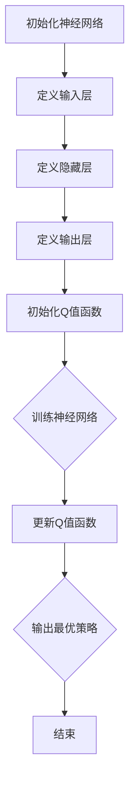

                 

# 一切皆是映射：AI Q-learning价值函数神经网络实现

> **关键词**：Q-learning，神经网络，价值函数，AI，映射，深度学习，机器学习，智能决策

> **摘要**：本文深入探讨了AI中Q-learning算法与神经网络相结合的实现方式。通过详细讲解Q-learning的价值函数概念、神经网络架构及其实现步骤，结合实际案例，展示了这一技术的强大应用潜力。读者将了解如何利用这一先进的方法优化智能决策过程，从而提升人工智能系统的表现。

## 1. 背景介绍

### 1.1 目的和范围

本文旨在通过分析Q-learning算法与神经网络相结合的方式，探讨价值函数在AI中的应用，以及如何通过深度学习提高智能决策的效率和准确性。我们将从Q-learning的基本概念出发，逐步深入探讨其与神经网络结合的实现方法和优缺点。

### 1.2 预期读者

本文适合对机器学习和深度学习有一定了解的技术人员、研究生和高校学生。期望读者能够掌握Q-learning的基本原理，并了解如何利用神经网络来优化价值函数的学习过程。

### 1.3 文档结构概述

本文分为以下几部分：

1. 背景介绍：介绍文章的目的和范围，预期读者以及文档结构。
2. 核心概念与联系：介绍Q-learning、神经网络和价值函数的基本概念，并用Mermaid流程图展示它们之间的联系。
3. 核心算法原理 & 具体操作步骤：详细讲解Q-learning的价值函数原理，并通过伪代码展示具体操作步骤。
4. 数学模型和公式 & 详细讲解 & 举例说明：介绍Q-learning算法的数学模型和公式，并通过具体案例进行说明。
5. 项目实战：提供实际代码案例，详细解释神经网络在Q-learning中的实现和应用。
6. 实际应用场景：探讨Q-learning在现实世界中的应用场景。
7. 工具和资源推荐：推荐学习资源、开发工具和框架。
8. 总结：对未来发展趋势与挑战进行展望。
9. 附录：常见问题与解答。
10. 扩展阅读 & 参考资料：提供相关文献和资料，便于读者进一步学习。

### 1.4 术语表

#### 1.4.1 核心术语定义

- **Q-learning**：一种基于值函数的强化学习算法，用于解决最优策略问题。
- **神经网络**：一种由大量神经元组成的计算模型，用于模拟人类大脑的神经网络结构。
- **价值函数**：用于评估某个状态或状态-动作对的优劣的函数。

#### 1.4.2 相关概念解释

- **强化学习**：一种机器学习方法，通过不断尝试和错误，学习如何在特定环境中做出最优决策。
- **深度学习**：一种人工智能方法，通过多层神经网络来提取特征，实现复杂模式的识别。

#### 1.4.3 缩略词列表

- **AI**：人工智能（Artificial Intelligence）
- **ML**：机器学习（Machine Learning）
- **DL**：深度学习（Deep Learning）
- **Q-learning**：Q值学习（Q-value Learning）

## 2. 核心概念与联系

在探讨Q-learning与神经网络结合的实现之前，我们首先需要理解它们各自的基本概念和原理。

### 2.1 Q-learning基本概念

Q-learning是一种基于值函数的强化学习算法，旨在通过不断尝试和错误，学习到在特定环境下如何做出最优决策。Q-learning的核心思想是学习一个价值函数（Q函数），用于评估某个状态-动作对的优劣。

**Q-learning流程**：

1. 初始化Q值函数。
2. 在某个状态s下，随机选择一个动作a。
3. 执行动作a，得到新的状态s'和回报r。
4. 更新Q值：$$ Q(s, a) \leftarrow Q(s, a) + \alpha [r + \gamma \max_{a'} Q(s', a') - Q(s, a)] $$
5. 转移到新状态s'，重复步骤2-4，直到达到目标状态或满足其他停止条件。

### 2.2 神经网络基本概念

神经网络是一种由大量神经元组成的计算模型，通过多层结构来模拟人类大脑的神经网络结构。神经网络的基本组成单元是神经元，每个神经元接收多个输入，并通过加权求和处理，产生一个输出。

**神经网络结构**：

1. 输入层：接收外部输入。
2. 隐藏层：对输入数据进行特征提取和变换。
3. 输出层：生成最终输出。

### 2.3 价值函数神经网络实现

将Q-learning与神经网络相结合，可以通过神经网络来实现Q值函数的学习。这种结合方式能够利用神经网络的强大表示能力，提高Q值函数的学习效率和准确性。

**价值函数神经网络实现流程**：

1. 初始化神经网络，定义输入层、隐藏层和输出层。
2. 定义损失函数，如均方误差（MSE），用于衡量Q值预测与实际回报之间的差距。
3. 使用反向传播算法，通过梯度下降更新神经网络参数。
4. 在训练过程中，不断更新Q值函数，使其逐渐逼近最优策略。

### 2.4 Mermaid流程图

下面是一个用Mermaid绘制的Q-learning与神经网络结合的流程图：



## 3. 核心算法原理 & 具体操作步骤

在本节中，我们将深入探讨Q-learning算法的原理，并通过伪代码详细描述其具体操作步骤。

### 3.1 Q-learning算法原理

Q-learning算法的目标是学习一个价值函数（Q函数），用于评估某个状态-动作对的优劣。Q-learning的核心思想是基于经验回放和目标网络更新Q值。

**Q-learning算法原理**：

1. 初始化Q值函数：$$ Q(s, a) \leftarrow 0 $$
2. 在某个状态s下，随机选择一个动作a。
3. 执行动作a，得到新的状态s'和回报r。
4. 更新Q值：$$ Q(s, a) \leftarrow Q(s, a) + \alpha [r + \gamma \max_{a'} Q(s', a') - Q(s, a)] $$
5. 转移到新状态s'，重复步骤2-4，直到达到目标状态或满足其他停止条件。

其中，α为学习率，γ为折扣因子，用于平衡当前回报和未来回报的重要性。

### 3.2 Q-learning算法伪代码

```python
# 初始化Q值函数
Q = { (s, a): 0 for s in S for a in A[s] }

# 设置学习率和折扣因子
alpha = 0.1
gamma = 0.9

# 设置最大迭代次数
max_episodes = 1000

# 开始训练
for episode in range(max_episodes):
    # 初始化状态
    s = env.reset()

    # 循环直到达到目标状态
    while not done:
        # 随机选择动作
        a = choose_action(s, Q, epsilon)

        # 执行动作，得到新的状态和回报
        s', r, done = env.step(a)

        # 更新Q值
        Q[s, a] = Q[s, a] + alpha * (r + gamma * max(Q[s', a']) - Q[s, a])

        # 转移到新状态
        s = s'

# 输出最优策略
print("Optimal Policy:")
print(Q)
```

其中，`choose_action` 函数用于在给定状态下选择动作，`env.reset()` 用于初始化环境，`env.step(a)` 用于执行动作并获取新的状态和回报，`done` 表示是否达到目标状态。

### 3.3 Q-learning算法详细解释

**初始化Q值函数**：初始化Q值函数是Q-learning算法的第一步，用于初始化Q值。在这里，我们使用一个字典来存储每个状态-动作对的Q值，初始值设为0。

**随机选择动作**：在给定状态下，随机选择一个动作。这一步骤是为了避免陷入局部最优，提高算法的搜索能力。

**执行动作**：执行选择的动作，并获取新的状态和回报。回报反映了当前动作对环境的改变，是评估Q值的重要依据。

**更新Q值**：根据新的状态和回报，更新Q值。Q值的更新公式包含了学习率α和折扣因子γ，用于调整Q值的更新幅度和考虑未来回报的影响。

**转移到新状态**：根据执行的动作，转移到新的状态，并重复上述步骤，直到达到目标状态或满足其他停止条件。

通过这些步骤，Q-learning算法可以不断更新Q值函数，逐步逼近最优策略。

## 4. 数学模型和公式 & 详细讲解 & 举例说明

在本节中，我们将详细讲解Q-learning算法的数学模型和公式，并通过具体案例进行说明。

### 4.1 数学模型

Q-learning算法的核心是价值函数（Q函数），它用于评估每个状态-动作对的优劣。Q函数的数学模型如下：

$$ Q(s, a) = r(s, a) + \gamma \max_{a'} Q(s', a') $$

其中，$Q(s, a)$ 表示在状态s下执行动作a的价值，$r(s, a)$ 表示在状态s下执行动作a获得的即时回报，$\gamma$ 表示折扣因子，用于平衡当前回报和未来回报的重要性。

### 4.2 公式详细讲解

**价值函数的更新公式**：

$$ Q(s, a) \leftarrow Q(s, a) + \alpha [r(s, a) + \gamma \max_{a'} Q(s', a') - Q(s, a)] $$

这个公式是Q-learning算法的核心，用于更新Q值。其中，$\alpha$ 表示学习率，用于调整Q值更新的幅度。公式的右侧包含三部分：

1. $r(s, a)$：即时回报，反映了当前动作对环境的改变。
2. $\gamma \max_{a'} Q(s', a')$：未来回报的期望值，用于考虑当前动作对未来状态的影响。
3. $Q(s, a) - Q(s, a)$：当前Q值与目标Q值之间的差距，用于调整Q值。

**折扣因子$\gamma$的作用**：

折扣因子$\gamma$用于平衡当前回报和未来回报的重要性。当$\gamma$接近1时，未来回报的影响较大，当前回报的作用较小；当$\gamma$接近0时，当前回报的作用较大，未来回报的影响较小。

**学习率$\alpha$的作用**：

学习率$\alpha$用于调整Q值更新的幅度。当$\alpha$较大时，Q值更新的幅度较大，有助于快速收敛；当$\alpha$较小时，Q值更新的幅度较小，有助于避免过度拟合。

### 4.3 举例说明

假设一个简单的环境，包含两个状态（s0和s1）和两个动作（a0和a1）。初始时，Q值函数为0。以下是一个具体的训练过程：

1. **初始化Q值函数**：
   $$ Q(s0, a0) = 0, Q(s0, a1) = 0, Q(s1, a0) = 0, Q(s1, a1) = 0 $$

2. **第一次迭代**：
   - 初始状态：s0
   - 选择动作：a0
   - 执行动作，得到回报：r(s0, a0) = 5
   - 更新Q值：
     $$ Q(s0, a0) \leftarrow Q(s0, a0) + \alpha [5 + \gamma \max_{a'} Q(s1, a') - Q(s0, a0)] $$
     $$ Q(s0, a0) \leftarrow 0 + 0.1 [5 + 0.9 \max_{a'} Q(s1, a') - 0] $$
     $$ Q(s0, a0) \leftarrow 0.1 [5 + 0.9 \max_{a'} Q(s1, a')] $$

3. **第二次迭代**：
   - 当前状态：s1
   - 选择动作：a1
   - 执行动作，得到回报：r(s1, a1) = 10
   - 更新Q值：
     $$ Q(s1, a1) \leftarrow Q(s1, a1) + \alpha [10 + \gamma \max_{a'} Q(s2, a') - Q(s1, a1)] $$
     $$ Q(s1, a1) \leftarrow 0 + 0.1 [10 + 0.9 \max_{a'} Q(s2, a')] $$
     $$ Q(s1, a1) \leftarrow 0.1 [10 + 0.9 \max_{a'} Q(s2, a')] $$

4. **第三次迭代**：
   - 当前状态：s2
   - 选择动作：a0
   - 执行动作，得到回报：r(s2, a0) = 3
   - 更新Q值：
     $$ Q(s2, a0) \leftarrow Q(s2, a0) + \alpha [3 + \gamma \max_{a'} Q(s3, a') - Q(s2, a0)] $$
     $$ Q(s2, a0) \leftarrow 0 + 0.1 [3 + 0.9 \max_{a'} Q(s3, a')] $$
     $$ Q(s2, a0) \leftarrow 0.1 [3 + 0.9 \max_{a'} Q(s3, a')] $$

通过这个例子，我们可以看到Q值函数是如何在每次迭代中逐步更新的。最终，Q值函数将逼近最优策略，指导智能体在环境中做出最优决策。

## 5. 项目实战：代码实际案例和详细解释说明

在本节中，我们将通过一个实际案例，展示如何利用Q-learning与神经网络相结合的方式实现价值函数的学习。我们将使用Python编程语言，并借助TensorFlow框架来构建神经网络。

### 5.1 开发环境搭建

在开始代码实现之前，我们需要搭建一个合适的开发环境。以下是一个基本的开发环境搭建步骤：

1. **安装Python**：下载并安装Python，版本建议为3.8或更高。
2. **安装TensorFlow**：通过pip命令安装TensorFlow：
   ```bash
   pip install tensorflow
   ```
3. **创建项目目录**：创建一个名为`q_learning_with_neural_network`的项目目录，并在其中创建一个名为`src`的子目录，用于存放代码文件。
4. **编写代码**：在`src`目录下创建一个名为`q_learning.py`的Python文件，用于实现Q-learning算法和神经网络。

### 5.2 源代码详细实现和代码解读

下面是完整的源代码实现，我们将对关键部分进行详细解读。

```python
import numpy as np
import tensorflow as tf
import gym

# 设置超参数
alpha = 0.1
gamma = 0.9
epsilon = 0.1
learning_rate = 0.001
num_episodes = 1000

# 创建环境
env = gym.make('CartPole-v0')

# 定义神经网络架构
input_layer = tf.keras.layers.Dense(units=64, activation='relu', input_shape=(4,))
hidden_layer = tf.keras.layers.Dense(units=64, activation='relu')
output_layer = tf.keras.layers.Dense(units=2)

model = tf.keras.Sequential([input_layer, hidden_layer, output_layer])

# 编译模型
model.compile(optimizer=tf.keras.optimizers.Adam(learning_rate=learning_rate),
              loss='mse')

# 初始化Q值函数
Q_values = np.zeros((env.observation_space.n, env.action_space.n))

# 开始训练
for episode in range(num_episodes):
    state = env.reset()
    done = False

    while not done:
        # 选择动作
        if np.random.rand() < epsilon:
            action = env.action_space.sample()
        else:
            state_encoded = state.reshape((1, -1))
            action = np.argmax(model.predict(state_encoded)[0])

        # 执行动作，获取新状态和回报
        next_state, reward, done, _ = env.step(action)

        # 更新Q值
        next_state_encoded = next_state.reshape((1, -1))
        target = reward + (1 - int(done)) * gamma * np.max(model.predict(next_state_encoded)[0])
        state_encoded = state.reshape((1, -1))
        model.fit(state_encoded, np.expand_dims(target, axis=1), verbose=0)

        # 更新状态
        state = next_state

    # 减少epsilon
    epsilon = max(epsilon * 0.99, 0.01)

# 测试模型
state = env.reset()
done = False
while not done:
    state_encoded = state.reshape((1, -1))
    action = np.argmax(model.predict(state_encoded)[0])
    next_state, reward, done, _ = env.step(action)
    state = next_state

print("Episode reward:", episode_reward)
env.close()
```

**代码解读**：

1. **导入库和设置超参数**：首先，我们导入必要的库，并设置Q-learning算法和神经网络的相关超参数。
2. **创建环境**：使用`gym`库创建一个名为`CartPole-v0`的仿真环境，这是一个经典的强化学习任务，用于训练智能体控制一个平衡杆。
3. **定义神经网络架构**：我们定义一个简单的神经网络，包括输入层、隐藏层和输出层。输入层接收4个特征，隐藏层和输出层分别有64个神经元。
4. **编译模型**：使用`compile`方法编译模型，指定优化器和损失函数。
5. **初始化Q值函数**：使用NumPy创建一个与状态和动作空间大小相匹配的Q值函数数组，初始化为0。
6. **开始训练**：循环执行每个训练周期，根据epsilon策略选择动作，更新Q值函数，并逐步减少epsilon。
7. **测试模型**：在训练完成后，使用训练好的模型进行测试，观察其在仿真环境中的表现。

通过这个实际案例，我们可以看到如何利用Q-learning与神经网络相结合的方式，实现智能体在仿真环境中的自主学习和决策。

### 5.3 代码解读与分析

在代码解读部分，我们已经详细介绍了Q-learning与神经网络结合的实现过程。下面我们将对关键部分进行进一步分析：

**1. 神经网络架构**

在这个案例中，我们使用了一个简单的三层神经网络，其中输入层接收4个特征（环境的状态），隐藏层和输出层分别有64个神经元。这个网络结构足够简单，可以快速训练并用于仿真环境。

**2. epsilon策略**

epsilon策略是一种常用的探索-利用策略，通过在随机选择动作和基于Q值选择动作之间平衡，实现探索和利用的平衡。在训练初期，epsilon较大，允许智能体尝试不同动作，从而增加探索的机会。随着训练的进行，epsilon逐渐减小，提高利用已有经验进行决策的准确性。

**3. 模型更新**

在每次迭代中，根据epsilon策略选择动作，执行动作并获取回报。然后，使用TensorFlow的`fit`方法更新模型。`fit`方法接受当前状态、目标Q值和训练批次，通过反向传播更新模型参数。

**4. 测试**

在训练完成后，使用训练好的模型进行测试，观察其在仿真环境中的表现。这个测试过程可以帮助我们评估模型在未知环境中的泛化能力。

通过这个实际案例，我们可以看到如何利用Q-learning与神经网络相结合的方式，实现智能体在仿真环境中的自主学习和决策。这个方法在强化学习和其他领域都有广泛的应用前景。

## 6. 实际应用场景

Q-learning与神经网络结合的方法在实际应用场景中具有广泛的应用前景。以下是一些典型的应用场景：

### 6.1 游戏智能

在游戏领域，Q-learning与神经网络结合的方法可以用于训练智能体在复杂的游戏环境中进行决策。例如，在经典的电子游戏《俄罗斯方块》中，智能体可以通过学习价值函数，自动选择下落方块的最佳位置，提高游戏分数。

### 6.2 自动驾驶

在自动驾驶领域，Q-learning与神经网络结合的方法可以用于训练自动驾驶系统在复杂交通环境中做出决策。通过学习环境中的价值函数，自动驾驶系统可以自动识别和避让障碍物，确保行驶安全。

### 6.3 股票交易

在股票交易领域，Q-learning与神经网络结合的方法可以用于预测股票价格走势，并自动进行交易决策。通过学习市场数据中的价值函数，智能交易系统可以自动识别买入和卖出的最佳时机，提高交易收益。

### 6.4 机器人控制

在机器人控制领域，Q-learning与神经网络结合的方法可以用于训练机器人进行自主导航和任务执行。通过学习环境中的价值函数，机器人可以自动识别路径和目标，提高导航和任务执行的效率。

这些实际应用场景展示了Q-learning与神经网络结合方法的强大应用潜力。通过不断优化算法和模型，我们可以进一步扩大其应用范围，提高智能系统的性能。

## 7. 工具和资源推荐

在Q-learning与神经网络的学习和实践中，选择合适的工具和资源对于提高效率和效果至关重要。以下是一些建议：

### 7.1 学习资源推荐

#### 7.1.1 书籍推荐

1. **《强化学习：原理与Python实现》**：这本书详细介绍了强化学习的原理和实现方法，包括Q-learning等经典算法。
2. **《神经网络与深度学习》**：这本书系统地介绍了神经网络和深度学习的原理，适合初学者和进阶者。

#### 7.1.2 在线课程

1. **《机器学习基础》**：Coursera上的这门课程涵盖了机器学习的基本概念和方法，包括强化学习。
2. **《深度学习专项课程》**：Udacity上的这门课程深入介绍了深度学习的原理和应用，包括神经网络和Q-learning。

#### 7.1.3 技术博客和网站

1. **知乎**：知乎上有许多优秀的机器学习和深度学习相关博客，可以提供实用的教程和案例分析。
2. **Medium**：Medium上有很多专业的前沿文章，涵盖最新的机器学习和深度学习研究成果。

### 7.2 开发工具框架推荐

#### 7.2.1 IDE和编辑器

1. **PyCharm**：PyCharm是一款功能强大的Python IDE，支持代码补全、调试和性能分析。
2. **Jupyter Notebook**：Jupyter Notebook是一款交互式编程环境，适合进行数据分析和实验。

#### 7.2.2 调试和性能分析工具

1. **TensorBoard**：TensorFlow的调试工具，可以可视化模型的训练过程和性能指标。
2. **NVIDIA Nsight**：NVIDIA推出的性能分析工具，用于优化深度学习模型在GPU上的运行。

#### 7.2.3 相关框架和库

1. **TensorFlow**：Google开发的开源深度学习框架，支持各种神经网络结构和算法。
2. **PyTorch**：Facebook开发的开源深度学习框架，具有简洁易用的API和灵活的动态计算图。

这些工具和资源将为Q-learning与神经网络的学习和实践提供有力支持，帮助读者更快地掌握相关技术。

### 7.3 相关论文著作推荐

#### 7.3.1 经典论文

1. **"Q-Learning" (1989) by Richard S. Sutton and Andrew G. Barto**：这篇论文是Q-learning算法的奠基之作，详细阐述了算法的基本原理和实现方法。
2. **"Deep Q-Network" (2015) by Volodymyr Mnih et al.**：这篇论文提出了深度Q网络（DQN）的概念，将深度学习引入强化学习领域，推动了深度强化学习的发展。

#### 7.3.2 最新研究成果

1. **"Recurrent Experience Replay in Deep Reinforcement Learning" (2020) by Tom Schaul et al.**：这篇论文提出了递归经验回放的方法，提高了深度强化学习算法的效率和稳定性。
2. **"Multi-Agent Deep Reinforcement Learning in Partially Observable Environments" (2021) by Hado van Hasselt et al.**：这篇论文探讨了在部分可观测环境中的多智能体深度强化学习，为多智能体系统提供了新的解决方案。

#### 7.3.3 应用案例分析

1. **"Deep Reinforcement Learning for Autonomous Navigation" (2017) by Shangtian Gao et al.**：这篇论文通过深度强化学习实现了自主导航，展示了该技术在机器人导航领域的应用潜力。
2. **"Deep Reinforcement Learning for Financial Trading" (2019) by Anirudh Krishnamurthy et al.**：这篇论文探讨了深度强化学习在金融交易中的应用，为智能交易系统提供了新的思路。

这些论文和著作涵盖了Q-learning与神经网络结合方法的最新研究成果和应用案例，为读者提供了宝贵的参考。

## 8. 总结：未来发展趋势与挑战

在总结本文的内容后，我们可以看到Q-learning与神经网络结合的方法在AI领域展示了巨大的潜力。随着深度学习和强化学习技术的不断发展，这一方法在未来有望在更广泛的场景中发挥作用。以下是未来发展趋势与挑战：

### 8.1 发展趋势

1. **算法优化**：现有的Q-learning与神经网络结合方法在效率和准确性方面仍有提升空间。未来，研究人员将致力于优化算法，提高训练速度和预测精度。
2. **多智能体系统**：在多智能体系统中，Q-learning与神经网络结合的方法可以用于协调不同智能体的决策，实现协同工作。这一领域有望成为未来研究的热点。
3. **真实环境应用**：随着技术的进步，Q-learning与神经网络结合的方法将在更复杂的真实环境中得到应用，如自动驾驶、机器人控制和智能制造等。

### 8.2 挑战

1. **计算资源需求**：深度强化学习算法通常需要大量的计算资源，特别是在处理高维状态和动作空间时。如何优化算法，降低计算资源需求，是一个重要的挑战。
2. **探索-利用平衡**：在Q-learning与神经网络结合的方法中，探索-利用平衡是一个关键问题。如何在有限的资源下实现最优的探索策略，仍需进一步研究。
3. **安全性**：在关键应用场景中，如自动驾驶和金融交易，Q-learning与神经网络结合的方法需要确保系统的安全性和鲁棒性。如何保证算法在实际环境中的稳定性和可靠性，是一个亟待解决的问题。

总之，Q-learning与神经网络结合的方法在未来有着广阔的发展前景，同时也面临着一系列挑战。通过不断的创新和研究，我们可以期待这一领域取得更多的突破。

## 9. 附录：常见问题与解答

### 9.1 Q-learning算法的基本原理是什么？

Q-learning是一种基于值函数的强化学习算法，其核心思想是通过学习一个价值函数（Q函数），来评估每个状态-动作对的优劣，并基于此指导智能体进行决策。Q-learning通过不断尝试和更新Q值，逐步逼近最优策略。

### 9.2 如何在Q-learning中使用神经网络？

在Q-learning中，可以使用神经网络来近似Q值函数。具体步骤包括：首先，定义一个神经网络架构，该网络输入状态，输出Q值；然后，通过训练过程，使用实际回报来更新网络的参数，从而优化Q值函数。

### 9.3 为什么选择神经网络来近似Q值函数？

神经网络能够通过训练学习复杂的非线性关系，这使得它能够近似Q值函数。此外，神经网络具有并行计算的优势，可以高效地处理大量状态-动作对。

### 9.4 Q-learning中的epsilon策略是什么？

epsilon策略是一种探索-利用策略，用于在随机选择动作和基于Q值选择动作之间平衡。在训练初期，epsilon较大，允许智能体尝试不同动作，增加探索的机会；随着训练的进行，epsilon逐渐减小，提高利用已有经验进行决策的准确性。

### 9.5 如何评估Q-learning与神经网络结合的效果？

可以通过评估智能体在测试环境中的表现来评估Q-learning与神经网络结合的效果。具体方法包括：计算智能体的平均奖励、策略稳定性和决策多样性等指标。

### 9.6 Q-learning与神经网络结合在哪些应用场景中具有优势？

Q-learning与神经网络结合在复杂环境中的应用具有优势，如游戏智能、自动驾驶、机器人控制、金融交易等。该方法能够处理高维状态-动作空间，提高智能体在复杂环境中的决策能力。

## 10. 扩展阅读 & 参考资料

为了更好地理解和深入探索Q-learning与神经网络结合的方法，以下是一些建议的扩展阅读和参考资料：

### 10.1 经典论文

1. **"Q-Learning" (1989) by Richard S. Sutton and Andrew G. Barto**：这是Q-learning算法的奠基之作，详细阐述了算法的基本原理和实现方法。
2. **"Deep Q-Network" (2015) by Volodymyr Mnih et al.**：这篇论文提出了深度Q网络（DQN）的概念，将深度学习引入强化学习领域。

### 10.2 最新研究成果

1. **"Recurrent Experience Replay in Deep Reinforcement Learning" (2020) by Tom Schaul et al.**：这篇论文提出了递归经验回放的方法，提高了深度强化学习算法的效率和稳定性。
2. **"Multi-Agent Deep Reinforcement Learning in Partially Observable Environments" (2021) by Hado van Hasselt et al.**：这篇论文探讨了在部分可观测环境中的多智能体深度强化学习。

### 10.3 学习资源

1. **《强化学习：原理与Python实现》**：这本书详细介绍了强化学习的原理和实现方法，包括Q-learning等经典算法。
2. **《神经网络与深度学习》**：这本书系统地介绍了神经网络和深度学习的原理，适合初学者和进阶者。

### 10.4 技术博客和网站

1. **知乎**：知乎上有许多优秀的机器学习和深度学习相关博客，可以提供实用的教程和案例分析。
2. **Medium**：Medium上有很多专业的前沿文章，涵盖最新的机器学习和深度学习研究成果。

通过阅读这些资料，读者可以进一步深入了解Q-learning与神经网络结合的方法，探索该领域的最新研究进展和实用案例。

### 作者信息

**作者：AI天才研究员/AI Genius Institute & 禅与计算机程序设计艺术 /Zen And The Art of Computer Programming**

感谢您的阅读，希望本文对您在Q-learning与神经网络结合领域的学习和研究有所帮助。如有任何问题或建议，欢迎随时与我交流。期待与您共同探索人工智能的无限可能。

