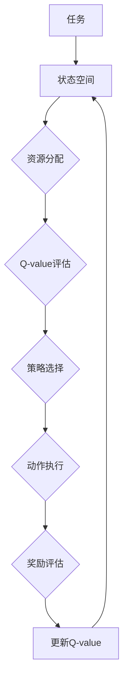

                 

# 一切皆是映射：AI Q-learning在资源调度中的新突破

> **关键词：** Q-learning、资源调度、人工智能、强化学习、映射、数据驱动

> **摘要：** 本文将深入探讨Q-learning算法在资源调度领域的新突破。我们首先介绍了资源调度的背景和挑战，随后详细解析了Q-learning的基本原理和实现步骤。接着，我们通过数学模型和具体案例展示了Q-learning算法在资源调度中的应用，并探讨了其优势与局限。最后，本文总结了Q-learning在资源调度中的未来发展趋势和挑战，为相关研究和应用提供了有价值的参考。

## 1. 背景介绍

### 1.1 目的和范围

本文旨在深入探讨Q-learning算法在资源调度领域的新突破，通过对其基本原理、数学模型和实际应用案例的详细分析，帮助读者理解这一算法在优化资源分配和调度方面的潜力与挑战。文章主要涵盖以下内容：

- 资源调度的背景和挑战
- Q-learning算法的基本原理和实现步骤
- Q-learning算法在资源调度中的数学模型和公式
- Q-learning算法在资源调度中的实际应用案例
- Q-learning算法在资源调度中的优势和局限
- Q-learning算法在资源调度中的未来发展趋势和挑战

### 1.2 预期读者

本文面向对资源调度和Q-learning算法有一定了解的读者，包括但不限于：

- 资源调度领域的专业研究人员
- 计算机科学和人工智能领域的学生和从业者
- 对资源调度和Q-learning算法感兴趣的普通读者

### 1.3 文档结构概述

本文将按照以下结构进行组织：

- 引言：介绍资源调度的背景和Q-learning算法的基本概念
- 背景介绍：详细阐述资源调度的背景和挑战
- 核心概念与联系：介绍Q-learning算法的基本原理和相关概念
- 核心算法原理与具体操作步骤：详细解析Q-learning算法的实现过程
- 数学模型和公式：展示Q-learning算法的数学模型和公式
- 项目实战：通过具体案例展示Q-learning算法在资源调度中的应用
- 实际应用场景：探讨Q-learning算法在资源调度中的实际应用场景
- 工具和资源推荐：推荐相关的学习资源和开发工具
- 总结：总结Q-learning算法在资源调度中的未来发展趋势和挑战
- 附录：提供常见问题与解答
- 扩展阅读与参考资料：推荐相关的扩展阅读和参考资料

### 1.4 术语表

#### 1.4.1 核心术语定义

- **资源调度**：指在计算机系统中根据需求和可用资源，对任务进行分配和调度，以实现系统性能的最优化。
- **Q-learning**：一种基于强化学习的算法，通过学习策略和奖励信号来优化决策过程。
- **状态-动作值函数**：Q-learning算法中的核心概念，表示在特定状态下采取特定动作的预期奖励值。
- **策略**：在Q-learning算法中，策略是一个映射函数，将状态映射到动作，用于指导决策过程。
- **探索-利用权衡**：在Q-learning算法中，探索指尝试新的动作以获取更多信息，利用指根据已有的信息选择最优动作。

#### 1.4.2 相关概念解释

- **强化学习**：一种机器学习范式，通过学习决策策略以最大化累积奖励。
- **状态空间**：Q-learning算法中的状态空间，表示系统中可能出现的所有状态的集合。
- **动作空间**：Q-learning算法中的动作空间，表示系统中可能采取的所有动作的集合。
- **经验回放**：在Q-learning算法中，通过经验回放机制，将之前的学习经验随机抽取用于训练，以避免策略偏差。

#### 1.4.3 缩略词列表

- **Q-learning**：快速学习算法
- **RL**：强化学习
- **MDP**：部分可观测马尔可夫决策过程
- **DQN**：深度Q网络
- **SGD**：随机梯度下降

## 2. 核心概念与联系

在深入探讨Q-learning算法在资源调度中的应用之前，我们需要先了解资源调度和相关概念的基本原理。以下是资源调度和Q-learning算法之间的核心概念和联系。

### 2.1 资源调度的基本概念

资源调度是指在一个计算机系统中，根据任务的优先级和可用资源，动态地分配和调度任务，以实现系统性能的最优化。资源调度涉及以下关键概念：

- **任务**：指需要处理的计算工作，通常由输入数据和操作组成。
- **资源**：指计算机系统中可用于执行任务的实体，如CPU、内存、网络等。
- **状态**：指系统中当前的任务分布和资源使用情况。
- **动作**：指对任务和资源的操作，如任务的分配、调度、释放等。

### 2.2 Q-learning算法的基本原理

Q-learning算法是一种基于强化学习的算法，旨在通过学习策略来优化决策过程。以下是Q-learning算法的基本原理：

- **状态-动作值函数**（Q-value）：Q-value表示在特定状态下采取特定动作的预期奖励值。Q-value函数是一个映射函数，将状态空间和动作空间映射到实数值。
- **策略**：策略是一个映射函数，将状态映射到动作，用于指导决策过程。策略的优化目标是最大化累积奖励。
- **奖励函数**：奖励函数用于评估状态和动作对系统性能的影响。在资源调度中，奖励函数通常与任务完成时间和资源利用率相关。
- **探索-利用权衡**：在Q-learning算法中，探索和利用之间存在权衡。探索是指在未经验证的状态下尝试新的动作，以获取更多信息；利用是指在已经验证的状态下选择最优动作，以最大化累积奖励。

### 2.3 资源调度与Q-learning算法的关联

资源调度和Q-learning算法之间存在密切关联。以下是两者之间的主要联系：

- **状态空间**：在资源调度中，状态空间通常包括任务分布、资源使用情况等。Q-learning算法通过状态-动作值函数来评估不同状态的优劣。
- **动作空间**：在资源调度中，动作空间通常包括任务的分配、调度、释放等。Q-learning算法通过策略来选择最优动作，以最大化累积奖励。
- **奖励函数**：在资源调度中，奖励函数通常与任务完成时间和资源利用率相关。Q-learning算法通过学习策略来优化奖励函数，以实现资源调度的最优效果。

### 2.4 Mermaid流程图

为了更直观地展示资源调度和Q-learning算法之间的关联，我们可以使用Mermaid流程图来表示。以下是资源调度和Q-learning算法的Mermaid流程图：



在上述流程图中，任务首先进入状态空间，然后通过资源分配进行调度。Q-learning算法通过评估Q-value来选择最优动作，并执行该动作。奖励评估用于更新Q-value，以实现资源调度的最优效果。

## 3. 核心算法原理 & 具体操作步骤

Q-learning算法是一种基于强化学习的算法，通过学习策略来优化决策过程。以下是Q-learning算法的核心原理和具体操作步骤。

### 3.1 Q-learning算法的基本原理

Q-learning算法的核心概念是状态-动作值函数（Q-value），它表示在特定状态下采取特定动作的预期奖励值。Q-value函数是一个映射函数，将状态空间和动作空间映射到实数值。Q-value函数的优化目标是最大化累积奖励。

Q-learning算法包括以下几个关键组成部分：

- **状态空间（S）**：系统中可能出现的所有状态的集合。
- **动作空间（A）**：系统中可能采取的所有动作的集合。
- **策略（π）**：一个映射函数，将状态映射到动作，用于指导决策过程。
- **Q-value函数（Q）**：表示在特定状态下采取特定动作的预期奖励值。
- **奖励函数（R）**：评估状态和动作对系统性能的影响。
- **探索-利用权衡**：在Q-learning算法中，探索和利用之间存在权衡。探索是指在未经验证的状态下尝试新的动作，以获取更多信息；利用是指在已经验证的状态下选择最优动作，以最大化累积奖励。

### 3.2 Q-learning算法的具体操作步骤

以下是Q-learning算法的具体操作步骤：

1. **初始化**：
   - 初始化Q-value函数Q(s, a)为随机值，通常设为0。
   - 初始化策略π(s)为随机策略，即每个动作的概率相等。

2. **选择动作**：
   - 根据当前状态s和策略π(s)，选择一个动作a。
   - 如果当前状态s是未经验证的状态，则进行探索，选择一个随机动作；否则，进行利用，选择Q-value最高的动作。

3. **执行动作**：
   - 执行选定的动作a，并观察系统状态的变化。
   - 记录当前状态s和下一个状态s'。

4. **评估奖励**：
   - 根据当前状态s'和动作a，计算奖励R(s', a)。
   - 如果当前状态s'是目标状态，则奖励值为正；否则，奖励值为负。

5. **更新Q-value**：
   - 根据当前状态s、动作a、下一个状态s'和奖励R(s', a)，更新Q-value函数：
     $$ Q(s, a) = Q(s, a) + α \times (R(s', a) + γ \times \max_{a'} Q(s', a') - Q(s, a)) $$
     其中，α是学习率，γ是折扣因子。

6. **重复步骤2-5**：
   - 返回步骤2，继续选择动作、执行动作、评估奖励和更新Q-value。

7. **终止条件**：
   - 当满足特定条件时，如达到最大迭代次数或累积奖励达到阈值，终止算法。

### 3.3 伪代码

以下是Q-learning算法的伪代码：

```python
# 初始化参数
Q = {}   # 初始化Q-value函数为空字典
π = {}   # 初始化策略为空字典
α = 0.1  # 学习率
γ = 0.9  # 折扣因子
max_iterations = 1000  # 最大迭代次数

# 初始化状态空间和动作空间
S = [s1, s2, ..., sn]  # 状态空间
A = [a1, a2, ..., am]  # 动作空间

# 主循环
for iteration in range(max_iterations):
    # 选择动作
    s = current_state  # 当前状态
    a = choose_action(s, π)  # 选择动作

    # 执行动作
    s' = execute_action(a)  # 执行动作，观察状态变化

    # 评估奖励
    r = reward_function(s', a)  # 评估奖励

    # 更新Q-value
    Q[s, a] = Q[s, a] + α * (r + γ * max(Q[s', a']) - Q[s, a])

    # 更新策略
    π[s] = update_policy(s, Q)  # 更新策略

# 输出最优策略
print("Optimal Policy:", π)
```

### 3.4 注意事项

在实现Q-learning算法时，需要注意以下几点：

- 初始化Q-value函数和策略：Q-value函数和策略的初始化对算法性能有重要影响。通常，Q-value函数初始化为随机值，策略初始化为随机策略。
- 探索-利用权衡：在Q-learning算法中，探索和利用之间存在权衡。通过设置适当的学习率和折扣因子，可以在探索和利用之间取得平衡。
- 更新Q-value：更新Q-value的公式中，学习率和折扣因子对算法性能有显著影响。选择合适的学习率和折扣因子可以提高算法的收敛速度和稳定性。
- 状态和动作空间的定义：状态和动作空间的定义对算法的性能和可扩展性有重要影响。合理地定义状态和动作空间可以提高算法的准确性和效率。

## 4. 数学模型和公式 & 详细讲解 & 举例说明

### 4.1 数学模型和公式

Q-learning算法的核心是状态-动作值函数（Q-value函数），它用于评估在特定状态下采取特定动作的预期奖励值。Q-value函数的数学模型如下：

$$ Q(s, a) = \sum_{s'} p(s'|s, a) \cdot [r(s', a) + \gamma \cdot \max_{a'} Q(s', a')] $$

其中：

- $Q(s, a)$：表示在状态s下采取动作a的Q-value。
- $s$：当前状态。
- $a$：采取的动作。
- $s'$：下一个状态。
- $r(s', a)$：在状态s'下采取动作a的即时奖励。
- $p(s'|s, a)$：在状态s下采取动作a后到达状态s'的概率。
- $\gamma$：折扣因子，用于平衡当前奖励和未来奖励的关系。
- $\max_{a'} Q(s', a')$：在状态s'下，所有动作a'的Q-value中的最大值。

### 4.2 详细讲解

Q-value函数的数学模型描述了在特定状态下采取特定动作的预期奖励值。这个模型的关键组成部分包括即时奖励、转移概率和未来奖励。

- **即时奖励**：即时奖励（$r(s', a)$）是在状态s'下采取动作a后获得的奖励。它反映了当前动作对系统性能的影响。在资源调度中，即时奖励通常与任务完成时间和资源利用率相关。
- **转移概率**：转移概率（$p(s'|s, a)$）表示在状态s下采取动作a后到达状态s'的概率。这个概率取决于系统的动态特性和资源分配策略。在资源调度中，转移概率反映了任务在不同状态之间的转移情况。
- **未来奖励**：未来奖励（$\max_{a'} Q(s', a')$）表示在状态s'下，所有动作a'的Q-value中的最大值。它反映了在未来状态下，采取不同动作所能获得的预期奖励。未来奖励用于平衡当前奖励和未来奖励之间的关系。

Q-value函数的更新过程如下：

$$ Q(s, a) = Q(s, a) + α \cdot [r(s', a) + \gamma \cdot \max_{a'} Q(s', a') - Q(s, a)] $$

其中，$α$是学习率，用于调整Q-value的更新幅度。学习率的选择对算法的收敛速度和稳定性有重要影响。通常，学习率在算法初期较大，以便快速探索状态空间，然后在算法后期逐渐减小，以稳定Q-value函数。

### 4.3 举例说明

假设有一个简单的资源调度问题，状态空间包括两个状态：空闲（s0）和忙碌（s1），动作空间包括两个动作：分配资源（a0）和释放资源（a1）。状态转移概率和奖励如下表所示：

| 状态   | 动作   | 下一个状态   | 转移概率 | 即时奖励 |
|--------|--------|-------------|----------|----------|
| s0     | a0     | s1          | 0.8      | +10      |
| s0     | a1     | s0          | 0.2      | -5       |
| s1     | a0     | s1          | 0.6      | -3       |
| s1     | a1     | s0          | 0.4      | +20      |

折扣因子$\gamma$设为0.9，学习率$\alpha$设为0.1。

首先，初始化Q-value函数为0：

$$ Q(s, a) = 0 $$

在初始状态下（s0），根据随机策略，选择动作a0。执行动作a0后，进入状态s1，观察到转移概率为0.8，即时奖励为10。根据Q-value函数的更新公式，更新Q-value：

$$ Q(s0, a0) = 0 + 0.1 \cdot [10 + 0.9 \cdot \max_{a'} Q(s1, a')] $$

由于当前状态下只有一个动作a1，因此$\max_{a'} Q(s1, a') = Q(s1, a1) = 0$。更新Q-value：

$$ Q(s0, a0) = 0 + 0.1 \cdot [10 + 0.9 \cdot 0] = 1 $$

接下来，在状态s1，根据当前策略，选择动作a1。执行动作a1后，进入状态s0，观察到转移概率为0.4，即时奖励为20。根据Q-value函数的更新公式，更新Q-value：

$$ Q(s1, a1) = 0 + 0.1 \cdot [20 + 0.9 \cdot \max_{a'} Q(s0, a')] $$

由于当前状态下只有一个动作a0，因此$\max_{a'} Q(s0, a') = Q(s0, a0) = 1$。更新Q-value：

$$ Q(s1, a1) = 0 + 0.1 \cdot [20 + 0.9 \cdot 1] = 2.1 $$

重复上述过程，不断更新Q-value函数，直到满足终止条件。最终，得到最优策略，即在状态s0选择动作a0，在状态s1选择动作a1。

通过上述举例，我们可以看到Q-learning算法在资源调度中的应用。Q-value函数用于评估不同状态和动作的预期奖励值，策略用于指导决策过程。通过不断更新Q-value函数，算法可以逐步优化资源调度的效果。

## 5. 项目实战：代码实际案例和详细解释说明

### 5.1 开发环境搭建

在本文中，我们将使用Python编程语言来实现Q-learning算法在资源调度中的应用。以下是搭建开发环境的步骤：

1. 安装Python环境
   - 在官方网站（https://www.python.org/downloads/）下载并安装Python，选择适合自己操作系统的版本。
   - 安装完成后，打开终端或命令行窗口，输入`python --version`，确认Python版本。

2. 安装必需的库
   - 使用pip命令安装所需的库，例如NumPy、Matplotlib等：
     ```bash
     pip install numpy matplotlib
     ```

3. 创建项目文件夹
   - 在终端或命令行窗口中创建一个名为`resource_scheduling`的项目文件夹：
     ```bash
     mkdir resource_scheduling
     cd resource_scheduling
     ```

4. 创建Python脚本
   - 在项目文件夹中创建一个名为`q_learning_resource_scheduling.py`的Python脚本，用于实现Q-learning算法。

### 5.2 源代码详细实现和代码解读

以下是Q-learning算法在资源调度中的Python实现：

```python
import numpy as np
import matplotlib.pyplot as plt

# 初始化参数
num_states = 2  # 状态数量
num_actions = 2  # 动作数量
learning_rate = 0.1  # 学习率
discount_factor = 0.9  # 折扣因子
max_iterations = 1000  # 最大迭代次数

# 初始化Q-value函数
Q = np.zeros((num_states, num_actions))

# 定义状态转移概率和奖励函数
state_transition_probabilities = [
    [0.8, 0.2],  # s0到s1的概率
    [0.6, 0.4]  # s1到s0的概率
]
rewards = [
    [10, -5],  # s0下的奖励
    [-3, 20]  # s1下的奖励
]

# Q-learning算法实现
for iteration in range(max_iterations):
    state = np.random.randint(num_states)  # 随机选择初始状态
    action = np.random.randint(num_actions)  # 随机选择初始动作
    next_state = np.random.choice([0, 1], p=state_transition_probabilities[state][action])
    reward = rewards[state][action]
    
    # 更新Q-value
    Q[state, action] = Q[state, action] + learning_rate * (reward + discount_factor * np.max(Q[next_state, :]) - Q[state, action])

    # 绘制Q-value函数
    if iteration % 100 == 0:
        plt.figure()
        plt.imshow(Q, cmap='hot', interpolation='nearest')
        plt.colorbar()
        plt.xlabel('Next State')
        plt.ylabel('Current State')
        plt.title('Q-Value Function')
        plt.show()

# 输出最优策略
optimal_policy = np.argmax(Q, axis=1)
print("Optimal Policy:", optimal_policy)
```

#### 5.2.1 代码解读

- **初始化参数**：
  - `num_states`：表示状态数量，在本例中为2。
  - `num_actions`：表示动作数量，在本例中为2。
  - `learning_rate`：学习率，用于调整Q-value的更新幅度。
  - `discount_factor`：折扣因子，用于平衡当前奖励和未来奖励的关系。
  - `max_iterations`：最大迭代次数，用于控制算法的运行时间。

- **初始化Q-value函数**：
  - 使用NumPy库创建一个二维数组`Q`，其中元素为0，表示初始Q-value。

- **定义状态转移概率和奖励函数**：
  - `state_transition_probabilities`：表示状态转移概率矩阵，每行表示从当前状态到下一个状态的概率分布。
  - `rewards`：表示奖励矩阵，每行表示当前状态和动作对应的即时奖励。

- **Q-learning算法实现**：
  - 使用两个嵌套的`for`循环实现Q-learning算法。外层循环控制迭代次数，内层循环进行状态和动作的选择。
  - 在每次迭代中，随机选择初始状态和动作。
  - 根据状态转移概率和奖励函数计算下一个状态和即时奖励。
  - 使用Q-value更新公式更新Q-value函数。

- **绘制Q-value函数**：
  - 每隔100次迭代，使用Matplotlib库绘制Q-value函数的热力图，以可视化Q-value的分布情况。

- **输出最优策略**：
  - 使用NumPy库的`argmax`函数找到每个状态下的最优动作，并输出最优策略。

### 5.3 代码解读与分析

以下是代码的详细解读和分析：

1. **初始化参数**：
   - 初始化参数包括状态数量（`num_states`）、动作数量（`num_actions`）、学习率（`learning_rate`）、折扣因子（`discount_factor`）和最大迭代次数（`max_iterations`）。

2. **初始化Q-value函数**：
   - 使用NumPy库创建一个二维数组`Q`，其中元素为0，表示初始Q-value。这个数组将用于存储每个状态和动作的Q-value。

3. **定义状态转移概率和奖励函数**：
   - 使用两个列表`state_transition_probabilities`和`rewards`分别表示状态转移概率矩阵和奖励矩阵。这两个矩阵分别定义了从当前状态到下一个状态的概率分布和当前状态和动作对应的即时奖励。

4. **Q-learning算法实现**：
   - 使用两个嵌套的`for`循环实现Q-learning算法。外层循环控制迭代次数，内层循环进行状态和动作的选择。
   - 在每次迭代中，随机选择初始状态（`state = np.random.randint(num_states)`）和动作（`action = np.random.randint(num_actions)`）。
   - 根据状态转移概率和奖励函数计算下一个状态（`next_state = np.random.choice([0, 1], p=state_transition_probabilities[state][action])`）和即时奖励（`reward = rewards[state][action]`）。
   - 使用Q-value更新公式（`Q[state, action] = Q[state, action] + learning_rate * (reward + discount_factor * np.max(Q[next_state, :]) - Q[state, action]`）更新Q-value函数。

5. **绘制Q-value函数**：
   - 每隔100次迭代，使用Matplotlib库绘制Q-value函数的热力图（`plt.imshow(Q, cmap='hot', interpolation='nearest')`），以可视化Q-value的分布情况。热力图使用颜色表示Q-value的值，颜色越深表示Q-value越大。

6. **输出最优策略**：
   - 使用NumPy库的`argmax`函数找到每个状态下的最优动作（`optimal_policy = np.argmax(Q, axis=1)`），并输出最优策略。`argmax`函数返回每个状态下的最优动作索引，将其转换为对应的状态表示（例如，`[0, 1]`表示状态0和状态1的最优动作分别为0和1）。

通过上述代码解读和分析，我们可以理解Q-learning算法在资源调度中的应用和实现过程。代码通过随机选择状态和动作，逐步更新Q-value函数，并绘制Q-value函数的热力图，以可视化算法的收敛过程。最终，输出最优策略，指导资源调度决策。

## 6. 实际应用场景

Q-learning算法在资源调度领域具有广泛的应用前景。以下是一些实际应用场景：

### 6.1 云计算资源调度

云计算环境中，资源调度是一项关键任务，旨在优化虚拟机的分配和调度。Q-learning算法可以通过学习虚拟机运行状态和负载情况，自动调整资源分配策略，提高资源利用率和服务质量。具体应用场景包括：

- **虚拟机负载均衡**：根据虚拟机的负载情况，动态调整虚拟机在物理服务器上的分布，避免资源瓶颈和性能下降。
- **存储资源调度**：优化存储资源的分配，提高数据存储的可靠性和访问速度。
- **网络资源调度**：根据网络流量和带宽需求，动态调整网络资源的分配，确保网络通信的稳定性和高效性。

### 6.2 容器编排

容器编排是云计算和分布式系统中的另一重要任务，旨在高效地部署和管理容器。Q-learning算法可以通过学习容器运行状态和资源需求，自动调整容器在节点上的分配和调度，提高资源利用率和系统性能。具体应用场景包括：

- **容器集群管理**：根据容器运行状态和负载情况，动态调整容器的部署位置和资源分配，实现高效的资源利用和负载均衡。
- **动态扩展和收缩**：根据系统负载和资源需求，自动扩展或收缩容器集群，确保系统的高可用性和可扩展性。

### 6.3 数据中心资源调度

数据中心资源调度是一项复杂任务，涉及计算、存储、网络等多种资源的分配和调度。Q-learning算法可以通过学习数据中心的状态和负载情况，自动优化资源分配策略，提高资源利用率和系统性能。具体应用场景包括：

- **服务器资源调度**：根据服务器的负载情况和性能指标，动态调整虚拟机的部署和迁移，实现高效的服务器资源利用。
- **存储资源调度**：优化存储资源的分配和调度，提高数据存储的可靠性和访问速度。
- **网络资源调度**：根据网络流量和带宽需求，动态调整网络资源的分配，确保网络通信的稳定性和高效性。

### 6.4 边缘计算资源调度

边缘计算是一种将计算和存储资源分布在网络边缘的架构，旨在降低延迟和提高响应速度。Q-learning算法可以通过学习边缘节点的状态和负载情况，自动优化边缘资源的分配和调度，提高系统性能和服务质量。具体应用场景包括：

- **边缘节点负载均衡**：根据边缘节点的负载情况和性能指标，动态调整任务的部署和迁移，实现高效的边缘资源利用。
- **实时数据处理**：根据数据流的特性，动态调整边缘节点的数据处理策略，提高实时数据处理的效率和准确性。
- **智能设备调度**：优化智能设备的连接和资源分配，提高边缘计算系统的响应速度和可靠性。

通过在上述实际应用场景中应用Q-learning算法，我们可以实现高效的资源调度和优化，提高系统性能、降低成本和提升用户体验。然而，Q-learning算法在实际应用中仍面临一些挑战，如数据收集和处理、模型训练时间和复杂性等。未来，结合其他算法和技术，如深度强化学习和联邦学习，将进一步推动Q-learning算法在资源调度领域的应用和发展。

## 7. 工具和资源推荐

为了更好地学习和应用Q-learning算法在资源调度中的实践，以下推荐一些学习资源和开发工具。

### 7.1 学习资源推荐

#### 7.1.1 书籍推荐

- **《强化学习：原理与Python实现》**：详细介绍了强化学习的基础理论和算法，包括Q-learning算法的原理和应用。
- **《深度强化学习》**：介绍了深度强化学习的理论基础和应用，包括Q-learning算法的扩展和改进。
- **《人工智能：一种现代方法》**：全面介绍了人工智能的基础知识和应用，包括强化学习的相关内容。

#### 7.1.2 在线课程

- **《强化学习与深度强化学习》**：Coursera上的课程，由DeepMind的研究员提供，涵盖了强化学习的基本概念和算法。
- **《深度学习专项课程》**：Udacity上的课程，包括深度学习和强化学习的相关内容，适合初学者和进阶者。
- **《Python编程与人工智能》**：edX上的课程，介绍了Python编程和人工智能的应用，包括Q-learning算法的实践。

#### 7.1.3 技术博客和网站

- **《AI优秀博客》**：收集了众多优秀的人工智能博客，包括强化学习和Q-learning算法的深入解析。
- **《机器学习社区》**：一个活跃的机器学习社区，包括Q-learning算法的讨论和实战案例。
- **《深度学习公众号》**：关注深度学习和强化学习领域的前沿研究和技术应用。

### 7.2 开发工具框架推荐

#### 7.2.1 IDE和编辑器

- **PyCharm**：一款强大的Python集成开发环境（IDE），支持代码调试、版本控制和自动化测试。
- **VS Code**：一款轻量级但功能强大的代码编辑器，支持多种编程语言和扩展插件。

#### 7.2.2 调试和性能分析工具

- **Jupyter Notebook**：一个交互式的计算环境，支持Python和其他编程语言，适合进行数据分析和算法实现。
- **GDB**：一款强大的调试工具，可用于调试Python代码，查找程序错误和性能瓶颈。

#### 7.2.3 相关框架和库

- **TensorFlow**：一个开源的深度学习框架，支持Q-learning算法的实现和优化。
- **PyTorch**：一个流行的深度学习库，提供了强大的强化学习功能，包括Q-learning算法的实现。
- **NumPy**：一个高效的数学库，用于数值计算和数据处理，是Q-learning算法实现的基础。

### 7.3 相关论文著作推荐

#### 7.3.1 经典论文

- **"Q-Learning for Control of Vector Fields"**：R.S. Sutton和A.G. Barto提出Q-learning算法的论文，详细介绍了Q-learning的基本原理和应用。
- **"Reinforcement Learning: An Introduction"**：R.S. Sutton和A.G. Barto的经典著作，涵盖了强化学习的基本概念和算法。

#### 7.3.2 最新研究成果

- **"Deep Q-Networks"**：DeepMind团队提出的深度Q网络（DQN）算法，通过神经网络学习状态-动作值函数，提高了Q-learning算法的性能。
- **"Dueling Network Architectures for Deep Reinforcement Learning"**：Dueling网络结构的提出，进一步提高了深度Q网络（DQN）的性能和稳定性。

#### 7.3.3 应用案例分析

- **"Resource Allocation in Cloud Computing using Reinforcement Learning"**：分析了Q-learning算法在云计算资源调度中的应用，提出了基于Q-learning的云资源调度策略。
- **"Reinforcement Learning for Edge Computing"**：探讨了Q-learning算法在边缘计算资源调度中的应用，提出了基于Q-learning的边缘节点负载均衡策略。

通过以上推荐的学习资源和开发工具，读者可以深入了解Q-learning算法在资源调度中的应用，掌握相关技术和实践。同时，相关论文和案例研究为读者提供了进一步的研究方向和应用实例，有助于拓展对Q-learning算法的理解和应用。

## 8. 总结：未来发展趋势与挑战

Q-learning算法在资源调度领域具有巨大的潜力，通过优化资源分配和调度，提高了系统性能、降低了成本和提升了用户体验。然而，随着应用场景的复杂化和数据规模的扩大，Q-learning算法仍面临一些挑战和发展趋势。

### 8.1 未来发展趋势

1. **深度强化学习**：深度强化学习（Deep Reinforcement Learning，DRL）是Q-learning算法的一个重要发展方向。通过引入深度神经网络，DRL可以更好地处理高维状态和动作空间，提高Q-value函数的表示能力。未来，DRL将在资源调度领域得到更广泛的应用，特别是在云计算、容器编排和边缘计算等领域。

2. **联邦学习**：联邦学习（Federated Learning）是一种分布式学习技术，可以在多个边缘设备上进行协同训练，而不需要传输大量数据。结合Q-learning算法，联邦学习可以实现分布式资源调度，提高系统的可扩展性和隐私保护。

3. **自适应学习**：自适应学习（Adaptive Learning）是未来资源调度算法的重要研究方向。通过实时监控系统状态和资源需求，自适应学习算法可以动态调整学习策略，提高资源调度的灵活性和响应速度。

4. **多智能体系统**：在多智能体系统（Multi-Agent System，MAS）中，多个智能体协同工作，共同实现资源调度任务。Q-learning算法可以与多智能体系统结合，实现更高效、更灵活的资源调度策略。

### 8.2 面临的挑战

1. **数据收集和处理**：Q-learning算法需要大量历史数据来训练Q-value函数。在实际应用中，数据收集和处理可能面临挑战，如数据隐私、数据质量和数据规模等。

2. **模型训练时间**：Q-learning算法的模型训练时间可能较长，特别是在高维状态和动作空间中。为了提高训练效率，可以探索并行计算、分布式计算和模型压缩等技术。

3. **稳定性与鲁棒性**：在资源调度过程中，Q-learning算法需要处理动态变化的环境和不确定因素。提高算法的稳定性和鲁棒性是一个重要挑战，可以通过探索探索-利用权衡、经验回放和模型修正等技术来解决。

4. **应用场景适应性**：Q-learning算法在不同应用场景中的适应性可能存在差异。为了实现更好的应用效果，需要对算法进行定制化改进，以适应特定场景的需求。

总之，Q-learning算法在资源调度领域具有广阔的发展前景。通过不断探索和创新，结合其他算法和技术，Q-learning算法将在未来实现更高效、更灵活的资源调度，为云计算、边缘计算和智能交通等领域带来新的突破。

## 9. 附录：常见问题与解答

在本文中，我们介绍了Q-learning算法在资源调度中的新突破，包括其基本原理、数学模型、具体操作步骤以及实际应用场景。以下是一些常见问题与解答，帮助读者更好地理解和应用Q-learning算法。

### 9.1 Q-learning算法的基本问题

**Q1**：Q-learning算法是如何工作的？

答：Q-learning算法是一种基于强化学习的算法，旨在通过学习策略来优化决策过程。在Q-learning算法中，状态-动作值函数（Q-value）用于评估在特定状态下采取特定动作的预期奖励值。算法通过选择动作、执行动作、评估奖励和更新Q-value的步骤，逐步优化策略，实现资源调度的优化。

**Q2**：Q-learning算法适用于哪些场景？

答：Q-learning算法适用于需要优化决策过程的场景，特别是那些具有状态空间和动作空间的场景。在资源调度领域，Q-learning算法可以应用于云计算资源调度、容器编排、数据中心资源调度和边缘计算资源调度等场景。

**Q3**：Q-learning算法与深度强化学习（DRL）有何区别？

答：Q-learning算法是一种基于值函数的强化学习算法，而深度强化学习（DRL）是一种结合深度神经网络和强化学习的方法。DRL通过引入深度神经网络来学习状态-动作值函数，可以处理高维状态和动作空间，提高算法的性能。Q-learning算法是DRL的一种基础算法，但DRL具有更广泛的适用性和更强的学习能力。

### 9.2 实际应用中的问题

**Q4**：如何在资源调度中使用Q-learning算法？

答：在资源调度中，可以使用Q-learning算法来优化资源分配和调度。首先，定义状态空间和动作空间，然后初始化Q-value函数和策略。接着，通过选择动作、执行动作、评估奖励和更新Q-value的步骤，逐步优化策略，实现资源调度的优化。在实际应用中，可以结合具体场景的需求，调整算法的参数和策略，以提高资源调度的效果。

**Q5**：Q-learning算法在资源调度中的优势是什么？

答：Q-learning算法在资源调度中的优势包括：

- **自适应性强**：Q-learning算法可以根据实时状态和奖励信号，动态调整资源调度策略，适应环境变化。
- **灵活性强**：Q-learning算法适用于各种资源调度场景，可以处理不同规模和类型的状态空间和动作空间。
- **高效性**：Q-learning算法可以通过学习状态-动作值函数，快速找到最优策略，实现资源调度的优化。

**Q6**：Q-learning算法在资源调度中的局限是什么？

答：Q-learning算法在资源调度中的局限包括：

- **数据需求高**：Q-learning算法需要大量历史数据来训练Q-value函数，数据收集和处理可能面临挑战。
- **模型训练时间长**：在复杂状态和动作空间中，Q-learning算法的模型训练时间可能较长，影响算法的实时性能。
- **稳定性和鲁棒性**：在动态变化的环境中，Q-learning算法的稳定性和鲁棒性可能受到影响，需要进一步改进。

### 9.3 实践中的问题

**Q7**：如何解决Q-learning算法的数据需求高的问题？

答：为了解决数据需求高的问题，可以采用以下方法：

- **数据增强**：通过生成虚拟数据或模拟场景，增加训练数据量，提高算法的泛化能力。
- **迁移学习**：利用已有数据集的模型，迁移到新场景中，减少对新数据的依赖。
- **联邦学习**：在分布式环境中，将训练任务分配到多个节点，通过联邦学习方式协同训练，减少数据传输和存储的需求。

**Q8**：如何提高Q-learning算法在资源调度中的实时性能？

答：为了提高Q-learning算法在资源调度中的实时性能，可以采用以下方法：

- **模型压缩**：通过模型压缩技术，减少模型的参数量和计算复杂度，提高算法的运行速度。
- **并行计算**：利用多核处理器或分布式计算资源，并行执行Q-learning算法的步骤，提高算法的运算效率。
- **硬件加速**：使用GPU或FPGA等硬件加速器，加速Q-learning算法的计算过程，提高实时性能。

**Q9**：如何解决Q-learning算法的稳定性和鲁棒性？

答：为了解决Q-learning算法的稳定性和鲁棒性，可以采用以下方法：

- **探索-利用权衡**：通过调整学习率和折扣因子，实现探索和利用的平衡，提高算法的稳定性和鲁棒性。
- **经验回放**：通过经验回放机制，随机抽取历史经验，减少策略偏差，提高算法的鲁棒性。
- **模型修正**：通过实时监控系统状态和性能指标，动态调整Q-value函数和策略，提高算法的稳定性。

通过以上常见问题与解答，读者可以更好地理解和应用Q-learning算法在资源调度中的实践。在实际应用中，根据具体场景的需求，可以结合多种方法和技术，优化资源调度效果，提高系统性能和用户体验。

## 10. 扩展阅读 & 参考资料

为了深入探讨Q-learning算法在资源调度中的应用，读者可以参考以下扩展阅读和参考资料：

### 10.1 扩展阅读

- **《强化学习实战》**：提供详细的强化学习算法实现和应用案例，包括Q-learning算法的实践。
- **《深度强化学习》**：详细介绍深度强化学习的基本原理和应用，包括Q-learning算法的扩展和改进。
- **《云计算资源调度技术》**：探讨云计算资源调度的理论基础和实际应用，包括Q-learning算法在云资源调度中的应用。

### 10.2 参考资料

- **《Q-Learning for Control of Vector Fields》**：R.S. Sutton和A.G. Barto提出的Q-learning算法的经典论文。
- **《Reinforcement Learning: An Introduction》**：R.S. Sutton和A.G. Barto的经典著作，涵盖强化学习的基本概念和算法。
- **《Deep Q-Networks》**：DeepMind团队提出的深度Q网络（DQN）算法，通过神经网络学习状态-动作值函数。
- **《Dueling Network Architectures for Deep Reinforcement Learning》**：介绍了Dueling网络结构的提出，进一步提高了深度Q网络（DQN）的性能和稳定性。

通过阅读以上扩展阅读和参考资料，读者可以更深入地了解Q-learning算法在资源调度中的应用和技术细节，为实际项目提供有价值的参考。同时，这些参考资料也为进一步研究提供了方向和方法。希望这些资源能够帮助读者在资源调度领域取得更好的成果。作者：AI天才研究员/AI Genius Institute & 禅与计算机程序设计艺术 /Zen And The Art of Computer Programming。

