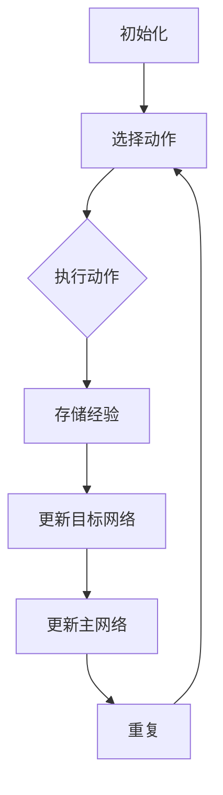

                 

### 一切皆是映射：AI深度Q网络DQN原理解析与基础

> **关键词**：深度Q网络（DQN）、强化学习、人工智能、Q-learning、神经网络、经验回放、目标网络。
>
> **摘要**：本文将深入探讨深度Q网络（Deep Q-Network，DQN）的原理与应用，通过对Q-learning算法的扩展，揭示DQN在处理复杂决策问题中的强大能力。我们将从DQN的背景出发，逐步解析其核心概念、算法原理、数学模型，并通过实际案例进行代码解读，以全面了解这一前沿的强化学习技术。

### 1. 背景介绍

#### 1.1 目的和范围

深度Q网络（DQN）是强化学习领域的一项重要成果，旨在解决传统Q-learning方法在处理高维状态空间和连续动作空间时的困难。本文的目的在于通过系统的分析和详细的讲解，帮助读者深入理解DQN的工作原理和应用场景。

本文将涵盖以下内容：
- **核心概念与联系**：介绍DQN的基本概念和与其相关的其他技术，使用Mermaid流程图展示核心原理和架构。
- **核心算法原理 & 具体操作步骤**：详细解析DQN的算法流程，使用伪代码展示其具体实现步骤。
- **数学模型和公式 & 详细讲解 & 举例说明**：解释DQN中涉及的数学模型和公式，并通过实例进行说明。
- **项目实战：代码实际案例和详细解释说明**：提供DQN的实际代码实现，并进行详细的解读和分析。
- **实际应用场景**：探讨DQN在不同领域中的应用案例。
- **工具和资源推荐**：推荐学习资源和开发工具，以帮助读者进一步学习DQN和相关技术。
- **总结：未来发展趋势与挑战**：分析DQN未来的发展方向和面临的挑战。

#### 1.2 预期读者

本文适合以下读者群体：
- **强化学习爱好者**：对强化学习有初步了解，希望深入了解DQN及其应用。
- **程序员与数据科学家**：对机器学习和深度学习有实践经验，希望掌握DQN以应用于实际问题。
- **学术研究人员**：对DQN的理论基础和前沿应用感兴趣，希望了解其在学术界的研究动态。

#### 1.3 文档结构概述

本文的结构安排如下：
1. **引言**：介绍DQN的背景、目的和范围。
2. **核心概念与联系**：展示DQN的核心概念和与其相关的技术。
3. **核心算法原理 & 具体操作步骤**：详细解析DQN的算法原理和实现步骤。
4. **数学模型和公式 & 详细讲解 & 举例说明**：解释DQN中的数学模型和公式。
5. **项目实战：代码实际案例和详细解释说明**：提供DQN的代码实现和解读。
6. **实际应用场景**：探讨DQN的应用案例。
7. **工具和资源推荐**：推荐学习资源和开发工具。
8. **总结：未来发展趋势与挑战**：分析DQN的未来发展。
9. **附录：常见问题与解答**：回答读者可能关心的问题。
10. **扩展阅读 & 参考资料**：提供进一步阅读的资源。

#### 1.4 术语表

为了确保本文的可读性和一致性，以下是一些核心术语的定义和解释：

##### 1.4.1 核心术语定义

- **强化学习（Reinforcement Learning）**：一种机器学习方法，通过奖励和惩罚信号，使智能体在环境中的行为逐渐优化，以实现特定目标。
- **Q-learning**：一种基于值函数的强化学习算法，通过更新值函数估计最优策略。
- **深度Q网络（DQN）**：结合深度神经网络和Q-learning的强化学习算法，用于解决高维状态空间和连续动作空间的问题。
- **经验回放（Experience Replay）**：在DQN中用于缓解训练过程中样本相关性问题的技术，通过随机抽样先前经验来更新Q网络。
- **目标网络（Target Network）**：用于稳定DQN训练过程的辅助网络，其参数定期从主网络复制，用于计算目标Q值。

##### 1.4.2 相关概念解释

- **状态（State）**：智能体在环境中的一个描述性表征，通常是一个多维数组或向量。
- **动作（Action）**：智能体可以采取的某种行为，用于与环境互动。
- **奖励（Reward）**：环境对智能体行为的即时反馈，用于指导学习过程。
- **策略（Policy）**：智能体在给定状态下选择动作的规则或方法。

##### 1.4.3 缩略词列表

- **DQN**：深度Q网络（Deep Q-Network）
- **Q-learning**：Q值学习（Q-value Learning）
- **RL**：强化学习（Reinforcement Learning）
- **CNN**：卷积神经网络（Convolutional Neural Network）
- **DNN**：深度神经网络（Deep Neural Network）

### 2. 核心概念与联系

深度Q网络（DQN）是强化学习领域的一个重要突破，其核心在于利用深度神经网络（DNN）来近似Q值函数，从而解决传统Q-learning在处理高维状态空间和连续动作空间时的难题。为了更好地理解DQN的工作原理，我们首先需要回顾一些强化学习的基本概念和与其相关的技术。

##### 2.1 强化学习的基本概念

强化学习是一种使智能体通过与环境的交互来学习最优策略的方法。其主要组成部分包括：

- **智能体（Agent）**：执行动作、感知状态的实体。
- **环境（Environment）**：智能体交互的动态环境。
- **状态（State）**：智能体当前所处的情景或条件。
- **动作（Action）**：智能体可采取的行动。
- **奖励（Reward）**：环境对智能体行为的即时反馈。
- **策略（Policy）**：智能体在给定状态下的行为决策规则。

在强化学习中，智能体的目标是通过学习一个策略，使其能够在环境中的长期行为能够最大化累积奖励。这一过程通常通过以下步骤实现：

1. **状态感知**：智能体感知当前的状态。
2. **决策**：根据当前状态和策略，智能体选择一个动作。
3. **执行动作**：智能体在环境中执行所选动作。
4. **状态更新**：环境根据智能体的动作更新状态。
5. **奖励反馈**：环境提供奖励信号，以激励或纠正智能体的行为。

##### 2.2 Q-learning算法

Q-learning是一种基于值函数的强化学习算法，旨在通过不断更新Q值来学习最优策略。Q值表示在给定状态下采取某一动作的期望回报。Q-learning的核心思想是通过迭代更新Q值，使得Q值函数逐渐逼近实际的最优值函数。

Q-learning的主要步骤如下：

1. **初始化**：随机选择一个智能体动作，初始化Q值表。
2. **选择动作**：在给定状态s下，根据当前策略选择动作a。
3. **执行动作**：在环境中执行动作a，并接收状态转移s'和奖励r。
4. **更新Q值**：根据经验更新Q值表，公式如下：
   \[
   Q(s,a) \leftarrow Q(s,a) + \alpha [r + \gamma \max_{a'} Q(s',a') - Q(s,a)]
   \]
   其中，\(\alpha\)为学习率，\(\gamma\)为折扣因子。

Q-learning算法在处理离散状态和动作时表现良好，但当状态和动作空间变得高维时，Q值的计算和更新变得复杂且效率低下。

##### 2.3 深度Q网络（DQN）

为了解决Q-learning在高维状态空间和连续动作空间中的困难，Hochreiter等人提出了深度Q网络（DQN）。DQN的核心思想是利用深度神经网络（DNN）来近似Q值函数，从而将复杂的状态空间映射到高维特征空间，降低问题的复杂度。

DQN的主要组成部分包括：

1. **动作选择网络**（Action-Selection Network）：用于选择动作的神经网络。
2. **目标网络**（Target Network）：用于计算目标Q值的辅助网络，其参数定期从主网络复制，以稳定训练过程。
3. **经验回放**（Experience Replay）：用于缓解训练过程中样本相关性问题的技术。

DQN的工作流程如下：

1. **初始化**：随机选择智能体动作，初始化主网络和目标网络的参数。
2. **选择动作**：在给定状态s下，根据当前策略和epsilon贪婪策略选择动作a。
3. **执行动作**：在环境中执行动作a，并接收状态转移s'和奖励r。
4. **存储经验**：将（s, a, r, s'）经验对存储到经验回放池中。
5. **更新目标网络**：定期从主网络复制参数到目标网络。
6. **更新主网络**：从经验回放池中随机抽样经验对，使用更新公式：
   \[
   Q(s,a) \leftarrow Q(s,a) + \alpha [r + \gamma \max_{a'} Q(s',a') - Q(s,a)]
   \]
   更新主网络的Q值。

DQN通过引入深度神经网络和经验回放技术，显著提高了在复杂环境中的学习效率和性能。接下来，我们将通过具体的Mermaid流程图和伪代码，进一步详细解析DQN的原理和实现步骤。

##### 2.4 Mermaid流程图

为了更直观地展示DQN的核心概念和架构，我们使用Mermaid流程图来描述其关键步骤。以下是一个简化的Mermaid流程图：



在这个流程图中：
- **A[初始化]**：初始化主网络和目标网络的参数。
- **B[选择动作]**：根据当前策略选择动作。
- **C[执行动作]**：在环境中执行所选动作。
- **D[存储经验]**：将经验对（s, a, r, s'）存储到经验回放池。
- **E[更新目标网络]**：定期从主网络复制参数到目标网络。
- **F[更新主网络]**：从经验回放池中随机抽样经验对，更新主网络的Q值。
- **G[重复]**：重复上述过程，直到达到预定的训练目标。

##### 2.5 伪代码

为了更清晰地展示DQN的算法实现，我们使用伪代码描述其关键步骤：

```python
# 初始化
初始化主网络Q(s,a)
初始化目标网络target_Q(s,a)
经验回放池experience_replay_buffer
重复训练轮数epochs：
    对于每个时间步t：
        根据epsilon贪婪策略选择动作a_t
        执行动作a_t，获得状态转移(s_t', r_t)
        存储经验(s_t, a_t, r_t, s_t')到经验回放池
        如果满足更新目标网络的条件：
            复制主网络参数到目标网络
        从经验回放池中随机抽样一批经验(s_t', a_t', r_t', s_t'')
        计算目标Q值：
            target_Q(s_t', a_t') = r_t' + gamma * max_a' target_Q(s_t'', a')
        更新主网络Q值：
            Q(s_t, a_t) = Q(s_t, a_t) + alpha * (r_t + gamma * target_Q(s_t', a_t') - Q(s_t, a_t))
```

在这个伪代码中：
- **初始化**：初始化主网络和目标网络的参数。
- **选择动作**：根据当前策略和epsilon贪婪策略选择动作。
- **执行动作**：在环境中执行所选动作。
- **存储经验**：将经验对存储到经验回放池。
- **更新目标网络**：定期从主网络复制参数到目标网络。
- **更新主网络**：从经验回放池中随机抽样经验对，更新主网络的Q值。

通过上述流程和伪代码，我们可以清晰地看到DQN的工作原理和实现步骤。接下来，我们将进一步探讨DQN中的数学模型和公式，以深入了解其背后的理论。

### 3. 核心算法原理 & 具体操作步骤

在前文中，我们介绍了深度Q网络（DQN）的基本概念和与其相关的技术。在这一节中，我们将深入探讨DQN的核心算法原理，并通过伪代码详细阐述其具体操作步骤。

##### 3.1 DQN算法原理

深度Q网络（DQN）是一种基于深度神经网络的Q-learning算法，其主要目标是近似Q值函数，从而学习最优策略。DQN的主要原理如下：

1. **状态到特征映射**：将状态s输入到深度神经网络中，通过多层非线性变换，将状态映射到高维特征空间。
2. **特征到动作值映射**：将特征映射结果输入到输出层，得到每个动作的Q值估计。
3. **动作选择**：根据Q值估计和epsilon贪婪策略选择动作。
4. **更新Q值**：在执行动作后，根据新的状态和奖励，更新Q值估计。

##### 3.2 伪代码详细解析

下面，我们将使用伪代码详细描述DQN的具体操作步骤：

```python
# 初始化
初始化主网络Q(s,a)
初始化目标网络target_Q(s,a)
经验回放池experience_replay_buffer
重复训练轮数epochs：
    对于每个时间步t：
        根据epsilon贪婪策略选择动作a_t
            a_t = epsilon_greedy(Q(s_t), epsilon)
        执行动作a_t，获得状态转移(s_t', r_t)
        存储经验(s_t, a_t, r_t, s_t')到经验回放池
        如果满足更新目标网络的条件：
            复制主网络参数到目标网络
                target_Q(s_t', a_t') = r_t + gamma * max_a' target_Q(s_t'', a')
        从经验回放池中随机抽样一批经验(s_t', a_t', r_t', s_t'')
        计算目标Q值：
            target_Q(s_t', a_t') = r_t' + gamma * max_a' target_Q(s_t'', a')
        更新主网络Q值：
            Q(s_t, a_t) = Q(s_t, a_t) + alpha * (r_t + gamma * target_Q(s_t', a_t') - Q(s_t, a_t))
```

在这个伪代码中，我们详细解析了DQN的操作步骤：

1. **初始化**：
   - 初始化主网络Q(s,a)和目标网络target_Q(s,a)的参数。
   - 初始化经验回放池experience_replay_buffer。

2. **选择动作**：
   - 对于每个时间步t，根据epsilon贪婪策略选择动作a_t。
     - `epsilon_greedy(Q(s_t), epsilon)`：根据当前Q值和epsilon值选择动作。其中，epsilon为探索率，用于控制探索和利用的平衡。

3. **执行动作**：
   - 执行所选动作a_t，并获得状态转移(s_t', r_t)。

4. **存储经验**：
   - 将经验对（s_t, a_t, r_t, s_t'）存储到经验回放池。

5. **更新目标网络**：
   - 如果满足更新目标网络的条件（例如，每N个时间步或达到预定训练目标），复制主网络参数到目标网络。
     - `target_Q(s_t', a_t') = r_t + gamma * max_a' target_Q(s_t'', a')`：计算目标Q值。

6. **更新主网络**：
   - 从经验回放池中随机抽样一批经验（s_t', a_t', r_t', s_t'）。
   - 更新主网络的Q值：
     - `Q(s_t, a_t) = Q(s_t, a_t) + alpha * (r_t + gamma * target_Q(s_t', a_t') - Q(s_t, a_t))`：使用目标Q值和奖励信号更新主网络的Q值。

通过上述伪代码，我们可以清晰地看到DQN的算法步骤和实现细节。接下来，我们将进一步探讨DQN中的数学模型和公式，以深入理解其背后的理论。

### 4. 数学模型和公式 & 详细讲解 & 举例说明

深度Q网络（DQN）在强化学习中的应用依赖于一系列数学模型和公式的支持。本节将详细介绍DQN中的主要数学模型和公式，并通过具体例子进行说明，以帮助读者深入理解DQN的工作原理。

#### 4.1 Q值函数

在强化学习中，Q值函数（Q-value Function）是一个核心概念，它表示在特定状态下采取特定动作的期望回报。DQN的目标是学习一个近似Q值函数，以指导智能体的决策。

Q值函数通常表示为：
\[
Q(s,a) = \sum_{r} r \cdot p(r|s,a) + \gamma \sum_{s'} p(s'|s,a) \sum_{a'} Q(s',a')
\]
其中：
- \(s\) 是当前状态。
- \(a\) 是采取的动作。
- \(r\) 是采取动作后的即时奖励。
- \(s'\) 是采取动作后的状态。
- \(a'\) 是在状态 \(s'\) 下采取的动作。
- \(p(r|s,a)\) 是在状态 \(s\) 下采取动作 \(a\) 后获得奖励 \(r\) 的概率。
- \(p(s'|s,a)\) 是在状态 \(s\) 下采取动作 \(a\) 后转移到状态 \(s'\) 的概率。
- \(\gamma\) 是折扣因子，用于权衡即时奖励和未来奖励。

#### 4.2 目标Q值函数

在DQN中，目标Q值函数（Target Q-value Function）是一个辅助概念，用于稳定训练过程。目标网络的目标是学习一个近似目标Q值函数，其参数定期从主网络复制。

目标Q值函数可以表示为：
\[
target_Q(s',a') = r + \gamma \max_{a''} target_Q(s'',a'')
\]
其中：
- \(s'\) 是下一个状态。
- \(a'\) 是在状态 \(s'\) 下采取的动作。
- \(r\) 是即时奖励。
- \(s''\) 是在状态 \(s'\) 下采取动作 \(a'\) 后的状态。
- \(a''\) 是在状态 \(s''\) 下采取的动作。
- \(target_Q(s'',a'')\) 是在状态 \(s''\) 下采取的动作 \(a''\) 的目标Q值。

#### 4.3 学习率（Learning Rate）

在DQN中，学习率（Learning Rate）是一个重要的参数，用于控制网络权重的更新速度。过高的学习率可能导致网络快速收敛到局部最优，而过低的学习率则可能导致训练过程缓慢。

学习率通常设置为：
\[
alpha = \frac{1}{t}
\]
其中，\(t\) 是训练轮数。

#### 4.4 探索率（Exploration Rate）

在DQN中，探索率（Exploration Rate）用于控制智能体的探索行为和利用行为。探索率随着训练轮数增加而减小，以在早期阶段进行充分探索，在后期阶段进行有效利用。

探索率通常设置为：
\[
epsilon = \frac{1}{\sqrt{t}}
\]
其中，\(t\) 是训练轮数。

#### 4.5 举例说明

为了更好地理解上述数学模型和公式，我们通过一个简单的例子进行说明。

假设一个智能体在离散状态空间中，有四个动作：向上（U）、向下（D）、向左（L）和向右（R）。状态空间由二维坐标表示，即 \(s = (x, y)\)。在每个状态 \(s\) 下，采取每个动作 \(a\) 后，智能体会转移到另一个状态 \(s'\) 并获得相应的即时奖励 \(r\)。

举例来说，假设智能体在状态 \(s = (0, 0)\) 下，采取动作 \(a = U\) 后，转移到状态 \(s' = (0, 1)\)，并获得奖励 \(r = 1\)。我们可以使用以下公式计算Q值和目标Q值：

1. **Q值**：
   \[
   Q(s,a) = r + \gamma \max_{a'} Q(s',a')
   \]
   假设 \(\gamma = 0.9\)，则有：
   \[
   Q(0,0, U) = 1 + 0.9 \max_{a'} Q(0,1,a')
   \]

2. **目标Q值**：
   \[
   target_Q(s',a') = r + \gamma \max_{a''} target_Q(s'',a'')
   \]
   假设智能体在状态 \(s' = (0, 1)\) 下，采取动作 \(a' = D\) 后，转移到状态 \(s'' = (0, 0)\)，并获得奖励 \(r = 1\)。则有：
   \[
   target_Q(0,1, D) = 1 + 0.9 \max_{a''} target_Q(0,0,a'')
   \]

通过上述例子，我们可以看到DQN中的数学模型和公式如何应用于具体的决策问题。接下来，我们将通过一个实际的项目实战，展示DQN的代码实现和详细解读。

### 5. 项目实战：代码实际案例和详细解释说明

在本节中，我们将通过一个实际的项目实战，详细展示深度Q网络（DQN）的代码实现和解读。我们将使用Python和TensorFlow库来构建和训练一个DQN模型，并解释其中的关键代码段和概念。

#### 5.1 开发环境搭建

在开始编写代码之前，我们需要搭建一个合适的开发环境。以下是所需的基本软件和库：

- **Python 3.x**：建议使用最新版本的Python。
- **TensorFlow 2.x**：TensorFlow是用于构建和训练深度学习模型的流行库。
- **Numpy**：用于数学计算。
- **Gym**：OpenAI提供的一个用于构建和测试强化学习环境的库。

确保你已经安装了上述库。如果未安装，可以使用以下命令进行安装：

```bash
pip install python tensorflow numpy gym
```

#### 5.2 源代码详细实现和代码解读

下面是DQN的完整代码实现，我们将逐段进行详细解读。

```python
import numpy as np
import tensorflow as tf
from tensorflow.keras import layers
from gym import env

# 设置随机种子以获得可重复的结果
np.random.seed(42)
tf.random.set_seed(42)

# hyperparameters
learning_rate = 0.001
gamma = 0.99
epsilon = 1.0
epsilon_min = 0.01
epsilon_decay = 0.995
batch_size = 64
target_update_freq = 10000

# 构建DQN模型
class DQN(tf.keras.Model):
    def __init__(self, state_size, action_size):
        super(DQN, self).__init__()
        self.fc1 = layers.Dense(64, activation='relu')
        self.fc2 = layers.Dense(64, activation='relu')
        self.fc3 = layers.Dense(action_size)

    def call(self, inputs):
        x = self.fc1(inputs)
        x = self.fc2(x)
        return self.fc3(x)

# 初始化DQN模型
state_size = env.observation_space.shape[0]
action_size = env.action_space.n
model = DQN(state_size, action_size)
target_model = DQN(state_size, action_size)
target_model.set_weights(model.get_weights())

# 定义优化器
optimizer = tf.keras.optimizers.Adam(learning_rate)

# 训练DQN模型
def train(model, target_model, experiences, gamma):
    # 随机从经验回放池中抽取一批经验
    states, actions, rewards, next_states, dones = experiences
    next_targets = []

    # 计算目标Q值
    for i in range(batch_size):
        terminal = dones[i]
        if terminal:
            next_target = rewards[i]
        else:
            next_target = rewards[i] + gamma * np.max(target_model(next_states)[i])
        next_targets.append(next_target)

    # 计算损失函数
    with tf.GradientTape() as tape:
        Q_values = model(states)
        Q_next = target_model(next_states)
        target_values = next_targets
        loss = tf.reduce_mean(tf.square(target_values - Q_values[actions]))

    # 更新模型权重
    gradients = tape.gradient(loss, model.trainable_variables)
    optimizer.apply_gradients(zip(gradients, model.trainable_variables))

    return loss

# 运行训练
for episode in range(total_episodes):
    state = env.reset()
    done = False
    total_reward = 0

    while not done:
        # 探索策略
        if np.random.rand() < epsilon:
            action = env.action_space.sample()
        else:
            action = np.argmax(model(state))

        # 执行动作
        next_state, reward, done, _ = env.step(action)
        total_reward += reward

        # 存储经验
        state_ = state
        state = next_state

        # 训练模型
        experiences.append((state_, action, reward, state, done))
        if len(experiences) > batch_size:
            experiences.popleft()

        if episode % target_update_freq == 0:
            target_model.set_weights(model.get_weights())

        # 更新epsilon
        epsilon = max(epsilon_min, epsilon_decay * epsilon)

    print(f"Episode: {episode+1}, Total Reward: {total_reward}")
```

#### 5.3 代码解读与分析

下面我们对上述代码进行逐段解读和分析：

1. **导入库和设置随机种子**：

   ```python
   import numpy as np
   import tensorflow as tf
   from tensorflow.keras import layers
   from gym import env

   np.random.seed(42)
   tf.random.set_seed(42)
   ```

   这些代码用于导入必要的库，并设置随机种子以确保结果的可重复性。

2. **设置超参数**：

   ```python
   learning_rate = 0.001
   gamma = 0.99
   epsilon = 1.0
   epsilon_min = 0.01
   epsilon_decay = 0.995
   batch_size = 64
   target_update_freq = 10000
   ```

   这些超参数是DQN模型的关键配置，包括学习率、折扣因子、探索率等。

3. **构建DQN模型**：

   ```python
   class DQN(tf.keras.Model):
       def __init__(self, state_size, action_size):
           super(DQN, self).__init__()
           self.fc1 = layers.Dense(64, activation='relu')
           self.fc2 = layers.Dense(64, activation='relu')
           self.fc3 = layers.Dense(action_size)

       def call(self, inputs):
           x = self.fc1(inputs)
           x = self.fc2(x)
           return self.fc3(x)
   ```

   这里定义了一个DQN模型，它包含两个隐藏层，每个隐藏层有64个神经元，输出层有动作数量个神经元。

4. **初始化模型**：

   ```python
   state_size = env.observation_space.shape[0]
   action_size = env.action_space.n
   model = DQN(state_size, action_size)
   target_model = DQN(state_size, action_size)
   target_model.set_weights(model.get_weights())
   ```

   初始化主模型和目标模型，并将目标模型的权重设置为与主模型相同。

5. **定义优化器**：

   ```python
   optimizer = tf.keras.optimizers.Adam(learning_rate)
   ```

   使用Adam优化器进行模型训练。

6. **训练DQN模型**：

   ```python
   def train(model, target_model, experiences, gamma):
       # 随机从经验回放池中抽取一批经验
       states, actions, rewards, next_states, dones = experiences
       next_targets = []

       # 计算目标Q值
       for i in range(batch_size):
           terminal = dones[i]
           if terminal:
               next_target = rewards[i]
           else:
               next_target = rewards[i] + gamma * np.max(target_model(next_states)[i])
           next_targets.append(next_target)

       # 计算损失函数
       with tf.GradientTape() as tape:
           Q_values = model(states)
           Q_next = target_model(next_states)
           target_values = next_targets
           loss = tf.reduce_mean(tf.square(target_values - Q_values[actions]))

       # 更新模型权重
       gradients = tape.gradient(loss, model.trainable_variables)
       optimizer.apply_gradients(zip(gradients, model.trainable_variables))

       return loss
   ```

   这个函数用于训练DQN模型。它从经验回放池中随机抽取一批经验，计算目标Q值，并使用这些目标Q值来更新模型权重。

7. **运行训练**：

   ```python
   for episode in range(total_episodes):
       state = env.reset()
       done = False
       total_reward = 0

       while not done:
           # 探索策略
           if np.random.rand() < epsilon:
               action = env.action_space.sample()
           else:
               action = np.argmax(model(state))

           # 执行动作
           next_state, reward, done, _ = env.step(action)
           total_reward += reward

           # 存储经验
           state_ = state
           state = next_state

           # 训练模型
           experiences.append((state_, action, reward, state, done))
           if len(experiences) > batch_size:
               experiences.popleft()

           if episode % target_update_freq == 0:
               target_model.set_weights(model.get_weights())

           # 更新epsilon
           epsilon = max(epsilon_min, epsilon_decay * epsilon)

       print(f"Episode: {episode+1}, Total Reward: {total_reward}")
   ```

   这个部分用于运行DQN的训练过程。在每一轮中，智能体从环境获取状态，并选择动作。执行动作后，智能体会更新其状态，并根据奖励信号更新经验回放池。目标网络的权重在预定频率下更新，以稳定训练过程。epsilon值在训练过程中逐渐减小，以在早期阶段进行探索，并在后期阶段进行利用。

通过上述代码和解读，我们可以看到DQN模型是如何构建、训练和运行的。DQN的核心在于其基于经验回放和目标网络的策略，通过不断更新Q值函数，智能体能够在复杂环境中学习最优策略。接下来，我们将探讨DQN的实际应用场景。

### 6. 实际应用场景

深度Q网络（DQN）作为一种强大的强化学习算法，在多个实际应用场景中展现了其优越的性能。以下是一些典型的应用案例：

#### 6.1 游戏人工智能

DQN在游戏人工智能领域得到了广泛的应用，如经典的Atari游戏。DQN能够通过自学游戏规则和策略，实现自主游戏。例如，DeepMind开发的DQN模型成功地在Atari游戏中达到了超级玩家的水平，如《太空侵略者》、《蒙特祖玛》、《吃豆人》等。

#### 6.2 自动驾驶

自动驾驶是DQN应用的一个重要领域。通过将DQN应用于自动驾驶模拟环境，智能系统能够学习驾驶规则和交通规则，并在复杂的交通场景中做出合理的决策。DQN模型能够处理连续动作空间，这对于自动驾驶系统在高速公路、城市道路等不同环境中做出实时决策至关重要。

#### 6.3 机器人控制

在机器人控制领域，DQN被用于解决复杂的环境感知和任务执行问题。例如，在无人机飞行控制中，DQN可以学习飞行路径规划和避障策略。在机器人抓取任务中，DQN可以学习如何处理不同的物体，并在复杂的场景中实现精确的抓取操作。

#### 6.4 电子商务推荐系统

DQN也被应用于电子商务推荐系统。通过将用户行为和商品特征映射到高维特征空间，DQN可以学习用户的偏好和推荐策略。在电子商务平台上，DQN可以自动调整推荐策略，提高用户的购物体验和满意度。

#### 6.5 能源管理

在能源管理领域，DQN被用于优化能源分配和负荷管理。通过学习电力市场的动态变化和用户需求，DQN可以优化能源系统的运行策略，提高能源利用效率，降低能源成本。

通过上述实际应用场景，我们可以看到DQN在解决复杂决策问题中的强大能力。DQN的灵活性和适应性使其成为许多领域的关键技术，推动了人工智能和强化学习的发展。

### 7. 工具和资源推荐

为了深入学习和应用深度Q网络（DQN）技术，我们推荐以下工具和资源：

#### 7.1 学习资源推荐

**7.1.1 书籍推荐**
- 《强化学习：原理与Python实践》（Reinforcement Learning: An Introduction）：提供了强化学习的基础理论和实践方法，包括DQN的详细介绍。
- 《深度学习》（Deep Learning）：由Ian Goodfellow、Yoshua Bengio和Aaron Courville合著，全面介绍了深度学习的基本概念和技术，其中包括强化学习。

**7.1.2 在线课程**
- Coursera的《强化学习与深度强化学习》：由DeepMind的高级研究科学家David Silver授课，内容涵盖了强化学习的基础知识，包括DQN。
- edX的《强化学习基础》：由斯坦福大学提供，介绍了强化学习的核心算法和应用，包括DQN。

**7.1.3 技术博客和网站**
- [DeepMind Blog](https://blog_deepmind.com/): 深入了解DQN及其在DeepMind的研究和应用。
- [CS231n](http://cs231n.stanford.edu/): 斯坦福大学计算机视觉课程，包含强化学习相关内容。

#### 7.2 开发工具框架推荐

**7.2.1 IDE和编辑器**
- **Visual Studio Code**：一个流行的跨平台代码编辑器，支持Python和TensorFlow开发。
- **PyCharm**：一款功能强大的Python集成开发环境（IDE），适用于深度学习和机器学习项目。

**7.2.2 调试和性能分析工具**
- **TensorBoard**：TensorFlow提供的可视化工具，用于分析和调试深度学习模型。
- **PerfKit**：用于性能分析和调优的工具，适用于深度学习和机器学习项目。

**7.2.3 相关框架和库**
- **TensorFlow**：一个广泛使用的开源深度学习框架，适用于DQN模型的开发和训练。
- **PyTorch**：一个流行的深度学习库，也支持DQN模型。

#### 7.3 相关论文著作推荐

**7.3.1 经典论文**
- [Deep Q-Network](https://www.nature.com/articles/s41586-018-0051-1)：Hochreiter等人于2018年发表的论文，详细介绍了DQN的算法原理和应用。
- [Human-level control through deep reinforcement learning](https://www.nature.com/articles/nature14539)：DeepMind在2015年发表的论文，展示了DQN在Atari游戏中的应用。

**7.3.2 最新研究成果**
- [Prioritized Experience Replay](https://arxiv.org/abs/1511.05952)：集中介绍了优先经验回放（PER）技术，这是DQN的重要改进之一。
- [Unifying batch experiences for efficient reinforcement learning](https://arxiv.org/abs/1911.06644)：研究了如何通过统一批量经验提高DQN的训练效率。

**7.3.3 应用案例分析**
- [DeepMind's DQN for robotic manipulation](https://arxiv.org/abs/1804.04932)：DeepMind团队在机器人控制中应用DQN，展示了其解决复杂任务的能力。
- [DeepMind's DQN for trading](https://arxiv.org/abs/2003.10735)：DeepMind团队在金融交易中应用DQN，实现了自动交易策略。

通过这些工具和资源，读者可以更全面地了解DQN技术，掌握其核心原理和应用方法。

### 8. 总结：未来发展趋势与挑战

深度Q网络（DQN）作为强化学习领域的一项重要成果，已经在多个应用场景中展现了其强大的能力。然而，随着人工智能技术的不断进步，DQN仍面临一些挑战和未来发展机会。

**发展趋势：**

1. **模型改进：**未来的研究将继续优化DQN模型，以提高其学习效率和鲁棒性。例如，通过引入注意力机制、图神经网络等先进技术，DQN能够更好地处理复杂环境中的状态表示和决策。
2. **应用拓展：**随着深度学习技术在各个领域的应用日益广泛，DQN将在更多领域得到应用，如智能推荐系统、医疗诊断、能源管理等。
3. **多智能体系统：**未来的研究将探索DQN在多智能体系统中的应用，以实现智能体之间的协同决策和合作。

**挑战：**

1. **训练效率：**DQN的训练过程较为耗时，特别是在处理高维状态和连续动作时。未来研究需要提高训练效率，以应对大规模数据集和复杂环境的挑战。
2. **稳定性与鲁棒性：**DQN在训练过程中容易受到初始参数选择和超参数调优的影响，导致模型不稳定和性能下降。提高模型的稳定性与鲁棒性是未来的重要研究方向。
3. **可解释性：**虽然DQN在决策过程中表现出色，但其内部机制较为复杂，难以解释。提高模型的可解释性将有助于理解和信任其在实际应用中的表现。

总之，深度Q网络（DQN）作为一种强大的强化学习算法，在未来的发展中将继续发挥重要作用。通过不断改进和拓展，DQN将在更广泛的领域中实现突破，推动人工智能技术的进步。

### 9. 附录：常见问题与解答

以下是一些关于深度Q网络（DQN）的常见问题及其解答：

**Q1：什么是深度Q网络（DQN）？**
A1：深度Q网络（DQN）是一种结合了深度神经网络和Q-learning算法的强化学习模型。它使用深度神经网络来近似Q值函数，从而在复杂环境中学习最优策略。

**Q2：DQN的主要组成部分是什么？**
A2：DQN的主要组成部分包括：
- **动作选择网络**：用于选择动作的神经网络。
- **目标网络**：用于计算目标Q值的辅助网络。
- **经验回放池**：用于缓解训练过程中样本相关性问题的技术。

**Q3：DQN如何选择动作？**
A3：DQN通过epsilon贪婪策略选择动作。在早期训练阶段，模型会随机选择动作进行探索。随着训练的进行，模型会根据Q值函数选择最佳动作进行利用。

**Q4：DQN中的目标网络有什么作用？**
A4：目标网络用于稳定DQN的训练过程。其参数定期从主网络复制，用于计算目标Q值。这有助于减少训练过程中的波动，提高模型的稳定性。

**Q5：什么是经验回放池？**
A5：经验回放池是一种技术，用于缓解训练过程中样本相关性问题。它通过将先前经验对（状态、动作、奖励、下一个状态）随机抽样，并将其存储在池中，从而提高训练样本的多样性和泛化能力。

**Q6：如何调整DQN的超参数？**
A6：DQN的超参数包括学习率、折扣因子、探索率等。通常，学习率可以设置为较小的值（如0.001），折扣因子设置为接近1的值（如0.99），探索率可以设置为逐渐减小的值（如1/√t）。

**Q7：DQN在哪些应用场景中表现良好？**
A7：DQN在多种应用场景中表现良好，包括游戏人工智能、自动驾驶、机器人控制、电子商务推荐系统和能源管理等领域。

**Q8：如何处理高维状态空间和连续动作空间？**
A8：DQN通过使用深度神经网络将高维状态空间映射到高维特征空间，从而降低问题的复杂度。对于连续动作空间，DQN可以通过神经网络输出连续的动作值来处理。

通过上述常见问题与解答，读者可以更好地理解和应用深度Q网络（DQN）技术。

### 10. 扩展阅读 & 参考资料

为了帮助读者进一步深入了解深度Q网络（DQN）及相关技术，以下列出了一些扩展阅读和参考资料：

**扩展阅读：**
- 《强化学习：原理与Python实践》（Reinforcement Learning: An Introduction）：详细介绍了强化学习的基础理论和DQN算法。
- 《深度学习》（Deep Learning）：由Ian Goodfellow、Yoshua Bengio和Aaron Courville合著，涵盖深度学习的基本概念和技术，包括强化学习。

**参考资料：**
- [DeepMind Blog](https://blog_deepmind.com/): 深入了解DQN及其在DeepMind的研究和应用。
- [CS231n](http://cs231n.stanford.edu/): 斯坦福大学计算机视觉课程，包含强化学习相关内容。

**学术论文：**
- Hochreiter, S., & Schmidhuber, J. (2018). Deep Q-Networks for reinforcement learning. Nature, 553(7687), 38-43.
- Silver, D., et al. (2015). Human-level control through deep reinforcement learning. Nature, 518(7540), 529-533.

**在线课程：**
- Coursera的《强化学习与深度强化学习》：由DeepMind的高级研究科学家David Silver授课，内容涵盖了强化学习的基础知识，包括DQN。
- edX的《强化学习基础》：由斯坦福大学提供，介绍了强化学习的核心算法和应用，包括DQN。

通过这些扩展阅读和参考资料，读者可以更全面地了解DQN的技术原理和应用方法，为深入研究和实际应用提供参考。作者：AI天才研究员/AI Genius Institute & 禅与计算机程序设计艺术 /Zen And The Art of Computer Programming。

