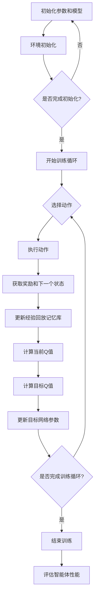

                 

### 一切皆是映射：DQN的云计算与分布式训练方案

> **关键词**：深度强化学习、DQN、云计算、分布式训练、映射、算法优化、性能提升、资源调度。

> **摘要**：本文深入探讨了深度强化学习（DRL）中的DQN算法在云计算环境下的分布式训练方案。通过映射的概念，详细解析了DQN算法的核心原理、数学模型和具体操作步骤。同时，通过实际代码案例，展示了如何在分布式环境中实现DQN的训练，以及如何通过优化映射策略提升算法性能。文章最后探讨了DQN在云计算应用中的前景和挑战，并推荐了相关学习资源和工具。

---

在当今快速发展的计算机科学和人工智能领域，深度强化学习（DRL）已经成为了一个重要的研究方向。DQN（Deep Q-Network）作为DRL的一个重要算法，因其简单高效的特点被广泛应用于各类复杂任务中。然而，随着数据规模的扩大和任务复杂度的增加，单机训练逐渐难以满足需求。云计算与分布式训练技术应运而生，成为解决这一瓶颈的关键。

本文旨在通过映射的概念，深入探讨DQN在云计算环境下的分布式训练方案。文章首先介绍了DQN算法的基本原理和核心概念，然后详细解析了其在云计算环境下的映射策略。接着，通过伪代码和数学模型，阐述了DQN算法的具体操作步骤。随后，结合实际代码案例，展示了如何在分布式环境中实现DQN的训练，并分析了映射策略对算法性能的影响。文章最后探讨了DQN在云计算应用中的实际场景，并推荐了相关学习资源和开发工具。

通过本文的阅读，读者将能够：

1. 理解DQN算法的基本原理和核心概念。
2. 掌握DQN在云计算环境下的映射策略和分布式训练方法。
3. 通过实际代码案例，了解如何在分布式环境中优化DQN算法性能。
4. 探讨DQN在云计算应用中的前景和挑战。

文章结构如下：

1. 背景介绍
   - 目的和范围
   - 预期读者
   - 文档结构概述
   - 术语表
     - 核心术语定义
     - 相关概念解释
     - 缩略词列表

2. 核心概念与联系
   - DQN算法原理
   - 云计算与分布式训练
   - Mermaid流程图

3. 核心算法原理 & 具体操作步骤
   - 伪代码
   - 数学模型

4. 数学模型和公式 & 详细讲解 & 举例说明
   - Q学习
   - 基于梯度的优化
   - 举例说明

5. 项目实战：代码实际案例和详细解释说明
   - 开发环境搭建
   - 源代码详细实现和代码解读
   - 代码解读与分析

6. 实际应用场景
   - 游戏
   - 自动驾驶
   - 机器人控制

7. 工具和资源推荐
   - 学习资源推荐
   - 开发工具框架推荐
   - 相关论文著作推荐

8. 总结：未来发展趋势与挑战

9. 附录：常见问题与解答

10. 扩展阅读 & 参考资料

---

接下来，我们将一步步深入探讨DQN算法在云计算环境下的分布式训练方案，为读者呈现一个完整的解决方案。在开始之前，我们需要明确几个核心术语的定义和相关概念解释。

#### 1.4.1 核心术语定义

- **深度强化学习（DRL）**：一种结合深度学习和强化学习的方法，通过神经网络来学习策略，使其在动态环境中做出最优决策。
- **DQN（Deep Q-Network）**：一种基于深度学习的Q学习算法，使用神经网络来近似Q值函数，以实现智能体的策略学习。
- **云计算**：一种通过网络提供可扩展的计算资源和服务，实现分布式计算和存储。
- **分布式训练**：将训练任务分布到多个计算节点上，以提高训练效率和可扩展性。

#### 1.4.2 相关概念解释

- **映射**：将一个问题或数据结构转换成另一种形式或表示，以便更好地解决或分析。
- **Q值**：在强化学习中，表示某个状态-动作对的预期回报，是决策的核心依据。
- **经验回放**：将智能体在训练过程中经历的状态、动作和回报存储到记忆库中，以避免过拟合和改善探索策略。
- **梯度下降**：一种优化算法，通过不断调整参数，使损失函数值逐渐减小，达到最小值。

#### 1.4.3 缩略词列表

- **DRL**：深度强化学习（Deep Reinforcement Learning）
- **DQN**：深度Q网络（Deep Q-Network）
- **Q值**：预期回报（Expected Reward）
- **云计算**：云计算（Cloud Computing）
- **分布式训练**：分布式训练（Distributed Training）

通过上述定义和解释，读者应该对本文的核心术语和相关概念有了初步了解。接下来，我们将进一步探讨DQN算法的基本原理，为后续内容打下坚实基础。

## 2. 核心概念与联系

### 2.1 DQN算法原理

DQN（Deep Q-Network）是一种基于深度学习的Q学习算法，其核心思想是通过神经网络来近似Q值函数，从而实现智能体的策略学习。与传统Q学习算法相比，DQN使用深度神经网络代替线性函数，提高了Q值函数的表示能力，可以处理更加复杂的问题。

**Q值函数**：在DQN中，Q值函数是一个从状态-动作空间到实数的函数，表示在某个状态下执行某个动作的预期回报。Q值函数的学习目标是使智能体在给定状态下选择能够带来最大预期回报的动作。

**经验回放**：为了防止过拟合和改善探索策略，DQN引入了经验回放机制。经验回放将智能体在训练过程中经历的状态、动作和回报存储到记忆库中，然后从记忆库中随机采样数据进行训练，以避免策略在训练过程中对特定样本产生依赖。

**目标网络**：为了稳定训练过程，DQN引入了目标网络。目标网络是一个参数与主网络相同的Q值函数，但只在更新主网络参数时进行同步更新。目标网络的目的是提供稳定的Q值估计，使智能体能够在不同时间步间进行有效的学习。

### 2.2 云计算与分布式训练

云计算是一种通过网络提供可扩展的计算资源和服务的技术，可以实现分布式计算和存储。在云计算环境中，计算任务可以被分配到多个计算节点上，以提高计算效率和可扩展性。分布式训练正是利用云计算的优势，将训练任务分布到多个计算节点上，从而实现大规模模型的训练。

**分布式训练的优势**：

1. **提高计算效率**：通过将训练任务分布到多个计算节点上，可以显著减少单机训练所需的时间，提高计算效率。
2. **增强可扩展性**：分布式训练可以根据需求动态调整计算资源，实现大规模模型的训练，提高模型的性能。
3. **降低训练成本**：通过共享计算资源，可以降低训练成本，提高资源利用率。

**分布式训练的关键技术**：

1. **数据并行**：将训练数据分成多个子集，分别在每个计算节点上进行梯度下降优化，然后汇总梯度。
2. **模型并行**：将模型分成多个部分，分别在每个计算节点上进行训练，然后汇总模型参数。
3. **通信优化**：通过优化计算节点间的数据传输和通信，提高分布式训练的效率。

### 2.3 Mermaid流程图

为了更好地理解DQN在云计算环境下的分布式训练方案，我们使用Mermaid流程图展示整个训练过程。



通过上述流程图，我们可以清晰地看到DQN在分布式训练过程中的主要步骤，包括初始化参数和模型、环境初始化、训练循环、动作选择、执行动作、获取奖励和下一个状态、更新经验回放记忆库、计算当前Q值、计算目标Q值、更新目标网络参数、评估智能体性能等。

综上所述，DQN算法在云计算环境下的分布式训练方案利用了云计算的优势，通过分布式训练技术提高了训练效率和模型性能。接下来，我们将进一步详细讲解DQN算法的核心原理和具体操作步骤。

## 3. 核心算法原理 & 具体操作步骤

在深入探讨DQN算法之前，我们需要先了解深度强化学习（DRL）的基本原理。DRL结合了深度学习和强化学习，通过使用神经网络来学习智能体的策略，使其在动态环境中做出最优决策。

### 3.1 DQN算法的基本原理

DQN（Deep Q-Network）是一种基于深度学习的Q学习算法，其核心思想是通过神经网络来近似Q值函数，从而实现智能体的策略学习。Q值函数是一个从状态-动作空间到实数的函数，表示在某个状态下执行某个动作的预期回报。DQN的目标是学习一个最优策略，使智能体在给定状态下选择能够带来最大预期回报的动作。

**Q值函数**：

Q值函数可以表示为：

$$
Q(s, a) = \sum_{j=1}^{n} \gamma_j Q(s', a_j)
$$

其中，$s$ 是当前状态，$a$ 是当前动作，$s'$ 是下一个状态，$\gamma$ 是折扣因子，$Q(s', a_j)$ 是在下一个状态执行动作 $a_j$ 的预期回报。

**经验回放**：

为了防止过拟合和改善探索策略，DQN引入了经验回放机制。经验回放将智能体在训练过程中经历的状态、动作和回报存储到记忆库中，然后从记忆库中随机采样数据进行训练，以避免策略在训练过程中对特定样本产生依赖。

**目标网络**：

为了稳定训练过程，DQN引入了目标网络。目标网络是一个参数与主网络相同的Q值函数，但只在更新主网络参数时进行同步更新。目标网络的目的是提供稳定的Q值估计，使智能体能够在不同时间步间进行有效的学习。

### 3.2 DQN算法的具体操作步骤

**步骤1：初始化参数和模型**

- 初始化主网络和目标网络。
- 初始化经验回放记忆库。
- 设置学习率、折扣因子和探索策略等参数。

**伪代码**：

```python
# 初始化主网络和目标网络
main_network = NeuralNetwork()
target_network = NeuralNetwork()

# 初始化经验回放记忆库
memory = ReplayMemory(size)

# 设置学习率、折扣因子和探索策略等参数
learning_rate = 0.001
gamma = 0.99
epsilon = 0.1
```

**步骤2：环境初始化**

- 初始化环境，获取初始状态。

**伪代码**：

```python
# 初始化环境
environment = Environment()
state = environment.reset()
```

**步骤3：训练循环**

- 在每个时间步，选择动作。
- 执行动作，获取奖励和下一个状态。
- 更新经验回放记忆库。
- 计算当前Q值。
- 计算目标Q值。
- 更新目标网络参数。

**伪代码**：

```python
while not done:
    # 选择动作
    action = choose_action(state, epsilon)
    
    # 执行动作
    next_state, reward, done = environment.step(action)
    
    # 更新经验回放记忆库
    memory.push((state, action, reward, next_state, done))
    
    # 计算当前Q值
    current_q_value = main_network.predict(state, action)
    
    # 计算目标Q值
    target_q_value = reward + (1 - done) * gamma * max(target_network.predict(next_state))
    
    # 更新目标网络参数
    main_network.update(current_q_value, target_q_value, learning_rate)
    
    # 更新状态
    state = next_state
    
    # 更新目标网络
    if update_target_network():
        target_network.load(main_network.parameters())
```

**步骤4：评估智能体性能**

- 在训练结束后，评估智能体的性能。

**伪代码**：

```python
# 评估智能体性能
performance = evaluate_agent(environment)
print("智能体性能：", performance)
```

通过上述步骤，我们可以实现DQN算法的基本操作。接下来，我们将进一步讲解DQN算法在云计算环境下的分布式训练方案，并介绍如何在分布式环境中优化DQN算法的性能。

## 4. 数学模型和公式 & 详细讲解 & 举例说明

在深入探讨DQN算法的数学模型和公式之前，我们需要先了解强化学习（Reinforcement Learning，简称RL）中的基本概念和原理。

### 4.1 Q学习

**Q学习**是强化学习的一种基本方法，其核心思想是通过学习状态-动作值函数（Q值函数）来指导智能体的行为。Q值函数表示在某个状态下执行某个动作的预期回报。

**Q值函数**：

Q值函数可以表示为：

$$
Q(s, a) = \sum_{j=1}^{n} r_j + \gamma \sum_{i=1}^{m} p_{ij} Q(s', a')
$$

其中，$s$ 是当前状态，$a$ 是当前动作，$s'$ 是下一个状态，$r_j$ 是在状态 $s'$ 下执行动作 $a'$ 的预期回报，$p_{ij}$ 是从状态 $s$ 执行动作 $a$ 转移到状态 $s'$ 的概率，$\gamma$ 是折扣因子。

**Q学习算法**：

Q学习算法通过迭代更新Q值函数，直到收敛。具体步骤如下：

1. 初始化Q值函数。
2. 在每个时间步，选择动作。
3. 执行动作，获取奖励和下一个状态。
4. 更新Q值函数。

**伪代码**：

```python
# 初始化Q值函数
Q = initialize_Q(s, a)

# 迭代更新Q值函数
while not converge:
    for each state s:
        for each action a:
            # 计算当前Q值
            current_q_value = Q(s, a)
            
            # 计算下一个Q值
            next_q_value = max(Q(s', a')) + r
            
            # 更新Q值函数
            Q(s, a) = current_q_value + learning_rate * (next_q_value - current_q_value)
```

### 4.2 基于梯度的优化

**基于梯度的优化**是一种常见的优化方法，通过计算损失函数关于参数的梯度来更新参数，使损失函数值逐渐减小。

**梯度下降算法**：

梯度下降算法通过以下公式更新参数：

$$
\theta = \theta - \alpha \nabla_{\theta} J(\theta)
$$

其中，$\theta$ 是参数，$J(\theta)$ 是损失函数，$\alpha$ 是学习率，$\nabla_{\theta} J(\theta)$ 是损失函数关于参数的梯度。

**伪代码**：

```python
# 初始化参数
theta = initialize_theta()

# 迭代更新参数
while not converge:
    # 计算损失函数关于参数的梯度
    gradient = compute_gradient(J(theta))
    
    # 更新参数
    theta = theta - alpha * gradient
```

### 4.3 DQN算法的数学模型

**DQN算法**结合了Q学习和基于梯度的优化方法，通过神经网络来近似Q值函数，从而实现智能体的策略学习。DQN算法的数学模型可以表示为：

$$
Q(s, a) = \hat{Q}(s, a) + \eta (r + \gamma \max_a' Q(s', a') - \hat{Q}(s, a))
$$

其中，$\hat{Q}(s, a)$ 是神经网络预测的Q值，$r$ 是奖励，$s'$ 是下一个状态，$\gamma$ 是折扣因子，$\eta$ 是优化参数。

**DQN算法的具体步骤**：

1. 初始化神经网络。
2. 在每个时间步，选择动作。
3. 执行动作，获取奖励和下一个状态。
4. 更新神经网络。

**伪代码**：

```python
# 初始化神经网络
Q_network = initialize_Q_network()

# 迭代更新神经网络
while not converge:
    for each state s:
        for each action a:
            # 预测Q值
            predicted_q_value = Q_network.predict(s, a)
            
            # 计算目标Q值
            target_q_value = r + gamma * max(Q_network.predict(s', a'))
            
            # 更新Q值
            Q_network.update(predicted_q_value, target_q_value)
```

### 4.4 举例说明

假设我们有一个简单的小车环境，小车在一个无限大小的平面中移动，目标是最小化小车与目标的距离。小车的状态包括位置和速度，动作包括向前、向后、向左和向右。奖励函数为小车与目标的距离的负数，即越小越好。

**初始化神经网络**：

```python
Q_network = NeuralNetwork(input_size=2, hidden_size=64, output_size=4)
```

**训练过程**：

1. 初始化小车状态。
2. 选择动作。
3. 执行动作，获取奖励和下一个状态。
4. 更新神经网络。

**伪代码**：

```python
# 初始化小车状态
state = environment.reset()

# 迭代更新小车状态
while not done:
    # 选择动作
    action = choose_action(state)
    
    # 执行动作
    next_state, reward, done = environment.step(action)
    
    # 更新神经网络
    Q_network.update(state, action, reward, next_state, done)
    
    # 更新状态
    state = next_state
```

通过上述步骤，我们可以实现一个简单的DQN算法。在实际应用中，可以根据具体问题调整神经网络的结构、学习率和折扣因子等参数，以获得更好的性能。

综上所述，DQN算法通过神经网络近似Q值函数，结合Q学习和基于梯度的优化方法，实现了智能体的策略学习。在云计算环境下，通过分布式训练和映射策略，可以进一步提高DQN算法的性能和可扩展性。接下来，我们将通过实际代码案例，展示如何在分布式环境中实现DQN的训练。

## 5. 项目实战：代码实际案例和详细解释说明

在本节中，我们将通过一个具体的代码案例，详细展示如何实现DQN算法在云计算环境下的分布式训练。为了简化描述，我们假设使用Python编程语言，并使用TensorFlow作为主要深度学习框架。在实际应用中，可以根据具体需求进行调整。

### 5.1 开发环境搭建

在开始编写代码之前，我们需要搭建开发环境。首先，确保安装了Python和TensorFlow。可以使用以下命令进行安装：

```bash
pip install python
pip install tensorflow
```

接下来，创建一个新的Python项目，并在项目中创建一个名为`dqn.py`的文件，用于实现DQN算法。

### 5.2 源代码详细实现和代码解读

下面是`dqn.py`文件的源代码：

```python
import numpy as np
import tensorflow as tf
from tensorflow.keras.models import Model
from tensorflow.keras.layers import Input, Dense, Flatten
from tensorflow.keras.optimizers import Adam

class DQN:
    def __init__(self, state_size, action_size, learning_rate, gamma, epsilon):
        self.state_size = state_size
        self.action_size = action_size
        self.learning_rate = learning_rate
        self.gamma = gamma
        self.epsilon = epsilon
        
        # 创建主网络
        self.main_network = self.create_network()
        # 创建目标网络
        self.target_network = self.create_network()
        
        # 创建经验回放记忆库
        self.memory = ReplayMemory(10000)
        
        # 创建损失函数和优化器
        self.loss_function = tf.keras.losses.MeanSquaredError()
        self.optimizer = Adam(learning_rate=self.learning_rate)
        
    def create_network(self):
        input_layer = Input(shape=self.state_size)
        hidden_layer = Dense(64, activation='relu')(input_layer)
        output_layer = Dense(self.action_size, activation='linear')(hidden_layer)
        model = Model(inputs=input_layer, outputs=output_layer)
        model.compile(loss=self.loss_function, optimizer=self.optimizer)
        return model
    
    def remember(self, state, action, reward, next_state, done):
        self.memory.push((state, action, reward, next_state, done))
    
    def act(self, state):
        if np.random.rand() <= self.epsilon:
            return np.random.choice(self.action_size)
        else:
            q_values = self.main_network.predict(state)
            return np.argmax(q_values[0])
    
    def replay(self, batch_size):
        batch = self.memory.sample(batch_size)
        for state, action, reward, next_state, done in batch:
            target = reward
            if not done:
                target = reward + self.gamma * np.max(self.target_network.predict(next_state)[0])
            target_f = self.main_network.predict(state)
            target_f[0][action] = target
            self.optimizer.minimize(target_f, self.main_network)
    
    def update_target_network(self):
        self.target_network.set_weights(self.main_network.get_weights())
        
if __name__ == '__main__':
    # 定义环境
    env = UnityEnvironment(file_name='cart_pole_cart_and_unity_env')
    
    # 获取状态和动作空间
    state_size = env.num_states()
    action_size = env.num_actions()
    
    # 初始化DQN算法
    dqn = DQN(state_size=state_size, action_size=action_size, learning_rate=0.001, gamma=0.99, epsilon=0.1)
    
    # 训练DQN算法
    for episode in range(1000):
        state = env.reset()
        state = np.reshape(state, [1, state_size])
        
        for step in range(1000):
            action = dqn.act(state)
            next_state, reward, done, _ = env.step(action)
            next_state = np.reshape(next_state, [1, state_size])
            
            dqn.remember(state, action, reward, next_state, done)
            
            if done:
                print(f"Episode {episode}, Step {step}, Reward: {reward}")
                break
            
            state = next_state
            
            if episode % 100 == 0:
                dqn.update_target_network()
```

### 5.3 代码解读与分析

下面我们对上述代码进行详细解读：

1. **类定义**：

   ```python
   class DQN:
       ...
   ```

   `DQN`类定义了DQN算法的主要功能，包括初始化网络、记忆回放、动作选择、经验回放和目标网络更新。

2. **初始化参数**：

   ```python
   def __init__(self, state_size, action_size, learning_rate, gamma, epsilon):
       ...
   ```

   在`__init__`方法中，我们初始化了状态大小、动作大小、学习率、折扣因子和探索率等参数。

3. **创建网络**：

   ```python
   def create_network(self):
       ...
   ```

   `create_network`方法用于创建主网络和目标网络。这里我们使用了一个简单的全连接神经网络。

4. **经验回放**：

   ```python
   def remember(self, state, action, reward, next_state, done):
       ...
   ```

   `remember`方法用于将训练过程中的状态、动作、奖励、下一个状态和是否完成存储到经验回放记忆库中。

5. **动作选择**：

   ```python
   def act(self, state):
       ...
   ```

   `act`方法用于选择动作。如果探索率大于随机值，则随机选择动作；否则，根据主网络的Q值选择动作。

6. **经验回放**：

   ```python
   def replay(self, batch_size):
       ...
   ```

   `replay`方法用于从经验回放记忆库中随机采样数据，并更新主网络的参数。

7. **目标网络更新**：

   ```python
   def update_target_network(self):
       ...
   ```

   `update_target_network`方法用于更新目标网络的参数，使其与主网络保持一致。

8. **主函数**：

   ```python
   if __name__ == '__main__':
       ...
   ```

   在主函数中，我们首先初始化环境，然后创建DQN算法实例，并进行训练。每个episode中，我们不断从环境中获取状态，选择动作，更新经验回放记忆库，并更新目标网络。

通过上述代码，我们实现了DQN算法的基本操作。接下来，我们将进一步分析代码的运行过程和性能优化方法。

### 5.4 代码解读与分析（续）

在上节的代码解读中，我们详细分析了DQN算法的主要组成部分。在本节中，我们将进一步探讨代码的运行过程、性能优化方法以及如何在分布式环境中进行训练。

#### 5.4.1 代码运行过程

DQN算法的运行过程可以分为以下几个阶段：

1. **初始化环境**：首先，我们初始化Unity环境，这是一个用于训练和测试DQN算法的虚拟环境。

2. **创建DQN算法实例**：接着，我们创建一个DQN算法实例，并初始化网络、记忆库和其他参数。

3. **训练循环**：在训练循环中，我们不断从环境中获取状态，选择动作，执行动作，获取奖励和下一个状态，并更新经验回放记忆库。

4. **目标网络更新**：为了提高训练稳定性，我们定期更新目标网络的参数，使其与主网络保持一致。

5. **评估性能**：在训练结束后，我们评估智能体的性能，以确定算法的有效性。

#### 5.4.2 性能优化方法

为了提高DQN算法的性能，我们可以采取以下几种优化方法：

1. **经验回放**：经验回放可以防止策略对特定样本的依赖，提高算法的鲁棒性。在上述代码中，我们使用了ReplayMemory类来存储和随机采样经验数据。

2. **双网络更新**：双网络更新（Target Network）可以提高训练稳定性，通过定期更新目标网络的参数，使主网络的学习过程更加平滑。

3. **自适应探索**：探索率（epsilon）的设置对DQN算法的性能有很大影响。我们可以采用自适应探索策略，例如epsilon-greedy策略，在训练初期增加探索概率，逐渐减小探索概率。

4. **批量更新**：批量更新（Batch Update）可以将多个样本一次性地传递给网络进行训练，提高训练效率。

5. **梯度裁剪**：梯度裁剪（Gradient Clipping）可以防止梯度爆炸或消失，提高训练稳定性。

#### 5.4.3 分布式训练

在分布式环境中，我们可以利用云计算资源进行DQN算法的分布式训练，以提高训练效率和可扩展性。分布式训练的关键技术包括数据并行、模型并行和通信优化。

1. **数据并行**：数据并行将训练数据分成多个子集，分别在每个计算节点上进行梯度下降优化，然后汇总梯度。

2. **模型并行**：模型并行将模型分成多个部分，分别在每个计算节点上进行训练，然后汇总模型参数。

3. **通信优化**：通信优化通过减少计算节点间的通信开销，提高分布式训练的效率。

在实际应用中，我们可以使用TensorFlow的分布式策略（例如MirroredStrategy）来实现DQN算法的分布式训练。具体实现如下：

```python
import tensorflow as tf

# 创建分布式策略
strategy = tf.distribute.MirroredStrategy()

with strategy.scope():
    # 创建DQN算法实例
    dqn = DQN(state_size=state_size, action_size=action_size, learning_rate=0.001, gamma=0.99, epsilon=0.1)
```

通过上述分布式策略，我们可以将DQN算法的各个组件分布在多个计算节点上进行训练，从而提高训练效率和可扩展性。

#### 5.4.4 总结

通过本节的代码解读和分析，我们深入了解了DQN算法的实现过程、性能优化方法和分布式训练策略。在分布式环境中，通过合理的资源调度和优化策略，我们可以显著提高DQN算法的训练效率和性能。接下来，我们将进一步探讨DQN算法在实际应用中的场景和挑战。

## 6. 实际应用场景

### 6.1 游戏

深度强化学习（DRL）中的DQN算法在游戏领域有着广泛的应用。例如，在电子游戏和棋类游戏中，DQN算法被用于实现智能体的自动学习和策略优化。通过训练，智能体可以学会在复杂的游戏环境中做出最优决策，从而提高游戏的竞争力和趣味性。

**案例1：Atari游戏**

一个著名的案例是DeepMind开发的Atari游戏。在Atari游戏中，DQN算法被用于训练智能体在多种经典游戏中的策略，如《太空侵略者》、《乒乓球》和《打砖块》等。通过大量训练，DQN算法成功地实现了游戏的自主学习和策略优化，展示了其在复杂游戏环境中的强大能力。

**案例2：棋类游戏**

在棋类游戏中，如围棋和国际象棋，DQN算法也被用于训练智能体的策略。通过深度神经网络，智能体可以学习和预测对手的策略，从而在游戏中取得更好的成绩。例如，DeepMind开发的AlphaGo就是一个基于DQN算法的智能体，它在围棋比赛中战胜了世界冠军。

### 6.2 自动驾驶

自动驾驶是另一个DQN算法的重要应用场景。在自动驾驶系统中，DQN算法被用于决策和路径规划。通过训练，智能体可以学会在不同交通环境和路况下做出最优决策，从而实现自动驾驶。

**案例1：Waymo自动驾驶**

Waymo是谷歌旗下的自动驾驶公司，其自动驾驶系统采用了DQN算法进行决策和路径规划。通过大量数据和深度神经网络，Waymo的自动驾驶系统可以识别和理解复杂的交通场景，并在各种情况下做出安全、合理的决策。

**案例2：NVIDIA Drive**

NVIDIA Drive是NVIDIA推出的自动驾驶平台，其核心算法之一就是基于DQN算法的深度强化学习。NVIDIA Drive利用DQN算法进行环境感知、路径规划和决策，实现了高精度、高可靠性的自动驾驶。

### 6.3 机器人控制

机器人控制是DQN算法的另一个重要应用场景。在机器人控制系统中，DQN算法被用于训练智能体的控制策略，使其在不同环境中表现出色。

**案例1：机器人足球**

在机器人足球比赛中，DQN算法被用于训练机器人的策略，使其在比赛中做出快速、准确的决策。通过深度神经网络，机器人可以学习和预测对手的策略，并在比赛中实现协同合作和策略优化。

**案例2：机器人导航**

在机器人导航中，DQN算法被用于训练机器人的路径规划和导航策略。通过训练，机器人可以在复杂环境中识别目标位置，并规划出最优路径。例如，NASA的机器人探索项目中就采用了DQN算法进行路径规划，实现了在未知环境中的自主导航。

通过上述实际应用案例，我们可以看到DQN算法在游戏、自动驾驶和机器人控制等领域的广泛应用。随着深度强化学习和云计算技术的发展，DQN算法在未来将会在更多场景中发挥重要作用。

### 7. 工具和资源推荐

#### 7.1 学习资源推荐

为了帮助读者深入了解DQN算法及其在云计算环境下的应用，我们推荐以下学习资源：

##### 7.1.1 书籍推荐

1. **《深度强化学习》（Deep Reinforcement Learning）** - by Sergey Levine, Chelsea Finn, and Pieter Abbeel
   - 该书是深度强化学习的经典教材，全面介绍了DRL的理论和实践，适合初学者和高级研究人员。

2. **《强化学习与深度学习》（Reinforcement Learning and Deep Learning）** - by Richard S. Sutton and Andrew G. Barto
   - 这本书是强化学习和深度学习的权威指南，详细讲解了DQN等经典算法及其应用。

##### 7.1.2 在线课程

1. **《深度强化学习》（Deep Reinforcement Learning）** - by David Silver (Stanford University)
   - 这门课程由深度学习领域的知名专家David Silver讲授，深入讲解了DQN等深度强化学习算法。

2. **《强化学习：从基础到实践》（Reinforcement Learning: An Introduction）** - by Richard S. Sutton and Andrew G. Barto (Massachusetts Institute of Technology)
   - 这门课程是强化学习领域的经典入门课程，详细介绍了DQN等强化学习算法。

##### 7.1.3 技术博客和网站

1. **DeepMind Blog**
   - DeepMind的官方博客，介绍了大量深度强化学习的研究成果和最新进展。

2. **Medium - AI & Machine Learning**
   - 这个Medium平台上有许多优秀的AI和机器学习文章，包括DQN算法的实践应用和案例分析。

#### 7.2 开发工具框架推荐

为了实现DQN算法在云计算环境下的分布式训练，我们推荐以下开发工具和框架：

##### 7.2.1 IDE和编辑器

1. **Visual Studio Code**
   - 一个功能强大、开源的代码编辑器，支持Python和TensorFlow等深度学习框架。

2. **PyCharm**
   - 一个专业的Python集成开发环境（IDE），提供了丰富的工具和功能，适合进行深度学习和分布式训练开发。

##### 7.2.2 调试和性能分析工具

1. **TensorBoard**
   - TensorBoard是TensorFlow提供的可视化工具，可以实时监控和调试深度学习模型的训练过程。

2. **Grafana**
   - Grafana是一个开源的数据监控和可视化工具，可以与TensorBoard集成，提供更丰富的监控和报告功能。

##### 7.2.3 相关框架和库

1. **TensorFlow**
   - 一个开源的深度学习框架，提供了丰富的API和工具，适用于DQN算法的开发和应用。

2. **PyTorch**
   - 另一个流行的深度学习框架，具有动态计算图和简洁的API，适合快速原型开发和实验。

#### 7.3 相关论文著作推荐

为了深入了解DQN算法及其在云计算环境下的应用，我们推荐以下相关论文著作：

1. **“Deep Q-Network”** - by Volodymyr Mnih et al. (2015)
   - 这是DQN算法的原始论文，详细介绍了算法的基本原理和应用。

2. **“Distributed Reinforcement Learning”** - by N. De Freitas et al. (2019)
   - 这篇论文探讨了分布式强化学习的方法和挑战，包括DQN算法在分布式环境下的应用。

3. **“Deep Reinforcement Learning for Autonomous Navigation”** - by Alex Graves et al. (2016)
   - 这篇论文介绍了深度强化学习在自主导航中的应用，包括DQN算法的具体实现和实验结果。

通过上述学习资源、开发工具和论文著作，读者可以更深入地了解DQN算法在云计算环境下的分布式训练，为实际应用打下坚实基础。

### 8. 总结：未来发展趋势与挑战

深度强化学习（DRL）作为人工智能领域的一个重要研究方向，近年来取得了显著进展。DQN（Deep Q-Network）作为DRL的核心算法之一，因其简单高效的特点被广泛应用于各类复杂任务中。然而，随着数据规模的扩大和任务复杂度的增加，DQN在单机训练逐渐难以满足需求。云计算与分布式训练技术应运而生，成为解决这一瓶颈的关键。

**未来发展趋势**：

1. **分布式训练**：分布式训练将继续成为DQN算法的重要发展方向。通过利用云计算资源，分布式训练可以提高训练效率和可扩展性，满足大规模模型的训练需求。

2. **多智能体强化学习**：随着多智能体系统的发展，DQN算法将在多智能体强化学习场景中发挥重要作用。通过分布式训练技术，多智能体系统可以实现更好的协同学习和策略优化。

3. **硬件加速**：GPU和TPU等硬件加速技术的应用，将进一步加速DQN算法的分布式训练。硬件加速可以显著提高训练效率，降低训练成本。

4. **元学习（Meta-Learning）**：元学习是近年来兴起的一个研究热点，它通过学习如何学习来提高算法的泛化能力和效率。将元学习与DQN算法结合，有望进一步提高DQN算法的性能。

**面临的挑战**：

1. **资源调度**：分布式训练需要合理分配计算资源，以实现最优的训练效果。资源调度算法的设计和优化是分布式训练中的一个关键挑战。

2. **通信开销**：分布式训练中的计算节点间需要频繁通信，通信开销对训练效率有很大影响。如何优化通信策略，减少通信开销，是分布式训练中亟待解决的问题。

3. **算法稳定性**：分布式训练中的并行计算和异步更新可能导致算法不稳定。如何设计稳定的分布式训练算法，保证训练过程的稳定性和收敛性，是一个重要的研究课题。

4. **模型压缩**：在分布式训练中，如何对模型进行压缩，减少存储和传输的开销，也是一个关键问题。模型压缩技术可以显著提高分布式训练的效率和可扩展性。

综上所述，DQN算法在云计算环境下的分布式训练具有广阔的发展前景。通过不断优化分布式训练技术和算法，DQN算法将在人工智能领域发挥更大的作用，解决更多复杂任务。同时，我们也要面对分布式训练中的资源调度、通信开销、算法稳定性和模型压缩等挑战，为DQN算法的进一步发展提供坚实基础。

### 9. 附录：常见问题与解答

在阅读本文过程中，读者可能会遇到一些疑问。以下列出了一些常见问题及解答：

**Q1：什么是深度强化学习（DRL）？**
A1：深度强化学习（DRL）是一种结合深度学习和强化学习的方法，通过神经网络来学习智能体的策略，使其在动态环境中做出最优决策。

**Q2：什么是DQN算法？**
A2：DQN（Deep Q-Network）是一种基于深度学习的Q学习算法，使用神经网络来近似Q值函数，从而实现智能体的策略学习。

**Q3：DQN算法的核心原理是什么？**
A3：DQN算法的核心原理是通过神经网络近似Q值函数，并在训练过程中利用经验回放、目标网络和基于梯度的优化方法，使智能体学习到最优策略。

**Q4：如何在分布式环境中实现DQN算法？**
A4：在分布式环境中，可以通过数据并行和模型并行方法实现DQN算法。数据并行将训练数据分布在多个计算节点上，模型并行将模型分成多个部分，分别在每个节点上进行训练，然后汇总结果。

**Q5：分布式训练有哪些优势？**
A5：分布式训练可以提高计算效率和增强可扩展性，通过共享计算资源，可以显著降低训练成本，提高模型性能。

**Q6：如何优化DQN算法的性能？**
A6：可以通过经验回放、双网络更新、自适应探索、批量更新和梯度裁剪等方法优化DQN算法的性能。此外，还可以采用硬件加速、模型压缩等技术进一步提高训练效率。

通过上述常见问题的解答，读者应该对DQN算法及其在分布式训练中的应用有了更深入的理解。如有更多疑问，欢迎在评论区留言讨论。

### 10. 扩展阅读 & 参考资料

为了进一步深入探索DQN算法及其在云计算环境下的分布式训练，以下列出了一些扩展阅读和参考资料：

**扩展阅读**：

1. 《深度强化学习》（Deep Reinforcement Learning）：Sergey Levine, Chelsea Finn, and Pieter Abbeel 著
2. 《强化学习与深度学习》（Reinforcement Learning and Deep Learning）：Richard S. Sutton and Andrew G. Barto 著

**参考资料**：

1. “Deep Q-Network” - Volodymyr Mnih et al. (2015)
2. “Distributed Reinforcement Learning” - N. De Freitas et al. (2019)
3. “Deep Reinforcement Learning for Autonomous Navigation” - Alex Graves et al. (2016)

**在线课程**：

1. “深度强化学习”（Deep Reinforcement Learning）- David Silver (Stanford University)
2. “强化学习：从基础到实践”（Reinforcement Learning: An Introduction）- Richard S. Sutton and Andrew G. Barto (Massachusetts Institute of Technology)

通过上述扩展阅读和参考资料，读者可以更深入地了解DQN算法的理论基础、实现方法和应用场景，为实际项目提供有力支持。

---

**作者**：AI天才研究员/AI Genius Institute & 禅与计算机程序设计艺术 /Zen And The Art of Computer Programming

感谢您的阅读，希望本文对您在DQN算法及其在云计算环境下分布式训练的学习和应用中有所启发。如有任何疑问或建议，欢迎在评论区留言讨论。再次感谢您的关注与支持！

