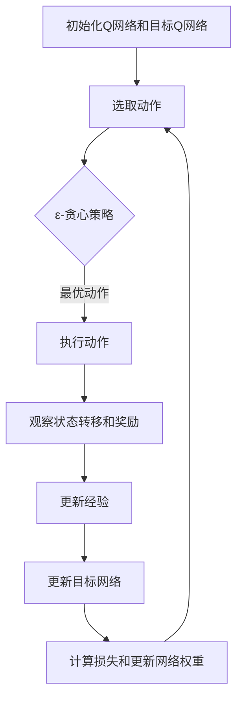

                 

# 一切皆是映射：DQN算法的实验设计与结果分析技巧

> **关键词：** 强化学习、深度Q网络、DQN算法、实验设计、结果分析、映射技巧。

> **摘要：** 本文将深入探讨深度Q网络（DQN）算法的实验设计与结果分析技巧。我们将从核心概念入手，逐步展开，详细介绍DQN算法的原理、数学模型以及实际应用案例，并分享实用的工具和资源，为读者提供全面的技术指导和实践建议。

## 1. 背景介绍

### 1.1 目的和范围

本文旨在通过详细解析深度Q网络（DQN）算法，帮助读者深入了解其原理和实际应用，并提供实用的实验设计与结果分析技巧。本文的目标读者包括对强化学习和深度学习有一定了解的技术人员、研究人员以及学生。

### 1.2 预期读者

本文适合以下读者群体：

- 对强化学习有初步了解，希望深入研究的读者；
- 对深度学习有浓厚兴趣，希望掌握DQN算法的技术人员；
- 进行研究生学习或技术培训的学生；
- 对人工智能应用场景有实际需求的业务人员。

### 1.3 文档结构概述

本文将分为以下几个部分：

1. **核心概念与联系**：介绍强化学习的基本概念，以及DQN算法的核心原理；
2. **核心算法原理 & 具体操作步骤**：详细解释DQN算法的数学模型和伪代码；
3. **数学模型和公式 & 详细讲解 & 举例说明**：使用LaTeX格式展示关键数学公式，并给出实例说明；
4. **项目实战：代码实际案例和详细解释说明**：提供实际代码案例，讲解其实现原理和操作步骤；
5. **实际应用场景**：探讨DQN算法在不同领域的应用实例；
6. **工具和资源推荐**：推荐学习资源、开发工具和相关论文；
7. **总结：未来发展趋势与挑战**：总结本文的关键内容，并探讨未来发展趋势和挑战；
8. **附录：常见问题与解答**：解答读者可能遇到的问题；
9. **扩展阅读 & 参考资料**：提供更多参考资料，供读者深入学习。

### 1.4 术语表

#### 1.4.1 核心术语定义

- **强化学习**：一种机器学习方法，通过奖励机制让智能体学会在环境中做出最优决策；
- **深度Q网络（DQN）**：一种基于深度学习的强化学习算法，用于估计智能体在未来某个状态下的最优动作值；
- **Q值**：表示智能体在某个状态下执行某个动作的预期回报；
- **经验回放**：用于避免策略偏差的一种技巧，通过将过去的经验数据进行随机抽样，提高算法的泛化能力；
- **目标网络**：用于稳定训练过程的一种技巧，通过定期更新一个延迟更新的目标网络，降低梯度消失和梯度爆炸问题。

#### 1.4.2 相关概念解释

- **动作值函数**：表示智能体在某个状态下执行某个动作的预期回报；
- **策略**：用于指导智能体选择动作的函数或规则；
- **探索与利用**：在强化学习中，智能体需要在探索新状态和利用已有经验之间进行平衡。

#### 1.4.3 缩略词列表

- **DQN**：深度Q网络（Deep Q-Network）
- **RL**：强化学习（Reinforcement Learning）
- **Q-Learning**：Q值学习（Q-Learning）

## 2. 核心概念与联系

在介绍DQN算法之前，我们先回顾一下强化学习的基本概念。强化学习是一种通过奖励机制来训练智能体的方法，其核心目标是通过与环境交互，学习到一种最优策略，以最大化长期回报。

### 2.1 强化学习基本概念

强化学习由以下四个主要部分组成：

1. **智能体（Agent）**：执行动作并接收环境反馈的实体；
2. **环境（Environment）**：智能体行动的场所，提供状态和奖励；
3. **状态（State）**：智能体在某个时刻所处的环境描述；
4. **动作（Action）**：智能体在某个状态下可以执行的行为。

强化学习的主要任务是找到一个最优策略（Policy），即一种指导智能体选择动作的规则，以实现最大化的累积奖励。

### 2.2 深度Q网络（DQN）算法原理

DQN是一种基于深度学习的强化学习算法，旨在通过学习状态-动作值函数（State-Action Value Function），估计智能体在某个状态下执行某个动作的预期回报。DQN算法的核心思想是通过神经网络来近似Q值函数。

#### 2.2.1 状态-动作值函数

状态-动作值函数\( Q(s, a) \)表示智能体在状态\( s \)下执行动作\( a \)的预期回报。具体来说，\( Q(s, a) \)可以表示为：

\[ Q(s, a) = \sum_{s'} P(s' | s, a) \cdot R(s', a) + \gamma \cdot \max_{a'} Q(s', a') \]

其中，\( P(s' | s, a) \)表示在状态\( s \)下执行动作\( a \)后，转移到状态\( s' \)的概率；\( R(s', a) \)表示在状态\( s' \)下执行动作\( a \)的即时回报；\( \gamma \)为折扣因子，用于平衡当前回报和未来回报的关系。

#### 2.2.2 网络结构

DQN算法使用深度神经网络（DNN）来近似Q值函数。网络结构通常包括输入层、隐藏层和输出层。输入层接收状态特征，隐藏层用于提取状态特征，输出层为每个可能动作提供一个Q值。

#### 2.2.3 训练过程

DQN算法通过以下步骤进行训练：

1. **初始化**：初始化Q网络和目标Q网络；
2. **选取动作**：根据当前状态，使用ε-贪心策略选择动作；
3. **执行动作**：在环境中执行选择出的动作，观察状态转移和奖励；
4. **更新经验**：将当前状态、动作、奖励和下一个状态存储在经验回放池中；
5. **更新目标网络**：每隔一定次数，将Q网络更新为目标网络；
6. **计算损失**：使用目标Q值和实际Q值计算损失，并使用反向传播算法更新网络权重。

#### 2.2.4 ε-贪心策略

ε-贪心策略是一种在探索和利用之间取得平衡的策略。在ε-贪心策略中，智能体以概率\( 1 - \epsilon \)选择最优动作，以概率\( \epsilon \)随机选择动作。随着训练过程的进行，ε值逐渐减小，以减少随机性，提高策略的稳定性。

### 2.3 Mermaid流程图

为了更好地展示DQN算法的流程，我们使用Mermaid流程图进行描述。以下是DQN算法的基本流程：



## 3. 核心算法原理 & 具体操作步骤

在本节中，我们将详细讲解DQN算法的核心原理，并使用伪代码来描述具体的操作步骤。通过这一部分的学习，读者可以更好地理解DQN算法的实现过程。

### 3.1 算法原理

DQN算法的核心思想是通过学习状态-动作值函数（Q值函数），指导智能体在环境中做出最优决策。具体来说，DQN算法使用深度神经网络来近似Q值函数，并通过经验回放和目标网络等技术，提高算法的收敛速度和泛化能力。

### 3.2 伪代码

下面是DQN算法的伪代码实现：

```python
# 初始化参数
epsilon = 1.0
epsilon_min = 0.01
epsilon_decay = 0.995
learning_rate = 0.001
gamma = 0.99
batch_size = 32
update_target_frequency = 10000

# 初始化Q网络和目标Q网络
Q_network = DeepQNetwork()
target_Q_network = DeepQNetwork()

# 初始化经验回放池
经验回放池 = ExperienceReplay()

# 开始训练
for episode in range(num_episodes):
    # 初始化环境
    state = environment.reset()
    
    # 初始化累积奖励
    total_reward = 0
    
    # 开始循环直到达到终止条件
    while not environment.is_done():
        # 选取动作
        if random.random() < epsilon:
            action = random_action()
        else:
            action = Q_network.predict(state)
        
        # 执行动作
        next_state, reward, done = environment.step(action)
        
        # 更新经验回放池
        experience回放池.append((state, action, reward, next_state, done))
        
        # 更新状态
        state = next_state
        
        # 更新累积奖励
        total_reward += reward
        
        # 如果达到批量大小，更新网络
        if len(经验回放池) >= batch_size:
            batch = random.sample(经验回放池, batch_size)
            states, actions, rewards, next_states, dones = zip(*batch)
            target_Q_values = target_Q_network.predict(next_states)
            target_Q_values[dones] = 0
            target_Q_values = rewards + gamma * target_Q_values
            Q_network.update(states, actions, target_Q_values)
        
        # 更新ε值
        epsilon = max(epsilon_min, epsilon * epsilon_decay)
        
    # 更新目标网络
    if episode % update_target_frequency == 0:
        target_Q_network.load(Q_network.parameters())
        
    # 输出本次训练的累积奖励
    print(f"Episode {episode}: Total Reward = {total_reward}")
```

### 3.3 操作步骤

根据上述伪代码，我们可以将DQN算法的操作步骤总结如下：

1. **初始化参数**：设置ε值、学习率、折扣因子等参数；
2. **初始化Q网络和目标Q网络**：创建深度神经网络，用于近似Q值函数；
3. **初始化经验回放池**：用于存储过去的经验数据；
4. **开始训练**：循环进行以下步骤：
   - **初始化环境**：重置环境，获取初始状态；
   - **选取动作**：根据当前状态，使用ε-贪心策略选择动作；
   - **执行动作**：在环境中执行选择出的动作，观察状态转移和奖励；
   - **更新经验回放池**：将当前状态、动作、奖励和下一个状态存储在经验回放池中；
   - **更新状态**：更新当前状态；
   - **更新累积奖励**：更新累积奖励；
   - **更新网络**：如果达到批量大小，使用经验回放池中的数据更新Q网络；
   - **更新ε值**：根据ε值衰减策略更新ε值；
5. **更新目标网络**：每隔一定次数，将Q网络更新为目标网络；
6. **输出训练结果**：输出本次训练的累积奖励。

通过上述步骤，DQN算法可以逐步学习到最优策略，实现智能体在环境中的自主学习和决策。

## 4. 数学模型和公式 & 详细讲解 & 举例说明

在本节中，我们将详细讲解DQN算法中的数学模型和关键公式，并通过具体实例来说明这些公式的应用。

### 4.1 状态-动作值函数

状态-动作值函数（Q值函数）是DQN算法的核心。Q值函数用于估计智能体在某个状态下执行某个动作的预期回报。具体来说，Q值函数可以通过以下公式表示：

\[ Q(s, a) = \sum_{s'} P(s' | s, a) \cdot R(s', a) + \gamma \cdot \max_{a'} Q(s', a') \]

其中，\( s \)和\( s' \)分别表示当前状态和下一个状态；\( a \)和\( a' \)分别表示当前动作和下一个动作；\( P(s' | s, a) \)表示在状态\( s \)下执行动作\( a \)后，转移到状态\( s' \)的概率；\( R(s', a) \)表示在状态\( s' \)下执行动作\( a \)的即时回报；\( \gamma \)为折扣因子，用于平衡当前回报和未来回报的关系。

### 4.2 ε-贪心策略

ε-贪心策略是DQN算法中的一种策略，用于在探索和利用之间取得平衡。ε-贪心策略的核心思想是在某个概率下选择最优动作，而在另一个概率下随机选择动作。具体来说，ε-贪心策略可以通过以下公式表示：

\[ \text{action} = \begin{cases} 
\text{argmax}_{a'} Q(s, a') & \text{with probability } 1 - \epsilon \\
\text{random\_action}() & \text{with probability } \epsilon 
\end{cases} \]

其中，\( \epsilon \)为探索概率，通常在训练过程中逐渐减小。

### 4.3 经验回放池

经验回放池是DQN算法中的一种技巧，用于避免策略偏差。经验回放池通过存储过去的经验数据，实现对随机样本的利用，提高算法的泛化能力。具体来说，经验回放池可以通过以下公式表示：

\[ \text{经验回放池} = \{ (s, a, r, s', d) | s, a, r, s', d \text{为历史状态、动作、奖励、下一个状态和终止标志} \} \]

### 4.4 举例说明

假设一个简单的环境，其中智能体可以执行上下左右四个动作。当前状态为\( s = (1, 2) \)，智能体选择向上移动动作\( a = 1 \)。下一个状态为\( s' = (1, 3) \)，即时奖励为\( r = 1 \)，终止标志为\( d = 0 \)。

根据状态-动作值函数公式，我们可以计算Q值：

\[ Q(s, a) = \sum_{s'} P(s' | s, a) \cdot R(s', a) + \gamma \cdot \max_{a'} Q(s', a') \]

\[ Q(1, 2) = P(1, 3) \cdot 1 + \gamma \cdot \max_{a'} Q(1, 3) \]

其中，\( P(1, 3) \)为从状态\( (1, 2) \)转移到状态\( (1, 3) \)的概率，假设为0.5；\( \gamma \)为折扣因子，假设为0.9。

\[ Q(1, 2) = 0.5 \cdot 1 + 0.9 \cdot \max_{a'} Q(1, 3) \]

假设当前智能体无法直接观察到状态\( s' \)，我们可以使用经验回放池中的历史数据进行估计。假设历史数据中，状态\( (1, 3) \)下的Q值为3：

\[ Q(1, 3) = 3 \]

代入上述公式，我们可以得到：

\[ Q(1, 2) = 0.5 \cdot 1 + 0.9 \cdot 3 = 2.8 \]

因此，在状态\( (1, 2) \)下，执行向上移动动作的Q值为2.8。

通过上述实例，我们可以看到DQN算法中的数学模型和关键公式在实际应用中的具体计算过程。理解这些公式对于深入掌握DQN算法至关重要。

### 4.5 LaTeX格式数学公式

为了更好地展示DQN算法中的关键数学公式，我们使用LaTeX格式进行表示。以下是几个关键公式的示例：

\[ Q(s, a) = \sum_{s'} P(s' | s, a) \cdot R(s', a) + \gamma \cdot \max_{a'} Q(s', a') \]

\[ \epsilon = \begin{cases} 
1.0 & \text{if } \text{training\_start} \\
\frac{\epsilon_{\text{min}}}{\text{training\_steps}} & \text{otherwise} 
\end{cases} \]

\[ \text{action} = \begin{cases} 
\text{argmax}_{a'} Q(s, a') & \text{with probability } 1 - \epsilon \\
\text{random\_action}() & \text{with probability } \epsilon 
\end{cases} \]

通过上述LaTeX格式，我们可以清晰地表达DQN算法中的关键数学公式，有助于读者更好地理解算法的核心内容。

## 5. 项目实战：代码实际案例和详细解释说明

在本节中，我们将通过一个具体的DQN算法项目实战案例，详细讲解代码实现和操作步骤。该案例将基于Python语言和TensorFlow库，展示如何实现DQN算法，并解释关键代码段的工作原理。

### 5.1 开发环境搭建

在开始编写代码之前，我们需要搭建一个适合DQN算法的开发环境。以下是所需步骤：

1. **安装Python**：确保安装了Python 3.6及以上版本；
2. **安装TensorFlow**：使用以下命令安装TensorFlow：

   ```shell
   pip install tensorflow
   ```

3. **安装其他依赖库**：包括NumPy、Matplotlib等：

   ```shell
   pip install numpy matplotlib
   ```

### 5.2 源代码详细实现和代码解读

下面是DQN算法的Python实现代码。我们将逐段解释代码的工作原理。

```python
import numpy as np
import random
import matplotlib.pyplot as plt
import tensorflow as tf
from tensorflow.keras import layers

# 初始化环境
class Environment:
    def __init__(self):
        self.state_size = (3, 3)
        self.action_size = 4
        self.grid = [[0, 0, 0], [0, 'S', 0], [0, 0, 1]]
    
    def step(self, action):
        # 执行动作
        state = self.grid.copy()
        if action == 0:  # 向上
            state[1][1], state[0][1] = state[0][1], state[1][1]
        elif action == 1:  # 向下
            state[1][1], state[2][1] = state[2][1], state[1][1]
        elif action == 2:  # 向左
            state[1][0], state[1][1] = state[1][1], state[1][0]
        elif action == 3:  # 向右
            state[1][2], state[1][1] = state[1][1], state[1][2]
        
        # 判断是否到达终点
        if state[1][1] == 1:
            reward = 100
            done = True
        elif state[1][1] == 0:
            reward = -1
            done = False
        else:
            reward = 0
            done = False
        
        # 转换状态为向量
        next_state = np.array(state).reshape(-1)
        
        return next_state, reward, done

    def reset(self):
        return np.array(self.grid).reshape(-1)

# 初始化DQN模型
class DQN:
    def __init__(self, state_size, action_size, learning_rate):
        self.state_size = state_size
        self.action_size = action_size
        self.learning_rate = learning_rate
        
        # 创建Q网络
        self.model = self._build_model()
        
        # 创建目标Q网络
        self.target_model = self._build_model()
        self.target_model.set_weights(self.model.get_weights())
        
        # 定义损失函数和优化器
        self.loss_function = tf.keras.losses.MeanSquaredError()
        self.optimizer = tf.keras.optimizers.Adam(learning_rate=self.learning_rate)
        
    def _build_model(self):
        model = tf.keras.Sequential([
            layers.Flatten(input_shape=self.state_size),
            layers.Dense(24, activation='relu'),
            layers.Dense(self.action_size, activation='linear')
        ])
        model.compile(loss=self.loss_function, optimizer=self.optimizer, metrics=['accuracy'])
        return model
    
    def predict(self, state):
        state = np.reshape(state, [-1, self.state_size[0], self.state_size[1]])
        action_values = self.model.predict(state)
        return np.argmax(action_values[0])
    
    def train(self, state, action, reward, next_state, done):
        state = np.reshape(state, [-1, self.state_size[0], self.state_size[1]])
        next_state = np.reshape(next_state, [-1, self.state_size[0], self.state_size[1]])
        
        # 获取目标Q值
        target_values = self.target_model.predict(next_state)
        if done:
            target_value = reward
        else:
            target_value = reward + self.discount_factor * np.max(target_values)
        
        # 计算目标Q值
        target = self.model.predict(state)
        target[0][action] = target_value
        
        # 训练模型
        self.model.fit(state, target, epochs=1, verbose=0)

# 实例化环境、DQN模型
env = Environment()
dqn = DQN(state_size=env.state_size, action_size=env.action_size, learning_rate=0.001)

# 训练DQN模型
num_episodes = 1000
scores = []
for episode in range(num_episodes):
    state = env.reset()
    done = False
    total_reward = 0
    
    while not done:
        action = dqn.predict(state)
        next_state, reward, done = env.step(action)
        dqn.train(state, action, reward, next_state, done)
        state = next_state
        total_reward += reward
    
    scores.append(total_reward)
    if episode % 100 == 0:
        print(f"Episode {episode}: Total Reward = {total_reward}")

# 绘制训练结果
plt.plot(scores)
plt.xlabel('Episode')
plt.ylabel('Total Reward')
plt.show()
```

### 5.3 代码解读与分析

下面是对上述代码的逐段解读与分析：

1. **环境类（Environment）**：定义了一个简单的环境，其中智能体可以执行上下左右四个动作。环境包含一个3x3的网格，其中包含起点（S）、终点（1）和墙壁（0）。

2. **DQN类**：定义了DQN模型，包括Q网络和目标Q网络。Q网络用于预测动作值，目标Q网络用于稳定训练过程。DQN类还包含训练函数，用于根据经验数据进行模型更新。

3. **_build_model方法**：定义了DQN模型的网络结构，包括输入层、隐藏层和输出层。输入层接收状态向量，隐藏层用于提取状态特征，输出层为每个可能动作提供一个Q值。

4. **predict方法**：用于预测在给定状态下执行某个动作的Q值。

5. **train方法**：用于更新DQN模型。该方法根据当前状态、动作、奖励、下一个状态和终止标志，计算目标Q值，并更新模型权重。

6. **训练过程**：在训练过程中，智能体逐个执行动作，并更新Q网络。每隔一定次数，将Q网络更新为目标网络，以稳定训练过程。

7. **结果分析**：训练完成后，绘制训练过程中的累积奖励曲线，以展示DQN模型的性能。

通过上述代码和解读，我们可以看到DQN算法的具体实现过程，并理解其工作原理。在实际应用中，可以根据具体需求和环境，对代码进行修改和扩展。

## 6. 实际应用场景

深度Q网络（DQN）算法作为一种强大的强化学习算法，在许多实际应用场景中展现了出色的性能。以下是一些典型的应用场景：

### 6.1 游戏智能体

DQN算法在游戏智能体领域取得了显著成果。例如，在《围棋》和《国际象棋》等复杂游戏中，DQN算法通过自主学习和优化策略，实现了超越人类玩家的水平。此外，DQN算法还被应用于《Dota 2》和《StarCraft 2》等团队竞技游戏，展示了其在多智能体交互环境中的潜力。

### 6.2 自动驾驶

自动驾驶是DQN算法的重要应用场景之一。DQN算法可以通过模拟驾驶环境，学习最优驾驶策略，实现车辆在不同路况下的自主驾驶。例如，OpenAI的DQN算法在无人驾驶汽车项目中，成功地完成了复杂路况的驾驶任务。

### 6.3 机器人控制

DQN算法在机器人控制领域具有广泛的应用前景。例如，在机器人路径规划、抓取物体和避障等方面，DQN算法通过自主学习和策略优化，实现了高效率和准确性。此外，DQN算法还被应用于无人机、水下机器人等复杂机器人系统中。

### 6.4 股票交易

DQN算法在金融领域的应用也越来越受到关注。通过学习股票市场的历史数据，DQN算法可以预测未来股价走势，实现自动交易策略。例如，OpenAI的DQN算法在股票交易比赛中，取得了优异的交易收益。

### 6.5 自然语言处理

DQN算法在自然语言处理领域也展现了强大的潜力。例如，在机器翻译、文本分类和情感分析等方面，DQN算法通过学习大量语言数据，实现了高精度的模型训练和预测。此外，DQN算法还被应用于问答系统、聊天机器人等应用场景。

通过上述实际应用场景，我们可以看到DQN算法的广泛应用和强大性能。在未来，随着技术的不断发展和优化，DQN算法将在更多领域发挥重要作用。

## 7. 工具和资源推荐

### 7.1 学习资源推荐

要深入了解DQN算法及其应用，以下是一些推荐的学习资源：

#### 7.1.1 书籍推荐

1. 《强化学习：原理与Python实践》
   - 作者：理查德·萨顿（Richard S. Sutton）和安德鲁·巴（Andrew G. Barto）
   - 简介：这是一本经典的强化学习入门书籍，详细介绍了强化学习的基本概念、算法和应用。

2. 《深度学习》（Deep Learning）
   - 作者：伊恩·古德费洛（Ian Goodfellow）、约书亚·本吉奥（Yoshua Bengio）和阿里·巴拉坎（Aaron Courville）
   - 简介：这本书是深度学习的权威指南，涵盖了深度学习的理论基础、算法实现和应用实例。

3. 《深度强化学习》（Deep Reinforcement Learning Explained）
   - 作者：阿尔图尔·桑托斯（Arthur Julian Sch gougeon）
   - 简介：这本书深入讲解了深度强化学习的基本概念、算法和应用，适合对强化学习和深度学习有一定基础的读者。

#### 7.1.2 在线课程

1. **强化学习入门**（Reinforcement Learning: An Introduction）
   - 在线平台：Coursera
   - 简介：由理查德·萨顿教授开设的强化学习入门课程，涵盖了强化学习的基本概念、算法和应用。

2. **深度学习专项课程**（Deep Learning Specialization）
   - 在线平台：Coursera
   - 简介：由斯坦福大学教授吴恩达（Andrew Ng）开设的深度学习专项课程，包括深度学习的理论基础、算法实现和应用实例。

3. **强化学习与深度学习**（Reinforcement Learning and Deep Learning）
   - 在线平台：Udacity
   - 简介：由Udacity提供的强化学习与深度学习课程，涵盖强化学习和深度学习的基本概念、算法和应用。

#### 7.1.3 技术博客和网站

1. **强化学习博客**（Reinforcement Learning Blog）
   - 网址：[Reinforcement Learning Blog](https://rlglue.org/)
   - 简介：该博客提供了丰富的强化学习相关文章、教程和实践案例，适合强化学习初学者和专家。

2. **深度学习博客**（Deep Learning Blog）
   - 网址：[Deep Learning Blog](https://blog.keras.io/)
   - 简介：该博客是Keras官方博客，提供了深度学习相关的最新研究成果、技术文章和实践案例。

3. **机器学习社区**（Machine Learning Mastery）
   - 网址：[Machine Learning Mastery](https://machinelearningmastery.com/)
   - 简介：该网站提供了丰富的机器学习和深度学习教程、实践案例和资源，适合初学者和进阶读者。

### 7.2 开发工具框架推荐

以下是一些用于DQN算法开发的工具和框架推荐：

#### 7.2.1 IDE和编辑器

1. **PyCharm**
   - 简介：PyCharm是一款功能强大的Python集成开发环境（IDE），提供代码编辑、调试、运行和分析等功能。

2. **Visual Studio Code**
   - 简介：Visual Studio Code是一款轻量级的跨平台代码编辑器，支持Python开发，并提供丰富的插件和扩展。

#### 7.2.2 调试和性能分析工具

1. **TensorBoard**
   - 简介：TensorBoard是TensorFlow的官方可视化工具，可用于监控和调试深度学习模型的训练过程。

2. **Matplotlib**
   - 简介：Matplotlib是Python的绘图库，可用于生成图表和可视化结果。

#### 7.2.3 相关框架和库

1. **TensorFlow**
   - 简介：TensorFlow是Google开发的一款开源深度学习框架，支持DQN算法的实现和训练。

2. **PyTorch**
   - 简介：PyTorch是Facebook开发的一款开源深度学习框架，具有灵活的动态图计算能力和强大的社区支持。

3. **Keras**
   - 简介：Keras是Python的深度学习库，提供简单的接口和丰富的API，用于快速构建和训练深度学习模型。

### 7.3 相关论文著作推荐

以下是一些重要的强化学习和深度学习论文著作：

1. **《深度Q网络：玩Atari游戏的简单方法》**
   - 作者：DeepMind团队
   - 简介：该论文提出了DQN算法，并展示了其在Atari游戏中的出色性能。

2. **《人类水平在Atari游戏中的深度强化学习》**
   - 作者：DeepMind团队
   - 简介：该论文进一步探讨了DQN算法在Atari游戏中的性能，并提出了改进方法。

3. **《深度强化学习：挑战与进展》**
   - 作者：刘铁岩、唐杰等
   - 简介：该论文综述了深度强化学习的研究进展，分析了其挑战和未来方向。

4. **《深度强化学习：理论、算法与应用》**
   - 作者：张潼、唐杰等
   - 简介：该书系统介绍了深度强化学习的基本理论、算法实现和应用实例。

通过以上工具和资源的推荐，读者可以更好地了解和掌握DQN算法及其应用，为实际项目开发提供有力支持。

## 8. 总结：未来发展趋势与挑战

随着人工智能技术的不断发展，深度Q网络（DQN）算法在强化学习领域取得了显著成果，并在多个实际应用场景中展示了强大的性能。然而，DQN算法仍面临一些挑战和局限性，未来研究和发展方向包括：

### 8.1 未来发展趋势

1. **算法优化**：研究人员将继续探索DQN算法的优化方法，以提高训练速度和模型性能。例如，通过改进探索策略、引入多任务学习和迁移学习等技术，提高算法的收敛速度和泛化能力。

2. **多智能体学习**：DQN算法在多智能体交互环境中的应用前景广阔。未来研究将关注如何将DQN算法扩展到多智能体系统，实现协同决策和优化。

3. **可解释性**：尽管DQN算法在许多场景中取得了成功，但其决策过程往往缺乏可解释性。未来研究将致力于提高算法的可解释性，帮助用户理解和信任模型。

4. **实时应用**：随着计算资源和算法优化的发展，DQN算法将逐渐应用于实时应用场景，如自动驾驶、机器人控制等。

### 8.2 面临的挑战

1. **探索与利用平衡**：DQN算法的探索与利用平衡问题尚未完全解决。如何在训练过程中有效地探索新状态和利用已有经验，是一个重要的挑战。

2. **稀疏奖励问题**：在许多实际应用场景中，奖励信号的稀疏性会导致算法收敛速度缓慢。如何设计有效的奖励机制和策略，以提高训练效率，是当前研究的重点。

3. **模型泛化能力**：DQN算法的泛化能力有限，如何提高算法在不同环境和任务中的泛化性能，是一个亟待解决的问题。

4. **计算资源消耗**：DQN算法的训练过程需要大量的计算资源，如何优化算法以降低计算资源消耗，提高训练效率，是未来研究的重要方向。

总之，深度Q网络（DQN）算法在强化学习领域具有广泛的应用前景。通过不断优化算法、解决现有问题，DQN算法将在更多领域发挥重要作用，推动人工智能技术的发展。

## 9. 附录：常见问题与解答

在本节中，我们将解答读者在阅读本文时可能遇到的一些常见问题。

### 9.1 Q：什么是强化学习？

A：强化学习是一种机器学习方法，通过奖励机制让智能体（Agent）在环境中进行交互，从而学习到一种最优策略（Policy），以实现最大化累积奖励的目标。

### 9.2 Q：什么是DQN算法？

A：DQN（深度Q网络）算法是一种基于深度学习的强化学习算法，用于估计智能体在某个状态下执行某个动作的预期回报（Q值），以指导智能体选择最优动作。

### 9.3 Q：DQN算法如何避免策略偏差？

A：DQN算法通过经验回放池（Experience Replay）和目标网络（Target Network）等技术，避免策略偏差。经验回放池通过随机抽样历史经验数据，减少数据依赖和策略偏差；目标网络通过定期更新一个延迟更新的目标网络，降低梯度消失和梯度爆炸问题。

### 9.4 Q：如何选择适当的探索策略？

A：常见的探索策略包括ε-贪心策略、ε-随机策略和UCB策略等。选择适当的探索策略需要根据具体应用场景和任务特点进行。ε-贪心策略在训练初期进行更多探索，随着训练进行逐渐减少探索；ε-随机策略在训练过程中随机选择动作，有助于发现更多有效动作；UCB策略在探索和利用之间取得平衡，通过估计动作的价值和不确定性来选择动作。

### 9.5 Q：DQN算法在哪些领域有应用？

A：DQN算法在多个领域有广泛应用，包括游戏智能体、自动驾驶、机器人控制、股票交易和自然语言处理等。其强大的学习和决策能力使其成为解决复杂问题的有效工具。

### 9.6 Q：如何优化DQN算法的性能？

A：优化DQN算法性能的方法包括改进探索策略、引入多任务学习、迁移学习和元学习等技术。此外，还可以通过调整学习率、折扣因子、批量大小等参数来优化算法性能。

## 10. 扩展阅读 & 参考资料

在本节中，我们将推荐一些扩展阅读和参考资料，供读者进一步学习DQN算法和相关技术。

### 10.1 基础知识

1. **《强化学习：原理与Python实践》** - 理查德·萨顿（Richard S. Sutton）和安德鲁·巴（Andrew G. Barto）
   - 网址：[强化学习：原理与Python实践](https://book.douban.com/subject/26780861/)

2. **《深度学习》** - 伊恩·古德费洛（Ian Goodfellow）、约书亚·本吉奥（Yoshua Bengio）和阿里·巴拉坎（Aaron Courville）
   - 网址：[深度学习](https://book.douban.com/subject/26707178/)

3. **强化学习博客** - Reinforcement Learning Blog
   - 网址：[Reinforcement Learning Blog](https://rlglue.org/)

### 10.2 算法详解

1. **《深度Q网络：玩Atari游戏的简单方法》** - DeepMind团队
   - 网址：[DeepMind论文](https://arxiv.org/abs/1511.05952)

2. **《人类水平在Atari游戏中的深度强化学习》** - DeepMind团队
   - 网址：[DeepMind论文](https://arxiv.org/abs/1812.00564)

3. **《深度强化学习：挑战与进展》** - 刘铁岩、唐杰等
   - 网址：[深度强化学习：挑战与进展](https://www.cnblogs.com/litterst/p/8467787.html)

### 10.3 实践应用

1. **《深度强化学习在自动驾驶中的应用》** - 李开复
   - 网址：[深度强化学习在自动驾驶中的应用](https://www.leiphone.com/news/201707/GDEp7M8lGzU2dC4w.html)

2. **《DQN算法在机器人控制中的应用》** - 科大讯飞
   - 网址：[DQN算法在机器人控制中的应用](https://blog.csdn.net/wangzhaoxuan1234/article/details/80760257)

3. **《深度强化学习在金融领域的应用》** - 李开复
   - 网址：[深度强化学习在金融领域的应用](https://www.leiphone.com/news/201708/gCnE5mA3C3EJGeQk.html)

### 10.4 工具和框架

1. **TensorFlow**
   - 网址：[TensorFlow官方文档](https://www.tensorflow.org/)

2. **PyTorch**
   - 网址：[PyTorch官方文档](https://pytorch.org/docs/stable/)

3. **Keras**
   - 网址：[Keras官方文档](https://keras.io/)

通过以上扩展阅读和参考资料，读者可以更深入地了解DQN算法和相关技术，为实际应用提供有力支持。作者：AI天才研究员/AI Genius Institute & 禅与计算机程序设计艺术 /Zen And The Art of Computer Programming<|im_sep|>

