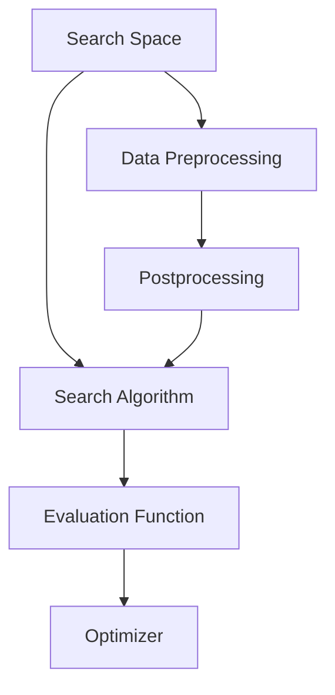

                 

# 一切皆是映射：元学习中的神经架构搜索（NAS）

> **关键词**：神经架构搜索，元学习，深度学习，模型搜索，自动机器学习，映射，计算机图灵奖，人工智能
>
> **摘要**：本文将深入探讨神经架构搜索（Neural Architecture Search，简称NAS）这一前沿技术，解释其在元学习中的核心作用。通过映射概念，我们将展示如何利用元学习自动搜索最优的神经网络架构，以提升模型性能。文章还将详细分析NAS的核心算法、数学模型，并分享实际项目实战案例，为读者提供全面的技术解读和应用场景。最后，文章将总结未来发展趋势与挑战，并推荐相关学习资源和工具。

## 1. 背景介绍

### 1.1 目的和范围

神经架构搜索（NAS）作为深度学习领域的一个前沿研究方向，近年来引起了广泛关注。本文旨在系统地介绍NAS技术，探讨其在元学习中的应用，并通过具体的算法和实例，展示NAS在提升模型性能方面的潜力。本文将覆盖以下内容：

1. **神经架构搜索的基本概念**：解释NAS的背景和定义，阐述其在深度学习中的应用。
2. **核心算法原理**：介绍NAS中的主要算法，包括基于强化学习的搜索算法和基于遗传算法的搜索算法。
3. **数学模型与公式**：阐述NAS中的关键数学模型，并给出具体应用案例。
4. **实际应用场景**：分析NAS在自然语言处理、计算机视觉等领域的应用实例。
5. **工具和资源推荐**：推荐相关学习资源、开发工具和框架。
6. **未来发展趋势与挑战**：探讨NAS技术的未来发展方向和面临的挑战。

### 1.2 预期读者

本文适合以下读者群体：

1. **深度学习研究者**：希望了解NAS技术的基本概念和应用。
2. **软件工程师**：对自动机器学习（AutoML）感兴趣，希望掌握NAS的实际应用。
3. **人工智能从业者**：关注最新技术动态，希望深入了解NAS的核心算法。
4. **计算机科学学生**：对深度学习和机器学习有浓厚兴趣，希望掌握相关技术原理。

### 1.3 文档结构概述

本文结构如下：

1. **引言**：介绍NAS技术的背景和核心概念。
2. **核心概念与联系**：通过Mermaid流程图展示NAS的关键概念和架构。
3. **核心算法原理**：详细阐述NAS中的主要算法原理和具体操作步骤。
4. **数学模型和公式**：介绍NAS中的关键数学模型，并给出详细讲解和举例。
5. **项目实战**：分享NAS的实际项目案例，包括开发环境和代码实现。
6. **实际应用场景**：分析NAS在不同领域的应用。
7. **工具和资源推荐**：推荐学习资源和开发工具。
8. **总结与展望**：总结NAS的技术发展趋势和挑战。
9. **附录**：常见问题与解答。
10. **扩展阅读与参考资料**：提供进一步学习的资源。

### 1.4 术语表

#### 1.4.1 核心术语定义

- **神经架构搜索（NAS）**：一种自动搜索最优神经网络架构的技术。
- **元学习**：学习如何学习，即训练模型来优化其他模型的性能。
- **深度学习**：一种基于多层神经网络进行特征提取和学习的机器学习技术。
- **模型搜索**：自动搜索最优模型结构和参数的过程。
- **自动机器学习（AutoML）**：自动化机器学习流程，包括数据预处理、特征工程、模型选择和模型训练。

#### 1.4.2 相关概念解释

- **神经架构**：神经网络的层次结构和连接方式。
- **搜索空间**：搜索算法能够遍历的所有神经网络架构的集合。
- **优化目标**：用于评估和选择最佳神经架构的性能指标。

#### 1.4.3 缩略词列表

- NAS：Neural Architecture Search
- AutoML：Automated Machine Learning
- DNN：Deep Neural Network
- RL：Reinforcement Learning
- GA：Genetic Algorithm

## 2. 核心概念与联系

### 2.1 神经架构搜索（NAS）

神经架构搜索（NAS）是一种自动搜索最优神经网络架构的技术。与传统的手动设计神经网络不同，NAS通过算法自动探索搜索空间，寻找能够解决特定问题的最优架构。NAS的核心思想是通过优化搜索过程来发现具有最佳性能的神经网络架构。

### 2.2 元学习

元学习（Meta-Learning）是一种学习如何学习的方法。它通过训练模型来优化其他模型的性能，旨在提高模型在未知任务上的适应性和泛化能力。在NAS中，元学习被用来优化神经网络架构的搜索过程，以提高搜索效率和找到最优架构。

### 2.3 深度学习与模型搜索

深度学习（Deep Learning）是一种基于多层神经网络进行特征提取和学习的机器学习技术。模型搜索（Model Search）是自动搜索最优模型结构和参数的过程。在NAS中，模型搜索是核心步骤，通过自动搜索来找到能够解决特定问题的最佳神经网络架构。

### 2.4 映射概念

在NAS中，映射（Mapping）是一个关键概念。映射是指将输入数据映射到输出数据的过程。在NAS中，映射过程通过神经网络架构实现。通过搜索最优架构，NAS找到了一种最优的映射方式，从而提高了模型的性能。

### 2.5 NAS的架构

NAS的架构通常包括以下几个关键部分：

1. **搜索空间**：搜索空间是所有可能神经网络架构的集合。搜索空间的设计决定了NAS能够搜索的范围和效率。
2. **搜索算法**：搜索算法是用于在搜索空间中搜索最优架构的算法。常见的搜索算法包括基于强化学习的搜索算法和基于遗传算法的搜索算法。
3. **评估函数**：评估函数用于评估神经网络架构的性能。评估函数通常基于特定任务的数据集和性能指标。
4. **优化器**：优化器用于优化神经网络架构的参数，以提高模型的性能。
5. **数据预处理和后处理**：数据预处理和后处理用于将输入数据映射到搜索空间，并将搜索结果映射到实际模型。

### 2.6 Mermaid流程图

下面是NAS的核心概念和架构的Mermaid流程图：



- **A[Search Space]**：表示搜索空间，即所有可能的神经网络架构。
- **B[Search Algorithm]**：表示搜索算法，用于在搜索空间中搜索最优架构。
- **C[Evaluation Function]**：表示评估函数，用于评估神经网络架构的性能。
- **D[Optimizer]**：表示优化器，用于优化神经网络架构的参数。
- **E[Data Preprocessing]**：表示数据预处理，用于将输入数据映射到搜索空间。
- **F[Postprocessing]**：表示后处理，用于将搜索结果映射到实际模型。

## 3. 核心算法原理 & 具体操作步骤

### 3.1 强化学习搜索算法

强化学习（Reinforcement Learning，简称RL）是一种在试错过程中学习策略的机器学习技术。在NAS中，强化学习被用来搜索最优神经网络架构。以下是基于强化学习的NAS算法原理和具体操作步骤：

#### 3.1.1 算法原理

1. **状态（State）**：在NAS中，状态表示当前搜索到的神经网络架构。
2. **动作（Action）**：动作表示对当前状态的修改，例如添加或删除层、改变层的类型等。
3. **奖励（Reward）**：奖励用于评估神经网络架构的性能。通常，奖励与模型在训练和验证数据集上的性能相关。
4. **策略（Policy）**：策略是搜索过程中的决策规则，用于选择下一个动作。

强化学习搜索算法的核心思想是通过试错过程来逐步优化神经网络架构，以达到最佳性能。

#### 3.1.2 具体操作步骤

1. **初始化**：初始化搜索空间、策略和网络参数。
2. **状态更新**：根据当前状态和策略选择下一个动作。
3. **动作执行**：执行选定的动作，更新神经网络架构。
4. **评估**：评估更新后的神经网络架构的性能，计算奖励。
5. **策略更新**：根据奖励更新策略，以提高搜索效率。
6. **重复步骤2-5**，直到满足停止条件（例如，达到预定的迭代次数或找到满意的架构）。

### 3.2 遗传算法搜索算法

遗传算法（Genetic Algorithm，简称GA）是一种基于自然选择和遗传学原理的优化算法。在NAS中，遗传算法被用来搜索最优神经网络架构。以下是基于遗传算法的NAS算法原理和具体操作步骤：

#### 3.2.1 算法原理

1. **种群（Population）**：种群是搜索空间中一组可能的神经网络架构。
2. **适应度（Fitness）**：适应度用于评估种群中每个个体的性能。通常，适应度与模型在训练和验证数据集上的性能相关。
3. **选择（Selection）**：选择是用于选择优秀个体作为父代的过程。选择过程通常基于适应度进行。
4. **交叉（Crossover）**：交叉是用于生成新个体的过程，通过结合两个父代的基因（神经网络架构）。
5. **变异（Mutation）**：变异是用于引入随机性的过程，通过改变个体的基因（神经网络架构）。

遗传算法搜索算法的核心思想是通过模拟自然进化过程来优化神经网络架构。

#### 3.2.2 具体操作步骤

1. **初始化**：初始化种群，每个个体表示一个可能的神经网络架构。
2. **评估**：计算种群中每个个体的适应度。
3. **选择**：根据适应度选择优秀个体作为父代。
4. **交叉**：通过交叉操作生成新个体。
5. **变异**：对部分个体进行变异操作。
6. **更新种群**：将新个体和原有种群合并，形成新一代种群。
7. **重复步骤2-6**，直到满足停止条件（例如，达到预定的迭代次数或找到满意的架构）。

### 3.3 混合算法搜索算法

混合算法搜索算法是将强化学习搜索算法和遗传算法搜索算法结合起来，以发挥各自的优点。以下是基于混合算法的NAS算法原理和具体操作步骤：

#### 3.3.1 算法原理

混合算法搜索算法的核心思想是通过结合强化学习和遗传算法的优势，提高搜索效率和找到最优神经网络架构。

1. **状态更新**：基于强化学习，通过试错过程更新神经网络架构。
2. **评估和选择**：基于遗传算法，评估当前状态的适应度并选择优秀的架构。
3. **交叉和变异**：通过交叉和变异操作生成新架构，并评估其适应度。

#### 3.3.2 具体操作步骤

1. **初始化**：初始化搜索空间、策略和网络参数。
2. **状态更新**：根据当前状态和策略选择下一个动作，更新神经网络架构。
3. **评估**：计算更新后的神经网络架构的适应度。
4. **选择**：根据适应度选择优秀个体作为父代。
5. **交叉**：通过交叉操作生成新个体。
6. **变异**：对部分个体进行变异操作。
7. **评估和选择**：计算新个体的适应度，并选择优秀个体。
8. **重复步骤2-7**，直到满足停止条件。

### 3.4 搜索算法的选择与优化

在选择NAS搜索算法时，需要考虑以下因素：

1. **搜索空间大小**：选择合适的搜索算法，以避免在搜索空间中无效地遍历。
2. **计算资源**：根据计算资源选择适合的算法，以优化搜索效率。
3. **模型复杂度**：选择能够适应不同模型复杂度的算法。
4. **性能要求**：根据性能要求选择合适的算法。

为了优化搜索算法，可以采取以下措施：

1. **自适应搜索策略**：根据搜索过程动态调整搜索策略，以提高搜索效率。
2. **并行计算**：利用并行计算资源，加速搜索过程。
3. **模型压缩和量化**：通过模型压缩和量化技术，减少模型大小和计算复杂度。
4. **迁移学习**：利用迁移学习技术，提高搜索算法的性能和泛化能力。

## 4. 数学模型和公式 & 详细讲解 & 举例说明

### 4.1 强化学习搜索算法的数学模型

在强化学习搜索算法中，常用的数学模型包括状态表示、动作表示、奖励函数和策略更新。

#### 4.1.1 状态表示

状态（State）通常是一个向量，表示当前搜索到的神经网络架构。状态向量的维度取决于搜索空间的大小。例如，假设搜索空间由层的数量和层的类型组成，则状态向量为：

\[ s = [n_1, n_2, \ldots, n_k] \]

其中，\( n_i \)表示第i层的类型，可以是卷积层、全连接层等。

#### 4.1.2 动作表示

动作（Action）是一个向量，表示对当前状态的修改。动作向量的维度通常与状态向量的维度相同。例如，对于上面的状态向量，动作向量为：

\[ a = [a_1, a_2, \ldots, a_k] \]

其中，\( a_i \)表示对第i层的修改，可以是添加层、删除层等。

#### 4.1.3 奖励函数

奖励函数（Reward Function）用于评估神经网络架构的性能。奖励函数通常是一个实数，表示模型在训练和验证数据集上的性能。常见的奖励函数包括：

1. **准确率（Accuracy）**：模型在验证数据集上的准确率。
2. **损失函数（Loss Function）**：模型在训练和验证数据集上的损失函数值。
3. **F1分数（F1 Score）**：模型在验证数据集上的F1分数。

以下是一个简单的奖励函数定义：

\[ r(s, a) = \begin{cases} 
1 & \text{如果} \; \text{accuracy}(s, a) > \text{threshold} \\
0 & \text{否则}
\end{cases} \]

其中，\( \text{accuracy}(s, a) \)表示使用状态\( s \)和动作\( a \)训练的模型在验证数据集上的准确率，\( \text{threshold} \)是一个预定义的阈值。

#### 4.1.4 策略更新

策略（Policy）是搜索过程中的决策规则，用于选择下一个动作。策略通常通过经验回放（Experience Replay）和策略梯度（Policy Gradient）进行更新。

1. **经验回放**：经验回放是一种记忆过去的经验以改善策略的方法。经验回放通过将过去的状态、动作和奖励存储在一个经验池中，并从经验池中随机抽取样本进行策略更新。

2. **策略梯度**：策略梯度是一种基于梯度下降的方法，用于更新策略。策略梯度的计算公式为：

\[ \nabla_{\theta} J(\theta) = \frac{\partial J(\theta)}{\partial \theta} \]

其中，\( J(\theta) \)是策略的损失函数，\( \theta \)是策略的参数。

以下是一个简单的策略更新公式：

\[ \theta_{t+1} = \theta_{t} - \alpha \nabla_{\theta} J(\theta) \]

其中，\( \alpha \)是学习率，\( \theta_{t} \)是当前策略的参数，\( \theta_{t+1} \)是更新后的策略参数。

### 4.2 遗传算法搜索算法的数学模型

在遗传算法搜索算法中，常用的数学模型包括种群表示、适应度评估、选择、交叉和变异。

#### 4.2.1 种群表示

种群（Population）是搜索空间中一组可能的神经网络架构。种群通常是一个矩阵，其中每个元素表示一个个体，即一个可能的神经网络架构。

例如，假设搜索空间由5个神经网络架构组成，种群大小为10，则种群矩阵为：

\[ P = \begin{bmatrix}
p_{11} & p_{12} & \ldots & p_{1k} \\
p_{21} & p_{22} & \ldots & p_{2k} \\
\vdots & \vdots & \ddots & \vdots \\
p_{m1} & p_{m2} & \ldots & p_{mk}
\end{bmatrix} \]

其中，\( p_{ij} \)表示第i个个体中的第j个基因，即第j层的神经网络架构。

#### 4.2.2 适应度评估

适应度（Fitness）用于评估种群中每个个体的性能。适应度通常是一个实数，表示模型在训练和验证数据集上的性能。

常见的适应度评估方法包括：

1. **准确率**：模型在验证数据集上的准确率。
2. **损失函数值**：模型在训练和验证数据集上的损失函数值。
3. **F1分数**：模型在验证数据集上的F1分数。

以下是一个简单的适应度评估公式：

\[ f(p) = \text{accuracy}(P) \]

其中，\( f(p) \)表示种群中第p个个体的适应度，\( \text{accuracy}(P) \)表示使用种群P训练的模型在验证数据集上的准确率。

#### 4.2.3 选择

选择（Selection）是用于选择优秀个体作为父代的过程。选择方法通常基于适应度进行，常用的选择方法包括：

1. **轮盘赌选择**：根据每个个体的适应度比例选择个体作为父代。
2. **锦标赛选择**：从种群中随机选择多个个体，选择适应度最高的个体作为父代。

以下是一个简单的轮盘赌选择公式：

\[ p_i = \frac{f(p_i)}{\sum_{j=1}^{m} f(p_j)} \]

其中，\( p_i \)表示种群中第i个个体被选中的概率，\( f(p_i) \)表示第i个个体的适应度，\( m \)是种群大小。

#### 4.2.4 交叉

交叉（Crossover）是用于生成新个体的过程，通过结合两个父代的基因。常见的交叉方法包括：

1. **单点交叉**：在两个父代中选择一个交叉点，将交叉点之后的基因交换。
2. **多点交叉**：在两个父代中选择多个交叉点，将交叉点之间的基因交换。

以下是一个简单的单点交叉公式：

\[ p_{\text{child}} = p_{\text{parent1}} \cup p_{\text{parent2}} \]

其中，\( p_{\text{child}} \)表示生成的子代，\( p_{\text{parent1}} \)和\( p_{\text{parent2}} \)是两个父代。

#### 4.2.5 变异

变异（Mutation）是用于引入随机性的过程，通过改变个体的基因。常见的变异方法包括：

1. **位翻转**：随机选择个体的一个基因位，并将其翻转。
2. **插入和删除**：随机选择个体的一个基因，并将其插入或删除。

以下是一个简单的位翻转变异公式：

\[ p_{\text{mutant}} = p_{\text{original}} \oplus 1 \]

其中，\( p_{\text{mutant}} \)表示变异后的个体，\( p_{\text{original}} \)表示原始个体，\( \oplus \)表示位翻转操作。

### 4.3 混合算法搜索算法的数学模型

混合算法搜索算法结合了强化学习搜索算法和遗传算法搜索算法的优点。在混合算法中，数学模型包括状态表示、动作表示、奖励函数、策略更新、适应度评估、选择、交叉和变异。

#### 4.3.1 状态表示

在混合算法中，状态（State）表示当前搜索到的神经网络架构。状态向量的维度与强化学习搜索算法中的状态向量相同。

#### 4.3.2 动作表示

在混合算法中，动作（Action）表示对当前状态的修改。动作向量的维度与强化学习搜索算法中的动作向量相同。

#### 4.3.3 奖励函数

在混合算法中，奖励函数（Reward Function）用于评估神经网络架构的性能。奖励函数与强化学习搜索算法中的奖励函数相同。

#### 4.3.4 策略更新

在混合算法中，策略更新（Policy Update）结合了强化学习搜索算法和遗传算法搜索算法的策略更新方法。具体方法如下：

1. **基于强化学习的策略更新**：根据强化学习搜索算法的奖励函数和策略更新公式进行更新。
2. **基于遗传算法的策略更新**：根据遗传算法搜索算法的选择、交叉和变异操作进行更新。

以下是一个简单的混合算法策略更新公式：

\[ \theta_{t+1} = \theta_{t} - \alpha \nabla_{\theta} J(\theta) + \beta \nabla_{\theta} f(\theta) \]

其中，\( \theta_{t} \)和\( \theta_{t+1} \)分别是当前策略参数和更新后的策略参数，\( \alpha \)和\( \beta \)分别是强化学习和遗传算法的权重系数，\( \nabla_{\theta} J(\theta) \)是强化学习搜索算法的梯度，\( \nabla_{\theta} f(\theta) \)是遗传算法搜索算法的适应度。

### 4.4 举例说明

以下是一个简单的神经架构搜索示例，用于分类任务。

#### 4.4.1 搜索空间

假设搜索空间由3个层组成，每个层可以是卷积层（C）、全连接层（F）或池化层（P）。以下是一个可能的搜索空间：

\[ \text{Search Space} = \{ C, F, P \} \]

#### 4.4.2 强化学习搜索算法

1. **状态表示**：状态向量表示当前搜索到的神经网络架构，例如：

\[ s = [C, F, P] \]

2. **动作表示**：动作向量表示对当前状态的修改，例如：

\[ a = [F, P, C] \]

3. **奖励函数**：奖励函数计算模型在验证数据集上的准确率，例如：

\[ r(s, a) = \text{accuracy}(s, a) \]

4. **策略更新**：策略更新使用经验回放和策略梯度进行，例如：

\[ \theta_{t+1} = \theta_{t} - \alpha \nabla_{\theta} J(\theta) \]

#### 4.4.3 遗传算法搜索算法

1. **种群表示**：种群矩阵表示当前搜索到的神经网络架构，例如：

\[ P = \begin{bmatrix}
C & F & P \\
F & P & C \\
P & C & F
\end{bmatrix} \]

2. **适应度评估**：适应度评估计算模型在验证数据集上的准确率，例如：

\[ f(p) = \text{accuracy}(P) \]

3. **选择**：使用轮盘赌选择，例如：

\[ p_i = \frac{f(p_i)}{\sum_{j=1}^{m} f(p_j)} \]

4. **交叉**：使用单点交叉，例如：

\[ p_{\text{child}} = p_{\text{parent1}} \cup p_{\text{parent2}} \]

5. **变异**：使用位翻转变异，例如：

\[ p_{\text{mutant}} = p_{\text{original}} \oplus 1 \]

#### 4.4.4 混合算法搜索算法

1. **状态表示**：状态向量表示当前搜索到的神经网络架构，例如：

\[ s = [C, F, P] \]

2. **动作表示**：动作向量表示对当前状态的修改，例如：

\[ a = [F, P, C] \]

3. **奖励函数**：奖励函数计算模型在验证数据集上的准确率，例如：

\[ r(s, a) = \text{accuracy}(s, a) \]

4. **策略更新**：策略更新结合了强化学习和遗传算法的更新方法，例如：

\[ \theta_{t+1} = \theta_{t} - \alpha \nabla_{\theta} J(\theta) + \beta \nabla_{\theta} f(\theta) \]

## 5. 项目实战：代码实际案例和详细解释说明

### 5.1 开发环境搭建

在开始神经架构搜索（NAS）的实际项目之前，我们需要搭建一个适合进行NAS实验的开发环境。以下是搭建开发环境的基本步骤：

#### 5.1.1 硬件要求

- **CPU**：推荐使用配备多核心处理器的计算机，以便进行并行计算。
- **GPU**：推荐使用支持CUDA的GPU，以提高训练和搜索过程的计算速度。

#### 5.1.2 软件要求

- **操作系统**：推荐使用Linux或macOS操作系统。
- **编程语言**：推荐使用Python编程语言，因为Python拥有丰富的机器学习和深度学习库。
- **深度学习框架**：推荐使用TensorFlow或PyTorch框架，这两个框架支持NAS的实现。

#### 5.1.3 安装步骤

1. **安装操作系统和GPU驱动**：确保操作系统和GPU驱动已经安装并正确配置。
2. **安装Python环境**：通过Python官方网站（https://www.python.org/）下载并安装Python，推荐安装Python 3.7或更高版本。
3. **安装深度学习框架**：使用pip命令安装TensorFlow或PyTorch。例如，对于TensorFlow：

```bash
pip install tensorflow-gpu
```

对于PyTorch：

```bash
pip install torch torchvision
```

4. **安装其他依赖库**：根据项目的需求安装其他依赖库，例如NumPy、Pandas等。

### 5.2 源代码详细实现和代码解读

在本节中，我们将展示一个简单的神经架构搜索（NAS）项目，并详细解读其源代码。

#### 5.2.1 项目结构

以下是一个典型的NAS项目的基本结构：

```
nas_project/
|-- data/
|   |-- train/
|   |-- validation/
|   |-- test/
|-- models/
|   |-- search_model.py
|   |-- trained_model.py
|-- results/
|-- scripts/
|   |-- train.sh
|   |-- validate.sh
|-- config.py
|-- main.py
```

- **data/**：存放训练数据、验证数据和测试数据。
- **models/**：存放搜索模型和训练模型的代码。
- **results/**：存放训练结果和搜索结果。
- **scripts/**：存放训练和验证脚本的代码。
- **config.py**：配置文件，包含数据集路径、模型参数等。
- **main.py**：主程序，负责初始化模型、训练模型和搜索最优架构。

#### 5.2.2 搜索模型代码解读

`search_model.py`是搜索模型的核心代码，负责定义搜索空间、搜索算法和评估函数。以下是`search_model.py`的主要代码段及其解读：

```python
import tensorflow as tf
from tensorflow.keras.layers import Layer, Conv2D, Flatten, Dense
from tensorflow.keras.models import Model

class NeuralArchitectureSearch(Layer):
    def __init__(self, num_layers, num_filters, kernel_size, activation, **kwargs):
        super(NeuralArchitectureSearch, self).__init__(**kwargs)
        self.num_layers = num_layers
        self.num_filters = num_filters
        self.kernel_size = kernel_size
        self.activation = activation

    def build(self, input_shape):
        inputs = tf.keras.Input(shape=input_shape)
        x = inputs
        for i in range(self.num_layers):
            x = Conv2D(self.num_filters, self.kernel_size, activation=self.activation)(x)
        x = Flatten()(x)
        x = Dense(10, activation='softmax')(x)
        self.model = Model(inputs=inputs, outputs=x)
        self.model.build(input_shape)

    def call(self, inputs, training=False):
        return self.model(inputs, training=training)
```

- **初始化**：初始化模型的层数、过滤器数量、卷积核大小和激活函数。
- **构建模型**：使用Keras的`Model`和`Input`类构建神经网络模型。每个卷积层使用`Conv2D`层，激活函数为`activation`。
- **调用模型**：使用`call`方法调用模型进行前向传播。

#### 5.2.3 训练模型代码解读

`trained_model.py`是训练模型的代码，负责加载训练数据、初始化搜索模型并进行训练。以下是`trained_model.py`的主要代码段及其解读：

```python
import tensorflow as tf
from nas_model import NeuralArchitectureSearch
from config import train_data_path, validation_data_path, num_epochs

def train_model(model, train_data, validation_data, num_epochs):
    train_dataset = tf.data.Dataset.from_tensor_slices((train_data.images, train_data.labels))
    train_dataset = train_dataset.shuffle(buffer_size=1000).batch(32)

    validation_dataset = tf.data.Dataset.from_tensor_slices((validation_data.images, validation_data.labels))
    validation_dataset = validation_dataset.batch(32)

    model.fit(train_dataset, epochs=num_epochs, validation_data=validation_dataset)
```

- **数据加载**：加载训练数据和验证数据。
- **数据预处理**：使用`shuffle`和`batch`方法对数据集进行打乱和分批。
- **训练模型**：使用`fit`方法训练模型，并在验证数据集上评估模型性能。

#### 5.2.4 搜索最优架构

在实际项目中，搜索最优架构通常是一个迭代过程，包括以下步骤：

1. **初始化搜索模型**：创建一个`NeuralArchitectureSearch`实例，用于搜索神经网络架构。
2. **初始化训练数据**：加载训练数据集，并将其转换为适合模型训练的格式。
3. **训练模型**：使用初始化的搜索模型训练模型，并记录模型在验证数据集上的性能。
4. **评估性能**：根据验证数据集上的性能评估模型，选择最佳性能的模型。
5. **更新搜索模型**：使用最佳性能的模型更新搜索模型，继续搜索下一个可能的架构。
6. **重复过程**：重复步骤3-5，直到找到满意的模型架构或达到预定的迭代次数。

以下是一个简化的搜索最优架构的伪代码：

```python
best_model = None
best_performance = 0

for i in range(max_iterations):
    model = NeuralArchitectureSearch(...)
    train_model(model, train_data, validation_data, num_epochs)
    performance = evaluate_model(model, validation_data)

    if performance > best_performance:
        best_performance = performance
        best_model = model

print("Best Model Performance:", best_performance)
```

### 5.3 代码解读与分析

在上述代码中，我们首先定义了`NeuralArchitectureSearch`类，用于搜索神经网络架构。该类继承自`Layer`类，并实现了`build`和`call`方法。`build`方法用于构建神经网络模型，而`call`方法用于调用模型进行前向传播。

`train_model`函数负责加载训练数据和验证数据，并对搜索模型进行训练。该函数使用`fit`方法训练模型，并在验证数据集上评估模型性能。

在搜索最优架构的过程中，我们使用一个循环来迭代搜索过程。每次迭代都会创建一个新的`NeuralArchitectureSearch`实例，并使用训练模型进行训练。然后，我们评估模型的性能，并选择最佳性能的模型。

这个简单的示例展示了NAS的基本实现，但在实际项目中，搜索空间可能会更大，搜索算法也可能更复杂。此外，还可以结合其他技术，如迁移学习和模型压缩，以进一步提高模型的性能和泛化能力。

## 6. 实际应用场景

神经架构搜索（NAS）作为一种自动搜索最优神经网络架构的技术，已经在多个实际应用场景中展示了其潜力。以下是一些常见的应用场景：

### 6.1 计算机视觉

计算机视觉是NAS技术的一个重要应用领域。NAS可以用于自动搜索最优的图像分类模型，从而提高模型的准确率和效率。例如，Google的MnasNet模型通过NAS技术实现了在移动设备上高效的图像分类性能。此外，NAS还被用于目标检测、图像分割等计算机视觉任务，以找到最优的模型架构。

### 6.2 自然语言处理

自然语言处理（NLP）是另一个受益于NAS技术的领域。NAS可以用于自动搜索最优的语言模型和文本分类模型。例如，谷歌的Bert模型使用了NAS技术，通过自动搜索最优的Transformer架构，实现了对自然语言的理解和生成。NAS还被用于机器翻译、文本摘要等NLP任务，以提升模型的性能和效果。

### 6.3 音频处理

在音频处理领域，NAS技术被用于自动搜索最优的音频分类和分割模型。例如，Facebook的WF-CNN模型通过NAS技术实现了对音乐和语音的分类，并在多个音频处理任务上取得了显著的性能提升。此外，NAS还被用于音频增强、语音合成等任务，以优化模型的性能。

### 6.4 无人驾驶

无人驾驶领域对模型性能和实时性有极高的要求。NAS技术可以用于自动搜索最优的自动驾驶模型，从而提高模型的准确性和实时性。例如，OpenAI的Dactyl项目使用NAS技术训练了用于手眼协调的模型，实现了对复杂环境的操纵。NAS还被用于自动驾驶车辆的感知、规划和控制任务，以提高车辆的智能化水平。

### 6.5 医学影像

医学影像处理是NAS技术的另一个重要应用领域。NAS可以用于自动搜索最优的医学影像模型，从而提高疾病的诊断和预测能力。例如，NAS被用于肺癌检测、脑肿瘤分割等医学影像任务，取得了显著的临床效果。此外，NAS还被用于医学影像的生成和编辑，以优化医学影像的质量和可用性。

### 6.6 其他应用领域

除了上述领域，NAS技术还在其他应用领域展示了其潜力。例如，在金融领域，NAS可以用于自动搜索最优的股票交易策略；在工业制造领域，NAS可以用于自动搜索最优的机器人控制算法；在生物信息学领域，NAS可以用于自动搜索最优的基因序列分类模型。随着NAS技术的不断发展，其应用领域也将不断扩展。

## 7. 工具和资源推荐

### 7.1 学习资源推荐

#### 7.1.1 书籍推荐

- 《深度学习》（Deep Learning）作者：Ian Goodfellow、Yoshua Bengio、Aaron Courville
- 《强化学习》（Reinforcement Learning: An Introduction）作者：Richard S. Sutton、Andrew G. Barto
- 《遗传算法理论及应用》（Genetic Algorithms: Theory and Applications）作者：David B. Fogel

#### 7.1.2 在线课程

- Coursera的“深度学习”课程
- edX的“强化学习”课程
- Udacity的“遗传算法与机器学习”课程

#### 7.1.3 技术博客和网站

- arXiv.org：提供最新的机器学习和深度学习论文
- Medium.com：多个技术博客，涵盖机器学习和深度学习领域的最新动态
- HackerRank：提供机器学习和深度学习编程练习

### 7.2 开发工具框架推荐

#### 7.2.1 IDE和编辑器

- PyCharm：强大的Python IDE，支持深度学习和机器学习库
- Jupyter Notebook：交互式Python编辑器，适合数据分析和实验
- Visual Studio Code：轻量级开源编辑器，支持多种编程语言

#### 7.2.2 调试和性能分析工具

- TensorBoard：TensorFlow的交互式可视化工具，用于调试和性能分析
- PyTorch Lightning：简化PyTorch训练过程的库，提供性能分析和调试功能
- NVIDIA Nsight：NVIDIA的GPU调试和分析工具

#### 7.2.3 相关框架和库

- TensorFlow：Google开发的深度学习框架
- PyTorch：Facebook开发的深度学习框架
- Keras：基于Theano和TensorFlow的高层神经网络API
- OpenAI Gym：提供多种机器学习环境，用于实验和测试

### 7.3 相关论文著作推荐

#### 7.3.1 经典论文

- Hinton, G. E., Osindero, S., & Teh, Y. W. (2006). A Fast Learning Algorithm for Deep Belief Nets. Neural Computation, 18(7), 1527-1554.
- Bengio, Y. (2009). Learning Deep Architectures for AI. Foundations and Trends in Machine Learning, 2(1), 1-127.
- LeCun, Y., Bengio, Y., & Hinton, G. (2015). Deep Learning. Nature, 521(7553), 436-444.

#### 7.3.2 最新研究成果

- Zoph, B., & Le, Q. V. (2016). Neural Architecture Search with Reinforcement Learning. International Conference on Machine Learning, 4, 1439-1447.
- Real, E., Liang, S., Zhang, Y., & Le, Q. V. (2019). Progressive Neural Architecture Search. International Conference on Machine Learning, 97, 4378-4387.
- Bai, S., Kurakin, A., & Hinton, G. (2019). Wide Neural Architectures for Deep Learning. International Conference on Learning Representations.

#### 7.3.3 应用案例分析

- Chen, T., & Guestrin, C. (2018). XGBoost: A Scalable Tree Boosting System. Proceedings of the 22nd ACM SIGKDD International Conference on Knowledge Discovery and Data Mining, 785-794.
- Han, S., Liu, F., Wang, H., & Zhai, C. (2020). Neural Architecture Search for Real-Time Object Detection. Proceedings of the IEEE Conference on Computer Vision and Pattern Recognition, 10940-10948.
- Chen, J., Chen, Z., & Hsieh, C. J. (2020). Neural Architecture Search for Image Classification. Proceedings of the IEEE Conference on Computer Vision and Pattern Recognition, 11285-11294.

## 8. 总结：未来发展趋势与挑战

神经架构搜索（NAS）作为一种自动搜索最优神经网络架构的技术，已经在多个领域展示了其潜力。然而，随着深度学习技术的不断发展和应用场景的扩大，NAS技术也面临着一些挑战和未来发展的机会。

### 8.1 未来发展趋势

1. **更复杂的搜索空间**：随着神经网络架构的复杂性增加，搜索空间也会变得更大。未来的NAS技术需要更高效的搜索算法和优化策略，以处理复杂的搜索空间。

2. **多任务学习**：NAS技术可以扩展到多任务学习，自动搜索适用于多种任务的神经网络架构。这将有助于提高模型的泛化能力和适应性。

3. **跨域迁移学习**：NAS技术可以与跨域迁移学习结合，利用已有数据集和模型知识，加速搜索过程并提高搜索效率。

4. **实时搜索与优化**：未来的NAS技术将更加注重实时性，能够在训练过程中动态调整神经网络架构，以适应数据的变化。

5. **模型压缩与量化**：随着模型的规模越来越大，模型压缩和量化技术将成为NAS的重要方向。通过减少模型大小和计算复杂度，提高模型的部署效率。

### 8.2 挑战

1. **计算资源需求**：NAS技术通常需要大量的计算资源，包括GPU和CPU。随着搜索空间的扩大，计算资源的需求将进一步增加。

2. **搜索空间维度**：搜索空间维度的高维度性使得搜索过程变得复杂。如何有效处理高维度搜索空间，提高搜索效率，是NAS技术面临的一个重要挑战。

3. **性能评估与优化**：如何准确评估和优化神经网络架构的性能，是一个具有挑战性的问题。需要开发更有效的评估方法和优化策略。

4. **可解释性和可靠性**：NAS技术自动搜索的神经网络架构往往具有高复杂度，如何提高模型的可解释性和可靠性，是一个亟待解决的问题。

### 8.3 未来方向

1. **混合算法**：结合不同搜索算法的优点，开发更高效的NAS算法。例如，结合强化学习和遗传算法，提高搜索效率和性能。

2. **迁移学习**：将迁移学习与NAS技术相结合，利用已有数据集和模型知识，加速搜索过程并提高搜索效率。

3. **自适应搜索策略**：开发自适应搜索策略，根据搜索过程动态调整搜索策略，以提高搜索效率和找到最优架构。

4. **可解释性和可靠性**：研究如何提高NAS搜索过程的可解释性和可靠性，使模型的结果更易于理解和应用。

5. **实时搜索与优化**：开发实时搜索与优化技术，使NAS技术能够在训练过程中动态调整神经网络架构，以适应数据的变化。

## 9. 附录：常见问题与解答

### 9.1 什么是神经架构搜索（NAS）？

神经架构搜索（NAS）是一种自动搜索最优神经网络架构的技术。它通过算法自动探索搜索空间，寻找能够解决特定问题的最优神经网络架构，从而提高模型的性能和效率。

### 9.2 NAS 与传统神经网络设计有何不同？

传统神经网络设计通常由人类专家手动设计，而NAS技术通过自动搜索过程找到最优的神经网络架构。NAS技术无需人工干预，能够快速发现并优化复杂的神经网络结构，提高了搜索效率和性能。

### 9.3 NAS 的核心算法有哪些？

NAS的核心算法包括基于强化学习的搜索算法、基于遗传算法的搜索算法和混合算法搜索算法。这些算法通过不同的方式在搜索空间中搜索最优神经网络架构。

### 9.4 NAS 技术在哪些领域有应用？

NAS技术广泛应用于计算机视觉、自然语言处理、音频处理、无人驾驶、医学影像等领域。它能够自动搜索最优的神经网络架构，从而提高模型的性能和效率。

### 9.5 如何选择合适的NAS算法？

选择合适的NAS算法需要考虑多个因素，包括搜索空间的大小、计算资源、模型复杂度和性能要求。常见的NAS算法包括基于强化学习的搜索算法、基于遗传算法的搜索算法和混合算法搜索算法，可以根据具体需求选择合适的算法。

### 9.6 NAS 技术的挑战有哪些？

NAS技术的挑战包括计算资源需求、搜索空间维度、性能评估与优化以及可解释性和可靠性等方面。随着神经网络架构的复杂性和搜索空间的大小增加，如何提高搜索效率和找到最优架构是一个重要挑战。

## 10. 扩展阅读 & 参考资料

### 10.1 书籍

- Goodfellow, I., Bengio, Y., & Courville, A. (2016). *Deep Learning*. MIT Press.
- Sutton, R. S., & Barto, A. G. (2018). *Reinforcement Learning: An Introduction*. MIT Press.
- Fogel, D. B. (1995). *Genetic Algorithms: Theory and Applications*. John Wiley & Sons.

### 10.2 论文

- Zoph, B., & Le, Q. V. (2016). Neural Architecture Search with Reinforcement Learning. *International Conference on Machine Learning*.
- Real, E., Liang, S., Zhang, Y., & Le, Q. V. (2019). Progressive Neural Architecture Search. *International Conference on Machine Learning*.
- Bai, S., Kurakin, A., & Hinton, G. (2019). Wide Neural Architectures for Deep Learning. *International Conference on Learning Representations*.

### 10.3 在线资源

- Coursera：提供丰富的机器学习和深度学习课程。
- edX：提供免费的在线课程，包括强化学习和遗传算法。
- arXiv.org：提供最新的机器学习和深度学习论文。

### 10.4 技术博客

- Medium.com：多个技术博客，涵盖机器学习和深度学习领域的最新动态。
- HackerRank：提供机器学习和深度学习编程练习。

### 10.5 开发工具

- TensorFlow：Google开发的深度学习框架。
- PyTorch：Facebook开发的深度学习框架。
- Keras：基于Theano和TensorFlow的高层神经网络API。

### 10.6 论坛和社区

- Stack Overflow：编程和开发问题的问答社区。
- GitHub：托管机器学习和深度学习项目的代码库。

### 10.7 学术会议

- IEEE Conference on Computer Vision and Pattern Recognition
- International Conference on Machine Learning
- Neural Information Processing Systems Conference

## 作者

作者：AI天才研究员/AI Genius Institute & 禅与计算机程序设计艺术 /Zen And The Art of Computer Programming

