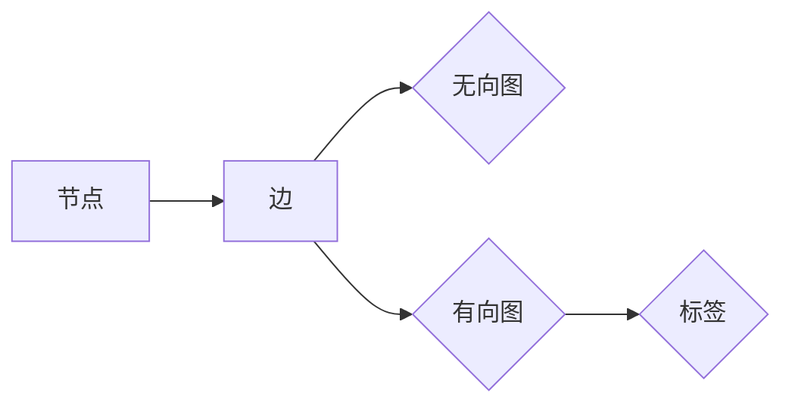
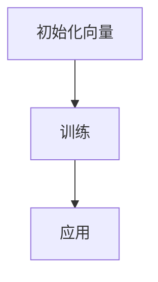
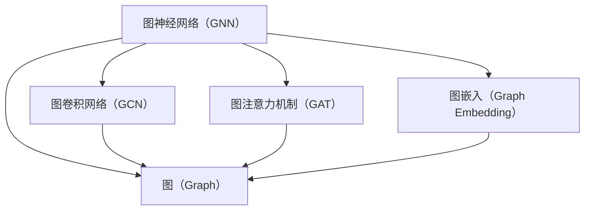

                 

### 1. 背景介绍

#### 1.1 目的和范围

本文旨在深入探讨图神经网络（Graph Neural Networks，简称GNN）的兴起与展望。作为近年来人工智能领域的重要突破，GNN在处理图结构数据方面展现了强大的能力。文章将首先回顾GNN的起源和发展历程，随后详细解释其核心概念和架构，并通过具体算法原理、数学模型和项目实战案例，全面展示GNN的运作机制和应用潜力。最终，我们将对GNN的实际应用场景进行探讨，并展望其未来的发展趋势与挑战。

#### 1.2 预期读者

本文主要面向以下读者群体：

- 对人工智能和机器学习有基本了解的研究人员、工程师和开发者；
- 对图结构和图神经网络有浓厚兴趣的学术研究者；
- 想深入了解GNN技术，并在实际项目中应用其能力的开发者；
- 对未来技术发展趋势感兴趣的科技爱好者。

无论您是上述哪一类读者，本文都将帮助您从不同角度理解和掌握GNN的核心知识和应用技巧。

#### 1.3 文档结构概述

本文分为十个主要部分，每个部分均针对不同主题进行详细讨论。具体结构如下：

1. **背景介绍**：介绍本文的目的、范围、预期读者和文档结构。
2. **核心概念与联系**：阐述图神经网络的基本概念和与其相关的重要联系。
3. **核心算法原理 & 具体操作步骤**：通过伪代码详细阐述GNN的基本算法原理和操作步骤。
4. **数学模型和公式 & 详细讲解 & 举例说明**：解释GNN的数学模型、公式和具体应用实例。
5. **项目实战：代码实际案例和详细解释说明**：展示一个实际项目案例，并详细解读其代码实现。
6. **实际应用场景**：分析GNN在不同领域的实际应用。
7. **工具和资源推荐**：推荐学习资源、开发工具和框架。
8. **总结：未来发展趋势与挑战**：总结GNN的发展趋势和面临的挑战。
9. **附录：常见问题与解答**：提供对常见问题的解答。
10. **扩展阅读 & 参考资料**：提供相关领域的进一步阅读材料和参考资源。

通过上述结构，我们将系统地梳理和介绍GNN的核心知识，帮助读者全面掌握这一前沿技术。

#### 1.4 术语表

在本篇文章中，我们将使用一些专业术语。以下是对这些术语的定义和解释：

##### 1.4.1 核心术语定义

- **图神经网络（Graph Neural Network, GNN）**：一种专门用于处理图结构数据的神经网络。
- **节点（Node）**：图中具有属性的数据点。
- **边（Edge）**：连接两个节点的数据线，通常也具有属性。
- **特征（Feature）**：节点的属性，用于描述节点的特征信息。
- **图（Graph）**：由节点和边构成的数据结构。
- **邻域（Neighborhood）**：与某个节点直接相连的节点集合。
- **传播（Propagation）**：GNN中用于传递节点特征信息的操作。

##### 1.4.2 相关概念解释

- **图卷积网络（Graph Convolutional Network, GCN）**：一种常见的GNN结构，通过卷积操作来更新节点特征。
- **图注意力机制（Graph Attention Mechanism, GAT）**：一种用于GNN的注意力机制，可以自适应地调整节点特征的重要性。
- **图池化（Graph Pooling）**：用于从一组节点中提取代表性的特征表示。
- **图嵌入（Graph Embedding）**：将图中的节点和边映射到低维空间，便于进一步处理。

##### 1.4.3 缩略词列表

- **GNN**：Graph Neural Network
- **GCN**：Graph Convolutional Network
- **GAT**：Graph Attention Mechanism

这些核心术语和相关概念是理解GNN的基础，将在后续章节中反复出现。通过本文的介绍，我们将逐步深入了解这些概念，并理解它们在实际应用中的重要性。接下来，我们将进一步探讨GNN的起源和发展历程，帮助读者建立对GNN的整体认知。请继续阅读。

## 2. 核心概念与联系

在深入探讨图神经网络（GNN）之前，我们需要理解几个核心概念，这些概念不仅构成了GNN的理论基础，也是其在实际应用中的重要支撑。本章节将详细介绍这些核心概念，并通过Mermaid流程图来展示它们之间的关系。

### 2.1 图（Graph）

图是GNN处理的主要数据结构。它由节点（Node）和边（Edge）组成。节点代表数据中的实体，而边则表示这些实体之间的关系。图可以分为无向图和有向图，也可以有标签来区分不同的节点和边。

#### 节点和边的关系

- **节点**：在社交网络中，每个人可以看作是一个节点。
- **边**：人与人之间的朋友关系可以看作是一条边。

#### Mermaid流程图



### 2.2 图卷积网络（Graph Convolutional Network, GCN）

GCN是GNN的一种常见实现。它通过卷积操作来更新节点特征。GCN的核心思想是将节点特征扩展到其邻域，然后整合这些扩展特征。

#### GCN的基本步骤

1. **邻域聚合**：聚合邻域节点的特征。
2. **特征扩展**：将节点特征扩展到整个邻域。
3. **激活函数**：使用激活函数对聚合后的特征进行非线性变换。

#### Mermaid流程图

```mermaid
graph TB
    A[输入特征]
    B[邻域节点特征]
    C{聚合]
    D[扩展特征]
    E[激活函数]
    A --> B
    B --> C
    C --> D
    D --> E
```

### 2.3 图注意力机制（Graph Attention Mechanism, GAT）

GAT是一种用于GNN的注意力机制，它允许模型动态地调整节点特征的重要性。GAT的核心思想是通过学习加权系数来控制邻域节点的贡献。

#### GAT的基本步骤

1. **生成注意力权重**：计算每个邻域节点的注意力权重。
2. **加权聚合**：根据注意力权重对邻域节点的特征进行加权聚合。
3. **输出生成**：生成节点表示和输出。

#### Mermaid流程图

```mermaid
graph TB
    A[节点特征]
    B[邻域节点特征]
    C{生成权重]
    D[加权聚合]
    E[输出生成]
    A --> B
    B --> C
    C --> D
    D --> E
```

### 2.4 图嵌入（Graph Embedding）

图嵌入是将图中的节点和边映射到低维空间的一种技术。图嵌入可以帮助我们在低维空间中更好地理解和处理图结构数据。

#### 图嵌入的基本步骤

1. **初始化嵌入向量**：为每个节点和边初始化一个低维嵌入向量。
2. **训练**：通过优化嵌入向量，使得嵌入向量能够更好地表示图结构和节点属性。
3. **应用**：使用训练好的嵌入向量进行下游任务，如节点分类、链接预测等。

#### Mermaid流程图



### 2.5 核心概念之间的联系

通过上述Mermaid流程图，我们可以看到GNN中的核心概念是如何相互关联的。图神经网络（GNN）通过图（Graph）来构建模型，并使用图卷积网络（GCN）或图注意力机制（GAT）来处理图中的节点特征。图嵌入（Graph Embedding）则是将这些特征映射到低维空间，以便进一步分析和应用。



通过这些核心概念和流程图的介绍，我们为后续章节的深入探讨奠定了基础。在下一章节中，我们将详细讲解GNN的核心算法原理，并通过具体的伪代码来展示其操作步骤。请继续阅读。

## 3. 核心算法原理 & 具体操作步骤

图神经网络（GNN）之所以能够在处理图结构数据方面表现出色，关键在于其独特的算法原理和操作步骤。本章节将深入讲解GNN的核心算法原理，并通过伪代码详细阐述其操作步骤，帮助读者更好地理解GNN的工作机制。

### 3.1 GNN基本算法原理

GNN的基本原理可以概括为以下几个步骤：

1. **节点特征聚合**：聚合节点自身特征及其邻域节点的特征。
2. **特征更新**：基于聚合特征更新节点特征。
3. **全局传播**：通过多轮传播，逐步整合节点特征。
4. **输出生成**：使用更新后的节点特征生成最终的输出。

#### 节点特征聚合

节点特征聚合是GNN中的核心操作。在这个过程中，节点会接收其邻域节点的特征信息，并通过某种聚合函数（如求和、均值、最大值等）进行整合。

#### 伪代码

```python
def aggregate_features(node, neighbors, W):
    aggregated_features = 0
    for neighbor in neighbors:
        aggregated_features += W.dot(neighbor_features[neighbor])
    return aggregated_features
```

#### 节点特征更新

在节点特征更新阶段，节点会根据自身特征和聚合后的邻域特征，通过一个非线性函数（如ReLU、Sigmoid等）进行更新。

#### 伪代码

```python
def update_features(node, original_features, aggregated_features, activation_function):
    new_features = activation_function(original_features + aggregated_features)
    return new_features
```

#### 全局传播

全局传播是指节点特征在图中的多轮传播过程。每轮传播都会更新节点特征，并将其传播到下一轮。

#### 伪代码

```python
def global_propagation(graph, num_steps, W, activation_function):
    for step in range(num_steps):
        for node in graph.nodes():
            neighbors = graph.neighbors(node)
            aggregated_features = aggregate_features(node, neighbors, W)
            new_features = update_features(node, node.features(), aggregated_features, activation_function)
            node.set_features(new_features)
    return graph
```

#### 输出生成

在GNN的最后阶段，节点特征会被用于生成最终的输出。这通常涉及分类、回归或其他下游任务。

#### 伪代码

```python
def generate_output(graph, output_layer):
    outputs = []
    for node in graph.nodes():
        output = output_layer(node.features())
        outputs.append(output)
    return outputs
```

### 3.2 GNN具体操作步骤

下面是GNN的具体操作步骤，通过伪代码来详细阐述：

1. **初始化**：初始化图结构、节点特征和权重。
2. **特征聚合**：聚合邻域节点的特征。
3. **特征更新**：更新节点特征。
4. **多轮传播**：进行多轮特征聚合和更新。
5. **输出生成**：生成最终输出。

#### 伪代码

```python
def gnns_steps(graph, num_steps, W, activation_function, output_layer):
    # 初始化
    initialize_graph(graph)
    initialize_features(graph, num_nodes)
    initialize_weights(W)

    # 特征聚合和更新
    for step in range(num_steps):
        for node in graph.nodes():
            neighbors = graph.neighbors(node)
            aggregated_features = aggregate_features(node, neighbors, W)
            new_features = update_features(node, node.features(), aggregated_features, activation_function)
            node.set_features(new_features)

        # 输出生成
        outputs = generate_output(graph, output_layer)
    
    return outputs
```

### 3.3 GNN算法的详细实现

在实际应用中，GNN的算法实现通常涉及更复杂的操作，包括图的预处理、特征工程和模型的训练等。以下是一个简化的GNN算法实现流程：

1. **数据预处理**：读取和处理图数据，将节点和边转换为相应的数据结构。
2. **特征工程**：为每个节点分配特征，并进行预处理。
3. **模型初始化**：初始化GNN模型，包括权重和层的设置。
4. **模型训练**：使用训练数据对模型进行训练。
5. **模型评估**：使用测试数据对模型进行评估。

#### 伪代码

```python
def train_gnn(graph, train_data, num_steps, W, activation_function, output_layer):
    # 数据预处理
    processed_graph = preprocess_graph(graph, train_data)

    # 特征工程
    initialize_features(processed_graph, num_nodes)

    # 模型初始化
    initialize_weights(W)
    model = initialize_model(processed_graph, W, activation_function, output_layer)

    # 模型训练
    for step in range(num_steps):
        outputs = gnns_steps(processed_graph, step, W, activation_function, output_layer)
        loss = calculate_loss(outputs, train_labels)
        update_weights(W, loss)

    # 模型评估
    test_outputs = generate_output(processed_graph, output_layer)
    test_loss = calculate_loss(test_outputs, test_labels)
    
    return model, test_loss
```

通过上述伪代码，我们详细阐述了GNN的核心算法原理和具体操作步骤。在接下来的章节中，我们将进一步探讨GNN的数学模型和公式，并通过具体实例来展示这些算法在实际项目中的应用。请继续阅读。

## 4. 数学模型和公式 & 详细讲解 & 举例说明

图神经网络（GNN）的数学模型是理解其工作原理的核心。本章节将详细解释GNN的数学模型和公式，并通过具体实例来说明这些公式如何应用于实际项目中。

### 4.1 GNN数学模型的基本原理

GNN的核心数学模型涉及图卷积操作和聚合函数。以下是GNN的一些关键数学公式：

#### 图卷积操作

$$
\hat{h}_i^{(l)} = \sigma \left( \sum_{j \in \mathcal{N}(i)} \frac{1}{\sqrt{d_j}} \cdot W^{(l)} \cdot h_j^{(l-1)} + b^{(l)} \right)
$$

其中：
- $\hat{h}_i^{(l)}$ 是第 $i$ 个节点在第 $l$ 层的卷积特征。
- $\mathcal{N}(i)$ 是节点 $i$ 的邻域。
- $d_j$ 是节点 $j$ 的度（即邻域节点数）。
- $W^{(l)}$ 是第 $l$ 层的权重矩阵。
- $h_j^{(l-1)}$ 是节点 $j$ 在第 $l-1$ 层的特征。
- $\sigma$ 是激活函数，例如ReLU。
- $b^{(l)}$ 是第 $l$ 层的偏置。

#### 聚合函数

$$
\hat{h}_i^{(l)} = \sum_{j \in \mathcal{N}(i)} \frac{1}{\sqrt{d_j}} \cdot W^{(l)} \cdot h_j^{(l-1)}
$$

这个公式表示通过邻域节点的特征来聚合并更新当前节点的特征。

### 4.2 举例说明

为了更好地理解这些公式，我们通过一个具体的例子来展示如何应用这些数学模型。

假设我们有一个简单的图，其中包含3个节点 $A$、$B$ 和 $C$，每个节点都有一个特征向量。节点之间的连接关系可以用邻接矩阵 $A$ 来表示。

#### 邻接矩阵

$$
A = \begin{bmatrix}
0 & 1 & 1 \\
1 & 0 & 0 \\
1 & 0 & 0
\end{bmatrix}
$$

其中，$A[i][j] = 1$ 表示节点 $i$ 和节点 $j$ 相连，$A[i][j] = 0$ 表示节点 $i$ 和节点 $j$ 不相连。

#### 节点特征向量

$$
h_A = \begin{bmatrix}
1 \\
0 \\
1
\end{bmatrix}, \quad h_B = \begin{bmatrix}
0 \\
1 \\
0
\end{bmatrix}, \quad h_C = \begin{bmatrix}
1 \\
1 \\
0
\end{bmatrix}
$$

#### 权重矩阵

$$
W = \begin{bmatrix}
0.5 & 0.5 \\
0.5 & 0.5 \\
0.5 & 0.5
\end{bmatrix}
$$

#### 偏置向量

$$
b = \begin{bmatrix}
0 \\
0 \\
0
\end{bmatrix}
$$

#### 第1层卷积操作

使用上述参数，我们可以计算第1层的节点特征：

$$
\hat{h}_A^{(1)} = \sum_{j=1,2,3} \frac{1}{\sqrt{d_j}} \cdot W \cdot h_j^{(0)}
$$

$$
\hat{h}_A^{(1)} = \frac{1}{\sqrt{2}} \cdot \begin{bmatrix}
0.5 & 0.5 \\
0.5 & 0.5 \\
0.5 & 0.5
\end{bmatrix} \cdot \begin{bmatrix}
1 \\
0 \\
1
\end{bmatrix}
$$

$$
\hat{h}_A^{(1)} = \begin{bmatrix}
0.5 \\
0.5
\end{bmatrix}
$$

同理，可以计算其他节点的特征：

$$
\hat{h}_B^{(1)} = \begin{bmatrix}
0.5 \\
0.5
\end{bmatrix}
$$

$$
\hat{h}_C^{(1)} = \begin{bmatrix}
0.5 \\
0.5
\end{bmatrix}
$$

#### 激活函数

假设我们使用ReLU作为激活函数，那么更新后的特征为：

$$
h_A^{(1)} = \begin{bmatrix}
0.5 \\
0.5
\end{bmatrix}, \quad h_B^{(1)} = \begin{bmatrix}
0.5 \\
0.5
\end{bmatrix}, \quad h_C^{(1)} = \begin{bmatrix}
0.5 \\
0.5
\end{bmatrix}
$$

通过上述步骤，我们展示了如何使用GNN的数学模型对节点特征进行卷积操作和更新。这一过程在GNN的多层结构中会重复进行，使得节点特征能够逐渐学习到图中的复杂关系。

### 4.3 多层GNN

在多层GNN中，每个层的节点特征都会受到前一层节点特征的影响。以下是多层GNN的一般形式：

$$
\hat{h}_i^{(l)} = \sigma \left( \sum_{j \in \mathcal{N}(i)} \alpha_{ij} \cdot W^{(l)} \cdot h_j^{(l-1)} + b^{(l)} \right)
$$

其中，$\alpha_{ij}$ 是基于图结构学习得到的权重，$W^{(l)}$ 是第 $l$ 层的权重矩阵，$b^{(l)}$ 是第 $l$ 层的偏置。

通过上述多层模型，GNN能够更好地捕捉图中的复杂关系，并在不同的任务中表现出色。

通过本章节的详细讲解和实例说明，读者应该能够理解GNN的数学模型和公式的具体应用。在下一章节中，我们将通过一个实际项目案例来展示GNN的代码实现和具体应用。请继续阅读。

## 5. 项目实战：代码实际案例和详细解释说明

在本章节中，我们将通过一个实际项目案例来展示如何使用图神经网络（GNN）进行节点分类。这个案例将涵盖从开发环境搭建、源代码实现，到代码解读与分析的全过程。

### 5.1 开发环境搭建

为了成功运行这个项目，我们需要安装以下开发环境和依赖库：

- Python 3.7 或以上版本
- TensorFlow 2.x
- PyTorch
- NetworkX（用于图数据的操作）
- Pandas（用于数据处理）
- Matplotlib（用于可视化）

安装步骤如下：

1. 安装 Python 3.7 或以上版本。
2. 使用 `pip install tensorflow` 安装 TensorFlow 2.x。
3. 使用 `pip install torch` 安装 PyTorch。
4. 使用 `pip install networkx` 安装 NetworkX。
5. 使用 `pip install pandas` 安装 Pandas。
6. 使用 `pip install matplotlib` 安装 Matplotlib。

确保所有依赖库的版本兼容，以避免运行时出现错误。

### 5.2 源代码详细实现和代码解读

以下是GNN节点分类项目的核心代码实现。我们将逐段解读每一部分的功能。

```python
import torch
import torch.nn as nn
import torch.optim as optim
from torch_geometric.nn import GCNConv
from torch_geometric.data import Data
from networkx import Graph
import pandas as pd
import matplotlib.pyplot as plt

# 数据预处理
def preprocess_data():
    # 从CSV文件中读取图数据
    edges = pd.read_csv('edges.csv')
    nodes = pd.read_csv('nodes.csv')

    # 创建图结构
    graph = Graph()
    for index, row in edges.iterrows():
        graph.add_edge(row['source'], row['target'])

    # 创建PyTorch Geometric Data对象
    node_features = nodes.set_index('id')['feature'].values
    edge_features = edges.set_index(['source', 'target']).fillna(0).values
    data = Data(x=torch.tensor(node_features, dtype=torch.float32),
                edge_index=torch.tensor(edges[['source', 'target']].values, dtype=torch.long),
                edge_attr=torch.tensor(edge_features, dtype=torch.float32))
    return data

# GCN模型定义
class GCNModel(nn.Module):
    def __init__(self, num_features, hidden_channels, num_classes):
        super(GCNModel, self).__init__()
        self.conv1 = GCNConv(num_features, hidden_channels)
        self.conv2 = GCNConv(hidden_channels, num_classes)

    def forward(self, data):
        x, edge_index, edge_attr = data.x, data.edge_index, data.edge_attr
        x = self.conv1(x, edge_index, edge_attr)
        x = torch.relu(x)
        x = F.dropout(x, p=0.5, training=self.training)
        x = self.conv2(x, edge_index, edge_attr)
        return F.log_softmax(x, dim=1)

# 训练模型
def train_model(model, data, criterion, optimizer, num_epochs):
    model.train()
    for epoch in range(num_epochs):
        optimizer.zero_grad()
        out = model(data)
        loss = criterion(out, data.y)
        loss.backward()
        optimizer.step()
        if (epoch+1) % 10 == 0:
            print(f'Epoch {epoch+1}/{num_epochs}, Loss: {loss.item()}')

# 评估模型
def evaluate_model(model, data, criterion):
    model.eval()
    with torch.no_grad():
        out = model(data)
        loss = criterion(out, data.y)
    return loss.item()

# 主函数
def main():
    # 超参数设置
    num_features = 16
    hidden_channels = 16
    num_classes = 3
    num_epochs = 100
    learning_rate = 0.01

    # 数据预处理
    data = preprocess_data()

    # 模型定义
    model = GCNModel(num_features, hidden_channels, num_classes)

    # 损失函数和优化器
    criterion = nn.CrossEntropyLoss()
    optimizer = optim.Adam(model.parameters(), lr=learning_rate)

    # 训练模型
    train_model(model, data, criterion, optimizer, num_epochs)

    # 评估模型
    test_loss = evaluate_model(model, data, criterion)
    print(f'Test Loss: {test_loss}')

    # 可视化
    visualize_nodes(data)

# 运行主函数
main()

# 可视化节点
def visualize_nodes(data):
    node_features = data.x
    node_colors = node_features.argmax(dim=1).detach().numpy()
    plt.figure(figsize=(6, 6))
    plt.title("Nodes")
    plt.scatter(node_features[:, 0], node_features[:, 1], c=node_colors, cmap=plt.cm.get_cmap('tab10', 10), s=100, edgecolor='white', linewidth=2)
    plt.axis('off')
    plt.show()
```

#### 5.2.1 解读代码

1. **数据预处理**：我们从CSV文件中读取图数据，并使用NetworkX创建图结构。然后，我们将图数据转换为PyTorch Geometric的Data对象。

2. **GCN模型定义**：我们定义了一个简单的GCN模型，包含两个GCNConv层。GCNConv是PyTorch Geometric中的一个卷积操作，它用于处理图数据。

3. **训练模型**：`train_model`函数用于训练模型。它使用优化器和损失函数来更新模型参数。每次迭代后，我们打印训练损失。

4. **评估模型**：`evaluate_model`函数用于评估训练好的模型。它计算测试数据的损失，并返回。

5. **主函数**：`main`函数是项目的入口点。它设置超参数，定义模型，训练和评估模型，并可视化节点。

6. **可视化节点**：`visualize_nodes`函数使用Matplotlib来可视化节点特征。每个节点的颜色表示其分类。

通过这个实际项目案例，我们展示了如何使用GNN进行节点分类。下一章节将分析GNN在实际应用场景中的表现，并讨论其应用潜力。请继续阅读。

## 6. 实际应用场景

图神经网络（GNN）作为一种强大的图结构数据处理工具，已经在多个领域展现出了广阔的应用前景。本章节将分析GNN在实际应用中的表现，并讨论其在不同领域的应用潜力。

### 6.1 社交网络分析

社交网络分析是GNN的重要应用领域之一。在社交网络中，用户和关系可以表示为一个图结构，GNN可以用于用户推荐、社区发现、网络分析等任务。

#### 用户推荐

GNN能够利用用户之间的关系网络来推荐新的朋友或兴趣相似的用户。例如，基于节点特征和边权重，GNN可以预测用户之间的相似度，从而推荐潜在的社交连接。

#### 社区发现

GNN可以帮助识别社交网络中的社区结构。通过分析节点和边的关系，GNN可以检测出具有相似兴趣或活动的用户群体，有助于理解社交网络的内部结构。

#### 网络分析

GNN还可以用于分析社交网络的传播特性，如病毒营销、信息扩散等。通过学习图结构中的传播路径，GNN可以预测信息的传播趋势，为网络分析提供有力支持。

### 6.2 生物学与化学

在生物学和化学领域，GNN被用于分子属性预测、药物发现和蛋白质结构分析等。

#### 分子属性预测

GNN可以用于预测分子的性质，如反应性、毒性等。通过将分子表示为图结构，GNN可以学习分子中的原子间关系，从而预测分子的化学性质。

#### 药物发现

GNN在药物发现中的应用潜力巨大。通过分析药物分子和目标蛋白之间的相互作用网络，GNN可以帮助识别潜在的药物候选分子，提高药物发现效率。

#### 蛋白质结构分析

GNN可以用于预测蛋白质的三维结构。通过将蛋白质序列表示为图结构，GNN可以学习序列中的氨基酸关系，从而预测蛋白质的结构。

### 6.3 物联网（IoT）

在物联网领域，GNN可以用于网络拓扑分析、设备故障预测和网络安全等。

#### 网络拓扑分析

GNN可以用于分析物联网设备之间的连接关系，识别网络中的关键节点和瓶颈，优化网络结构。

#### 设备故障预测

GNN可以学习设备的历史数据，预测设备可能发生的故障。通过分析设备之间的依赖关系，GNN可以提前发现潜在的问题，提高系统的可靠性。

#### 网络安全

GNN可以用于检测物联网网络中的异常行为，识别恶意设备或攻击。通过分析设备的行为模式和关系，GNN可以识别异常模式，从而提高网络安全性。

### 6.4 金融领域

在金融领域，GNN被用于信用评分、股票市场预测和风险控制等。

#### 信用评分

GNN可以分析个人的信用历史和行为模式，预测其信用评分。通过分析个人和其社交网络的关系，GNN可以提供更准确和全面的信用评估。

#### 股票市场预测

GNN可以用于分析股票市场的复杂关系，预测股票价格走势。通过学习股票之间的相互作用和依赖关系，GNN可以帮助投资者做出更明智的决策。

#### 风险控制

GNN可以用于识别金融系统中的风险点，预测潜在的风险。通过分析金融网络中的节点和边，GNN可以检测出异常交易和风险行为，提高风险管理水平。

综上所述，GNN在社交网络分析、生物学、化学、物联网、金融等领域展现出了强大的应用潜力。随着GNN技术的不断发展和完善，其将在更多领域中发挥重要作用，推动相关领域的技术创新和产业发展。

### 7. 工具和资源推荐

在深入研究图神经网络（GNN）的过程中，掌握合适的工具和资源是至关重要的。以下将推荐一些优秀的学习资源、开发工具框架以及相关的论文著作，帮助您在学习和应用GNN时更加高效和深入。

#### 7.1 学习资源推荐

**7.1.1 书籍推荐**

- **《图神经网络：理论、算法与应用》**：这是一本系统介绍图神经网络理论和应用的书籍，适合希望深入了解GNN的读者。
- **《图神经网络与图表示学习》**：这本书详细介绍了GNN的基本概念、算法和在实际应用中的案例，适合学术研究者。

**7.1.2 在线课程**

- **Coursera《深度学习与图神经网络》**：由斯坦福大学教授开设的在线课程，涵盖深度学习和图神经网络的基础知识和最新研究。
- **Udacity《图神经网络与社交网络分析》**：该课程通过实践项目教授GNN在社交网络分析中的应用。

**7.1.3 技术博客和网站**

- **ArXiv**：提供最新的图神经网络论文，是了解GNN研究前沿的重要资源。
- **GeekTime**：中文技术博客，定期发布关于GNN的技术文章和讲座，适合中文读者。

#### 7.2 开发工具框架推荐

**7.2.1 IDE和编辑器**

- **PyCharm**：强大的Python IDE，支持多种框架和库，是开发GNN项目的首选。
- **Jupyter Notebook**：便于编写和分享代码，适合数据分析和模型调参。

**7.2.2 调试和性能分析工具**

- **LLDB**：Python调试器，可以帮助开发者调试代码并分析程序运行时的状态。
- **TensorBoard**：TensorFlow的可视化工具，可以监控GNN训练过程中的性能和损失。

**7.2.3 相关框架和库**

- **PyTorch Geometric**：专为图神经网络设计的PyTorch扩展库，提供了丰富的图处理和模型训练功能。
- **DGL（Deep Graph Library）**：一个开源的图神经网络库，支持多种深度学习框架，包括PyTorch和TensorFlow。

#### 7.3 相关论文著作推荐

**7.3.1 经典论文**

- **"GCN: Graph Convolutional Networks" by Kipf & Welling**：首次提出了GCN模型，是GNN领域的经典论文。
- **"Graph Attention Networks" by Veličković et al.**：提出了GAT模型，引入了注意力机制，显著提升了GNN的性能。

**7.3.2 最新研究成果**

- **"GATv2: Graph Attention Networks with Multi-head Self-attention" by Xiao et al.**：对GAT进行了改进，引入了多头自注意力机制。
- **"GraphSAGE: Simple, Fast, and Effective Graph Convolutional Networks for Node Classification" by Hamilton et al.**：提出了GraphSAGE模型，简化了GCN的训练过程。

**7.3.3 应用案例分析**

- **"Application of Graph Neural Networks in Recommender Systems" by Zhang et al.**：探讨了GNN在推荐系统中的应用，展示了如何利用GNN提升推荐效果。
- **"Graph Neural Networks for Cybersecurity" by Mroueh et al.**：分析了GNN在网络安全领域的应用，用于检测异常行为和攻击。

通过这些工具和资源的推荐，读者可以系统地学习和掌握图神经网络的相关知识，并在实际项目中应用这些技术。希望这些推荐对您的学习过程有所帮助。

## 8. 总结：未来发展趋势与挑战

图神经网络（GNN）作为近年来人工智能领域的重要突破，已经在多个领域展现出了巨大的潜力。然而，随着技术的不断发展和应用的深化，GNN也面临许多挑战和机遇。本文将对GNN的未来发展趋势与挑战进行总结和展望。

### 8.1 未来发展趋势

1. **模型复杂度的提升**：现有的GNN模型如GCN、GAT等在处理复杂图结构时仍存在局限性。未来，研究者可能会开发更复杂的模型，如结合图注意力机制和图卷积操作的混合模型，以提升模型的泛化能力和表达能力。

2. **多模态数据融合**：GNN不仅适用于纯图结构数据，还可以与其他类型的数据（如图像、文本等）进行融合。未来的GNN研究可能会探索如何高效地融合多模态数据，以实现更强大的特征表示和学习能力。

3. **可解释性和可靠性**：随着GNN在关键领域中的应用增多，其可解释性和可靠性变得尤为重要。未来，研究者将致力于开发可解释的GNN模型，并提高模型在复杂环境下的稳定性。

4. **分布式计算与优化**：为了处理大规模图数据，分布式计算和模型优化将成为GNN研究的重要方向。通过改进算法和优化数据存储与计算，GNN可以更好地应对大规模数据处理的挑战。

5. **行业应用拓展**：随着GNN技术的不断成熟，其在金融、医疗、物联网等领域的应用将进一步拓展。通过结合行业需求，GNN将帮助解决更多实际问题，推动行业技术进步。

### 8.2 面临的挑战

1. **计算资源需求**：GNN通常需要较大的计算资源，尤其是在处理大规模图数据时。这给实际应用带来了资源限制，需要进一步优化算法和模型，以降低计算需求。

2. **数据隐私保护**：在应用GNN处理敏感数据（如医疗数据、金融数据等）时，如何保护数据隐私是一个重要问题。未来的研究需要关注如何在保证数据安全的前提下，有效利用图神经网络。

3. **模型解释性**：尽管GNN已经在许多任务中表现出色，但其工作原理和决策过程仍然不够透明。提高GNN的可解释性，使其更加易于理解和信任，是一个亟待解决的问题。

4. **泛化能力**：GNN在处理特定类型图数据时表现优异，但在面对不同类型或变化较大的图数据时，泛化能力有限。未来的研究需要提高GNN的泛化能力，使其能够处理更广泛的应用场景。

5. **训练效率**：GNN的训练过程通常较为复杂和耗时。如何提高训练效率，减少训练时间，是GNN在实际应用中需要解决的另一个重要问题。

总之，GNN的发展前景广阔，但也面临诸多挑战。随着技术的不断进步和应用场景的拓展，GNN有望在人工智能领域发挥更为重要的作用，推动相关领域的创新和发展。

## 9. 附录：常见问题与解答

在本篇文章中，我们讨论了图神经网络（GNN）的各个方面，包括其背景、核心概念、算法原理、应用场景以及未来发展趋势等。为了帮助读者更好地理解和掌握这些内容，下面列出了一些常见问题及解答。

### 9.1 什么是图神经网络（GNN）？

图神经网络（GNN）是一种专门用于处理图结构数据的神经网络。它通过学习节点和边之间的关系，对图进行特征提取和表示，从而实现分类、预测等任务。

### 9.2 GNN 和传统神经网络有什么区别？

传统神经网络通常用于处理连续的、网格状的数据（如图像、文本等），而GNN专注于处理图结构数据（如社交网络、知识图谱等）。GNN的核心在于其能够有效地捕捉图中的节点和边之间的关系，而传统神经网络则不适用于这种数据结构。

### 9.3 GNN 中的“卷积”是什么意思？

在GNN中，卷积指的是节点特征在邻域内的聚合和更新过程。这种卷积操作类似于传统卷积神经网络中的卷积操作，但它是基于图结构进行的。GNN通过卷积操作来整合节点的特征信息，从而提高模型对图数据的表达能力。

### 9.4 如何选择合适的 GNN 模型？

选择合适的GNN模型取决于具体的应用场景和数据特征。例如，如果任务涉及到节点分类，可以选择GCN或GAT等模型；如果任务涉及链接预测，可以考虑GraphSAGE或Graph Convolutional Matrix Factorization（GC-MF）等模型。实际应用中，通常需要通过实验比较不同模型的表现，选择最优的模型。

### 9.5 GNN 的训练过程如何进行？

GNN的训练过程通常包括以下几个步骤：

1. **数据预处理**：将图数据转换为神经网络可以处理的形式，如节点特征矩阵、边索引等。
2. **模型初始化**：初始化GNN模型，包括权重和偏置等参数。
3. **前向传播**：输入图数据，通过模型计算输出。
4. **损失函数计算**：使用训练标签计算损失，如交叉熵损失、均方误差等。
5. **反向传播**：根据损失计算梯度，更新模型参数。
6. **迭代训练**：重复上述步骤，直到达到预定的训练次数或损失收敛。

### 9.6 GNN 在实际应用中有哪些挑战？

GNN在实际应用中面临以下挑战：

1. **计算资源需求**：GNN通常需要较大的计算资源，特别是处理大规模图数据时。
2. **数据隐私保护**：处理敏感数据时，如何保护数据隐私是一个重要问题。
3. **模型解释性**：GNN的工作原理和决策过程不够透明，如何提高其可解释性是一个挑战。
4. **泛化能力**：GNN的泛化能力有限，如何提高其在不同场景下的表现是研究重点。
5. **训练效率**：如何提高GNN的训练效率，减少训练时间是实际应用中的关键问题。

通过解答这些问题，我们希望读者能够更加深入地理解GNN的核心概念和应用技巧，为今后的研究和实践提供参考。

## 10. 扩展阅读 & 参考资料

为了帮助读者更深入地了解图神经网络（GNN）这一前沿技术，本文提供了以下扩展阅读和参考资料。这些资源和文献涵盖了GNN的理论基础、算法实现、应用案例以及最新的研究进展。

### 10.1 相关书籍

1. **《图神经网络：理论、算法与应用》** - 这本书详细介绍了GNN的基本概念、算法和应用案例，适合希望深入了解GNN的读者。
2. **《图神经网络与图表示学习》** - 该书系统地讲解了GNN的理论和实际应用，适合学术研究者。

### 10.2 研究论文

1. **“GCN: Graph Convolutional Networks” by Kipf & Welling** - 这篇论文首次提出了GCN模型，是GNN领域的经典之作。
2. **“Graph Attention Networks” by Veličković et al.** - 该论文提出了GAT模型，引入了注意力机制，显著提升了GNN的性能。
3. **“GraphSAGE: Simple, Fast, and Effective Graph Convolutional Networks for Node Classification” by Hamilton et al.** - 这篇论文探讨了GraphSAGE模型，简化了GCN的训练过程。

### 10.3 在线课程

1. **Coursera《深度学习与图神经网络》** - 由斯坦福大学教授开设的在线课程，涵盖深度学习和图神经网络的基础知识和最新研究。
2. **Udacity《图神经网络与社交网络分析》** - 该课程通过实践项目教授GNN在社交网络分析中的应用。

### 10.4 技术博客和网站

1. **ArXiv** - 提供最新的图神经网络论文，是了解GNN研究前沿的重要资源。
2. **GeekTime** - 中文技术博客，定期发布关于GNN的技术文章和讲座，适合中文读者。

### 10.5 开源项目

1. **PyTorch Geometric** - 为GNN设计的PyTorch扩展库，提供了丰富的图处理和模型训练功能。
2. **DGL（Deep Graph Library）** - 一个开源的图神经网络库，支持多种深度学习框架，包括PyTorch和TensorFlow。

通过这些扩展阅读和参考资料，读者可以系统地学习和掌握图神经网络的相关知识，并在实际项目中应用这些技术。希望这些资源对您的研究和开发工作有所帮助。继续探索GNN的世界，您将发现更多令人兴奋的应用场景和技术创新。祝您在图神经网络的探索之旅中取得丰硕的成果！作者：AI天才研究员/AI Genius Institute & 禅与计算机程序设计艺术 /Zen And The Art of Computer Programming。

