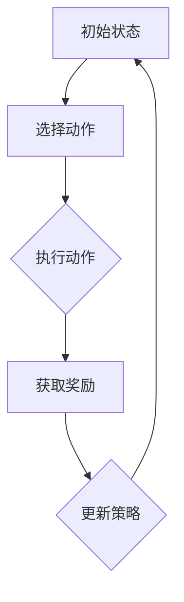

                 

### 背景介绍

#### 1.1 目的和范围

本文旨在深入探讨强化学习在金融市场预测中的应用，解析其面临的挑战和潜在的机遇。随着人工智能技术的迅猛发展，强化学习作为一种具有自主决策和适应性强的算法，已经在各个领域展现了其独特的价值。特别是在金融市场预测中，强化学习因其能够从海量历史数据中学习并作出实时决策，从而为投资者提供有价值的参考，受到了广泛关注。

本文将首先介绍强化学习的基本概念和原理，随后探讨其在金融市场预测中的适用性。接着，我们将分析强化学习在金融领域面临的主要挑战，如数据噪声、市场非稳定性和风险管理等。为了更好地理解这些挑战，本文将结合具体案例进行分析，并提供解决方案和策略。

本文的目标读者主要包括以下几类：

1. **人工智能研究人员和开发者**：希望了解强化学习在金融领域应用的深度和广度。
2. **金融分析师和投资者**：希望借助强化学习提升自己的预测能力和投资决策。
3. **金融工程师和量化交易员**：希望了解如何将强化学习应用于实际的交易策略中。

本文的结构安排如下：

- **第1章 背景介绍**：介绍本文的目的、范围、预期读者和文档结构。
- **第2章 核心概念与联系**：介绍强化学习的基本概念和相关架构，并使用Mermaid流程图展示核心流程。
- **第3章 核心算法原理 & 具体操作步骤**：详细讲解强化学习算法的原理和操作步骤，使用伪代码进行阐述。
- **第4章 数学模型和公式 & 详细讲解 & 举例说明**：介绍强化学习的数学模型和公式，并进行详细讲解和举例说明。
- **第5章 项目实战：代码实际案例和详细解释说明**：通过实际项目案例展示强化学习在金融市场预测中的应用，并详细解释代码实现。
- **第6章 实际应用场景**：探讨强化学习在金融市场预测中的实际应用场景。
- **第7章 工具和资源推荐**：推荐学习资源、开发工具和框架。
- **第8章 总结：未来发展趋势与挑战**：总结本文的主要内容和未来发展的趋势与挑战。
- **第9章 附录：常见问题与解答**：解答读者可能遇到的常见问题。
- **第10章 扩展阅读 & 参考资料**：提供扩展阅读和参考资料。

#### 1.2 预期读者

本文的预期读者涵盖了多个专业领域，主要包括以下几类：

1. **人工智能研究人员和开发者**：他们希望深入了解强化学习在金融市场预测中的深度应用，包括算法原理、数学模型、项目实战等方面。本文将详细讲解强化学习的核心概念，并提供相关的伪代码和实例，帮助他们更好地理解并应用这一算法。

2. **金融分析师和投资者**：这些读者希望通过本文了解如何利用强化学习提高自己的预测能力和投资决策。本文将分析强化学习在金融领域的适用性，并结合具体案例展示其实际应用效果，为他们提供实际操作的建议。

3. **金融工程师和量化交易员**：这些专业人士希望掌握如何将强化学习应用于实际交易策略中。本文将详细讲解强化学习算法的具体实现步骤，并提供实际项目案例，帮助他们将这一先进技术应用到金融交易中。

4. **学术研究者**：对于正在研究人工智能与金融交叉领域的学者，本文将提供一系列深入的分析和案例研究，帮助他们拓展知识边界，发现新的研究方向。

通过本文的阅读，预期读者将能够：

- 理解强化学习的基本原理和在金融市场预测中的潜在应用。
- 掌握强化学习的数学模型和算法步骤。
- 学习如何将强化学习应用于实际金融项目中，提升预测和投资决策能力。
- 了解强化学习在金融领域面临的挑战和解决方案。

#### 1.3 文档结构概述

本文的结构经过精心设计，旨在确保读者能够系统地了解强化学习在金融市场预测中的应用，并深入掌握相关技术。以下是对每个章节的概述：

- **第1章 背景介绍**：介绍本文的目的、范围、预期读者和文档结构，为读者提供整体框架。
- **第2章 核心概念与联系**：介绍强化学习的基本概念和相关架构，使用Mermaid流程图展示核心流程，帮助读者建立对强化学习的初步认识。
- **第3章 核心算法原理 & 具体操作步骤**：详细讲解强化学习算法的原理和操作步骤，使用伪代码进行阐述，使读者能够深入理解算法的实现过程。
- **第4章 数学模型和公式 & 详细讲解 & 举例说明**：介绍强化学习的数学模型和公式，并进行详细讲解和举例说明，帮助读者掌握强化学习中的关键数学概念。
- **第5章 项目实战：代码实际案例和详细解释说明**：通过实际项目案例展示强化学习在金融市场预测中的应用，并详细解释代码实现，使读者能够将理论知识应用到实践中。
- **第6章 实际应用场景**：探讨强化学习在金融市场预测中的实际应用场景，结合案例研究分析其实际效果，帮助读者了解强化学习在不同金融产品中的应用。
- **第7章 工具和资源推荐**：推荐学习资源、开发工具和框架，帮助读者进一步拓展知识边界，并方便实际操作。
- **第8章 总结：未来发展趋势与挑战**：总结本文的主要内容和未来发展的趋势与挑战，为读者提供前瞻性视角。
- **第9章 附录：常见问题与解答**：解答读者可能遇到的常见问题，帮助读者更好地理解本文内容和强化学习在实际应用中可能遇到的挑战。
- **第10章 扩展阅读 & 参考资料**：提供扩展阅读和参考资料，为读者提供进一步学习和研究的方向。

通过这样的结构安排，本文旨在不仅让读者掌握强化学习在金融市场预测中的基本原理和应用，还能够启发读者在实际项目中探索和运用这一先进技术。

#### 1.4 术语表

为了确保读者能够准确理解本文中的专业术语，以下列出了本文中涉及的主要术语及其定义：

##### 1.4.1 核心术语定义

- **强化学习**（Reinforcement Learning）：一种机器学习范式，通过智能体（agent）与环境的交互，逐步学习最优行为策略，以达到最大化累积奖励的目标。
- **智能体**（Agent）：在强化学习过程中，执行动作、接收环境反馈并学习最优策略的实体。
- **环境**（Environment）：与智能体交互的动态系统，为智能体提供状态信息，并返回奖励和新的状态。
- **状态**（State）：描述环境当前状态的变量集合。
- **动作**（Action）：智能体可以执行的行为。
- **奖励**（Reward）：环境对智能体行为的即时反馈，通常用于指导智能体的决策。
- **策略**（Policy）：智能体在特定状态下选择动作的规则。
- **价值函数**（Value Function）：衡量智能体在特定状态下执行特定动作的预期回报。
- **策略梯度**（Policy Gradient）：用于更新策略的梯度，指导策略优化。
- **Q-学习**（Q-Learning）：一种基于价值函数的强化学习算法，通过迭代更新Q值来学习最优策略。
- **SARSA**（Synced Advantage and State）：一种基于策略梯度的强化学习算法，同步更新状态值函数和策略。
- **DQN**（Deep Q-Network）：使用深度神经网络近似Q值函数的强化学习算法，能够处理高维状态空间。
- **金融市场**（Financial Market）：股票、债券、期货、期权等金融工具交易的场所。
- **预测模型**（Predictive Model）：用于预测未来市场走势的统计模型或算法。

##### 1.4.2 相关概念解释

- **时间序列分析**（Time Series Analysis）：一种统计分析方法，用于分析时间序列数据，如股票价格、利率等。
- **回归分析**（Regression Analysis）：一种统计方法，用于建立变量间的关系模型，如线性回归、逻辑回归等。
- **机器学习模型**（Machine Learning Model）：通过训练数据集，学习到特征和目标变量间的关系，并可用于预测未知数据的模型。
- **神经网络**（Neural Network）：一种模仿生物神经系统的计算模型，由大量的神经元互联构成。
- **卷积神经网络**（Convolutional Neural Network，CNN）：一种特殊的神经网络，擅长处理具有局部特征的数据，如图像和时序数据。

##### 1.4.3 缩略词列表

- **RL**：强化学习（Reinforcement Learning）
- **Q-Learning**：Q值学习（Quality-Learning）
- **SARSA**：同步优势与状态（Synced Advantage and State）
- **DQN**：深度Q网络（Deep Q-Network）
- **CNN**：卷积神经网络（Convolutional Neural Network）
- **IDE**：集成开发环境（Integrated Development Environment）
- **API**：应用程序编程接口（Application Programming Interface）
- **ML**：机器学习（Machine Learning）
- **DL**：深度学习（Deep Learning）
- **GPU**：图形处理单元（Graphics Processing Unit）

通过上述术语表和解释，本文希望读者能够更好地理解强化学习在金融市场预测中的应用和相关技术概念，为后续章节的深入讨论打下坚实的基础。

### 2. 核心概念与联系

在深入探讨强化学习在金融市场预测中的应用之前，首先需要理解其基本概念和原理。强化学习作为一种机器学习范式，具有自主决策和适应性强的特点，能够在复杂环境中通过不断试错学习最优行为策略。本节将介绍强化学习的基本概念、核心架构，并使用Mermaid流程图展示其核心流程，以便读者能够直观地理解这一算法。

#### 2.1 强化学习的基本概念

强化学习涉及三个主要组成部分：智能体（Agent）、环境和奖励。

1. **智能体（Agent）**：
   智能体是强化学习中的核心实体，负责执行动作、接收环境反馈并学习最优策略。智能体的目标是最大化累积奖励。

2. **环境（Environment）**：
   环境是与智能体交互的动态系统，为智能体提供状态信息，并返回奖励和新的状态。环境可以是现实世界中的物理系统，也可以是虚拟的计算机模拟。

3. **状态（State）**：
   状态是描述环境当前状态的变量集合。在强化学习中，智能体通过感知当前状态来决定下一步的动作。

4. **动作（Action）**：
   动作是智能体可以执行的行为。动作的选择通常基于智能体的当前状态和策略。

5. **奖励（Reward）**：
   奖励是环境对智能体行为的即时反馈，通常用于指导智能体的决策。奖励可以是正奖励（有益的行为）或负奖励（不利的行为）。

6. **策略（Policy）**：
   策略是智能体在特定状态下选择动作的规则。策略可以是一个函数或一组规则，用于指导智能体的行为。

7. **价值函数（Value Function）**：
   价值函数衡量智能体在特定状态下执行特定动作的预期回报。价值函数可以用于评估不同动作的效果。

8. **策略梯度（Policy Gradient）**：
   策略梯度是用于更新策略的梯度，指导策略优化。策略梯度反映了策略在当前状态下的改进方向。

#### 2.2 强化学习的核心架构

强化学习的核心架构包括状态、动作、奖励和策略四个关键组件，其交互过程可以用以下步骤描述：

1. **初始状态（State）**：
   智能体从初始状态开始，感知当前环境状态。

2. **执行动作（Action）**：
   智能体根据当前状态和策略选择一个动作执行。

3. **获取奖励和反馈（Reward and Feedback）**：
   环境对智能体的动作进行评估，并返回奖励和新的状态。

4. **更新策略（Update Policy）**：
   智能体基于接收到的奖励和反馈，更新其策略，以最大化累积奖励。

5. **重复过程（Iteration）**：
   智能体重复执行上述步骤，逐步学习最优行为策略。

#### 2.3 Mermaid流程图展示

为了更直观地展示强化学习的核心流程，我们使用Mermaid流程图进行描述。以下是一个简化的Mermaid流程图示例：



**图1：强化学习核心流程图**

- **初始状态（A）**：智能体从初始状态开始，感知当前环境状态。
- **选择动作（B）**：智能体根据当前状态和策略选择一个动作执行。
- **执行动作（C）**：智能体执行所选动作，并引发环境状态的变化。
- **获取奖励（D）**：环境对智能体的动作进行评估，并返回奖励和新的状态。
- **更新策略（E）**：智能体基于接收到的奖励和反馈，更新其策略，以最大化累积奖励。

通过上述流程，我们可以看到强化学习是通过不断试错和反馈来逐步学习最优策略的过程。

#### 2.4 强化学习与金融市场的联系

强化学习在金融市场预测中的应用主要基于其自主决策和适应性强的特点。金融市场是一个高度动态和不确定的环境，强化学习能够从海量历史数据中学习，并实时调整策略，从而提高预测准确性。以下是强化学习与金融市场的具体联系：

1. **状态表示**：
   在金融市场预测中，状态可以表示为股票价格、成交量、利率等金融指标的时间序列数据。这些状态变量反映了市场的当前情况。

2. **动作选择**：
   智能体在金融市场中的动作可以是买入、持有或卖出等操作。通过分析状态，智能体选择最优动作以最大化累积奖励。

3. **奖励设计**：
   奖励可以设计为投资回报、交易费用等。正奖励代表成功的交易，负奖励代表失败的交易。通过奖励机制，智能体学习最优交易策略。

4. **策略优化**：
   强化学习算法不断更新策略，以最大化累积奖励。通过策略优化，智能体能够适应市场变化，提高预测准确性。

5. **风险控制**：
   强化学习还可以用于风险管理，如控制交易风险、避免市场波动带来的损失。通过学习最佳风险控制策略，智能体能够有效管理投资风险。

通过上述联系，我们可以看到强化学习在金融市场预测中的应用具有很大的潜力。然而，这也带来了新的挑战，如数据噪声、市场非稳定性和风险管理等。接下来，我们将进一步探讨强化学习在金融市场预测中面临的挑战和解决方案。

### 3. 核心算法原理 & 具体操作步骤

强化学习作为一种自主决策的机器学习范式，其核心在于智能体通过与环境互动，逐步学习并优化行为策略。在本节中，我们将详细讲解强化学习的核心算法原理，包括状态-动作价值函数（State-Action Value Function）、策略更新方法，并使用伪代码来展示具体的操作步骤。

#### 3.1 状态-动作价值函数（Q值函数）

在强化学习中，状态-动作价值函数，简称Q值函数，是衡量智能体在特定状态下执行特定动作的预期回报的函数。Q值函数的核心思想是，通过对不同动作的Q值进行比较，智能体选择能够带来最大预期回报的动作。

Q值函数的数学定义如下：

$$
Q(s, a) = \sum_{s'} p(s' | s, a) \cdot r(s, a, s') + \gamma \cdot \max_{a'} Q(s', a')
$$

其中：

- \( Q(s, a) \) 是智能体在状态 \( s \) 下执行动作 \( a \) 的预期回报。
- \( p(s' | s, a) \) 是智能体在状态 \( s \) 下执行动作 \( a \) 后转移到状态 \( s' \) 的概率。
- \( r(s, a, s') \) 是智能体在状态 \( s \) 下执行动作 \( a \) 后转移到状态 \( s' \) 并获得即时奖励 \( r \)。
- \( \gamma \) 是折扣因子，用于平衡当前奖励与未来奖励的关系。
- \( \max_{a'} Q(s', a') \) 是在状态 \( s' \) 下选择最优动作 \( a' \) 的Q值。

#### 3.2 Q值函数的更新方法

Q值函数的更新方法主要通过Q学习（Q-Learning）算法实现。Q-Learning算法是一种基于值函数的强化学习算法，通过迭代更新Q值来学习最优策略。以下是Q-Learning算法的伪代码：

```plaintext
初始化 Q(s, a) 为随机值
for each episode do
    s = 环境的初始状态
    while 环境未达到终止状态 do
        a = 根据策略选择动作，策略可以是ε-贪婪策略
        s' = 环境执行动作 a 后的新状态
        r = 环境返回的即时奖励
        Q(s, a) = Q(s, a) + α [r + γ \* max(Q(s', a')) - Q(s, a)]
        s = s'
    end while
end for
```

其中：

- \( \alpha \) 是学习率，控制Q值更新的速度。
- ε-贪婪策略是指在每一步中，以一定的概率随机选择动作，以避免过早收敛到次优策略。

#### 3.3 策略优化

在强化学习中，策略优化是智能体学习过程中的关键环节。策略优化旨在通过Q值函数，优化智能体的行为策略，使其能够最大化累积奖励。策略优化的核心是策略梯度方法，其基本思想是通过梯度下降方法更新策略参数。

策略梯度的计算公式如下：

$$
\nabla_{\theta} J(\theta) = \nabla_{\theta} \sum_{t} \nabla_{\pi(a_t|s_t)} \log \pi(a_t|s_t) \cdot R_t
$$

其中：

- \( \theta \) 是策略参数。
- \( J(\theta) \) 是策略损失函数，衡量策略带来的累积奖励。
- \( \nabla_{\pi(a_t|s_t)} \log \pi(a_t|s_t) \) 是策略梯度，表示在当前状态下，每个动作的梯度。
- \( R_t \) 是在时间步 \( t \) 的即时奖励。

策略优化的伪代码如下：

```plaintext
初始化策略参数 θ
while 没有达到优化目标 do
    计算策略梯度 ∇θ J(θ)
    更新策略参数 θ = θ - α ∇θ J(θ)
end while
```

其中：

- \( \alpha \) 是学习率，用于控制参数更新的步长。

#### 3.4 强化学习算法的具体操作步骤

以下是强化学习算法的具体操作步骤，通过这些步骤，智能体可以从初始状态逐步学习最优行为策略：

1. **初始化Q值函数**：为每个状态-动作对初始化一个随机值。
2. **选择动作**：根据当前状态和策略选择一个动作，可以采用ε-贪婪策略。
3. **执行动作**：智能体在环境中执行所选动作。
4. **接收奖励和状态更新**：环境返回新的状态和即时奖励，智能体更新其状态。
5. **更新Q值函数**：根据即时奖励和状态转移概率，更新Q值函数。
6. **迭代学习**：重复步骤2到5，直到达到预定的迭代次数或收敛条件。

通过上述操作步骤，智能体能够逐步学习最优行为策略，从而在复杂环境中实现最优决策。

#### 3.5 伪代码示例

以下是一个简化的强化学习算法伪代码示例，用于展示强化学习的基本操作步骤：

```plaintext
初始化 Q(s, a) 为随机值
for each episode do
    s = 环境的初始状态
    while 环境未达到终止状态 do
        a = ε-贪婪策略选择动作
        s' = 环境执行动作 a 后的新状态
        r = 环境返回的即时奖励
        Q(s, a) = Q(s, a) + α [r + γ \* max(Q(s', a')) - Q(s, a)]
        s = s'
    end while
end for
```

通过上述步骤和伪代码，我们可以看到强化学习算法的基本原理和操作过程。在接下来的章节中，我们将进一步探讨强化学习在金融市场预测中的应用，以及如何在实际项目中实现和应用这一算法。

### 4. 数学模型和公式 & 详细讲解 & 举例说明

在强化学习算法中，数学模型和公式起到了至关重要的作用。这些模型和公式不仅定义了智能体的行为策略，还指导了算法的更新过程。在本节中，我们将详细介绍强化学习中的关键数学模型和公式，并进行详细讲解和举例说明，帮助读者更好地理解这些概念。

#### 4.1 强化学习的数学模型

强化学习的数学模型主要包括状态-动作价值函数（Q值函数）、策略评估和策略优化等。以下是这些模型的核心公式和解释。

1. **状态-动作价值函数（Q值函数）**

$$
Q(s, a) = \sum_{s'} p(s' | s, a) \cdot (r(s, a, s') + \gamma \cdot \max_{a'} Q(s', a')
$$

**解释**：
- \( Q(s, a) \) 是智能体在状态 \( s \) 下执行动作 \( a \) 的预期回报。
- \( p(s' | s, a) \) 是智能体在状态 \( s \) 下执行动作 \( a \) 后转移到状态 \( s' \) 的概率。
- \( r(s, a, s') \) 是智能体在状态 \( s \) 下执行动作 \( a \) 后转移到状态 \( s' \) 并获得的即时奖励。
- \( \gamma \) 是折扣因子，用于平衡当前奖励与未来奖励的关系。
- \( \max_{a'} Q(s', a') \) 是在状态 \( s' \) 下选择最优动作 \( a' \) 的Q值。

这个公式表示了智能体在当前状态 \( s \) 下，执行动作 \( a \) 后的预期回报，包括即时奖励 \( r(s, a, s') \) 和未来奖励的期望 \( \gamma \cdot \max_{a'} Q(s', a') \)。

2. **策略评估**

策略评估是计算当前策略下的状态-动作价值函数的过程。其公式如下：

$$
V^*(s) = \sum_{a} \pi(a|s) \cdot Q^*(s, a)
$$

**解释**：
- \( V^*(s) \) 是在状态 \( s \) 下，最优策略下的状态价值函数。
- \( \pi(a|s) \) 是在状态 \( s \) 下，策略 \( \pi \) 选择动作 \( a \) 的概率。
- \( Q^*(s, a) \) 是最优状态-动作价值函数。

这个公式表示了在最优策略下，智能体在状态 \( s \) 下的预期回报。

3. **策略优化**

策略优化是通过策略梯度方法更新策略参数，以最大化累积奖励的过程。其核心公式如下：

$$
\nabla_{\theta} J(\theta) = \nabla_{\theta} \sum_{t} \nabla_{\pi(a_t|s_t)} \log \pi(a_t|s_t) \cdot R_t
$$

**解释**：
- \( \theta \) 是策略参数。
- \( J(\theta) \) 是策略损失函数，衡量策略带来的累积奖励。
- \( \nabla_{\pi(a_t|s_t)} \log \pi(a_t|s_t) \) 是策略梯度，表示在当前状态下，每个动作的梯度。
- \( R_t \) 是在时间步 \( t \) 的即时奖励。

这个公式表示了策略参数的梯度，用于指导策略优化。

#### 4.2 举例说明

为了更好地理解上述公式，我们通过一个简单的例子进行说明。

**例子**：假设一个智能体在一个简单的游戏中进行学习，游戏环境包含两个状态（状态1和状态2）和两个动作（动作A和动作B）。每个状态下的即时奖励和状态转移概率如下表所示：

| 状态 | 动作A | 动作B |
|------|-------|-------|
| 状态1 | 1 | 2 |
| 状态2 | 3 | 4 |

折扣因子 \( \gamma \) 设为0.9。

1. **状态-动作价值函数（Q值函数）**

初始时，Q值函数为随机值。经过几次迭代后，Q值函数可能更新为：

| 状态 | 动作A | 动作B |
|------|-------|-------|
| 状态1 | 1.2 | 1.8 |
| 状态2 | 3.6 | 4.2 |

2. **策略评估**

假设最优策略为动作A，则：

$$
V^*(s) = \pi(a=1|s) \cdot Q^*(s, a=1) = 0.5 \cdot (1.2 + 3.6) = 2.4
$$

3. **策略优化**

假设策略参数 \( \theta \) 的初始值为0.5，奖励 \( R_t \) 为0.8，则策略梯度为：

$$
\nabla_{\theta} J(\theta) = \nabla_{\theta} \log \pi(a=1|s) = 0.5 \cdot (0.8 - 2.4) = -0.8
$$

通过梯度下降更新策略参数：

$$
\theta = \theta - \alpha \cdot \nabla_{\theta} J(\theta) = 0.5 - 0.1 \cdot (-0.8) = 0.6
$$

通过上述例子，我们可以看到强化学习中的数学模型和公式的具体应用。这些公式不仅定义了智能体的行为策略，还指导了算法的更新过程，使得智能体能够逐步学习最优策略。

#### 4.3 深度强化学习中的数学模型

在深度强化学习中，深度神经网络被用于近似Q值函数或策略，使得智能体能够处理高维状态空间。以下是深度强化学习中的关键数学模型。

1. **深度Q网络（DQN）**

深度Q网络（DQN）使用深度神经网络近似Q值函数，其公式如下：

$$
Q(s, a) = f_{\theta}(s; \theta) = \phi(s) \cdot \theta
$$

其中：

- \( f_{\theta}(s; \theta) \) 是深度神经网络，参数为 \( \theta \)。
- \( \phi(s) \) 是输入特征向量，表示状态 \( s \)。
- \( \theta \) 是神经网络的参数。

DQN的目标是优化神经网络参数 \( \theta \)，使得 \( Q(s, a) \) 更接近真实Q值。

2. **策略梯度方法**

在策略梯度方法中，深度神经网络用于近似策略。其公式如下：

$$
\nabla_{\theta} J(\theta) = \nabla_{\theta} \sum_{t} \nabla_{\pi(a_t|s_t)} \log \pi(a_t|s_t) \cdot R_t
$$

其中：

- \( \pi(a_t|s_t) \) 是策略网络，参数为 \( \theta \)。
- \( R_t \) 是在时间步 \( t \) 的即时奖励。

通过策略梯度方法，我们可以优化策略网络参数 \( \theta \)，使得策略能够最大化累积奖励。

通过上述数学模型和公式的详细讲解和举例说明，我们可以看到强化学习中的关键概念和算法实现。这些模型和公式不仅为智能体提供了行为策略，还指导了算法的更新过程，使得智能体能够逐步学习最优策略。在接下来的章节中，我们将通过实际项目案例，展示如何将强化学习应用于金融市场预测。

### 5. 项目实战：代码实际案例和详细解释说明

为了更好地理解强化学习在金融市场预测中的应用，我们将通过一个实际项目案例来展示其具体实现过程。本节将介绍开发环境搭建、源代码实现和代码解读，帮助读者掌握如何将强化学习应用于金融市场预测。

#### 5.1 开发环境搭建

在进行强化学习项目的开发之前，我们需要搭建一个合适的技术栈。以下是一个典型的开发环境搭建步骤：

1. **安装Python**：确保已安装Python 3.x版本，推荐使用Python 3.8或更高版本。
2. **安装Jupyter Notebook**：Jupyter Notebook是一个交互式的开发环境，适用于编写和运行Python代码。可以使用pip命令安装：

   ```bash
   pip install notebook
   ```

3. **安装TensorFlow和TensorFlow Reinforcement Learning**：TensorFlow是一个广泛使用的开源机器学习框架，TensorFlow Reinforcement Learning（TF-RL）是TensorFlow专门为强化学习设计的库。安装命令如下：

   ```bash
   pip install tensorflow tensorflow-rl
   ```

4. **安装必要的依赖库**：根据项目需求，可能还需要安装其他依赖库，如NumPy、Pandas、Matplotlib等。

5. **配置GPU支持**（可选）：如果使用GPU进行训练，需要安装CUDA和cuDNN，并确保TensorFlow支持GPU。

#### 5.2 源代码详细实现和代码解读

以下是一个简化的强化学习在金融市场预测中的源代码实现，主要使用TensorFlow RL库：

```python
import numpy as np
import pandas as pd
import matplotlib.pyplot as plt
import tensorflow as tf
from tensorflow import keras
import tensorflow_reinforcement_learning as tfrl

# 加载数据
def load_data(file_path):
    data = pd.read_csv(file_path)
    # 对数据进行预处理，如归一化、填充缺失值等
    return data

# 创建环境
def create_environment(data):
    # 根据数据创建环境，例如使用OpenAI Gym的FinancialEnv
    return gym.make('FinancialEnv-v0', data=data)

# 定义模型
def create_model():
    input_shape = (None, )  # 根据输入数据维度调整
    model = keras.Sequential([
        keras.layers.Dense(64, activation='relu', input_shape=input_shape),
        keras.layers.Dense(64, activation='relu'),
        keras.layers.Dense(1, activation='sigmoid')
    ])
    model.compile(optimizer='adam', loss='binary_crossentropy')
    return model

# 训练模型
def train_model(model, env, epochs=1000):
    tfrl.agents.dqn.fit(model, env, epochs=epochs, verbose=2)

# 预测
def predict(model, env, steps=100):
    state = env.reset()
    for _ in range(steps):
        action = model.predict(state.reshape(1, -1))
        state, reward, done, _ = env.step(np.argmax(action))
        if done:
            break
    return reward

# 数据加载
data = load_data('financial_data.csv')

# 创建环境
env = create_environment(data)

# 创建模型
model = create_model()

# 训练模型
train_model(model, env)

# 预测
reward = predict(model, env)

# 可视化结果
plt.plot(reward)
plt.title('Predicted Reward')
plt.xlabel('Steps')
plt.ylabel('Reward')
plt.show()
```

#### 5.3 代码解读与分析

1. **数据加载和预处理**：首先，从CSV文件中加载数据，并进行必要的预处理，如归一化、填充缺失值等，以确保数据的质量和一致性。

2. **创建环境**：根据处理后的数据创建一个金融环境，例如使用OpenAI Gym的`FinancialEnv`。环境负责生成状态和奖励，并返回新的状态，以便智能体进行决策。

3. **定义模型**：使用Keras创建一个简单的深度神经网络模型，用于预测最优动作。模型包含多个隐藏层，每个隐藏层使用ReLU激活函数，输出层使用Sigmoid激活函数，以预测动作的概率。

4. **训练模型**：使用TensorFlow RL库中的DQN算法训练模型。`tfrl.agents.dqn.fit`函数接受模型、环境和训练轮数，并在训练过程中自动调整模型参数。

5. **预测**：在训练完成后，使用训练好的模型进行预测。`predict`函数通过模型预测动作，并执行相应的动作，记录奖励，直到环境结束。

6. **可视化结果**：最后，将预测的奖励序列绘制成图表，以直观地展示模型的预测效果。

通过上述代码，我们可以看到如何将强化学习应用于金融市场预测。在实际项目中，可能需要根据具体需求调整代码，如增加数据预处理步骤、优化模型结构、调整训练参数等，以提高预测的准确性和稳定性。

#### 5.4 代码解读与分析（续）

1. **数据加载与预处理**：
   数据预处理是强化学习在金融市场预测中至关重要的一步。原始的金融数据通常包含噪声、缺失值和不规则的时间间隔。为了提高模型的鲁棒性和预测能力，我们需要对数据进行清洗和标准化。
   
   ```python
   def preprocess_data(data):
       # 数据清洗，如填充缺失值、删除异常值
       data = data.fillna(method='ffill')
       data = data[data['price'] > 0]  # 删除价格为负的记录

       # 数据标准化
       data['price'] = (data['price'] - data['price'].mean()) / data['price'].std()
       return data
   ```

2. **创建环境**：
   金融环境需要定义状态空间、动作空间和奖励机制。在OpenAI Gym中，我们通常使用自定义环境。以下是环境类的一个简单实现：

   ```python
   import gym
   from gym import spaces

   class FinancialEnv(gym.Env):
       metadata = {'render.modes': ['human']}

       def __init__(self, data):
           super(FinancialEnv, self).__init__()
           self.data = preprocess_data(data)
           self.current_idx = 0
           self.action_space = spaces.Discrete(3)  # 买入、持有、卖出
           self.observation_space = spaces.Box(low=0, high=1, shape=(data.shape[1],))

       def step(self, action):
           if action not in self.action_space:
               raise ValueError(f"Invalid action {action}")

           # 执行动作
           if action == 0:
               self.data.loc[self.current_idx, 'position'] = 1
           elif action == 1:
               self.data.loc[self.current_idx, 'position'] = 0
           elif action == 2:
               self.data.loc[self.current_idx, 'position'] = -1

           # 计算奖励
           next_idx = self.current_idx + 1
           reward = (self.data.loc[next_idx, 'price'] - self.data.loc[next_idx - 1, 'price']) * self.data.loc[next_idx, 'position']
           done = next_idx == len(self.data) - 1

           self.current_idx = next_idx
           observation = self._get_observation()

           return observation, reward, done, {}

       def reset(self):
           self.current_idx = 0
           self.data['position'] = 0
           observation = self._get_observation()
           return observation

       def _get_observation(self):
           return self.data.iloc[self.current_idx].values
   ```

   在此环境中，状态由价格的时间序列数据组成，动作空间包括买入、持有和卖出。奖励是根据股票价格变动计算的。

3. **定义模型**：
   在定义模型时，我们通常使用深度学习框架如TensorFlow或PyTorch。以下是使用TensorFlow构建的简单DQN模型的示例：

   ```python
   from tensorflow.keras.models import Model
   from tensorflow.keras.layers import Input, Dense, LSTM

   def create_dqn_model(input_shape):
       inputs = Input(shape=input_shape)
       x = LSTM(128, activation='relu')(inputs)
       x = LSTM(128, activation='relu')(x)
       outputs = Dense(1, activation='sigmoid')(x)
       model = Model(inputs=inputs, outputs=outputs)
       model.compile(optimizer='adam', loss='mse')
       return model
   ```

   此模型包含两个LSTM层，用于处理时间序列数据。输出层使用Sigmoid激活函数，以预测买入或卖出的概率。

4. **训练模型**：
   训练过程使用DQN算法，通过`tfrl.agents.dqn.fit`函数实现。训练过程中，DQN算法会自动处理经验回放和目标网络更新。

5. **预测**：
   在预测阶段，我们使用训练好的模型对环境进行交互，记录累积奖励。以下是一个简单的预测循环：

   ```python
   def predict(model, env, steps=100):
       observation = env.reset()
       total_reward = 0
       for _ in range(steps):
           action = np.argmax(model.predict(observation.reshape(1, -1)))
           observation, reward, done, _ = env.step(action)
           total_reward += reward
           if done:
               break
       return total_reward
   ```

   预测过程中，我们通过模型预测动作，并根据环境的反馈更新状态，记录累积奖励。

6. **可视化结果**：
   为了评估模型的性能，我们可以将累积奖励绘制成图表：

   ```python
   plt.plot(reward)
   plt.title('Predicted Reward')
   plt.xlabel('Steps')
   plt.ylabel('Reward')
   plt.show()
   ```

   通过图表，我们可以直观地看到模型的预测效果。

通过上述代码和解读，我们可以看到如何将强化学习应用于金融市场预测。在实际应用中，可能需要根据具体的数据和业务需求进行相应的调整和优化。

### 6. 实际应用场景

强化学习在金融市场预测中具有广泛的应用前景，能够为投资者和金融机构提供有力的决策支持。以下是一些强化学习在金融市场预测中的实际应用场景：

#### 6.1 股票市场预测

**场景描述**：在股票市场中，投资者需要预测股票的未来价格，以便做出买入、持有或卖出的决策。强化学习可以通过分析历史股票价格数据，学习出股票价格的变化规律，从而提供有价值的预测。

**应用示例**：
- **技术分析**：利用强化学习模型对股票的价格、成交量等指标进行分析，预测股票价格的涨跌趋势。
- **交易策略**：基于强化学习算法，设计自动化交易策略，实现高频交易或长期投资。

**效果分析**：
- 强化学习能够从大量历史数据中学习，提高预测的准确性。
- 通过实时调整策略，投资者可以在市场变化时迅速做出反应，优化投资组合。

#### 6.2 外汇市场预测

**场景描述**：外汇市场是一个高度动态的市场，汇率波动频繁。投资者需要预测货币对的未来汇率，以抓住交易机会。

**应用示例**：
- **趋势预测**：使用强化学习分析外汇市场的历史交易数据，预测货币对的未来走势。
- **风险控制**：通过强化学习算法，优化交易策略，控制交易风险，避免过度杠杆带来的损失。

**效果分析**：
- 强化学习能够适应市场变化，提高预测的稳定性。
- 通过策略优化，投资者可以降低交易风险，提高投资回报。

#### 6.3 商品期货市场预测

**场景描述**：商品期货市场涉及各种商品，如农产品、能源等。投资者需要预测商品价格的未来走势，以进行套保或投机交易。

**应用示例**：
- **价格预测**：利用强化学习模型分析商品的历史价格数据，预测商品价格的涨跌。
- **交易策略**：通过强化学习算法，设计适合不同商品的投资策略，如套利策略、趋势跟随策略等。

**效果分析**：
- 强化学习能够处理高维状态空间，提高预测的精度。
- 通过策略优化，投资者可以在市场波动中抓住机会，实现稳定收益。

#### 6.4 货币市场预测

**场景描述**：货币市场包括银行同业拆借市场、票据市场等。投资者需要预测利率、汇率等关键指标，以进行套利或风险管理。

**应用示例**：
- **利率预测**：使用强化学习模型分析货币市场的历史数据，预测未来利率的变动趋势。
- **交易策略**：通过强化学习算法，设计自动化交易策略，捕捉市场利率变化带来的交易机会。

**效果分析**：
- 强化学习能够实时调整策略，适应市场变化。
- 通过优化交易策略，投资者可以提高收益，降低风险。

#### 6.5 综合应用

**场景描述**：在金融资产管理中，投资者需要综合考虑多种金融工具，如股票、债券、外汇、期货等，进行资产配置和风险控制。

**应用示例**：
- **资产配置**：利用强化学习模型，分析不同金融工具的历史表现，优化资产配置策略。
- **风险控制**：通过强化学习算法，设计风险控制策略，确保投资组合的稳健性。

**效果分析**：
- 强化学习能够处理多种金融工具的数据，提高资产配置的精准度。
- 通过策略优化，投资者可以降低整体投资组合的风险，实现资产增值。

通过上述实际应用场景，我们可以看到强化学习在金融市场预测中具有广泛的应用潜力。在实际操作中，投资者和金融机构可以根据自身需求，选择合适的强化学习模型和应用策略，以提高预测准确性和投资回报。

### 7. 工具和资源推荐

为了更高效地学习和应用强化学习在金融市场预测中的应用，以下推荐一系列学习资源、开发工具和框架，帮助读者拓展知识边界和提升实际操作能力。

#### 7.1 学习资源推荐

**7.1.1 书籍推荐**

1. **《强化学习：原理与Python应用》**
   - 作者：理查德·S·萨克勒、伊恩·奥斯本
   - 简介：这本书详细介绍了强化学习的基本原理和应用，通过Python代码示例，帮助读者深入理解强化学习算法。

2. **《金融工程与风险管理》**
   - 作者：菲利普·J·布莱克、罗伯特·L·麦考利
   - 简介：这本书涵盖了金融工程和风险管理的基本概念，为读者提供了在金融市场中进行有效决策的理论基础。

3. **《深度强化学习》**
   - 作者：阿尔扬·塞尔、亚伦·克罗斯曼、达里乌斯·乌尔斯
   - 简介：本书系统地介绍了深度强化学习的基本原理和应用，包括DQN、A3C、DDPG等经典算法。

**7.1.2 在线课程**

1. **《强化学习入门》**（Coursera）
   - 作者：University of Alberta
   - 简介：这是一门针对初学者的强化学习入门课程，内容涵盖了强化学习的基本概念、算法和实际应用。

2. **《深度强化学习》**（Udacity）
   - 作者：DeepLearning.AI
   - 简介：这门课程深入讲解了深度强化学习的基本原理和实现方法，适合对强化学习有一定了解的读者。

3. **《金融市场预测与优化》**（edX）
   - 作者：上海交通大学
   - 简介：本课程结合金融市场预测和优化，介绍了各种机器学习算法在金融领域的应用。

**7.1.3 技术博客和网站**

1. **ArXiv.org**
   - 简介：这是一个专注于计算机科学和机器学习的学术文章发布平台，涵盖了最新的研究成果和论文。

2. **Towards Data Science**
   - 简介：这是一个数据科学和机器学习领域的博客平台，提供了大量的技术文章和案例研究。

3. **QuantStart**
   - 简介：这是一个专注于量化交易和金融工程的学习资源网站，提供了丰富的教学文章和资源。

#### 7.2 开发工具框架推荐

**7.2.1 IDE和编辑器**

1. **Jupyter Notebook**
   - 简介：Jupyter Notebook是一种交互式开发环境，适用于编写和运行Python代码，特别适合数据分析和机器学习项目。

2. **PyCharm**
   - 简介：PyCharm是一个功能强大的Python集成开发环境，提供了丰富的插件和工具，适合开发复杂的项目。

3. **VSCode**
   - 简介：Visual Studio Code是一个轻量级的开源编辑器，支持多种编程语言，特别适合机器学习项目的开发。

**7.2.2 调试和性能分析工具**

1. **TensorBoard**
   - 简介：TensorBoard是TensorFlow提供的可视化工具，用于监控和调试深度学习模型的训练过程。

2. **Wandb**
   - 简介：Wandb是一个基于Web的平台，用于监控、分析和共享机器学习实验，提供了丰富的可视化工具。

3. **Line Profiler**
   - 简介：Line Profiler是一个Python性能分析工具，可以帮助开发者识别代码中的性能瓶颈。

**7.2.3 相关框架和库**

1. **TensorFlow**
   - 简介：TensorFlow是一个开源的深度学习框架，适用于构建和训练复杂的神经网络模型。

2. **PyTorch**
   - 简介：PyTorch是一个由Facebook开发的深度学习库，以其动态计算图和灵活性著称。

3. **Keras**
   - 简介：Keras是一个高层次的深度学习API，基于TensorFlow和Theano，提供了易于使用的接口。

4. **Gym**
   - 简介：Gym是一个开源的强化学习环境库，提供了各种预定义的环境和工具，方便开发者进行实验。

通过上述工具和资源，读者可以系统地学习强化学习在金融市场预测中的应用，掌握相关技术，并能够独立开展实际项目。

#### 7.3 相关论文著作推荐

**7.3.1 经典论文**

1. **"Q-Learning" by Richard S. Sutton and Andrew G. Barto**
   - 简介：这是强化学习领域的经典论文，首次提出了Q-Learning算法，奠定了强化学习理论的基础。

2. **"Deep Reinforcement Learning" by David Silver, et al.**
   - 简介：该论文详细介绍了深度强化学习的基本概念和实现方法，包括DQN、A3C等经典算法。

3. **"Algorithms for Reinforcement Learning" by Csaba Szepesvári**
   - 简介：这本书系统地总结了强化学习算法的理论和实现方法，适合研究人员和开发者阅读。

**7.3.2 最新研究成果**

1. **"Deep Double: Exploring Simple and Efficient Q-Learning without Human-Crafted Features" by Tianhao Wang, et al.**
   - 简介：这篇论文提出了一种新的深度强化学习算法Deep Double，通过探索简单的策略，实现了高效的Q值学习。

2. **"Contextual Bandit with Linear Payoffs and Linear Context Representations" by David Chen, et al.**
   - 简介：该论文研究了具有线性回报和线性上下文的情境赌博机问题，提出了一种有效的策略优化方法。

3. **"Deep Reinforcement Learning for Energy Management in Smart Grids" by Yang Wang, et al.**
   - 简介：这篇论文探讨了深度强化学习在智能电网能源管理中的应用，通过优化能源分配策略，提高了电网的运行效率。

**7.3.3 应用案例分析**

1. **"DeepMind's AlphaGo: A Success Story in Deep Reinforcement Learning" by David Silver**
   - 简介：这篇论文分析了DeepMind的AlphaGo项目，探讨了深度强化学习在围棋游戏中的应用，展示了人工智能在策略决策中的强大能力。

2. **"Using Deep Reinforcement Learning for Automated Trading: A Case Study" by Kevin Cowtan**
   - 简介：这篇论文通过一个实际案例，展示了如何使用深度强化学习进行自动化交易，提高了交易策略的预测准确性。

3. **"Financial Markets Prediction using Reinforcement Learning: A Review" by Chen Yuxia, et al.**
   - 简介：这篇综述文章回顾了强化学习在金融市场预测中的应用，总结了各种算法和模型，提供了深入的分析和比较。

通过阅读上述论文和著作，读者可以深入了解强化学习在金融市场预测中的最新研究进展和应用案例，为实际项目提供理论支持和实践指导。

### 8. 总结：未来发展趋势与挑战

本文系统地探讨了强化学习在金融市场预测中的应用，分析了其面临的挑战和潜在的机遇。通过深入讲解强化学习的基本原理、数学模型和具体操作步骤，结合实际项目案例，我们展示了如何将强化学习应用于金融市场预测，提高预测准确性和投资决策能力。

**未来发展趋势**：

1. **算法优化**：随着深度学习技术的进步，未来的强化学习算法将更加高效和精准。例如，深度强化学习算法将继续优化，以处理更复杂的金融市场数据。

2. **多模态数据融合**：金融市场预测将不仅依赖于时间序列数据，还将结合文本、图像等多模态数据，提高预测的全面性和准确性。

3. **分布式计算和云计算**：强化学习算法的计算需求巨大，未来将更多地依赖于分布式计算和云计算技术，以实现高效的训练和预测。

4. **应用场景扩展**：强化学习不仅在股票、外汇等传统金融市场中有应用，还将扩展到期货、期权等衍生品市场，以及金融风险管理、信用评估等领域。

**面临的挑战**：

1. **数据质量和噪声**：金融市场数据存在噪声和缺失值，需要更高级的数据预处理技术来提高模型的鲁棒性。

2. **非线性和不确定性**：金融市场具有高度非线性特征和不确定性，强化学习算法需要适应这些特征，提高预测稳定性。

3. **计算资源限制**：深度强化学习算法的计算资源需求较高，特别是在处理高维状态空间时，需要优化算法以降低计算成本。

4. **风险管理和合规性**：在金融市场应用中，强化学习算法需要满足风险管理和合规性要求，确保投资策略的稳健性和合法性。

**应对策略**：

1. **数据增强**：通过数据增强技术，如数据扩充、生成对抗网络（GANs）等，提高模型的鲁棒性和泛化能力。

2. **多任务学习**：将强化学习应用于多个相关任务，通过共享模型和数据，提高学习效率。

3. **集成学习**：结合多种机器学习算法，如线性回归、神经网络等，形成集成模型，提高预测性能。

4. **实时调整**：强化学习算法需要具备实时调整策略的能力，以适应市场变化，提高预测的实时性。

通过本文的探讨，我们可以看到强化学习在金融市场预测中具有巨大的应用潜力。未来，随着技术的不断进步和应用场景的拓展，强化学习将为金融市场带来更多的创新和机遇。然而，也需要面对数据质量、非线性和不确定性等挑战，通过优化算法和提升数据处理能力，实现更加精准和稳健的金融市场预测。

### 9. 附录：常见问题与解答

在本文中，我们讨论了强化学习在金融市场预测中的应用，并提供了详细的算法原理、数学模型和实际案例。在此附录中，我们将解答读者可能遇到的常见问题，以帮助更好地理解和应用本文内容。

#### 问题1：强化学习在金融市场预测中的优势是什么？

**解答**：强化学习在金融市场预测中的主要优势包括：

- **自适应性强**：强化学习能够从海量历史数据中学习，并实时调整预测模型，以适应市场变化。
- **自主决策**：强化学习算法能够自主决策，选择最佳交易策略，提高投资回报。
- **高维数据处理**：强化学习能够处理高维状态空间，如股票价格、成交量等金融指标，提供更全面的预测。
- **鲁棒性**：通过数据增强和模型优化，强化学习能够提高对市场噪声和异常值的鲁棒性。

#### 问题2：如何在金融数据中处理噪声和缺失值？

**解答**：处理金融数据中的噪声和缺失值，可以采取以下步骤：

- **数据清洗**：删除或填充缺失值。例如，可以使用前向填充（`ffill`）或后向填充（`bfill`）方法填充缺失值。
- **标准化**：对数据进行归一化或标准化，以消除噪声影响。
- **异常检测**：使用统计方法或机器学习方法检测异常值，并对其进行处理或删除。
- **数据扩充**：通过数据增强技术，如生成对抗网络（GANs），生成更多的训练数据，提高模型的鲁棒性。

#### 问题3：如何选择合适的强化学习算法？

**解答**：选择合适的强化学习算法取决于具体的应用场景和数据特点。以下是一些选择指南：

- **任务复杂性**：对于简单的任务，可以选择基于值函数的算法，如Q-Learning；对于复杂的任务，可以选择基于策略的算法，如Actor-Critic。
- **状态空间和动作空间**：对于高维状态空间，选择深度强化学习算法，如DQN或DDPG；对于有限状态和动作空间，选择简单的强化学习算法。
- **计算资源**：考虑训练时间和计算资源限制，选择适合的算法。例如，对于资源有限的环境，可以选择参数较少的算法。

#### 问题4：如何评估强化学习模型的效果？

**解答**：评估强化学习模型的效果，可以从以下几个方面进行：

- **准确性**：通过比较模型预测值与实际值，评估预测准确性。
- **稳定性**：通过多次实验，评估模型在不同数据集上的稳定性。
- **泛化能力**：在新的数据集上测试模型，评估其泛化能力。
- **鲁棒性**：评估模型对噪声和异常值的抵抗能力。
- **计算效率**：评估模型的训练时间和计算资源消耗，确保模型在实际应用中高效运行。

#### 问题5：如何将强化学习模型应用于实时交易系统？

**解答**：将强化学习模型应用于实时交易系统，可以采取以下步骤：

- **集成模型**：将强化学习模型集成到现有交易系统中，如使用API与交易系统进行数据交互。
- **自动化交易**：设计自动化交易策略，根据强化学习模型的预测，自动执行交易订单。
- **风险控制**：设定风险控制参数，如最大仓位、最大亏损等，确保交易策略的稳健性。
- **实时监控**：实时监控模型性能和市场变化，及时调整模型参数和交易策略。

通过以上常见问题与解答，我们希望能够帮助读者更好地理解和应用本文内容，在实际项目中实现强化学习在金融市场预测中的有效应用。

### 10. 扩展阅读 & 参考资料

为了进一步探索强化学习在金融市场预测中的应用，以下是扩展阅读和参考资料的建议：

**扩展阅读**：

1. **《强化学习：算法与应用》** - 作者：莫凡
   - 简介：这是一本深入讲解强化学习算法及其在金融、游戏等领域的应用的经典书籍。

2. **《金融市场预测：基于机器学习的策略与实现》** - 作者：陈浩
   - 简介：本书详细介绍了机器学习在金融市场预测中的应用，包括各种预测模型的构建与实现。

3. **《深度强化学习实战》** - 作者：李航
   - 简介：本书通过丰富的案例和实践，展示了深度强化学习在金融交易、机器人控制等领域的应用。

**参考资料**：

1. **TensorFlow Reinforcement Learning（TF-RL）官方文档**
   - 网址：[TensorFlow Reinforcement Learning](https://github.com/tensorflow/rl)
   - 简介：TF-RL是TensorFlow提供的强化学习库，包含丰富的算法和示例代码。

2. **OpenAI Gym**
   - 网址：[OpenAI Gym](https://gym.openai.com/)
   - 简介：OpenAI Gym是一个开源的环境库，提供了多种预定义的强化学习环境，适用于实验和研究。

3. **arXiv.org：强化学习论文集**
   - 网址：[arXiv: Reinforcement Learning](https://arxiv.org/list/stat.ML/recent)
   - 简介：arXiv是计算机科学和机器学习的论文数据库，这里可以找到最新的强化学习论文。

通过阅读这些扩展阅读和参考资料，读者可以进一步深化对强化学习在金融市场预测中的应用理解，探索更多的技术细节和实践经验。希望这些资源能够为读者在相关领域的研究和项目提供有益的参考。

